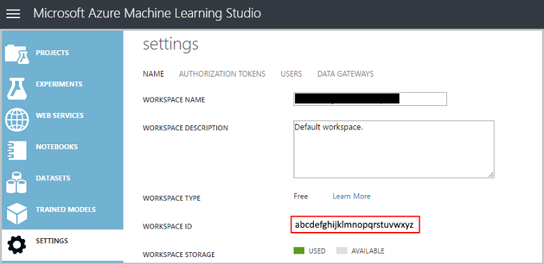

<properties 
    pageTitle="Daten Wissenschaft auf Linux Daten Wissenschaft virtuellen Computern | Microsoft Azure" 
    description="So verschiedene allgemeine Daten Wissenschaft Aufgaben mit den Linux Daten Wissenschaft virtuellen Computer ausgeführt werden." 
    services="machine-learning"
    documentationCenter="" 
    authors="bradsev" 
    manager="jhubbard" 
    editor="cgronlun"/>

<tags 
    ms.service="machine-learning" 
    ms.workload="data-services" 
    ms.tgt_pltfrm="na" 
    ms.devlang="na" 
    ms.topic="article" 
    ms.date="09/12/2016" 
    ms.author="bradsev;paulsh" />

# Daten Wissenschaft auf Linux Daten Wissenschaft virtuellen Computern

Diese exemplarische Vorgehensweise veranschaulicht die mehrere allgemeine Daten Wissenschaft Aufgaben mit den Linux Daten Wissenschaft virtuellen Computer ausführen. Die Linux Daten Wissenschaft virtuellen Computern (DSVM) ist Abbild eines virtuellen Computers auf Azure, die mit einer Sammlung von Tools für Daten Analytics und Computer-Schulung gängige vorinstalliert ist zur Verfügung. Die wichtigsten Software-Komponenten werden im Thema [Bereitstellen von Linux Daten Wissenschaft virtuellen Computers](machine-learning-data-science-linux-dsvm-intro.md) aufgeschlüsselt. Das Bild virtueller Computer erleichtert die Schritte Daten Wissenschaft in Minuten, ohne zu installieren und Konfigurieren der einzelnen Tools einzeln ausführen. Sie können einfach skalieren von den virtuellen Computer, falls erforderlich, und beenden sie nicht in verwenden. Somit ist diese Ressource flexible und Kosten effiziente. 

Die Wissenschaft Datentasks gezeigt in dieser exemplarische Vorgehensweise folgen die Schritte in der [Teamwebsite Daten Wissenschaft Prozess](https://azure.microsoft.com/documentation/learning-paths/data-science-process/). Dieses Verfahren bietet einen systematischen Ansatz für Wissenschaft Daten, die Teams von Daten Wissenschaftler zu innerhalb des Lebenszyklus der Erstellen von intelligenter Clientanwendungen Effektivere Kommunikation ermöglicht. Wissenschaft von Daten stellt eine iterative Framework auch für Wissenschaft Daten, die durch eine Einzelperson eingehalten werden kann.

Wir analysieren [Spambase](https://archive.ics.uci.edu/ml/datasets/spambase) Dataset in dieser Anleitung erfahren. Dies ist eine Reihe von e-Mails, die als Spam oder Schinken (d. h., sie sind nicht Spam), gekennzeichnet sind und auch enthält einige Statistiken auf den Inhalt, der die e-Mail-Nachrichten. Die im Lieferumfang von Statistiken werden in die nächste, aber die einzelnen Abschnitte erläutert. 

## Erforderliche Komponenten

Bevor Sie eine Linux Daten Wissenschaft virtuellen Computers verwenden können, benötigen Sie Folgendes:

- Ein **Azure-Abonnement**. Wenn Sie nicht bereits eine verfügen, finden Sie unter [Erstellen heute ein kostenloses Azure Konto](https://azure.microsoft.com/free/).
- Eine [**Linux Daten Wissenschaft virtueller Computer**](https://azure.microsoft.com/marketplace/partners/microsoft-ads/linux-data-science-vm). Informationen über die Bereitstellung von diesem virtuellen Computer finden Sie unter [Bereitstellen von Linux Daten Wissenschaft virtuellen Computers](machine-learning-data-science-linux-dsvm-intro.md). 
- [X2Go](http://wiki.x2go.org/doku.php) auf Ihrem Computer installiert und eine XFCE Sitzung geöffnet. Informationen zum Installieren und Konfigurieren einer **X2Go Client**finden Sie unter [Installieren und Konfigurieren von X2Go Client](machine-learning-data-science-linux-dsvm-intro.md#Installing-and-configuring-X2Go-client). 
- Ein **AzureML Konto**. Wenn Sie eine, auf der [Homepage der AzureML](https://studio.azureml.net/)nach neuen registrieren bereits besitzen. Es gibt eine Stufe kostenlosen Verwendung Ihnen beim Einstieg helfen.

## Laden Sie das Dataset spambase

[Spambase](https://archive.ics.uci.edu/ml/datasets/spambase) Dataset ist eine relativ kleine Gruppe von Daten, die nur 4601 Beispiele enthält. Dies ist eine geeignete Größe beim veranschaulichen, dass einige der wichtigsten Features von den Daten Wissenschaft virtuellen Computer dargestelltes behält der benötigten Ressourcen bequeme verwendet.

>[AZURE.NOTE] Diese exemplarische Vorgehensweise wurde auf einer D2 Version 2 Fenstergröße Linux Daten Wissenschaft virtuellen Computern erstellt. Diese Größe DSVM ist die Verfahren in diesem Exemplarische Vorgehensweise zu verarbeiten.

Wenn Sie mehr Speicherplatz benötigen, können weitere Datenträger erstellen und verbinden Sie sie mit der virtuellen Computer. Diese Datenträger verwenden beständigen Azure-Speicher, damit ihre Daten gewahrt werden, auch wenn der Server aufgrund von Ändern der Größe reprovisioned ist oder beendet. Um einen Datenträger hinzufügen, und ordnen sie Sie Ihrem virtuellen Computer, Anweisungen Sie die in [Datenträger zu eines Linux virtuellen Computers hinzufügen](../virtual-machines/virtual-machines-linux-add-disk.md). Diese Schritte ausführen, die Azure Line-Benutzeroberfläche (Azure CLI), die auf die DSVM bereits installiert ist. Daher können diese Verfahren vollständig aus dem virtuellen Computer selbst vorgenommen werden. Eine weitere Möglichkeit zum Vergrößern Speicher besteht darin, [Azure Dateien](../storage/storage-how-to-use-files-linux.md)zu verwenden.

Zum Herunterladen der Daten öffnen Sie ein terminal-Fenster zu, und führen Sie diesen Befehl aus:

    wget http://archive.ics.uci.edu/ml/machine-learning-databases/spambase/spambase.data

Die heruntergeladene Datei hat eine Kopfzeile keinen wir eine andere Datei erstellen, eine Kopfzeile aufweist. Führen Sie diesen Befehl, um eine Datei mit der entsprechenden Überschriften zu erstellen:

    echo 'word_freq_make, word_freq_address, word_freq_all, word_freq_3d,word_freq_our, word_freq_over, word_freq_remove, word_freq_internet,word_freq_order, word_freq_mail, word_freq_receive, word_freq_will,word_freq_people, word_freq_report, word_freq_addresses, word_freq_free,word_freq_business, word_freq_email, word_freq_you, word_freq_credit,word_freq_your, word_freq_font, word_freq_000, word_freq_money,word_freq_hp, word_freq_hpl, word_freq_george, word_freq_650, word_freq_lab,word_freq_labs, word_freq_telnet, word_freq_857, word_freq_data,word_freq_415, word_freq_85, word_freq_technology, word_freq_1999,word_freq_parts, word_freq_pm, word_freq_direct, word_freq_cs, word_freq_meeting,word_freq_original, word_freq_project, word_freq_re, word_freq_edu,word_freq_table, word_freq_conference, char_freq_semicolon, char_freq_leftParen,char_freq_leftBracket, char_freq_exclamation, char_freq_dollar, char_freq_pound, capital_run_length_average,capital_run_length_longest, capital_run_length_total, spam' > headers

Anschließend verkettet die beiden Dateien zusammen mit dem Befehl aus:

    cat spambase.data >> headers
    mv headers spambaseHeaders.data

Das Dataset weist verschiedene Typen von Statistiken auf jede e-Mail an: 

- Spalten wie ***Word\_x\_WORD*** zur Angabe des prozentualen von Wörtern in der e-Mail, die *WORD*entsprechen. Angenommen, wenn *Word\_x\_stellen* 1 ist, und klicken Sie dann 1 % aller Wörter in der e-Mail *Stellen*wurden. 
- Spalten wie ***Zeichen\_x\_Zeichen*** zur Angabe des prozentualen aller Zeichen in der e-Mail, die *Zeichen*wurden. 
- ***großes\_ausführen\_Länge\_längsten*** ist die längste Länge einer Sequenz der Großbuchstaben. 
- ***großes\_ausführen\_Länge\_Mittelwert*** ist die durchschnittliche alle Folgen von Großbuchstaben. 
- ***großes\_ausführen\_Länge\_total*** ist die Gesamtlänge der alle Folgen von Großbuchstaben. 
- ***Spam*** gibt an, ob die e-Mail Spam eingestuft wurde (1 = 0 Spam = nicht Spam).

## Durchsuchen Sie das Dataset mit Microsoft R öffnen

Lassen Sie uns sehen Sie sich die Daten, und führen Sie einige grundlegende Computer Lernen mit R. Die Daten für Wissenschaft virtueller Computer im Lieferumfang von [Microsoft R öffnen](https://mran.revolutionanalytics.com/open/) vorinstalliert ist. Die multithreaded mathematischen Bibliotheken in dieser Version von R bieten eine bessere Leistung als verschiedene Single threaded Versionen. Microsoft R öffnen bietet Reproduzierbarkeit auch mithilfe von eine Momentaufnahme der Repository-Paket CRAN.

Um Kopien Codebeispielen verwendet, die in diese exemplarische Vorgehensweise zu gelangen, Klonen Sie **Azure-Computer-Learning-Daten-Wissenschaft** Repository mit Git, welche des virtuellen Computers vorinstalliert ist. Über die Befehlszeile Git ausführen:

    git clone https://github.com/Azure/Azure-MachineLearning-DataScience.git

Öffnen Sie ein terminal-Fenster zu, und beginnen Sie eine neue R Sitzung mit der interaktiven Konsole R.

>[AZURE.NOTE] Sie können auch RStudio für die folgenden Verfahren verwenden. Führen Sie diesen Befehl bei einem Terminal, um RStudio zu installieren:`./Desktop/DSVM\ tools/installRStudio.sh`

Wenn Sie die Daten importieren und Einrichten der Umgebung, führen Sie Folgendes aus:

    data <- read.csv("spambaseHeaders.data")
    set.seed(123)

Zusammenfassende Statistiken zu jeder Spalte angezeigt:

    summary(data)

Für eine andere Ansicht der Daten:

    str(data)

Dies zeigt den Typ der einzelnen Variablen und der ersten einiger Werte im Dataset. 

Die Spalte *Spam* wurde als ganze lesen, aber es ist tatsächlich kategorisierten Variable (oder Faktor). So richten Sie seinen Typ

    data$spam <- as.factor(data$spam)

Verwenden Sie einige Analyse das [ggplot2](http://ggplot2.org/) -Paket eine beliebte Diagrammbibliothek für R, die bereits auf dem virtuellen Computer installiert ist. Beachten Sie, aus den zusammengefassten Daten, die zuvor, angezeigt, dass wir über die Häufigkeit des Zeichens Ausrufezeichen zusammenfassende Statistiken haben. Lassen Sie uns darstellen dieser Häufigkeiten mit der folgenden Befehle:

    library(ggplot2)
    ggplot(data) + geom_histogram(aes(x=char_freq_exclamation), binwidth=0.25)

Da die Nullwert Leiste der Zeichnung Neigung ist, entfernen Sie ihn:

    email_with_exclamation = data[data$char_freq_exclamation > 0, ]
    ggplot(email_with_exclamation) + geom_histogram(aes(x=char_freq_exclamation), binwidth=0.25)

Es gibt eine wichtige Dichtefunktion über 1, die sieht interessant aus. Sehen wir uns nur die Daten an:

    ggplot(data[data$char_freq_exclamation > 1, ]) + geom_histogram(aes(x=char_freq_exclamation), binwidth=0.25)

Teilen Sie es dann von Spam im Vergleich mit einer Schinken ein:

    ggplot(data[data$char_freq_exclamation > 1, ], aes(x=char_freq_exclamation)) +
    geom_density(lty=3) +
    geom_density(aes(fill=spam, colour=spam), alpha=0.55) +
    xlab("spam") +
    ggtitle("Distribution of spam \nby frequency of !") +
    labs(fill="spam", y="Density")

In diesen Beispielen sollten Sie ähnliche Einträge der anderen Spalten zum Durchsuchen der darin enthaltenen Daten zu machen können.

## Schulen und ein Modell ML testen

Jetzt schulen wir ein paar Computer Learning Modelle der e-Mails im Dataset als die Spanne oder Schinken klassifizieren. Wir schulen von einem Entscheidungsbaummodell und eine zufällige Gesamtstrukturmodell in diesem Abschnitt, und Testen Sie ihre Genauigkeit von deren Vorhersagen. 

>[AZURE.NOTE] In den folgenden Code verwendeten Rpart (Rekursive Partitionierung und Regression Bäume) Pakets ist des virtuellen Computers Daten von Wissenschaft bereits installiert.

Zunächst uns das Dataset in Schulung und Test Sätze aufteilen:

    rnd <- runif(dim(data)[1])
    trainSet = subset(data, rnd <= 0.7)
    testSet = subset(data, rnd > 0.7)

Und erstellen Sie eine Entscheidungsstruktur an, um die e-Mail-Nachrichten zu klassifizieren.

    require(rpart)
    model.rpart <- rpart(spam ~ ., method = "class", data = trainSet)
    plot(model.rpart)
    text(model.rpart)

So sieht das Ergebnis aus:

Um zu ermitteln, wie gut es auf dem Satz Schulung ausführt, verwenden Sie den folgenden Code ein:

    trainSetPred <- predict(model.rpart, newdata = trainSet, type = "class")
    t <- table(`Actual Class` = trainSet$spam, `Predicted Class` = trainSetPred)
    accuracy <- sum(diag(t))/sum(t)
    accuracy

Um zu ermitteln, wie gut es auf dem Satz Test ausführt:

    testSetPred <- predict(model.rpart, newdata = testSet, type = "class")
    t <- table(`Actual Class` = testSet$spam, `Predicted Class` = testSetPred)
    accuracy <- sum(diag(t))/sum(t)
    accuracy

Lassen Sie uns auch versuchen, eine zufällige Gesamtstrukturmodell. Zufallszahl Wälder Schulen eine Vielzahl von Entscheidungsstrukturen und eine Klasse, die ist der Modus von der Klassifizierung von allen der Strukturen für die einzelnen Entscheidung, Ausgabe. Sie bieten einen leistungsfähigeren Computer und systematisch zu lernen, wie er für eines Modells Struktur Entscheidung häufig in einem Dataset Schulung overfit korrigieren. 

    require(randomForest)
    trainVars <- setdiff(colnames(data), 'spam')
    model.rf <- randomForest(x=trainSet[, trainVars], y=trainSet$spam)

    trainSetPred <- predict(model.rf, newdata = trainSet[, trainVars], type = "class")
    table(`Actual Class` = trainSet$spam, `Predicted Class` = trainSetPred)

    testSetPred <- predict(model.rf, newdata = testSet[, trainVars], type = "class")
    t <- table(`Actual Class` = testSet$spam, `Predicted Class` = testSetPred)
    accuracy <- sum(diag(t))/sum(t)
    accuracy

## Bereitstellen eines Modells auf Azure ML

[Learning Studio Azure-Computern](https://studio.azureml.net/) (AzureML) ist ein Clouddienst, der erleichtert das Erstellen und Bereitstellen von Datenmodellen Vorhersageanalytik. Eine übersichtliche Features von AzureML ist die Möglichkeit, jede Funktion R als Webdienst veröffentlichen. Das Paket AzureML R erleichtert die Bereitstellung rechts von unserem R-Sitzung auf die DSVM ausführen. 

Um die Entscheidung Struktur Code aus dem vorherigen Abschnitt bereitstellen, müssen Sie für die Anmeldung bei Azure maschinellen Learning Studio. Sie benötigen Ihre Workspace-ID und ein Autorisierungstoken in sigh. So suchen diese Werte und Initialisierung der Variablen AzureML mit ihnen:

Wählen Sie im linken Menü **Einstellungen** aus. Beachten Sie Ihre **WORKSPACE-ID**an. 

Wählen Sie aus dem Menü Aufwand **Autorisierung Token** aus, und notieren Sie Ihre- **Primäre Autorisierung Token**. 

Laden Sie das Paket **AzureML** aus, und legen Sie anschließend Werte der Variablen mit Ihrer Token und Arbeitsbereich-ID in Ihre R-Sitzung auf der DSVM:

    require(AzureML)
    wsAuth = "<authorization-token>"
    wsID = "<workspace-id>"

Lassen Sie uns vereinfachen das Modell, um zum Implementieren dieser Demo zu erleichtern. Wählen Sie in der nächsten werden im Stammordner Entscheidungsstruktur drei Variablen aus, und erstellen Sie eine neue Struktur mit nur drei Variablen:

    colNames <- c("char_freq_dollar", "word_freq_remove", "word_freq_hp", "spam")
    smallTrainSet <- trainSet[, colNames]
    smallTestSet <- testSet[, colNames]
    model.rpart <- rpart(spam ~ ., method = "class", data = smallTrainSet)

Wir benötigen eine Vorhersagefunktion, die wird die Features als Eingabe und gibt die geschätzte Werte, aus:

    predictSpam <- function(char_freq_dollar, word_freq_remove, word_freq_hp) {
        predictDF <- predict(model.rpart, data.frame("char_freq_dollar" = char_freq_dollar,
        "word_freq_remove" = word_freq_remove, "word_freq_hp" = word_freq_hp))
        return(colnames(predictDF)[apply(predictDF, 1, which.max)])
    }

Veröffentlichen Sie die Funktion PredictSpam auf AzureML mit der Funktion **PublishWebService** ein: 

    spamWebService <- publishWebService("predictSpam",
        "spamWebService",
        list("char_freq_dollar"="float", "word_freq_remove"="float","word_freq_hp"="float"),
        list("spam"="int"),
        wsID, wsAuth)

Diese Funktion verwendet die Funktion **PredictSpam** , erstellt einen Webdienst namens **SpamWebService** mit definierten Eingaben und Ausgaben und Informationen zu den neuen Endpunkt gibt.

Anzeigen von Details der veröffentlichten Webdienst, einschließlich Endpunkts API und Tastenkombinationen, mit dem Befehl aus:

    spamWebService[[2]]

Legen zum Ausprobieren auf der ersten 10 Zeilen des Tests ein:

    consumeDataframe(spamWebService$endpoints[[1]]$PrimaryKey, spamWebService$endpoints[[1]]$ApiLocation, smallTestSet[1:10, 1:3])

## Verwenden Sie andere verfügbare tools

Die restlichen Abschnitte zeigen, wie einige der Tools auf dem Linux Daten Wissenschaft virtuellen Computer installiert ist. Es folgt eine Liste der Tools erläutert:

- XGBoost
- Python
- Jupyterhub
- Rattle
- PostgreSQL & Eichhörnchen SQL
- SQL Server Datawarehouse

## XGBoost

[XGBoost](https://xgboost.readthedocs.org/en/latest/) ist ein Tool, das eine schnelle und effiziente stärkere Struktur Implementierung bereitstellt.

    require(xgboost)
    data <- read.csv("spambaseHeaders.data")
    set.seed(123)

    rnd <- runif(dim(data)[1])
    trainSet = subset(data, rnd <= 0.7)
    testSet = subset(data, rnd > 0.7)

    bst <- xgboost(data = data.matrix(trainSet[,0:57]), label = trainSet$spam, nthread = 2, nrounds = 2, objective = "binary:logistic")

    pred <- predict(bst, data.matrix(testSet[, 0:57]))
    accuracy <- 1.0 - mean(as.numeric(pred > 0.5) != testSet$spam)
    print(paste("test accuracy = ", accuracy))

XGBoost kann auch über Python oder eine Befehlszeile aufrufen.

## Python

Für die Entwicklung mithilfe von Python wurden die Verteilung Anaconda Python 2.7 und 3.5 in der DSVM installiert. 

>[AZURE.NOTE] Die Verteilung Anaconda enthält [Condas](http://conda.pydata.org/docs/index.html), die verwendet werden können, benutzerdefinierte Umgebungen für Python zu erstellen, die unterschiedliche Versionen und/oder Pakete in diese installiert haben.

Lassen Sie uns in einige der Spambase Dataset lesen und die e-Mail-Nachrichten mit Support Vektor Computern in Scikit klassifizieren-Informationen:

    import pandas
    from sklearn import svm    
    data = pandas.read_csv("spambaseHeaders.data", sep = ',\s*')
    X = data.ix[:, 0:57]
    y = data.ix[:, 57]
    clf = svm.SVC()
    clf.fit(X, y)

Vorhersagen vornehmen:

    clf.predict(X.ix[0:20, :])

So veröffentlichen Sie einen Endpunkt AzureML Wir stellen, damit einem einfacheren Modell drei Variablen wie wir, wenn wir das Modell R zuvor veröffentlicht. 

    X = data.ix[["char_freq_dollar", "word_freq_remove", "word_freq_hp"]]
    y = data.ix[:, 57]
    clf = svm.SVC()
    clf.fit(X, y)

So veröffentlichen Sie das Modell zu AzureML

    # Publish the model.
    workspace_id = "<workspace-id>"
    workspace_token = "<workspace-token>"
    from azureml import services
    @services.publish(workspace_id, workspace_token)
    @services.types(char_freq_dollar = float, word_freq_remove = float, word_freq_hp = float)
    @services.returns(int) # 0 or 1
    def predictSpam(char_freq_dollar, word_freq_remove, word_freq_hp):
        inputArray = [char_freq_dollar, word_freq_remove, word_freq_hp]
        return clf.predict(inputArray)

    # Get some info about the resulting model.
    predictSpam.service.url
    predictSpam.service.api_key

    # Call the model
    predictSpam.service(1, 1, 1)

>[AZURE.NOTE] Dies ist nur für Python 2.7 verfügbar und noch nicht auf 3.5 unterstützt. Mit **/anaconda/bin/python2.7**ausführen.

## Jupyterhub

Anaconda Verteilung in der DSVM verfügt über ein Notizbuch Jupyter, einer Plattform-Umgebung Python, R oder aufzunehmen Code und Analyse freigeben. Der Zugriff auf das Notizbuch Jupyter erfolgt über JupyterHub. Sie melden Sie sich mit Ihrem lokalen Linux-Benutzernamen und Kennwort bei ***https://\<VM DNS-Namen oder die IP-Adresse\>: 8000 /***. Alle Konfigurationsdateien für JupyterHub befinden sich im Verzeichnis **/etc/jupyterhub**.

Mehrere Stichprobe Notizbücher sind des virtuellen Computers bereits installiert:

- Finden Sie unter der [IntroToJupyterPython.ipynb](https://github.com/Azure/Azure-MachineLearning-DataScience/blob/master/Data-Science-Virtual-Machine/Samples/Notebooks/IntroToJupyterPython.ipynb) für eine Stichprobe Python Notizbuch.
- Ein Beispiel für **R** Notizbuch finden Sie unter [IntroTutorialinR](https://github.com/Azure/Azure-MachineLearning-DataScience/blob/master/Data-Science-Virtual-Machine/Samples/Notebooks/IntroTutorialinR.ipynb) .
- Finden Sie unter der [IrisClassifierPyMLWebService](https://github.com/Azure/Azure-MachineLearning-DataScience/blob/master/Data-Science-Virtual-Machine/Samples/Notebooks/IrisClassifierPyMLWebService.ipynb) für ein anderes Beispiel **Python** Notizbuch.

>[AZURE.NOTE] Die Sprache aufzunehmen steht auch über die Befehlszeile des Linux Daten Wissenschaft virtuellen Computers.

## Rattle

[Rattle](https://cran.r-project.org/web/packages/rattle/index.html) (der R Analytical Tool zu Informationen problemlos) ist ein grafischen R Tool für Datamining aus. Es verfügt über eine intuitive Benutzeroberfläche, die zum Laden, durchsuchen, und Transformieren von Daten und erstellen und Auswerten von Datenmodellen erleichtert.  Im Artikel [Rattle: A Data Mining Benutzeroberfläche für R](https://journal.r-project.org/archive/2009-2/RJournal_2009-2_Williams.pdf) bietet eine exemplarische Vorgehensweise, deren Features veranschaulicht.

Installieren Sie und starten Sie Rattle mit den folgenden Befehlen:

    if(!require("rattle")) install.packages("rattle")
    require(rattle)
    rattle()

>[AZURE.NOTE] Installation ist nicht für die DSVM erforderlich. Aber möglicherweise Rattle eine Aufforderung zum Installieren von zusätzlicher Paketen beim Laden.

Rattle verwendet eine Registerkarte-basierte Schnittstelle. Die meisten Registerkarten entsprechen im [Daten Wissenschaft Prozess](https://azure.microsoft.com/documentation/learning-paths/data-science-process/), wie das Laden von Daten oder untersuchen sie Schritte. Der Daten für Wissenschaft Prozess fließt von links nach rechts durch die Registerkarten. Aber die letzte Registerkarte enthält ein Protokoll der Befehle R Rattle ausführen. 

Zum Laden und das Dataset zu konfigurieren:

- Um die Datei zu laden, wählen Sie die Registerkarte **Daten** , klicken Sie dann 
- Wählen Sie aus der Ansichtsauswahl neben **Dateiname** , und wählen Sie **spambaseHeaders.data**. 
- Laden Sie die Datei. Wählen Sie in der obersten Zeile der Schaltflächen **Ausführen** aus. Es sollte eine Zusammenfassung der einzelnen Spalten, einschließlich seinen Typ identifizierten Daten, sei es eine Eingabe, ein Ziel oder anderen Typs Variable und die Anzahl der eindeutigen Werte angezeigt.
- Rattle hat **Spam** eine Spalte als Ziel ordnungsgemäß identifiziert werden. Wählen Sie die Spalte Spam, und setzen Sie den **Zieldatentyp** so **Categoric**.

Zum Durchsuchen der Daten: 

- Wählen Sie die Registerkarte **Durchsuchen** aus. 
- Klicken Sie auf **Zusammenfassung**und dann auf **Ausführen**, um einige Informationen zu den Variablen Datentypen sowie einige zusammenfassenden Statistiken finden Sie unter. 
- Wählen Sie zum Anzeigen von anderen Arten von Statistiken über jede Variable Weitere Optionen wie **beschreiben** oder **Grundlagen**aus.

Die Registerkarte **Durchsuchen** kann auch Sie viele nützliche Flächen generieren. Ein Histogramm Daten gezeichnet:

- Wählen Sie die **Verteilung**aus.
- **Word_freq_remove** und **Word_freq_you**prüfen Sie **Histogramm** .
- Wählen Sie **Ausführen**aus. Sie auftreten beide Dichtefunktion Flächen in einem einzelnen Graphfenster, in dem es klar ist, dass das Wort "Sie" wesentlich häufiger in e-Mails als "entfernen" angezeigt wird.

Die Korrelations-Flächen sind auch interessant. So erstellen Sie eine

- Wählen Sie dann **Korrelationskoeffizienten** als den **Typ**, 
- Wählen Sie **Ausführen**aus. 
- Rattle gewarnt, dass es maximal 40 Variablen empfiehlt. Wählen Sie **Ja** zum Anzeigen der Zeichnung. 

Es gibt einige interessanten Korrelationen, die im Zusammenhang: "Technologie" steht in engen "HP" und "Labs", beispielsweise. Es ist auch stark Beziehung zu "650", gesetzt, da die Ortsvorwahl der Geber Dataset 650 ist.

Die numerischen Werte für die Korrelationen zwischen Wörtern stehen im Fenster durchsuchen. Es ist interessant, beachten Sie, dass "Technologie" durch "Ihren" negativ Beziehung gesetzt werden kann beispielsweise und "Geld".

Rattle kann das Dataset, um einige häufige Probleme behandelt transformieren. Beispielsweise können Sie Features skalieren, impute fehlende Werte, Ausreißern verarbeitet und Entfernen von Variablen oder Beobachtungen mit Daten fehlen. Rattle kann auch Association Regeln zwischen Beobachtungen und/oder Variablen zu identifizieren. Diese Registerkarten werden außerhalb des Gültigkeitsbereichs für diese Einführung Exemplarische Vorgehensweise.

Rattle, sondern kann auch Cluster Analyse. Ausschließen von uns einige Features, um die Ausgabe übersichtlicher zu gestalten. Wählen Sie auf der Registerkarte **Daten** **ignorieren** neben den einzelnen Variablen mit Ausnahme der folgenden zehn Elemente aus:

- word_freq_hp
- word_freq_technology
- word_freq_george
- word_freq_remove
- word_freq_your
- word_freq_dollar
- word_freq_money
- capital_run_length_longest
- word_freq_business
- Spam

Wechseln Sie dann wieder zur Registerkarte **Cluster** , wählen **KMeans**aus, und legen Sie die *Anzahl der Cluster* mit 4 ein. Klicken Sie dann **Ausführen**. Die Ergebnisse werden im Ausgabefenster angezeigt. Ein Cluster hat hoch Häufigkeit von "Georg" und "hp" und ist wahrscheinlich einer seriösen e-Mail-Nachricht.

So erstellen Sie ein Modell für einfache Entscheidung Struktur Computer lernen: 

- Wählen Sie die Registerkarte **Modell** , 
- Wählen Sie **Struktur** als **Typ**aus. 
- Wählen Sie **Ausführen** , um die Struktur in Form von Text im Ausgabefenster anzuzeigen. 
- Wählen Sie die Schaltfläche **Zeichnen** , um eine grafischen Version anzuzeigen. Dies wird ganz ähnlich wie die Struktur, die wir zuvor mit *Rpart*abgerufen.

Eine übersichtliche Features von Rattle ist die Möglichkeit, mehrere Computer Learning Methoden ausführen und schnell ausgewertet werden soll. So sieht das Verfahren aus:

- Wählen Sie **Alle** für den **Typ**aus. 
- Wählen Sie **Ausführen**aus. 
- Nach Abschluss können klicken Sie auf eine beliebige einzelne **Typ**wie **SVM**, und zeigen Sie die Ergebnisse. 
- Sie können auch die Leistung der Modelle für die Validierung set mithilfe der Registerkarte **Auswerten** vergleichen. Zum Beispiel zeigt die **Matrix zurück** ausgewählten Sie die Matrix Verwirrung, allgemeine Fehler und die durchschnittliche Klassenfehler für jedes Modell auf Überprüfung festlegen. 
- Sie können auch ROC Kurven darstellen, Sensitivitätsanalyse ausführen, und führen andere Arten von Modell evaluieren möchten.

Nachdem Sie Erstellen von Modellen abgeschlossen haben, wählen Sie die Registerkarte **Protokoll** den R Code ausführen durch Rattle während Ihrer Sitzung anzeigen. Wählen Sie die Schaltfläche **Exportieren** , um ihn zu speichern. 

>[AZURE.NOTE] Ein Fehler ist in der aktuellen Version von Rattle vorhanden. Wenn Sie das Skript ändern, oder verwenden sie später Ihre Schritte wiederholen, müssen Sie dem Zeichen # vor *Exportieren dieses Protokoll...* im Text der Log einfügen. 

## PostgreSQL & Eichhörnchen SQL

Die DSVM im Lieferumfang von PostgreSQL installiert. PostgreSQL ist einer relationalen Datenbank anspruchsvolle, Open Source. In diesem Abschnitt veranschaulicht, wie unsere Spam Dataset in PostgreSQL laden und ihn dann Abfragen.

Bevor Sie die Daten geladen werden können, müssen Sie Kennwortauthentifizierung aus dem lokalen Host zulassen. Über die Befehlszeile:

    sudo gedit /var/lib/pgsql/data/pg_hba.conf

Sind Sie am unteren Rand der Konfigurationsdatei mehrere Linien, die die zulässigen Verbindungen Einzelheitenarten aus:

    # "local" is for Unix domain socket connections only
    local   all             all                                     trust
    # IPv4 local connections:
    host    all             all             127.0.0.1/32            ident
    # IPv6 local connections:
    host    all             all             ::1/128                 ident

Ändern der Zeile "IPv4 lokale Verbindungen" um md5 statt Ident, zu verwenden, damit wir mit einem Benutzernamen und Kennwort anmelden können:

    # IPv4 local connections:
    host    all             all             127.0.0.1/32            md5

Und starten Sie den Dienst Postgres:

    sudo systemctl restart postgresql

Führen Sie den folgenden Befehl aus eine Aufforderung, um Psql, eine interaktiv Terminal für PostgreSQL, als Benutzer mit dem integrierten Postgres zu starten:

    sudo -u postgres psql

Erstellen Sie ein neues Benutzerkonto, verwenden den Benutzernamen als das Konto Linux aktuell als angemeldet sind, und probieren Sie es mit einem Kennwort:

    CREATE USER <username> WITH CREATEDB;
    CREATE DATABASE <username>;
    ALTER USER <username> password '<password>';
    \quit

Melden Sie sich Psql als Ihre Benutzer:

    psql

Und die Daten in eine neue Datenbank zu importieren:

    CREATE DATABASE spam;
    \c spam
    CREATE TABLE data (word_freq_make real, word_freq_address real, word_freq_all real, word_freq_3d real,word_freq_our real, word_freq_over real, word_freq_remove real, word_freq_internet real,word_freq_order real, word_freq_mail real, word_freq_receive real, word_freq_will real,word_freq_people real, word_freq_report real, word_freq_addresses real, word_freq_free real,word_freq_business real, word_freq_email real, word_freq_you real, word_freq_credit real,word_freq_your real, word_freq_font real, word_freq_000 real, word_freq_money real,word_freq_hp real, word_freq_hpl real, word_freq_george real, word_freq_650 real, word_freq_lab real,word_freq_labs real, word_freq_telnet real, word_freq_857 real, word_freq_data real,word_freq_415 real, word_freq_85 real, word_freq_technology real, word_freq_1999 real,word_freq_parts real, word_freq_pm real, word_freq_direct real, word_freq_cs real, word_freq_meeting real,word_freq_original real, word_freq_project real, word_freq_re real, word_freq_edu real,word_freq_table real, word_freq_conference real, char_freq_semicolon real, char_freq_leftParen real,char_freq_leftBracket real, char_freq_exclamation real, char_freq_dollar real, char_freq_pound real, capital_run_length_average real, capital_run_length_longest real, capital_run_length_total real, spam integer);
    \copy data FROM /home/<username>/spambase.data DELIMITER ',' CSV;
    \quit

Nun betrachten wir die Daten und einige Abfragen mit **Eichhörnchen SQL**, eines grafischer Tools, mit dem Sie mit Datenbanken über-Treiber interagieren ausführen.

Um anzufangen, starten Sie Eichhörnchen SQL aus dem Menü Anwendungen. So richten Sie die Treiber

- Wählen Sie **Windows**, dann **Treiber anzeigen**. 
- Mit der rechten Maustaste auf den **PostgreSQL** , und wählen Sie die **Treiber ändern**. 
- Wählen Sie **zusätzliche Klassenpfad**und dann auf **Hinzufügen**. 
- Geben Sie für den **Dateinamen** ***/usr/share/java/jdbcdrivers/postgresql-9.4.1208.jre6.jar*** und 
- Klicken Sie auf **Öffnen**.
- Wählen Sie Liste Treiber, und klicken Sie dann wählen Sie **org.postgresql.Driver** in **Klassennamen aus**, und wählen Sie **OK**aus.

So richten Sie die Verbindung mit dem lokalen server
 
- Wählen Sie dann **Windows** **Anzeigen Aliases.** 
- Wählen Sie aus der **+** Schaltfläche, um einen neuen Alias zu gestalten. 
- Nennen Sie es mit *Spam-Datenbank*, wählen Sie in der Dropdownliste **Treiber** **PostgreSQL** aus.
- Legen Sie die URL auf *Jdbc:postgresql://localhost/spam*ein. 
- Geben Sie Ihren *Benutzernamen* und Ihr *Kennwort*ein. 
- Klicken Sie auf **OK**. 
- Wenn Sie um das Fenster für die **Verbindung** zu öffnen, doppelklicken Sie auf den Alias ***Spam-Datenbank*** . 
- Wählen Sie **eine Verbindung herstellen**.

So führen Sie einige Abfragen aus:

- Wählen Sie die **SQL** -Registerkarte.
- Geben Sie eine einfache Abfrage wie `SELECT * from data;` in das Textfeld Abfrage am oberen Rand der Registerkarte "SQL". 
- Drücken Sie **STRG + EINGABETASTE** , um Sie auszuführen. Standardmäßig gibt Eichhörnchen SQL die ersten 100 Zeilen aus der Abfrage an. 

Es gibt viele weitere Abfragen, dass ausgeführt werden können, um diese Daten zu durchsuchen. Angenommen, wie unterscheidet die Häufigkeit von Word *Stellen* zwischen Spam und Schinken sich?

    SELECT avg(word_freq_make), spam from data group by spam;

Oder Was sind die Merkmale von e-Mails, die häufig *3d*enthalten?

    SELECT * from data order by word_freq_3d desc;

Die meisten e-Mails, die eine hohe Vorkommen des *3d* werden anscheinend spam, damit er ein nützliches Feature für die Erstellung eines Modells Vorhersagen, um die e-Mail-Nachrichten zu klassifizieren werden konnte.

Wenn Sie Computer Learning mit Daten in einer PostgreSQL-Datenbank gespeichert ausführen beispielsweise, sollten erwägen Sie, [MADlib](http://madlib.incubator.apache.org/)zu verwenden.

## SQL Server Datawarehouse

Azure SQL-Data Warehouse ist eine cloudbasierte Skalierung Datenbank Lage große Datenmengen relationalen und nicht relationalen Daten zu verarbeiten. Weitere Informationen finden Sie unter [Neuigkeiten Azure SQL-Data Warehouse?](../sql-data-warehouse/sql-data-warehouse-overview-what-is.md)

Wenn Sie eine Verbindung mit dem Datawarehouse, und erstellen Sie die Tabelle, führen Sie den folgenden Befehl von einer Befehlszeile aus:

    sqlcmd -S <server-name>.database.windows.net -d <database-name> -U <username> -P <password> -I

Klicken Sie dann auf die Aufforderung Sqlcmd:

    CREATE TABLE spam (word_freq_make real, word_freq_address real, word_freq_all real, word_freq_3d real,word_freq_our real, word_freq_over real, word_freq_remove real, word_freq_internet real,word_freq_order real, word_freq_mail real, word_freq_receive real, word_freq_will real,word_freq_people real, word_freq_report real, word_freq_addresses real, word_freq_free real,word_freq_business real, word_freq_email real, word_freq_you real, word_freq_credit real,word_freq_your real, word_freq_font real, word_freq_000 real, word_freq_money real,word_freq_hp real, word_freq_hpl real, word_freq_george real, word_freq_650 real, word_freq_lab real,word_freq_labs real, word_freq_telnet real, word_freq_857 real, word_freq_data real,word_freq_415 real, word_freq_85 real, word_freq_technology real, word_freq_1999 real,word_freq_parts real, word_freq_pm real, word_freq_direct real, word_freq_cs real, word_freq_meeting real,word_freq_original real, word_freq_project real, word_freq_re real, word_freq_edu real,word_freq_table real, word_freq_conference real, char_freq_semicolon real, char_freq_leftParen real,char_freq_leftBracket real, char_freq_exclamation real, char_freq_dollar real, char_freq_pound real, capital_run_length_average real, capital_run_length_longest real, capital_run_length_total real, spam integer) WITH (CLUSTERED COLUMNSTORE INDEX, DISTRIBUTION = ROUND_ROBIN);
    GO

Kopieren Sie die Daten mit Bcp:

    bcp spam in spambaseHeaders.data -q -c -t  ',' -S <server-name>.database.windows.net -d <database-name> -U <username> -P <password> -F 1 -r "\r\n"

>[AZURE.NOTE] Die Zeilenenden in der heruntergeladenen Datei sind Windows-Schreibweise, aber Bcp erwartet UNIX-Format, damit wir Bcp anweisen, die mit der Kennzeichnung - R müssen.

Und Abfrage mit Sqlcmd:

    select top 10 spam, char_freq_dollar from spam;
    GO

Sie können auch mit Eichhörnchen SQL Abfragen. Ähnliche Schritte für PostgreSQL, Microsoft MSSQL Server JDBC-Treiber verwenden, die in ***/usr/share/java/jdbcdrivers/sqljdbc42.jar***gefunden werden können.

## Nächste Schritte

Eine Übersicht über Themen, für die Sie die Aufgaben durchzuführen, die den Daten für Wissenschaft Prozess in Azure umfassen, finden Sie unter [Team Daten Wissenschaft Prozess](http://aka.ms/datascienceprocess).

Eine Beschreibung der anderen End-to-End-Vorgehensweisen, in denen die Schritte im Team Daten Wissenschaft Prozess für bestimmte Szenarien veranschaulicht, finden Sie unter [Team Daten Wissenschaft Prozess Vorgehensweisen](data-science-process-walkthroughs.md). Die Vorgehensweisen veranschaulichen auch wie Cloud und lokale Tools und Dienste in einen Workflow oder Verkaufspipeline zum Erstellen einer intelligenten Anwendungs zu kombinieren.

