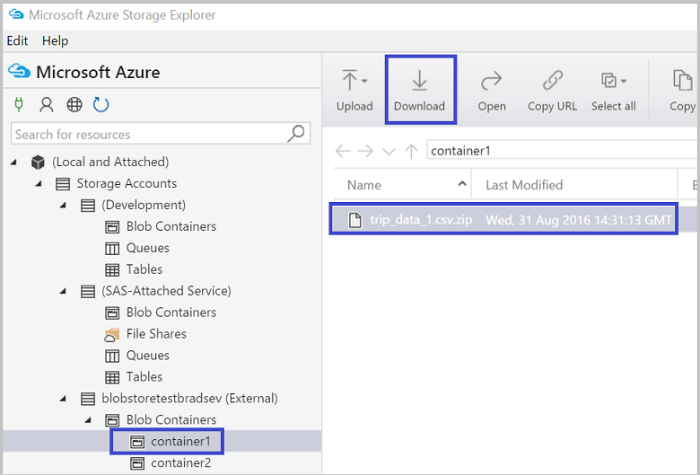

<properties 
    pageTitle="Verschieben von Daten an und von Azure BLOB-Speicher mit Azure-Speicher-Explorer | Microsoft Azure" 
    description="Verschieben von Daten an und von Azure BLOB-Speicher mit Azure-Speicher-Explorer" 
    services="machine-learning,storage" 
    documentationCenter="" 
    authors="bradsev" 
    manager="jhubbard" 
    editor="cgronlun" />

<tags 
    ms.service="machine-learning" 
    ms.workload="data-services" 
    ms.tgt_pltfrm="na" 
    ms.devlang="na" 
    ms.topic="article" 
    ms.date="08/31/2016"
    ms.author="bradsev" />

# Verschieben von Daten an und von Azure BLOB-Speicher mit Azure-Speicher-Explorer

Azure-Speicher-Explorer ist ein kostenloses Tool von Microsoft, die Sie auf Windows, Mac OS und Linux mit Azure-Speicher Daten arbeiten kann. In diesem Thema beschrieben, wie sie zum Hochladen und Herunterladen von Daten aus Azure Blob-Speicher verwendet wird. Das Tool kann aus [Microsoft Azure-Speicher-Explorer](http://storageexplorer.com/)heruntergeladen werden.

Anleitungen zum Verschieben von Daten von und/oder nach Azure Blob-Speicher verwendeten Technologien hier verknüpft sind:
 
[AZURE.INCLUDE [blob-storage-tool-selector](../../includes/machine-learning-blob-storage-tool-selector.md)]   

 
> [AZURE.NOTE] Wenn Sie virtuellen Computer verwenden, die mit von [Daten Wissenschaft virtuellen Computern in Azure](machine-learning-data-science-virtual-machines.md)bereitgestellten Skripts eingerichtet wurde, ist Azure-Speicher-Explorer des virtuellen Computers bereits installiert.
 
> [AZURE.NOTE] Eine vollständige Einführung Azure Blob-Speicher finden Sie unter [Azure Blob Grundlagen](../storage/storage-dotnet-how-to-use-blobs.md) und [Azure Blob-Dienst](https://msdn.microsoft.com/library/azure/dd179376.aspx).   

## Erforderliche Komponenten

Dieses Dokument wird davon ausgegangen, dass Sie ein Azure-Abonnement, ein Konto Speicherplatz und den entsprechenden Speicherschlüssel für dieses Konto verfügen. Vor dem Upload/Download Daten, müssen Sie den Azure-Speicher-Konto Servername und die Kontoinformationen Key kennen. 

- Zum Einrichten eines Azure-Abonnements finden Sie [kostenlose Testversion für einen Monat](https://azure.microsoft.com/pricing/free-trial/)aus.
- Erstellen eines Kontos Speicher Anweisungen sowie erste Konto und wichtige Informationen finden Sie unter [zur Azure-Speicher-Konten](../storage/storage-create-storage-account.md). Notieren Sie die Tastenkombination für Ihr Speicherkonto nach Bedarf Schlüssel für die Verbindung mit dem Konto mit dem Tool Azure-Speicher-Explorer.
- Das Tool Azure-Speicher-Explorer kann aus [Microsoft Azure-Speicher-Explorer](http://storageexplorer.com/)heruntergeladen werden. Übernehmen Sie die Standardeinstellungen während der Installation.

## Verwenden von Azure-Speicher-Explorer 

Die folgenden Schritte Dokument so Upload/Download von Daten mithilfe von Azure-Speicher-Explorer. 

1.  Starten Sie Microsoft Azure-Speicher-Explorer.
2.  Um den Assistenten **Melden Sie sich bei Ihrem Konto...** aufzurufen, Azure Symbol **kontoeinstellungen** , klicken Sie dann **ein Konto hinzufügen** , und geben Sie die Anmeldeinformationen ein. 
3.  Um die **Verbindung herstellen mit Azure-Speicher** -Assistenten aufzurufen, wählen Sie **mit Azure-Speicher** verbinden. 
4. Geben Sie die Zugriffstaste aus Ihrem Konto Azure-Speicher auf die **Verbindung herstellen mit Azure-Speicher** -Assistenten ein, und klicken Sie dann auf **Weiter**. 
5. Geben Sie in das Feld **Kontoname** Speicher Kontonamen ein, und wählen Sie dann auf **Weiter**. 
6. Das Speicherkonto hinzugefügt sollte jetzt aufgeführt sein. Erstellen eines Containers Blob in einem Speicherkonto, mit der rechten Maustaste in des **Container Blob** -Knotens in diesem Konto, wählen Sie **Blob-Container erstellen**, und geben Sie einen Namen.
7. Zum Hochladen von Daten zu einem Container, wählen Sie die Zielcontainer aus, und klicken Sie auf die Schaltfläche **Hochladen** .
8. Klicken Sie auf die **...** rechts neben dem Feld **Dateien** , wählen Sie eine oder mehrere Dateien aus dem Dateisystem hochladen, und klicken Sie auf **Hochladen** , um die Dateien hochladen beginnen aus.
7. Zum Herunterladen von Daten, markieren das Blob in den entsprechenden Container zum Herunterladen, und klicken Sie auf **herunterladen**. 

