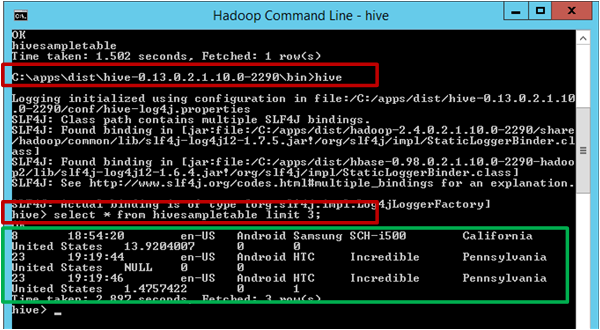

<properties
    pageTitle="Erstellen und Laden von Daten in die Struktur von Tabellen aus dem Blob-Speicher | Microsoft Azure"
    description="Struktur Tabellen erstellen und Laden von Daten in Blob zu Tabellen Struktur"
    services="machine-learning,storage"
    documentationCenter=""
    authors="bradsev"
    manager="jhubbard"
    editor="cgronlun" />

<tags
    ms.service="machine-learning"
    ms.workload="data-services"
    ms.tgt_pltfrm="na"
    ms.devlang="na"
    ms.topic="article"
    ms.date="09/14/2016"
    ms.author="bradsev" />

#Erstellen und Laden von Daten in die Struktur von Tabellen aus Azure Blob-Speicher

In diesem Thema werden generische Struktur Abfragen, die Struktur Tabellen erstellen und Laden von Daten aus Azure Blob-Speicher. Einige Richtlinien werden auch Partitionierung Struktur Tabellen und verwenden die optimierten Zeile einspaltigen (ORC) Formatierung, um die Leistung der Abfrage bereitgestellt.

Diese **Menü** enthält Links zu Themen, die beschreiben, wie Daten in der Ziel-Umgebungen Aufnahme, wo die Daten gespeichert und während der Teamwebsite Daten Wissenschaft Prozess (TDSP) verarbeitet werden können.

[AZURE.INCLUDE [cap-ingest-data-selector](../../includes/cap-ingest-data-selector.md)]

## Erforderliche Komponenten
In diesem Artikel wird vorausgesetzt, dass Sie:

* Erstellt ein Azure-Speicher-Konto an. Wenn Sie die Anweisungen benötigen, finden Sie unter [Informationen zum Azure-Speicherkonten](../storage/storage-create-storage-account.md). 
* Nach der Bereitstellung eines angepassten Hadoop Clusters mit dem Dienst HDInsight.  Wenn Sie die Anweisungen benötigen, finden Sie unter [Anpassen Azure HDInsight Hadoop Cluster für erweiterte Analytics](machine-learning-data-science-customize-hadoop-cluster.md).
* Aktiviert Remotezugriff auf das Cluster angemeldet, und die Befehlszeile Hadoop-Konsole geöffnet. Wenn Sie die Anweisungen benötigen, finden Sie unter [Zugriff die Hadoop Cluster Kopf Knoten](machine-learning-data-science-customize-hadoop-cluster.md#headnode).

## Hochladen von Daten in Azure Blob-Speicher
Wenn Sie eine Azure-virtuellen Computern anhand der Anweisungen in [einer Azure-virtuellen Computern für erweiterte Analytics einrichten](machine-learning-data-science-setup-virtual-machine.md)bereitgestellten erstellt haben, diese Skriptdatei sollte wurden heruntergeladen zu den *C:\\Benutzer\\\<Benutzername\>\\Dokumente\\Daten Wissenschaft Skripts* Verzeichnis des virtuellen Computers. Diese Struktur Abfragen erfordern nur, wenn Sie Ihre eigenen Datenschema und Azure Blob-Speicherkonfiguration in die entsprechenden Felder für die Übermittlung bereit sein anschließen.

Wird davon ausgegangen, dass die Daten für die Struktur von Tabellen in einem tabellarischen **nicht komprimiert** ist und die Daten auf den Standardwert (oder in einen zusätzlichen) hochgeladen wurde Container des Speicherkontos vom Cluster Hadoop verwendet.

Wenn Sie eine Methode für **NYC Taxi Geschäftsreise Daten**möchten, müssen Sie:

- **herunterladen** der 24 [NYC Taxi Geschäftsreise](http://www.andresmh.com/nyctaxitrips) Datendateien (12 Geschäftsreise Dateien und 12 Fahrpreis-Dateien)
- **Entzippen Sie** alle Dateien in der CSV-Dateien, und klicken Sie dann
- **Hochladen** , damit die Standardeinstellung (oder dem entsprechenden Container) des Kontos Azure-Speicher, der von der Prozedur erstellt wurde im folgenden [Anpassen Azure HDInsight Hadoop Cluster für erweiterte Analytics Prozess und Technologie](machine-learning-data-science-customize-hadoop-cluster.md) -Thema erläutert. Der Prozess in der CSV-Dateien in der standardmäßige Container auf das Speicherkonto hochladen kann auf dieser [Seite](machine-learning-data-science-process-hive-walkthrough.md#upload)gefunden werden.

## So senden Struktur Abfragen

Mithilfe von können Struktur Abfragen gesendet werden:

1. [Geben Sie Struktur Abfragen über Hadoop Befehlszeile auf Headnode Hadoop Cluster](#headnode)
2. [Geben Sie Struktur Abfragen mit dem Struktur-Editor](#hive-editor)
3. [Geben Sie Struktur Abfragen mit Azure PowerShell-Befehlen](#ps)

Struktur Abfragen werden SQL-ähnliche. Wenn Sie mit SQL vertraut sind, finden Sie möglicherweise die [Struktur für SQL Benutzer Spickzettel Blatt](http://hortonworks.com/wp-content/uploads/2013/05/hql_cheat_sheet.pdf) hilfreich.

Beim Senden einer Abfrage Struktur, können Sie auch das Ziel der Ausgabe von Abfragen Struktur steuern, sei es auf dem Bildschirm oder in einer lokalen Datei auf dem am Knoten oder eine Azure Blob.

###1. Geben Sie Struktur Abfragen über Hadoop Befehlszeile auf Headnode Hadoop Cluster

Wenn die Struktur Abfrage komplex ist, führt übermitteln es direkt im am Knoten von der Hadoop Cluster in der Regel zu schneller um als mit einer Struktur-Editor oder Azure PowerShell Skripts Absenden aktivieren.

Melden Sie sich bei der am Knoten im Cluster Hadoop, öffnen Sie die Befehlszeile Hadoop auf dem Desktop des Knotens am, und geben Sie Befehl `cd %hive_home%\bin`.

Stehen Ihnen drei Methoden zum Struktur Abfragen die Befehlszeile Hadoop zu senden:

* direkt
* Verwenden von .hql Dateien
* Klicken Sie mit der Struktur Befehl console

#### Senden Sie die Struktur Abfragen direkt in Hadoop Befehlszeile.

Sie können den Befehl wie ausführen `hive -e "<your hive query>;` einfache Struktur Abfragen direkt in Hadoop Befehlszeile zu übermitteln. Hier ist ein Beispiel, wobei rote Feld werden des Befehls, der die Abfrage Struktur und das grüne Feld werden die Ausgabe der Abfrage Struktur ein.

#### Geben Sie Struktur Abfragen auf .hql Dateien

Wenn die Struktur Abfrage komplizierter ist und besteht aus mehreren Zeilen, ist das Bearbeiten von Abfragen in Befehlszeile oder Struktur Befehl Console nicht praktikabel. Eine Alternative ist in einem Text-Editor im am Knoten des Cluster Hadoop verwenden, um die Struktur Abfragen in einer .hql-Datei in einem lokalen Verzeichnis des am Knotens zu speichern. Und klicken Sie dann die Struktur Abfrage in der Datei .hql kann, mithilfe gesendet werden der `-f` Argument wie folgt:

    hive -f "<path to the .hql file>"

**Unterdrücken des Vorgangsfortschritts Status Bildschirm Drucken der Struktur Abfragen**

Standardmäßig nachdem die Struktur einer Abfrage in Hadoop Befehlszeile, hinzugefügt werden wird der Fortschritt des Projekts Karte/verringern Bildschirm gedruckt. Wenn der Bildschirm Drucken von der Karte/Verringern des Projektstatus unterdrücken möchten, können Sie ein Argument `-S` (in Großbuchstaben "S") in den Befehl Zeile wie folgt:

    hive -S -f "<path to the .hql file>"
    hive -S -e "<Hive queries>"

#### Geben Sie die Struktur-Abfragen auf Struktur Befehl Console.

Sie können auch zuerst die Struktur Befehl Console eingeben, indem Sie Befehl ausführen `hive` in Hadoop Befehlszeile, und senden Sie Struktur Abfragen in Struktur Befehl Console. Hier ist ein Beispiel für ein. Markieren Sie in diesem Beispiel zwei rote Felder ein, die Befehle verwendet, um die Struktur Befehl Console einzugeben, und die Struktur Abfrage Hilfethemas im Befehl Console Struktur, übermittelt. Das grüne Feld hervorgehoben die Ausgabe der Abfrage Struktur.

In den vorherigen Beispielen ausgeben direkt die Abfrageergebnissen Struktur auf dem Bildschirm. Sie können auch die Ausgabe in einer lokalen Datei auf dem am Knoten oder eine Azure Blob schreiben. Andere Tools können Sie dann um die Ausgabe der Struktur Abfragen weiter zu analysieren.

**Ausgeben Sie Struktur Abfrageergebnisse in eine lokale Datei an.**

Um die Struktur der Abfrageergebnisse in einem lokalen Verzeichnis auf dem am Knoten ausgeben, müssen Sie die Struktur der Befehlszeile Hadoop wie folgt Suchabfrage:

    hive -e "<hive query>" > <local path in the head node>

Im folgenden Beispiel wird die Ausgabe der Abfrage Struktur in eine Datei geschrieben `hivequeryoutput.txt` im Verzeichnis `C:\apps\temp`.

**Die Ausgabe Struktur Abfrageergebnisse zu einer Azure blob**

Sie können auch die Struktur Abfrageergebnisse zu einer Azure Blob, innerhalb der standardmäßige Container der Hadoop Cluster ausgeben. Die Struktur Abfrage dafür lautet wie folgt aus:

    insert overwrite directory wasb:///<directory within the default container> <select clause from ...>

Im folgenden Beispiel wird die Ausgabe der Abfrage Struktur in einem Blob-Verzeichnis geschrieben `queryoutputdir` innerhalb der standardmäßige Container der Hadoop Cluster. Hier, müssen Sie nur den Verzeichnisnamen, ohne den Namen des Blob bereitstellen. Ein Fehler wird ausgelöst, wenn Sie sowohl bei Directory Blob Namen, z. B. bereitzustellen `wasb:///queryoutputdir/queryoutput.txt`.

Wenn Sie den standardmäßige Container der Hadoop Cluster mit Azure-Speicher-Explorer öffnen, sehen Sie die Ausgabe der Abfrage Struktur wie in der folgenden Abbildung gezeigt. Sie können den Filter (nach rotem Feld hervorgehoben) anwenden, um nur das Blob mit bestimmten Buchstaben Namen abzurufen.

###2. übermitteln Sie Struktur Abfragen mit dem Struktur-Editor

Sie können Sie auch der Abfrage Konsole (Struktur Editor) durch Eingabe einer URL des Formulars *https://&#60; Hadoop Clustername >.azurehdinsight.net/Home/HiveEditor* in einem Webbrowser. Sie müssen die finden Sie unter diese Konsole angemeldet und daher müssen Sie hier Ihre Hadoop Cluster Anmeldeinformationen benötigen.

###3 übermitteln Sie 3 Struktur Abfragen mit Azure PowerShell-Befehlen

Sie können auch PowerShell verwenden, und übermitteln Sie Struktur Abfragen. Anweisungen finden Sie unter [Senden Struktur Aufträge mithilfe der PowerShell](../hdinsight/hdinsight-submit-hadoop-jobs-programmatically.md#hive-powershell).

## Erstellen der Struktur Datenbanken und Tabellen

Die Struktur Abfragen im [Github Repository](https://github.com/Azure/Azure-MachineLearning-DataScience/tree/master/Misc/DataScienceProcess/DataScienceScripts/sample_hive_create_db_tbls_load_data_generic.hql) freigegeben sind und von dort aus heruntergeladen werden können.

Dies ist die Struktur-Abfrage, die eine strukturtabelle erstellt wird.

    create database if not exists <database name>;
    CREATE EXTERNAL TABLE if not exists <database name>.<table name>
    (
        field1 string,
        field2 int,
        field3 float,
        field4 double,
        ...,
        fieldN string
    )
    ROW FORMAT DELIMITED FIELDS TERMINATED BY '<field separator>' lines terminated by '<line separator>'
    STORED AS TEXTFILE LOCATION '<storage location>' TBLPROPERTIES("skip.header.line.count"="1");

Hier sind die Beschreibungen der Felder, die Sie benötigen, anzuschließen und andere Konfigurationen aus:

- **& #60; Datenbankname >**: den Namen der Datenbank, die Sie erstellen möchten. Wenn Sie die standardmäßige Datenbank verwenden möchten, kann die Abfrage *erstellen Datenbank...* weggelassen werden.
- **& #60; Tabellennamen >**: der Name der Tabelle, die Sie in der angegebenen Datenbank erstellen möchten. Wenn Sie die standardmäßige Datenbank verwenden möchten, in der Tabelle kann direkt verwiesen werden durch *& #60; Tabellennamen >* ohne & #60; Datenbankname >.
- **& #60; Feldtrennzeichen >**: das Trennzeichen, das Felder in der Datendatei auf die strukturtabelle hochgeladen werden getrennt werden sollen.
- **& #60; Trennlinie >**: das Trennzeichen, die Zeilen in der Datendatei begrenzt.
- **& #60; Speicherort >**: der Azure Speicherort zum Speichern der Daten der Struktur Tabellen. Wenn Sie nicht angeben *Speicherort & #60; Speicherort >*, die Datenbank und die Tabellen befinden sich am *Stock/Warehouse/* Verzeichnis im Standardcontainer der Struktur Cluster standardmäßig. Wenn Sie den Speicherort angeben möchten, muss der Speicherort innerhalb des Containers Standard für die Datenbanken und Tabellen sein. Diesen Speicherort als Position relativ zu den standardmäßigen Container des Cluster im Format bezeichnet werden muss *' Wasb: / / / & #60; Verzeichnis 1 > /'* oder *' Wasb: / / / & #60; Verzeichnis 1 > / & Verzeichnis 2; #60 > /'*usw.. Nachdem die Abfrage ausgeführt wird, werden die relative Verzeichnisse innerhalb der standardmäßige Container erstellt.
- **TBLPROPERTIES("Skip.Header.Line.Count"="1")**: Wenn die Datendatei eine Kopfzeile enthält, müssen Sie diese Eigenschaft **am Ende** der Abfrage *Erstellen Tabelle* hinzuzufügen. Andernfalls wird die Kopfzeile als Datensatz in die Tabelle geladen. Wenn die Datendatei nicht über eine Kopfzeile verfügt, kann diese Konfiguration in der Abfrage weggelassen werden.

## Laden Sie die Daten, die Struktur von Tabellen
Dies ist die Struktur-Abfrage, die Daten in eine strukturtabelle lädt.

    LOAD DATA INPATH '<path to blob data>' INTO TABLE <database name>.<table name>;

- **& #60; Pfad für BLOB-Daten >**: ist die BLOB-Datei auf die strukturtabelle hochgeladen werden in der standardmäßige Container im Cluster HDInsight Hadoop der *& #60; Pfad für BLOB-Daten >* sollten im Format *' Wasb: / / / & #60; Directory in diesem Container > / & #60; Blob-Dateiname >'*. Die Blobdatei kann auch in einem weiteren Cluster HDInsight Hadoop-Container sein. In diesem Fall *& #60; Pfad für BLOB-Daten >* sollten im Format *' Wasb: / / & #60; Container name>@&#60;storage Kontonamen >.blob.core.windows.net/ & #60; Blob-Dateiname >'*.

    >[AZURE.NOTE] BLOB-Daten auf strukturtabelle hochgeladen werden müssen in der standardmäßigen oder zusätzliche Container des Kontos Speicherplatz für den Hadoop Cluster sein. Andernfalls schlägt das *Laden* Datenabfrage beschweren, dass die Daten nicht darauf zugreifen kann.

## Erweiterte Themen: Tabelle und Store Struktur von Daten im Format ORC aufgeteilt

Die Daten groß ist, ist die-Tabelle teilen für Abfragen, bei die nur einige Partitionen der Tabelle scannen müssen Vorteil. Beispielsweise ist es sinnvoll, die Log-Daten von einer Website nach Datum unterteilen.

Neben der Partitionierung Struktur Tabellen, ist es auch hilfreich, die Struktur Daten im gewünschten Format optimiert Zeile einspaltigen (ORC) gespeichert. Weitere Informationen zum Formatieren von ORC finden Sie unter <a href="https://cwiki.apache.org/confluence/display/Hive/LanguageManual+ORC#LanguageManualORC-ORCFiles" target="_blank">Dateien mithilfe von ORC verbessert die Leistung bei Struktur lesen, schreiben, und Verarbeiten von Daten</a>.

### Partitionierte Tabelle
Hier sind die Struktur eine partitionierte Tabelle erstellt und lädt Daten in diese Abfrage ein.

    CREATE EXTERNAL TABLE IF NOT EXISTS <database name>.<table name>
    (field1 string,
    ...
    fieldN string
    )
    PARTITIONED BY (<partitionfieldname> vartype) ROW FORMAT DELIMITED FIELDS TERMINATED BY '<field separator>'
         lines terminated by '<line separator>' TBLPROPERTIES("skip.header.line.count"="1");
    LOAD DATA INPATH '<path to the source file>' INTO TABLE <database name>.<partitioned table name>
        PARTITION (<partitionfieldname>=<partitionfieldvalue>);

Bei der Abfrage partitionierter Tabellen es wird empfohlen, die Bedingung Partition am **Anfang** des Hinzufügen der `where` wie dieser Klausel wird der Effizienz der Suche erheblich verbessert.

    select
        field1, field2, ..., fieldN
    from <database name>.<partitioned table name>
    where <partitionfieldname>=<partitionfieldvalue> and ...;

### Speichern von Daten im Format ORC Struktur

Sie können keine Daten direkt in Struktur Tabellen, die im ORC-Format gespeichert wird von Blob-Speicher laden. Hier sind die Schritte, die die benötigten ergreifen können, um das Laden von Daten aus Azure-blobs mit Struktur Tabellen im ORC-Format gespeichert.

Erstellen einer externen Tabellendaten **AS Textdatei gespeichert** und Laden von Blob-Speicher der Tabelle.

        CREATE EXTERNAL TABLE IF NOT EXISTS <database name>.<external textfile table name>
        (
            field1 string,
            field2 int,
            ...
            fieldN date
        )
        ROW FORMAT DELIMITED FIELDS TERMINATED BY '<field separator>'
            lines terminated by '<line separator>' STORED AS TEXTFILE
            LOCATION 'wasb:///<directory in Azure blob>' TBLPROPERTIES("skip.header.line.count"="1");

        LOAD DATA INPATH '<path to the source file>' INTO TABLE <database name>.<table name>;

Erstellen Sie eine interne Tabelle mit demselben Schema wie die externe Tabelle in Schritt 1, für das gleiche Feldtrennzeichen und speichern Sie die Struktur Daten in das ORC-Format.

        CREATE TABLE IF NOT EXISTS <database name>.<ORC table name>
        (
            field1 string,
            field2 int,
            ...
            fieldN date
        )
        ROW FORMAT DELIMITED FIELDS TERMINATED BY '<field separator>' STORED AS ORC;

Wählen Sie Daten aus der externen Tabelle in Schritt 1 aus, und fügen Sie in der Tabelle ORC

        INSERT OVERWRITE TABLE <database name>.<ORC table name>
            SELECT * FROM <database name>.<external textfile table name>;

>[AZURE.NOTE] Wenn die Textdatei Tabelle *& #60; Datenbankname >. & #60; externen Textdatei Tabellennamen >* Partitionen, klicken Sie in Schritt 3, weist die `SELECT * FROM <database name>.<external textfile table name>` Befehl markiert die Partition Variable als Feld in der zurückgegebene Datenmenge. Einfügen in der *& #60; Datenbankname >. & #60; ORC Tabellennamen >* seit schlägt fehl *& #60; Datenbankname >. & #60; ORC Tabellennamen >* verfügt nicht über die Variable Partition als ein Feld in der Tabellenschema. In diesem Fall müssen Sie die Felder, die zum speziell auswählen *& #60; Datenbankname >. & #60; ORC Tabellennamen >* wie folgt:

        INSERT OVERWRITE TABLE <database name>.<ORC table name> PARTITION (<partition variable>=<partition value>)
           SELECT field1, field2, ..., fieldN
           FROM <database name>.<external textfile table name>
           WHERE <partition variable>=<partition value>;

Es ist sicher, legen Sie die *& #60; externen Textdatei Tabellennamen >* Wenn mithilfe der folgenden Abfrage, nachdem alle Daten eingefügt wurde in *& #60; Datenbankname >. & #60; ORC Tabellennamen >*:

        DROP TABLE IF EXISTS <database name>.<external textfile table name>;

Nachdem die obigen Schritte, sollten Sie eine Tabelle mit Daten im Format ORC bereit sind, verwenden Sie verfügen.  
