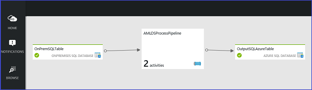

<properties
    pageTitle="Verschieben von Daten aus einer lokalen SQL Server in SQL Azure mit Azure Data Factory | Azure"
    description="Richten Sie eine Verkaufspipeline ADF, die zwei Daten Migrationsaktivitäten verfasst, die Daten zusammen täglich zwischen Datenbanken lokal und in der Cloud zu verschieben."
    services="machine-learning"
    documentationCenter=""
    authors="bradsev"
    manager="jhubbard"
    editor="cgronlun" />

<tags
    ms.service="machine-learning"
    ms.workload="data-services"
    ms.tgt_pltfrm="na"
    ms.devlang="na"
    ms.topic="article"
    ms.date="09/14/2016"
    ms.author="bradsev" />

# Verschieben von Daten aus einer lokalen SQLServer in SQL Azure mit Azure Data Factory

In diesem Thema veranschaulicht, wie Sie zum Verschieben von Daten aus einer lokalen SQL Server-Datenbank mit einer SQL Azure-Datenbank über Azure BLOB-Speicher Azure Daten Factory (ADF) verwenden.

Die folgenden **Menü** Links zu Themen, die beschreiben, wie Daten in Ziel-Umgebungen Aufnahme, wo die Daten gespeichert und beim Team Daten Wissenschaft verarbeitet werden können.

[AZURE.INCLUDE [cap-ingest-data-selector](../../includes/cap-ingest-data-selector.md)]

## Einführung: Was ist ADF und wann sollte es verwendet werden, um Daten zu migrieren?

Azure Data Factory ist eine vollständig verwaltete cloudbasierten Integration Datendienst, der koordiniert und Automatisierung der Bewegung und Transformation von Daten. Das wesentliche Konzept im Modell ADF ist Verkaufspipeline. Eine Verkaufspipeline ist eine logische Gruppierung von Aktivitäten, von die jede die auf der Registerkarte Daten in Datasets enthaltenen auszuführenden Aktionen definiert. Verknüpfte Dienste dienen zum Definieren der Informationen für Daten Factory Verbindung zu den Datenressourcen erforderlich.

Mit ADF können vom vorhandenen Datenverarbeitung Services in Datenpipelines bestehen, die in der Cloud hoch verfügbare, verwaltete sind. Diese Datenpipelines geplant werden können, um Aufnahme, vorbereiten, transformieren, analysieren und Veröffentlichen von Daten, und ADF verwaltet und koordiniert komplexer Daten und Verarbeitung Abhängigkeiten. Lösungen können schnell erstellt und bereitgestellt in der Cloud, Herstellen einer Verbindung eine wachsende Anzahl von lokalen und cloud-Datenquellen.

ADF in Betracht:

- Wenn Sie Daten in einem Szenario Hybrid ständig migriert werden müssen greift auf, die sowohl lokal und Cloud-Ressourcen 
- Wenn die Daten Transaktionen oder werden oder geänderten Geschäftslogik hinzugefügt, wenn migriert werden müssen. 

ADF kann für die Planung und Überwachung der Aufträge mithilfe von einfachen JSON-Skripts, die zur Verwaltung von der Verlagerung von Daten in regelmäßigen Abständen. ADF verfügt auch über andere Funktionen wie z. B. Unterstützung für komplexe Vorgänge. Weitere Informationen zum ADF finden Sie in der Dokumentation bei [Azure Daten Factory (ADF)](https://azure.microsoft.com/services/data-factory/).

## Das Szenario

Wir richten Sie eine Verkaufspipeline ADF, die zwei Daten Migrationsaktivitäten verfasst. Verschieben sie zusammen Daten täglich zwischen einer SQL-Datenbank lokal und in der Cloud einer Azure SQL-Datenbank. Die zwei Aktivitäten sind:

* Kopieren Sie Daten aus einer lokalen SQL Server-Datenbank mit einer Firma Azure BLOB-Speicher
* Kopieren Sie Daten aus dem Azure BLOB-Speicher-Konto in einer SQL Azure-Datenbank.

>[AZURE.NOTE] Hier haben angepasst wurden, aus der vom ADF-Team bereitgestellten ausführlichere Lernprogramm dargestellten Schritte: [Verschieben von Daten zwischen lokalen Quellen und Cloud mit Datenverwaltungsgateway](../data-factory/data-factory-move-data-between-onprem-and-cloud.md) Verweise in den entsprechenden Abschnitten dieses Themas werden bei Bedarf bereitgestellt.

## Erforderliche Komponenten
In diesem Lernprogramm wird davon ausgegangen, dass Sie haben:

* Ein **Azure-Abonnement**. Wenn Sie nicht über ein Abonnement verfügen, können Sie für eine [kostenlose Testversion](https://azure.microsoft.com/pricing/free-trial/)registrieren.
* Ein **Konto Azure-Speicher**. Verwenden Sie ein Konto Azure-Speicher zum Speichern der Daten in diesem Lernprogramm. Wenn Sie ein Azure-Speicher-Konto besitzen, finden Sie im Artikel [Erstellen eines Speicher-Kontos](storage-create-storage-account.md#create-a-storage-account) . Nachdem Sie das Speicherkonto erstellt haben, müssen Sie den Zugriff auf den Speicher verwendet Konto Key zu erhalten. Finden Sie unter [anzeigen, kopieren und neu generieren Speicher Zugriffstasten](storage-create-storage-account.md#view-copy-and-regenerate-storage-access-keys).
* Zugriff auf eine **SQL Azure-Datenbank**. Wenn Sie eine SQL Azure-Datenbank einrichten müssen, stellt die [Erste Schritte mit Microsoft Azure SQL-Datenbank](../sql-database/sql-database-get-started.md) Tpoic erfahren Sie, wie eine neue Instanz einer Azure SQL-Datenbank nicht bereitstellen.
* Installiert und konfiguriert **Azure PowerShell** lokal. Anweisungen finden Sie unter [Informationen zum Installieren und konfigurieren Azure PowerShell](../powershell-install-configure.md).

> [AZURE.NOTE] Dieses Verfahren wird der [Azure-Portal](https://portal.azure.com/)verwendet.

##Hochzuladen Sie die Daten zu Ihrem mit lokalen SQL Server.

Wir verwenden [NYC Taxi Dataset](http://chriswhong.com/open-data/foil_nyc_taxi/) , um die Migration zu veranschaulichen. Das Dataset NYC Taxi steht, wie in diesem Beitrag, klicken Sie auf Azure BLOB-Speicher [NYC Taxi Daten](http://www.andresmh.com/nyctaxitrips/)erwähnt. Die Daten verfügt über zwei Dateien, die trip_data.csv-Datei, die Geschäftsreise Details enthält, und die trip_far.csv-Datei, die Details des Fahrpreises Kostenpflichtiger für jede Reise enthält. Eine Stichprobe und eine Beschreibung der diese Dateien werden in [NYC Taxi Schleifen Datasetbeschreibung](machine-learning-data-science-process-sql-walkthrough.md#dataset)bereitgestellt.

Sie können das Verfahren hier bereitgestellt werden, um eine Reihe von Ihre eigenen Daten anpassen oder führen Sie die Schritte aus, wie mithilfe des NYC Taxi Datasets beschrieben. Um das Dataset NYC Taxi in Ihre mit lokalen SQL Server-Datenbank hochzuladen, folgen Sie dem Verfahren in [Massen Importieren von Daten in SQL Server-Datenbank](machine-learning-data-science-process-sql-walkthrough.md#dbload)aus. Diese Anweisungen für einen SQL Server auf eine Azure-virtuellen Computern sind, aber die Vorgehensweise für das Hochladen in der SQL Server lokal entspricht.

##Erstellen einer Factory Azure-Daten

Die Schritte zum Erstellen einer neuen Factory der Azure-Daten und einer Ressourcengruppe im [Portal Azure](https://portal.azure.com/) werden [Erstellen einer Azure-Daten Factory](../data-factory/data-factory-build-your-first-pipeline-using-editor.md#step-1-creating-the-data-factory)bereitgestellt. Namen der neuen ADF Instanz *Adfdsp* und der Name der Ressource erstellten Gruppe *Adfdsprg*.

## Installieren und Konfigurieren von das Datenverwaltungsgateway

Um Ihre Rohrleitungen in eine Fabrik Azure-Daten für die Arbeit mit einer lokalen SQL Server zu aktivieren, müssen Sie ihn als verknüpfte Service Factory Daten hinzufügen. Um einen verknüpften Dienst für einen mit lokalen SQL Server erstellen zu können, müssen Sie folgende Aktionen ausführen:

- Herunterladen und Installieren von Microsoft-Datenverwaltungsgateway auf den lokalen Computer. 
- Konfigurieren des verknüpften Diensts für die lokale Datenquelle das Gateway verwendet. 

Das Datenverwaltungsgateway serialisiert und deserialisiert die Quelle und Empfänger Daten auf dem Computer, in dem es gehostet wird.

Ansetzen Anweisungen und Datenverwaltungsgateway Details finden Sie unter [Verschieben von Daten zwischen lokalen Quellen und Cloud mit Datenverwaltungsgateway](../data-factory/data-factory-move-data-between-onprem-and-cloud.md)

## Erstellen von verknüpften Diensten Verbindung zu den Datenressourcen

Einen verknüpfter Dienst definiert die Informationen für Azure Daten Factory Verbindung zu einer Datenressource erforderlich. Schrittweise Verfahren zum Erstellen von verknüpfter Diensten werden in das [Erstellen von verknüpfter Diensten](../data-factory/data-factory-move-data-between-onprem-and-cloud.md#step-2-create-linked-services)bereitgestellt.

Wir haben drei Ressourcen in diesem Szenario für die verknüpfte Dienste erforderlich sind.

1. [Verknüpfte Dienst mit lokalen SQL Server](#adf-linked-service-onprem-sql)
2. [Verknüpfte Dienst Azure BLOB-Speicher](#adf-linked-service-blob-store)
3. [Verknüpfte Dienst für SQL Azure-Datenbank](#adf-linked-service-azure-sql)

###Verknüpfte Dienst mit lokalen SQL Server-Datenbank

So erstellen Sie den verknüpften Dienst für SQL Server lokal

- Klicken Sie auf den **Datenspeicher** in die ADZ-Startseite auf klassische Azure-Portal 
- Wählen Sie **SQL** , und geben Sie die Anmeldeinformationen *Benutzernamen* und Ihr *Kennwort* für die SQL Server lokal. Sie müssen den Servername als ein **vollqualifizierter Name des Servername umgekehrter Schrägstrich Instanz (Servername\instancename)**eingeben. Benennen Sie die verknüpfte Dienst *Adfonpremsql*.

###Verknüpfte Dienst Blob

So erstellen Sie den verknüpften Dienst für das Konto Azure BLOB-Speicher

- Klicken Sie auf den **Datenspeicher** in die ADZ-Startseite auf klassische Azure-Portal
- Wählen Sie aus **Azure-Speicher-Konto** 
- Geben Sie den Namen für das Konto Azure BLOB-Speicher der Schlüssel und Container. Benennen Sie die verknüpfte Dienst *Adfds*.

###Verknüpfte Dienst für SQL Azure-Datenbank

Verknüpften Dienst SQL Azure-Datenbank zu erstellen:

- Klicken Sie auf den **Datenspeicher** in die ADZ-Startseite auf klassische Azure-Portal
- Wählen Sie **SQL Azure** , und geben Sie die *Benutzernamen* und Ihr *Kennwort* Anmeldeinformationen für die SQL Azure-Datenbank. Der *Benutzername* muss angegeben werden, als *user@servername*.   

##Definieren und Erstellen von Tabellen, um anzugeben, wie die Datasets zugreifen

Erstellen von Tabellen, die die Struktur, Speicherort, und Verfügbarkeit der Datensätze mit den folgenden Skript-basierte Verfahren an. JSON-Dateien werden verwendet, die Tabellen definieren. Weitere Informationen zur Struktur der diese Dateien finden Sie unter [Datasets](../data-factory/data-factory-create-datasets.md).

> [AZURE.NOTE]  Sie sollten Ausführen der `Add-AzureAccount` Cmdlet vor der Ausführung des Cmdlets [New-AzureDataFactoryTable](https://msdn.microsoft.com/library/azure/dn835096.aspx) um zu bestätigen, dass das rechts Azure-Abonnement für die Ausführung des Befehls ausgewählt ist. Dieses Cmdlet-Dokumentation finden Sie unter [Hinzufügen-AzureAccount](https://msdn.microsoft.com/library/azure/dn790372.aspx).

Die JSON-basierten Definitionen in den Tabellen verwenden Sie die folgenden Namen:

* der **Tabellenname** in SQLServer lokal ist *nyctaxi_data*
* den **Container mit dem Namen** in das Konto Azure BLOB-Speicher ist *containername*  

Drei Definitionen sind für diese ADF Verkaufspipeline erforderlich:

1. [SQL-lokal-Tabelle](#adf-table-onprem-sql)
2. [BLOB-Tabelle](#adf-table-blob-store)
3. [SQL Azure-Tabelle](#adf-table-azure-sql)

> [AZURE.NOTE]  Mithilfe dieser Verfahren Azure PowerShell definieren und die Aktivitäten ADF erstellen. Aber diese Aufgaben können auch mithilfe des Azure-Portals durchgeführt werden. Details finden Sie unter [Erstellen von Eingabe- und Datasets ausgeben](../data-factory/data-factory-move-data-between-onprem-and-cloud.md#step-3-create-input-and-output-datasets).

###SQL-lokal-Tabelle

In der folgenden JSON-Datei wird die Definition der Tabelle für die SQL Server lokal angegeben:

        {
            "name": "OnPremSQLTable",
            "properties":
            {
                "location":
                {
                "type": "OnPremisesSqlServerTableLocation",
                "tableName": "nyctaxi_data",
                "linkedServiceName": "adfonpremsql"
                },
                "availability":
                {
                "frequency": "Day",
                "interval": 1,   
                "waitOnExternal":
                {
                "retryInterval": "00:01:00",
                "retryTimeout": "00:10:00",
                "maximumRetry": 3
                }

                }
            }
        }

Die Spaltennamen wurden nicht hier. Sie können auf den Spaltennamen Sub auswählen, einschließlich dieser Stelle (für Details Prüfung der [ADF Dokumentation](../data-factory/data-factory-data-movement-activities.md ) Thema.

Kopieren Sie die JSON-Definition der Tabelle in einer Datei namens *onpremtabledef.json* Datei, und speichern Sie sie an einen bekannten Speicherort (hier als *C:\temp\onpremtabledef.json*angenommen,). Erstellen Sie die Tabelle in ADF mit den folgenden Azure PowerShell-Cmdlet ein:

    New-AzureDataFactoryTable -ResourceGroupName ADFdsprg -DataFactoryName ADFdsp –File C:\temp\onpremtabledef.json

###BLOB-Tabelle
Definition für die Tabelle für den Speicherort der Ausgabe Blob ist in den folgenden (Motor angesaugten Daten aus lokalen Azure Blob zugeordnet wird):

        {
            "name": "OutputBlobTable",
            "properties":
            {
                "location":
                {
                "type": "AzureBlobLocation",
                "folderPath": "containername",
                "format":
                {
                "type": "TextFormat",
                "columnDelimiter": "\t"
                },
                "linkedServiceName": "adfds"
                },
                "availability":
                {
                "frequency": "Day",
                "interval": 1
                }
            }
        }

Kopieren Sie die JSON-Definition der Tabelle in einer Datei namens *bloboutputtabledef.json* Datei, und speichern Sie sie an einen bekannten Speicherort (hier als *C:\temp\bloboutputtabledef.json*angenommen,). Erstellen Sie die Tabelle in ADF mit den folgenden Azure PowerShell-Cmdlet ein:

    New-AzureDataFactoryTable -ResourceGroupName adfdsprg -DataFactoryName adfdsp -File C:\temp\bloboutputtabledef.json  

###SQL Azure-Tabelle
Definition für die Tabelle für SQL Azure ausgeben befindet sich in den folgenden (dieses Schema ordnet die Daten aus dem Blob in Kürze):

    {
        "name": "OutputSQLAzureTable",
        "properties":
        {
            "structure":
            [
                { "name": "column1", type": "String"},
                { "name": "column2", type": "String"}                
            ],
            "location":
            {
                "type": "AzureSqlTableLocation",
                "tableName": "your_db_name",
                "linkedServiceName": "adfdssqlazure_linked_servicename"
            },
            "availability":
            {
                "frequency": "Day",
                "interval": 1            
            }
        }
    }

Kopieren Sie die JSON-Definition der Tabelle in einer Datei namens *AzureSqlTable.json* Datei, und speichern Sie sie an einen bekannten Speicherort (hier als *C:\temp\AzureSqlTable.json*angenommen,). Erstellen Sie die Tabelle in ADF mit den folgenden Azure PowerShell-Cmdlet ein:

    New-AzureDataFactoryTable -ResourceGroupName adfdsprg -DataFactoryName adfdsp -File C:\temp\AzureSqlTable.json  

##Definieren und der Verkaufspipeline erstellen

Geben Sie die Aktivitäten, die zu der Verkaufspipeline gehören, und erstellen mit den folgenden Skript-basierte Verfahren der Verkaufspipeline an. Eine JSON-Datei wird verwendet, um der Verkaufspipeline Eigenschaften definieren.

* Das Skript wird davon ausgegangen, dass der **Name pipeline** *AMLDSProcessPipeline*ist.
* Beachten Sie auch, dass wir die Zeitabstand, in der Verkaufspipeline täglich ausgeführt werden, und verwenden die Zeitdauer für die Ausführung für den Auftrag (00 Uhr UTC) festgelegt.

> [AZURE.NOTE]Die folgenden Verfahren verwenden Azure PowerShell definieren und der Verkaufspipeline ADF erstellen. Aber dieser Vorgang kann auch mithilfe des Azure-Portals durchgeführt werden. Details finden Sie unter [Erstellen und Ausführen einer Verkaufspipeline](../data-factory/data-factory-move-data-between-onprem-and-cloud.md#step-4-create-and-run-a-pipeline).

Verwenden die Tabellendefinitionen zuvor bereitgestellt, ist die Verkaufspipeline Definition für die ADZ wie folgt definiert:

        {
            "name": "AMLDSProcessPipeline",
            "properties":
            {
                "description" : "This pipeline has one Copy activity that copies data from an on-premise SQL to Azure blob",
                 "activities":
                [
                    {
                        "name": "CopyFromSQLtoBlob",
                        "description": "Copy data from on-premise SQL server to blob",     
                        "type": "CopyActivity",
                        "inputs": [ {"name": "OnPremSQLTable"} ],
                        "outputs": [ {"name": "OutputBlobTable"} ],
                        "transformation":
                        {
                            "source":
                            {                               
                                "type": "SqlSource",
                                "sqlReaderQuery": "select * from nyctaxi_data"
                            },
                            "sink":
                            {
                                "type": "BlobSink"
                            }   
                        },
                        "Policy":
                        {
                            "concurrency": 3,
                            "executionPriorityOrder": "NewestFirst",
                            "style": "StartOfInterval",
                            "retry": 0,
                            "timeout": "01:00:00"
                        }       

                     },

                    {
                        "name": "CopyFromBlobtoSQLAzure",
                        "description": "Push data to Sql Azure",        
                        "type": "CopyActivity",
                        "inputs": [ {"name": "OutputBlobTable"} ],
                        "outputs": [ {"name": "OutputSQLAzureTable"} ],
                        "transformation":
                        {
                            "source":
                            {                               
                                "type": "BlobSource"
                            },
                            "sink":
                            {
                                "type": "SqlSink",
                                "WriteBatchTimeout": "00:5:00",             
                            }           
                        },
                        "Policy":
                        {
                            "concurrency": 3,
                            "executionPriorityOrder": "NewestFirst",
                            "style": "StartOfInterval",
                            "retry": 2,
                            "timeout": "02:00:00"
                        }
                     }
                ]
            }
        }

Kopieren Sie diese JSON-Definition von der Verkaufspipeline in einer Datei namens *pipelinedef.json* Datei, und speichern Sie sie an einen bekannten Speicherort (hier als *C:\temp\pipelinedef.json*angenommen,). Erstellen Sie die Verkaufspipeline in ADF mit den folgenden Azure PowerShell-Cmdlet ein:

    New-AzureDataFactoryPipeline  -ResourceGroupName adfdsprg -DataFactoryName adfdsp -File C:\temp\pipelinedef.json

Bestätigen, dass Sie der Verkaufspipeline auf der ADZ im klassischen Azure-Portal wie folgt angezeigt (Wenn Sie das Diagramm klicken) sehen können

##Starten der Verkaufspipeline
Der Verkaufspipeline kann nun mit dem folgenden Befehl ausgeführt werden:

    Set-AzureDataFactoryPipelineActivePeriod -ResourceGroupName ADFdsprg -DataFactoryName ADFdsp -StartDateTime startdateZ –EndDateTime enddateZ –Name AMLDSProcessPipeline

Das *Startdatum* und *Enddatum* Parameterwerte müssen mit den tatsächlichen Daten ersetzt werden, zwischen denen der Verkaufspipeline ausgeführt werden sollen.

Wenn der Verkaufspipeline ausgeführt wird, sollten Sie sehen die Daten in der Container markiert ist, für die Blob, eine Datei pro Tag angezeigt.

Beachten Sie, dass die Funktionalität von ADF Pipe Daten inkrementell nicht genutzt haben. Weitere Informationen über diese und andere Funktionen von ADF Vorgehensweise finden Sie unter der [Dokumentation ADF](https://azure.microsoft.com/services/data-factory/).
