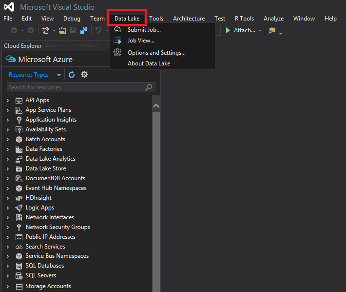
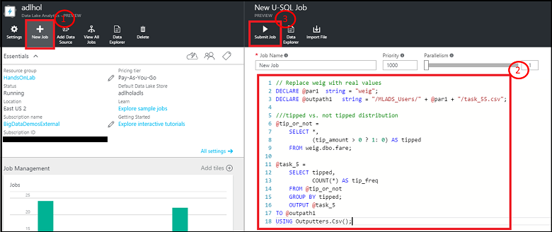
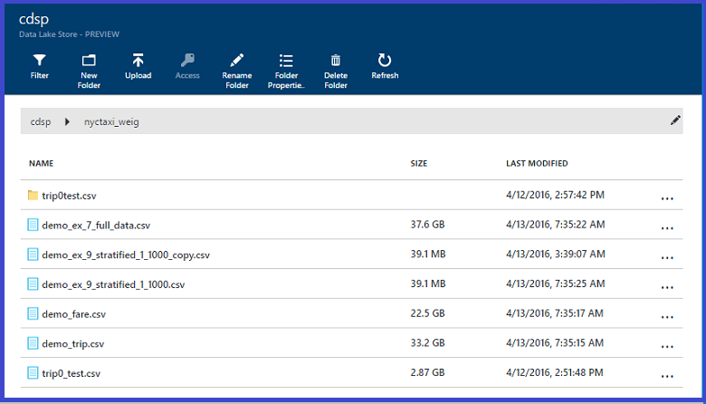
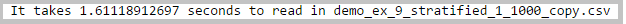
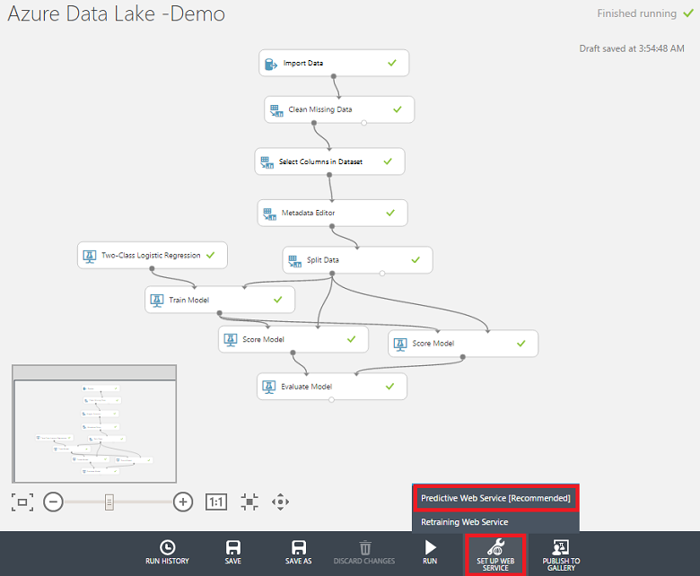

<properties
    pageTitle="Skalierbare Wissenschaft Azure Daten Sees für Daten: eine End-to-End-Exemplarische Vorgehensweise | Microsoft Azure"
    description="So Azure Daten Sees für Daten durchsuchen und Binärzahl Klassifizierung auf ein Dataset Aufgaben verwenden."  
    services="machine-learning"
    documentationCenter=""
    authors="bradsev"
    manager="jhubbard"
    editor="cgronlun" />

<tags
    ms.service="machine-learning"
    ms.workload="data-services"
    ms.tgt_pltfrm="na"
    ms.devlang="na"
    ms.topic="article"
    ms.date="09/19/2016"
    ms.author="bradsev;weig"/>

# Skalierbare Wissenschaft Azure Daten Sees für Daten: eine End-to-End-Exemplarische Vorgehensweise

Diese exemplarische Vorgehensweise veranschaulicht, wie mit Azure Daten Lake Durchsuchen von Daten und binäre Klassifizierung Aufgaben einer Stichprobe der NYC Taxi Reise und Ergebnisse so ausfallen Dataset vorhersagen möchten, und zwar unabhängig davon, ob ein Tipp durch eine Fahrpreis ausgezahlt werden. Es führt Sie durch die Schritte des [Team Daten Wissenschaft Prozess](http://aka.ms/datascienceprocess), End-to-End, Daten Acquisition Schulung modellieren, und klicken Sie dann an die Bereitstellung von einem Webdienst, der das Modell veröffentlicht.

### Azure-Daten Lake Analytics

[Microsoft Azure Daten dem](https://azure.microsoft.com/solutions/data-lake/) enthält alle Funktionen erforderlich, um Daten Wissenschaftler leicht zum Speichern von Daten jeder Größe, die Form und die Geschwindigkeit und Datenverarbeitung, erweiterte Analyse und Modellierung mit hoher Skalierbarkeit kostengünstiger so learning Computer durchführen.   Sie Zahlen auf Grundlage einer pro Projekt nur, wenn tatsächlich Daten verarbeitet werden. Azure Daten dem Analytics umfasst U-SQL, eine Sprache aus, die der Seitendeklaration SQL mit der ausdrucksbasierte Leistungsfähigkeit von c# skalierbare bereitstellen übergeht verteilt ermöglichen. Es ermöglicht es Ihnen, durch Anwenden einer Schema beim Lesen unstrukturierte Daten zu verarbeiten, fügen Sie benutzerdefinierte Logik und benutzerdefinierte Funktionen (Functions, UDFs) und enthält Erweiterbarkeit um fein detaillierte Kontrolle wie bei ausführen aktivieren. Erfahren Sie mehr über die zugrunde liegende U-SQL-Konzept verdeutlicht, finden Sie unter [Visual Studio Blogbeitrag](https://blogs.msdn.microsoft.com/visualstudio/2015/09/28/introducing-u-sql-a-language-that-makes-big-data-processing-easy/).

Daten Lake Analytics ist ebenfalls ein wichtiger Bestandteil Cortana Analytics-Suite und kann mit Azure SQL-Data Warehouse, Power BI und Daten Factory. Das ermöglicht Ihnen, einen abgeschlossen Cloud big Data und erweiterte Analytics-Plattform.

Diese exemplarische Vorgehensweise zunächst beschrieben, die erforderlichen Komponenten und Ressourcen, die zum Ausführen der Aufgaben mit Daten dem Analytics, die Wissenschaft von Daten und wie Sie diese installieren bilden erforderlich sind. Es wird beschrieben, wie die Verarbeitung von Daten mithilfe von U-SQL und wird beendet, indem Sie mit der Verwendung von Python und Struktur mit Azure maschinellen Learning Studio zu erstellen und die Vorhersagen Datenmodellen bereitzustellen. 

### U-SQL- und Visual Studio

Diese Anleitung empfiehlt mit Visual Studio bearbeitet wird U-SQL-Skripts, um das Dataset zu verarbeiten. Die U-SQL-Skripts werden alle hier beschriebenen und in einer separaten Datei bereitgestellt. Der Prozess umfasst Aufnahme, untersuchen und die Daten aufnehmen. Es wird gezeigt, wie einen Skript U-SQL-Auftrag vom Azure-Portal ausführen. Struktur Tabellen werden für die Daten in einer zugeordneten HDInsight Zuordnungseinheit zur Vereinfachung der Gebäude und Bereitstellung eines Modells binäre Klassifizierung in Azure maschinellen Learning Studio erstellt.  

### Python

Diese exemplarische Vorgehensweise enthält auch einen Abschnitt, der zeigt, wie das Erstellen und Bereitstellen einer Vorhersage Modell Python mit Azure maschinellen Learning Studio verwenden.  Wir bieten ein Jupyter Notizbuch mit Skripts Python Schritte in diesem Prozess. Das Notizbuch enthält Code für einige zusätzliche Features engineering Schritte und Modelle Konstruktion z. B. multiclass Klassifizierung und Regression modeling sowie die hier beschriebenen binäre Klassifizierung Modell. Die Aufgabe Regression ist die Menge der QuickInfo-basierend auf andere Features Tipp Vorhersagen. 

### Learning Azure-Computern
Azure maschinellen Learning Studio dient zum Erstellen und die Vorhersagen Datenmodellen bereitzustellen. Dies wird mit zwei Vorgehensweisen: zuerst mit Python Skripts und dann mit der Struktur von Tabellen in einem Cluster HDInsight (Hadoop).

### Skripts

Im folgenden werden nur die wichtigsten Schritte beschrieben. Sie können die vollständige **U-SQL-Skript** und **Jupyter Notizbuch** von [GitHub](https://github.com/Azure/Azure-MachineLearning-DataScience/tree/master/Misc/AzureDataLakeWalkthrough)herunterladen.

## Erforderliche Komponenten

Bevor Sie diese Themen beginnen, müssen Sie die folgenden verfügen:

- Ein Azure-Abonnement. Wenn Sie nicht bereits eine verfügen, finden Sie unter [erste Azure kostenlose Testversion](https://azure.microsoft.com/documentation/videos/get-azure-free-trial-for-testing-hadoop-in-hdinsight/).

- [Empfohlen] Visual Studio 2013 oder 2015. Wenn Sie nicht bereits eine der folgenden Versionen installiert haben, können Sie [hier](https://www.visualstudio.com/visual-studio-homepage-vs.aspx)eine kostenlose Community Edition herunterladen. Klicken Sie auf die Schaltfläche **herunterladen Community 2015** unter dem Abschnitt Visual Studio. 

>[AZURE.NOTE] Anstelle von Visual Studio können Sie auch im Portal Azure Azure Daten Lake Abfragen und übermitteln Sie verwenden. Dabei stellt Anweisungen zum vergeblich sowohl mit Visual Studio und im Abschnitt **Verarbeiten von Daten mit U-SQL**-Portal zur Verfügung. 

- Beim Registrieren für Azure Lake Datenvorschau

>[AZURE.NOTE] Sie müssen Genehmigung Azure Daten dem Store (ADLS) und Azure Daten dem Analytics (ADLA) verwenden, wie diese Dienste in der Vorschau zu erhalten. Sie werden aufgefordert werden, melden Sie sich beim Erstellen Ihrer ersten ADLS oder ADLA. Um von sigh, klicken Sie auf **anmelden, um eine Vorschau anzuzeigen**, lesen Sie den Vertrag, und klicken Sie auf **OK**. Hier beträgt beispielsweise der Anmeldeseite von ADLS:

 

## Vorbereiten der Daten Wissenschaft Umgebung für Azure Daten See
Um die Daten für Wissenschaft Umgebung für diese exemplarische Vorgehensweise vorzubereiten, erstellen Sie die folgenden Ressourcen:

- Azure Lake Datenspeicher (ADLS) 
- Azure-Daten Lake Analytics (ADLA)
- Azure Blob-Speicher-Konto
- Azure maschinellen Learning Studio-Konto
- Azure Data Lake Tools für Visual Studio (empfohlen)

Dieser Abschnitt enthält Anweisungen zum diese Ressourcen zu erstellen. Wenn Sie zur Verwendung von Struktur Tabellen mit Azure maschinellen Schulung, statt Python, wählen Sie zum Erstellen eines Modells, müssen Sie auch zur Bereitstellung von eines Clusters HDInsight (Hadoop). Diese alternativen Verfahren in den entsprechenden Abschnitten beschrieben.
 
>AZURE. Beachten Sie die **Azure dem Datenspeicher** erstellt werden können entweder einzeln oder beim Erstellen der **Azure Daten dem Analytics** als Standardspeicher. Anweisungen zum Erstellen von jede dieser Ressourcen unten separat verwiesen wird, aber das Daten Lake Speicherkonto muss nicht separat erstellt werden.
 
### Erstellen einer Azure Lake Datenspeicher

Erstellen Sie eine ADLS aus dem [Azure-Portal](http://portal.azure.com)an. Details finden Sie unter [Erstellen einer HDInsight Cluster mit dem Datenspeicher mithilfe von Azure-Portal](../data-lake-store/data-lake-store-hdinsight-hadoop-use-portal.md). Achten Sie darauf, dass der Cluster AAD Identität in **Datenquelle** Falz das **Optionale Konfiguration** Blade es beschrieben einrichten. 

 

### Erstellen Sie ein Konto Azure Daten dem Analytics
Erstellen Sie ein Konto ADLA aus dem [Azure-Portal](http://portal.azure.com)an. Details finden Sie unter [Lernprogramm: Erste Schritte mit Azure Daten dem Analytics Azure-Portal mit](../data-lake-analytics/data-lake-analytics-get-started-portal.md). 

 

### Erstellen Sie ein Azure Blob-Speicher-Konto
Erstellen eines Azure Blob-Speicher-Kontos vom [Azure-Portal](http://portal.azure.com)an. Details finden Sie unter Erstellen eines Abschnitts des Speicher-Konto in [zur Azure-Speicher-Konten](../storage/storage-create-storage-account.md).
    
 

### Richten Sie ein Konto Azure maschinellen Learning Studio
Melden Sie nach oben/in Azure maschinellen Learning Studio von der [Azure maschinellen Learning](https://azure.microsoft.com/services/machine-learning/) -Seite ein. Klicken Sie auf die Schaltfläche **jetzt beginnen** , und wählen Sie dann eine "frei" oder "Standard". Danach werden Sie Versuche in Azure ML Studio erstellen können.  

### Installieren von Azure Lake Datentools [empfohlen]
Installieren Sie Azure Daten dem Tools für Ihre Version von Visual Studio aus [Azure Daten dem Tools für Visual Studio](https://www.microsoft.com/download/details.aspx?id=49504).

 

Nach dem erfolgreichen der Installation Abschluss von Visual Studio zu öffnen. Klicken Sie im Menü am oberen tab Sees Daten sollte angezeigt werden. Beim Anmelden bei Ihrem Konto Azure, sollte Azure Ressourcen im linken Bereich angezeigt.

 

## Das Dataset NYC Taxi Schleifen
Hier Inanspruchnahme Datenmenge ist eine öffentlich zugängliche Dataset – [NYC Taxi Schleifen Dataset](http://www.andresmh.com/nyctaxitrips/). Die Daten NYC Taxi Geschäftsreise besteht aus ungefähr 20GB komprimierte CSV-Dateien (~ 48GB nicht komprimiert), die Aufzeichnung 173 Millionen einzelnen Schleifen und die Flugpreise Kostenpflichtiger für jede Geschäftsreise. Jeder Geschäftsreise-Datensatz enthält die Speicherorte Abholung und Ladengeschäft und Zeiten, anonymes Hacker (Treiber) Anzahl Lizenzen und die Anzahl der Medallion (einmalige Nr. des Taxi). Die Daten umfasst alle Schleifen im Jahr 2013 und werden in den folgenden zwei Datasets für jeden Monat bereitgestellt:

 - Trip_data CSV enthält Geschäftsreise Details an wie die Anzahl der Personen, Abholung und Dropoff Punkte, Geschäftsreise Dauer und Geschäftsreise Länge. Hier sind ein paar Stichprobe Einträge aus:

        medallion,hack_license,vendor_id,rate_code,store_and_fwd_flag,pickup_datetime,dropoff_datetime,passenger_count, trip_time_in_secs,trip_distance,pickup_longitude,pickup_latitude,dropoff_longitude,dropoff_latitude
        89D227B655E5C82AECF13C3F540D4CF4,BA96DE419E711691B9445D6A6307C170,CMT,1,N,2013-01-01 15:11:48,2013-01-01 15:18:10,4,382,1.00,-73.978165,40.757977,-73.989838,40.751171
        0BD7C8F5BA12B88E0B67BED28BEA73D8,9FD8F69F0804BDB5549F40E9DA1BE472,CMT,1,N,2013-01-06 00:18:35,2013-01-06 00:22:54,1,259,1.50,-74.006683,40.731781,-73.994499,40.75066
        0BD7C8F5BA12B88E0B67BED28BEA73D8,9FD8F69F0804BDB5549F40E9DA1BE472,CMT,1,N,2013-01-05 18:49:41,2013-01-05 18:54:23,1,282,1.10,-74.004707,40.73777,-74.009834,40.726002
        DFD2202EE08F7A8DC9A57B02ACB81FE2,51EE87E3205C985EF8431D850C786310,CMT,1,N,2013-01-07 23:54:15,2013-01-07 23:58:20,2,244,.70,-73.974602,40.759945,-73.984734,40.759388
        DFD2202EE08F7A8DC9A57B02ACB81FE2,51EE87E3205C985EF8431D850C786310,CMT,1,N,2013-01-07 23:25:03,2013-01-07 23:34:24,1,560,2.10,-73.97625,40.748528,-74.002586,40.747868

 - Die 'Trip_fare' enthält die CSV-Datei Details der für jede Reise, z. B. Zahlungstyp, Fahrpreis Betrag, Aufschlag und steuern, Tipps und Maut-, gezahlten Flugpreis und den Gesamtbetrag. Hier sind ein paar Stichprobe Einträge aus:

        medallion, hack_license, vendor_id, pickup_datetime, payment_type, fare_amount, surcharge, mta_tax, tip_amount, tolls_amount, total_amount
        89D227B655E5C82AECF13C3F540D4CF4,BA96DE419E711691B9445D6A6307C170,CMT,2013-01-01 15:11:48,CSH,6.5,0,0.5,0,0,7
        0BD7C8F5BA12B88E0B67BED28BEA73D8,9FD8F69F0804BDB5549F40E9DA1BE472,CMT,2013-01-06 00:18:35,CSH,6,0.5,0.5,0,0,7
        0BD7C8F5BA12B88E0B67BED28BEA73D8,9FD8F69F0804BDB5549F40E9DA1BE472,CMT,2013-01-05 18:49:41,CSH,5.5,1,0.5,0,0,7
        DFD2202EE08F7A8DC9A57B02ACB81FE2,51EE87E3205C985EF8431D850C786310,CMT,2013-01-07 23:54:15,CSH,5,0.5,0.5,0,0,6
        DFD2202EE08F7A8DC9A57B02ACB81FE2,51EE87E3205C985EF8431D850C786310,CMT,2013-01-07 23:25:03,CSH,9.5,0.5,0.5,0,0,10.5

Der eindeutige Schlüssel für die Reise Teilnahme an\_Daten und Geschäftsreise\_Fahrpreis besteht aus den folgenden drei Felder: Medallion, Hack\_Lizenz und Abholverzeichnisse\_"DateTime". Unformatierten CSV-Dateien können aus einem öffentlichen Azure-Speicher Blob zugegriffen werden. Das U-SQL-Skript für diese Verknüpfung befindet sich im Abschnitt [Verknüpfung Geschäftsreise und Fahrpreis Tabellen](#join) .

## Verarbeiten von Daten mit SQL-U

In diesem Abschnitt erläuterten Datenverarbeitung Aufgaben gehören Aufnahme, Auschecken Qualität, untersuchen und die Daten aufnehmen. Wir auch anzeigen, wie Geschäftsreise und Fahrpreis Tabellen zu verknüpfen. Im letzte Abschnitt zeigt einen Skript U-SQL-Auftrag vom Azure-Portal ausführen. Hier sind Links zu jedem Unterabschnitt aus:

- [Erfassung von Daten: Daten aus öffentlichen Blob lesen](#ingest)
- [Daten Qualität Prüfungen](#quality)
- [Durchsuchen von Daten](#explore)
- [Teilnehmen an Geschäftsreise und Fahrpreis Tabellen](#join)
- [Daten werden](#sample)
- [U-SQL-Aufträge ausführen](#run)

Die U-SQL-Skripts werden alle hier beschriebenen und in einer separaten Datei bereitgestellt. Sie können die vollständige **U-SQL-Skripts** von [GitHub](https://github.com/Azure/Azure-MachineLearning-DataScience/tree/master/Misc/AzureDataLakeWalkthrough)herunterladen.

Auszuführende U-SQL, Visual Studio öffnen, klicken Sie auf **Datei--> Neu--> Project**, **U-SQL-Projekt**, Namen, und speichern Sie diese in einen Ordner auswählen.

>[AZURE.NOTE] Es ist möglich, die Azure-Portal verwenden, um die U-SQL-Anweisung anstelle von Visual Studio auszuführen. Sie können navigieren Sie zu der Ressource Azure Daten dem Analytics im Portal und senden Abfragen direkt wie aus der folgenden Abbildung.

### Erfassung von Daten: Daten aus öffentlichen Blob lesen

Die Position der Daten in der Azure Blob verwiesen wird, als **wasb://container_name@blob_storage_account_name.blob.core.windows.net/blob_name** und mit **Extractors.Csv()**extrahiert werden können. Ersetzen Sie Ihre eigenen Container und Speicher Kontonamens in folgenden Skripts für container_name@blob_storage_account_name in der Adresse Wasb. Da die Dateinamen in demselben Format sind, können wir **Geschäftsreise\_Data_ {\*\}CSV** in alle 12 Geschäftsreise Dateien zu lesen. 

    ///Read in Trip data
    @trip0 =
        EXTRACT 
        medallion string,
        hack_license string,
        vendor_id string,
        rate_code string,
        store_and_fwd_flag string,
        pickup_datetime string,
        dropoff_datetime string,
        passenger_count string,
        trip_time_in_secs string,
        trip_distance string,
        pickup_longitude string,
        pickup_latitude string,
        dropoff_longitude string,
        dropoff_latitude string
    // This is reading 12 trip data from blob
    FROM "wasb://container_name@blob_storage_account_name.blob.core.windows.net/nyctaxitrip/trip_data_{*}.csv"
    USING Extractors.Csv();

Da in der ersten Zeile Header vorhanden sind, müssen wir die Kopfzeilen entfernen und Ändern von Spaltentypen in der geeigneten Updates. Wir können manuell speichern die verarbeiteten Daten Azure dem Datenspeicher mithilfe von **swebhdfs://data_lake_storage_name.azuredatalakestorage.net/folder_name/file_name**_ oder Azure Blob-Speicher verwenden Konto **wasb://container_name@blob_storage_account_name.blob.core.windows.net/blob_name**. 

    // change data types
    @trip =
        SELECT 
        medallion,
        hack_license,
        vendor_id,
        rate_code,
        store_and_fwd_flag,
        DateTime.Parse(pickup_datetime) AS pickup_datetime,
        DateTime.Parse(dropoff_datetime) AS dropoff_datetime,
        Int32.Parse(passenger_count) AS passenger_count,
        Double.Parse(trip_time_in_secs) AS trip_time_in_secs,
        Double.Parse(trip_distance) AS trip_distance,
        (pickup_longitude==string.Empty ? 0: float.Parse(pickup_longitude)) AS pickup_longitude,
        (pickup_latitude==string.Empty ? 0: float.Parse(pickup_latitude)) AS pickup_latitude,
        (dropoff_longitude==string.Empty ? 0: float.Parse(dropoff_longitude)) AS dropoff_longitude,
        (dropoff_latitude==string.Empty ? 0: float.Parse(dropoff_latitude)) AS dropoff_latitude
    FROM @trip0
    WHERE medallion != "medallion";

    ////output data to ADL
    OUTPUT @trip   
    TO "swebhdfs://data_lake_storage_name.azuredatalakestore.net/nyctaxi_folder/demo_trip.csv"
    USING Outputters.Csv(); 

    ////Output data to blob
    OUTPUT @trip   
    TO "wasb://container_name@blob_storage_account_name.blob.core.windows.net/demo_trip.csv"
    USING Outputters.Csv();  

Auf ähnliche Weise können wir die Fahrpreis angegebenen Datengruppen lesen. Klicken Sie mit der rechten Maustaste auf Azure dem Datenspeicher, Sie können auch Ihre Daten in **Azure-Portal--> Daten-Explorer** oder **Datei-Explorer** in Visual Studio anzeigen. 

 

 

### Daten Qualität Prüfungen

Nach Geschäftsreise und Fahrpreis Tabellen in gelesen wurden, können die Qualität Prüfungen Daten auf folgende Weise erfolgen. Die resultierenden CSV-Dateien können ausgegeben Azure Blob-Speicher oder Azure Lake Datenspeicher werden. 

Suchen Sie nach der Anzahl der Medallions und eindeutige Anzahl Medallions:

    ///check the number of medallions and unique number of medallions
    @trip2 =
        SELECT
        medallion,
        vendor_id,
        pickup_datetime.Month AS pickup_month
        FROM @trip;
    
    @ex_1 =
        SELECT
        pickup_month, 
        COUNT(medallion) AS cnt_medallion,
        COUNT(DISTINCT(medallion)) AS unique_medallion
        FROM @trip2
        GROUP BY pickup_month;
        OUTPUT @ex_1   
    TO "wasb://container_name@blob_storage_account_name.blob.core.windows.net/demo_ex_1.csv"
    USING Outputters.Csv(); 

Suchen Sie diese Medallions, die mehr als 100 Schleifen aufwiesen:

    ///find those medallions that had more than 100 trips
    @ex_2 =
        SELECT medallion,
               COUNT(medallion) AS cnt_medallion
        FROM @trip2
        //where pickup_datetime >= "2013-01-01t00:00:00.0000000" and pickup_datetime <= "2013-04-01t00:00:00.0000000"
        GROUP BY medallion
        HAVING COUNT(medallion) > 100;
        OUTPUT @ex_2   
    TO "wasb://container_name@blob_storage_account_name.blob.core.windows.net/demo_ex_2.csv"
    USING Outputters.Csv(); 

Suchen Sie diese ungültige Einträge im Hinblick auf Pickup_longitude:

    ///find those invalid records in terms of pickup_longitude
    @ex_3 =
        SELECT COUNT(medallion) AS cnt_invalid_pickup_longitude
        FROM @trip
        WHERE
        pickup_longitude <- 90 OR pickup_longitude > 90;
        OUTPUT @ex_3   
    TO "wasb://container_name@blob_storage_account_name.blob.core.windows.net/demo_ex_3.csv"
    USING Outputters.Csv(); 

Suchen Sie fehlende Werte für einige Variablen:

    //check missing values
    @res =
        SELECT *,
               (medallion == null? 1 : 0) AS missing_medallion
        FROM @trip;
    
    @trip_summary6 =
        SELECT 
            vendor_id,
        SUM(missing_medallion) AS medallion_empty, 
        COUNT(medallion) AS medallion_total,
        COUNT(DISTINCT(medallion)) AS medallion_total_unique  
        FROM @res
        GROUP BY vendor_id;
    OUTPUT @trip_summary6
    TO "wasb://container_name@blob_storage_account_name.blob.core.windows.net/demo_ex_16.csv"
    USING Outputters.Csv();

### Durchsuchen von Daten

Wir ausführen können einige Durchsuchen von Daten zum Abrufen der Daten besseren zu verstehen.

Suchen Sie die Verteilung der Geneigter und hinterlassen hat Schleifen an:

    ///tipped vs. not tipped distribution
    @tip_or_not =
        SELECT *,
               (tip_amount > 0 ? 1: 0) AS tipped
        FROM @fare;
    
    @ex_4 =
        SELECT tipped,
               COUNT(*) AS tip_freq
        FROM @tip_or_not
        GROUP BY tipped;
        OUTPUT @ex_4   
    TO "wasb://container_name@blob_storage_account_name.blob.core.windows.net/demo_ex_4.csv"
    USING Outputters.Csv(); 

Suchen Sie die Verteilung der Tipp Betrag mit Werten abgeschnitten: 0,5,10 und 20 Euro.

    //tip class/range distribution
    @tip_class =
        SELECT *,
               (tip_amount >20? 4: (tip_amount >10? 3:(tip_amount >5 ? 2:(tip_amount > 0 ? 1: 0)))) AS tip_class
        FROM @fare;
    @ex_5 =
        SELECT tip_class,
               COUNT(*) AS tip_freq
        FROM @tip_class
        GROUP BY tip_class;
        OUTPUT @ex_5   
    TO "wasb://container_name@blob_storage_account_name.blob.core.windows.net/demo_ex_5.csv"
    USING Outputters.Csv(); 

Grundlegende Statistik der Geschäftsreise Abstand:

    // find basic statistics for trip_distance
    @trip_summary4 =
        SELECT 
            vendor_id,
            COUNT(*) AS cnt_row,
            MIN(trip_distance) AS min_trip_distance,
            MAX(trip_distance) AS max_trip_distance,
            AVG(trip_distance) AS avg_trip_distance 
        FROM @trip
        GROUP BY vendor_id;
    OUTPUT @trip_summary4
    TO "wasb://container_name@blob_storage_account_name.blob.core.windows.net/demo_ex_14.csv"
    USING Outputters.Csv();

Suchen Sie die Quantile der Geschäftsreise Abstand zwischen:

    // find percentiles of trip_distance
    @trip_summary3 =
        SELECT DISTINCT vendor_id AS vendor,
                        PERCENTILE_DISC(0.25) WITHIN GROUP(ORDER BY trip_distance) OVER(PARTITION BY vendor_id) AS median_trip_distance_disc,
                        PERCENTILE_DISC(0.5) WITHIN GROUP(ORDER BY trip_distance) OVER(PARTITION BY vendor_id) AS median_trip_distance_disc,
                        PERCENTILE_DISC(0.75) WITHIN GROUP(ORDER BY trip_distance) OVER(PARTITION BY vendor_id) AS median_trip_distance_disc
        FROM @trip;
       // group by vendor_id;
    OUTPUT @trip_summary3
    TO "wasb://container_name@blob_storage_account_name.blob.core.windows.net/demo_ex_13.csv"
    USING Outputters.Csv(); 

### Teilnehmen an Geschäftsreise und Fahrpreis Tabellen

Geschäftsreise und Fahrpreis Tabellen können durch Medallion, Hack_license und Pickup_time verknüpft werden.

    //join trip and fare table

    @model_data_full =
    SELECT t.*, 
    f.payment_type, f.fare_amount, f.surcharge, f.mta_tax, f.tolls_amount,  f.total_amount, f.tip_amount,
    (f.tip_amount > 0 ? 1: 0) AS tipped,
    (f.tip_amount >20? 4: (f.tip_amount >10? 3:(f.tip_amount >5 ? 2:(f.tip_amount > 0 ? 1: 0)))) AS tip_class
    FROM @trip AS t JOIN  @fare AS f
    ON   (t.medallion == f.medallion AND t.hack_license == f.hack_license AND t.pickup_datetime == f.pickup_datetime)
    WHERE   (pickup_longitude != 0 AND dropoff_longitude != 0 );

    //// output to blob
    OUTPUT @model_data_full   
    TO "wasb://container_name@blob_storage_account_name.blob.core.windows.net/demo_ex_7_full_data.csv"
    USING Outputters.Csv(); 

    ////output data to ADL
    OUTPUT @model_data_full   
    TO "swebhdfs://data_lake_storage_name.azuredatalakestore.net/nyctaxi_folder/demo_ex_7_full_data.csv"
    USING Outputters.Csv(); 

Für jede Ebene der zugelassenen zählen können berechnen Sie die Anzahl der Datensätze, Mittelwert Tipp Betrag, die Varianz der Tipp Betrag, Prozentsatz der Geneigter Schleifen.

    // contigency table
    @trip_summary8 =
        SELECT passenger_count,
               COUNT(*) AS cnt,
               AVG(tip_amount) AS avg_tip_amount,
               VAR(tip_amount) AS var_tip_amount,
               SUM(tipped) AS cnt_tipped,
               (float)SUM(tipped)/COUNT(*) AS pct_tipped
        FROM @model_data_full
        GROUP BY passenger_count;
        OUTPUT @trip_summary8
    TO "wasb://container_name@blob_storage_account_name.blob.core.windows.net/demo_ex_17.csv"
    USING Outputters.Csv();

### Daten werden

Wählen Sie zunächst wir zufällig 0,1 % der Daten aus der verknüpften Tabelle:

    //random select 1/1000 data for modeling purpose
    @addrownumberres_randomsample =
    SELECT *,
            ROW_NUMBER() OVER() AS rownum
    FROM @model_data_full;
    
    @model_data_random_sample_1_1000 =
    SELECT *
    FROM @addrownumberres_randomsample
    WHERE rownum % 1000 == 0;
    
    OUTPUT @model_data_random_sample_1_1000   
    TO "wasb://container_name@blob_storage_account_name.blob.core.windows.net/demo_ex_7_random_1_1000.csv"
    USING Outputters.Csv(); 

Führen Sie dann stratified werden durch binäre Variable Tip_class:

    //stratified random select 1/1000 data for modeling purpose
    @addrownumberres_stratifiedsample =
    SELECT *,
            ROW_NUMBER() OVER(PARTITION BY tip_class) AS rownum
    FROM @model_data_full;
    
    @model_data_stratified_sample_1_1000 =
    SELECT *
    FROM @addrownumberres_stratifiedsample
    WHERE rownum % 1000 == 0;
    //// output to blob
    OUTPUT @model_data_stratified_sample_1_1000   
    TO "wasb://container_name@blob_storage_account_name.blob.core.windows.net/demo_ex_9_stratified_1_1000.csv"
    USING Outputters.Csv(); 
    ////output data to ADL
    OUTPUT @model_data_stratified_sample_1_1000   
    TO "swebhdfs://data_lake_storage_name.azuredatalakestore.net/nyctaxi_folder/demo_ex_9_stratified_1_1000.csv"
    USING Outputters.Csv(); 

### U-SQL-Aufträge ausführen

Wenn Sie die Bearbeitung U-SQL-Skripts abgeschlossen haben, können Sie diese auf dem Server mit Ihrem Konto Azure Daten dem Analytics einreichen. Klicken Sie auf **Dem Daten**, **Auftrag senden**, wählen Sie Ihr **Konto Analytics**, wählen Sie **Parallelität**aus, und klicken Sie auf die Schaltfläche " **Senden** ".  

 

Wenn Sie der Auftrag erfolgreich erfüllt ist, wird der Status des Projekts in Visual Studio für die Überwachung angezeigt. Klicken Sie nach der Position, können Sie auch den Ausführungsprozess wiedergeben und finden Sie heraus, die Engpass Schritte zur Verbesserung der Effizienz Ihrer Position. Sie können auch zum Überprüfen des Status Ihrer Aufträge U-SQL Azure-Portal wechseln.

 

 

Hier können Sie die Ausgabedateien in Azure Blob-Speicher oder Azure-Portal überprüfen. Wir verwenden die stratified Beispieldaten für unsere Modellierung im nächsten Schritt.

 

 

## Erstellen und Bereitstellen von Datenmodellen in Azure maschinellen Schulung

Wir veranschaulichen zwei Optionen zur Verfügung für Ihre Daten nach Azure maschinellen Learning importieren zu erstellen und 

- In die erste Option Sie verwenden die erfassten Daten, die in einer Azure Blob (in den oben angegebenen **Daten werden** -Schritt) geschrieben wurde und Python das Erstellen und Bereitstellen von Azure maschinellen Learning Modelle. 
- Die zweite Option Fragen Sie die Daten in Azure Daten Lake direkt mithilfe einer Abfrage Struktur. Diese Option erfordert, dass Sie einen neuen HDInsight Cluster erstellen oder verwenden einen vorhandenen HDInsight Cluster zeigen, wo die Struktur Tabellen mit den Daten NY Taxi in Azure Daten dem Speicher.  Diese beiden Optionen unten besprochen. 

## Option 1: Verwenden von Python das Erstellen und Bereitstellen Computer Learning-Modelle

Zum Erstellen und Bereitstellen von maschinellen Learning Modelle Python verwenden, erstellen Sie ein Notizbuch Jupyter auf Ihrem lokalen Computer oder in Azure maschinellen Learning Studio. Das Jupyter Notizbuch auf [GitHub](https://github.com/Azure/Azure-MachineLearning-DataScience/tree/master/Misc/AzureDataLakeWalkthrough) bereitgestellten enthält den vollständigen Code durchsuchen, Visualisieren von Daten, Feature technisch, Modellierung und Bereitstellung. In diesem Artikel zeigen wir einfach die Modellierung und Bereitstellung. 

### Importieren von Python-Bibliotheken

Um das Beispiel auszuführen Skriptdatei Jupyter Notizbuch oder die Python, die folgenden Python Pakete erforderlich sind. Wenn Sie den AzureML Notizbuch-Dienst verwenden, haben diese Pakete vorinstalliert wurde.

    import pandas as pd
    from pandas import Series, DataFrame
    import numpy as np
    import matplotlib.pyplot as plt
    from time import time
    import pyodbc
    import os
    from azure.storage.blob import BlobService
    import tables
    import time
    import zipfile
    import random
    import sklearn
    from sklearn.linear_model import LogisticRegression
    from sklearn.cross_validation import train_test_split
    from sklearn import metrics
    from __future__ import division
    from sklearn import linear_model
    from azureml import services

### Lesen Sie in den Daten aus blob

- Verbindungszeichenfolge   

        CONTAINERNAME = 'test1'
        STORAGEACCOUNTNAME = 'XXXXXXXXX'
        STORAGEACCOUNTKEY = 'YYYYYYYYYYYYYYYYYYYYYYYYYYYY'
        BLOBNAME = 'demo_ex_9_stratified_1_1000_copy.csv'
        blob_service = BlobService(account_name=STORAGEACCOUNTNAME,account_key=STORAGEACCOUNTKEY)
    
- Lesen Sie als text

        t1 = time.time()
        data = blob_service.get_blob_to_text(CONTAINERNAME,BLOBNAME).split("\n")
        t2 = time.time()
        print(("It takes %s seconds to read in "+BLOBNAME) % (t2 - t1))

     
 
- Hinzufügen von Spaltennamen und trennen Sie Spalten

        colnames = ['medallion','hack_license','vendor_id','rate_code','store_and_fwd_flag','pickup_datetime','dropoff_datetime',
        'passenger_count','trip_time_in_secs','trip_distance','pickup_longitude','pickup_latitude','dropoff_longitude','dropoff_latitude',
        'payment_type', 'fare_amount', 'surcharge', 'mta_tax', 'tolls_amount',  'total_amount', 'tip_amount', 'tipped', 'tip_class', 'rownum']
        df1 = pd.DataFrame([sub.split(",") for sub in data], columns = colnames)
    

- Ändern von einigen Spalten in numerischen

        cols_2_float = ['trip_time_in_secs','pickup_longitude','pickup_latitude','dropoff_longitude','dropoff_latitude',
        'fare_amount', 'surcharge','mta_tax','tolls_amount','total_amount','tip_amount', 'passenger_count','trip_distance'
        ,'tipped','tip_class','rownum']
        for col in cols_2_float:
            df1[col] = df1[col].astype(float)

### Computer-Learning-Modelle erstellen

Hier erstellen wir eine binäre Klassifizierung Modell zum prognostizieren, ob eine Reise hinterlassen oder nicht hat. Finden Sie im Notizbuch Jupyter anderen zwei Modelle: multiclass Klassifizierung und Regression Modelle.

- Zuerst müssen wir erstellen-platzhalterprodukt Variablen, die verwendet werden können in Scikit-Modelle erfahren

        df1_payment_type_dummy = pd.get_dummies(df1['payment_type'], prefix='payment_type_dummy')
        df1_vendor_id_dummy = pd.get_dummies(df1['vendor_id'], prefix='vendor_id_dummy')

- Erstellen von Datenrahmen für die Modellierung

        cols_to_keep = ['tipped', 'trip_distance', 'passenger_count']
        data = df1[cols_to_keep].join([df1_payment_type_dummy,df1_vendor_id_dummy])
        
        X = data.iloc[:,1:]
        Y = data.tipped

- Schulung und Testen 60-40 Teilen

        X_train, X_test, Y_train, Y_test = train_test_split(X, Y, test_size=0.4, random_state=0)

- Logistische Regression Schulung zurück

        model = LogisticRegression()
        logit_fit = model.fit(X_train, Y_train)
        print ('Coefficients: \n', logit_fit.coef_)
        Y_train_pred = logit_fit.predict(X_train)

       

- Punktzahl testen Datengruppe zurück

        Y_test_pred = logit_fit.predict(X_test)

- Berechnen der Auswertung Kennzahlen

        fpr_train, tpr_train, thresholds_train = metrics.roc_curve(Y_train, Y_train_pred)
        print fpr_train, tpr_train, thresholds_train
        
        fpr_test, tpr_test, thresholds_test = metrics.roc_curve(Y_test, Y_test_pred) 
        print fpr_test, tpr_test, thresholds_test
        
        #AUC
        print metrics.auc(fpr_train,tpr_train)
        print metrics.auc(fpr_test,tpr_test)
        
        #Confusion Matrix
        print metrics.confusion_matrix(Y_train,Y_train_pred)
        print metrics.confusion_matrix(Y_test,Y_test_pred)

       

 
### Webdienst-API erstellen und es in Python nutzen

Wir möchten Prozessen umsetzen des Computers learning Modell, nachdem es erstellt wurde. Verwenden Sie hier das binäre logistische Modell als Beispiel. Stellen Sie sicher, dass die Scikit-Version in Ihrem lokalen Computer ist 0.15.1 erfahren. Sie müssen nicht zu diesem sorgen, wenn Sie Azure ML Studio-Dienst verwenden.

- Finden Sie Ihre Anmeldeinformationen ein Arbeitsbereich aus Azure ML Studio Einstellungen aus. Klicken Sie auf **Einstellungen**, in Azure maschinellen Learning Studio --> **Namen** --> **Autorisierung Token**. 

    

        workspaceid = 'xxxxxxxxxxxxxxxxxxxxxxxxxxx'
        auth_token = 'xxxxxxxxxxxxxxxxxxxxxxxxxxx'

- Webdienst erstellen

        @services.publish(workspaceid, auth_token) 
        @services.types(trip_distance = float, passenger_count = float, payment_type_dummy_CRD = float, payment_type_dummy_CSH=float, payment_type_dummy_DIS = float, payment_type_dummy_NOC = float, payment_type_dummy_UNK = float, vendor_id_dummy_CMT = float, vendor_id_dummy_VTS = float)
        @services.returns(int) #0, or 1
        def predictNYCTAXI(trip_distance, passenger_count, payment_type_dummy_CRD, payment_type_dummy_CSH,payment_type_dummy_DIS, payment_type_dummy_NOC, payment_type_dummy_UNK, vendor_id_dummy_CMT, vendor_id_dummy_VTS ):
            inputArray = [trip_distance, passenger_count, payment_type_dummy_CRD, payment_type_dummy_CSH, payment_type_dummy_DIS, payment_type_dummy_NOC, payment_type_dummy_UNK, vendor_id_dummy_CMT, vendor_id_dummy_VTS]
            return logit_fit.predict(inputArray)

- Abrufen von Web Service-Anmeldeinformationen

        url = predictNYCTAXI.service.url
        api_key =  predictNYCTAXI.service.api_key
        
        print url
        print api_key

        @services.service(url, api_key)
        @services.types(trip_distance = float, passenger_count = float, payment_type_dummy_CRD = float, payment_type_dummy_CSH=float,payment_type_dummy_DIS = float, payment_type_dummy_NOC = float, payment_type_dummy_UNK = float, vendor_id_dummy_CMT = float, vendor_id_dummy_VTS = float)
        @services.returns(float)
        def NYCTAXIPredictor(trip_distance, passenger_count, payment_type_dummy_CRD, payment_type_dummy_CSH,payment_type_dummy_DIS, payment_type_dummy_NOC, payment_type_dummy_UNK, vendor_id_dummy_CMT, vendor_id_dummy_VTS ):
            pass

- Rufen Sie Webdienst-API. Sie müssen warten 5 bis 10 Sekunden nach dem vorherigen Schritt.

        NYCTAXIPredictor(1,2,1,0,0,0,0,0,1)

       

## Option 2: Erstellen und Bereitstellen von Datenmodellen direkt in Azure maschinellen Schulung

Azure maschinellen Learning Studio können Daten direkt aus Azure Lake Datenspeicher lesen, und klicken Sie dann zum Erstellen und Bereitstellen von Datenmodellen verwendet werden. Dieser Ansatz verwendet eine strukturtabelle, die bei der Azure Lake Datenspeicher verweist. Setzt ein separate Azure HDInsight Cluster bereitgestellt werden, auf denen die strukturtabelle erstellt wird. In den folgenden Abschnitten anzeigen, wie Sie dies tun. 

### Erstellen einer HDInsight Linux Cluster

Erstellen einer HDInsight Cluster (Linux) aus dem [Azure-Portal](http://portal.azure.com)an. Weitere Informationen finden Sie im Abschnitt **ein HDInsight Cluster mit Zugriff auf Azure dem Datenspeicher** in [Erstellen einer HDInsight Cluster mit dem Datenspeicher mithilfe von Azure-Portal](../data-lake-store/data-lake-store-hdinsight-hadoop-use-portal.md).

 

### Erstellen von strukturtabelle in HDInsight

Erstellen Sie jetzt Struktur Tabellen in Azure maschinellen Learning Studio im HDInsight Cluster verwenden, die im vorherigen Schritt in Azure Lake Datenspeicher gespeicherten Daten verwendet werden. Wechseln Sie zu der gerade erstellten HDInsight Cluster. Klicken Sie auf **Einstellungen** --> **Eigenschaften** --> **Cluster AAD Identität** --> **ADLS Access**, sicherzustellen, dass Ihr Konto Azure Lake Datenspeicher wird hinzugefügt, in der Liste mit lesen, schreiben und Ausführen der Verwaltung von Informationsrechten. 

 

Klicken Sie neben der Schaltfläche " **Einstellungen** " auf **Dashboard** und ein Fenster Popup. Klicken Sie auf **Struktur anzeigen** in der oberen rechten Ecke der Seite, und Sie wird der **Abfrage-Editor**angezeigt.

 

 

Fügen Sie in den folgenden Struktur Skripts zum Erstellen einer Tabelle. Die Position der Datenquelle ist in Azure Lake Datenspeicher Bezug auf diese Weise: **Adl://data_lake_store_name.azuredatalakestore.net:443/Ordnername/Dateiname**.

    CREATE EXTERNAL TABLE nyc_stratified_sample
    (
        medallion string,
        hack_license string,
        vendor_id string,
        rate_code string,
        store_and_fwd_flag string,
        pickup_datetime string,
        dropoff_datetime string,
        passenger_count string,
        trip_time_in_secs string,
        trip_distance string,
        pickup_longitude string,
        pickup_latitude string,
        dropoff_longitude string,
        dropoff_latitude string,
      payment_type string,
      fare_amount string,
      surcharge string,
      mta_tax string,
      tolls_amount string,
      total_amount string,
      tip_amount string,
      tipped string,
      tip_class string,
      rownum string
      )
    ROW FORMAT DELIMITED FIELDS TERMINATED BY ',' lines terminated by '\n'
    LOCATION 'adl://data_lake_storage_name.azuredatalakestore.net:443/nyctaxi_folder/demo_ex_9_stratified_1_1000_copy.csv';

Wenn die Abfrage abgeschlossen ist, wird die Ergebnisse wie folgt angezeigt:

 

### Erstellen und Bereitstellen von Datenmodellen in Azure maschinellen Learning Studio

Wir können jetzt das Erstellen und Bereitstellen ein Modell, das sagt voraus, und zwar unabhängig davon, ob ein Tipp mit Azure maschinellen Learning bezahlt wird. Die stratified Beispieldaten in dieser binäre Klassifizierung einsatzbereit ist (Tipp oder nicht) Problem. Die Vorhersage Modelle mit multiclass Klassifizierung (Tip_class) und Regression (Tip_amount) können auch erstellt und mit Azure maschinellen Learning Studio bereitgestellt werden, aber hier wir nur anzeigen, wie der Groß-/Kleinschreibung mithilfe des Modells binäre Klassifizierung behandelt.

1. Abrufen der Daten in Azure ML mithilfe des Moduls **Daten importieren** , die im Abschnitt **Dateneingabe und Ausgabe** zur Verfügung. Weitere Informationen finden Sie unter Verweisseite [Modul Daten importieren](https://msdn.microsoft.com/library/azure/4e1b0fe6-aded-4b3f-a36f-39b8862b9004/) .
2. Wählen Sie die **Struktur Abfrage** als **Datenquelle** **im Eigenschaftenbereich** .
3. Fügen Sie das folgende Struktur Skript in die **Struktur Datenbankabfrage** -editor

        select * from nyc_stratified_sample;

4. Geben Sie den URI des HDInsight Cluster (diese kann Azure-Portal gefunden), Hadoop Anmeldeinformationen, Speicherort der Ausgabedaten und Azure-Speicher Namen/Schlüssel/Container Kontonamen.

   

In der folgenden Abbildung ist ein Beispiel für eine Einstufung binäre experimentieren Lesen von Daten aus strukturtabelle angezeigt.

 

Nachdem der Versuch erstellt wurde, klicken Sie auf **Web-Dienst** --> **Vorhersagen Webdienst**

 

Führen Sie die automatisch erstellte experimentieren, bewerten, wenn es abgeschlossen ist, klicken Sie auf **Webdienst bereitstellen**

 

Das Web Service-Dashboard wird in Kürze angezeigt:

 

## Zusammenfassung

Diese exemplarische Vorgehensweise durchführen, haben Sie eine Daten Wissenschaft-Umgebung für die Erstellung von skalierbarer End-to-End-Lösungen in Azure Daten Lake erstellt. Diese Umgebung wurde verwendet, um ein großes öffentliche Dataset, die sie durch die kanonische Schritte des Prozesses Wissenschaft Daten aus Daten Acquisition bis Modell Schulung, und klicken Sie dann an die Bereitstellung des Modells als Webdienst aufzeichnen zu analysieren. U-SQL wurde Vorgehensweise, durchsuchen und die Beispieldaten verwendet. Python und Struktur wurden mit Azure maschinellen Learning Studio erstellen und Bereitstellen von Vorhersage Modelle verwendet.

## Wie geht's weiter?

Der Learning Path für das [Team Daten Wissenschaft Prozess (TDSP)](http://aka.ms/datascienceprocess) enthält Links zu Themen, in denen jeden Schritt im Prozess erweiterte Analytics. Es gibt eine Reihe von Vorgehensweisen auf der Seite [Team Daten Wissenschaft Prozess Vorgehensweisen](data-science-process-walkthroughs.md) aufgeschlüsselt, die Verwendung von Ressourcen und Dienste verschiedenen Vorhersageanalytik Szenarios verdeutlichen:

- [Team von Daten Wissenschaft in Aktion: mithilfe der SQL Data Warehouse](machine-learning-data-science-process-sqldw-walkthrough.md)
- [Team von Daten Wissenschaft in Aktion: HDInsight Hadoop Cluster verwenden](machine-learning-data-science-process-hive-walkthrough.md)
- [Das Team Daten Wissenschaft Prozess: Verwenden von SQL Server](machine-learning-data-science-process-sql-walkthrough.md)
- [Übersicht über den Daten Wissenschaft Prozess mit Spark auf Azure HDInsight](machine-learning-data-science-spark-overview.md)

