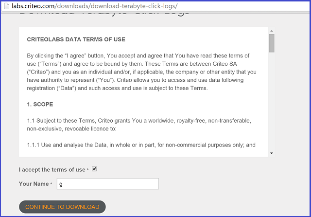
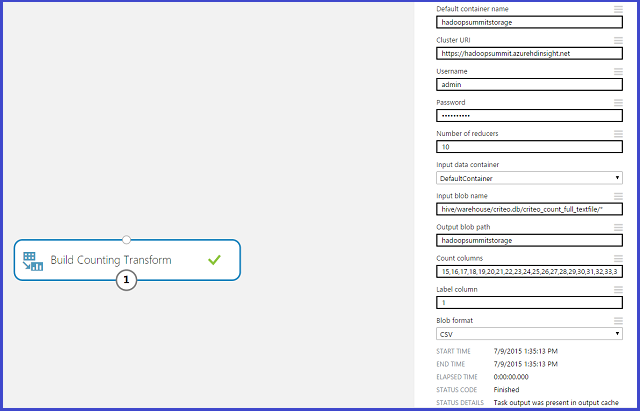
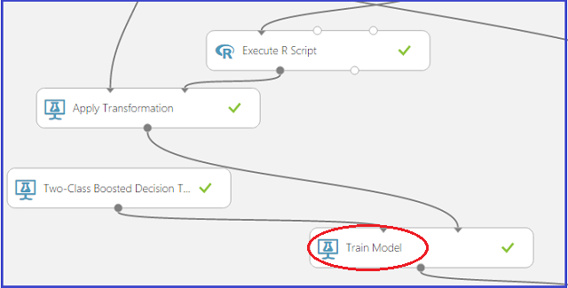
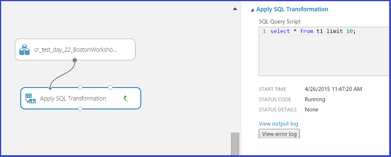
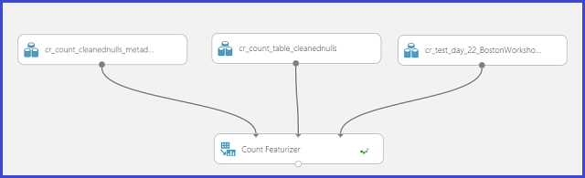
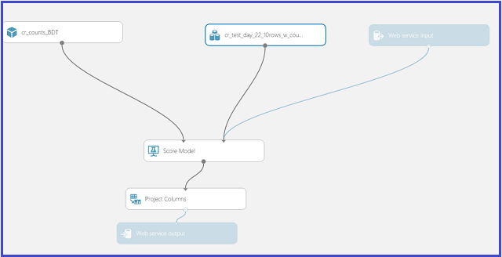
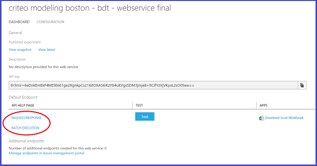

<properties
    pageTitle="Team von Daten Wissenschaft in Aktion: mit HDInsight Hadoop für das Dataset Criteo 1 TB Cluster | Microsoft Azure"
    description="Mithilfe von Team von Wissenschaft Daten für ein End-to-End-Szenario mit einem HDInsight Hadoop Cluster das Erstellen und Bereitstellen eines Modells mithilfe eines großen (1 TB) Datasets öffentlich verfügbaren"
    services="machine-learning,hdinsight"
    documentationCenter=""
    authors="bradsev"
    manager="jhubbard"
    editor="cgronlun" />

<tags
    ms.service="machine-learning"
    ms.workload="data-services"
    ms.tgt_pltfrm="na"
    ms.devlang="na"
    ms.topic="article"
    ms.date="09/13/2016"
    ms.author="bradsev" />

# Team von Daten Wissenschaft in Aktion – Azure HDInsight Hadoop Cluster verwenden, klicken Sie auf ein Dataset 1 TB

In dieser Anleitung erfahren Sie zeigen wir, Team von Wissenschaft Daten in einem End-to-End-Szenario mit einer [Azure HDInsight Hadoop Cluster](https://azure.microsoft.com/services/hdinsight/) zu speichern, durchsuchen, Feature Engineering, und nach unten Beispieldaten aus einem der öffentlich zugänglichen [Criteo](http://labs.criteo.com/downloads/download-terabyte-click-logs/) Datasets verwenden. Wir verwenden Azure maschinellen Schulung, um ein Modell binäre Klassifizierung auf diese Daten zu erstellen. Wir auch anzeigen, wie Sie eine der folgenden Modelle als Webdienst veröffentlichen.

Es ist es möglich, ein Notizbuch IPython verwenden, um die Aufgaben in dieser Anleitung erfahren präsentiert. Benutzer, die zu diesem Ansatz versuchen sollten finden Sie im Thema [Criteo Exemplarische Vorgehensweise über eine Struktur ODBC-Verbindung](https://github.com/Azure/Azure-MachineLearning-DataScience/blob/master/Misc/DataScienceProcess/iPythonNotebooks/machine-Learning-data-science-process-hive-walkthrough-criteo.ipynb) in.

## Criteo Dataset Beschreibung

Die Criteo, die Daten auf Vorhersage Dataset ist, etwa 370GB Gzip komprimierte TSV-Dateien (~1.3TB nicht komprimiert), umfasst mehr als 4.3 Milliarden Einträge. Es ist 24 Tagen werden entnommen klicken Sie auf Daten von [Criteo](http://labs.criteo.com/downloads/download-terabyte-click-logs/)zur Verfügung gestellt. Die Nutzung von Daten Wissenschaftler haben wir uns so experimentieren Sie mit verfügbaren Daten entpackt haben.

Jeder Datensatz in dieses Dataset enthält 40 Spalten:

- die erste Spalte ist eine Bezeichnungsspalte, der angibt, ob ein Benutzer ein **Hinzufügen** (Wert 1 klickt) oder nicht auf eine (Wert 0)
- als Nächstes 13 Spalten werden numerische, und
- letzte 26 sind kategorisierten Spalten.

Die Spalten werden anonymisiert und verwenden Sie eine Reihe von aufgezählten Namen: "SP1" (für die einer Beschriftungsspalte) zu "Col40" (für die letzte sortierte Spalte).            

Hier ist ein Ausschnitt der ersten 20 Spalten von zwei Beobachtungen (Zeilen) aus diesem Dataset aus:

    Col1    Col2    Col3    Col4    Col5    Col6    Col7    Col8    Col9    Col10   Col11   Col12   Col13   Col14   Col15           Col16           Col17           Col18           Col19       Col20

    0       40      42      2       54      3       0       0       2       16      0       1       4448    4       1acfe1ee        1b2ff61f        2e8b2631        6faef306        c6fc10d3    6fcd6dcb           
    0               24              27      5               0       2       1               3       10064           9a8cb066        7a06385f        417e6103        2170fc56        acf676aa    6fcd6dcb                      

In diesem Dataset sind fehlende Werte in den Spalten numerischen und kategorisierten vorhanden. Eine einfache Methode für den Umgang mit der fehlenden Werte beschrieben. Weitere Details zu den Daten werden untersucht, wenn wir ihnen in Struktur Tabellen speichern.

**Definition:** *Durchklick Zins (STRG):* Dies ist der Prozentsatz der Klicks in den Daten. In diesem Dataset Criteo ist der Preis Vorschlagen etwa 3.3 % oder 0.033.

## Beispiele für Vorhersage Aufgaben
In dieser exemplarische Vorgehensweise werden zwei Stichproben Vorhersage Probleme behandelt:

1. **Binäre Klassifizierung**: schätzt, ob ein Benutzer ein Hinzufügen geklickt haben:
    - Class 0: Keine auf
    - Klasse 1: Klicken Sie auf

2. **Regression**: schätzt die Wahrscheinlichkeit, dass eine Ad auf aus Benutzerfunktionen.

## Ein HDInsight Hadoop von Cluster für Wissenschaft Daten

**Hinweis:** Dies ist in der Regel ein **Administrator** -Vorgang.

Richten Sie Ihre Daten für Wissenschaft Azure-Umgebung für die Erstellung von Vorhersageanalytik Lösungen mit HDInsight Cluster in drei Schritte:

1. [Erstellen eines Kontos Speicher](../storage/storage-create-storage-account.md): dieses Speicherkonto zum Speichern von Daten in Azure BLOB-Speicher verwendet wird. Hier werden in HDInsight Cluster verwendeten Daten die festgehalten.

2. [Anpassen von Azure HDInsight Hadoop Cluster für die Daten Wissenschaft](machine-learning-data-science-customize-hadoop-cluster.md): Dieser Schritt erstellt einen Azure HDInsight Hadoop Cluster mit 64-Bit-Anaconda Python 2.7 auf allen Knoten installiert. Es gibt zwei wichtigen Schritte aus (in diesem Artikel beschrieben) beim Anpassen des HDInsight Clusters ausführen.

    * Verknüpfen Sie das Speicher-Konto in Schritt 1 mit Ihren Cluster HDInsight erstellt, wenn sie erstellt wurde. Dieses Speicherkonto wird verwendet, für den Zugriff auf Daten, die im Cluster verarbeitet werden können.

    * Sie müssen RAS auf den am Knoten des Cluster aktivieren, nachdem sie erstellt wurde. Beachten Sie die hier (weichen von den für den Cluster bei seiner Erstellung) angegebenen Anmeldeinformationen für den remote Zugriff: Sie benötigen sie die folgenden Schritte ausführen.

3. [Erstellen eines Arbeitsbereichs Azure ML](machine-learning-create-workspace.md): Arbeitsbereich diese Azure Computer lernen dient zum Erstellen von maschinellen Learning-Modellen nach einer Untersuchung Ausgangsdaten und nach unten auf dem Cluster HDInsight werden.

## Abrufen und Nutzen von Daten aus einer öffentlichen Datenquelle

Durch Klicken auf den Link, die Nutzungsbedingungen akzeptiert und einen Namen, kann das Dataset [Criteo](http://labs.criteo.com/downloads/download-terabyte-click-logs/) zugegriffen werden. Eine Momentaufnahme der wie folgt aussieht lautet:

Klicken Sie auf **Weiter, um den Download** , um weitere Informationen zu den Dataset und seine Verfügbarkeit.

Befinden sich die Daten in einem öffentlichen Standort von [Azure BLOB-Speicher](../storage/storage-dotnet-how-to-use-blobs.md) : wasb://criteo@azuremlsampleexperiments.blob.core.windows.net/raw/. Die "Wasb" bezieht sich auf Azure BLOB-Speicher Speicherort. 

1. Die Daten in dieser öffentlichen Blob-Speicher besteht aus drei Unterordner extrahiert Daten.

    1. Die Unterordner *unformatierten/zählen/* enthält die ersten 21 Tage der Daten - Tag\_00 bis Tag\_20
    2. Die Unterordner *unformatierten/Zug/* besteht aus einem einzigen Tag des Daten, Tag\_21
    3. Die Unterordner *unformatierten/Test/* besteht aus zwei Tage der Daten, Tag\_22 und Tag\_23

2. Für diejenigen, die mit den Daten unformatierten Gzip beginnen möchten, diese stehen auch im Hauptfenster Ordner *unformatierten /* als day_NN.gz, wobei NN von 00 bis 23 wechselt.

Ein alternativer Ansatz für den Zugriff auf Durchsuchen, und das Modell, die diese Daten, die keine lokale Downloads erfordert weiter unten in diesem Exemplarische Vorgehensweise erläutert werden, wenn wir Struktur Tabellen erstellen.

## Melden Sie sich bei der Cluster headnode

Wenn Sie an der Headnode der Cluster angemeldet haben, mithilfe von der [Azure-Portal](https://ms.portal.azure.com) Cluster gefunden werden. Klicken Sie auf das Symbol HDInsight Elefanten auf der linken Seite, und doppelklicken Sie dann auf den Namen der Cluster. Navigieren Sie zur Registerkarte **Konfiguration** , doppelklicken Sie auf das Verbinden-Symbol am unteren Rand der Seite, und geben Sie Ihre Anmeldeinformationen RAS, wenn Sie dazu aufgefordert werden. Dadurch gelangen Sie zu der Headnode im Cluster.

So sieht eine typische ersten Anmelden bei der Cluster Headnode aussieht:

Klicken Sie auf der linken Seite sehen wir die "Hadoop Befehlszeile", also unsere Arbeit für das Durchsuchen von Daten aus. Wir Siehe auch hilfreich URLs – "Hadoop aus Status" und "Knoten Hadoop Name". Die URL aus Status zeigt des Projektstatus und die Namen Knoten URL enthält eine ausführliche der Cluster-Konfigurations.

Jetzt wir werden eingerichtet und bereit für die ersten Teil der exemplarische Vorgehensweise: Durchsuchen von Daten mithilfe von Struktur und Abrufen von Daten für Azure maschinellen Schulung bereit.

## Erstellen der Struktur Datenbanken und Tabellen

Um die Struktur der Tabellen für unsere Criteo Dataset zu erstellen, öffnen Sie die ***Befehlszeile Hadoop*** auf dem Desktop des Knotens am, und geben Sie Verzeichnis Struktur, durch Eingabe des Befehls

    cd %hive_home%\bin

>[AZURE.NOTE] Führen Sie alle Struktur Befehle in dieser Anleitung erfahren Sie, aus dem Papierkorb Struktur / Directory auffordern. Dies erledigt Probleme Pfad automatisch. Wir verwenden Sie die Begriffe "Struktur Verzeichnis auffordern", "Struktur Papierkorb / Directory auffordern", und "Hadoop Befehlszeile" Synonym.

>[AZURE.NOTE]  Um eine Struktur Abfrage ausführen, kann eine immer die folgenden Befehle verwenden:

        cd %hive_home%\bin
        hive

Nachdem Sie mit der Struktur REPL angezeigt wird ein "Struktur >"melden, einfach Ausschneiden und Einfügen die Abfrage, um sie auszuführen.

Mit dem folgende Code wird eine Datenbank "Criteo" erstellt und dann 4 Tabellen generiert:

* eine *Tabelle zum Generieren von zählt* erstellt am Tag Tage\_00 bis Tag\_20,
* eine *Tabelle für den Einsatz als Zug Dataset* erstellt am Tag\_21, und
* zwei *Tabellen für verwenden, wie die Test-Datasets* erstellt am Tag\_22 und Tag\_23 Hilfethemas.

Wir aufteilen unser Test-Dataset in zwei verschiedenen Tabellen, da einen der Tage eines arbeitsfreien ist, und wir möchten, um festzustellen, ob das Modell Unterschiede zwischen einer "Feiertag" und nicht "Feiertag" aus der Durchklick Zins erkennen kann.

Das Skript [Stichprobe & #95; Struktur & #95; erstellen & #95; Criteo & #95; Datenbank & #95; und & #95;tables.hql](https://github.com/Azure/Azure-MachineLearning-DataScience/blob/master/Misc/DataScienceProcess/DataScienceScripts/sample_hive_create_criteo_database_and_tables.hql) zur Vereinfachung hier angezeigt:

    CREATE DATABASE IF NOT EXISTS criteo;
    DROP TABLE IF EXISTS criteo.criteo_count;
    CREATE TABLE criteo.criteo_count (
    col1 string,col2 double,col3 double,col4 double,col5 double,col6 double,col7 double,col8 double,col9 double,col10 double,col11 double,col12 double,col13 double,col14 double,col15 string,col16 string,col17 string,col18 string,col19 string,col20 string,col21 string,col22 string,col23 string,col24 string,col25 string,col26 string,col27 string,col28 string,col29 string,col30 string,col31 string,col32 string,col33 string,col34 string,col35 string,col36 string,col37 string,col38 string,col39 string,col40 string)
    ROW FORMAT DELIMITED FIELDS TERMINATED BY '\t'
    LINES TERMINATED BY '\n'
    STORED AS TEXTFILE LOCATION 'wasb://criteo@azuremlsampleexperiments.blob.core.windows.net/raw/count';

    DROP TABLE IF EXISTS criteo.criteo_train;
    CREATE TABLE criteo.criteo_train (
    col1 string,col2 double,col3 double,col4 double,col5 double,col6 double,col7 double,col8 double,col9 double,col10 double,col11 double,col12 double,col13 double,col14 double,col15 string,col16 string,col17 string,col18 string,col19 string,col20 string,col21 string,col22 string,col23 string,col24 string,col25 string,col26 string,col27 string,col28 string,col29 string,col30 string,col31 string,col32 string,col33 string,col34 string,col35 string,col36 string,col37 string,col38 string,col39 string,col40 string)
    ROW FORMAT DELIMITED FIELDS TERMINATED BY '\t'
    LINES TERMINATED BY '\n'
    STORED AS TEXTFILE LOCATION 'wasb://criteo@azuremlsampleexperiments.blob.core.windows.net/raw/train';

    DROP TABLE IF EXISTS criteo.criteo_test_day_22;
    CREATE TABLE criteo.criteo_test_day_22 (
    col1 string,col2 double,col3 double,col4 double,col5 double,col6 double,col7 double,col8 double,col9 double,col10 double,col11 double,col12 double,col13 double,col14 double,col15 string,col16 string,col17 string,col18 string,col19 string,col20 string,col21 string,col22 string,col23 string,col24 string,col25 string,col26 string,col27 string,col28 string,col29 string,col30 string,col31 string,col32 string,col33 string,col34 string,col35 string,col36 string,col37 string,col38 string,col39 string,col40 string)
    ROW FORMAT DELIMITED FIELDS TERMINATED BY '\t'
    LINES TERMINATED BY '\n'
    STORED AS TEXTFILE LOCATION 'wasb://criteo@azuremlsampleexperiments.blob.core.windows.net/raw/test/day_22';

    DROP TABLE IF EXISTS criteo.criteo_test_day_23;
    CREATE TABLE criteo.criteo_test_day_23 (
    col1 string,col2 double,col3 double,col4 double,col5 double,col6 double,col7 double,col8 double,col9 double,col10 double,col11 double,col12 double,col13 double,col14 double,col15 string,col16 string,col17 string,col18 string,col19 string,col20 string,col21 string,col22 string,col23 string,col24 string,col25 string,col26 string,col27 string,col28 string,col29 string,col30 string,col31 string,col32 string,col33 string,col34 string,col35 string,col36 string,col37 string,col38 string,col39 string,col40 string)
    ROW FORMAT DELIMITED FIELDS TERMINATED BY '\t'
    LINES TERMINATED BY '\n'
    STORED AS TEXTFILE LOCATION 'wasb://criteo@azuremlsampleexperiments.blob.core.windows.net/raw/test/day_23';

Wir Beachten Sie, dass alle in diesen Tabellen externen sind, wie wir einfach auf Azure BLOB-Speicher (Wasb) Speicherorte verweisen.

**Es gibt zwei Methoden, um die Struktur jedes Abfrage ausführen, die wir nun erwähnen.**

1. **Verwenden Sie die Struktur REPL Befehlszeile**: der erste ist Emission einen Befehl "Struktur" und kopieren und Einfügen von einer Abfrage an die Struktur REPL Befehlszeile. Dazu gehen Sie wie folgt:

        cd %hive_home%\bin
        hive

    Jetzt wird ausgeführt am die Befehlszeile REPL, Ausschneiden und Einfügen der Abfrage.

2. **Abfragen in eine Datei speichern und den Befehl ausführen**: die zweite besteht darin, speichern die Abfragen in einer .hql-Datei ([Stichprobe & #95; Struktur & #95; erstellen & #95; Criteo & #95; Datenbank & #95; und & #95;tables.hql](https://github.com/Azure/Azure-MachineLearning-DataScience/blob/master/Misc/DataScienceProcess/DataScienceScripts/sample_hive_create_criteo_database_and_tables.hql)) und führen Sie den folgenden Befehl aus, um die Abfrage auszuführen:

        hive -f C:\temp\sample_hive_create_criteo_database_and_tables.hql

### Bestätigen Sie die Datenbank und Tabelle erstellen

Als Nächstes wir bestätigen Sie die Erstellung der Datenbank mit dem folgenden Befehl aus dem Papierkorb Struktur / Directory auffordern:

        hive -e "show databases;"

Dadurch werden:

        criteo
        default
        Time taken: 1.25 seconds, Fetched: 2 row(s)

Dadurch wird die Erstellung der neuen Datenbank, "Criteo" bestätigt.

Um welche Tabellen finden Sie unter wir erstellt haben, wir führen Sie einfach den Befehl aus dem Papierkorb Struktur / Directory auffordern:

        hive -e "show tables in criteo;"

Wir sehen dann die folgende Ausgabe:

        criteo_count
        criteo_test_day_22
        criteo_test_day_23
        criteo_train
        Time taken: 1.437 seconds, Fetched: 4 row(s)

##Durchsuchen von Daten in die Struktur

Nun können wir einige Durchsuchen von grundlegenden Daten in die Struktur nutzen möchten. Wir beginnen, indem Sie die Anzahl der Beispiele im Zug gezählt und Testen von Datentabellen.

### Anzahl der Zug Beispiele

Der Inhalt der [Stichprobe & #95; Struktur & #95; Count & #95; Zug & #95; Tabelle & #95;examples.hql](https://github.com/Azure/Azure-MachineLearning-DataScience/blob/master/Misc/DataScienceProcess/DataScienceScripts/sample_hive_count_train_table_examples.hql) lauten wie folgt:

        SELECT COUNT(*) FROM criteo.criteo_train;

Dies ergibt:

        192215183
        Time taken: 264.154 seconds, Fetched: 1 row(s)

Sie können auch eine möglicherweise auch führen Sie folgenden Befehl aus dem Papierkorb Struktur / Directory auffordern:

        hive -f C:\temp\sample_hive_count_criteo_train_table_examples.hql

### Anzahl der Test Beispiele in den beiden Test datasets

Wir nun Anzahl die von Beispielen in den beiden Test Datasets. Der Inhalt des [Stichprobe & #95; Struktur & #95; Count & #95; Criteo & #95; Test & #95; Tag & #95; 22 & #95; Tabelle & #95;examples.hql](https://github.com/Azure/Azure-MachineLearning-DataScience/blob/master/Misc/DataScienceProcess/DataScienceScripts/sample_hive_count_criteo_test_day_22_table_examples.hql) hier sind:

        SELECT COUNT(*) FROM criteo.criteo_test_day_22;

Dies ergibt:

        189747893
        Time taken: 267.968 seconds, Fetched: 1 row(s)

Wie gewohnt, wir möglicherweise auch rufen Sie das Skript aus dem Papierkorb Struktur / Directory Aufforderung von den Befehl ausgeben:

        hive -f C:\temp\sample_hive_count_criteo_test_day_22_table_examples.hql

Schließlich untersuchen wir die Anzahl der Test-Beispiele im Test Dataset basierend auf Tag\_23.

Der Befehl Zweck ist ähnlich dem oben gezeigte (siehe [Beispiel & #95; Struktur & #95; Count & #95; Criteo & #95; Test & #95; Tag & #95; 23 & #95;examples.hql](https://github.com/Azure/Azure-MachineLearning-DataScience/blob/master/Misc/DataScienceProcess/DataScienceScripts/sample_hive_count_criteo_test_day_23_examples.hql)):

        SELECT COUNT(*) FROM criteo.criteo_test_day_23;

Dadurch werden:

        178274637
        Time taken: 253.089 seconds, Fetched: 1 row(s)

### Beschriftung Verteilung im Zug dataset

Die Verteilung der Beschriftung im Zug Dataset ist von Interesse. Um dies zu sehen, anzeigen wir Inhalt der [Stichprobe & #95; Struktur & #95; Criteo & #95; Beschriftung & #95; Verteilung & #95; Zug & #95;table.hql](https://github.com/Azure/Azure-MachineLearning-DataScience/blob/master/Misc/DataScienceProcess/DataScienceScripts/sample_hive_criteo_label_distribution_train_table.hql):

        SELECT Col1, COUNT(*) AS CT FROM criteo.criteo_train GROUP BY Col1;

Dies ergibt die Bezeichnung Verteilung:

        1       6292903
        0       185922280
        Time taken: 459.435 seconds, Fetched: 2 row(s)

Beachten Sie, dass der Prozentsatz der positive Etiketten 3.3 % (mit dem ursprünglichen Dataset konsistent) ist.

### Histogramm Verteilung von einigen numerischen Variablen im Zug dataset

Wir können die Struktur des einheitlichen "Histogramm\_numerischen" (Funktion), um herauszufinden, wie die Verteilung der numerischen Variablen aussieht. Hier sind die Inhalte der [Stichprobe & #95; Struktur & #95; Criteo & #95; Histogramm & #95;numeric.hql](https://github.com/Azure/Azure-MachineLearning-DataScience/blob/master/Misc/DataScienceProcess/DataScienceScripts/sample_hive_criteo_histogram_numeric.hql):

        SELECT CAST(hist.x as int) as bin_center, CAST(hist.y as bigint) as bin_height FROM
            (SELECT
            histogram_numeric(col2, 20) as col2_hist
            FROM
            criteo.criteo_train
            ) a
            LATERAL VIEW explode(col2_hist) exploded_table as hist;

Dies ergibt Folgendes:

        26      155878415
        2606    92753
        6755    22086
        11202   6922
        14432   4163
        17815   2488
        21072   1901
        24113   1283
        27429   1225
        30818   906
        34512   723
        38026   387
        41007   290
        43417   312
        45797   571
        49819   428
        53505   328
        56853   527
        61004   160
        65510   3446
        Time taken: 317.851 seconds, Fetched: 20 row(s)

Die Ansicht – LATERAL Explosion Kombination in Struktur dient für eine SQL-ähnliche Ausgabe anstelle der üblichen Liste an. Beachten Sie, dass in dieser Tabelle, die erste Spalte im Papierkorb Center und die Sekunde in den Papierkorb Häufigkeit entspricht.

### Ungefähre Quantile zwischen der einige numerische Variablen im Zug dataset

Auch ist relevante mit numerischen Variablen die Berechnung der ungefähren Quantile zwischen. Struktur der systemeigenen "Quantil\_ungefähre" bedeutet dies für uns. Der Inhalt des [Stichprobe & #95; Struktur & #95; Criteo & #95; ungefähren & #95;percentiles.hql](https://github.com/Azure/Azure-MachineLearning-DataScience/blob/master/Misc/DataScienceProcess/DataScienceScripts/sample_hive_criteo_approximate_percentiles.hql) sind:

        SELECT MIN(Col2) AS Col2_min, PERCENTILE_APPROX(Col2, 0.1) AS Col2_01, PERCENTILE_APPROX(Col2, 0.3) AS Col2_03, PERCENTILE_APPROX(Col2, 0.5) AS Col2_median, PERCENTILE_APPROX(Col2, 0.8) AS Col2_08, MAX(Col2) AS Col2_max FROM criteo.criteo_train;

Dies ergibt:

        1.0     2.1418600917169246      2.1418600917169246    6.21887086390288 27.53454893115633       65535.0
        Time taken: 564.953 seconds, Fetched: 1 row(s)

Deaktivieren Sie wir, dass die Verteilung der Quantile zwischen eng miteinander in der Regel das Histogramm Verteilung der beliebige numerische Variable verbunden ist.        

### Suchen Sie Anzahl der eindeutigen Werte für einige kategorisierten Spalten im Zug dataset

Durchsuchen von Daten zu erhalten, suchen wir nun, für einige kategorisierten Spalten, die Anzahl der eindeutigen Werte, die sie ergreifen. Dazu zeigen wir den Inhalt der [Stichprobe & #95; Struktur & #95; Criteo & #95; eindeutige & #95; Werte und #95;categoricals.hql](https://github.com/Azure/Azure-MachineLearning-DataScience/blob/master/Misc/DataScienceProcess/DataScienceScripts/sample_hive_criteo_unique_values_categoricals.hql):

        SELECT COUNT(DISTINCT(Col15)) AS num_uniques FROM criteo.criteo_train;

Dies ergibt:

        19011825
        Time taken: 448.116 seconds, Fetched: 1 row(s)

Wir Beachten Sie, dass Col15 19 M eindeutige Werte hat! Verwendung naive Techniken wie "Chi Tastaturkürzel Codierung" ist um solche hoher mehrdimensional kategorisierten Variablen codieren unmöglich ist. Insbesondere erläutert, und führen Sie vor einer leistungsfähigen, robuste-Technik, die für dieses Problem effizienten Bekämpfung namens [Learning mit ermittelt](http://blogs.technet.com/b/machinelearning/archive/2015/02/17/big-learning-made-easy-with-counts.aspx) .

Wir in diesem Abschnitt untergeordnete anhand der Anzahl eindeutiger Werte für einige der anderen kategorisierten Spalten sowie zu beenden. Der Inhalt des [Stichprobe & #95; Struktur & #95; Criteo & #95; eindeutige & #95; Werte & #95; Vielfache & #95;categoricals.hql](https://github.com/Azure/Azure-MachineLearning-DataScience/blob/master/Misc/DataScienceProcess/DataScienceScripts/sample_hive_criteo_unique_values_multiple_categoricals.hql) sind:

        SELECT COUNT(DISTINCT(Col16)), COUNT(DISTINCT(Col17)),
        COUNT(DISTINCT(Col18), COUNT(DISTINCT(Col19), COUNT(DISTINCT(Col20))
        FROM criteo.criteo_train;

Dies ergibt:

        30935   15200   7349    20067   3
        Time taken: 1933.883 seconds, Fetched: 1 row(s)

Erneut sehen wir, dass eine Ausnahme bilden jedoch Col20, alle anderen Spalten Anzahl der eindeutigen Werte.

### Zählt die gemeinsame Vorkommen der Paare von kategorisierten Variablen im Zug dataset

Zählt die gemeinsame Vorkommen der Paare von kategorisierten Variablen ist auch von Interesse. Dies kann mithilfe des Codes in ermittelt werden [Stichprobe & #95; Struktur & #95; Criteo & #95; gepaarten & #95; Kategorieliste & #95;counts.hql](https://github.com/Azure/Azure-MachineLearning-DataScience/blob/master/Misc/DataScienceProcess/DataScienceScripts/sample_hive_criteo_paired_categorical_counts.hql):

        SELECT Col15, Col16, COUNT(*) AS paired_count FROM criteo.criteo_train GROUP BY Col15, Col16 ORDER BY paired_count DESC LIMIT 15;

Wir reverse deren Vorkommen der Zähler sortieren, und suchen Sie in diesem Fall im Kopfbereich 15 aus. (Datumuhrzeitschlüssel):

        ad98e872        cea68cd3        8964458
        ad98e872        3dbb483e        8444762
        ad98e872        43ced263        3082503
        ad98e872        420acc05        2694489
        ad98e872        ac4c5591        2559535
        ad98e872        fb1e95da        2227216
        ad98e872        8af1edc8        1794955
        ad98e872        e56937ee        1643550
        ad98e872        d1fade1c        1348719
        ad98e872        977b4431        1115528
        e5f3fd8d        a15d1051        959252
        ad98e872        dd86c04a        872975
        349b3fec        a52ef97d        821062
        e5f3fd8d        a0aaffa6        792250
        265366bf        6f5c7c41        782142
        Time taken: 560.22 seconds, Fetched: 15 row(s)

## Nach unten (Beispiel) die Datasets für Azure Computer-Schulung

Probleme untersucht die Datasets und gezeigt, wie wir diese Art der Untersuchung für alle Variablen (einschließlich Kombinationen), wir nun unten Beispiel die angegebenen Datengruppen kann möglicherweise, damit wir Modelle Azure Computer interessante erstellen können. Zurückrufen, der das Problem wir möchten: Wenn eine Gruppe von Beispiel Attribute (Feature Werte von SP2 - Col40), wir Vorhersagen SP1 ist 0 (keine klicken) oder 1 (klicken Sie hier).

Um Beispiele für unsere Zug und Datasets um 1 % der Originalgröße testen, verwenden wir die Struktur einer systemeigenen Zufallszahl () (Funktion). Das nächste Skript, macht [Stichprobe & #95; Struktur & #95; Criteo & #95; Neuberechnen & #95; Zug & #95;dataset.hql](https://github.com/Azure/Azure-MachineLearning-DataScience/blob/master/Misc/DataScienceProcess/DataScienceScripts/sample_hive_criteo_downsample_train_dataset.hql) 's für das Dataset Zug:

        CREATE TABLE criteo.criteo_train_downsample_1perc (
        col1 string,col2 double,col3 double,col4 double,col5 double,col6 double,col7 double,col8 double,col9 double,col10 double,col11 double,col12 double,col13 double,col14 double,col15 string,col16 string,col17 string,col18 string,col19 string,col20 string,col21 string,col22 string,col23 string,col24 string,col25 string,col26 string,col27 string,col28 string,col29 string,col30 string,col31 string,col32 string,col33 string,col34 string,col35 string,col36 string,col37 string,col38 string,col39 string,col40 string)
        ROW FORMAT DELIMITED FIELDS TERMINATED BY '\t'
        LINES TERMINATED BY '\n'
        STORED AS TEXTFILE;

        ---Now downsample and store in this table

        INSERT OVERWRITE TABLE criteo.criteo_train_downsample_1perc SELECT * FROM criteo.criteo_train WHERE RAND() <= 0.01;

Dies ergibt:

        Time taken: 12.22 seconds
        Time taken: 298.98 seconds

Das Skript [Stichprobe & #95; Struktur & #95; Criteo & #95; Neuberechnen & #95; Test & #95; Tag & #95; 22 & #95;dataset.hql](https://github.com/Azure/Azure-MachineLearning-DataScience/blob/master/Misc/DataScienceProcess/DataScienceScripts/sample_hive_criteo_downsample_test_day_22_dataset.hql) ist es für Testdaten, Tag\_22:

        --- Now for test data (day_22)

        CREATE TABLE criteo.criteo_test_day_22_downsample_1perc (
        col1 string,col2 double,col3 double,col4 double,col5 double,col6 double,col7 double,col8 double,col9 double,col10 double,col11 double,col12 double,col13 double,col14 double,col15 string,col16 string,col17 string,col18 string,col19 string,col20 string,col21 string,col22 string,col23 string,col24 string,col25 string,col26 string,col27 string,col28 string,col29 string,col30 string,col31 string,col32 string,col33 string,col34 string,col35 string,col36 string,col37 string,col38 string,col39 string,col40 string)
        ROW FORMAT DELIMITED FIELDS TERMINATED BY '\t'
        LINES TERMINATED BY '\n'
        STORED AS TEXTFILE;

        INSERT OVERWRITE TABLE criteo.criteo_test_day_22_downsample_1perc SELECT * FROM criteo.criteo_test_day_22 WHERE RAND() <= 0.01;

Dies ergibt:

        Time taken: 1.22 seconds
        Time taken: 317.66 seconds

Schließlich das Skript [Stichprobe & #95; Struktur & #95; Criteo & #95; Neuberechnen & #95; Test & #95; Tag & #95; 23 & #95;dataset.hql](https://github.com/Azure/Azure-MachineLearning-DataScience/blob/master/Misc/DataScienceProcess/DataScienceScripts/sample_hive_criteo_downsample_test_day_23_dataset.hql) erledigt das für Testdaten, Tag\_23:

        --- Finally test data day_23
        CREATE TABLE criteo.criteo_test_day_23_downsample_1perc (
        col1 string,col2 double,col3 double,col4 double,col5 double,col6 double,col7 double,col8 double,col9 double,col10 double,col11 double,col12 double,col13 double,col14 double,col15 string,col16 string,col17 string,col18 string,col19 string,col20 string,col21 string,col22 string,col23 string,col24 string,col25 string,col26 string,col27 string,col28 string,col29 string,col30 string,col31 string,col32 string,col33 string,col34 string,col35 string,col36 string,col37 string,col38 string,col39 string,col40 srical feature; tring)
        ROW FORMAT DELIMITED FIELDS TERMINATED BY '\t'
        LINES TERMINATED BY '\n'
        STORED AS TEXTFILE;

        INSERT OVERWRITE TABLE criteo.criteo_test_day_23_downsample_1perc SELECT * FROM criteo.criteo_test_day_23 WHERE RAND() <= 0.01;

Dies ergibt:

        Time taken: 1.86 seconds
        Time taken: 300.02 seconds

Mit dieser Option können wir unsere nach unten aufgenommene Zug und Datasets zum Erstellen von Modellen Azure Computer interessante testen.

Es gibt eine endgültige wichtige Komponente auf, bevor wir navigieren Sie zum Azure maschinellen Schulung, also Bedenken die Tabelle zählen. Im nächsten Abschnitt untergeordnete erläutern wir dies detailliert beschrieben.

##Eine kurze Diskussion zu der Tabelle zählen

Wie wir gesehen haben, haben mehrere kategorisierte Variablen einer großen Anzahl der Dimensionen an. In unseren Anleitung erfahren Sie stellen wir eine leistungsfähige Technik aufgerufen, um diese Variablen in einer effizient, robuste Weise codieren [Learning mit ermittelt](http://blogs.technet.com/b/machinelearning/archive/2015/02/17/big-learning-made-easy-with-counts.aspx) . Weitere Informationen zu dieser Technik ist in den bereitgestellten Link.

**Hinweis:** In dieser Anleitung erfahren Sie liegt der Schwerpunkt zur Verwendung von zählen Tabellen compact Darstellungen von hoher mehrdimensional kategorisierten Features werden. Dies ist nicht die einzige Möglichkeit zum Codieren kategorisierten Features. Weitere Informationen zu anderen Techniken können interessiert Benutzer [eine-Tastaturkürzel-Codierung](http://en.wikipedia.org/wiki/One-hot) und die [Funktion hashing](http://en.wikipedia.org/wiki/Feature_hashing)Auschecken.

Anzahl Tabellen auf der Registerkarte zählen Daten erstellen, werden die Daten in der unformatierten/Ordneranzahl verwenden. Im Abschnitt Modellierung wir anzeigen Benutzer so erstellen Sie diese Anzahl von Tabellen für kategorisierte Features von Grund auf, oder Sie können auch mit einer vordefinierten Anzahl Tabelle für ihre kennen. In welchen folgt Wenn wir verweisen "vorgefertigte zählen Tabellen", bedeutet, dass wir verwenden des Anzahl von Tabellen, die wir bereitstellen. Wenn Sie ausführliche Anweisungen zum Zugreifen auf diese Tabellen werden im nächsten Abschnitt bereitgestellt.

## Erstellen eines Modells mit Azure Computer-Schulung

Unser Modell Erstellungsprozess Azure Computer interessante umfasst folgende Schritte aus:

1. [Abrufen der Daten aus Tabellen Struktur in Azure Computer-Schulung](#step1)
2. [Erstellen der experimentieren: Bereinigen die Daten, und wählen Sie einen Teilnehmern, und klicken Sie auf mit mit Anzahl Tabellen](#step2)
3. [Schulen von Modell](#step3)
4. [Punktzahl das Modell auf Testdaten](#step4)
5. [Auswerten des Modells](#step5)
6. [Veröffentlichen Sie das Modell als Webdienst und genutzt werden sollen](#step6)

Nun können wir Modelle in Azure maschinellen Learning Studio zu erstellen. Unsere unten gesammelten Daten als Struktur Tabellen im Cluster gespeichert ist. Wir verwenden das Modul Azure maschinellen Learning **Daten importieren** , um diese Daten lesen. Die Anmeldeinformationen für den Zugriff auf die Speicherkonto für diesen Cluster werden in wie folgt bereitgestellt.

### Schritt 1: Abrufen von Daten aus Tabellen Struktur in Azure maschinellen Learning mithilfe des Moduls Daten importieren, und wählen Sie ihn für einen Computer experimentieren learning

Durch Auswahl eines **+ neu**starten -> **EXPERIMENTIEREN** -> **Leere experimentieren**. Suchen Sie dann über **das Suchfeld oben links,** nach "Daten importieren". Ziehen Sie und legen Sie des Moduls **Daten importieren** an den Zeichenbereich experimentieren (mittlere Teil des Bildschirms ab), um das Modul für den Zugriff auf Daten verwenden.

Wie die **Daten importieren** aussieht, beim Abrufen von Daten aus der strukturtabelle sieht folgendermaßen aus:

Für das Modul **Daten importieren** werden die Werte der Parameter, die in der Grafik bereitgestellt werden nur Beispiele für die Sortierung der Werte, die Sie angeben müssen. Hier sind einige allgemeine Anleitung zum Ausfüllen des Parameters für das **Importieren von Daten** Modul festgelegt.

1. Wählen Sie "Struktur Abfrage" für die **Datenquelle** aus.
2. Im **Struktur Datenbankabfrage** , eine einfache SELECT * FROM < Ihrer\_Datenbank\_name.your\_Tabelle\_Namen >-reicht.
3. **Hcatalog Server-URI**: Wenn Ihre Cluster "Abc", wird dies einfach ist: https://abc.azurehdinsight.net
4. **Hadoop Konto Benutzername**: der Benutzername, der zum Zeitpunkt der Inbetriebnahme Cluster ausgewählt. (Nicht die RAS Benutzername!)
5. **Hadoop des Kennworts des Benutzerkontos**: das Kennwort für den Benutzernamen, die zum Zeitpunkt der Inbetriebnahme Cluster ausgewählt. (Nicht die RAS-Kennwort!)
6. **Speicherort der Ausgabedaten**: Wählen Sie "Azure" aus.
7. **Azure-Speicher Kontoname**: Cluster zugeordnete Speicherplatz Konto
8. **Azure-Speicher kontoschlüssel**: die Taste für das Speicherkonto ein auf dem Cluster zugeordnet.
9. **Azure Container mit dem Namen**: Wenn die Cluster heißt "Abc", und klicken Sie dann einfach "Abc", in der Regel ist.

Sobald die **Daten importieren** endet Abrufen von Daten (angezeigt, das grüne Häkchen im Modul), speichern Sie diese Daten als ein Dataset (mit einem Namen Ihrer Wahl). Was sieht wie folgt aus:

Mit der rechten Maustaste im Ausgang des Moduls **Daten importieren** . Dadurch werden eine Option zum **Speichern als Dataset** und eine **Visualisierung** aus. Die Option **visualisieren** , zeigt Wenn geklickt haben, 100 Zeilen der Daten, zusammen mit einem rechten Bereich, der für einige zusammenfassenden Statistiken eignet. Um Daten zu speichern, wählen Sie **Speichern als Dataset** und Anweisungen.

Suchen Sie zum Auswählen des gespeicherten Datasets für die Verwendung in einem Computer Learning Versuch der Datasets verwenden **des Suchfelds in der folgenden Abbildung gezeigt** . Geben Sie dann einfach, den Namen des Dataset teilweise in darauf zugreifen, und ziehen das Dataset auf das Hauptfenster gegeben hat. Das Hauptfenster ablegen markiert zur Verwendung in Computer Learning Modellierung.

>[AZURE.NOTE] Dies gilt für sowohl Zug und den Test Datasets. Beachten Sie außerdem, verwenden Sie den Datenbanknamen und Tabellennamen, die Sie für diesen Zweck gegeben hat. In der Abbildung zu verwendenden Werte dienen ausschließlich der Abbildung purposes.* *

### Schritt 2: Erstellen einer einfachen experimentieren Azure Computer interessante Klicks Vorhersagen / keine Mausklicks

Unsere Azure ML experimentieren sieht wie folgt aus:

Untersuchen wir nun die wichtigsten Komponenten von diesem Versuch ein. Als Erinnerung müssen wir unsere gespeicherten Zug ziehen und prüfen Sie zunächst Datasets an unserem Zeichenbereich experimentieren.

#### Fehlende Daten bereinigen

Das Modul **Säubern fehlende Daten** bedeutet, was deren Namen vorgeschlagenen: Löschen doppelter Daten fehlende in Möglichkeiten, die Benutzer angegeben werden können. In diesem Modul sehen wir dies:

Hier haben wir alle fehlende Werte durch 0 zu ersetzen. Es gibt andere auch die Optionen, die angezeigt werden können, indem Sie die Dropdownmenüs im Modul.

#### Feature technisch auf der Registerkarte Daten

Es kann mehrere Millionen eindeutige Werte für einige kategorisierten Features von großen Datasets sein. Naive Methoden z. B. eine Tastaturkürzel für die Darstellung von hoher mehrdimensional kategorisierten Features Codierung ist vollständig unmöglich ist. In dieser Anleitung erfahren führen wir Informationen zum Verwenden mit integrierten Azure maschinellen Learning-Module compact Darstellungen dieser hoher mehrdimensional kategorisierten Variablen generiert Count-Features vor. Das Ergebnis ist eine kleinere Modellgröße, schnelleres Schulung und Performance-Werte, die bei der Verwendung anderer Techniken ganz vergleichbar sind.

##### Wandelt erstellen, werden gezählt

Zum zählen Features erstellen verwenden wir Moduls **Transformieren zählen erstellen** , die in Azure maschinellen Schulung zur Verfügung. Das Modul sieht wie folgt aus:

**Wichtiger Hinweis** : Geben wir In das Feld **Anzahl Spalten** , Spalten, die wir zählt auf ausführen möchten. Normalerweise sind (wie erwähnt) hoch mehrdimensional kategorisierten Spalten. An den Anfang, erwähnt, dass das Dataset Criteo 26 kategorisierte Spalten enthält: von Col15 zu Col40. Hier wir zählen auf alle, und geben Sie ihren Indizes (von 15 bis 40 wie dargestellt durch Kommas getrennt).

Verwenden Sie das Modul im Modus MapReduce (für große Datasets zutreffend), benötigt Zugriff auf eine HDInsight Hadoop Cluster (verwendet für Feature datenauswertung kann für diesen Zweck auch wiederverwendet) und seine Anmeldeinformationen. Die vorherigen Zahlen veranschaulichen, welche die ausgefüllt Werte aussehen (die Abbildung mit relevant sind für Ihre eigenen Anwendungsfall-bereitgestellten Werte ersetzen).

In der Abbildung oben wird beschrieben, wie die Eingabewerte Blob-Position eingeben. Dieser Speicherort enthält die Daten zum Erstellen von Tabellen zählen auf reserviert.

Klicken Sie nach diesem Modul, können wir die Transformation für mit der rechten Maustaste auf das Modul und auswählen die Option **Speichern unter Transformation** später speichern:

In unsere obigen experimentieren Architektur entspricht das Dataset "ytransform2" genau einer Transformation gespeicherten zählen. Für den Rest der diesem Versuch wird davon ausgegangen, dass der Reader, mit dem ein Modul **Transformieren zählen erstellen** auf einiger Daten zählt generieren, und können Sie diese Anzahl generieren Count-Features im Zug und Datasets zu testen.

##### Auswählen, welche zählen features zum Einschließen als Teil der Datasets Zug und testen

Nachdem wir sofort transformieren Anzahl haben, kann der Benutzer wählen, welche features zum Einschließen in deren Zug und Testen Datasets mithilfe des Moduls **Ändern zählen Tabelle Parameter** . Wir zeigen nur dieses Modul hier Vollständigkeit, aber in aus Gründen der Vereinfachung tatsächlich verwenden Sie diese nicht in unseren experimentieren.

In diesem Fall wie gesehen werden können, möchten wir verwenden Sie nur die Log-Chancen und die Rückseite der Spalte ignorieren. Wir können auch Parameter wie den Schwellenwert Garbage Papierkorb, wie viele Pseudo vorherigen Beispielen für glätten und, ob Sie eine beliebige Laplacian Rauschen oder nicht verwenden hinzufügen festlegen. Alle Dies sind erweiterte Funktionen, und es ist darauf hinzuweisen, dass die angezeigten Werte ein guter Ausgangspunkt für Benutzer sind, die mit dieser Art von der ersten Generation Feature nicht vertraut sind.

##### Datentransformation vor dem Generieren von den Features zählen

Jetzt Fokussierung auf ein wichtiger Punkt zum Transformieren von unserem Zug und Daten vor dem Generieren von tatsächlich zählen Features testen. Beachten Sie, dass sind die beiden **Ausführen R Skript** Module verwendet werden, bevor wir die Anzahl Transformation auf unsere Daten anwenden.

So sieht das erste R Skript aus:

In diesem Skript R benennen wir unsere Spalten Namen "SP1" auf "Col40" aus. Dies ist, da die Anzahl Transformation Namen dieses Formats erwartet.

Im zweiten Skript R Saldo wir die Verteilung zwischen positive und negative Klassen (Klassen 1 und 0) durch Neuberechnen der negative Class. Das R-Skript zeigt die Vorgehensweise:

In diesem einfachen Skript R wir verwenden "pos\_Neg\_Verhältnis" um das Ausmaß der Saldo zwischen der positiven und negativen Klassen festzulegen. Dies ist wichtig, da normalerweise Verbessern der Klasse Modell zugeordnet Leistungsvorteile hat, für die Klassifizierung Probleme, in dem die Verteilung der Klasse ist, schief (zurückrufen, dass in diesem Fall wir positive Klasse 3.3 % und 96,7 % negative Klasse haben).

##### Die Count-Transformation anwenden für unsere Daten

Schließlich können wir mithilfe des Moduls **Transformation anwenden** auf unsere Zug anwenden, Sie können die Anzahl und Datasets zu testen. In diesem Modul nimmt die Transformation gespeicherten zählen als eine Eingabe und die Zug oder Test Datasets als die anderen Eingabe, und gibt Daten mit Count-Features. Es wird hier dargestellt:

##### Ein Ausschnitt der Zählung welche Features wie aus.

Es ist es hilfreich, finden Sie unter Was die Count-Features wie in diesem Fall aus. Hier zeigen wir ein Ausschnitt diesen:

In diesem Ausschnitt zeigen wir, dass für die Spalten, die wir auf gezählt, wir der Zähler abrufen, und melden Sie sich Chancen sowie alle entsprechenden Backoffs.

Wir können nun ein Azure maschinellen Learning-Modell verwenden diese umgewandelte Datasets erstellen. Im nächsten Abschnitt gezeigt, wie dies erreicht werden kann.

#### Azure maschinellen Learning Modell Gebäude

##### Auswahl von Teilnehmern

Zuerst müssen wir eine lerntyp auswählen. Wir werden nun verwenden eine Entscheidungsstruktur zwei Klasse erhöht als unsere lerntyp. Hier sind die Standardoptionen für diese Teilnehmern aus:

Wir nun für unsere experimentieren wählen Sie die Standardwerte. Wir Beachten Sie, dass die Standardeinstellungen in der Regel aussagekräftiger sind und eine gute Möglichkeit, um schnelle Basisplänen auf Leistung zu erhalten. Sie können auf die Systemleistung verbessern, durch Ziehen Parameter ein, wenn Sie die verwenden, nachdem Sie einen Basisplan haben.

#### Schulen von Modell

Für Schulung rufen Sie einfach über ein Modul **Zug Modell** . Die beiden Eingaben zu sind den Teilnehmern zwei-Klasse verstärkt Entscheidungsstruktur und unser Zug Dataset. Dies ist hier dargestellt:

#### Das Modell Punktzahl

Wenn wir ein Modells ausgebildetes haben, können wir bereit, um das Test-Dataset zu bewerten und für die Leistung ausgewertet werden soll. Wir vornehmen, indem Sie das **Modell Punktzahl** Modul angezeigt, die in der folgenden Abbildung, zusammen mit einer Modul **Modell ausgewertet werden soll** :

### Schritt 5: Auswerten des Modells

Schließlich möchten wir Modell Leistung zu analysieren. Normalerweise ist ein guter Measure für Probleme mit zwei Klassifizierung (binäre), die AUC. Um dies zu visualisieren, eingebunden wir das Modul **Punktzahl Modell** auf ein **Modell auswerten** -Modul für dieses aus. **Visualisieren** auf das Modul **Auswerten Modell** auf ergibt sich eine Grafik wie im folgenden:

In Binärdatei (oder zwei Klasse) Klassifizierung Probleme, als Maßstab für Vorhersage Genauigkeit ist der Bereich unter Kurve (AUC). In wie folgt anzeigen wir unsere Ergebnisse, die mit diesem Modell auf unser Test-Dataset. Um dies zu gelangen, klicken Sie auf die Ausgabeanschluss der Modul **Modell ausgewertet werden soll** , und klicken Sie dann **visualisieren**.

### Schritt 6: Veröffentlichen des Modells als Webdienst
Die Möglichkeit, ein Modell Azure maschinellen Learning als Webdienste mit mindestens Umstände gemeinsam nutzen veröffentlichen ist eine nützliches Feature für die Streuung verfügbar zu machen. Wenn das erledigt ist, kann jeder benötigten Vorhersagen für, und der Webdienst verwendet des Modells zurückzugebenden diese Vorhersagen Anrufe an den Webdienst mit Eingabedaten vornehmen.

Hierzu speichern wir zuerst unsere ausgebildeten Modell als Objekt ausgebildeten Modell. Dies geschieht, indem Sie mit der rechten Maustaste im Moduls **Zug Modell** und verwenden die Option **Speichern unter ausgebildeten Modell** .

Als Nächstes müssen wir zum Erstellen von Eingabe- und Ausgabe-Ports für unsere Webdienst:

* ein Eingabe Port die Daten aus dieselbe Form wie die Daten, denen wir Vorhersagen für benötigen
* Ein Ausgang gibt die Beschriftungen bewertet und die Wahrscheinlichkeiten zugeordneten.

#### Wählen Sie ein paar Zeilen mit Daten für die Eingabewerte Port aus.

Es ist sinnvoll, eine **SQL-Transformation anwenden** Modul verwenden, um nur 10 Zeilen, die als die Eingabewerte Port Daten dienen sollen. Wählen Sie nur diese Datenzeilen für unsere Eingabewerte Port mithilfe der SQL-Abfrage, die hier dargestellt:

#### Webdienst
Nun können wir eine kleine experimentieren ausführen, die zum Veröffentlichen von unserem Webdienst verwendet werden können.

#### Eingabedaten für Webdienst generieren

Als einen Schritt nullte, da die Tabelle zählen groß, wobei ist wir machen Sie ein paar Zeilen Testdaten und Ausgabedaten es mit Features zählen generieren. Dies kann als Eingabedaten Format für unsere Webdienst dienen. Dies ist hier dargestellt:

>[AZURE.NOTE] Für das Format Eingabedaten verwenden wir nun die Ausgabe des Moduls **Featurizer zählen** . Nach diesem Versuch beendet ist, speichern Sie die Ausgabe als ein Dataset aus dem Modul **Featurizer zählen** . Dieses Dataset wird für die Eingabedaten in den Webdienst verwendet.

#### Bewerten experimentieren für Veröffentlichung Webdienst

Zunächst gezeigt, wie das aussieht. Die grundlegende Struktur ist ein **Modell Punktzahl** -Modul, das akzeptiert unsere ausgebildeten Modellobjekte und ein paar Zeilen eingegebenen Daten, die wir in den vorherigen Schritten mithilfe des Moduls **Zählen Featurizer** generiert. Wir verwenden "Wählen Sie Spalten im Dataset" Projekt Scored Etiketten und Wahrscheinlichkeiten Punktzahl.

Beachten Sie, wie das **Spalten im Dataset auswählen** -Modul für 'herausfiltern' Daten aus einem Dataset verwendet werden kann. Wir Anzeigen des Inhalts hier:

Um die blauen Eingabe- und Ausgangsports zu gelangen, klicken Sie einfach unten rechts **Webdienst vorbereiten** . Ausführen von diesem Versuch ermöglicht uns, den Webdienst veröffentlichen: Klicken Sie auf das Symbol **Webdienst veröffentlichen** , klicken Sie unten rechts, hier dargestellt:

Sobald der Webdienst veröffentlicht wurde, erhalten wir zu einer Seite umgeleitet, die sieht so aus:

Wir finden zwei Links für Webdienste Sie auf der linken Seite:

* Die **Anforderung/Antwort** -Dienst (oder RRS) für einzelne Vorhersagen gedacht ist und was wir in diesem nutzen können.
* **Stapel Ausführung** Service (l) dient für Stapel Vorhersagen und setzt voraus, dass die Eingabedaten verwendet wird, um Vorhersagen in Azure Blob Storage gespeichert sind.

Klicken Sie auf die Verknüpfung, die **Anforderung/Antwort** uns zu einer Seite nimmt, die uns bietet vorprogrammierten vorab Code in c#, Python und R. In diesem Code kann praktisch für Anrufe an den Webdienst verwendet werden. Beachten Sie, dass die API-Taste auf dieser Seite für die Authentifizierung verwendet werden muss.

Es empfiehlt sich, diese Python-Code zu einer anderen Zelle im Notizbuch IPython über kopieren.

Hier zeigen wir ein Segment Python-Code mit dem richtigen API Schlüssel ein.

Beachten Sie, dass wir die Standard-API Taste mit unserer Webdienste API Schlüssel ersetzt. Klicken Sie auf **Ausführen** , klicken Sie auf diese Zelle in einem Notizbuch IPython ergibt sich folgende Antwort:

Wir sehen, dass für die zwei Beispiele zu testen, die, denen wir über (im Rahmen JSON Python-Skript) aufgefordert werden, wir Antworten im Formular "Scored Etiketten, Scored Wahrscheinlichkeiten" zurückzukehren. Beachten Sie, dass in diesem Fall wir haben entschieden, die Standardwerte an, die der vorerstellte Code enthält (0 des für alle numerische Spalten und die Zeichenfolge "Wert" für alle kategorisierten Spalten).

Unsere End-to-End-Exemplarische Vorgehensweise mit Umgang mit umfangreichen Dataset mit Azure maschinellen Learning ist nun abgeschlossen. Wir Schritte mit einem TB Daten, erstellt ein Vorhersagemodell und es als Webdienst in der Cloud bereitgestellt.
