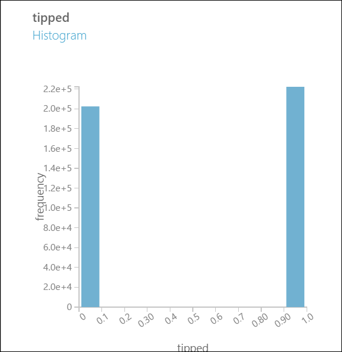

<properties
    pageTitle="Team von Daten Wissenschaft in Aktion: Verwenden Sie Hadoop Cluster | Microsoft Azure"
    description="Verwenden das Team Daten Wissenschaft Prozess für eine End-to-End-Szenario mit einem HDInsight Hadoop Cluster das Erstellen und Bereitstellen eines Modells mithilfe einer öffentlich zugänglichen Datasets."
    services="machine-learning,hdinsight"
    documentationCenter=""
    authors="bradsev"
    manager="jhubbard"
    editor="cgronlun" />

<tags
    ms.service="machine-learning"
    ms.workload="data-services"
    ms.tgt_pltfrm="na"
    ms.devlang="na"
    ms.topic="article"
    ms.date="09/19/2016"
    ms.author="hangzh;bradsev" />

# Team von Daten Wissenschaft in Aktion: HDInsight Hadoop Cluster verwenden

In dieser Anleitung verwenden wir das [Team Daten Wissenschaft Prozess (TDSP)](data-science-process-overview.md) in einem End-to-End-Szenario einer [Azure HDInsight Hadoop Cluster](https://azure.microsoft.com/services/hdinsight/) verwenden, speichern, durchsuchen und Engineering-Daten aus dem öffentlich zugänglichen [NYC Taxi Schleifen](http://www.andresmh.com/nyctaxitrips/) Dataset bereitstellen, und klicken Sie zum Beispiel die Daten nach unten. Modelle Daten werden mit Azure maschinellen Learning verarbeitet binäre und multiclass Klassifizierung und Regression Vorhersage Aufgaben erstellt.

Eine exemplarische Vorgehensweise, die wie eine größere (1 TB) Dataset für ein ähnliches Szenario mithilfe von HDInsight Hadoop Cluster für Datenverarbeitung verarbeitet werden, finden Sie unter [Team Daten Wissenschaft Prozess - Azure HDInsight Hadoop Cluster verwenden, klicken Sie auf ein Dataset 1 TB](machine-learning-data-science-process-hive-criteo-walkthrough.md).

Es ist es möglich, ein Notizbuch IPython verwenden, um die Aufgaben der Anleitung für die Verwendung von 1 TB Dataset dargestellt. Benutzer, die zu diesem Ansatz versuchen sollten finden Sie im Thema [Criteo Exemplarische Vorgehensweise über eine Struktur ODBC-Verbindung](https://github.com/Azure/Azure-MachineLearning-DataScience/blob/master/Misc/DataScienceProcess/iPythonNotebooks/machine-Learning-data-science-process-hive-walkthrough-criteo.ipynb) in.

## NYC Taxi Schleifen Dataset Beschreibung

Die Daten NYC Taxi Geschäftsreise ist ungefähr 20GB komprimierte durch Trennzeichen getrennte Werte (CSV) Dateien (~ 48GB nicht komprimiert), für jede Reise bezahlt, umfasst mehr als 173 Millionen einzelnen Schleifen und die Flugpreise. Jeder Geschäftsreise Datensatz enthält eine Abholung und Ladengeschäft Ort und Zeit, anonymes Hacker (Treiber) Anzahl Lizenzen und Medallion (einmalige Nr. des Taxi) Zahl. Die Daten umfasst alle Schleifen im Jahr 2013 und werden in den folgenden zwei Datasets für jeden Monat bereitgestellt:

1. 'Trip_data' CSV-Dateien enthalten Geschäftsreise Details an wie die Anzahl der Personen, Abholung und Dropoff Punkte, Geschäftsreise Dauer und Geschäftsreise Länge. Hier sind ein paar Stichprobe Einträge aus:

        medallion,hack_license,vendor_id,rate_code,store_and_fwd_flag,pickup_datetime,dropoff_datetime,passenger_count,trip_time_in_secs,trip_distance,pickup_longitude,pickup_latitude,dropoff_longitude,dropoff_latitude
        89D227B655E5C82AECF13C3F540D4CF4,BA96DE419E711691B9445D6A6307C170,CMT,1,N,2013-01-01 15:11:48,2013-01-01 15:18:10,4,382,1.00,-73.978165,40.757977,-73.989838,40.751171
        0BD7C8F5BA12B88E0B67BED28BEA73D8,9FD8F69F0804BDB5549F40E9DA1BE472,CMT,1,N,2013-01-06 00:18:35,2013-01-06 00:22:54,1,259,1.50,-74.006683,40.731781,-73.994499,40.75066
        0BD7C8F5BA12B88E0B67BED28BEA73D8,9FD8F69F0804BDB5549F40E9DA1BE472,CMT,1,N,2013-01-05 18:49:41,2013-01-05 18:54:23,1,282,1.10,-74.004707,40.73777,-74.009834,40.726002
        DFD2202EE08F7A8DC9A57B02ACB81FE2,51EE87E3205C985EF8431D850C786310,CMT,1,N,2013-01-07 23:54:15,2013-01-07 23:58:20,2,244,.70,-73.974602,40.759945,-73.984734,40.759388
        DFD2202EE08F7A8DC9A57B02ACB81FE2,51EE87E3205C985EF8431D850C786310,CMT,1,N,2013-01-07 23:25:03,2013-01-07 23:34:24,1,560,2.10,-73.97625,40.748528,-74.002586,40.747868

2. 'Trip_fare' CSV-Dateien enthalten die Details der für jede Reise, z. B. Zahlungstyp, Fahrpreis Betrag, Aufschlag und steuern, Tipps und Maut-, gezahlten Flugpreis und den Gesamtbetrag. Hier sind ein paar Stichprobe Einträge aus:

        medallion, hack_license, vendor_id, pickup_datetime, payment_type, fare_amount, surcharge, mta_tax, tip_amount, tolls_amount, total_amount
        89D227B655E5C82AECF13C3F540D4CF4,BA96DE419E711691B9445D6A6307C170,CMT,2013-01-01 15:11:48,CSH,6.5,0,0.5,0,0,7
        0BD7C8F5BA12B88E0B67BED28BEA73D8,9FD8F69F0804BDB5549F40E9DA1BE472,CMT,2013-01-06 00:18:35,CSH,6,0.5,0.5,0,0,7
        0BD7C8F5BA12B88E0B67BED28BEA73D8,9FD8F69F0804BDB5549F40E9DA1BE472,CMT,2013-01-05 18:49:41,CSH,5.5,1,0.5,0,0,7
        DFD2202EE08F7A8DC9A57B02ACB81FE2,51EE87E3205C985EF8431D850C786310,CMT,2013-01-07 23:54:15,CSH,5,0.5,0.5,0,0,6
        DFD2202EE08F7A8DC9A57B02ACB81FE2,51EE87E3205C985EF8431D850C786310,CMT,2013-01-07 23:25:03,CSH,9.5,0.5,0.5,0,0,10.5

Der eindeutige Schlüssel für die Reise Teilnahme an\_Daten und Geschäftsreise\_Fahrpreis besteht aus den Feldern: Medallion, Hack\_Lizenz und Abholverzeichnisse\_"DateTime".

Um alle Details zu einer bestimmten Reise relevanten erhalten möchten, ist es ausreichend, die mit drei Tasten teilnehmen: "Medallion", "hack\_Lizenz" und "Abholung\_Datetime".

Wenn wir sie kurz in Struktur Tabellen speichern beschrieben einige weitere Details zu den Daten.

## Beispiele für Vorhersage Aufgaben
Wenn Annäherung an Daten, ermitteln die Art der Vorhersagen, die Sie vornehmen möchten basierend auf ihrer Analyse können Sie die Aufgaben verdeutlichen möchten, die Sie in Ihren Prozess einbezogen werden sollen.
Hier werden drei Beispiele für Vorhersage Probleme, die wir in dieser Anleitung erfahren Adresse, deren Formulierung basiert auf, der *Tipp\_Betrag*:

1. **Binäre Klassifizierung**: Vorhersagen, und zwar unabhängig davon, ob ein Tipp einer Reise, d. h. bezahlt wurde ein *Tipp\_Betrag* , die größer ist als $0 eine positive Beispiel ist, während er sich eine *Tipp\_Betrag* $0 ist ein Beispiel für negativen.

        Class 0 : tip_amount = $0
        Class 1 : tip_amount > $0

2. **Multiclass Klassifizierung**: um den Bereich für die Reise gezahlten Tipp-Beträge Vorhersagen. Dividieren von wir die *Tipp\_Betrag* in fünf Papierkörben oder Klassen:

        Class 0 : tip_amount = $0
        Class 1 : tip_amount > $0 and tip_amount <= $5
        Class 2 : tip_amount > $5 and tip_amount <= $10
        Class 3 : tip_amount > $10 and tip_amount <= $20
        Class 4 : tip_amount > $20

3. **Regression Aufgabe**: die Menge der QuickInfo für eine Geschäftsreise gezahlte Vorhersagen.  

## Richten Sie eine HDInsight Hadoop Cluster für erweiterte analytics

>[AZURE.NOTE] Dies ist in der Regel ein **Administrator** -Vorgang.

Sie können eine Azure-Umgebung für erweiterte Analytics einrichten, die einen HDInsight Cluster in drei Schritten verwendet:

1. [Erstellen eines Kontos Speicher](../storage/storage-create-storage-account.md): dieses Speicherkonto zum Speichern von Daten in Azure BLOB-Speicher verwendet wird. Die Daten in HDInsight Cluster verwendete befindet sich auch hier.

2. [Anpassen von Azure HDInsight Hadoop Cluster für die erweiterte Analytics Prozess und Technologie](machine-learning-data-science-customize-hadoop-cluster.md). Dieser Schritt erstellt eine Azure HDInsight Hadoop Cluster mit 64-Bit-Anaconda Python 2.7 auf allen Knoten installiert. Es gibt zwei wichtige Maßnahmen, denken Sie daran, beim Anpassen von Ihren Cluster HDInsight.

    * Denken Sie daran, die in Schritt 1 mit Ihren Cluster HDInsight erstellte, bei der Erstellung Speicher-Firma zu verknüpfen. Dieses Speicherkonto wird verwendet, um die Daten zugreifen, die im Cluster verarbeitet wird.

    * Nachdem der Cluster erstellt wird, aktivieren Sie Remote Access auf den am Knoten des Cluster ein. Navigieren Sie zur Registerkarte **Konfiguration** , und klicken Sie auf **Remote aktivieren**. Dieser Schritt gibt die Anmeldeinformationen des Benutzers für den remote-Anmeldung verwendet.

3. [Erstellen einer Arbeitsbereich Azure Computer lernen](machine-learning-create-workspace.md): Arbeitsbereich diese Azure Computer lernen wird verwendet, um Computer Learning Modelle zu erstellen. Diese Aufgabe wird nach dem Ausfüllen einer Untersuchung Ausgangsdaten und unten mit HDInsight Cluster werden berücksichtigt.

## Abrufen von Daten aus einer öffentlichen Datenquelle

>[AZURE.NOTE] Dies ist in der Regel ein **Administrator** -Vorgang.

Um das Dataset [NYC Taxi Schleifen](http://www.andresmh.com/nyctaxitrips/) von ihrem öffentlichen Speicherort zu gelangen, können Sie eines der in [Verschieben von Daten zwischen Azure BLOB-Speicher](machine-learning-data-science-move-azure-blob.md) beschriebenen Verfahren zum Kopieren der Daten auf Ihrem Computer verwenden.

Hier erläutert, wie AzCopy verwenden, zum Übertragen der Dateien, die Daten enthalten. Zum Herunterladen und installieren AzCopy Anweisungen unter [Erste Schritte mit der AzCopy Befehlszeilenprogramm](../storage/storage-use-azcopy.md).

1. Geben Sie in ein Eingabeaufforderungsfenster, *< Path_to_data_folder >* durch das gewünschte Ziel ersetzt werden die folgenden AzCopy-Befehle aus:

        "C:\Program Files (x86)\Microsoft SDKs\Azure\AzCopy\azcopy" /Source:https://nyctaxitrips.blob.core.windows.net/data /Dest:<path_to_data_folder> /S

2. Wenn die Kopie abgeschlossen ist, werden insgesamt 24 komprimierte Dateien im Ordner Data ausgewählt. Entzippen Sie die heruntergeladenen Dateien in das gleiche Verzeichnis auf Ihrem lokalen Computer an. Notieren Sie den Ordner, in denen die nicht komprimierten Dateien befinden. Diesen Ordner werden nachstehend die *< Pfad\_auf\_Unzipped_data\_Dateien\> * ist wie folgt.

## Hochladen der Daten in den standardmäßigen Container Azure HDInsight Hadoop cluster

>[AZURE.NOTE] Dies ist in der Regel ein **Administrator** -Vorgang.

Ersetzen Sie die folgenden Parameter in den folgenden Befehlen AzCopy, mit der tatsächlichen Werte, die Sie beim Erstellen des Hadoop Clusters angegeben, und Entzippen Sie die Datendateien.

* ***& #60; Path_to_data_folder >*** Verzeichnis (zusammen mit Pfad) auf Ihrem Computer, die die Datendateien entpackt enthalten.  
* ***& #60; Speicher Kontonamen Hadoop Cluster >*** HDInsight Cluster zugeordnete Speicherplatz Konto
* ***& #60; standardmäßige Container Hadoop Cluster >*** der standardmäßige Container von Ihren Cluster verwendet. Beachten Sie, dass der Name des Standardcontainers normalerweise denselben Namen wie dem Cluster selbst ist. Wenn der Cluster "abc123.azurehdinsight.net" aufgerufen wird, ist der standardmäßige Container beispielsweise abc123.
* ***& #60; Speicher kontoschlüssel >*** die Taste für das von Ihren Cluster verwendete Speicherkonto

Führen Sie die folgenden beiden AzCopy Befehle aus einer Befehlszeile oder in einem Windows PowerShell-Fenster auf Ihrem Computer.

Dieser Befehl lädt die Daten Geschäftsreise in ***Nyctaxitripraw*** Verzeichnis im Standardcontainer der Cluster Hadoop hoch.

        "C:\Program Files (x86)\Microsoft SDKs\Azure\AzCopy\azcopy" /Source:<path_to_unzipped_data_files> /Dest:https://<storage account name of Hadoop cluster>.blob.core.windows.net/<default container of Hadoop cluster>/nyctaxitripraw /DestKey:<storage account key> /S /Pattern:trip_data_*.csv

Dieser Befehl lädt die Fahrpreis Daten in ***Nyctaxifareraw*** Verzeichnis im Standardcontainer der Cluster Hadoop hoch.

        "C:\Program Files (x86)\Microsoft SDKs\Azure\AzCopy\azcopy" /Source:<path_to_unzipped_data_files> /Dest:https://<storage account name of Hadoop cluster>.blob.core.windows.net/<default container of Hadoop cluster>/nyctaxifareraw /DestKey:<storage account key> /S /Pattern:trip_fare_*.csv

Die Daten sollten jetzt in Azure BLOB-Speicher und im Cluster HDInsight verbraucht werden.

## Melden Sie sich bei der am Knoten Hadoop Cluster und und Vorbereiten für explorativen Datenanalyse

>[AZURE.NOTE] Dies ist in der Regel ein **Administrator** -Vorgang.

Um die am Knoten im Cluster explorativen Datenanalysen und unten werden Daten zuzugreifen, folgen Sie dem Verfahren in [Access die Hadoop Cluster Kopf Knoten](machine-learning-data-science-customize-hadoop-cluster.md#headnode)aus.

In dieser Anleitung erfahren verwenden wir hauptsächlich Abfragen, die in die [Struktur](https://hive.apache.org/), einer Abfragesprache für SQL-ähnliche geschrieben auszuführenden über der vorläufigen Daten kennen. Die Struktur Abfragen werden in .hql Dateien gespeichert. Wir Beispieldaten klicken Sie dann unten dieser innerhalb von Azure Computer lernen zum Erstellen von Modellen verwendet werden.

Um explorativen Datenanalyse Cluster vorzubereiten, herunterladen wir die .hql Dateien, die die relevanten Struktur Skripts aus [Github](https://github.com/Azure/Azure-MachineLearning-DataScience/tree/master/Misc/DataScienceProcess/DataScienceScripts) in einem lokalen Verzeichnis (C:\temp) auf dem am Knoten enthalten. Hierfür, öffnen Sie die **Befehlszeile** aus innerhalb der am Knoten im Cluster und folgende zwei Befehle:

    set script='https://raw.githubusercontent.com/Azure/Azure-MachineLearning-DataScience/master/Misc/DataScienceProcess/DataScienceScripts/Download_DataScience_Scripts.ps1'

    @powershell -NoProfile -ExecutionPolicy unrestricted -Command "iex ((new-object net.webclient).DownloadString(%script%))"

Diese beiden Befehle werden alle .hql Dateien erforderlich, die in dieser Anleitung erfahren im lokalen Verzeichnis ***C:\temp & #92;*** im Knoten am herunterladen.

## Erstellen von Struktur-Datenbank und Tabellen aufgeteilt nach Monat

>[AZURE.NOTE] Dies ist in der Regel ein **Administrator** -Vorgang.

Wir können nun Struktur Tabellen für unsere NYC Taxi Dataset zu erstellen.
Klicken Sie im am Knoten des Cluster Hadoop öffnen Sie die ***Befehlszeile Hadoop*** auf dem Desktop des Knotens am, und geben Sie Struktur Verzeichnis durch Eingabe des Befehls

    cd %hive_home%\bin

>[AZURE.NOTE] **Führen Sie alle Struktur Befehle in dieser Anleitung erfahren Sie, aus dem oben genannten Struktur der / Directory auffordern. Dadurch wird der Pfad Probleme automatisch Achten Sie darauf. Wir verwenden Sie die Begriffe "Struktur Verzeichnis auffordern", "Struktur Papierkorb / Directory auffordern", und "Befehlszeile Hadoop" Synonym in dieser Anleitung erfahren.**

Geben Sie von Struktur Verzeichnis dazu aufgefordert werden den folgenden Befehl in Hadoop Befehlszeile des am Knotens und übermitteln Sie die Struktur Abfrage um Struktur Datenbanken und Tabellen zu erstellen:

    hive -f "C:\temp\sample_hive_create_db_and_tables.hql"

Hier wird der Inhalt der ***C:\temp\sample\_Struktur\_erstellen\_Db\_und\_tables.hql*** Datei, die ***Struktur Datenbank ***Nyctaxidb*** und Tabellen ***Geschäftsreise*** - und***erstellt.

    create database if not exists nyctaxidb;

    create external table if not exists nyctaxidb.trip
    (
        medallion string,
        hack_license string,
        vendor_id string,
        rate_code string,
        store_and_fwd_flag string,
        pickup_datetime string,
        dropoff_datetime string,
        passenger_count int,
        trip_time_in_secs double,
        trip_distance double,
        pickup_longitude double,
        pickup_latitude double,
        dropoff_longitude double,
        dropoff_latitude double)  
    PARTITIONED BY (month int)
    ROW FORMAT DELIMITED FIELDS TERMINATED BY ',' lines terminated by '\n'
    STORED AS TEXTFILE LOCATION 'wasb:///nyctaxidbdata/trip' TBLPROPERTIES('skip.header.line.count'='1');

    create external table if not exists nyctaxidb.fare
    (
        medallion string,
        hack_license string,
        vendor_id string,
        pickup_datetime string,
        payment_type string,
        fare_amount double,
        surcharge double,
        mta_tax double,
        tip_amount double,
        tolls_amount double,
        total_amount double)
    PARTITIONED BY (month int)
    ROW FORMAT DELIMITED FIELDS TERMINATED BY ',' lines terminated by '\n'
    STORED AS TEXTFILE LOCATION 'wasb:///nyctaxidbdata/fare' TBLPROPERTIES('skip.header.line.count'='1');

Dieses Skript Struktur erstellt zwei Tabellen:

* die Tabelle "Reise" enthält Geschäftsreise Details zu einzelnen Akkugestützte (Treiberdetails, Abholdatum, Geschäftsreise Abstand und wie oft)
* die Tabelle "Fahrpreis" enthält Fahrpreis Details (Fahrpreis, Tipp Betrag, Maut- und Zuschlagsgebühren).

Wenn Sie keine zusätzliche Unterstützung für diese Verfahren benötigen oder alternative diejenigen ermitteln möchten, finden Sie im Abschnitt [übermitteln Struktur Abfragen direkt aus der Hadoop-Befehlszeile ](machine-learning-data-science-move-hive-tables.md#submit).

## Laden der Daten in die Struktur Tabellen nach Partitionen

>[AZURE.NOTE] Dies ist in der Regel ein **Administrator** -Vorgang.

NYC Taxi Dataset verfügt über eine natürliche Partitionierung nach Monat, die wir verwenden, um eine schnellere Verarbeitung und Abfrage-Zeiten aktivieren. PowerShell unten aufgeführten Befehle (aus dem Struktur Verzeichnis über die **Befehlszeile Hadoop**ausgegeben) Laden von Daten mit den "Reise" und "Fahrpreis" Struktur Tabellen aufgeteilt nach Monat.

    for /L %i IN (1,1,12) DO (hive -hiveconf MONTH=%i -f "C:\temp\sample_hive_load_data_by_partitions.hql")

Die *Beispiel\_Struktur\_laden\_Daten\_von\_partitions.hql* Datei enthält die folgenden Befehle **zu laden** .

    LOAD DATA INPATH 'wasb:///nyctaxitripraw/trip_data_${hiveconf:MONTH}.csv' INTO TABLE nyctaxidb.trip PARTITION (month=${hiveconf:MONTH});
    LOAD DATA INPATH 'wasb:///nyctaxifareraw/trip_fare_${hiveconf:MONTH}.csv' INTO TABLE nyctaxidb.fare PARTITION (month=${hiveconf:MONTH});

Beachten Sie, dass eine Anzahl Struktur Abfragen, die wir hier im Prozess datenauswertung verwenden (Variablen) haben am nur eine einzelne Partition oder nur ein paar Partitionen gefunden. Aber diese Abfragen über die gesamten Daten ausgeführt werden können.

### Anzeigen von Datenbanken im HDInsight Hadoop cluster

Führen Sie folgenden Befehl zum Anzeigen der Datenbanken in HDInsight Hadoop Cluster innerhalb des Fensters Hadoop Befehlszeile erstellt in Hadoop Befehlszeile:

    hive -e "show databases;"

### Anzeigen der Struktur Tabellen in der Datenbank nyctaxidb

Um die Tabellen in der Datenbank Nyctaxidb anzeigen möchten, führen Sie folgenden Befehl in Hadoop Befehlszeile:

    hive -e "show tables in nyctaxidb;"

Wir können bestätigen, dass die Tabellen formatiert sind, indem Sie den folgenden Befehl:

    hive -e "show partitions nyctaxidb.trip;"

Die Ausgabe die erwartete sieht folgendermaßen aus:

    month=1
    month=10
    month=11
    month=12
    month=2
    month=3
    month=4
    month=5
    month=6
    month=7
    month=8
    month=9
    Time taken: 2.075 seconds, Fetched: 12 row(s)

Wir können auf ähnliche Weise sicherstellen, dass die Tabelle Fahrpreis verteilt werden, indem Sie den folgenden Befehl:

    hive -e "show partitions nyctaxidb.fare;"

Die Ausgabe die erwartete sieht folgendermaßen aus:

    month=1
    month=10
    month=11
    month=12
    month=2
    month=3
    month=4
    month=5
    month=6
    month=7
    month=8
    month=9
    Time taken: 1.887 seconds, Fetched: 12 row(s)

## Durchsuchen von Daten und Features technisch in Struktur

>[AZURE.NOTE] Dies ist in der Regel eine Aufgabe **Scientist Daten** .

Das Durchsuchen von Daten und Aufgaben für die Daten in die Struktur Tabellen geladen Technik Feature können über Struktur Abfragen ausgeführt werden. Hier sind Beispiele für solchen Vorgängen, dass wir Sie in diesem Abschnitt durchgehen:

- Anzeigen der Top 10-Einträge in beiden Tabellen.
- Untersuchen von Daten Verteilung einige Felder in unterschiedlichen Zeitfenster.
- Ermitteln Sie Daten für Quality of Felder Länge und Breite ein.
- Generieren binäre und multiclass Klassifizierung Etiketten auf der Grundlage der **Tipp\_Betrag**.
- Die direkte Geschäftsreise Abstände computing generieren Sie Features.

### Datenauswertung: Anzeigen der Top 10 Datensätze in der Tabelle Geschäftsreise

>[AZURE.NOTE] Dies ist in der Regel eine Aufgabe **Scientist Daten** .

Um anzuzeigen, wie die Daten aussieht, untersuchen wir 10 Datensätze aus jeder Tabelle aus. Führen Sie die folgenden beiden Abfragen separat über die Struktur Verzeichnis Aufforderung in der Befehlszeile Hadoop-Verwaltungskonsole auf die Datensätze zu prüfen.

Zu den Top 10 Datensätze in der Tabelle "Reise" aus der ersten Monat zu erhalten:

    hive -e "select * from nyctaxidb.trip where month=1 limit 10;"

So erhalten Sie die obersten 10 Datensätze in der Tabelle "Fahrpreis" aus der ersten Monat:

    hive -e "select * from nyctaxidb.fare where month=1 limit 10;"

Es ist häufig sinnvoll, die Datensätze in einer Datei für die Anzeige geeignete zu speichern. Eine kleine Änderung an die oben genannte Abfrage bewerkstelligt dies:

    hive -e "select * from nyctaxidb.fare where month=1 limit 10;" > C:\temp\testoutput

### Datenauswertung: Anzeigen der Anzahl von Datensätzen in den einzelnen 12 Partitionen

>[AZURE.NOTE] Dies ist in der Regel eine Aufgabe **Scientist Daten** .

Relevante wird beschrieben, wie die Anzahl der Schleifen variierende im Kalenderjahr. Gruppieren nach Monat kann wir sehen, wie diese Verteilung der Schleifen aussieht.

    hive -e "select month, count(*) from nyctaxidb.trip group by month;"

(Datumuhrzeitschlüssel) das Ergebnis:

    1       14776615
    2       13990176
    3       15749228
    4       15100468
    5       15285049
    6       14385456
    7       13823840
    8       12597109
    9       14107693
    10      15004556
    11      14388451
    12      13971118
    Time taken: 283.406 seconds, Fetched: 12 row(s)

Hier die erste Spalte ist den Monat und das zweite ist die Anzahl der Schleifen für diesen Monat.

Wir können auch die Gesamtzahl der Datensätze in unseren Geschäftsreise Datenmenge zählen, indem Sie den folgenden Befehl Struktur Verzeichnis aufgefordert werden.

    hive -e "select count(*) from nyctaxidb.trip;"

Dies ergibt:

    173179759
    Time taken: 284.017 seconds, Fetched: 1 row(s)

Ähnlich wie für Geschäftsreise Datenmenge Befehle verwenden, können wir Struktur Abfragen aus der Struktur Verzeichnis verwendendes Fahrpreis Datenmenge die Anzahl der Datensätze überprüft ausgeben.

    hive -e "select month, count(*) from nyctaxidb.fare group by month;"

(Datumuhrzeitschlüssel) das Ergebnis:

    1       14776615
    2       13990176
    3       15749228
    4       15100468
    5       15285049
    6       14385456
    7       13823840
    8       12597109
    9       14107693
    10      15004556
    11      14388451
    12      13971118
    Time taken: 253.955 seconds, Fetched: 12 row(s)

Beachten Sie, dass die genaue dieselbe Anzahl von Schleifen pro Monat für beide Datasets zurückgegeben wird. Dadurch wird die erste Überprüfung, dass die Daten ordnungsgemäß geladen wurde.

Zählt die Gesamtzahl der Datensätze in der Datenmenge Fahrpreis ist möglich, mit dem Befehl unter über die Struktur Verzeichnis Aufforderung:

    hive -e "select count(*) from nyctaxidb.fare;"

Dies ergibt:

    173179759
    Time taken: 186.683 seconds, Fetched: 1 row(s)

Die Gesamtzahl der Datensätze in beiden Tabellen ist auch dasselbe. Dadurch wird eine zweite Überprüfung, dass die Daten ordnungsgemäß geladen wurde.

### Damit arbeiten: Geschäftsreise Verteilung nach medallion

>[AZURE.NOTE] Dies ist in der Regel eine Aufgabe **Scientist Daten** .

In diesem Beispiel wird die Medallion (Taxi Zahlen) mit mehr als 100 Reisen innerhalb eines bestimmten Zeitraums. Die Vorteile der Abfrage aus der partitionierten Tabelle zugreifen, da es durch den Partition Variable **Monat**bedingte ist. Die Ergebnisse der Abfrage werden in einer lokalen Datei queryoutput.tsv in geschrieben `C:\temp` auf dem am Knoten.

    hive -f "C:\temp\sample_hive_trip_count_by_medallion.hql" > C:\temp\queryoutput.tsv

Dies ist der Inhalt des *Beispiel\_Struktur\_Geschäftsreise\_zählen\_von\_medallion.hql* Datei zur Prüfung.

    SELECT medallion, COUNT(*) as med_count
    FROM nyctaxidb.fare
    WHERE month<=3
    GROUP BY medallion
    HAVING med_count > 100
    ORDER BY med_count desc;

Die Medallion in NYC Taxi Datenmenge identifiziert einen eindeutigen Cab. Wir können identifizieren, welche CAB-Dateien sind "beschäftigt", indem Sie gefragt werden, welche in einem bestimmten Zeitraum noch mehr als eine bestimmte Anzahl von Schleifen vorgenommen. Das folgende Beispiel identifiziert CAB-Dateien, die mehr als hundert Reisen in der ersten drei Monate und speichert die Abfrageergebnisse in einer lokalen Datei, C:\temp\queryoutput.tsv vorgenommen.

Dies ist der Inhalt des *Beispiel\_Struktur\_Geschäftsreise\_zählen\_von\_medallion.hql* Datei zur Prüfung.

    SELECT medallion, COUNT(*) as med_count
    FROM nyctaxidb.fare
    WHERE month<=3
    GROUP BY medallion
    HAVING med_count > 100
    ORDER BY med_count desc;

Geben Sie von Struktur Verzeichnis dazu aufgefordert werden den folgenden Befehl aus:

    hive -f "C:\temp\sample_hive_trip_count_by_medallion.hql" > C:\temp\queryoutput.tsv

### Damit arbeiten: Geschäftsreise Verteilung nach Medallion und hack_license

>[AZURE.NOTE] Dies ist in der Regel eine Aufgabe **Scientist Daten** .

Wenn Sie ein Dataset untersuchen, wir häufig die Anzahl der co-Vorkommen von Gruppen von Werten untersuchen möchten. In diesem Abschnitt geben Sie ein Beispiel der Anweisungen hierzu für CAB-Dateien und Treiber.

Die *Beispiel\_Struktur\_Geschäftsreise\_zählen\_von\_Medallion\_license.hql* Datei gruppiert sind Fahrpreis Datenmenge auf "Medallion" und "Hack_license" und gibt die Anzahl der einzelnen Kombinationen. Nachstehend sind deren Inhalt.

    SELECT medallion, hack_license, COUNT(*) as trip_count
    FROM nyctaxidb.fare
    WHERE month=1
    GROUP BY medallion, hack_license
    HAVING trip_count > 100
    ORDER BY trip_count desc;

Diese Abfrage gibt Cab und bestimmte Treiberkombinationen nach absteigender Anzahl der Schleifen sortiert.

Führen von der entsprechenden Aufforderung Struktur Verzeichnis aus:

    hive -f "C:\temp\sample_hive_trip_count_by_medallion_license.hql" > C:\temp\queryoutput.tsv

Die Ergebnisse der Abfrage werden in einer lokalen Datei C:\temp\queryoutput.tsv geschrieben.

### Damit arbeiten: Beurteilung der Qualität der Daten durch Überprüfen auf ungültige Länge/geografische Breite Datensätze

>[AZURE.NOTE] Dies ist in der Regel eine Aufgabe **Scientist Daten** .

Eine allgemeine Zielsetzung explorativen Datenanalyse ist zu extrahieren, ungültige oder ungültige Einträge. Das Beispiel in diesem Abschnitt bestimmt, ob der Länge oder Breite Felder einen Wert außerhalb des NYC weit enthalten. Da es wahrscheinlich ist, dass solche Datensätze eine fehlerhafte Länge-Breite-Werte verfügen, möchten wir ihnen von Daten zu entfernen, die für die Modellierung verwendet werden soll.

Dies ist der Inhalt des *Beispiel\_Struktur\_Qualität\_assessment.hql* Datei zur Prüfung.

        SELECT COUNT(*) FROM nyctaxidb.trip
        WHERE month=1
        AND  (CAST(pickup_longitude AS float) NOT BETWEEN -90 AND -30
        OR    CAST(pickup_latitude AS float) NOT BETWEEN 30 AND 90
        OR    CAST(dropoff_longitude AS float) NOT BETWEEN -90 AND -30
        OR    CAST(dropoff_latitude AS float) NOT BETWEEN 30 AND 90);

Führen von der entsprechenden Aufforderung Struktur Verzeichnis aus:

    hive -S -f "C:\temp\sample_hive_quality_assessment.hql"

Das *S -* Argument im Lieferumfang von dieser Befehl unterdrückt Bildschirm Status Ausdrucks Einzelvorgänge Struktur Karte/verringern. Dies ist sinnvoll, da es den Bildschirm Drucken der Struktur Abfrageergebnis besser lesbar macht.

### Damit arbeiten: Binäre Klasse Verteilung der Geschäftsreise Tipps

> [AZURE.NOTE] Dies ist in der Regel eine Aufgabe **Scientist Daten** .

Binäre Klassifizierung Problems im Abschnitt [Beispiele für Vorhersage Aufgaben](machine-learning-data-science-process-hive-walkthrough.md#mltasks) beschrieben ist es sinnvoll, wissen, ob ein Tipp oder nicht angegeben wurde. Diese Verteilung der Tipps ist binäre:

* Tipp angegebenen (Klasse 1, Tipp\_Betrags > $0)  
* Kein Tipp (Klasse 0, Tipp\_Betrag = $0).

Die *Beispiel\_Struktur\_hinterlassen hat\_frequencies.hql* Datei abgebildet macht's.

    SELECT tipped, COUNT(*) AS tip_freq
    FROM
    (
        SELECT if(tip_amount > 0, 1, 0) as tipped, tip_amount
        FROM nyctaxidb.fare
    )tc
    GROUP BY tipped;

Führen von der entsprechenden Aufforderung Struktur Verzeichnis aus:

    hive -f "C:\temp\sample_hive_tipped_frequencies.hql"

### Datenauswertung: Klasse Verteilung der multiclass Einstellung

> [AZURE.NOTE] Dies ist in der Regel eine Aufgabe **Scientist Daten** .

Im Abschnitt [Beispiele für Aufgaben Vorhersage](machine-learning-data-science-process-hive-walkthrough.md#mltasks) beschriebenen Problems multiclass Klassifizierung ist geeignet diese Datenmenge auch eine natürliche Einstufung, an dem wir die Menge der angegebenen Tipps vorhersagen möchten. Wir können Papierkörben zum Definieren von Bereichen Tipp in der Abfrage verwenden. Die Class-Verteilung für die verschiedenen Bereiche Tipp, wir verwenden, um die *Beispiel\_Struktur\_Tipp\_Bereich\_frequencies.hql* Datei. Nachstehend sind deren Inhalt.

    SELECT tip_class, COUNT(*) AS tip_freq
    FROM
    (
        SELECT if(tip_amount=0, 0,
            if(tip_amount>0 and tip_amount<=5, 1,
            if(tip_amount>5 and tip_amount<=10, 2,
            if(tip_amount>10 and tip_amount<=20, 3, 4)))) as tip_class, tip_amount
        FROM nyctaxidb.fare
    )tc
    GROUP BY tip_class;

Führen Sie den folgenden Befehl aus Befehlszeile Hadoop Console aus:

    hive -f "C:\temp\sample_hive_tip_range_frequencies.hql"

### Damit arbeiten: Berechnen Sie direkte Abstand zwischen zwei Orten der Länge-Breite

> [AZURE.NOTE] Dies ist in der Regel eine Aufgabe **Scientist Daten** .

Ein Maß für den direkten Abstand haben, können wir die Unstimmigkeit zwischen erkannt und den tatsächlichen Geschäftsreise Abstand finden. Wir motivieren dieses Feature darauf hin, dass eine sind möglicherweise wahrscheinlich kleiner Tipp Wenn sie, dass der Treiber sie absichtlich durch eine viel mehr Routing ergriffen haben ermitteln.

Um den Vergleich zwischen ist-Geschäftsreise Abstand und die [Haversine Abstand](http://en.wikipedia.org/wiki/Haversine_formula) zwischen zwei Punkten der Länge-Breite (der "großartig Kreis" Abstand) angezeigt wird, verwenden wir der trigonometrische Funktionen zur Verfügung innerhalb der Struktur, daher:

    set R=3959;
    set pi=radians(180);

    insert overwrite directory 'wasb:///queryoutputdir'

    select pickup_longitude, pickup_latitude, dropoff_longitude, dropoff_latitude, trip_distance, trip_time_in_secs,
    ${hiveconf:R}*2*2*atan((1-sqrt(1-pow(sin((dropoff_latitude-pickup_latitude)
     *${hiveconf:pi}/180/2),2)-cos(pickup_latitude*${hiveconf:pi}/180)
     *cos(dropoff_latitude*${hiveconf:pi}/180)*pow(sin((dropoff_longitude-pickup_longitude)*${hiveconf:pi}/180/2),2)))
     /sqrt(pow(sin((dropoff_latitude-pickup_latitude)*${hiveconf:pi}/180/2),2)
     +cos(pickup_latitude*${hiveconf:pi}/180)*cos(dropoff_latitude*${hiveconf:pi}/180)*
     pow(sin((dropoff_longitude-pickup_longitude)*${hiveconf:pi}/180/2),2))) as direct_distance
    from nyctaxidb.trip
    where month=1
    and pickup_longitude between -90 and -30
    and pickup_latitude between 30 and 90
    and dropoff_longitude between -90 and -30
    and dropoff_latitude between 30 and 90;

In der obigen Abfrage R ist der weltweit in Meilen und Pi wird in Bogenmaß (Radiant) konvertiert. Beachten Sie, dass die Länge-Breite Punkte "" gefiltert werden, um Werte zu entfernen, die weit im Bereich NYC entfernt werden.

In diesem Fall schreiben wir unsere Ergebnisse zu einem Verzeichnis namens "Queryoutputdir" ein. Die Reihenfolge der nachfolgend aufgeführten Befehle zuerst erstellt dieses Ausgabeverzeichnis und dann führt den Befehl aus Struktur.

Führen von der entsprechenden Aufforderung Struktur Verzeichnis aus:

    hdfs dfs -mkdir wasb:///queryoutputdir

    hive -f "C:\temp\sample_hive_trip_direct_distance.hql"

Die Ergebnisse der Abfrage werden in 9 Azure Blobs geschrieben ***Queryoutputdir/000000\_0*** zu ***Queryoutputdir/000008\_0*** unter dem standardmäßigen Container der Hadoop Cluster.

Wenn Sie die Größe der einzelnen Blobs anzeigen möchten, führen wir den folgenden Befehl aus der Struktur Verzeichnis Aufforderung:

    hdfs dfs -ls wasb:///queryoutputdir

Sagen Sie zum Anzeigen des Inhalts einer bestimmten Datei 000000\_0, wir verwenden des Hadoop `copyToLocal` Befehl, sodass.

    hdfs dfs -copyToLocal wasb:///queryoutputdir/000000_0 C:\temp\tempfile

> [AZURE.WARNING] `copyToLocal`kann für große Dateien sehr langsam sein, und ist nicht für die Verwendung mit ihnen empfohlen.  

Ein wesentlicher Vorteil der müssen diese Daten in einer Azure Blob gespeichert ist, dass wir die Daten innerhalb von Azure Computer lernen mithilfe der [Importierten Daten] untersuchen möglicherweise[ import-data] Modul.

## Nach unten Stichprobe Daten und erstellen Modelle in Azure Computer lernen

> [AZURE.NOTE] Dies ist in der Regel eine Aufgabe **Scientist Daten** .

Nach der Phase Versuchsvorhaben für die Analyse können wir nun zum Beispiel die Daten zum Erstellen von Modellen Azure Computer interessante nach unten. In diesem Abschnitt wir zeigen, wie eine Struktur Abfrage zum Beispiel unten verwenden die Daten, die dann aus den [Daten importieren] zugegriffen wird[ import-data] Modul Azure Computer interessante.

### Nach unten Stichproben der Daten

Es gibt zwei Schritte in diesem Verfahren aus. Zuerst teilnehmen Tabellen **nyctaxidb.trip** und **nyctaxidb.fare** auf drei Tasten, die in allen Datensätzen vorhanden sind: "Medallion", "hack\_Lizenz", und "Abholung\_Datetime". Wir dann generieren, die eine binäre Klassifizierung Bezeichnung **hinterlassen hat** und eine Beschriftung mit mehreren Klasse Klassifizierung **Tipp\_Klasse**.

Verwenden Sie die unten können Stichprobe Daten direkt aus den [Daten importieren] [ import-data] Modul Azure Computer interessante, ist es erforderlich, die Ergebnisse auf eine interne strukturtabelle die oben genannte Abfrage zu speichern. In wie folgt wir eine interne strukturtabelle erstellen und deren Inhalt mit der verknüpfte und unten gesammelten Daten zu füllen.

Die Abfrage gilt Struktur Standardfunktionen zum Generieren, die der Stunde des Tages, Woche des Jahres, Weekday (1 steht für Montag und 7 steht für Sonntag) direkt von der "Abholung\_Datetime" Feld und den direkten Abstand zwischen den Speicherorten Abholung und Dropoff. Benutzer können auf [LanguageManual UDFs](https://cwiki.apache.org/confluence/display/Hive/LanguageManual+UDF) für eine vollständige Liste der solche Funktionen verweisen.

Die Abfrage Beispiele klicken Sie dann unten die Daten, damit die Abfrageergebnisse in der Azure maschinellen Learning Studio passt. Nur etwa 1 % des ursprünglichen Dataset wird in der Studio importiert.

Im folgenden sind die Inhalte der *Beispiel\_Struktur\_vorbereiten\_für\_Aml\_full.hql* Datei, die Daten für Modell erstellen Azure Computer interessante vorbereitet.

        set R = 3959;
        set pi=radians(180);

        create table if not exists nyctaxidb.nyctaxi_downsampled_dataset (

        medallion string,
        hack_license string,
        vendor_id string,
        rate_code string,
        store_and_fwd_flag string,
        pickup_datetime string,
        dropoff_datetime string,
        pickup_hour string,
        pickup_week string,
        weekday string,
        passenger_count int,
        trip_time_in_secs double,
        trip_distance double,
        pickup_longitude double,
        pickup_latitude double,
        dropoff_longitude double,
        dropoff_latitude double,
        direct_distance double,
        payment_type string,
        fare_amount double,
        surcharge double,
        mta_tax double,
        tip_amount double,
        tolls_amount double,
        total_amount double,
        tipped string,
        tip_class string
        )
        row format delimited fields terminated by ','
        lines terminated by '\n'
        stored as textfile;

        --- now insert contents of the join into the above internal table

        insert overwrite table nyctaxidb.nyctaxi_downsampled_dataset
        select
        t.medallion,
        t.hack_license,
        t.vendor_id,
        t.rate_code,
        t.store_and_fwd_flag,
        t.pickup_datetime,
        t.dropoff_datetime,
        hour(t.pickup_datetime) as pickup_hour,
        weekofyear(t.pickup_datetime) as pickup_week,
        from_unixtime(unix_timestamp(t.pickup_datetime, 'yyyy-MM-dd HH:mm:ss'),'u') as weekday,
        t.passenger_count,
        t.trip_time_in_secs,
        t.trip_distance,
        t.pickup_longitude,
        t.pickup_latitude,
        t.dropoff_longitude,
        t.dropoff_latitude,
        t.direct_distance,
        f.payment_type,
        f.fare_amount,
        f.surcharge,
        f.mta_tax,
        f.tip_amount,
        f.tolls_amount,
        f.total_amount,
        if(tip_amount>0,1,0) as tipped,
        if(tip_amount=0,0,
        if(tip_amount>0 and tip_amount<=5,1,
        if(tip_amount>5 and tip_amount<=10,2,
        if(tip_amount>10 and tip_amount<=20,3,4)))) as tip_class

        from
        (
        select
        medallion,
        hack_license,
        vendor_id,
        rate_code,
        store_and_fwd_flag,
        pickup_datetime,
        dropoff_datetime,
        passenger_count,
        trip_time_in_secs,
        trip_distance,
        pickup_longitude,
        pickup_latitude,
        dropoff_longitude,
        dropoff_latitude,
        ${hiveconf:R}*2*2*atan((1-sqrt(1-pow(sin((dropoff_latitude-pickup_latitude)
        *${hiveconf:pi}/180/2),2)-cos(pickup_latitude*${hiveconf:pi}/180)
        *cos(dropoff_latitude*${hiveconf:pi}/180)*pow(sin((dropoff_longitude-pickup_longitude)*${hiveconf:pi}/180/2),2)))
        /sqrt(pow(sin((dropoff_latitude-pickup_latitude)*${hiveconf:pi}/180/2),2)
        +cos(pickup_latitude*${hiveconf:pi}/180)*cos(dropoff_latitude*${hiveconf:pi}/180)*pow(sin((dropoff_longitude-pickup_longitude)*${hiveconf:pi}/180/2),2))) as direct_distance,
        rand() as sample_key

        from nyctaxidb.trip
        where pickup_latitude between 30 and 90
            and pickup_longitude between -90 and -30
            and dropoff_latitude between 30 and 90
            and dropoff_longitude between -90 and -30
        )t
        join
        (
        select
        medallion,
        hack_license,
        vendor_id,
        pickup_datetime,
        payment_type,
        fare_amount,
        surcharge,
        mta_tax,
        tip_amount,
        tolls_amount,
        total_amount
        from nyctaxidb.fare
        )f
        on t.medallion=f.medallion and t.hack_license=f.hack_license and t.pickup_datetime=f.pickup_datetime
        where t.sample_key<=0.01

So führen Sie diese Abfrage, über die Struktur Verzeichnis Aufforderung aus:

    hive -f "C:\temp\sample_hive_prepare_for_aml_full.hql"

Wir haben nun eine interne Tabelle "nyctaxidb.nyctaxi_downsampled_dataset" die mit den [Daten importieren] zugegriffen werden kann[ import-data] Modul von Azure maschinellen Learning. Darüber hinaus kann dieses Dataset zum Erstellen von maschinellen Learning-Modellen verwenden.  

### Mithilfe des Moduls Importieren von Daten in Azure Computer lernen die nach unten erfassten Daten zugreifen.

Als Voraussetzung für die Struktur Abfragen in den [Daten importieren] [ import-data] Modul von Azure maschinellen Schulung, benötigt ein Arbeitsbereich Learning Azure-Computern und Zugriff auf die Anmeldeinformationen des Cluster und deren zugehörige Speicher-Konto.

Einige Details auf die [Daten importieren] [ import-data] Modul und die Parameter eingeben:

**HCatalog Server-URI**: Wenn der Clustername abc123, wird dies einfach ist: https://abc123.azurehdinsight.net

**Hadoop Konto Benutzername** : der Benutzername für den Cluster (**nicht** den Benutzernamen RAS) ausgewählt wurde

**Hadoop Server Kontokennwort** : das Kennwort für den Cluster (**nicht** das Kennwort RAS) ausgewählt wurde

**Speicherort der Ausgabedaten** : Dies Azure werden ausgewählt ist.

**Azure-Speicher Kontoname** : Name des Standardkontos Speicherplatz auf dem Cluster zugeordnet.

**Azure Container mit dem Namen** : Dies ist der Standardwert Containername für den Cluster, und ist in der Regel identisch mit den Clusternamen. Für einen Cluster "abc123" bezeichnet wird ist dies nur abc123 ein.

> [AZURE.IMPORTANT] **Jede Tabelle, die wir Abfragen mithilfe der [Daten importieren] möchten[ import-data] Modul Azure Computer interessante muss eine interne Tabelle.** Ein Tipp zum bestimmen, ob eine Tabelle T in einer Datenbank D.db eine interne Tabelle ist sieht wie folgt aus.

Geben Sie von Struktur Verzeichnis dazu aufgefordert werden den Befehl aus:

    hdfs dfs -ls wasb:///D.db/T

Wenn die Tabelle eine interne Tabelle ist, und sie wird aufgefüllt, müssen hier deren Inhalt anzeigen. Feststellen, ob eine Tabelle eine interne Tabelle ist eine weitere Möglichkeit besteht darin, den Azure-Speicher-Explorer zu verwenden. Verwenden sie zum Navigieren Sie zu den Standardnamen Container Cluster, und klicken Sie dann filtern, indem Sie den Namen der Tabelle. Wenn die Tabelle und deren Inhalt angezeigt, bestätigt dies, dass es sich um eine interne Tabelle befindet.

Hier ist eine Momentaufnahme der Abfrage Struktur und die [Daten importieren] [ import-data] Modul:

Beachten Sie, dass seit unserer unten gesammelten Daten befinden sich im Standardcontainer, die sich ergebende Struktur Abfrage von Azure maschinellen Learning sehr einfach ist, und nur ist ein "Wählen Sie * aus nyctaxidb.nyctaxi\_aus\_Daten".

Das Dataset kann nun als Ausgangspunkt zum Erstellen von maschinellen Learning-Modellen verwendet werden.

### Erstellen von Datenmodellen in Azure maschinellen Schulung

Wir können jetzt, um das Modell Gebäude und Modell Bereitstellung [Azure Computer](https://studio.azureml.net)interessante aufzurufen. Die Daten sind für uns mithilfe der in der vorstehend genannten Vorhersage Probleme adressieren bereit:

**1. binäre Klassifizierung**: Vorhersagen, unabhängig davon, ob ein Tipp für eine Geschäftsreise bezahlt wurde.

**Lerntyp verwendet:** Zwei-Klasse logistische regression

ein. Für dieses Problem ist unsere Ziel (oder Klasse) Bezeichnung "hinterlassen hat". Unser ursprünglichen unten Stichprobe Dataset enthält einige Spalten, die Ziel-Verluste für diese Klassifizierung experimentieren sind. Im besonderen: Tipp\_Klasse, Tipp\_Betrag und Summe\_Betrags einblenden Informationen für das Etikett, die nicht am Testen Zeit verfügbar ist. Wir entfernen diese Spalten nicht berücksichtigt, die mit der [Spalten im Dataset auswählen] [ select-columns] Modul.

Die folgenden Momentaufnahme zeigt unsere experimentieren Vorhersagen, und zwar unabhängig davon, ob ein Tipp für einen angegebenen Geschäftsreise bezahlt wurde.

b. Für diesem Versuch wurden unsere Ziel Bezeichnung Verteilung ungefähr 1:1 aus.

Die Momentaufnahme unten zeigt die Verteilung der QuickInfo-Klasse Etiketten für das Problem binäre Klassifizierung.

Daher erhalten wir eine AUC von 0.987, wie in der folgenden Abbildung gezeigt.

**2. Multiclass Klassifizierung**: Bereich Tipp Datenmengen, die für die Reise, die mit den zuvor definierten Klassen bezahlt Vorhersagen.

**Lerntyp verwendet:** Multiclass logistische regression

ein. Für dieses Problem, unsere Bezeichnung Ziel (oder Klasse) ist "Tipp\_Class" kann der einen von fünf Werten (0,1,2,3,4) annehmen. Wie im Fall binäre Klassifizierung haben wir einige Spalten, die Ziel-Verluste für diese experimentieren sind. Im besonderen: Tipp hinterlassen hat,\_total Amount\_Betrags einblenden Informationen für das Etikett, die nicht am Testen Zeit verfügbar ist. Wir entfernen diese Spalten mit den [Spalten im Dataset auswählen] [ select-columns] Modul.

Die Momentaufnahme unten zeigt unsere experimentieren Vorhersagen in der Klasse ein Tipp liegen wahrscheinlich wird (Klasse 0: Tipp = $0, Klasse 1: Tipp > $0 und Tipp < = $5, Klasse 2: Tipp > $5 und Tipp < = $10, Klasse 3: Tipp > $10 und Tipp < = $20; Klasse 4: Tipp > $20)

Wir zeigen jetzt an, wie unsere eigentliche Test Klasse Verteilung aussieht. Wir sehen, dass zwar Klasse 0 und 1 Klasse weit verbreitet sind, die andere Klassen seltene sind.

b. Für diesem Versuch wird mit einer Matrix Verwirrung unsere Vorhersage Genauigkeitsgraden betrachten. Dies sieht folgendermaßen aus.

Beachten Sie, dass während unserer Genauigkeitsgraden Verzicht auf die weit verbreitet Klassen ist ganz sinnvoll, das Modell keine gute Arbeit "Schulung" auf die manchen Klassen durchführt.

**3. Regression Vorgang**: die Menge der QuickInfo für eine Geschäftsreise gezahlte Vorhersagen.

**Lerntyp verwendet:** Stärkere Entscheidungsstruktur

ein. Für dieses Problem, unsere Bezeichnung Ziel (oder Klasse) ist "Tipp\_Amount". Unser Ziel Verluste in diesem Fall sind: Tipp hinterlassen hat,\_Class, total\_Betrags; Alle diese Variablen anzuzeigen, Informationen zu den Tipp Betrag, der in der Regel am Testen Zeit nicht verfügbar ist. Wir entfernen diese Spalten mit den [Spalten im Dataset auswählen] [ select-columns] Modul.

Die Momentaufnahme Belows zeigt unsere experimentieren die Menge der angegebenen QuickInfo-Vorhersagen.

b. Für Regressionsprobleme messen wir die von unserem Vorhersage Genauigkeitsgraden anhand des quadratischen Fehlers in die Vorhersagen, den Bestimmungskoeffizienten und ähnlichem. Wir zeigen diese unten.

Wir sehen, dass über den Bestimmungskoeffizienten 0.709 ist, ist dass dies etwa 71 % der Varianz durch unsere Modell Koeffizienten erklärt.

> [AZURE.IMPORTANT] Weitere Informationen zu Azure maschinellen Lern- und zum Zugreifen auf und verwenden sie Näheres [Neuigkeiten maschinellen Learning?](machine-learning-what-is-machine-learning.md). Eine sehr nützliche Ressource für die Wiedergabe mit einer Reihe von maschinellen Learning Versuche auf Azure maschinellen Learning ist der [Cortana Intelligence-Katalog](https://gallery.cortanaintelligence.com/). Klicken Sie im Katalog behandelt eine Farbskala der Versuche und bietet eine umfassende Einführung in den Bereich der Funktionen von Azure maschinellen Schulung.

## Lizenzinformationen

Diese Anleitung für die Stichprobe und die zugehörigen Skripts werden von Microsoft unter MIT-Lizenz freigegeben. Aktivieren Sie die Datei, im Verzeichnis des Codes Stichprobe auf GitHub für weitere Details.

## Verweise

• [Andrés Monroy NYC Taxi Schleifen Downloadseite](http://www.andresmh.com/nyctaxitrips/)  
• [FOILing des NYC Taxi Geschäftsreise Daten durch Christian Whong](http://chriswhong.com/open-data/foil_nyc_taxi/)   
• [NYC Taxi und Limousine Commission Recherchieren und Statistik](https://www1.nyc.gov/html/tlc/html/about/statistics.shtml)

[2]: ./media/machine-learning-data-science-process-hive-walkthrough/output-hive-results-3.png
[11]: ./media/machine-learning-data-science-process-hive-walkthrough/hive-reader-properties.png
[12]: ./media/machine-learning-data-science-process-hive-walkthrough/binary-classification-training.png
[13]: ./media/machine-learning-data-science-process-hive-walkthrough/create-scoring-experiment.png
[14]: ./media/machine-learning-data-science-process-hive-walkthrough/binary-classification-scoring.png
[15]: ./media/machine-learning-data-science-process-hive-walkthrough/amlreader.png

<!-- Module References -->
[select-columns]: https://msdn.microsoft.com/library/azure/1ec722fa-b623-4e26-a44e-a50c6d726223/
[import-data]: https://msdn.microsoft.com/library/azure/4e1b0fe6-aded-4b3f-a36f-39b8862b9004/
