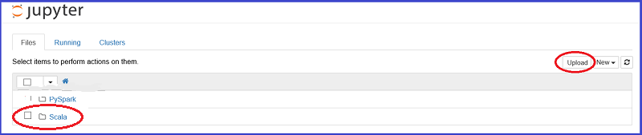
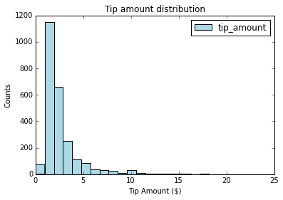

<properties
    pageTitle="Daten für Wissenschaft über Scala und Spark Azure | Microsoft Azure"
    description="Verwendung von Scala für maschinelle Kontrolle Learning Aufgaben mit den Spark skalierbaren MLlib und Spark ML Paketen auf einem Cluster Azure HDInsight Spark."  
    services="machine-learning"
    documentationCenter=""
    authors="bradsev"
    manager="jhubbard"
    editor="cgronlun" />

<tags
    ms.service="machine-learning"
    ms.workload="data-services"
    ms.tgt_pltfrm="na"
    ms.devlang="na"
    ms.topic="article"
    ms.date="08/01/2016"
    ms.author="bradsev;deguhath"/>

# Daten für Wissenschaft Scala und Spark auf Azure verwenden

In diesem Artikel wird gezeigt, wie Scala für maschinelle Kontrolle Learning Aufgaben mit den Spark skalierbaren MLlib und Spark ML Paketen auf einer Azure HDInsight Spark Cluster verwendet werden können. Es führt Sie durch die Aufgaben, die die [Daten für Wissenschaft Prozess](http://aka.ms/datascienceprocess)bilden: Daten Aufnahme und damit arbeiten, Visualisierung, Feature technisch, Modellierung und Modell Verbrauch. Die Modelle im Artikel beziehen logistischen und lineare Regression, zufällige Gesamtstrukturen und Farbverlauf verstärkt Bäume (GBTs), sowie zwei allgemeine Kontrolle maschinellen Learning Aufgaben:

- Regression Problem: Vorhersage des Betrags Tipp ($) für eine Geschäftsreise Taxi
- Binäre Klassifizierung: Vorhersage Tipp oder kein Tipp (1/0) für eine Geschäftsreise Taxi

Modellierung muss Schulung und Auswertung einer Datenmenge testen und relevanten Genauigkeit Kennzahlen. In diesem Artikel können Sie erfahren, wie diese Modelle in Azure Blob Storage gespeichert und so bewerten und deren Vorhersage Leistung auswerten. Dieser Artikel behandelt auch die erweiterten Themen zum Modelle optimieren mithilfe von übergreifende Überprüfung und hyper-Parameter ziehen. Die verwendeten Daten ist eine Stichprobe des 2013 NYC Taxi Geschäftsreise und Fahrpreis Datenmenge auf GitHub zur Verfügung.

[Scala](http://www.scala-lang.org/), eine Sprache basierend auf der Java virtuellen Computern integriert objektorientierte und funktionsfähig Sprachkonzepte. Es ist eine skalierbare Sprache, die für verteilten Verarbeitung in der Cloud gut geeignet ist, und bei Azure Spark Cluster ausgeführt wird.

[Spark](http://spark.apache.org/) ist ein offener Quelle Parallel-Verarbeitung Framework, für die Verarbeitung von in-Memory zum Steigern der Leistung der big Data Analytics Anwendung unterstützt. Das Modul für die Verarbeitung von Spark wird für Geschwindigkeit, erleichterte Bedienung verwenden und anspruchsvolle Analytics erstellt. Spark des verteilten Berechnung in-Memory-Funktionen machen Sie es eine gute Wahl für iterative Algorithmen Computer lernen und Graph berechnet. Das [spark.ml](http://spark.apache.org/docs/latest/ml-guide.html) -Paket bietet eine einheitliche Reihe von auf hoher Ebene auf Daten Rahmen, die Ihnen helfen können erstellen und optimieren praktische maschinellen learning Pipelines erstellten APIs. [MLlib](http://spark.apache.org/mllib/) ist des Spark skalierbare maschinellen Learning Bibliothek Modellierungsfunktionen in dieser verteilten Umgebung damit die Teilnehmer.

[HDInsight Spark](../hdinsight/hdinsight-apache-spark-overview.md) ist das Angebot Azure gehostet von Open Source Spark. Auch Unterstützung für Jupyter Scala Notizbücher auf dem Cluster Spark enthält, und die interaktive Spark SQL-Abfragen zum Transformieren, Filtern und Visualisieren von Daten in Azure Blob Storage gespeichert ausgeführt werden kann. Führen Sie die Scala Codeausschnitte in diesem Artikel, die die Lösungen bereitstellen und die entsprechenden Flächen visualisiert werden sollen, die Daten anzeigen im Jupyter Notizbücher auf die Spark Cluster installiert. Die Modellierung Schritte in den folgenden Themen haben Code, der Sie gezeigt, wie Schulen, auswerten, speichern und jeder Typ des Modells nutzen.

Die Schritte zum Einrichten und Code in diesem Artikel sind für Azure HDInsight 3.4 Spark 1.6. Jedoch der Code in diesem Artikel und im [Scala Jupyter Notizbuch](https://github.com/Azure/Azure-MachineLearning-DataScience/blob/master/Misc/Spark/Scala/Exploration%20Modeling%20and%20Scoring%20using%20Scala.ipynb) sind generisch und klicken Sie auf eine beliebige Spark Cluster arbeiten soll. Die Cluster Setup und Management Schritte möglicherweise etwas anders aus, was in diesem Artikel angezeigt werden, wenn Sie nicht HDInsight Spark verwenden.

> [AZURE.NOTE] Ein Thema, das Sie wird gezeigt, wie Python statt Scala Erledigung der Vorgänge für einen End-to-End-Daten für Wissenschaft Prozess verwenden, finden Sie unter [Daten Wissenschaft Spark auf Azure HDInsight verwenden](machine-learning-data-science-spark-overview.md).

## Erforderliche Komponenten

-   Sie müssen ein Azure-Abonnement verfügen. Wenn Sie nicht bereits eine, [erhalten Sie eine Azure kostenlose Testversion](https://azure.microsoft.com/documentation/videos/get-azure-free-trial-for-testing-hadoop-in-hdinsight/)verfügen.

-   Sie benötigen einen Azure HDInsight 3.4 Spark 1.6 Cluster die folgenden Schritte ausführen. Erstellen einen Cluster finden Sie unter den Anweisungen im [Erste Schritte: Erstellen von Apache Spark auf Azure HDInsight](../hdinsight/hdinsight-apache-spark-jupyter-spark-sql.md). Legen Sie die Cluster sowie Version im Menü **Clustertyp auswählen** .

>[AZURE.INCLUDE [delete-cluster-warning](../../includes/hdinsight-delete-cluster-warning.md)]

Eine Beschreibung der NYC Taxi Geschäftsreise Daten und Anweisungen zum Code aus einem Notizbuch Jupyter im Cluster Spark ausführen finden Sie unter den entsprechenden Abschnitten in der [Übersicht der Daten Wissenschaft Spark auf Azure HDInsight verwenden](machine-learning-data-science-spark-overview.md).  

## Ausführen von Scala Code aus einem Notizbuch Jupyter auf dem Spark cluster

Sie können ein Notizbuch Jupyter vom Azure-Portal starten. Suchen nach Spark Cluster auf dem Dashboard, und klicken Sie dann auf, um die Seite "Verwaltung" für Ihren Cluster eingeben. Als Nächstes klicken Sie auf **Cluster Dashboards**, und klicken Sie dann auf **Jupyter Notizbuch** , um das Notizbuch Spark Cluster zugeordnet zu öffnen.

Jupyter Notizbücher am https:// können auch zugreifen&lt;Clustername&gt;.azurehdinsight.net/jupyter. Ersetzen Sie *Clustername* mit dem Namen der Cluster aus. Sie benötigen das Kennwort für Ihr Administratorkonto auf den Jupyter Notizbücher zuzugreifen.

Wählen Sie **Scala** , um ein Verzeichnis anzuzeigen, die ein paar Beispiele für vorgefertigten Notizbücher enthält, die die PySpark-API verwenden. Untersuchung Modeling und Punkte mit Scala.ipynb Notizbuch, das die Codebeispielen für diese Sammlung Spark Themen enthält zählen ist auf [GitHub](https://github.com/Azure/Azure-MachineLearning-DataScience/tree/master/Misc/Spark/Scala)verfügbar.

Sie können das Notizbuch aus GitHub direkt auf dem Server Jupyter Notizbuch auf Ihrem Cluster Spark hochladen. Klicken Sie auf der Startseite Jupyter auf die Schaltfläche **Hochladen** . Fügen Sie die GitHub (unformatierten Inhalt) URL des Notizbuchs Scala im Dateiexplorer, und klicken Sie dann auf **Öffnen**. Das Notizbuch Scala steht unter dem folgenden URL:

[Exploration-Modeling-and-Scoring-using-Scala.ipynb](https://github.com/Azure/Azure-MachineLearning-DataScience/blob/master/Misc/Spark/Scala/Exploration-Modeling-and-Scoring-using-Scala.ipynb)

## Setup: Voreinstellung Spark und Struktur Kontexten, Spark Magics und Spark-Bibliotheken

### Voreingestellte Spark und Struktur Kontexte

    # SET THE START TIME
    import java.util.Calendar
    val beginningTime = Calendar.getInstance().getTime()

Die Spark Kernels, die mit Jupyter-Notizbüchern bereitgestellt werden nach Kontexten Voreinstellung. Müssen Sie nicht die Spark explizit festlegen oder Kontexten Struktur, bevor Sie mit der Arbeit mit der Anwendung entwickeln. Der voreingestellten Kontexte sind:

- `sc`für SparkContext
- `sqlContext`für HiveContext

### Magics Spark

Spark Kernel enthält einige vordefinierte "magics" an, welche sind spezielle Befehle, die Sie aufrufen können, mit `%%`. Zwei dieser Befehle sind in den folgenden Codebeispielen verwendet.

- `%%local`Gibt an, dass der Code in nachfolgenden Zeilen lokal ausgeführt wird. Der Code muss gültigen Scala Code sein.
- `%%sql -o <variable name>`führt eine Abfrage Struktur in `sqlContext`. Wenn die `-o` Parameter übergeben wird, ist das Ergebnis der Abfrage im beibehalten der `%%local` Scala Kontext als Spark Datenrahmen.

Für Weitere Informationen zu den Kernels für Jupyter Notizbüchern und deren vordefinierten ", die magics" Anrufen mit `%%` (z. B. `%%local`), finden Sie unter [Kernels für Jupyter Notizbücher mit HDInsight Spark Linux Cluster auf HDInsight verfügbar](../hdinsight/hdinsight-apache-spark-jupyter-notebook-kernels.md).

### Importieren von Bibliotheken

Importieren Sie die Spark, MLlib und andere Bibliotheken müssen Sie mit dem folgenden Code ein.

    # IMPORT SPARK AND JAVA LIBRARIES
    import org.apache.spark.sql.SQLContext
    import org.apache.spark.sql.functions._
    import java.text.SimpleDateFormat
    import java.util.Calendar
    import sqlContext.implicits._
    import org.apache.spark.sql.Row

    # IMPORT SPARK SQL FUNCTIONS
    import org.apache.spark.sql.types.{StructType, StructField, StringType, IntegerType, FloatType, DoubleType}
    import org.apache.spark.sql.functions.rand

    # IMPORT SPARK ML FUNCTIONS
    import org.apache.spark.ml.Pipeline
    import org.apache.spark.ml.feature.{StringIndexer, VectorAssembler, OneHotEncoder, VectorIndexer, Binarizer}
    import org.apache.spark.ml.tuning.{ParamGridBuilder, TrainValidationSplit, CrossValidator}
    import org.apache.spark.ml.regression.{LinearRegression, LinearRegressionModel, RandomForestRegressor, RandomForestRegressionModel, GBTRegressor, GBTRegressionModel}
    import org.apache.spark.ml.classification.{LogisticRegression, LogisticRegressionModel, RandomForestClassifier, RandomForestClassificationModel, GBTClassifier, GBTClassificationModel}
    import org.apache.spark.ml.evaluation.{BinaryClassificationEvaluator, RegressionEvaluator, MulticlassClassificationEvaluator}

    # IMPORT SPARK MLLIB FUNCTIONS
    import org.apache.spark.mllib.linalg.{Vector, Vectors}
    import org.apache.spark.mllib.util.MLUtils
    import org.apache.spark.mllib.classification.{LogisticRegressionWithLBFGS, LogisticRegressionModel}
    import org.apache.spark.mllib.regression.{LabeledPoint, LinearRegressionWithSGD, LinearRegressionModel}
    import org.apache.spark.mllib.tree.{GradientBoostedTrees, RandomForest}
    import org.apache.spark.mllib.tree.configuration.BoostingStrategy
    import org.apache.spark.mllib.tree.model.{GradientBoostedTreesModel, RandomForestModel, Predict}
    import org.apache.spark.mllib.evaluation.{BinaryClassificationMetrics, MulticlassMetrics, RegressionMetrics}

    # SPECIFY SQLCONTEXT
    val sqlContext = new SQLContext(sc)

## Erfassung von Daten

Dieser erste Schritt im Prozess Daten Wissenschaft ist zum Einlesen von Daten, die Sie analysieren möchten. Sie einzubinden die Daten aus externen Quellen oder Systeme, wo es befindet sich, in Ihrer Umgebung Daten, durchsuchen und Modellierung. In diesem Artikel sind die Daten, die Sie Aufnahme einer verknüpften 0,1 % Stichprobe der Taxi Geschäftsreise und Fahrpreis Datei (gespeichert als TSV-Datei). Die Umgebung Daten, durchsuchen und Modellierung ist Spark. Dieser Abschnitt enthält den Code, um die folgenden Reihe von Aufgaben ausführen:

1. Legen Sie Directory Pfade für Daten und Modell-Speicher.
2. Lesen Sie die Eingabewerte Datengruppe zurück (gespeichert als TSV-Datei).
3. Definieren Sie ein Schema für die Daten und bereinigen Sie die Daten.
4. Erstellen Sie einen Datenrahmen bereinigt, und im Speicher zwischengespeichert werden.
5. Registrieren Sie die Daten als eine temporäre Tabelle in zur SQLContext.
6. Fragen Sie die Tabelle, und importieren Sie die Ergebnisse in einem Datenrahmen.

### Festlegen von Verzeichnispfade für Speicherorte in Azure Blob-Speicher

Spark kann lesen und Schreiben in Azure Blob-Speicher. Sie können Spark verwenden, um die vorhandenen Daten zu verarbeiten, und die Ergebnisse anschließend erneut in Blob-Speicher speichern.

Um im BLOB-Speicher Modelle oder Dateien speichern, müssen Sie den Pfad ordnungsgemäß angeben. Den standardmäßige Container angefügter Spark Cluster mithilfe eines Pfads, der mit beginnt verweisen `wasb:///`. Verweisen auf andere Speicherorte mithilfe von `wasb://`.

Im folgenden Beispiel gibt den Speicherort der eingegebenen Daten zu lesenden und den Pfad zur Blob-Speicher, der mit dem Spark Cluster angeschlossen ist, wo das Modell gespeichert werden.

    # SET PATHS TO DATA AND MODEL FILE LOCATIONS
    # INGEST DATA AND SPECIFY HEADERS FOR COLUMNS
    val taxi_train_file = sc.textFile("wasb://mllibwalkthroughs@cdspsparksamples.blob.core.windows.net/Data/NYCTaxi/JoinedTaxiTripFare.Point1Pct.Train.tsv")
    val header = taxi_train_file.first;

    # SET THE MODEL STORAGE DIRECTORY PATH
    # NOTE THAT THE FINAL BACKSLASH IN THE PATH IS REQUIRED.
    val modelDir = "wasb:///user/remoteuser/NYCTaxi/Models/";

### Importieren von Daten, erstellen Sie eine RDD und einen Datenrahmen gemäß dem Schema definieren

    # RECORD THE START TIME
    val starttime = Calendar.getInstance().getTime()

    # DEFINE THE SCHEMA BASED ON THE HEADER OF THE FILE
    val sqlContext = new SQLContext(sc)
    val taxi_schema = StructType(
        Array(
            StructField("medallion", StringType, true),
            StructField("hack_license", StringType, true),
            StructField("vendor_id", StringType, true),
            StructField("rate_code", DoubleType, true),
            StructField("store_and_fwd_flag", StringType, true),
            StructField("pickup_datetime", StringType, true),
            StructField("dropoff_datetime", StringType, true),
            StructField("pickup_hour", DoubleType, true),
            StructField("pickup_week", DoubleType, true),
            StructField("weekday", DoubleType, true),
            StructField("passenger_count", DoubleType, true),
            StructField("trip_time_in_secs", DoubleType, true),
            StructField("trip_distance", DoubleType, true),
            StructField("pickup_longitude", DoubleType, true),
            StructField("pickup_latitude", DoubleType, true),
            StructField("dropoff_longitude", DoubleType, true),
            StructField("dropoff_latitude", DoubleType, true),
            StructField("direct_distance", StringType, true),
            StructField("payment_type", StringType, true),
            StructField("fare_amount", DoubleType, true),
            StructField("surcharge", DoubleType, true),
            StructField("mta_tax", DoubleType, true),
            StructField("tip_amount", DoubleType, true),
            StructField("tolls_amount", DoubleType, true),
            StructField("total_amount", DoubleType, true),
            StructField("tipped", DoubleType, true),
            StructField("tip_class", DoubleType, true)
            )
        )

    # CAST VARIABLES ACCORDING TO THE SCHEMA
    val taxi_temp = (taxi_train_file.map(_.split("\t"))
                            .filter((r) => r(0) != "medallion")
                            .map(p => Row(p(0), p(1), p(2),
                                p(3).toDouble, p(4), p(5), p(6), p(7).toDouble, p(8).toDouble, p(9).toDouble, p(10).toDouble,
                                p(11).toDouble, p(12).toDouble, p(13).toDouble, p(14).toDouble, p(15).toDouble, p(16).toDouble,
                                p(17), p(18), p(19).toDouble, p(20).toDouble, p(21).toDouble, p(22).toDouble,
                                p(23).toDouble, p(24).toDouble, p(25).toDouble, p(26).toDouble)))

    # CREATE AN INITIAL DATA FRAME AND DROP COLUMNS, AND THEN CREATE A CLEANED DATA FRAME BY FILTERING FOR UNWANTED VALUES OR OUTLIERS
    val taxi_train_df = sqlContext.createDataFrame(taxi_temp, taxi_schema)

    val taxi_df_train_cleaned = (taxi_train_df.drop(taxi_train_df.col("medallion"))
            .drop(taxi_train_df.col("hack_license")).drop(taxi_train_df.col("store_and_fwd_flag"))
            .drop(taxi_train_df.col("pickup_datetime")).drop(taxi_train_df.col("dropoff_datetime"))
            .drop(taxi_train_df.col("pickup_longitude")).drop(taxi_train_df.col("pickup_latitude"))
            .drop(taxi_train_df.col("dropoff_longitude")).drop(taxi_train_df.col("dropoff_latitude"))
            .drop(taxi_train_df.col("surcharge")).drop(taxi_train_df.col("mta_tax"))
            .drop(taxi_train_df.col("direct_distance")).drop(taxi_train_df.col("tolls_amount"))
            .drop(taxi_train_df.col("total_amount")).drop(taxi_train_df.col("tip_class"))
            .filter("passenger_count > 0 and passenger_count < 8 AND payment_type in ('CSH', 'CRD') AND tip_amount >= 0 AND tip_amount < 30 AND fare_amount >= 1 AND fare_amount < 150 AND trip_distance > 0 AND trip_distance < 100 AND trip_time_in_secs > 30 AND trip_time_in_secs < 7200"));

    # CACHE AND MATERIALIZE THE CLEANED DATA FRAME IN MEMORY
    taxi_df_train_cleaned.cache()
    taxi_df_train_cleaned.count()

    # REGISTER THE DATA FRAME AS A TEMPORARY TABLE IN SQLCONTEXT
    taxi_df_train_cleaned.registerTempTable("taxi_train")

    # GET THE TIME TO RUN THE CELL
    val endtime = Calendar.getInstance().getTime()
    val elapsedtime =  ((endtime.getTime() - starttime.getTime())/1000).toString;
    println("Time taken to run the above cell: " + elapsedtime + " seconds.");

**Ergebnis:**

Zeit zum Ausführen der Zelle: 8 Sekunden.

### Fragen Sie die Tabelle, und importieren die Ergebnisse in einem Datenrahmen

Fragen Sie als Nächstes die Tabelle für Fahrpreis, sind und Tipp Daten; Ausfiltern Sie beschädigt und stark abweichenden Daten her; und Drucken von mehreren Zeilen.

    # QUERY THE DATA
    val sqlStatement = """
        SELECT fare_amount, passenger_count, tip_amount, tipped
        FROM taxi_train
        WHERE passenger_count > 0 AND passenger_count < 7
        AND fare_amount > 0 AND fare_amount < 200
        AND payment_type in ('CSH', 'CRD')
        AND tip_amount > 0 AND tip_amount < 25
    """
    val sqlResultsDF = sqlContext.sql(sqlStatement)

    # SHOW ONLY THE TOP THREE ROWS
    sqlResultsDF.show(3)

**Ergebnis:**

fare_amount|passenger_count|tip_amount|hinterlassen hat
-----------|---------------|----------|------
       13,5|            1.0|       2.9|   1.0
       16,0|            2.0|       3.4|   1.0
       10.5|            2.0|       1.0|   1.0

## Durchsuchen von Daten und Visualisierung

Nachdem Sie die Daten in Spark einzufügen, ist der nächste Schritt im Prozess Wissenschaft Daten zu ein besseres Verständnis der Daten durch Untersuchung und Visualisierung gewinnen. In diesem Abschnitt untersuchen Sie die Taxi Daten mithilfe von SQL-Abfragen. Klicken Sie dann importieren Sie die Ergebnisse in einen Datenrahmen die Ziel-Variablen und künftigen Features für die visuelle Überprüfung mit dem Feature Auto-Visualisierung von Jupyter gezeichnet.

### Verwenden Sie lokale und SQL magische, um Daten zu zeichnen

Standardmäßig ist die Ausgabe einer beliebigen Codeausschnitt, die aus einem Notizbuch Jupyter ausgeführt werden, verfügbar, innerhalb des Kontexts der Sitzung, die auf den Knoten Worker beibehalten wird. Wenn eine Reise mit den Knoten Worker für jede Berechnung gespeichert werden sollen, und wenn die Daten, die Sie für Ihre Berechnung benötigen, die lokal auf dem Jupyter Server-Knoten (also den am Knoten) verfügbar ist, können Sie mithilfe der `%%local` magische Codeausschnitts auf dem Server Jupyter ausführen.

- **SQL-magische** (`%%sql`). HDInsight Spark Kernel unterstützt SqlContext-einfach Inline-HiveQL Abfragen. Die (`-o VARIABLE_NAME`) Argument behält die Ausgabe der SQL-Abfrage als Rahmen Pandas Daten auf dem Server Jupyter. Dies bedeutet, dass es im lokalen Modus verfügbar sein werden.
- `%%local`**magische**. Die `%%local` magische führt den Code lokal auf dem Server Jupyter, der den am Knoten im Cluster HDInsight ist. Verwenden Sie in der Regel `%%local` magische in Verbindung mit der `%%sql` magische mit den `-o` Parameter. Die `-o` Parameter beibehalten möchten, werden die Ausgabe der SQL-Abfrage lokales, und klicken Sie dann `%%local` magische würde auslösen nächsten Satz von Codeausschnitt lokal für die Ausgabe der SQL-Abfragen ausführen, die lokal beibehalten wird.

### Die Daten mithilfe von SQL-Abfrage
Diese Abfrage ruft die Taxi Schleifen durch Fahrpreis Menge, sind Anzahl und Tipp ab.

    # RUN THE SQL QUERY
    %%sql -q -o sqlResults
    SELECT fare_amount, passenger_count, tip_amount, tipped FROM taxi_train WHERE passenger_count > 0 AND passenger_count < 7 AND fare_amount > 0 AND fare_amount < 200 AND payment_type in ('CSH', 'CRD') AND tip_amount > 0 AND tip_amount < 25

In den folgenden Code der `%%local` magische erstellt einen Rahmen lokaler Daten, SqlResults. SqlResults können Sie mithilfe von Matplotlib darstellen.

> [AZURE.TIP] Lokale magische wird in diesem Artikel mehrfach verwendet. Wenn der Datenmenge groß ist, hören Sie zum Erstellen eines Rahmens von Daten, das dargestellt werden kann, im lokalen Speicher.

### Zeichnen Sie die Daten

Sie können mithilfe von Python Code nach im Datenrahmen im lokalen Kontext als Rahmen Pandas Daten ist darstellen.

    # RUN THE CODE LOCALLY ON THE JUPYTER SERVER
    %%local

    # USE THE JUPYTER AUTO-PLOTTING FEATURE TO CREATE INTERACTIVE FIGURES.
    # CLICK THE TYPE OF PLOT TO GENERATE (LINE, AREA, BAR, ETC.)
    sqlResults

 Kernel Spark Visualisierung automatisch die Ausgabe der SQL (HiveQL) Abfragen, nachdem Sie den Code ausführen. Sie können zwischen verschiedenen Arten von Visualisierungen auswählen:
 
- Tabelle
- Kreis
- Zeile
- Bereich
- Leiste für häufig verwendete

So sieht der Code zum Darstellen der Daten aus:

    # RUN THE CODE LOCALLY ON THE JUPYTER SERVER AND IMPORT LIBRARIES
    %%local
    import matplotlib.pyplot as plt
    %matplotlib inline

    # PLOT TIP BY PAYMENT TYPE AND PASSENGER COUNT
    ax1 = sqlResults[['tip_amount']].plot(kind='hist', bins=25, facecolor='lightblue')
    ax1.set_title('Tip amount distribution')
    ax1.set_xlabel('Tip Amount ($)')
    ax1.set_ylabel('Counts')
    plt.suptitle('')
    plt.show()

    # PLOT TIP BY PASSENGER COUNT
    ax2 = sqlResults.boxplot(column=['tip_amount'], by=['passenger_count'])
    ax2.set_title('Tip amount by Passenger count')
    ax2.set_xlabel('Passenger count')
    ax2.set_ylabel('Tip Amount ($)')
    plt.suptitle('')
    plt.show()

    # PLOT TIP AMOUNT BY FARE AMOUNT; SCALE POINTS BY PASSENGER COUNT
    ax = sqlResults.plot(kind='scatter', x= 'fare_amount', y = 'tip_amount', c='blue', alpha = 0.10, s=5*(sqlResults.passenger_count))
    ax.set_title('Tip amount by Fare amount')
    ax.set_xlabel('Fare Amount ($)')
    ax.set_ylabel('Tip Amount ($)')
    plt.axis([-2, 80, -2, 20])
    plt.show()

**Ergebnis:**

## Erstellen von Features und Features transformieren vorbereiten klicken Sie dann auf Daten für die Eingabe in modeling Funktionen

Für Strukturen basierenden Modellierungsfunktionen aus Spark ML und MLlib müssen Sie Ziel- und Features mithilfe einer Vielzahl von Techniken, wie Schachten von, Indizierung, eine Tastaturkürzel Codierung und Vektorisierung vorbereiten. Hier sind die Verfahren in diesem Abschnitt folgen:

1. Erstellen Sie ein neues Feature durch **Schachten von** Stunden in den Datenverkehr Perioden an.
2. **Indizieren und eine Tastaturkürzel Codierung** auf kategorisierten Features anwenden
3. **Beispiel und der geteilten Datenmenge** in Schulung und Test Brüche.
4. **Angeben Schulung Variable und Funktionen**, und klicken Sie dann Erstellen von indizierten oder eine Tastaturkürzel codierte Schulung & testen Eingabewerte beschriftete Punkt robuste Datasets (RDDs) oder Daten Frames verteilt.
5. Automatisch **Kategorisieren und Vektorisieren Features und Ziele** als Eingaben für maschinelle Learning-Modellen verwenden.

### Erstellen Sie ein neues Feature durch Schachten von Stunden in den Datenverkehr Perioden

Dieser Code wird gezeigt, wie Sie ein neues Feature durch Schachten von Stunden in den Datenverkehr Perioden erstellen und wie den resultierende Datenrahmen im Speicher zwischengespeichert. Zwischenspeichern von Leads zu verbesserte aufgezeichneten Zeiten, wo RDDs und Daten Frames wiederholt verwendet werden. Sie entsprechend, werden RDDs und Datenrahmen in mehreren Phasen im nachstehenden Verfahren Zwischenspeichern.

    # CREATE FOUR BUCKETS FOR TRAFFIC TIMES
    val sqlStatement = """
        SELECT *,
        CASE
         WHEN (pickup_hour <= 6 OR pickup_hour >= 20) THEN "Night"
         WHEN (pickup_hour >= 7 AND pickup_hour <= 10) THEN "AMRush"
         WHEN (pickup_hour >= 11 AND pickup_hour <= 15) THEN "Afternoon"
         WHEN (pickup_hour >= 16 AND pickup_hour <= 19) THEN "PMRush"
        END as TrafficTimeBins
        FROM taxi_train
    """
    val taxi_df_train_with_newFeatures = sqlContext.sql(sqlStatement)

    # CACHE THE DATA FRAME IN MEMORY AND MATERIALIZE THE DATA FRAME IN MEMORY
    taxi_df_train_with_newFeatures.cache()
    taxi_df_train_with_newFeatures.count()

### Indizieren und eine Tastaturkürzel Codierung der Kategorieliste features

Die Modellierung und Vorhersagen von MLlib Funktionen erfordern Features ohne Kategorieliste Eingabedaten indiziert oder vor der Verwendung codiert werden soll. In diesem Abschnitt wird gezeigt, wie indizieren oder codieren kategorisierten Features für die Eingabe in die Modellierungsfunktionen erstellt wird.

Sie müssen indizieren oder codieren Ihrer Modelle auf verschiedene Arten, je nach Modell. Beispielsweise erfordern logistischen und lineare Regression Modelle eine Tastaturkürzel Codierung. Beispielsweise kann ein Feature mit drei Kategorien in drei Spalten für Features erweitert werden. Jede Spalte enthält dann 0 oder 1, abhängig von der Kategorie einer Beobachtung. MLlib stellt die [OneHotEncoder](http://scikit-learn.org/stable/modules/generated/sklearn.preprocessing.OneHotEncoder.html#sklearn.preprocessing.OneHotEncoder) -Funktion für eine Tastaturkürzel Codierung. Eine Spalte mit binäre Vektoren höchstens ein einzelnes Chi-Wert ordnet diesem Encoder eine Spalte mit der Bezeichnung Indizes. Mit dieser Codierung können Algorithmen, die numerischen Werte Features wie logistische Regression erwarten auf kategorisierten Features angewendet werden.

So transformieren Sie nur vier Variablen um Beispielen, die Zeichenfolgen sind. Sie können auch einen index anderen Variablen, z. B. Weekday, zu durch numerische Werte, die als kategorisierten Variablen dargestellt werden.

Verwenden Sie für die Indizierung, `StringIndexer()`, und verwenden Sie für eine Tastaturkürzel Codierung, `OneHotEncoder()` Funktionen von MLlib. So sieht der Code zum Indizieren und codieren kategorisierten Features aus:

    # CREATE INDEXES AND ONE-HOT ENCODED VECTORS FOR SEVERAL CATEGORICAL FEATURES

    # RECORD THE START TIME
    val starttime = Calendar.getInstance().getTime()

    # INDEX AND ENCODE VENDOR_ID
    val stringIndexer = new StringIndexer().setInputCol("vendor_id").setOutputCol("vendorIndex").fit(taxi_df_train_with_newFeatures)
    val indexed = stringIndexer.transform(taxi_df_train_with_newFeatures)
    val encoder = new OneHotEncoder().setInputCol("vendorIndex").setOutputCol("vendorVec")
    val encoded1 = encoder.transform(indexed)

    # INDEX AND ENCODE RATE_CODE
    val stringIndexer = new StringIndexer().setInputCol("rate_code").setOutputCol("rateIndex").fit(encoded1)
    val indexed = stringIndexer.transform(encoded1)
    val encoder = new OneHotEncoder().setInputCol("rateIndex").setOutputCol("rateVec")
    val encoded2 = encoder.transform(indexed)

    # INDEX AND ENCODE PAYMENT_TYPE
    val stringIndexer = new StringIndexer().setInputCol("payment_type").setOutputCol("paymentIndex").fit(encoded2)
    val indexed = stringIndexer.transform(encoded2)
    val encoder = new OneHotEncoder().setInputCol("paymentIndex").setOutputCol("paymentVec")
    val encoded3 = encoder.transform(indexed)

    # INDEX AND TRAFFIC TIME BINS
    val stringIndexer = new StringIndexer().setInputCol("TrafficTimeBins").setOutputCol("TrafficTimeBinsIndex").fit(encoded3)
    val indexed = stringIndexer.transform(encoded3)
    val encoder = new OneHotEncoder().setInputCol("TrafficTimeBinsIndex").setOutputCol("TrafficTimeBinsVec")
    val encodedFinal = encoder.transform(indexed)

    # GET THE TIME TO RUN THE CELL
    val endtime = Calendar.getInstance().getTime()
    val elapsedtime =  ((endtime.getTime() - starttime.getTime())/1000).toString;
    println("Time taken to run the above cell: " + elapsedtime + " seconds.");

**Ergebnis:**

Zeit zum Ausführen der Zelle: 4 Sekunden.

### Beispiel für und teilen der Datenmenge in Schulung und Test Brüche

Dieser Code erstellt eine Stichproben der Daten (in diesem Beispiel wird 25 %). Zwar werden nicht für dieses Beispiel aufgrund der Größe der Datenmenge erforderlich ist, zeigt im Artikel, wie Sie hören können, damit Sie wissen, wie es für Ihre eigenen Probleme bei Bedarf verwendet. Wenn Beispiele groß sind, kann dies erheblichen Zeit sparen, während Schulen von Datenmodellen. Anschließend wird die Stichprobe in einer Schulung (in diesem Beispiel 75 %) und einen testen Teil (in diesem Beispiel wird 25 %) aufteilen, um in Klassifizierung und Regression Modellierung verwenden.

Fügen Sie eine Zufallszahl (zwischen 0 und 1) an jede Zeile (in einer Spalte "Rand"), die Sie während einer Schulung übergreifende Überprüfung Falten auswählen verwendet werden kann.

    # RECORD THE START TIME
    val starttime = Calendar.getInstance().getTime()

    # SPECIFY SAMPLING AND SPLITTING FRACTIONS
    val samplingFraction = 0.25;
    val trainingFraction = 0.75;
    val testingFraction = (1-trainingFraction);
    val seed = 1234;
    val encodedFinalSampledTmp = encodedFinal.sample(withReplacement = false, fraction = samplingFraction, seed = seed)
    val sampledDFcount = encodedFinalSampledTmp.count().toInt

    val generateRandomDouble = udf(() => {
        scala.util.Random.nextDouble
    })

    # ADD A RANDOM NUMBER FOR CROSS-VALIDATION
    val encodedFinalSampled = encodedFinalSampledTmp.withColumn("rand", generateRandomDouble());

    # SPLIT THE SAMPLED DATA FRAME INTO TRAIN AND TEST, WITH A RANDOM COLUMN ADDED FOR DOING CROSS-VALIDATION (SHOWN LATER)
    # INCLUDE A RANDOM COLUMN FOR CREATING CROSS-VALIDATION FOLDS
    val splits = encodedFinalSampled.randomSplit(Array(trainingFraction, testingFraction), seed = seed)
    val trainData = splits(0)
    val testData = splits(1)

    # GET THE TIME TO RUN THE CELL
    val endtime = Calendar.getInstance().getTime()
    val elapsedtime =  ((endtime.getTime() - starttime.getTime())/1000).toString;
    println("Time taken to run the above cell: " + elapsedtime + " seconds.");

**Ergebnis:**

Zeit zum Ausführen der Zelle: 2 Sekunden.

### Geben Sie Schulung Variable und Funktionen an, und erstellen Sie dann indizierte oder eine Tastaturkürzel codierte Schulung und Eingabe beschrifteten RDDs Punkt oder Daten Frames testen

Dieser Abschnitt enthält Code, der Sie gezeigt, wie kategorisierten Textdaten als Datentyp beschriftete Punkt index zu erstellen und es codiert werden, damit Sie es zum Schulen und Testen logistische Regression MLlib und andere Klassifizierung Modelle verwenden können. Beschriftete Point-Objekte sind RDDs, die so formatiert sind, die von den meisten des Computers learning Algorithmen in MLlib als Eingabedaten erforderlich ist. Eine [Beschriftung Punkt](https://spark.apache.org/docs/latest/mllib-data-types.html#labeled-point) ist einer lokalen Vektor, entweder dicht oder gering gefüllten, eine Bezeichnung/Antwort zugeordnet.

In diesem Code Geben Sie das Zielvariable (abhängige) und die Features zum Schulen von Modellen verwenden. Klicken Sie dann erstellen Sie indizierte oder eine Tastaturkürzel codierte Schulung und Eingabe beschrifteten RDDs Punkt oder Daten Frames testen.

    # RECORD THE START TIME
    val starttime = Calendar.getInstance().getTime()

    # MAP NAMES OF FEATURES AND TARGETS FOR CLASSIFICATION AND REGRESSION PROBLEMS
    val featuresIndOneHot = List("paymentVec", "vendorVec", "rateVec", "TrafficTimeBinsVec", "pickup_hour", "weekday", "passenger_count", "trip_time_in_secs", "trip_distance", "fare_amount").map(encodedFinalSampled.columns.indexOf(_))
    val featuresIndIndex = List("paymentIndex", "vendorIndex", "rateIndex", "TrafficTimeBinsIndex", "pickup_hour", "weekday", "passenger_count", "trip_time_in_secs", "trip_distance", "fare_amount").map(encodedFinalSampled.columns.indexOf(_))

    # SPECIFY THE TARGET FOR CLASSIFICATION ('tipped') AND REGRESSION ('tip_amount') PROBLEMS
    val targetIndBinary = List("tipped").map(encodedFinalSampled.columns.indexOf(_))
    val targetIndRegression = List("tip_amount").map(encodedFinalSampled.columns.indexOf(_))

    # CREATE INDEXED LABELED POINT RDD OBJECTS
    val indexedTRAINbinary = trainData.rdd.map(r => LabeledPoint(r.getDouble(targetIndBinary(0).toInt), Vectors.dense(featuresIndIndex.map(r.getDouble(_)).toArray)))
    val indexedTESTbinary = testData.rdd.map(r => LabeledPoint(r.getDouble(targetIndBinary(0).toInt), Vectors.dense(featuresIndIndex.map(r.getDouble(_)).toArray)))
    val indexedTRAINreg = trainData.rdd.map(r => LabeledPoint(r.getDouble(targetIndRegression(0).toInt), Vectors.dense(featuresIndIndex.map(r.getDouble(_)).toArray)))
    val indexedTESTreg = testData.rdd.map(r => LabeledPoint(r.getDouble(targetIndRegression(0).toInt), Vectors.dense(featuresIndIndex.map(r.getDouble(_)).toArray)))

    # CREATE INDEXED DATA FRAMES THAT YOU CAN USE TO TRAIN BY USING SPARK ML FUNCTIONS
    val indexedTRAINbinaryDF = indexedTRAINbinary.toDF()
    val indexedTESTbinaryDF = indexedTESTbinary.toDF()
    val indexedTRAINregDF = indexedTRAINreg.toDF()
    val indexedTESTregDF = indexedTESTreg.toDF()

    # CREATE ONE-HOT ENCODED (VECTORIZED) DATA FRAMES THAT YOU CAN USE TO TRAIN BY USING SPARK ML FUNCTIONS
    val assemblerOneHot = new VectorAssembler().setInputCols(Array("paymentVec", "vendorVec", "rateVec", "TrafficTimeBinsVec", "pickup_hour", "weekday", "passenger_count", "trip_time_in_secs", "trip_distance", "fare_amount")).setOutputCol("features")
    val OneHotTRAIN = assemblerOneHot.transform(trainData)
    val OneHotTEST = assemblerOneHot.transform(testData)

    # GET THE TIME TO RUN THE CELL
    val endtime = Calendar.getInstance().getTime()
    val elapsedtime =  ((endtime.getTime() - starttime.getTime())/1000).toString;
    println("Time taken to run the above cell: " + elapsedtime + " seconds.");

**Ergebnis:**

Zeit zum Ausführen der Zelle: 4 Sekunden.

### Automatisch kategorisieren Sie und Vektorisieren Sie Features und Ziele für maschinelle learning Modelle als Eingaben verwendet

Verwenden Sie Spark ML, um den Ziel- und Features, die Sie in der Strukturansicht-basierten Modellierungsfunktionen kategorisieren. Der Code führt zwei Aufgaben aus:

-   Erstellt eine binäre Ziel für Klassifizierung einen Wert von 0 oder 1 zu jeder Datenpunkt zwischen 0 und 1 mithilfe von 0,5 ein gegebener zuweisen.
- Automatisch kategorisiert Features aus. Wenn die Anzahl der distinct numerische Werte für jedes Feature kleiner als 32 ist, wird dieses Feature kategorisiert.

So sieht der Code für diese beiden Aufgaben aus.

    # CATEGORIZE FEATURES AND BINARIZE THE TARGET FOR THE BINARY CLASSIFICATION PROBLEM

    # TRAIN DATA
    val indexer = new VectorIndexer().setInputCol("features").setOutputCol("featuresCat").setMaxCategories(32)
    val indexerModel = indexer.fit(indexedTRAINbinaryDF)
    val indexedTrainwithCatFeat = indexerModel.transform(indexedTRAINbinaryDF)
    val binarizer: Binarizer = new Binarizer().setInputCol("label").setOutputCol("labelBin").setThreshold(0.5)
    val indexedTRAINwithCatFeatBinTarget = binarizer.transform(indexedTrainwithCatFeat)

    # TEST DATA
    val indexerModel = indexer.fit(indexedTESTbinaryDF)
    val indexedTrainwithCatFeat = indexerModel.transform(indexedTESTbinaryDF)
    val binarizer: Binarizer = new Binarizer().setInputCol("label").setOutputCol("labelBin").setThreshold(0.5)
    val indexedTESTwithCatFeatBinTarget = binarizer.transform(indexedTrainwithCatFeat)

    # CATEGORIZE FEATURES FOR THE REGRESSION PROBLEM
    # CREATE PROPERLY INDEXED AND CATEGORIZED DATA FRAMES FOR TREE-BASED MODELS

    # TRAIN DATA
    val indexer = new VectorIndexer().setInputCol("features").setOutputCol("featuresCat").setMaxCategories(32)
    val indexerModel = indexer.fit(indexedTRAINregDF)
    val indexedTRAINwithCatFeat = indexerModel.transform(indexedTRAINregDF)

    # TEST DATA
    val indexerModel = indexer.fit(indexedTESTbinaryDF)
    val indexedTESTwithCatFeat = indexerModel.transform(indexedTESTregDF)

## Binäre Klassifizierung Modell: Vorhersagen, ob ein Tipp gezahlt werden soll

In diesem Abschnitt erstellen Sie drei Arten von binäre Klassifizierung Modelle Vorhersagen, und zwar unabhängig davon, ob ein Tipp gezahlt werden soll:

- Ein **Modell logistische Regression** mithilfe der Spark ML `LogisticRegression()` (Funktion)
- Eine **zufällige Klassifizierung Gesamtstrukturmodell** mithilfe der Spark ML `RandomForestClassifier()` (Funktion)
- Ein **Farbverlauf steigern Struktur Klassifizierung Modell** mithilfe der MLlib `GradientBoostedTrees()` (Funktion)

### Erstellen eines Modells logistische regression

Als Nächstes erstellen ein Modells logistische Regression mithilfe der Spark ML `LogisticRegression()` (Funktion). Erstellen Sie das Modell-Code in eine Reihe von Schritten zu erstellen:

1. **Zug Modell** Daten mit einem Parameter festgelegt.
2. **Auswerten des Modells** auf einer Datenmenge Test mit Kennzahlen.
3. **Speichern Sie das Modell** im BLOB-Speicher für zukünftige Ernährung.
4. Hat **das Modell Punktzahl** gegen Testdaten.
5. **Zeichnen Sie die Ergebnisse** , mit Empfänger Betrieb Kurven Merkmale (ROC).

So sieht der Code für diese Schritte aus:

    # CREATE A LOGISTIC REGRESSION MODEL
    val lr = new LogisticRegression().setLabelCol("tipped").setFeaturesCol("features").setMaxIter(10).setRegParam(0.3).setElasticNetParam(0.8)
    val lrModel = lr.fit(OneHotTRAIN)

    # PREDICT ON THE TEST DATA SET
    val predictions = lrModel.transform(OneHotTEST)

    # SELECT `BinaryClassificationEvaluator()` TO COMPUTE THE TEST ERROR
    val evaluator = new BinaryClassificationEvaluator().setLabelCol("tipped").setRawPredictionCol("probability").setMetricName("areaUnderROC")
    val ROC = evaluator.evaluate(predictions)
    println("ROC on test data = " + ROC)

    # SAVE THE MODEL
    val datestamp = Calendar.getInstance().getTime().toString.replaceAll(" ", ".").replaceAll(":", "_");
    val modelName = "LogisticRegression__"
    val filename = modelDir.concat(modelName).concat(datestamp)
    lrModel.save(filename);

Laden, Punktzahl, und speichern Sie die Ergebnisse.

    # RECORD THE START TIME
    val starttime = Calendar.getInstance().getTime()

    # LOAD THE SAVED MODEL AND SCORE THE TEST DATA SET
    val savedModel = org.apache.spark.ml.classification.LogisticRegressionModel.load(filename)
    println(s"Coefficients: ${savedModel.coefficients} Intercept: ${savedModel.intercept}")

    # SCORE THE MODEL ON THE TEST DATA
    val predictions = savedModel.transform(OneHotTEST).select("tipped","probability","rawPrediction")
    predictions.registerTempTable("testResults")

    # SELECT `BinaryClassificationEvaluator()` TO COMPUTE THE TEST ERROR
    val evaluator = new BinaryClassificationEvaluator().setLabelCol("tipped").setRawPredictionCol("probability").setMetricName("areaUnderROC")
    val ROC = evaluator.evaluate(predictions)

    # GET THE TIME TO RUN THE CELL
    val endtime = Calendar.getInstance().getTime()
    val elapsedtime =  ((endtime.getTime() - starttime.getTime())/1000).toString;
    println("Time taken to run the above cell: " + elapsedtime + " seconds.");

    # PRINT THE ROC RESULTS
    println("ROC on test data = " + ROC)

**Ergebnis:**

ROC Test Daten = 0.9827381497557599

Verwenden von Python auf lokale Pandas Daten Frames ROC Kurve gezeichnet.

    # QUERY THE RESULTS
    %%sql -q -o sqlResults
    SELECT tipped, probability from testResults

    # RUN THE CODE LOCALLY ON THE JUPYTER SERVER AND IMPORT LIBRARIES
    %%local
    %matplotlib inline
    from sklearn.metrics import roc_curve,auc

    sqlResults['probFloat'] = sqlResults.apply(lambda row: row['probability'].values()[0][1], axis=1)
    predictions_pddf = sqlResults[["tipped","probFloat"]]

    # PREDICT THE ROC CURVE
    # predictions_pddf = sqlResults.rename(columns={'_1': 'probability', 'tipped': 'label'})
    prob = predictions_pddf["probFloat"]
    fpr, tpr, thresholds = roc_curve(predictions_pddf['tipped'], prob, pos_label=1);
    roc_auc = auc(fpr, tpr)

    # PLOT THE ROC CURVE
    plt.figure(figsize=(5,5))
    plt.plot(fpr, tpr, label='ROC curve (area = %0.2f)' % roc_auc)
    plt.plot([0, 1], [0, 1], 'k--')
    plt.xlim([0.0, 1.0])
    plt.ylim([0.0, 1.05])
    plt.xlabel('False Positive Rate')
    plt.ylabel('True Positive Rate')
    plt.title('ROC Curve')
    plt.legend(loc="lower right")
    plt.show()

**Ergebnis:**

### Erstellen Sie eine zufällige Klassifizierung Gesamtstrukturmodell

Als Nächstes erstellen Sie eine zufällige Klassifizierung Gesamtstrukturmodell mithilfe der Spark ML `RandomForestClassifier()` Funktion und wertet dann auf das Modell auf Testdaten.

    # RECORD THE START TIME
    val starttime = Calendar.getInstance().getTime()

    # CREATE THE RANDOM FOREST CLASSIFIER MODEL
    val rf = new RandomForestClassifier().setLabelCol("labelBin").setFeaturesCol("featuresCat").setNumTrees(10).setSeed(1234)

    # FIT THE MODEL
    val rfModel = rf.fit(indexedTRAINwithCatFeatBinTarget)
    val predictions = rfModel.transform(indexedTESTwithCatFeatBinTarget)

    # EVALUATE THE MODEL
    val evaluator = new MulticlassClassificationEvaluator().setLabelCol("label").setPredictionCol("prediction").setMetricName("f1")
    val Test_f1Score = evaluator.evaluate(predictions)
    println("F1 score on test data: " + Test_f1Score);

    # GET THE TIME TO RUN THE CELL
    val endtime = Calendar.getInstance().getTime()
    val elapsedtime =  ((endtime.getTime() - starttime.getTime())/1000).toString;
    println("Time taken to run the above cell: " + elapsedtime + " seconds.");

    # CALCULATE BINARY CLASSIFICATION EVALUATION METRICS
    val evaluator = new BinaryClassificationEvaluator().setLabelCol("label").setRawPredictionCol("probability").setMetricName("areaUnderROC")
    val ROC = evaluator.evaluate(predictions)
    println("ROC on test data = " + ROC)

**Ergebnis:**

ROC Test Daten = 0.9847103571552683

### Erstellen eines GBT Klassifizierung-Modells

Als Nächstes erstellen ein GBT Klassifizierung Modells mithilfe des MLlib `GradientBoostedTrees()` -Funktion und wertet dann auf das Modell auf Testdaten.

    # TRAIN A GBT CLASSIFICATION MODEL BY USING MLLIB AND A LABELED POINT

    # RECORD THE START TIME
    val starttime = Calendar.getInstance().getTime()

    # DEFINE THE GBT CLASSIFICATION MODEL
    val boostingStrategy = BoostingStrategy.defaultParams("Classification")
    boostingStrategy.numIterations = 20
    boostingStrategy.treeStrategy.numClasses = 2
    boostingStrategy.treeStrategy.maxDepth = 5
    boostingStrategy.treeStrategy.categoricalFeaturesInfo = Map[Int, Int]((0,2),(1,2),(2,6),(3,4))

    # TRAIN THE MODEL
    val gbtModel = GradientBoostedTrees.train(indexedTRAINbinary, boostingStrategy)

    # SAVE THE MODEL IN BLOB STORAGE
    val datestamp = Calendar.getInstance().getTime().toString.replaceAll(" ", ".").replaceAll(":", "_");
    val modelName = "GBT_Classification__"
    val filename = modelDir.concat(modelName).concat(datestamp)
    gbtModel.save(sc, filename);

    # EVALUATE THE MODEL ON TEST INSTANCES AND THE COMPUTE TEST ERROR
    val labelAndPreds = indexedTESTbinary.map { point =>
      val prediction = gbtModel.predict(point.features)
      (point.label, prediction)
    }
    val testErr = labelAndPreds.filter(r => r._1 != r._2).count.toDouble / indexedTRAINbinary.count()
    //println("Learned classification GBT model:\n" + gbtModel.toDebugString)
    println("Test Error = " + testErr)

    # USE BINARY AND MULTICLASS METRICS TO EVALUATE THE MODEL ON THE TEST DATA
    val metrics = new MulticlassMetrics(labelAndPreds)
    println(s"Precision: ${metrics.precision}")
    println(s"Recall: ${metrics.recall}")
    println(s"F1 Score: ${metrics.fMeasure}")

    val metrics = new BinaryClassificationMetrics(labelAndPreds)
    println(s"Area under PR curve: ${metrics.areaUnderPR}")
    println(s"Area under ROC curve: ${metrics.areaUnderROC}")

    # GET THE TIME TO RUN THE CELL
    val endtime = Calendar.getInstance().getTime()
    val elapsedtime =  ((endtime.getTime() - starttime.getTime())/1000).toString;
    println("Time taken to run the above cell: " + elapsedtime + " seconds.");

    # PRINT THE ROC METRIC
    println(s"Area under ROC curve: ${metrics.areaUnderROC}")

**Ergebnis:**

Bereich unter ROC Kurve: 0.9846895479241554

## Regressionsmodell: Vorhersagen Tipp Betrag

In diesem Abschnitt erstellen Sie zwei verschiedene Typen von Regression Modelle Vorhersagen den Betrag ein Tipp:

- Eine **lineare Regressionsmodell regularized** mithilfe der Spark ML `LinearRegression()` (Funktion). Sie speichern Sie das Modell und Auswerten des Modells auf Testdaten.
- Ein **Farbverlauf verstärken Struktur Regressionsmodell** mithilfe der Spark ML `GBTRegressor()` (Funktion).

### Erstellen eines Modells regularized lineare regression

    # RECORD THE START TIME
    val starttime = Calendar.getInstance().getTime()

    # CREATE A REGULARIZED LINEAR REGRESSION MODEL BY USING THE SPARK ML FUNCTION AND DATA FRAMES
    val lr = new LinearRegression().setLabelCol("tip_amount").setFeaturesCol("features").setMaxIter(10).setRegParam(0.3).setElasticNetParam(0.8)

    # FIT THE MODEL BY USING DATA FRAMES
    val lrModel = lr.fit(OneHotTRAIN)
    println(s"Coefficients: ${lrModel.coefficients} Intercept: ${lrModel.intercept}")

    # SUMMARIZE THE MODEL OVER THE TRAINING SET AND PRINT METRICS
    val trainingSummary = lrModel.summary
    println(s"numIterations: ${trainingSummary.totalIterations}")
    println(s"objectiveHistory: ${trainingSummary.objectiveHistory.toList}")
    trainingSummary.residuals.show()
    println(s"RMSE: ${trainingSummary.rootMeanSquaredError}")
    println(s"r2: ${trainingSummary.r2}")

    # SAVE THE MODEL IN AZURE BLOB STORAGE
    val datestamp = Calendar.getInstance().getTime().toString.replaceAll(" ", ".").replaceAll(":", "_");
    val modelName = "LinearRegression__"
    val filename = modelDir.concat(modelName).concat(datestamp)
    lrModel.save(filename);

    # PRINT THE COEFFICIENTS
    println(s"Coefficients: ${lrModel.coefficients} Intercept: ${lrModel.intercept}")

    # SCORE THE MODEL ON TEST DATA
    val predictions = lrModel.transform(OneHotTEST)

    # EVALUATE THE MODEL ON TEST DATA
    val evaluator = new RegressionEvaluator().setLabelCol("tip_amount").setPredictionCol("prediction").setMetricName("r2")
    val r2 = evaluator.evaluate(predictions)
    println("R-sqr on test data = " + r2)

    # GET THE TIME TO RUN THE CELL
    val endtime = Calendar.getInstance().getTime()
    val elapsedtime =  ((endtime.getTime() - starttime.getTime())/1000).toString;
    println("Time taken to run the above cell: " + elapsedtime + " seconds.");

**Ergebnis:**

Zeit zum Ausführen der Zelle: 13 Sekunden.

    # LOAD A SAVED LINEAR REGRESSION MODEL FROM BLOB STORAGE AND SCORE A TEST DATA SET

    # RECORD THE START TIME
    val starttime = Calendar.getInstance().getTime()

    # LOAD A SAVED LINEAR REGRESSION MODEL FROM AZURE BLOB STORAGE
    val savedModel = org.apache.spark.ml.regression.LinearRegressionModel.load(filename)
    println(s"Coefficients: ${savedModel.coefficients} Intercept: ${savedModel.intercept}")

    # SCORE THE MODEL ON TEST DATA
    val predictions = savedModel.transform(OneHotTEST).select("tip_amount","prediction")
    predictions.registerTempTable("testResults")

    # EVALUATE THE MODEL ON TEST DATA
    val evaluator = new RegressionEvaluator().setLabelCol("tip_amount").setPredictionCol("prediction").setMetricName("r2")
    val r2 = evaluator.evaluate(predictions)
    println("R-sqr on test data = " + r2)

    # GET THE TIME TO RUN THE CELL
    val endtime = Calendar.getInstance().getTime()
    val elapsedtime =  ((endtime.getTime() - starttime.getTime())/1000).toString;
    println("Time taken to run the above cell: " + elapsedtime + " seconds.");

    # PRINT THE RESULTS
    println("R-sqr on test data = " + r2)

**Ergebnis:**

R-Sqr Test Daten = 0.5960320470835743

Als Nächstes Abfragen Sie die Testergebnisse als Datenrahmen aus, und verwenden Sie AutoVizWidget und Matplotlib es visualisiert werden sollen.

    # RUN A SQL QUERY
    %%sql -q -o sqlResults
    select * from testResults

    # RUN THE CODE LOCALLY ON THE JUPYTER SERVER
    %%local

    # USE THE JUPYTER AUTO-PLOTTING FEATURE TO CREATE INTERACTIVE FIGURES
    # CLICK THE TYPE OF PLOT TO GENERATE (LINE, AREA, BAR, AND SO ON)
    sqlResults

Der Code erstellt einen Rahmen lokaler Daten aus der Abfrageausgabe und zeichnet die Daten. Die `%%local` magische erstellt einen Rahmen lokaler Daten `sqlResults`, die Sie verwenden können, um mit Matplotlib darstellen.

>[AZURE.NOTE] Diese magische Spark wird in diesem Artikel mehrfach verwendet. Wenn die Datenmenge groß ist, sollten Sie Beispiele zum Erstellen eines Rahmens von Daten, das dargestellt werden kann, im lokalen Speicher.

Erstellen Sie mithilfe von Python Matplotlib Flächen.

    # RUN THE CODE LOCALLY ON THE JUPYTER SERVER AND IMPORT LIBRARIES
    %%local
    sqlResults
    %matplotlib inline
    import numpy as np

    # PLOT THE RESULTS
    ax = sqlResults.plot(kind='scatter', figsize = (6,6), x='tip_amount', y='prediction', color='blue', alpha = 0.25, label='Actual vs. predicted');
    fit = np.polyfit(sqlResults['tip_amount'], sqlResults['prediction'], deg=1)
    ax.set_title('Actual vs. Predicted Tip Amounts ($)')
    ax.set_xlabel("Actual")
    ax.set_ylabel("Predicted")
    #ax.plot(sqlResults['tip_amount'], fit[0] * sqlResults['prediction'] + fit[1], color='magenta')
    plt.axis([-1, 15, -1, 8])
    plt.show(ax)

**Ergebnis:**

### Erstellen eines GBT Regression-Modells

Erstellen ein GBT Regressionsmodells mithilfe der Spark ML `GBTRegressor()` Funktion und wertet dann auf das Modell auf Testdaten.

[Farbverlauf verstärkt Strukturen](http://spark.apache.org/docs/latest/ml-classification-regression.html#gradient-boosted-trees-gbts) (GBTs) sind Anzüge der Entscheidungsstruktur an. GBTs Schulen Entscheidungsstruktur wiederholt auf eine Funktion Verlust zu minimieren. Sie können für die Regression und Klassifizierung GBTs verwenden. Diese kategorisierten Features verarbeitet werden können, Featureskalierung nicht erforderlich und Nonlinearities und Feature Interaktionen erfassen können. Sie können auch eine Multiclass-Klassifizierung Einstellung verwenden.

    # RECORD THE START TIME
    val starttime = Calendar.getInstance().getTime()

    # TRAIN A GBT REGRESSION MODEL
    val gbt = new GBTRegressor().setLabelCol("label").setFeaturesCol("featuresCat").setMaxIter(10)
    val gbtModel = gbt.fit(indexedTRAINwithCatFeat)

    # MAKE PREDICTIONS
    val predictions = gbtModel.transform(indexedTESTwithCatFeat)

    # COMPUTE TEST SET R2
    val evaluator = new RegressionEvaluator().setLabelCol("label").setPredictionCol("prediction").setMetricName("r2")
    val Test_R2 = evaluator.evaluate(predictions)

    # GET THE TIME TO RUN THE CELL
    val endtime = Calendar.getInstance().getTime()
    val elapsedtime =  ((endtime.getTime() - starttime.getTime())/1000).toString;
    println("Time taken to run the above cell: " + elapsedtime + " seconds.");

    # PRINT THE RESULTS
    println("Test R-sqr is: " + Test_R2);

**Ergebnis:**

Test R-Sqr ist: 0.7655383534596654

## Erweiterte modeling Dienstprogrammen zur Optimierung

In diesem Abschnitt verwenden Sie Computer Learning Dienstprogramme, mit denen Entwickler häufig zur Optimierung des Modells ein. Insbesondere können Sie Computer Learning Modelle drei verschiedene Arten optimieren, indem Sie Parameter ziehen und übergreifende Überprüfung:

-   Die Daten in Sätzen Zug und Validierung aufteilen, Optimieren des Modells mithilfe von ziehen hyper-Parameter auf eine Reihe von Schulung und ausgewertet werden soll, klicken Sie auf eine Reihe Überprüfung (lineare Regression)
-   Optimieren des Modells mithilfe von übergreifende Überprüfung und hyper-Parameter mithilfe des Spark ML CrossValidator-Funktion (binäre Klassifizierung) ziehen
-   Optimieren des Modells mithilfe von benutzerdefiniertem Code für übergreifende Überprüfung und Parameter-Ziehen mit einem beliebigen Computer learning (Funktion) und Parameter festlegen (lineare Regression)

**Übergreifende Überprüfung** ist eine Methode, die wie gut ein Modells auf einen bekannten Satz von Daten gelernt generalisiert, um die Features von Datasets Vorhersagen, an dem sie nicht trainierte, bewertet. Die allgemeine Idee diese Methode ist, dass ein Modells auf einer Datengruppe zurück bekannte Daten angewiesen ist, und klicken Sie dann die Genauigkeit der zugehörigen Vorhersagen gegen eine unabhängige Datenmenge getestet ist. Wird eine gemeinsame Implementierung *k*eine Datengruppe zurück aufgeteilt-Falten, und klicken Sie dann auf alle bis auf einen der Falten einer Roundrobin Modell Schulen.

**Optimierung der Hyper-Parameter** ist das Problem, eine Reihe von hyper-Parameter für einen Algorithmus Learning normalerweise mit dem Ziel ein Maß für den Algorithmus der Leistung von einer unabhängigen Datenmenge optimieren. Hyper-Parameter ist ein Wert, den Sie außerhalb der Modell Schulung Prozedur angeben müssen. Annahmen hyper-Parameterwerte können die Flexibilität und Genauigkeit des Modells auswirken. Entscheidungsbäume haben hyper-Parameter, beispielsweise, wie die gewünschte Tiefe und die Anzahl der Blätter in der Struktur. Sie müssen Terminologiespeicheradministrator beeinträchtigt Einreihungsfehler für einen Support Vektor Computer (SVM) festlegen.

Ein gängiges Verfahren zum Ausführen von hyper-Parameter Optimierung besteht darin, eine Abkürzung von einem **Parameter Zug**Raster Suche verwenden. In einer Suche Raster wird eine vollständige Suche über die Werte für eine bestimmte Teilmenge von den Abstand hyper-Parameter für eine Schulung Algorithmus ausgeführt. Übergreifende Überprüfung kann eine Leistungsmetrik zu sortieren, die optimale Ergebnisse vom Raster Suche Algorithmus gefertigt angeben. Wenn Sie übergreifende Überprüfung hyper-Parameter ziehen verwenden, hilft Ihnen Grenzwert Probleme wie overfitting eines Modells mit Schulungsdaten. Auf diese Weise behält das Modell Kapazität, um auf die allgemeine Datenmenge anwenden aus dem die Schulungsdaten extrahiert wurde.

### Optimieren eines Modells lineare Regression mit hyper-Parameter ziehen

Teilen Sie als Nächstes Daten in Zug und Validierung Sätze Verwendung hyper-Parameter auf einen Satz Schulung zum Optimieren des Modells und ausgewertet werden soll, klicken Sie auf eine Reihe Überprüfung (lineare Regression) ziehen.

    # RECORD THE START TIME
    val starttime = Calendar.getInstance().getTime()

    # RENAME `tip_amount` AS A LABEL
    val OneHotTRAINLabeled = OneHotTRAIN.select("tip_amount","features").withColumnRenamed(existingName="tip_amount",newName="label")
    val OneHotTESTLabeled = OneHotTEST.select("tip_amount","features").withColumnRenamed(existingName="tip_amount",newName="label")
    OneHotTRAINLabeled.cache()
    OneHotTESTLabeled.cache()

    # DEFINE THE ESTIMATOR FUNCTION: `THE LinearRegression()` FUNCTION
    val lr = new LinearRegression().setLabelCol("label").setFeaturesCol("features").setMaxIter(10)

    # DEFINE THE PARAMETER GRID
    val paramGrid = new ParamGridBuilder().addGrid(lr.regParam, Array(0.1, 0.01, 0.001)).addGrid(lr.fitIntercept).addGrid(lr.elasticNetParam, Array(0.1, 0.5, 0.9)).build()

    # DEFINE THE PIPELINE WITH A TRAIN/TEST VALIDATION SPLIT (75% IN THE TRAINING SET), AND THEN THE SPECIFY ESTIMATOR, EVALUATOR, AND PARAMETER GRID
    val trainPct = 0.75
    val trainValidationSplit = new TrainValidationSplit().setEstimator(lr).setEvaluator(new RegressionEvaluator).setEstimatorParamMaps(paramGrid).setTrainRatio(trainPct)

    # RUN THE TRAIN VALIDATION SPLIT AND CHOOSE THE BEST SET OF PARAMETERS
    val model = trainValidationSplit.fit(OneHotTRAINLabeled)

    # MAKE PREDICTIONS ON THE TEST DATA BY USING THE MODEL WITH THE COMBINATION OF PARAMETERS THAT PERFORMS THE BEST
    val testResults = model.transform(OneHotTESTLabeled).select("label", "prediction")

    # COMPUTE TEST SET R2
    val evaluator = new RegressionEvaluator().setLabelCol("label").setPredictionCol("prediction").setMetricName("r2")
    val Test_R2 = evaluator.evaluate(testResults)

    # GET THE TIME TO RUN THE CELL
    val endtime = Calendar.getInstance().getTime()
    val elapsedtime =  ((endtime.getTime() - starttime.getTime())/1000).toString;
    println("Time taken to run the above cell: " + elapsedtime + " seconds.");

    println("Test R-sqr is: " + Test_R2);

**Ergebnis:**

Test R-Sqr ist: 0.6226484708501209

### Optimieren des Modells binäre Klassifizierung mithilfe von übergreifende Überprüfung und hyper-Parameter ziehen

In diesem Abschnitt wird gezeigt, wie Sie ein Modell binäre Klassifizierung optimieren mithilfe von übergreifende Überprüfung und hyper-Parameter ziehen werden kann. Diese verwendet die Spark ML `CrossValidator` (Funktion).

    # RECORD THE START TIME
    val starttime = Calendar.getInstance().getTime()

    # CREATE DATA FRAMES WITH PROPERLY LABELED COLUMNS TO USE WITH THE TRAIN AND TEST SPLIT
    val indexedTRAINwithCatFeatBinTargetRF = indexedTRAINwithCatFeatBinTarget.select("labelBin","featuresCat").withColumnRenamed(existingName="labelBin",newName="label").withColumnRenamed(existingName="featuresCat",newName="features")
    val indexedTESTwithCatFeatBinTargetRF = indexedTESTwithCatFeatBinTarget.select("labelBin","featuresCat").withColumnRenamed(existingName="labelBin",newName="label").withColumnRenamed(existingName="featuresCat",newName="features")
    indexedTRAINwithCatFeatBinTargetRF.cache()
    indexedTESTwithCatFeatBinTargetRF.cache()

    # DEFINE THE ESTIMATOR FUNCTION
    val rf = new RandomForestClassifier().setLabelCol("label").setFeaturesCol("features").setImpurity("gini").setSeed(1234).setFeatureSubsetStrategy("auto").setMaxBins(32)

    # DEFINE THE PARAMETER GRID
    val paramGrid = new ParamGridBuilder().addGrid(rf.maxDepth, Array(4,8)).addGrid(rf.numTrees, Array(5,10)).addGrid(rf.minInstancesPerNode, Array(100,300)).build()

    # SPECIFY THE NUMBER OF FOLDS
    val numFolds = 3

    # DEFINE THE TRAIN/TEST VALIDATION SPLIT (75% IN THE TRAINING SET)
    val CrossValidator = new CrossValidator().setEstimator(rf).setEvaluator(new BinaryClassificationEvaluator).setEstimatorParamMaps(paramGrid).setNumFolds(numFolds)

    # RUN THE TRAIN VALIDATION SPLIT AND CHOOSE THE BEST SET OF PARAMETERS
    val model = CrossValidator.fit(indexedTRAINwithCatFeatBinTargetRF)

    # MAKE PREDICTIONS ON THE TEST DATA BY USING THE MODEL WITH THE COMBINATION OF PARAMETERS THAT PERFORMS THE BEST
    val testResults = model.transform(indexedTESTwithCatFeatBinTargetRF).select("label", "prediction")

    # COMPUTE THE TEST F1 SCORE
    val evaluator = new MulticlassClassificationEvaluator().setLabelCol("label").setPredictionCol("prediction").setMetricName("f1")
    val Test_f1Score = evaluator.evaluate(testResults)

    # GET THE TIME TO RUN THE CELL
    val endtime = Calendar.getInstance().getTime()
    val elapsedtime =  ((endtime.getTime() - starttime.getTime())/1000).toString;
    println("Time taken to run the above cell: " + elapsedtime + " seconds.");

**Ergebnis:**

Zeit zum Ausführen der Zelle: 33 Sekunden.

### Optimieren des Modells lineare Regression mithilfe von benutzerdefiniertem Code für übergreifende Überprüfung und Parameter-ziehen

Als Nächstes Modell mithilfe von benutzerdefiniertem Code optimieren, und die beste Modellparameter mithilfe des Kriteriums der höchsten Genauigkeit identifizieren. Erstellen Sie dann auf das endgültige Modell, auswerten Sie des Modells auf Testdaten, und speichern Sie das Modell im BLOB-Speicher. Schließlich das Modell zu laden, Punktzahl Testdaten und Genauigkeit auswerten.

    # RECORD THE START TIME
    val starttime = Calendar.getInstance().getTime()

    # DEFINE THE PARAMETER GRID AND THE NUMBER OF FOLDS
    val paramGrid = new ParamGridBuilder().addGrid(rf.maxDepth, Array(5,10)).addGrid(rf.numTrees, Array(10,25,50)).build()

    val nFolds = 3
    val numModels = paramGrid.size
    val numParamsinGrid = 2

    # SPECIFY THE NUMBER OF CATEGORIES FOR CATEGORICAL VARIABLES
    val categoricalFeaturesInfo = Map[Int, Int]((0,2),(1,2),(2,6),(3,4))

    var maxDepth = -1
    var numTrees = -1
    var param = ""
    var paramval = -1
    var validateLB = -1.0
    var validateUB = -1.0
    val h = 1.0 / nFolds;
    val RMSE  = Array.fill(numModels)(0.0)

    # CREATE K-FOLDS
    val splits = MLUtils.kFold(indexedTRAINbinary, numFolds = nFolds, seed=1234)

    # LOOP THROUGH K-FOLDS AND THE PARAMETER GRID TO GET AND IDENTIFY THE BEST PARAMETER SET BY LEVEL OF ACCURACY
    for (i <- 0 to (nFolds-1)) {
        validateLB = i * h
        validateUB = (i + 1) * h
        val validationCV = trainData.filter($"rand" >= validateLB  && $"rand" < validateUB)
        val trainCV = trainData.filter($"rand" < validateLB  || $"rand" >= validateUB)
        val validationLabPt = validationCV.rdd.map(r => LabeledPoint(r.getDouble(targetIndRegression(0).toInt), Vectors.dense(featuresIndIndex.map(r.getDouble(_)).toArray)));
        val trainCVLabPt = trainCV.rdd.map(r => LabeledPoint(r.getDouble(targetIndRegression(0).toInt), Vectors.dense(featuresIndIndex.map(r.getDouble(_)).toArray)));
        validationLabPt.cache()
        trainCVLabPt.cache()

        for (nParamSets <- 0 to (numModels-1)) {
            for (nParams <- 0 to (numParamsinGrid-1)) {
                param = paramGrid(nParamSets).toSeq(nParams).param.toString.split("__")(1)
                paramval = paramGrid(nParamSets).toSeq(nParams).value.toString.toInt
                if (param == "maxDepth") {maxDepth = paramval}
                if (param == "numTrees") {numTrees = paramval}
            }
            val rfModel = RandomForest.trainRegressor(trainCVLabPt, categoricalFeaturesInfo=categoricalFeaturesInfo,
                                                      numTrees=numTrees, maxDepth=maxDepth,
                                                      featureSubsetStrategy="auto",impurity="variance", maxBins=32)
            val labelAndPreds = validationLabPt.map { point =>
                                                     val prediction = rfModel.predict(point.features)
                                                     ( prediction, point.label )
                                                    }
            val validMetrics = new RegressionMetrics(labelAndPreds)
            val rmse = validMetrics.rootMeanSquaredError
            RMSE(nParamSets) += rmse
        }
        validationLabPt.unpersist();
        trainCVLabPt.unpersist();
    }
    val minRMSEindex = RMSE.indexOf(RMSE.min)

    # GET THE BEST PARAMETERS FROM A CROSS-VALIDATION AND PARAMETER SWEEP
    var best_maxDepth = -1
    var best_numTrees = -1
    for (nParams <- 0 to (numParamsinGrid-1)) {
        param = paramGrid(minRMSEindex).toSeq(nParams).param.toString.split("__")(1)
        paramval = paramGrid(minRMSEindex).toSeq(nParams).value.toString.toInt
        if (param == "maxDepth") {best_maxDepth = paramval}
        if (param == "numTrees") {best_numTrees = paramval}
    }

    # CREATE THE BEST MODEL WITH THE BEST PARAMETERS AND A FULL TRAINING DATA SET
    val best_rfModel = RandomForest.trainRegressor(indexedTRAINreg, categoricalFeaturesInfo=categoricalFeaturesInfo,
                                                      numTrees=best_numTrees, maxDepth=best_maxDepth,
                                                      featureSubsetStrategy="auto",impurity="variance", maxBins=32)

    # SAVE THE BEST RANDOM FOREST MODEL IN BLOB STORAGE
    val datestamp = Calendar.getInstance().getTime().toString.replaceAll(" ", ".").replaceAll(":", "_");
    val modelName = "BestCV_RF_Regression__"
    val filename = modelDir.concat(modelName).concat(datestamp)
    best_rfModel.save(sc, filename);

    # PREDICT ON THE TRAINING SET WITH THE BEST MODEL AND THEN EVALUATE
    val labelAndPreds = indexedTESTreg.map { point =>
                                            val prediction = best_rfModel.predict(point.features)
                                            ( prediction, point.label )
                                           }

    val test_rmse = new RegressionMetrics(labelAndPreds).rootMeanSquaredError
    val test_rsqr = new RegressionMetrics(labelAndPreds).r2

    # GET THE TIME TO RUN THE CELL
    val endtime = Calendar.getInstance().getTime()
    val elapsedtime =  ((endtime.getTime() - starttime.getTime())/1000).toString;
    println("Time taken to run the above cell: " + elapsedtime + " seconds.");

    # LOAD THE MODEL
    val savedRFModel = RandomForestModel.load(sc, filename)

    val labelAndPreds = indexedTESTreg.map { point =>
                                            val prediction = savedRFModel.predict(point.features)
                                            ( prediction, point.label )
                                           }
    # TEST THE MODEL
    val test_rmse = new RegressionMetrics(labelAndPreds).rootMeanSquaredError
    val test_rsqr = new RegressionMetrics(labelAndPreds).r2

**Ergebnis:**

Zeit zum Ausführen der Zelle: 61 Sekunden.

## Nutzen Sie maschinelle Spark erstellt Learning Modelle automatisch mit Scala

Eine Übersicht über Themen, für die Sie die Aufgaben durchzuführen, die den Daten für Wissenschaft Prozess in Azure umfassen, finden Sie unter [Team Daten Wissenschaft Prozess](http://aka.ms/datascienceprocess).

[Team Daten Wissenschaft Prozess Vorgehensweisen](data-science-process-walkthroughs.md) werden andere End-to-End-Vorgehensweisen, in denen die Schritte im Team Daten Wissenschaft Prozess für bestimmte Szenarien veranschaulicht. Die Vorgehensweisen veranschaulichen auch wie Cloud und lokale Tools und Dienste in einen Workflow oder Verkaufspipeline zum Erstellen einer intelligenten Anwendungs zu kombinieren.

[Learning Modelle Punktzahl Spark erstellt Computer](machine-learning-data-science-spark-model-consumption.md) wird gezeigt, wie Scala Code zum automatischen Laden und neue Datasets mit maschinellen Learning-Modelle Spark integriert und Azure Blob Storage gespeichert Punktzahl verwenden. Sie können die Anweisungen zur Verfügung gestellt es, und Ersetzen Sie den Python-Code einfach mit Scala Code in diesem Artikel für die automatisierte Ernährung.
