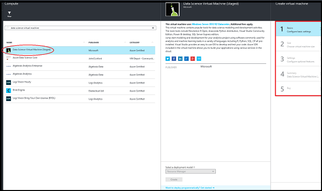

<properties 
    pageTitle="Bereitstellung von Microsoft Data Wissenschaft virtuellen Computers | Microsoft Azure" 
    description="Konfigurieren und Erstellen eines Daten Wissenschaft virtuellen Computers auf Azure Analytics und Schulung Computer." 
    services="machine-learning" 
    documentationCenter="" 
    authors="bradsev" 
    manager="jhubbard" 
    editor="cgronlun" />

<tags 
    ms.service="machine-learning" 
    ms.workload="data-services" 
    ms.tgt_pltfrm="na" 
    ms.devlang="na" 
    ms.topic="article" 
    ms.date="09/07/2016" 
    ms.author="bradsev" />

# Bereitstellung von der Microsoft Data Wissenschaft virtuellen Computern

Die Microsoft Data Wissenschaft virtuellen Computern ist Azure-virtuellen Computern (virtueller Computer) vorinstalliert und konfiguriert mit mehreren beliebte Tools, die häufig für Daten Analytics und Computer-Schulung verwendet werden. Die Tools enthalten sind:

- Microsoft R Server Developer Edition
- Anaconda Python Verteilung
- Jupyter Notizbuch (mit R Python Kernels)
- Visual Studio Community Edition
- Power BI-desktop
- SQL Server 2016 Developer Edition
- Schulung von Werkzeugmaschinen
    - [Berechnete Netzwerk-Toolkit (CNTK)](https://github.com/Microsoft/CNTK): eine tief learning Toolkit Software von Microsoft Research.
    - [Vowpal Wabbit](https://github.com/JohnLangford/vowpal_wabbit): einen schnellen Computer learning System unterstützende Techniken online, hashing, Allreduce, Reduzierung, learning2search, aktiv, und interaktive Schulung.
    - [XGBoost](https://xgboost.readthedocs.org/en/latest/): ein Tool schnell und präzise stärkere Struktur Implementierung bereitstellt.
    - [Rattle](http://rattle.togaware.com/) (der R Analytical Tool zu erfahren Sie einfach): ein Tool, das erste Schritte mit Daten Analytics und Computer in R mit Durchsuchen von Benutzeroberflächen-basierten Daten ganz einfach Lern- und modellieren mit automatischen R Code generieren herstellt.
    - [Mxnet](https://github.com/dmlc/mxnet): eine Tiefe Learning Framework für sowohl Effizienz und Flexibilität entwickelt
- R und Python für Bibliotheken in Azure maschinellen Lern- und andere Azure Services verwenden
- Git einschließlich Git Bash mit Quellcode-Repositorys einschließlich GitHub, Visual Studio Team Services entwickelt
- Windows-Ports von mehreren Populäre Linux Befehlszeile Dienstprogramme (einschließlich Awk, Sed, Perl, Grep, suchen, Wget, Curl usw.) über die Befehlszeile zugegriffen werden kann. 

Daten Wissenschaft Aktionen auf eine Abfolge von Aufgaben durchlaufen umfasst: Laden, vor der Verarbeitung und beim Suchen von Daten, erstellen und Testen Modelle und Bereitstellen der Modelle für die Ernährung in intelligenten Clientanwendungen. Daten Wissenschaftler Verwenden einer Vielzahl von Tools zum Ausführen dieser Aufgaben. Es werden ganz Weile dauern, suchen die entsprechenden Versionen der Software, und anschließendes herunterladen und installieren Sie sie. Die Microsoft Data Wissenschaft virtuellen Computern kann diese Last können, indem eine sofort einsatzbereite Bild, das bereitgestellt werden kann auf Azure mit allen mehrere beliebte Tools vorinstalliert und konfiguriert vereinfachen. 

Die Microsoft Data Wissenschaft virtuellen Computern jump-starts Projekt Analytics. Sie können für die Arbeit an Vorgängen in verschiedenen Sprachen, einschließlich R, Python, SQL und c#. Visual Studio bietet eine IDE zum Entwickeln und Testen Sie den Code, der einfach zu verwenden. Das Azure SDK enthalten, die auf dem virtuellen Computer können Sie Ihre Anwendung mit verschiedenen Dienste auf Microsoft Cloud-Plattform zu erstellen. 

Es gibt keine Software Gebühren für diese Daten Wissenschaft virtueller Computer Abbildung aus. Sie Zahlen nur für die Azure Nutzungsgebühren welche abhängig von der Größe des virtuellen Computers, die Sie bereitstellen. Weitere Details auf die Gebühren berechnen finden Sie im Abschnitt Details Preise auf der Seite [Daten Wissenschaft virtuellen Computern](https://azure.microsoft.com/marketplace/partners/microsoft-ads/standard-data-science-vm/) . 

## Erforderliche Komponenten

Bevor Sie eine Microsoft Data Wissenschaft virtuellen Computern erstellen können, müssen Sie die folgenden verfügen:

- **Ein Azure-Abonnement**: eine erhalten, finden Sie [kostenlose Testversion Azure abrufen](https://azure.microsoft.com/documentation/videos/get-azure-free-trial-for-testing-hadoop-in-hdinsight/).

*   **Ein Azure-Speicher-Konto**: um eine zu erstellen, finden Sie unter [Erstellen eines Kontos Azure-Speicher](storage-create-storage-account.md#create-a-storage-account). Alternativ kann Speicher-Konto erstellt werden, als Teil der Vorgang des Erstellens des virtuellen Computer aus, wenn Sie kein vorhandenes Konto verwenden möchten.

## Erstellen Sie Ihre Microsoft Data Wissenschaft virtuellen Computern

Hier sind die Schritte zum Erstellen einer Instanz von Microsoft Daten Wissenschaft virtuellen Computern ein:

1.  Navigieren Sie zu der virtuellen Computern auflisten [Azure](https://portal.azure.com/#create/microsoft-ads.standard-data-science-vmstandard-data-science-vm)-Portal.
2.   Wählen Sie die Schaltfläche " **Erstellen** " am unteren Rand, einen Assistenten berücksichtigt werden. 
3.   Der Assistent zum Erstellen des Microsoft Data Wissenschaft virtuellen Computers verwendet erfordert **Eingaben** für jede der **fünf Schritte** aufgelistet, die in dieser Abbildung rechts. Hier sind die Eingaben zum Konfigurieren der einzelnen Schritte erforderlich sind:
    
    1.   **Grundlagen**
        1.   **Name**: Name Ihres Daten Wissenschaft Servers, die Sie erstellen.
        2.   **Benutzername**: Administrator Konto Anmelde-Id.
        3.   **Kennwort**: Konto Administratorkennworts.
        4.   **Abonnements**: Wenn Sie mehr als ein Abonnement besitzen, wählen Sie eine Grundlage der Computer ist, erstellt und in Rechnung gestellt werden.
        5.   **Ressourcengruppe**: Sie können einen neuen erstellen oder eine vorhandene Gruppe verwenden.
        6.   **Standort**: Wählen Sie das Data Center, die am besten geeignet ist. Normalerweise ist es das Data Center, das meisten der Daten oder Ihren physischen Speicherort für die schnellste Netzwerkzugriff am nächsten ist.
         
    2.   **Größe**: Wählen Sie eine der Servertypen, die Ihre funktionsübergreifendes Anforderung und Kosten Einschränkungen entspricht. Weitere Auswahlmöglichkeiten virtueller Computer Größen erhalten Sie, indem Sie "Alle anzeigen" auswählen.
    
    3.   **Einstellungen**:
        1.   **Datenträger Type**: Wählen Sie Premium Wunsch eine State Drive (SSD), andere auswählen "Standard".
        2.   **Speicher-Konto**: Sie erstellen ein neues Azure-Speicher-Konto in Ihrem Abonnement oder verwenden eine vorhandenen am selben *Speicherort* ausgewählt wurde, die die **Grundlagen** Schritt des Assistenten können.
        3.   **Andere Parameter**: normalerweise Sie einfach die Standardwerte verwenden. Sie können auf den Link Hilfe zu den spezifischen Feldern informativen zeigen, für den Fall, dass die Verwendung von nicht-Standardwerte berücksichtigen möchten.

    4.   **Zusammenfassung**: Stellen Sie sicher, dass alle eingegebenen Informationen richtig sind.
    5.   **Kaufen**: Klicken Sie auf **kaufen** , um die Bereitstellung zu starten. Ein Link wird die Vertragsbedingungen der Transaktion bereitgestellt. Der virtuellen Computer verfügt keine zusätzlichen Gebühren jenseits der Computer für die Servergröße, die Sie in der **Größe** Schritt ausgewählt haben. 

>[AZURE.NOTE] Die Bereitstellung sollte ungefähr 10 bis 20 Minuten. Der Status der Bereitstellung wird der Azure-Portal angezeigt.

## Zugreifen auf die Microsoft Daten Wissenschaft virtuellen Computern

Nachdem Sie der virtuellen Computer erstellt wurde, können Sie Remotedesktop darin mit der Administrator den Anmeldeinformationen, die Sie im vorherigen Abschnitt **Grundlagen** konfiguriert. 

Nachdem Sie Ihre virtuellen Computer erstellt haben und nach der Bereitstellung ist, sind Sie bereit sind, verwenden die Tools, die installiert und darauf konfiguriert sind. Es gibt Start Menü Kacheln und desktop-Symbole für viele der Tools aus. 

## So erstellen Sie ein sicheres Kennwort auf dem Notizbuch-Server Jupyter 

Um Ihr eigenes sicheres Kennwort für die auf dem Computer installiert Jupyter Notizbuch-Server zu erstellen, führen Sie den folgenden Befehl auf Daten Wissenschaft virtuellen Computern über eine Befehlszeile.

    c:\anaconda\python.exe -c "import IPython;print IPython.lib.passwd()"

Wählen Sie ein sicheres Kennwort, wenn Sie dazu aufgefordert werden.

Sie finden Sie unter den Kennworthash im Format "Sha1:xxxxxx" in der Ausgabe aus. Kopieren Sie diese Kennworthash und Ersetzen Sie den vorhandenen Hash, die in Ihrem Notizbuch Config-Datei gespeichert ist: **C:\ProgramData\jupyter\jupyter_notebook_config.py** mit einem Parameter Namen ***c.NotebookApp.password***.

Ersetzen Sie nur den Teil (Xxxxxx) den vorhandenen Hashwert, der innerhalb der Anführungszeichen ist. Die Angebote und die ***sha1:*** Präfix für den Parameterwert beide beibehalten werden müssen.

Schließlich müssen Sie beenden, und starten Sie den Server Jupyter, die als Windows geplanter Task aufgerufen **Start_IPython_Notebook**des virtuellen Computers ausgeführt wird. Wenn das neue Kennwort nach dem Neustart dieser Vorgang nicht akzeptiert wird, versuchen Sie es Abbrechen von alle laufenden Python Prozessen von Task-Manager, und starten Sie den geplanten Vorgang. Versuchen Sie alternativ Neustart des virtuellen Computers.

## Klicken Sie auf der Microsoft Data Wissenschaft virtuellen Computern installierten Tools

### Microsoft R Server Developer Edition
Wenn Sie für Ihre Analytics R verwenden möchten, hat der virtuellen Computer Microsoft R Server Developer Edition installiert. Microsoft R Server ist eine gestreut bereitzustellenden Enterprise-Klasse Analytics-Plattform basierend auf R, die unterstützt wird, skalierbar und sicher. Unterstützung von einer Vielzahl von big Data-Statistiken, Vorhersage Modellierung und Computer Erlernen von Funktionen, unterstützt R Server sämtliche Analytics – datenauswertung, Visualisierung, Analyse und Modellierung. Durch verwenden, und erweitern Quelle R öffnen, ist Microsoft R Server vollständig mit R Skripts, Funktionen und CRAN Paketen, zum Analysieren von Daten bei Enterprise kompatibel. Es wird außerdem die Einschränkungen im Speicher der geöffneten Quelle R durch Hinzufügen von parallele und aufgeteilte Verarbeitung von Daten erläutert. Dadurch können Sie zum Ausführen von Analytics Daten kaum größer als was im Hauptfenster Arbeitsspeicher passt.  Visual Studio Community Edition im Lieferumfang des virtuellen Computers enthält die R Tools für Visual Studio-Erweiterung, die eine vollständige enthält für die Arbeit mit R. Sie können auch herunterladen und andere IDEs ebenso wie [RStudio](http://www.rstudio.com)verwenden. 

### Python
Für die Entwicklung mithilfe von Python wurde Anaconda Python Verteilung 2.7 und 3.5 installiert. Diese Verteilung enthält die Basis Python zusammen mit etwa 300 der am häufigsten verwendeten Mathematik, technisch und Daten Analytics-Pakete. Sie können Python Tools für Visual Studio (PTVS) verwenden, die innerhalb der Visual Studio 2015 Community Edition oder eine von der IDEs gebündelten mit Anaconda wie Leerlauf oder Spyder installiert ist. Sie können eine der folgenden durch Suchen auf der Suchleiste starten (**gewonnen** + **S** -Taste).

>[AZURE.NOTE] Die Python-Tools für Visual Studio am Anaconda Python 2.7 und 3.5 verknüpft, müssen Sie benutzerdefinierte Umgebungen für jede Version zu erstellen. Navigieren Sie zum Festlegen dieser Umgebung Pfade in Visual Studio 2015 Community Edition **Tools** -> **Python Tools** -> **Python-Umgebungen** , und klicken Sie dann auf **+ Benutzerdefiniert**. 

Anaconda Python 2.7 unter C:\Anaconda installiert ist, und klicken Sie unter c:\Anaconda\envs\py35 Anaconda Python 3.5 installiert ist. Die detaillierten Schritte finden Sie in der [Dokumentation von PTVS](https://github.com/Microsoft/PTVS/wiki/Selecting-and-Installing-Python-Interpreters#hey-i-already-have-an-interpreter-on-my-machine-but-ptvs-doesnt-seem-to-know-about-it) . 

### Jupyter Notizbuch
Anaconda Verteilung verfügt außerdem über ein Notizbuch Jupyter, einer Umgebung Code und Analyse freigeben. Ein Notizbuch-Server Jupyter wurde mit Python 2, 3 Python und R Kernels vorab konfiguriert. Es wird ein Desktopsymbol mit dem Namen "Jupyter Notizbuch So starten Sie den Browser, um den Server Notizbuch zugreifen. Wenn Sie des virtuellen Computers über remote Desktop sind, können Sie auch besuchen [Https://localhost:9999 /](https://localhost:9999/) Zugriff auf den Jupyter Notizbuch-Server Wenn für den virtuellen Computer angemeldet.
 
>[AZURE.NOTE] Fahren Sie, wenn Sie alle Warnungen Zertifikat erhalten. 

Wir haben Stichprobe Notizbücher in Python und r verpackt. Die Jupyter Notizbücher anzeigen zum Arbeiten mit Microsoft R Server, SQL Server 2016 R Services (In der Datenbank Analytics), Python und andere Technologien Azure, nachdem Sie sich bei Jupyter anmelden. Sie können den Link zu den Beispielen auf der Startseite Notizbuch anzeigen, nach der Authentifizierung zum Notizbuch Jupyter verwenden das Kennwort ein, die, das Sie in einem vorherigen Schritt erstellt haben. 

### Visual Studio 2015 Community edition
Visual Studio-Community Edition des virtuellen Computers installiert. Es ist eine kostenlose Version der beliebte IDE von Microsoft, das Sie Testzwecken und für kleine Teams verwenden können. Sie können die zur Lizenzierung Begriffe Auschecken [hier](https://www.visualstudio.com/support/legal/mt171547).  Öffnen Sie Visual Studio, doppelklicken Sie auf das Desktopsymbol oder im Menü **Start** . Sie können auch für Programme mit **gewonnen**suchen + **S** und "Visual Studio" eingeben. Nachdem es Sie Projekte in Sprachen wie c#, Python, R, node.js erstellen können. -Plug-Ins sind auch installiert, die für die Arbeit mit Azure-Diensten wie Azure Datenkatalog, Azure HDInsight (Hadoop, Spark) und Azure Daten Lake vereinfachen. 

>[AZURE.NOTE] Sie können eine Meldung, dass Ihre Bewertung Ablauf erhalten. Geben Sie Ihre Anmeldeinformationen ein Microsoft-Konto, oder erstellen Sie ein neues kostenloses Konto zum Zugriff auf Visual Studio Community Edition zu erhalten. 

### SQL Server 2016 Developer edition
Eine Entwicklertools-Version von SQL Server 2016 mit den Diensten von R Analytics in der Datenbank ausgeführt werden des virtuellen Computers bereitgestellt. R Services bieten eine Plattform für das Entwickeln und Bereitstellen von intelligenten Applications. Sie können die umfassende und leistungsfähige R Sprache und die viele Pakete aus der Community Modelle erstellen und generieren Vorhersagen für die SQL Server-Daten verwenden. Sie können Analytics Nähe der Daten beibehalten, da R Services (In der Datenbank) die Sprache R mit SQL Server integrieren. Dadurch werden die Kosten und Sicherheit Risiken im Zusammenhang mit dem Verschieben von Daten.

>[AZURE.NOTE] Die SQL Server 2016 Developer Edition kann nur für die Entwicklung und Testzwecken verwendet werden. Sie benötigen eine Lizenz für die Ausführung in der Herstellung. 

Sie können den SQLServer durch Starten von **SQL Server Management Studio**zugreifen. Der Name des virtuellen Computers wird als Servernamen aufgefüllt. Verwenden Sie die Windows-Authentifizierung, wenn Sie als Windows-Administrator angemeldet sind. Nachdem Sie in SQL Server Management Studio befinden können Sie andere Benutzer erstellen, Datenbanken erstellen, Importieren von Daten und Ausführen von SQL-Abfragen. 

Wenn In der Datenbank Analytics mithilfe von Microsoft R aktivieren möchten, führen Sie den folgenden Befehl als eine Uhrzeit Aktion in SQL Server Management Studio nach der Anmeldung als Administrator des Servers. 

        CREATE LOGIN [%COMPUTERNAME%\SQLRUserGroup] FROM WINDOWS 
        
        (Please replace the %COMPUTERNAME% with your VM name)

### Azure 
Mehrere Azure Tools werden auf dem virtuellen Computer installiert:

- Es gibt eine desktop-Verknüpfung auf die Azure SDK-Dokumentation zugreifen. 
- **AzCopy**: zum Verschieben von Daten in und aus Ihrem Microsoft Azure-Speicher-Konto verwendet. Verwendung, geben Sie **Azcopy** über die Befehlszeile zu der Verwendung finden Sie unter anzeigen zu können. 
- **Microsoft Azure-Speicher-Explorer**: verwendet, um durch die Objekte zu navigieren, die den Azure-Speicher-Konto und durchstellen Daten an und von Azure Storage gespeichert sind. Geben Sie im Feld Suche **Speicher-Explorer** oder finden sie im Startmenü von Windows auf dieses Tool zugreifen können. 
- **Adlcopy**: zum Verschieben von Daten zu Azure Daten Lake verwendet. Geben Sie **Adlcopy** Verwendung finden Sie in einem Eingabeaufforderungsfenster. 
- **Dtui**: zum Verschieben von Daten an und von Azure DocumentDB, einer Datenbank NoSQL in der Cloud verwendet. Geben Sie auf Eingabeaufforderung **Dtui** ein. 
- **Microsoft-Datenverwaltungsgateway**: Verschieben von Daten zwischen lokalen Datenquellen und Cloud ermöglicht. Es wird innerhalb von Tools wie Azure Data Factory verwendet. 
- **Microsoft Azure Powershell**: eines Tools zur Verwaltung von Ressourcen in der Powershell Azure scripting-Sprache auch auf Ihre virtuellen Computer installiert ist. 

###Power BI

Damit Sie Dashboards und großartige Visualisierungen erstellen können, wurde die **Power BI-Desktop** installiert. Verwenden Sie dieses Tool zum Abrufen von Daten aus verschiedenen Quellen, Ihre Dashboards und Berichte zu erstellen und diese in der Cloud veröffentlichen. Informationen finden Sie unter der [Power BI](http://powerbi.microsoft.com) -Website. Power BI-Desktop finden Sie im Menü Start. 

>[AZURE.NOTE] Sie benötigen eine Power BI Zugriff auf Office 365-Konto. 

## Weitere Microsoft Development tools
Die [**Microsoft Web Platform Installer**](https://www.microsoft.com/web/downloads/platform.aspx) kann zu ermitteln, und Laden Sie andere Microsoft Development Tools verwendet werden. Es gibt auch eine Verknüpfung zu das Tool auf dem Desktop Microsoft Daten Wissenschaft virtuellen Computern bereitgestellt.  

## Wichtige Verzeichnisse des virtuellen Computers

| Element                          | Verzeichnis |
| ------------------------------| ---------------- |
|Jupyter Notizbuch Serverkonfigurationen | C:\ProgramData\jupyter |
|Jupyter Notizbuch Beispiele home-Verzeichnis| c:\dsvm\notebooks|
|Andere Beispiele | c:\dsvm\samples|
| Anaconda (Standard: Python 2.7) | c:\Anaconda |
| Anaconda Python 3.5-Umgebung | c:\Anaconda\envs\py35|
|R Server eigenständigen Instanzverzeichnis (R Standard Instanz) | C:\Programme\Microsoft c:\Programme\Microsoft SQL Server\130\R_SERVER |
| R-Server In der Datenbank-Instanz-Verzeichnis | C:\Programme\Microsoft c:\Programme\Microsoft SQL Server\MSSQL13. MSSQLSERVER\R_SERVICES |
| Verschiedene tools | c:\dsvm\tools|

>[AZURE.NOTE] Instanzen von der Microsoft Data Wissenschaft virtuellen Computern vor dem 1.5.0 (vor 3 September 2016) erstellt eine Struktur etwas anderes Verzeichnis verwendet, als in der obigen Tabelle angegeben. 

## Nächste Schritte
Hier sind einige weitere Schritte weiterhin Ihre Lern- und damit arbeiten. 

* Erforschen von den verschiedenen Wissenschaft Datentools der Daten Wissenschaft virtuellen Computer durch Klicken auf das Startmenü und das Auschecken die Tools im Menü aufgelistet.
* Navigieren Sie zu **C:\Programme c:\Programme\Microsoft SQL Server\130\R_SERVER\library\RevoScaleR\demoScripts** , für die Beispiele mithilfe der Bibliothek RevoScaleR in R, die die Daten Analytics bei Enterprise unterstützt.  
* Lesen Sie den Artikel: [10 Dinge, die Sie über die Daten Wissenschaft virtuellen Computern ausführen können](http://aka.ms/dsvmtenthings)
* Informationen Sie zum Ende zum analytical Lösungen systematisch mit dem [Team Daten Wissenschaft Prozess](https://azure.microsoft.com/documentation/learning-paths/data-science-process/)erstellen.
* Finden Sie auf der [Cortana Intelligence Katalog](http://gallery.cortanaintelligence.com) für maschinelle Lern- und Daten Analytics Beispiele, in denen die Cortana Intelligence-Suite verwenden. Wir haben ein Symbol auch im Menü **Start** , und klicken Sie auf dem Desktop des virtuellen Computers zu diesem Katalog bereitgestellt.

