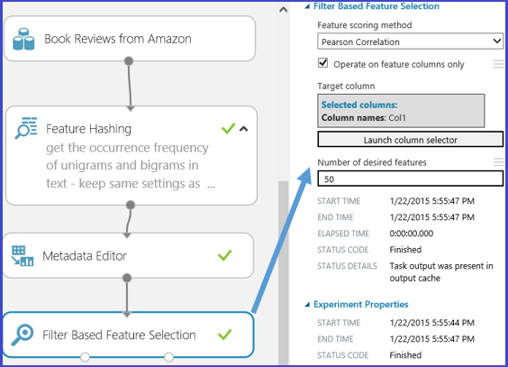

<properties
    pageTitle="Auswahl im Team Daten Wissenschaft Prozess bereitstellen | Microsoft Azure" 
    description="Erläutert den Zweck der Featureauswahl und enthält Beispiele für ihre Rolle im Prozess Daten Verbesserung der Computer Schulung."
    services="machine-learning"
    documentationCenter=""
    authors="bradsev"
    manager="jhubbard"
    editor="cgronlun"/>

<tags
    ms.service="machine-learning"
    ms.workload="data-services"
    ms.tgt_pltfrm="na"
    ms.devlang="na"
    ms.topic="article"
    ms.date="09/19/2016"
    ms.author="zhangya;bradsev" />

# Featureauswahl in Team Daten Wissenschaft Prozess (TDSP)

In diesem Artikel wird erläutert, die Zwecke Featureauswahl und enthält Beispiele für seine Rolle beim Verbesserung von Daten von maschinellen Schulung. In diesen Beispielen werden aus Azure maschinellen Learning Studio gezeichnet. 

[AZURE.INCLUDE [machine-learning-free-trial](../../includes/machine-learning-free-trial.md)]

In diesem Thema erläutert den Zweck der Featureauswahl und enthält Beispiele für seine Rolle beim Verbesserung von Daten von maschinellen Schulung. In diesen Beispielen werden aus Azure maschinellen Learning Studio gezeichnet. 

Die technisch und die Auswahl der Features ist ein Teil der TDSP beschrieben, die der [Neuigkeiten Team von Daten Wissenschaft?](data-science-process-overview.md). Feature technisch und Auswahl sind Teile der **Entwicklung Features** Schritt von der TDSP.

* **Feature technisch**: Dieses Verfahren versucht, relevante Zusatzfunktionen aus den vorhandenen unformatierten Features in die Daten zu erstellen und zum Erhöhen des Learning-Algorithmus Vorhersage Power.

* **Featureauswahl**: Dieses Verfahren markiert die wichtige Teilmenge der ursprünglichen Datenfeatures in dem Versuch, die Anzahl der Dimensionen des Problems Schulung zu verringern.

Normalerweise **technisch Feature** zuerst um zusätzliche Features generieren angewendet wird, und klicken Sie dann der **Featureauswahl** Schritt ausgeführt wird, um nicht relevant, redundante oder hochgradig korrelierte Features zu entfernen.

## Filterfunktionen aus den Daten - Featureauswahl 

Featureauswahl umfasst, die für die Erstellung der Schulung Datasets für Vorhersage Modellierungsaufgaben wie Klassifizierung oder Regression Aufgaben im Allgemeinen angewendet wird. Das Ziel ist eine Teilmenge der Features aus dem ursprünglichen Dataset, die die Proportionen zu reduzieren, indem Sie mit einem minimalen Satz von Features zum Darstellen der maximal Varianz in den Daten auswählen. Diese Teilmenge der Features sind, klicken Sie dann die nur Funktionen, die zum Modell Schulen aufgenommen werden. Featureauswahl dient zwei Hauptfunktionen.

* Zunächst Featureauswahl erhöht sich häufig Klassifizierung Genauigkeit durch Vermeidung nicht relevant, redundante oder hochgradig Features in Beziehung gesetzt.
* Zweites, wird es die Anzahl der Features, die wodurch Modell Schulungsprozess effizienter wird verringert. Dies ist besonders wichtig für den Teilnehmern, die zum Schulen von wie Support Vektor Computern teure sind.

Obwohl Featureauswahl zum Verringern der Anzahl von Funktionen im Dataset verwendet, um das Modell Schulen Zielwertsuche, wird er nicht in der Regel durch den Begriff "Verringerung der Anzahl der Dimensionen" bezeichnet. Feature Auswahlmethoden extrahieren eine Teilmenge der ursprünglichen Features in den Daten, ohne sie zu ändern.  Anzahl der Dimensionen Verringerung Methoden einsetzen Engineering Features, die die ursprüngliche Features transformieren und ändern, sodass diese können. Anzahl der Dimensionen Verringerung Methoden zählen Analyse der Tilgungsanteile, kanonische Korrelationskoeffizienten Analyse und im Singular Wert Gliederung.

Unter anderem wird eine stark angewendete Kategorie von Features Auswahlmethoden in einem Kontext Kontrolle "Featureauswahl basierenden Filter" bezeichnet. Diese Methoden anwenden durch Auswerten der Beziehung zwischen jede Funktion und die Zielattribut, ein Measure statistische, um eine Bewertung für jede Funktion zuzuweisen. Die Features werden dann von der Punktzahl eingestuft, die verwendet werden können, legen Sie den Schwellenwert für beibehalten oder ein bestimmtes Feature Beseitigung helfen. In diesen Methoden verwendeten statistischen Maßnahmen zählen Person Korrelationskoeffizienten, gemeinsamen Informationen und die Teststatistik eines Chi quadratischen.

In Azure maschinellen Learning Studio es gibt Featureauswahl vorgesehenen Module. Wie in der folgenden Abbildung gezeigt wird, wird diese Module umfassen [Featureauswahl Filter-basierten] [ filter-based-feature-selection] und [Fisher linearen kombiniert werden sollen Analyse][fisher-linear-discriminant-analysis].

Betrachten Sie beispielsweise die Verwendung der [Filter-basierten Featureauswahl] [ filter-based-feature-selection] Modul. Im Sinne Komfort weiterhin wir das oben beschriebene Text Mining Beispiel verwenden. Angenommen, wir möchten ein Regressionsmodell zu erstellen, nachdem Sie eine Reihe von 256 Features werden durch das [Feature Hashing] erstellt[ feature-hashing] Modul und, dass die Antwort Variable ist die 'SP1' und einem Buch Bewertungen Zahl von 1 bis 5 zu überprüfen. Durch Festlegen "Feature Punktzahl Methode" werden "Pearsonschen Korrelationskoeffizienten", "Zielspalte" 'SP1' und die "Anzahl der gewünschten Features" auf 50 sein. Klicken Sie dann das Modul [Featureauswahl Filter-basierten] [ filter-based-feature-selection] erzeugt ein Dataset mit 50 Features zusammen mit der Zielattribut "SP1". Die folgende Abbildung zeigt den Fluss von diesem Versuch und die Eingabeparameter, die gerade beschriebenen.

Die folgende Abbildung zeigt die resultierende Datasets. Jedes Feature wird basierend auf den Pearsonschen Korrelationskoeffizienten zwischen sich selbst und das Zielattribut 'SP1' bewertet. Die Features mit verwendete Faktoren bleiben.

Die entsprechenden Faktoren der ausgewählten Features werden in der folgenden Abbildung dargestellt.

Durch Anwenden dieser [Featureauswahl Filter-basierten] [ filter-based-feature-selection] Modul 50 abwesend 256 Features sind ausgewählt, da sie die am häufigsten korrelierte Features, ohne die Zielvariable 'SP1', auf Basis der Punktzahl Methode "Pearsonschen Korrelationskoeffizienten".

## Abschluss
Feature technisch und Featureauswahl sind zwei häufig Engineering und ausgewählten Features zu steigern der Effizienz des Schulungsprozesses der Versuche, die wichtige Informationen extrahieren in die Daten enthalten. Sie verbessern auch die Potenz dieser Modelle für die Eingabedaten exakte Klassifizierung und Aufgabenergebnisse relevante stabiler Vorhersagen. Feature technisch und Auswahl können auch kombinieren, um die Website zum Kennenlernen vom vermitteln machen. Dies geschieht nach verbessern, und klicken Sie dann Verringern der Anzahl von Features zum Kalibrieren oder Schulen eines Modells erforderlich sind. Mathematisch sprechen, sind die Features ausgewählt, um das Modell Schulen eine minimale Anzahl von unabhängigen Variablen, die erläutert, die Muster in den Daten und dann Aufgabenergebnisse erfolgreich Vorhersagen.

Beachten Sie, dass es nicht immer unbedingt technisch oder Feature Featureauswahl ausführen. Oder nicht erforderlich ist, hängt davon ab der Daten, die wir haben oder sammeln, den Algorithmus, den wir wählen und die Zielsetzung der experimentieren.

<!-- Module References -->
[feature-hashing]: https://msdn.microsoft.com/library/azure/c9a82660-2d9c-411d-8122-4d9e0b3ce92a/
[filter-based-feature-selection]: https://msdn.microsoft.com/library/azure/918b356b-045c-412b-aa12-94a1d2dad90f/
[fisher-linear-discriminant-analysis]: https://msdn.microsoft.com/library/azure/dcaab0b2-59ca-4bec-bb66-79fd23540080/
 
