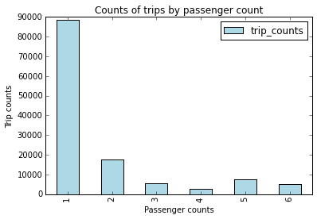
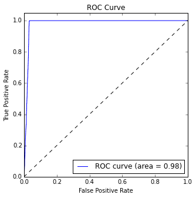

<properties
    pageTitle="Durchsuchen von Daten und Modellierung mit Spark erweiterte | Microsoft Azure"
    description="Verwenden Sie HDInsight Spark Durchsuchen von Daten und Schulen binäre Klassifizierung und Regression Modelle übergreifende Überprüfung und Hyperparameter Optimierung verwenden."
    services="machine-learning"
    documentationCenter=""
    authors="bradsev"
    manager="jhubbard"
    editor="cgronlun"  />

<tags
    ms.service="machine-learning"
    ms.workload="data-services"
    ms.tgt_pltfrm="na"
    ms.devlang="na"
    ms.topic="article"
    ms.date="10/07/2016"
    ms.author="deguhath;bradsev;gokuma" />

# Erweitertes Durchsuchen von Daten und Modellierung mit Spark 

[AZURE.INCLUDE [machine-learning-spark-modeling](../../includes/machine-learning-spark-modeling.md)]

Diese exemplarische Vorgehensweise verwendet HDInsight Spark Durchsuchen von Daten und Schulen binäre Klassifizierung und Regression Modelle mit übergreifende Überprüfung und Hyperparameter Optimierung von einer Stichprobe von der NYC taxi Geschäftsreise und Ergebnisse so ausfallen 2013 Dataset. Es führt Sie durch die Schritte des [Daten Wissenschaft Prozess](http://aka.ms/datascienceprocess), End-to-End mithilfe einer HDInsight Spark cluster, für die Verarbeitung und Azure-blobs zum Speichern der Daten sowie die Modelle. Der Prozess untersucht und Visualisierung von Daten aus einer Azure-Blob-Speicher einfügen und erstellt daraus Daten Vorhersage Modelle zu erstellen. Python wurde die Lösung Fehlercode und anzeigen die relevanten Flächen verwendet. Diese Modelle sind, erstellen Sie mithilfe des Toolkits Spark MLlib binäre Klassifizierung und Regression Modellierungsaufgaben ausführen. 

- Die Aufgabe **binäre Klassifizierung** ist Vorhersagen, und zwar unabhängig davon, ob ein Tipp für die Reise bezahlt wird. 
- Die Aufgabe **Regression** ist die Menge der QuickInfo-basierend auf andere Features Tipp Vorhersagen. 

Die Schritte Modellierung enthalten auch so Schulen, ausgewertet werden soll, und speichern Sie die einzelnen Typ des Modells mit Code. Das Thema werden einige der gleichen Grund wie das [Durchsuchen von Daten und Modellierung mit Spark](machine-learning-data-science-spark-data-exploration-modeling.md) Thema behandelt. Aber es ist "komplexer" dieses auch übergreifende Überprüfung in Verbindung mit Hyperparameter ziehen, um optimal genau Klassifizierung und Regression Modelle Schulen verwendet. 

**Übergreifende Überprüfung (KA)** ist ein Verfahren, das ein Modells gelernt auf einen bekannten Satz von Daten wie gut verallgemeinert, um die Features von Datasets, an denen sie nicht trainierte, Vorhersage bewertet. Die allgemeine Idee diese Methode ist, dass ein Modell auf ein Dataset von bekannten Daten auf angewiesen ist, und klicken Sie dann die Genauigkeit der zugehörigen Vorhersagen anhand einer unabhängigen Dataset getestet ist. Eine gemeinsame Implementierung verwendet hier ist ein Dataset in K Falten unterteilt, und klicken Sie dann auf alle bis auf einen der Falten einer Roundrobin Modell Schulen. 

**Optimierung der Hyperparameter** ist das Problem Wahl eine Reihe von Hyperparameters für einen Algorithmus Learning normalerweise mit dem Ziel ein Maß für den Algorithmus der Leistung von einer unabhängigen Datenmenge optimieren. **Hyperparameters** sind Werte, die außerhalb der Prozedur Modell Schulung angegeben werden müssen. Annahmen zu diesen Werten können es sich um die Flexibilität und die Genauigkeit der Modelle auswirken. Entscheidungsbäume haben Hyperparameters, beispielsweise, wie die gewünschte Tiefe und die Anzahl der Blätter in der Struktur. Support Vektor Autos (SVMs) erfordern Begriff Abzug Einreihungsfehler festlegen. 

Ein gängiges Verfahren zum Ausführen Hyperparameter Optimierung verwendet hier ist eine Suche Raster oder eines **Parameters Zug**. Dies umfasst das Durchführen einer umfassenden Suche durch die Werte einer angegebenen Teilmenge von der Hyperparameter Platz für eine Schulung Algorithmus. Cross Validierung kann eine Leistungsmetrik zu sortieren, die optimale Ergebnisse vom Raster Suche Algorithmus gefertigt angeben. KA verwendet mit Hyperparameter durchgehende hilft Grenzwert Probleme wie overfitting eines Modells mit Schulungsdaten aus, damit das Modell behält die Kapazität Zuweisen der allgemeinen Satz von Daten aus dem die Schulungsdaten extrahiert wurde.

Die Modelle, die wir verwenden gehören logistische und lineare Regression, zufällige Gesamtstrukturen und Farbverlauf stärkere Bäume:

- [Lineare Regression mit SGD](https://spark.apache.org/docs/latest/api/python/pyspark.mllib.html#pyspark.mllib.regression.LinearRegressionWithSGD) ist eine lineare Regression-Modell, das eine Methode Stochastic Farbverlauf Unterlänge (SGD) verwendet, und für die Optimierung und Features skalieren, um die Beträge Tipp Vorhersagen gezahlt. 
- [Logistische Regression mit LBFGS](https://spark.apache.org/docs/latest/api/python/pyspark.mllib.html#pyspark.mllib.classification.LogisticRegressionWithLBFGS) oder "Logit" Regression ist ein Regressionsmodell, das verwendet werden kann, wenn die abhängige Variable kategorisierten Klassifizierung von Daten zu tun ist. LBFGS ist einer fiktiven Müller Optimierungsalgorithmus, die eine begrenzte Speichermenge Computer mit Algorithmus Broyden – Fletcher – Goldfarb – Shanno (BFGS) ist ein Näherungswert und stark Computer interessante verwendet wird.
- [Verteilte Gesamtstrukturen](http://spark.apache.org/docs/latest/mllib-ensembles.html#Random-Forests) sind Anzüge der Entscheidungsstruktur an.  Diese kombinieren viele Entscheidungsbäume, um das Risiko von Overfitting zu verringern. Zufallszahl Gesamtstrukturen für die Regression und Klassifizierung verwendet werden können behandeln kategorisierten Features und erweitert werden können, um die Einstellung multiclass Klassifizierung. Featureskalierung nicht erforderlich, und können Nichtlinearität erfassen und Interaktionen bereitstellen. Zufallszahl Gesamtstrukturen sind eine des Computers die meisten erfolgreichen learning Modelle für die Einstufung und Regression.
- [Farbverlauf verstärkt Strukturen](http://spark.apache.org/docs/latest/ml-classification-regression.html#gradient-boosted-trees-gbts) (GBTs) sind Anzüge der Entscheidungsstruktur an. GBTs Schulen Entscheidungsstruktur wiederholt auf eine Funktion Verlust zu minimieren. GBTs für die Regression und Klassifizierung verwendet werden können kategorisierte Features behandelt, Featureskalierung nicht erforderlich und können Nichtlinearität erfassen und Interaktionen bereitstellen. Sie können auch eine Einstellung Multiclass-Klassifizierung verwendet werden.

Beispiele für die Verwendung von KA und Hyperparameter Modeling Zug für werden angezeigt, das Problem binäre Klassifizierung. Einfachere Beispiele werden (ohne Parameter zieht) im Hauptfenster Thema für Vorgänge Regression dargestellt. Aber in der Anlage, flexible Netz für lineare Regression und KA verwenden, mit der Verwendung von Parameter Zug für zufällige Gesamtstruktur Regression Validierung werden ebenfalls dargestellt. **Flexible Netz** ist eine regularized Regression Methode für lineare Regression Modelle auszuwählen, die die Metrik L1 und L2 linear Sanktionen der [Lasso](https://en.wikipedia.org/wiki/Lasso%20%28statistics%29) und [3D-Linie](https://en.wikipedia.org/wiki/Tikhonov_regularization) Methoden kombiniert.   

>[AZURE.NOTE] Obwohl das Spark MLlib Toolkit für die Arbeit mit großen Datasets ausgelegt ist, wird ein relativ kurzes Beispiel (~ 30 Mb mit 170 K Zeilen, etwa 0,1 % des ursprünglichen NYC Dataset) hier zur Vereinfachung verwendet. Die hier angegebene Übung führt effizient (in etwa 10 Minuten) auf einem HDInsight Cluster mit 2 Worker-Knoten. Der gleiche Code, mit geringfügigen Änderungen, kann größere Datasets mit entsprechenden Änderungen für Zwischenspeichern von Daten im Speicher, und ändern die Größe der Zuordnungseinheiten Verarbeitungszeit verwendet werden.

## Erforderliche Komponenten

Sie benötigen ein Azure-Konto und einem HDInsight Spark Sie müssen eine HDInsight 3.4 Spark 1.6 Cluster diese exemplarische Vorgehensweise. Finden Sie die [Übersicht der Daten Wissenschaft Spark auf Azure HDInsight mit](machine-learning-data-science-spark-overview.md) Anweisungen zum erfüllen diese Anforderungen an. Dieses Thema enthält auch eine Beschreibung der hier verwendete NYC 2013 Taxi-Daten und Anweisungen zum Ausführen von Code aus einem Notizbuch Jupyter im Cluster Spark. Das **pySpark-machine-learning-data-science-spark-advanced-data-exploration-modeling.ipynb** Notizbuch, das die Codebeispielen in diesem Thema enthält steht in [Github](https://github.com/Azure/Azure-MachineLearning-DataScience/tree/master/Misc/Spark/pySpark).

[AZURE.INCLUDE [delete-cluster-warning](../../includes/hdinsight-delete-cluster-warning.md)]

## Setup: Speicherpositionen, Bibliotheken und der voreingestellten Spark Kontext

Spark kann Lese- und Schreibzugriff auf Azure-Speicher Blob (auch bekannt als WASB). Damit Ihre vorhandene Daten gespeichert können es mithilfe von Spark und die Ergebnisse erneut in WASB gespeicherten verarbeitet werden.

Um Modelle oder Dateien in WASB zu speichern, muss der Pfad ordnungsgemäß angegeben werden muss. Der standardmäßige Container angefügter Spark Cluster kann mit einem Pfad, beginnend mit verwiesen werden: "Wasb: / / /". Anderen Speicherorten optimiert "Wasb: / /".

### Festlegen von Verzeichnispfade für Speicherorte in WASB

Im folgenden Beispiel gibt den Speicherort der zu lesenden Daten und den Pfad für das Modell Speicherverzeichnis, in dem die Ausgabe Modell gespeichert werden:

    # SET PATHS TO FILE LOCATIONS: DATA AND MODEL STORAGE

    # LOCATION OF TRAINING DATA
    taxi_train_file_loc = "wasb://mllibwalkthroughs@cdspsparksamples.blob.core.windows.net/Data/NYCTaxi/JoinedTaxiTripFare.Point1Pct.Train.tsv";

    
    # SET THE MODEL STORAGE DIRECTORY PATH 
    # NOTE THAT THE FINAL BACKSLASH IN THE PATH IS NEEDED.
    modelDir = "wasb:///user/remoteuser/NYCTaxi/Models/";

    # PRINT START TIME
    import datetime
    datetime.datetime.now()

**DIE AUSGABE**

DateTime.DateTime (2016, 4, 18, 17, 36, 27, 832799)

### Importieren von Bibliotheken

Importieren Sie erforderlichen Bibliotheken mit den folgenden Code ein:

    # LOAD PYSPARK LIBRARIES
    import pyspark
    from pyspark import SparkConf
    from pyspark import SparkContext
    from pyspark.sql import SQLContext
    import matplotlib
    import matplotlib.pyplot as plt
    from pyspark.sql import Row
    from pyspark.sql.functions import UserDefinedFunction
    from pyspark.sql.types import *
    import atexit
    from numpy import array
    import numpy as np
    import datetime
    

### Voreingestellte Spark Kontext bereitstellen und PySpark magics

Die PySpark Kernels, die mit Jupyter-Notizbüchern bereitgestellt werden müssen einen vordefinierten Kontext. Damit Sie müssen nicht das Spark festlegen oder Struktur Kontexten explizit, bevor Sie mit der Arbeit mit der Anwendung entwickeln. Diese Kontexte sind standardmäßig für Sie verfügbar. Diese Kontexte sind:

- SC – für Spark 
- zur SqlContext - für Struktur

PySpark Kernel enthält einige vordefinierte "magics", welche sind spezielle Befehle, die Sie mit aufrufen können %. Es gibt zwei solche Befehle, die in den folgenden Codebeispielen verwendet werden.

- **% lokale** Gibt an, dass der Code in nachfolgenden Zeilen lokal ausgeführt werden. Code muss gültigen Python-Code sein.
- **%%sql -o <variable name>** Führt eine Abfrage Struktur gegen die SqlContext. Wenn der Parameter -o übergeben wird, ist das Ergebnis der Abfrage im beibehalten der % lokalen Python Kontext als eine Pandas DataFrame.
 

Für Weitere Informationen zu den Kernels für Jupyter Notizbüchern und den vordefinierten ", die magics" diese bereitgestellt wird, finden Sie unter [Kernels für Jupyter Notizbücher mit HDInsight Spark Linux Cluster auf HDInsight verfügbar](../hdinsight/hdinsight-apache-spark-jupyter-notebook-kernels.md).

## Aufnahme der Daten aus öffentlichen Blob: 

Dieser erste Schritt im Prozess Wissenschaft Daten ist zum Einlesen von Daten aus Quellen analysiert werden, wo sie sich in das Durchsuchen von Daten und größerem Funktionsumfang befindet. Diese Umgebung stellt Spark in dieser Anleitung erfahren. Dieser Abschnitt enthält den Code, um eine Reihe von Aufgaben ausführen:

- Das folgende Datenbeispiel entworfen werden Aufnahme
- Lesen Sie in der Eingabe-Dataset (gespeichert als TSV-Datei)
- Formatieren und die Daten bereinigen
- Erstellen und Objekte (RDDs oder Daten-Rahmen) im Speicher Zwischenspeichern
- Registrieren Sie es als Temp-Tabelle in der SQL-Kontext aus.

So sieht der Code für die Erfassung von Daten aus.

    # RECORD START TIME
    timestart = datetime.datetime.now()
    
    # IMPORT FILE FROM PUBLIC BLOB
    taxi_train_file = sc.textFile(taxi_train_file_loc)
    
    # GET SCHEMA OF THE FILE FROM HEADER
    schema_string = taxi_train_file.first()
    fields = [StructField(field_name, StringType(), True) for field_name in schema_string.split('\t')]
    fields[7].dataType = IntegerType() #Pickup hour
    fields[8].dataType = IntegerType() # Pickup week
    fields[9].dataType = IntegerType() # Weekday
    fields[10].dataType = IntegerType() # Passenger count
    fields[11].dataType = FloatType() # Trip time in secs
    fields[12].dataType = FloatType() # Trip distance
    fields[19].dataType = FloatType() # Fare amount
    fields[20].dataType = FloatType() # Surcharge
    fields[21].dataType = FloatType() # Mta_tax
    fields[22].dataType = FloatType() # Tip amount
    fields[23].dataType = FloatType() # Tolls amount
    fields[24].dataType = FloatType() # Total amount
    fields[25].dataType = IntegerType() # Tipped or not
    fields[26].dataType = IntegerType() # Tip class
    taxi_schema = StructType(fields)
    
    # PARSE FIELDS AND CONVERT DATA TYPE FOR SOME FIELDS
    taxi_header = taxi_train_file.filter(lambda l: "medallion" in l)
    taxi_temp = taxi_train_file.subtract(taxi_header).map(lambda k: k.split("\t"))\
            .map(lambda p: (p[0],p[1],p[2],p[3],p[4],p[5],p[6],int(p[7]),int(p[8]),int(p[9]),int(p[10]),
                            float(p[11]),float(p[12]),p[13],p[14],p[15],p[16],p[17],p[18],float(p[19]),
                            float(p[20]),float(p[21]),float(p[22]),float(p[23]),float(p[24]),int(p[25]),int(p[26])))
    
        
    # CREATE DATA FRAME
    taxi_train_df = sqlContext.createDataFrame(taxi_temp, taxi_schema)
    
    # CREATE A CLEANED DATA-FRAME BY DROPPING SOME UN-NECESSARY COLUMNS & FILTERING FOR UNDESIRED VALUES OR OUTLIERS
    taxi_df_train_cleaned = taxi_train_df.drop('medallion').drop('hack_license').drop('store_and_fwd_flag').drop('pickup_datetime')\
        .drop('dropoff_datetime').drop('pickup_longitude').drop('pickup_latitude').drop('dropoff_latitude')\
        .drop('dropoff_longitude').drop('tip_class').drop('total_amount').drop('tolls_amount').drop('mta_tax')\
        .drop('direct_distance').drop('surcharge')\
        .filter("passenger_count > 0 and passenger_count < 8 AND payment_type in ('CSH', 'CRD') AND tip_amount >= 0 AND tip_amount < 30 AND fare_amount >= 1 AND fare_amount < 150 AND trip_distance > 0 AND trip_distance < 100 AND trip_time_in_secs > 30 AND trip_time_in_secs < 7200" )
    
    # CACHE & MATERIALIZE DATA-FRAME IN MEMORY. GOING THROUGH AND COUNTING NUMBER OF ROWS MATERIALIZES THE DATA-FRAME IN MEMORY
    taxi_df_train_cleaned.cache()
    taxi_df_train_cleaned.count()
    
    # REGISTER DATA-FRAME AS A TEMP-TABLE IN SQL-CONTEXT
    taxi_df_train_cleaned.registerTempTable("taxi_train")
    
    # PRINT HOW MUCH TIME IT TOOK TO RUN THE CELL
    timeend = datetime.datetime.now()
    timedelta = round((timeend-timestart).total_seconds(), 2) 
    print "Time taken to execute above cell: " + str(timedelta) + " seconds"; 

**DIE AUSGABE**

Über Zelle Ausführung: 276.62 Sekunden

## Durchsuchen von Daten und Visualisierung 

Nachdem die Daten in Spark überführt worden ist, ist der nächste Schritt im Prozess Wissenschaft Daten auf die Daten durch Untersuchung und Visualisierung tiefer zu verstehen. In diesem Abschnitt werden untersuchen die Taxi Daten mit SQL-Abfragen und die Ziel-Variablen und künftigen Features für verschaffen darstellen. Insbesondere darstellen wir die Häufigkeit der zugelassenen zählt in Taxi Reisen, die Häufigkeit Tipp Datenmengen und Tipps wie durch Zahlungsbetrag und Typ variieren.

### Zeichnen Sie ein Histogramm der zugelassenen zählen Häufigkeiten in der Stichprobe von Taxi Schleifen

Dieser Code und nachfolgende Codeausschnitte verwenden SQL magische Abfragen die Stichprobe und lokale magische, um die Daten zu zeichnen.

- **SQL magische (`%%sql`)** HDInsight PySpark Kernel unterstützt die SqlContext-einfach Inline-HiveQL Abfragen. Die (-o VARIABLE_NAME) Argument behält die Ausgabe der SQL-Abfrage als eine Pandas DataFrame auf dem Server Jupyter. Dies bedeutet, dass es im lokalen Modus verfügbar ist.
- Die ** `%%local` magische** wird verwendet, um den Code lokal auf dem Server Jupyter ausgeführt werden also die Headnode im Cluster HDInsight. Verwenden Sie in der Regel `%%local` magische in Verbindung mit der `%%sql` magische mit o - Parameter. Der Parameter -o würde die Ausgabe der SQL-Abfrage lokales beibehalten und % lokale magische würde nächsten Satz von Codeausschnitt lokal für die Ausgabe der SQL-Abfragen ausführen, die lokal beibehalten wird ausgelöst

Die Ausgabe wird automatisch visualisiert werden, nachdem Sie den Code ausführen.

Diese Abfrage ruft die Schleifen nach Anzahl der zugelassenen ab. 

    # PLOT FREQUENCY OF PASSENGER COUNTS IN TAXI TRIPS

    # SQL QUERY
    %%sql -q -o sqlResults
    SELECT passenger_count, COUNT(*) as trip_counts FROM taxi_train WHERE passenger_count > 0 and passenger_count < 7 GROUP BY passenger_count

Dieser Code erstellt einen lokalen Daten-Frame aus der Abfrageausgabe und zeichnet die Daten. Die `%%local` magische erstellt einen lokalen Daten-Frame, `sqlResults`, die zum Zeichnen mit Matplotlib verwendet werden kann. 

>[AZURE.NOTE] Diese PySpark magische wird in dieser Anleitung erfahren mehrfach verwendet. Wenn die Datenmenge groß ist, sollten Sie Beispiele zum Erstellen eines Daten-Rahmens, der dargestellt werden kann im lokalen Speicher.

    # RUN THE CODE LOCALLY ON THE JUPYTER SERVER
    %%local
    
    # USE THE JUPYTER AUTO-PLOTTING FEATURE TO CREATE INTERACTIVE FIGURES. 
    # CLICK ON THE TYPE OF PLOT TO BE GENERATED (E.G. LINE, AREA, BAR ETC.)
    sqlResults

Hier ist der Code die Schleifen durch zugelassenen zählt gezeichnet

    # RUN THE CODE LOCALLY ON THE JUPYTER SERVER AND IMPORT LIBRARIES
    %%local
    import matplotlib.pyplot as plt
    %matplotlib inline
    
    # PLOT PASSENGER NUMBER VS TRIP COUNTS
    x_labels = sqlResults['passenger_count'].values
    fig = sqlResults[['trip_counts']].plot(kind='bar', facecolor='lightblue')
    fig.set_xticklabels(x_labels)
    fig.set_title('Counts of trips by passenger count')
    fig.set_xlabel('Passenger count in trips')
    fig.set_ylabel('Trip counts')
    plt.show()

**DIE AUSGABE**

Sie können mithilfe **der Schaltflächen im Menü** im Notizbuch zwischen verschiedenen Typen von Visualisierungen (Tabelle, Kreis-, Linien-, oder Balken) auswählen. Die Leiste für häufig verwendete Zeichnungsfläche wird hier angezeigt.

### Zeichnen Sie ein Histogramm Tipp Beträge und wie Tipp Betrag um zugelassenen Anzahl und Fahrpreis Beträge variiert.

Verwenden Sie eine SQL-Abfrage Beispieldaten...
    
    # SQL SQUERY
    %%sql -q -o sqlResults
        SELECT fare_amount, passenger_count, tip_amount, tipped
        FROM taxi_train 
        WHERE passenger_count > 0 
        AND passenger_count < 7
        AND fare_amount > 0 
        AND fare_amount < 200
        AND payment_type in ('CSH', 'CRD')
        AND tip_amount > 0 
        AND tip_amount < 25
    

Diese Zelle Code wird mit der SQL-Abfrage drei Flächen der Daten erstellt.

    # RUN THE CODE LOCALLY ON THE JUPYTER SERVER AND IMPORT LIBRARIES
    %%local
    %matplotlib inline
    
    # TIP BY PAYMENT TYPE AND PASSENGER COUNT
    ax1 = resultsPDDF[['tip_amount']].plot(kind='hist', bins=25, facecolor='lightblue')
    ax1.set_title('Tip amount distribution')
    ax1.set_xlabel('Tip Amount ($)')
    ax1.set_ylabel('Counts')
    plt.suptitle('')
    plt.show()
    
    # TIP BY PASSENGER COUNT
    ax2 = resultsPDDF.boxplot(column=['tip_amount'], by=['passenger_count'])
    ax2.set_title('Tip amount ($) by Passenger count')
    ax2.set_xlabel('Passenger count')
    ax2.set_ylabel('Tip Amount ($)')
    plt.suptitle('')
    plt.show()
    
    # TIP AMOUNT BY FARE AMOUNT, POINTS ARE SCALED BY PASSENGER COUNT
    ax = resultsPDDF.plot(kind='scatter', x= 'fare_amount', y = 'tip_amount', c='blue', alpha = 0.10, s=5*(resultsPDDF.passenger_count))
    ax.set_title('Tip amount by Fare amount ($)')
    ax.set_xlabel('Fare Amount')
    ax.set_ylabel('Tip Amount')
    plt.axis([-2, 120, -2, 30])
    plt.show()
    

**ERGEBNIS:** 

## Bereitstellen von technisch, Transformation und Daten Vorbereitung für die Modellierung

In diesem Abschnitt beschrieben sowie den Code für Prozeduren, mit denen Daten zur Verwendung in ML Modellierung vorbereiten. Es zeigt, wie die folgenden Aufgaben ausführen:

- Erstellen Sie ein neues Feature durch Schachten von Stunden in den Datenverkehr Perioden
- Indizieren Sie und codieren Sie auf Tastaturkürzel kategorisierten features
- Erstellen Sie beschriftete Point-Objekte für die Eingabe in ML-Funktionen
- Erstellen Sie eine untergeordnete Stichproben der Daten, und teilen Sie es in Schulung und Testen der Datensätze
- Featureskalierung
- Cacheobjekte im Arbeitsspeicher

### Erstellen Sie ein neues Feature durch Schachten von Stunden in den Datenverkehr Perioden

Dieser Code zeigt, wie ein neues Feature durch Schachten von Stunden in den Datenverkehr Perioden erstellt, und klicken Sie dann wie den resultierende Datenrahmen im Speicher zwischengespeichert. Robuste verteilt Datasets (RDDs) und Daten-Frames wiederholt verwendet werden, leads Zwischenspeichern zu verbesserte aufgezeichneten Zeiten. Cache wir entsprechend, RDDs und Rahmen-Daten in mehreren Phasen in die exemplarische Vorgehensweise aus.

    # CREATE FOUR BUCKETS FOR TRAFFIC TIMES
    sqlStatement = """
        SELECT *,
        CASE
         WHEN (pickup_hour <= 6 OR pickup_hour >= 20) THEN "Night" 
         WHEN (pickup_hour >= 7 AND pickup_hour <= 10) THEN "AMRush" 
         WHEN (pickup_hour >= 11 AND pickup_hour <= 15) THEN "Afternoon"
         WHEN (pickup_hour >= 16 AND pickup_hour <= 19) THEN "PMRush"
        END as TrafficTimeBins
        FROM taxi_train 
    """
    taxi_df_train_with_newFeatures = sqlContext.sql(sqlStatement)
    
    # CACHE DATA-FRAME IN MEMORY & MATERIALIZE DF IN MEMORY
    # THE .COUNT() GOES THROUGH THE ENTIRE DATA-FRAME,
    # MATERIALIZES IT IN MEMORY, AND GIVES THE COUNT OF ROWS.
    taxi_df_train_with_newFeatures.cache()
    taxi_df_train_with_newFeatures.count()

**DIE AUSGABE**

126050

### Indizieren Sie und codieren Sie eine Tastaturkürzel kategorisierten features

Dieser Abschnitt listet wie indizieren oder codieren kategorisierten Features für die Eingabe in die Modellierungsfunktionen. Die Modellierung und Vorhersagen von MLlib Funktionen erfordern Features ohne Kategorieliste Eingabedaten indiziert oder vor der Verwendung codiert werden soll. 

Je nach Modell müssen Sie indizieren oder auf andere Weise zu codieren. Beispielsweise Logistic und lineare Regression Modelle erfordern, dass eine Tastaturkürzel Codierung, wo, beispielsweise ein Feature mit drei Kategorien in drei Spalten Feature, mit jeder enthaltenden 0 oder 1, abhängig von der Kategorie einer Beobachtung erweitert werden kann. MLlib bietet [OneHotEncoder](http://scikit-learn.org/stable/modules/generated/sklearn.preprocessing.OneHotEncoder.html#sklearn.preprocessing.OneHotEncoder) -Funktion, um eine Tastaturkürzel Codierung auszuführen. Eine Spalte mit binäre Vektoren, höchstens ein einzelnes Chi-Wert ordnet diesem Encoder eine Spalte mit der Bezeichnung Indizes. Diese Codierung ermöglicht Algorithmen, die erwartete numerische Werte Features wie logistische Regression, kategorisierten Features angewendet werden.

So sieht der Code zum Indizieren und codieren kategorisierten Features aus:

    # RECORD START TIME
    timestart = datetime.datetime.now()
    
    # LOAD PYSPARK LIBRARIES
    from pyspark.ml.feature import OneHotEncoder, StringIndexer, VectorAssembler, OneHotEncoder, VectorIndexer
    
    # INDEX AND ENCODE VENDOR_ID
    stringIndexer = StringIndexer(inputCol="vendor_id", outputCol="vendorIndex")
    model = stringIndexer.fit(taxi_df_train_with_newFeatures) # Input data-frame is the cleaned one from above
    indexed = model.transform(taxi_df_train_with_newFeatures)
    encoder = OneHotEncoder(dropLast=False, inputCol="vendorIndex", outputCol="vendorVec")
    encoded1 = encoder.transform(indexed)
    
    # INDEX AND ENCODE RATE_CODE
    stringIndexer = StringIndexer(inputCol="rate_code", outputCol="rateIndex")
    model = stringIndexer.fit(encoded1)
    indexed = model.transform(encoded1)
    encoder = OneHotEncoder(dropLast=False, inputCol="rateIndex", outputCol="rateVec")
    encoded2 = encoder.transform(indexed)
    
    # INDEX AND ENCODE PAYMENT_TYPE
    stringIndexer = StringIndexer(inputCol="payment_type", outputCol="paymentIndex")
    model = stringIndexer.fit(encoded2)
    indexed = model.transform(encoded2)
    encoder = OneHotEncoder(dropLast=False, inputCol="paymentIndex", outputCol="paymentVec")
    encoded3 = encoder.transform(indexed)
    
    # INDEX AND TRAFFIC TIME BINS
    stringIndexer = StringIndexer(inputCol="TrafficTimeBins", outputCol="TrafficTimeBinsIndex")
    model = stringIndexer.fit(encoded3)
    indexed = model.transform(encoded3)
    encoder = OneHotEncoder(dropLast=False, inputCol="TrafficTimeBinsIndex", outputCol="TrafficTimeBinsVec")
    encodedFinal = encoder.transform(indexed)
    
    # PRINT ELAPSED TIME
    timeend = datetime.datetime.now()
    timedelta = round((timeend-timestart).total_seconds(), 2) 
    print "Time taken to execute above cell: " + str(timedelta) + " seconds"; 

**DIE AUSGABE**

Über Zelle Ausführung: 3,14 Sekunden

### Erstellen Sie beschriftete Point-Objekte für die Eingabe in ML-Funktionen

Dieser Abschnitt enthält Code, der zeigt, wie indizieren kategorisierten Textdaten als beschriftete Punkt-Datentyp und codiert wird, dass es zum Schulen und Testen logistische Regression MLlib und andere Klassifizierung Modelle verwendet werden kann. Beschriftete Point-Objekte sind flexibel verteilt Datasets (RDD) formatiert ist eine Möglichkeit, die von den meisten ML Algorithmen in MLlib als Eingabedaten erforderlich ist. Eine [Beschriftung Punkt](https://spark.apache.org/docs/latest/mllib-data-types.html#labeled-point) ist einer lokalen Vektor, entweder dicht oder gering gefüllten, eine Bezeichnung/Antwort zugeordnet.

So sieht der Code indiziert und codieren Text-Funktionen für die binäre Klassifizierung aus.

    # FUNCTIONS FOR BINARY CLASSIFICATION

    # LOAD LIBRARIES
    from pyspark.mllib.regression import LabeledPoint
    from numpy import array

    # INDEXING CATEGORICAL TEXT FEATURES FOR INPUT INTO TREE-BASED MODELS
    def parseRowIndexingBinary(line):
        features = np.array([line.paymentIndex, line.vendorIndex, line.rateIndex, line.pickup_hour, line.weekday,
                             line.passenger_count, line.trip_time_in_secs, line.trip_distance, line.fare_amount])
        labPt = LabeledPoint(line.tipped, features)
        return  labPt
    
    # ONE-HOT ENCODING OF CATEGORICAL TEXT FEATURES FOR INPUT INTO LOGISTIC RERESSION MODELS
    def parseRowOneHotBinary(line):
        features = np.concatenate((np.array([line.pickup_hour, line.weekday, line.passenger_count,
                                            line.trip_time_in_secs, line.trip_distance, line.fare_amount]), 
                                   line.vendorVec.toArray(), line.rateVec.toArray(), line.paymentVec.toArray()), axis=0)
        labPt = LabeledPoint(line.tipped, features)
        return  labPt

So sieht der Code codieren und Indizieren kategorisierten Text-Funktionen für lineare Regression aus.

    # FUNCTIONS FOR REGRESSION WITH TIP AMOUNT AS TARGET VARIABLE

    # ONE-HOT ENCODING OF CATEGORICAL TEXT FEATURES FOR INPUT INTO TREE-BASED MODELS
    def parseRowIndexingRegression(line):
        features = np.array([line.paymentIndex, line.vendorIndex, line.rateIndex, line.TrafficTimeBinsIndex, 
                             line.pickup_hour, line.weekday, line.passenger_count, line.trip_time_in_secs, 
                             line.trip_distance, line.fare_amount])
        labPt = LabeledPoint(line.tip_amount, features)
        return  labPt
    
    # INDEXING CATEGORICAL TEXT FEATURES FOR INPUT INTO LINEAR REGRESSION MODELS
    def parseRowOneHotRegression(line):
        features = np.concatenate((np.array([line.pickup_hour, line.weekday, line.passenger_count,
                                            line.trip_time_in_secs, line.trip_distance, line.fare_amount]), 
                                            line.vendorVec.toArray(), line.rateVec.toArray(), 
                                            line.paymentVec.toArray(), line.TrafficTimeBinsVec.toArray()), axis=0)
        labPt = LabeledPoint(line.tip_amount, features)
        return  labPt

### Erstellen Sie eine untergeordnete Stichproben der Daten, und teilen Sie es in Schulung und Testen der Datensätze

Dieser Code erstellt eine Stichproben der Daten (25 % wird hier verwendet). Obwohl es nicht erforderlich, damit dieses Beispiel aufgrund der Größe des Datasets ist, zeigen wir, wie Sie hier hören können, damit Sie wissen, wie es für Ihre eigenen Problem bei Bedarf verwendet. Wenn Beispiele groß sind, kann dies viel Zeit während der Schulung Modelle speichern. Als Nächstes aufteilen wir die Stichprobe in einer Schulung (hier 75 %) und einen testen Teil (hier 25 %) zur Verwendung in Klassifizierung und Regression Modellierung.

    # RECORD START TIME
    timestart = datetime.datetime.now()
    
    # SPECIFY SAMPLING AND SPLITTING FRACTIONS
    from pyspark.sql.functions import rand
    
    samplingFraction = 0.25;
    trainingFraction = 0.75; testingFraction = (1-trainingFraction);
    seed = 1234;
    encodedFinalSampled = encodedFinal.sample(False, samplingFraction, seed=seed)
    
    # SPLIT SAMPLED DATA-FRAME INTO TRAIN/TEST, WITH A RANDOM COLUMN ADDED FOR DOING CV (SHOWN LATER)
    # INCLUDE RAND COLUMN FOR CREATING CROSS-VALIDATION FOLDS
    dfTmpRand = encodedFinalSampled.select("*", rand(0).alias("rand"));
    trainData, testData = dfTmpRand.randomSplit([trainingFraction, testingFraction], seed=seed);
    
    # CACHE TRAIN AND TEST DATA
    trainData.cache()
    testData.cache()
    
    # FOR BINARY CLASSIFICATION TRAINING AND TESTING
    indexedTRAINbinary = trainData.map(parseRowIndexingBinary)
    indexedTESTbinary = testData.map(parseRowIndexingBinary)
    oneHotTRAINbinary = trainData.map(parseRowOneHotBinary)
    oneHotTESTbinary = testData.map(parseRowOneHotBinary)
    
    # FOR REGRESSION TRAINING AND TESTING
    indexedTRAINreg = trainData.map(parseRowIndexingRegression)
    indexedTESTreg = testData.map(parseRowIndexingRegression)
    oneHotTRAINreg = trainData.map(parseRowOneHotRegression)
    oneHotTESTreg = testData.map(parseRowOneHotRegression)
    
    # PRINT ELAPSED TIME
    timeend = datetime.datetime.now()
    timedelta = round((timeend-timestart).total_seconds(), 2) 
    print "Time taken to execute above cell: " + str(timedelta) + " seconds"; 

**DIE AUSGABE**

Über Zelle Ausführung: 0,31 Sekunden

### Featureskalierung

Featureskalierung, auch bekannt als Normalisierung von Daten wird sichergestellt, dass es sich bei Features ohne stark Datenparameter Werte werden in der Ziel-Funktion nicht angegebenen übermäßige abzuwägen. Der Code für das Feature Skalieren mithilfe der [StandardScaler](https://spark.apache.org/docs/latest/api/python/pyspark.mllib.html#pyspark.mllib.feature.StandardScaler) der Features, die Einheit Varianz skaliert. Es wird von MLlib zur Verwendung in lineare Regression mit Stochastic Farbverlauf Unterlänge (SGD), eine beliebte Algorithmus für eine Vielzahl von anderen Computer learning-Modellen wie regularized Regressionen oder Support Vektor Autos (SVM) Schulung bereitgestellt.   

>[AZURE.TIP] Wir haben den Algorithmus LinearRegressionWithSGD vertrauliche Skalierung bereitstellen werden gefunden.   

So sieht der Code Maßstab Variablen zur Verwendung mit dem regularized linearen SGD Algorithmus aus.

    # RECORD START TIME
    timestart = datetime.datetime.now()
    
    # LOAD PYSPARK LIBRARIES
    from pyspark.mllib.regression import LabeledPoint
    from pyspark.mllib.linalg import Vectors
    from pyspark.mllib.feature import StandardScaler, StandardScalerModel
    from pyspark.mllib.util import MLUtils
    
    # SCALE VARIABLES FOR REGULARIZED LINEAR SGD ALGORITHM
    label = oneHotTRAINreg.map(lambda x: x.label)
    features = oneHotTRAINreg.map(lambda x: x.features)
    scaler = StandardScaler(withMean=False, withStd=True).fit(features)
    dataTMP = label.zip(scaler.transform(features.map(lambda x: Vectors.dense(x.toArray()))))
    oneHotTRAINregScaled = dataTMP.map(lambda x: LabeledPoint(x[0], x[1]))
    
    label = oneHotTESTreg.map(lambda x: x.label)
    features = oneHotTESTreg.map(lambda x: x.features)
    scaler = StandardScaler(withMean=False, withStd=True).fit(features)
    dataTMP = label.zip(scaler.transform(features.map(lambda x: Vectors.dense(x.toArray()))))
    oneHotTESTregScaled = dataTMP.map(lambda x: LabeledPoint(x[0], x[1]))
    
    # PRINT ELAPSED TIME
    timeend = datetime.datetime.now()
    timedelta = round((timeend-timestart).total_seconds(), 2) 
    print "Time taken to execute above cell: " + str(timedelta) + " seconds"; 

**DIE AUSGABE**

Über Zelle Ausführung: 11.67 Sekunden

### Cacheobjekte im Arbeitsspeicher

Die Zeit für Schulung und Testen der ML Algorithmen kann reduziert werden, durch die Eingabedaten Rahmen Objekte für Einstufung, Regression verwendet und Features skaliert Zwischenspeichern.

    # RECORD START TIME
    timestart = datetime.datetime.now()
    
    # FOR BINARY CLASSIFICATION TRAINING AND TESTING
    indexedTRAINbinary.cache()
    indexedTESTbinary.cache()
    oneHotTRAINbinary.cache()
    oneHotTESTbinary.cache()
    
    # FOR REGRESSION TRAINING AND TESTING
    indexedTRAINreg.cache()
    indexedTESTreg.cache()
    oneHotTRAINreg.cache()
    oneHotTESTreg.cache()
    
    # SCALED FEATURES
    oneHotTRAINregScaled.cache()
    oneHotTESTregScaled.cache()
    
    # PRINT ELAPSED TIME
    timeend = datetime.datetime.now()
    timedelta = round((timeend-timestart).total_seconds(), 2) 
    print "Time taken to execute above cell: " + str(timedelta) + " seconds"; 

**DIE AUSGABE** 

Über Zelle Ausführung: 0,13 Sekunden

## Vorhersagen Sie, und zwar unabhängig davon, ob ein Tipp mit binäre Klassifizierung Modelle bezahlt wird

Dieser Abschnitt listet verwenden drei wie für den Vorgang binäre Klassifizierung Vorhersage Modelle, unabhängig davon, ob ein Tipp für eine Geschäftsreise Taxi bezahlt wird. Die Modelle präsentiert werden:

- Logistische regression 
- Zufallszahl Gesamtstruktur
- Farbverlauf steigern Strukturen

Jedes Modell erstellen Codeabschnitt ist Schritte unterteilt: 

1. **Modell Schulung** Daten mit einem einzigen parameter
2. **Modell Auswertung** auf einer Datenmenge Test mit Kennzahlen
3. **Modell speichern** im Blob für zukünftige Ernährung

Wir zeigen, wie übergreifende Überprüfung (KA) muss mit Parameter auf zwei Arten ziehen:

1. Mithilfe von **generische** benutzerdefiniertem Code die zu einem beliebigen Algorithmus in MLlib und auf einen beliebigen Parameter angewendet werden, können in einem Algorithmus legt. 
1. Verwenden die **PySpark CrossValidator Verkaufspipeline (Funktion)**. Beachten Sie, dass zwar benutzerfreundlichen, basierend auf unserer Erfahrung, einige Einschränkungen für Spark 1.5.0 CrossValidator hat: 

    - Verkaufspipeline Modelle können nicht für eine zukünftige Ernährung gespeichert/beibehalten werden.
    - Kann nicht für alle Parameter in einem Datenmodell verwendet werden.
    - Kann für jedes MLlib Algorithmus verwendet werden.

### Generisch cross Überprüfung und Hyperparameter Ziehen mit logistic Regression-Algorithmus für binäre Klassifizierung verwendet

Der Code in diesem Abschnitt veranschaulicht, wie Schulen, auswerten und Speichern eines Modells logistische Regression mit [LBFGS](https://en.wikipedia.org/wiki/Broyden%E2%80%93Fletcher%E2%80%93Goldfarb%E2%80%93Shanno_algorithm) , die sagt voraus, und zwar unabhängig davon, ob ein Tipp für eine Geschäftsreise im NYC Taxi Geschäftsreise und Fahrpreis Dataset bezahlt wird. Das Modell ist gelernt mit cross Überprüfung (KA) und Hyperparameter ziehen implementiert mit benutzerdefiniertem Code, der eine der Learning Algorithmen in MLlib angewendet werden kann.   

>[AZURE.NOTE] Die Ausführung von diesen benutzerdefinierten KA Code kann einige Minuten dauern.

**Schulen von logistische Regressionsmodell mit KA und Hyperparameter ziehen**

    # LOGISTIC REGRESSION CLASSIFICATION WITH CV AND HYPERPARAMETER SWEEPING

    # GET ACCURACY FOR HYPERPARAMETERS BASED ON CROSS-VALIDATION IN TRAINING DATA-SET

    # RECORD START TIME
    timestart = datetime.datetime.now()
    
    # LOAD LIBRARIES
    from pyspark.mllib.classification import LogisticRegressionWithLBFGS 
    from pyspark.mllib.evaluation import BinaryClassificationMetrics
    
    # CREATE PARAMETER GRID FOR LOGISTIC REGRESSION PARAMETER SWEEP
    from sklearn.grid_search import ParameterGrid
    grid = [{'regParam': [0.01, 0.1], 'iterations': [5, 10], 'regType': ["l1", "l2"], 'tolerance': [1e-3, 1e-4]}]
    paramGrid = list(ParameterGrid(grid))
    numModels = len(paramGrid)
    
    # SET NUM FOLDS AND NUM PARAMETER SETS TO SWEEP ON
    nFolds = 3;
    h = 1.0 / nFolds;
    metricSum = np.zeros(numModels);
    
    # BEGIN CV WITH PARAMETER SWEEP
    for i in range(nFolds):
        # Create training and x-validation sets
        validateLB = i * h
        validateUB = (i + 1) * h
        condition = (trainData["rand"] >= validateLB) & (trainData["rand"] < validateUB)
        validation = trainData.filter(condition)
        # Create LabeledPoints from data-frames
        if i > 0:
            trainCVLabPt.unpersist()
            validationLabPt.unpersist()
        trainCV = trainData.filter(~condition)
        trainCVLabPt = trainCV.map(parseRowOneHotBinary)
        trainCVLabPt.cache()
        validationLabPt = validation.map(parseRowOneHotBinary)
        validationLabPt.cache()
        # For parameter sets compute metrics from x-validation
        for j in range(numModels):
            regt = paramGrid[j]['regType']
            regp = paramGrid[j]['regParam']
            iters = paramGrid[j]['iterations']
            tol = paramGrid[j]['tolerance']
            # Train logistic regression model with hypermarameter set
            model = LogisticRegressionWithLBFGS.train(trainCVLabPt, regType=regt, iterations=iters,  
                                                      regParam=regp, tolerance = tol, intercept=True)
            predictionAndLabels = validationLabPt.map(lambda lp: (float(model.predict(lp.features)), lp.label))
            # Use ROC-AUC as accuracy metrics
            validMetrics = BinaryClassificationMetrics(predictionAndLabels)
            metric = validMetrics.areaUnderROC
            metricSum[j] += metric
    
    avgAcc = metricSum / nFolds;
    bestParam = paramGrid[np.argmax(avgAcc)];
    
    # UNPERSIST OBJECTS
    trainCVLabPt.unpersist()
    validationLabPt.unpersist()
        
    # TRAIN ON FULL TRAIING SET USING BEST PARAMETERS FROM CV/PARAMETER SWEEP
    logitBest = LogisticRegressionWithLBFGS.train(oneHotTRAINbinary, regType=bestParam['regType'], 
                                                  iterations=bestParam['iterations'], 
                                                  regParam=bestParam['regParam'], tolerance = bestParam['tolerance'], 
                                                  intercept=True)
    
    
    # PRINT COEFFICIENTS AND INTERCEPT OF THE MODEL
    # NOTE: There are 20 coefficient terms for the 10 features, 
    #       and the different categories for features: vendorVec (2), rateVec, paymentVec (6), TrafficTimeBinsVec (4)
    print("Coefficients: " + str(logitBest.weights))
    print("Intercept: " + str(logitBest.intercept))
    
    # PRINT ELAPSED TIME    
    timeend = datetime.datetime.now()
    timedelta = round((timeend-timestart).total_seconds(), 2) 
    print "Time taken to execute above cell: " + str(timedelta) + " seconds"; 

**DIE AUSGABE**

Koeffizienten: [0.0082065285375,-0.0223675576104,-0.0183812028036, -3.48124578069e-05,-0.00247646947233,-0.00165897881503, 0.0675394837328,-0.111823113101,-0.324609912762,-0.204549780032,-1.36499216354, 0.591088507921,-0.664263411392,-1.00439726852, 3.46567827545,-3.51025855172,-0.0471341112232,-0.043521833294, 0.000243375810385, 0.054518719222]

Achsenabschnitt:-0.0111216486893

Über Zelle Ausführung: 14.43 Sekunden

**Auswerten des Modells binäre Klassifizierung mit standard Kennzahlen**

Der Code in diesem Abschnitt veranschaulicht, wie ein Modell logistische Regression anhand einer Reihe-Test Daten, einschließlich einer Zeichnung der Kurve ROC ausgewertet werden soll.

    # RECORD START TIME
    timestart = datetime.datetime.now()

    #IMPORT LIBRARIES
    from sklearn.metrics import roc_curve,auc
    from pyspark.mllib.evaluation import BinaryClassificationMetrics
    from pyspark.mllib.evaluation import MulticlassMetrics
    
    # PREDICT ON TEST DATA WITH BEST/FINAL MODEL
    predictionAndLabels = oneHotTESTbinary.map(lambda lp: (float(logitBest.predict(lp.features)), lp.label))
    
    # INSTANTIATE METRICS OBJECT
    metrics = BinaryClassificationMetrics(predictionAndLabels)

    # AREA UNDER PRECISION-RECALL CURVE
    print("Area under PR = %s" % metrics.areaUnderPR)

    # AREA UNDER ROC CURVE
    print("Area under ROC = %s" % metrics.areaUnderROC)
    metrics = MulticlassMetrics(predictionAndLabels)

    # OVERALL STATISTICS
    precision = metrics.precision()
    recall = metrics.recall()
    f1Score = metrics.fMeasure()
    print("Summary Stats")
    print("Precision = %s" % precision)
    print("Recall = %s" % recall)
    print("F1 Score = %s" % f1Score)
    
    # OUTPUT PROBABILITIES AND REGISTER TEMP TABLE
    logitBest.clearThreshold(); # This clears threshold for classification (0.5) and outputs probabilities
    predictionAndLabelsDF = predictionAndLabels.toDF()
    predictionAndLabelsDF.registerTempTable("tmp_results");

    # PRINT ELAPSED TIME    
    timeend = datetime.datetime.now()
    timedelta = round((timeend-timestart).total_seconds(), 2) 
    print "Time taken to execute above cell: " + str(timedelta) + " seconds"; 

**DIE AUSGABE**

Bereich unter Kurs = 0.985336538462

Bereich unter ROC = 0.983383274312

Zusammenfassung Stats

Genauigkeit = 0.984174341679

Zurückrufen = 0.984174341679

F1 Punktzahl = 0.984174341679

Über Zelle Ausführung: 2,67 Sekunden

**Darstellen der Kurve ROC an.**

Die *PredictionAndLabelsDF* wird als Tabelle, *Tmp_results*, in die vorherige Zelle registriert. *Tmp_results* kann verwendet werden, führen Sie Abfragen und Ausgabeergebnisse in der SqlResults Daten-Frame zum Zeichnen. Hier ist der Code ein.

    # QUERY RESULTS                              
    %%sql -q -o sqlResults
    SELECT * from tmp_results

So sieht der Code Vorhersagen und darstellen ROC-Kurve aus.

    # MAKE PREDICTIONS AND PLOT ROC-CURVE

    # RUN THE CODE LOCALLY ON THE JUPYTER SERVER AND IMPORT LIBRARIES                              
    %%local
    %matplotlib inline
    from sklearn.metrics import roc_curve,auc
    
    #PREDICTIONS
    predictions_pddf = sqlResults.rename(columns={'_1': 'probability', '_2': 'label'})
    prob = predictions_pddf["probability"] 
    fpr, tpr, thresholds = roc_curve(predictions_pddf['label'], prob, pos_label=1);
    roc_auc = auc(fpr, tpr)
    
    # PLOT ROC CURVES
    plt.figure(figsize=(5,5))
    plt.plot(fpr, tpr, label='ROC curve (area = %0.2f)' % roc_auc)
    plt.plot([0, 1], [0, 1], 'k--')
    plt.xlim([0.0, 1.0])
    plt.ylim([0.0, 1.05])
    plt.xlabel('False Positive Rate')
    plt.ylabel('True Positive Rate')
    plt.title('ROC Curve')
    plt.legend(loc="lower right")
    plt.show()
    

**DIE AUSGABE**

**Modell in ein Blob für zukünftige Ernährung beibehalten**

Der Code in diesem Abschnitt wird gezeigt, wie das Modell logistische Regression für die Ernährung gespeichert wird.

    # RECORD START TIME
    timestart = datetime.datetime.now()
    
    # LOAD PYSPARK LIBRARIES
    from pyspark.mllib.classification import LogisticRegressionModel
    
    # PERSIST MODEL
    datestamp = unicode(datetime.datetime.now()).replace(' ','').replace(':','_');
    logisticregressionfilename = "LogisticRegressionWithLBFGS_" + datestamp;
    dirfilename = modelDir + logisticregressionfilename;
    
    logitBest.save(sc, dirfilename);
    
    # PRINT ELAPSED TIME
    timeend = datetime.datetime.now()
    timedelta = round((timeend-timestart).total_seconds(), 2) 
    print "Time taken to execute above cell: " + str(timedelta) + " seconds";

**DIE AUSGABE**

Über Zelle Ausführung: 34.57 Sekunden

### Verwenden MLlibs CrossValidator Verkaufspipeline-Funktion mit Modell logistische Regression (Flexible Regression)

Der Code in diesem Abschnitt veranschaulicht, wie Schulen, auswerten und Speichern eines Modells logistische Regression mit [LBFGS](https://en.wikipedia.org/wiki/Broyden%E2%80%93Fletcher%E2%80%93Goldfarb%E2%80%93Shanno_algorithm) , die sagt voraus, und zwar unabhängig davon, ob ein Tipp für eine Geschäftsreise im NYC Taxi Geschäftsreise und Fahrpreis Dataset bezahlt wird. Das Modell ist gelernt cross Überprüfung (KA) und Hyperparameter ziehen, die mit der Funktion MLlib CrossValidator Verkaufspipeline für Ka mit Parameter Zug implementiert verwenden.   

>[AZURE.NOTE] Die Ausführung von diesem MLlib KA Code kann einige Minuten dauern.

    # RECORD START TIME
    timestart = datetime.datetime.now()
    
    # LOAD PYSPARK LIBRARIES
    from pyspark.ml.classification import LogisticRegression
    from pyspark.ml import Pipeline
    from pyspark.ml.evaluation import BinaryClassificationEvaluator
    from pyspark.ml.tuning import CrossValidator, ParamGridBuilder
    from sklearn.metrics import roc_curve,auc
    
    # DEFINE ALGORITHM / MODEL
    lr = LogisticRegression()
    
    # DEFINE GRID PARAMETERS
    paramGrid = ParamGridBuilder().addGrid(lr.regParam, (0.01, 0.1))\
                                  .addGrid(lr.maxIter, (5, 10))\
                                  .addGrid(lr.tol, (1e-4, 1e-5))\
                                  .addGrid(lr.elasticNetParam, (0.25,0.75))\
                                  .build()
    
    # DEFINE CV WITH PARAMETER SWEEP
    cv = CrossValidator(estimator= lr,
                        estimatorParamMaps=paramGrid,
                        evaluator=BinaryClassificationEvaluator(),
                        numFolds=3)
    
    # CONVERT TO DATA-FRAME: THIS DOES NOT RUN ON RDDs
    trainDataFrame = sqlContext.createDataFrame(oneHotTRAINbinary, ["features", "label"])
    
    # TRAIN WITH CROSS-VALIDATION
    cv_model = cv.fit(trainDataFrame)
    

    ## PREDICT AND EVALUATE ON TEST DATA-SET

    # USE TEST DATASET FOR PREDICTION
    testDataFrame = sqlContext.createDataFrame(oneHotTESTbinary, ["features", "label"])
    test_predictions = cv_model.transform(testDataFrame)
    
    # PRINT ELAPSED TIME
    timeend = datetime.datetime.now()
    timedelta = round((timeend-timestart).total_seconds(), 2) 
    print "Time taken to execute above cell: " + str(timedelta) + " seconds";

**DIE AUSGABE**

Über Zelle Ausführung: 107.98 Sekunden

**Darstellen der Kurve ROC an.**

Die *PredictionAndLabelsDF* wird als Tabelle, *Tmp_results*, in die vorherige Zelle registriert. *Tmp_results* kann verwendet werden, führen Sie Abfragen und Ausgabeergebnisse in der SqlResults Daten-Frame zum Zeichnen. Hier ist der Code ein.

    # QUERY RESULTS
    %%sql -q -o sqlResults
    SELECT label, prediction, probability from tmp_results

So sieht der Code zum Darstellen der Kurve ROC aus.

    # RUN THE CODE LOCALLY ON THE JUPYTER SERVER AND IMPORT LIBRARIES 
    %%local
    from sklearn.metrics import roc_curve,auc
    
    # ROC CURVE
    prob = [x["values"][1] for x in sqlResults["probability"]]
    fpr, tpr, thresholds = roc_curve(sqlResults['label'], prob, pos_label=1);
    roc_auc = auc(fpr, tpr)
    
    #PLOT
    plt.figure(figsize=(5,5))
    plt.plot(fpr, tpr, label='ROC curve (area = %0.2f)' % roc_auc)
    plt.plot([0, 1], [0, 1], 'k--')
    plt.xlim([0.0, 1.0])
    plt.ylim([0.0, 1.05])
    plt.xlabel('False Positive Rate')
    plt.ylabel('True Positive Rate')
    plt.title('ROC Curve')
    plt.legend(loc="lower right")
    plt.show()

**DIE AUSGABE**

### Zufallszahl Gesamtstruktur Klassifizierung

Der Code in diesem Abschnitt veranschaulicht, wie Schulen, ausgewertet werden soll, und speichern Sie eine zufällige Gesamtstruktur Regression, die sagt voraus, und zwar unabhängig davon, ob ein Tipp für eine Geschäftsreise im NYC Taxi Geschäftsreise und Fahrpreis Dataset bezahlt wird.

    # RECORD START TIME
    timestart = datetime.datetime.now()
    
    # LOAD PYSPARK LIBRARIES
    from pyspark.mllib.tree import RandomForest, RandomForestModel
    from pyspark.mllib.util import MLUtils
    from pyspark.mllib.evaluation import BinaryClassificationMetrics
    from pyspark.mllib.evaluation import MulticlassMetrics
    
    # SPECIFY NUMBER OF CATEGORIES FOR CATEGORICAL FEATURES. FEATURE #0 HAS 2 CATEGORIES, FEATURE #2 HAS 2 CATEGORIES, AND SO ON
    categoricalFeaturesInfo={0:2, 1:2, 2:6, 3:4}
    
    # TRAIN RANDOMFOREST MODEL
    rfModel = RandomForest.trainClassifier(indexedTRAINbinary, numClasses=2, 
                                           categoricalFeaturesInfo=categoricalFeaturesInfo,
                                           numTrees=25, featureSubsetStrategy="auto",
                                           impurity='gini', maxDepth=5, maxBins=32)
    ## UN-COMMENT IF YOU WANT TO PRING TREES
    #print('Learned classification forest model:')
    #print(rfModel.toDebugString())
    
    # PREDICT ON TEST DATA AND EVALUATE
    predictions = rfModel.predict(indexedTESTbinary.map(lambda x: x.features))
    predictionAndLabels = indexedTESTbinary.map(lambda lp: lp.label).zip(predictions)
    
    # AREA UNDER ROC CURVE
    metrics = BinaryClassificationMetrics(predictionAndLabels)
    print("Area under ROC = %s" % metrics.areaUnderROC)
    
    # PERSIST MODEL IN BLOB
    datestamp = unicode(datetime.datetime.now()).replace(' ','').replace(':','_');
    rfclassificationfilename = "RandomForestClassification_" + datestamp;
    dirfilename = modelDir + rfclassificationfilename;
    
    rfModel.save(sc, dirfilename);
    
    # PRINT ELAPSED TIME
    timeend = datetime.datetime.now()
    timedelta = round((timeend-timestart).total_seconds(), 2) 
    print "Time taken to execute above cell: " + str(timedelta) + " seconds"; 

**DIE AUSGABE**

Bereich unter ROC = 0.985336538462

Über Zelle Ausführung: 26.72 Sekunden

### Farbverlauf steigern Bäume Klassifizierung

Der Code in diesem Abschnitt zeigt, wie Schulen, ausgewertet werden soll, und speichern ein Farbverlauf steigern Bäume-Modell, das sagt voraus, und zwar unabhängig davon, ob ein Tipp für eine Reise in die NYC Taxi Reise bezahlt wird und Ergebnisse so ausfallen Dataset.

    # RECORD START TIME
    timestart = datetime.datetime.now()
    
    # LOAD PYSPARK LIBRARIES
    from pyspark.mllib.tree import GradientBoostedTrees, GradientBoostedTreesModel
    
    # SPECIFY NUMBER OF CATEGORIES FOR CATEGORICAL FEATURES. FEATURE #0 HAS 2 CATEGORIES, FEATURE #2 HAS 2 CATEGORIES, AND SO ON
    categoricalFeaturesInfo={0:2, 1:2, 2:6, 3:4}
    
    gbtModel = GradientBoostedTrees.trainClassifier(indexedTRAINbinary, categoricalFeaturesInfo=categoricalFeaturesInfo,
                                                    numIterations=10)
    ## UNCOMMENT IF YOU WANT TO PRINT TREE DETAILS
    #print('Learned classification GBT model:')
    #print(bgtModel.toDebugString())
    
    # PREDICT ON TEST DATA AND EVALUATE
    predictions = gbtModel.predict(indexedTESTbinary.map(lambda x: x.features))
    predictionAndLabels = indexedTESTbinary.map(lambda lp: lp.label).zip(predictions)
    
    # Area under ROC curve
    metrics = BinaryClassificationMetrics(predictionAndLabels)
    print("Area under ROC = %s" % metrics.areaUnderROC)
    
    # PERSIST MODEL IN A BLOB
    datestamp = unicode(datetime.datetime.now()).replace(' ','').replace(':','_');
    btclassificationfilename = "GradientBoostingTreeClassification_" + datestamp;
    dirfilename = modelDir + btclassificationfilename;
    
    gbtModel.save(sc, dirfilename)
    
    # PRINT ELAPSED TIME
    timeend = datetime.datetime.now()
    timedelta = round((timeend-timestart).total_seconds(), 2) 
    print "Time taken to execute above cell: " + str(timedelta) + " seconds"; 

**DIE AUSGABE**

Bereich unter ROC = 0.985336538462

Über Zelle Ausführung: 28.13 Sekunden

## Vorhersagen Sie Tipp Betrag mit Regression Modelle (nicht mit KA)

In diesem Abschnitt werden die drei Modelle verwenden, für den Vorgang Regression die Menge der QuickInfo-Vorhersage wie für eine Taxi Reise basierend auf andere Features Tipp bezahlt. Die Modelle präsentiert werden:

- Regularized lineare regression
- Zufallszahl Gesamtstruktur
- Farbverlauf steigern Strukturen

Diese Modelle wurden in der Einführung beschrieben. Jedes Modell erstellen Codeabschnitt ist Schritte unterteilt: 

1. **Modell Schulung** Daten mit einem einzigen parameter
2. **Modell Auswertung** auf einer Datenmenge Test mit Kennzahlen
3. **Modell speichern** im Blob für zukünftige Ernährung   

>AZURE Hinweis: Übergreifende Überprüfung wird nicht verwendet mit drei Regression Modelle in diesem Abschnitt, da dies detailliert im Hinblick auf die logistische Regression Modelle angezeigt wurde. Ein Beispiel dafür, wie Ka mit flexible netto für lineare Regression verwendet werden in der Anlage dieses Themas bereitgestellt.

>AZURE Hinweis: Unserer Erfahrung, es können Probleme mit der Zusammenführung LinearRegressionWithSGD Modelltypen, und Parameter sorgfältig, zum Abrufen von ein gültiges Modell geändert/optimiert werden müssen. Unterstützt die Skalierung der Variablen erheblich Zusammenführung. Flexible Netto Regression, angezeigt in der Anlage zu diesem Thema, kann auch anstelle von LinearRegressionWithSGD verwendet werden.

### Lineare Regression mit SGD

Der Code in diesem Abschnitt zeigt so skalierten Features verwenden, um eine lineare Regression Schulen, die zur Optimierung stochastic Farbverlauf Unterlänge (SGD) verwendet wird, und wie Punktzahl, ausgewertet werden soll, und speichern Sie das Modell in Azure BLOB-Speicher (WASB).

>[AZURE.TIP] In unseren zur Verfügung steht können Probleme mit der Zusammenführung der LinearRegressionWithSGD Modelle vorhanden sein und Parameter sorgfältig, zum Abrufen von ein gültiges Modell geändert/optimiert werden müssen. Unterstützt die Skalierung der Variablen erheblich Zusammenführung.

    # LINEAR REGRESSION WITH SGD 

    # RECORD START TIME
    timestart = datetime.datetime.now()
    
    # LOAD LIBRARIES
    from pyspark.mllib.regression import LabeledPoint, LinearRegressionWithSGD, LinearRegressionModel
    from pyspark.mllib.evaluation import RegressionMetrics
    from scipy import stats
    
    # USE SCALED FEATURES TO TRAIN MODEL
    linearModel = LinearRegressionWithSGD.train(oneHotTRAINregScaled, iterations=100, step = 0.1, regType='l2', regParam=0.1, intercept = True)

    # PRINT COEFFICIENTS AND INTERCEPT OF THE MODEL
    # NOTE: There are 20 coefficient terms for the 10 features, 
    #       and the different categories for features: vendorVec (2), rateVec, paymentVec (6), TrafficTimeBinsVec (4)
    print("Coefficients: " + str(linearModel.weights))
    print("Intercept: " + str(linearModel.intercept))
    
    # SCORE ON SCALED TEST DATA-SET & EVALUATE
    predictionAndLabels = oneHotTESTregScaled.map(lambda lp: (float(linearModel.predict(lp.features)), lp.label))
    testMetrics = RegressionMetrics(predictionAndLabels)
    
    print("RMSE = %s" % testMetrics.rootMeanSquaredError)
    print("R-sqr = %s" % testMetrics.r2)
    
    # SAVE MODEL IN BLOB
    datestamp = unicode(datetime.datetime.now()).replace(' ','').replace(':','_');
    linearregressionfilename = "LinearRegressionWithSGD_" + datestamp;
    dirfilename = modelDir + linearregressionfilename;
    
    linearModel.save(sc, dirfilename)
    
    # PRINT ELAPSED TIME
    timeend = datetime.datetime.now()
    timedelta = round((timeend-timestart).total_seconds(), 2) 
    print "Time taken to execute above cell: " + str(timedelta) + " seconds"; 

**DIE AUSGABE**

Koeffizienten: [0.0141707753435,-0.0252930927087,-0.0231442517137, 0.247070902996, 0.312544147152, 0.360296120645, 0.0122079566092,-0.00456498588241,-0.0898228505177, 0.0714046248793, 0.102171263868, 0.100022455632,-0.00289545676449,-0.00791124681938, 0.54396316518,-0.536293513569, 0.0119076553369,-0.0173039244582, 0.0119632796147, 0.00146764882502]

Achsenabschnitt: 0.854507624459

RMSE = 1.23485131376

R-Sqr = 0.597963951127

Über Zelle Ausführung: 38.62 Sekunden

### Verteilte Gesamtstruktur regression

Der Code in diesem Abschnitt veranschaulicht, wie Schulen, ausgewertet werden soll, und speichern Sie eine zufällige Gesamtstrukturmodell, die Vorhersagen Tipp Betrag für die NYC Taxi Geschäftsreise Daten.   

>[AZURE.NOTE] Übergreifende Überprüfung mit Parameter ziehen mithilfe von benutzerdefiniertem Code wird in der Anlage bereitgestellt.

    #PREDICT TIP AMOUNTS USING RANDOM FOREST

    # RECORD START TIME
    timestart= datetime.datetime.now()
    
    # LOAD PYSPARK LIBRARIES
    from pyspark.mllib.tree import RandomForest, RandomForestModel
    from pyspark.mllib.util import MLUtils
    from pyspark.mllib.evaluation import RegressionMetrics
    
    
    # TRAIN MODEL
    categoricalFeaturesInfo={0:2, 1:2, 2:6, 3:4}
    rfModel = RandomForest.trainRegressor(indexedTRAINreg, categoricalFeaturesInfo=categoricalFeaturesInfo,
                                        numTrees=25, featureSubsetStrategy="auto",
                                        impurity='variance', maxDepth=10, maxBins=32)
    # UN-COMMENT IF YOU WANT TO PRING TREES
    #print('Learned classification forest model:')
    #print(rfModel.toDebugString())
    
    # PREDICT AND EVALUATE ON TEST DATA-SET
    predictions = rfModel.predict(indexedTESTreg.map(lambda x: x.features))
    predictionAndLabels = oneHotTESTreg.map(lambda lp: lp.label).zip(predictions)
    
    testMetrics = RegressionMetrics(predictionAndLabels)
    print("RMSE = %s" % testMetrics.rootMeanSquaredError)
    print("R-sqr = %s" % testMetrics.r2)
    
    # SAVE MODEL IN BLOB
    datestamp = unicode(datetime.datetime.now()).replace(' ','').replace(':','_');
    rfregressionfilename = "RandomForestRegression_" + datestamp;
    dirfilename = modelDir + rfregressionfilename;
    
    rfModel.save(sc, dirfilename);
    
    # PRINT ELAPSED TIME
    timeend = datetime.datetime.now()
    timedelta = round((timeend-timestart).total_seconds(), 2) 
    print "Time taken to execute above cell: " + str(timedelta) + " seconds"; 

**DIE AUSGABE**

RMSE = 0.931981967875

R-Sqr = 0.733445485802

Über Zelle Ausführung: 25.98 Sekunden

### Farbverlauf steigern Bäume regression

Der Code in diesem Abschnitt veranschaulicht, wie Schulen, ausgewertet werden soll, und speichern Sie ein Farbverlauf steigern Bäume-Modell, das Tipp Betrag für die NYC Taxi Geschäftsreise Daten sagt voraus.

**Schulen und ausgewertet werden soll**

    #PREDICT TIP AMOUNTS USING GRADIENT BOOSTING TREES

    # RECORD START TIME
    timestart= datetime.datetime.now()
    
    # LOAD PYSPARK LIBRARIES
    from pyspark.mllib.tree import GradientBoostedTrees, GradientBoostedTreesModel
    from pyspark.mllib.util import MLUtils
    
    # TRAIN MODEL
    categoricalFeaturesInfo={0:2, 1:2, 2:6, 3:4}
    gbtModel = GradientBoostedTrees.trainRegressor(indexedTRAINreg, categoricalFeaturesInfo=categoricalFeaturesInfo, 
                                                    numIterations=10, maxBins=32, maxDepth = 4, learningRate=0.1)
    
    # EVALUATE A TEST DATA-SET
    predictions = gbtModel.predict(indexedTESTreg.map(lambda x: x.features))
    predictionAndLabels = indexedTESTreg.map(lambda lp: lp.label).zip(predictions)
    
    testMetrics = RegressionMetrics(predictionAndLabels)
    print("RMSE = %s" % testMetrics.rootMeanSquaredError)
    print("R-sqr = %s" % testMetrics.r2)
    
    # PLOT SCATTER-PLOT BETWEEN ACTUAL AND PREDICTED TIP VALUES
    test_predictions= sqlContext.createDataFrame(predictionAndLabels)
    test_predictions_pddf = test_predictions.toPandas()
    
    # SAVE MODEL IN BLOB
    datestamp = unicode(datetime.datetime.now()).replace(' ','').replace(':','_');
    btregressionfilename = "GradientBoostingTreeRegression_" + datestamp;
    dirfilename = modelDir + btregressionfilename;
    gbtModel.save(sc, dirfilename)
    
    # PRINT ELAPSED TIME
    timeend = datetime.datetime.now()
    timedelta = round((timeend-timestart).total_seconds(), 2) 
    print "Time taken to execute above cell: " + str(timedelta) + " seconds"; 

**DIE AUSGABE**

RMSE = 0.928172197114

R-Sqr = 0.732680354389

Über Zelle Ausführung: 20.9 Sekunden

**Darstellen**
    
*Tmp_results* wird als eine strukturtabelle in die vorherige Zelle registriert. Ergebnisse aus der Tabelle sind die Ausgabe in den *SqlResults* Daten-Frame zum Zeichnen. Hier ist der code

    # PLOT SCATTER-PLOT BETWEEN ACTUAL AND PREDICTED TIP VALUES

    # SELECT RESULTS
    %%sql -q -o sqlResults
    SELECT * from tmp_results

Hier ist der Code zur Darstellung der Daten mithilfe des Jupyter-Servers ein.

    # RUN THE CODE LOCALLY ON THE JUPYTER SERVER AND IMPORT LIBRARIES
    %%local
    import numpy as np
    
    # PLOT
    ax = sqlResults.plot(kind='scatter', figsize = (6,6), x='_1', y='_2', color='blue', alpha = 0.25, label='Actual vs. predicted');
    fit = np.polyfit(sqlResults['_1'], sqlResults['_2'], deg=1)
    ax.set_title('Actual vs. Predicted Tip Amounts ($)')
    ax.set_xlabel("Actual")
    ax.set_ylabel("Predicted")
    ax.plot(sqlResults['_1'], fit[0] * sqlResults['_1'] + fit[1], color='magenta')
    plt.axis([-1, 15, -1, 15])
    plt.show(ax)

## Anlage: Regressionskenngrößen Aufgaben mit Cross Überprüfung mit Parameter Zugkörper

Dieser Anhang enthält Code mit Vorgehensweise KA flexible Netz für lineare Regression verwenden und wie Parameter Zug mithilfe von benutzerdefiniertem Code für zufällige Gesamtstruktur Regression KA gebotenen.

### Cross Überprüfung mithilfe von elastisch netto für lineare regression

Der Code in diesem Abschnitt zeigt wie Überprüfung mithilfe von flexible Netz für lineare Regression cross und für das Modell gegen Testdaten ausgewertet werden soll.

    ###  CV USING ELASTIC NET FOR LINEAR REGRESSION

    # RECORD START TIME
    timestart = datetime.datetime.now()
    
    # LOAD PYSPARK LIBRARIES
    from pyspark.ml.regression import LinearRegression
    from pyspark.ml import Pipeline
    from pyspark.ml.evaluation import RegressionEvaluator
    from pyspark.ml.tuning import CrossValidator, ParamGridBuilder
    
    # DEFINE ALGORITHM/MODEL
    lr = LinearRegression()
    
    # DEFINE GRID PARAMETERS
    paramGrid = ParamGridBuilder().addGrid(lr.regParam, (0.01, 0.1))\
                                  .addGrid(lr.maxIter, (5, 10))\
                                  .addGrid(lr.tol, (1e-4, 1e-5))\
                                  .addGrid(lr.elasticNetParam, (0.25,0.75))\
                                  .build() 
    
    # DEFINE PIPELINE 
    # SIMPLY THE MODEL HERE, WITHOUT TRANSFORMATIONS
    pipeline = Pipeline(stages=[lr])
    
    # DEFINE CV WITH PARAMETER SWEEP
    cv = CrossValidator(estimator= lr,
                        estimatorParamMaps=paramGrid,
                        evaluator=RegressionEvaluator(),
                        numFolds=3)
    
    # CONVERT TO DATA FRAME, AS CROSSVALIDATOR WON'T RUN ON RDDS
    trainDataFrame = sqlContext.createDataFrame(oneHotTRAINreg, ["features", "label"])
    
    # TRAIN WITH CROSS-VALIDATION
    cv_model = cv.fit(trainDataFrame)
    

    # EVALUATE MODEL ON TEST SET
    testDataFrame = sqlContext.createDataFrame(oneHotTESTreg, ["features", "label"])
    
    # MAKE PREDICTIONS ON TEST DOCUMENTS
    # cvModel uses the best model found (lrModel).
    predictionAndLabels = cv_model.transform(testDataFrame)
    
    # CONVERT TO DF AND SAVE REGISER DF AS TABLE
    predictionAndLabels.registerTempTable("tmp_results");
    
    # PRINT ELAPSED TIME
    timeend = datetime.datetime.now()
    timedelta = round((timeend-timestart).total_seconds(), 2) 
    print "Time taken to execute above cell: " + str(timedelta) + " seconds"; 

**DIE AUSGABE**

Über Zelle Ausführung: 161.21 Sekunden

**Mit R-SQR Metrisch evaluieren**

*Tmp_results* wird als eine strukturtabelle in die vorherige Zelle registriert. Ergebnisse aus der Tabelle sind die Ausgabe in den *SqlResults* Daten-Frame zum Zeichnen. Hier ist der code

    # SELECT RESULTS
    %%sql -q -o sqlResults
    SELECT label,prediction from tmp_results

So sieht der Code R-Sqr berechnen.

    # RUN THE CODE LOCALLY ON THE JUPYTER SERVER AND IMPORT LIBRARIES
    %%local
    from scipy import stats
    
    #R-SQR TEST METRIC
    corstats = stats.linregress(sqlResults['label'],sqlResults['prediction'])
    r2 = (corstats[2]*corstats[2])
    print("R-sqr = %s" % r2)

**DIE AUSGABE**

R-Sqr = 0.619184907088

### Überprüfung mit Parameter Zug mithilfe von benutzerdefiniertem Code für zufällige Gesamtstruktur Regression Cross

Der Code in diesem Abschnitt zeigt, wie Überprüfung mit Parameter Zug mithilfe von benutzerdefiniertem Code für zufällige Gesamtstruktur Regression schneidet und wie Sie das Modell in Bezug auf Testdaten ausgewertet werden soll.

    # RECORD START TIME
    timestart= datetime.datetime.now()

    # LOAD PYSPARK LIBRARIES
    # GET ACCURARY FOR HYPERPARAMETERS BASED ON CROSS-VALIDATION IN TRAINING DATA-SET
    from pyspark.mllib.tree import RandomForest, RandomForestModel
    from pyspark.mllib.util import MLUtils
    from pyspark.mllib.evaluation import RegressionMetrics
    from sklearn.grid_search import ParameterGrid
    
    ## CREATE PARAMETER GRID
    grid = [{'maxDepth': [5,10], 'numTrees': [25,50]}]
    paramGrid = list(ParameterGrid(grid))
    
    ## SPECIFY LEVELS OF CATEGORICAL VARIBLES
    categoricalFeaturesInfo={0:2, 1:2, 2:6, 3:4}
    
    # SPECIFY NUMFOLDS AND ARRAY TO HOLD METRICS
    nFolds = 3;
    numModels = len(paramGrid)
    h = 1.0 / nFolds;
    metricSum = np.zeros(numModels);
    
    for i in range(nFolds):
        # Create training and x-validation sets
        validateLB = i * h
        validateUB = (i + 1) * h
        condition = (trainData["rand"] >= validateLB) & (trainData["rand"] < validateUB)
        validation = trainData.filter(condition)
        # Create labeled points from data-frames
        if i > 0:
            trainCVLabPt.unpersist()
            validationLabPt.unpersist()
        trainCV = trainData.filter(~condition)
        trainCVLabPt = trainCV.map(parseRowIndexingRegression)
        trainCVLabPt.cache()
        validationLabPt = validation.map(parseRowIndexingRegression)
        validationLabPt.cache()
        # For parameter sets compute metrics from x-validation
        for j in range(numModels):
            maxD = paramGrid[j]['maxDepth']
            numT = paramGrid[j]['numTrees']
            # Train logistic regression model with hypermarameter set
            rfModel = RandomForest.trainRegressor(trainCVLabPt, categoricalFeaturesInfo=categoricalFeaturesInfo,
                                        numTrees=numT, featureSubsetStrategy="auto",
                                        impurity='variance', maxDepth=maxD, maxBins=32)
            predictions = rfModel.predict(validationLabPt.map(lambda x: x.features))
            predictionAndLabels = validationLabPt.map(lambda lp: lp.label).zip(predictions)
            # Use ROC-AUC as accuracy metrics
            validMetrics = RegressionMetrics(predictionAndLabels)
            metric = validMetrics.rootMeanSquaredError
            metricSum[j] += metric
    
    avgAcc = metricSum/nFolds;
    bestParam = paramGrid[np.argmin(avgAcc)];
    
    # UNPERSIST OBJECTS
    trainCVLabPt.unpersist()
    validationLabPt.unpersist()
            
    ## TRAIN FINAL MODL WIHT BEST PARAMETERS
    rfModel = RandomForest.trainRegressor(indexedTRAINreg, categoricalFeaturesInfo=categoricalFeaturesInfo,
                                        numTrees=bestParam['numTrees'], featureSubsetStrategy="auto",
                                        impurity='variance', maxDepth=bestParam['maxDepth'], maxBins=32)

    # EVALUATE MODEL ON TEST DATA
    predictions = rfModel.predict(indexedTESTreg.map(lambda x: x.features))
    predictionAndLabels = indexedTESTreg.map(lambda lp: lp.label).zip(predictions)
    
    #PRINT TEST METRICS
    testMetrics = RegressionMetrics(predictionAndLabels)
    print("RMSE = %s" % testMetrics.rootMeanSquaredError)
    print("R-sqr = %s" % testMetrics.r2)
    
    # PRINT ELAPSED TIME
    timeend = datetime.datetime.now()
    timedelta = round((timeend-timestart).total_seconds(), 2) 
    print "Time taken to execute above cell: " + str(timedelta) + " seconds"; 

**DIE AUSGABE**

RMSE = 0.906972198262

R-Sqr = 0.740751197012

Über Zelle Ausführung: 69.17 Sekunden

### Bereinigen von Objekten aus dem Speicher und die Positionen im Modell drucken

Verwenden Sie `unpersist()` zum Löschen von Objekten im Speicher zwischengespeichert.

    # UNPERSIST OBJECTS CACHED IN MEMORY

    # REMOVE ORIGINAL DFs
    taxi_df_train_cleaned.unpersist()
    taxi_df_train_with_newFeatures.unpersist()
    trainData.unpersist()
    trainData.unpersist()
    
    # FOR BINARY CLASSIFICATION TRAINING AND TESTING
    indexedTRAINbinary.unpersist()
    indexedTESTbinary.unpersist()
    oneHotTRAINbinary.unpersist()
    oneHotTESTbinary.unpersist()
    
    # FOR REGRESSION TRAINING AND TESTING
    indexedTRAINreg.unpersist()
    indexedTESTreg.unpersist()
    oneHotTRAINreg.unpersist()
    oneHotTESTreg.unpersist()
    
    # SCALED FEATURES
    oneHotTRAINregScaled.unpersist()
    oneHotTESTregScaled.unpersist()

**DIE AUSGABE**

PythonRDD [122] bei RDD am PythonRDD.scala: 43

**Ausdruck Pfad zum Modelldateien im Notizbuch Verbrauch verwendet werden.** Um nutzen und eine unabhängige Datenmenge Punktzahl, müssen Sie kopieren und Einfügen von diese Dateinamen im Notizbuch"Verbrauch" aus.

    # PRINT MODEL FILE LOCATIONS FOR CONSUMPTION
    print "logisticRegFileLoc = modelDir + \"" + logisticregressionfilename + "\"";
    print "linearRegFileLoc = modelDir + \"" + linearregressionfilename + "\"";
    print "randomForestClassificationFileLoc = modelDir + \"" + rfclassificationfilename + "\"";
    print "randomForestRegFileLoc = modelDir + \"" + rfregressionfilename + "\"";
    print "BoostedTreeClassificationFileLoc = modelDir + \"" + btclassificationfilename + "\"";
    print "BoostedTreeRegressionFileLoc = modelDir + \"" + btregressionfilename + "\"";

**DIE AUSGABE**

LogisticRegFileLoc = ModelDir + "LogisticRegressionWithLBFGS_2016 05 0316_47_30.096528"

LinearRegFileLoc = ModelDir + "LinearRegressionWithSGD_2016 05 0316_51_28.433670"

RandomForestClassificationFileLoc = ModelDir + "RandomForestClassification_2016 05 0316_50_17.454440"

RandomForestRegFileLoc = ModelDir + "RandomForestRegression_2016 05 0316_51_57.331730"

BoostedTreeClassificationFileLoc = ModelDir + "GradientBoostingTreeClassification_2016 05 0316_50_40.138809"

BoostedTreeRegressionFileLoc = ModelDir + "GradientBoostingTreeRegression_2016 05 0316_52_18.827237"

## Wie geht's weiter?

Jetzt, da Sie mit der MlLib Spark Regression und Klassifizierung Modelle erstellt haben, können Sie erfahren, wie Sie bewerten und ausgewertet werden diese Modelle.

**Verbrauch modellieren:** So bewerten und Auswerten der Klassifizierung und Regression Modelle erstellt in diesem Thema finden Sie unter [Punktzahl Spark erstellt maschinellen Learning Modelle auswerten](machine-learning-data-science-spark-model-consumption.md).
