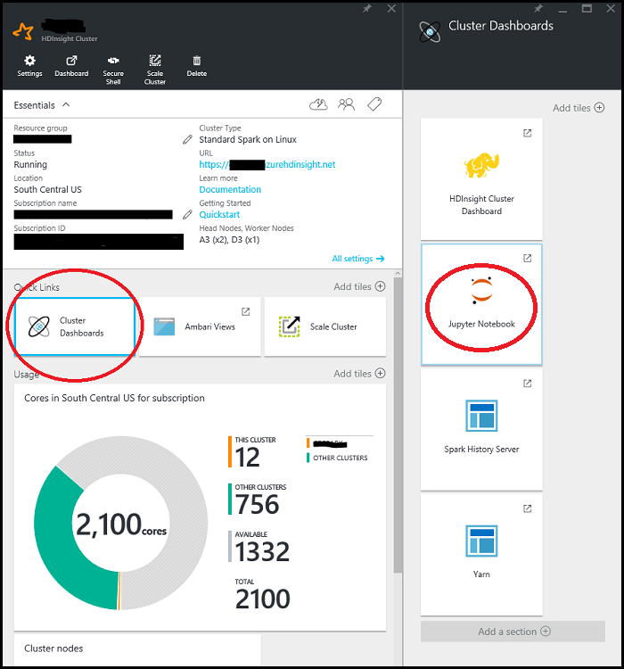

<properties
    pageTitle="Übersicht über Spark auf Azure HDInsight mithilfe von Daten Wissenschaft | Microsoft Azure"
    description="Das Toolkit Spark MLlib bringt dazu maschinellen Learning Modellierungsfunktionen zu der verteilten HDInsight-Umgebung."
    services="machine-learning"
    documentationCenter=""
    authors="bradsev"
    manager="jhubbard"
    editor="cgronlun"  />

<tags
    ms.service="machine-learning"
    ms.workload="data-services"
    ms.tgt_pltfrm="na"
    ms.devlang="na"
    ms.topic="article"
    ms.date="10/07/2016"
    ms.author="deguhath;bradsev;gokuma" />

# Übersicht über Daten Wissenschaft mit Spark auf Azure HDInsight

[AZURE.INCLUDE [machine-learning-spark-modeling](../../includes/machine-learning-spark-modeling.md)]

Diese Sammlung von Themen wird gezeigt, wie HDInsight Spark zu verwenden, um allgemeine Daten Wissenschaft Aufgaben wie Daten-Aufnahme, Feature technisch, Modellierung und Modell Auswertung abzuschließen. Die verwendeten Daten ist eine Stichprobe des 2013 NYC Taxi Geschäftsreise und Fahrpreis Dataset. Die Modelle erstellt gehören logistische und lineare Regression, zufällige Gesamtstrukturen und Farbverlauf stärkere Bäume. Die Themen veranschaulichen auch wie diese Modelle in Azure Blob-Speicher (WASB) gespeichert und wie Sie bewerten und deren Vorhersage Leistung auswerten. Erweiterte Themen behandelt wie Modelle werden können gelernt mit übergreifende Überprüfung und hyper-Parameter ziehen. In diesem Übersichtsthema beschreibt auch das Spark Cluster einrichten, die Sie benötigen, um die drei Vorgehensweisen Schritte. 

[Spark](http://spark.apache.org/) ist ein offener Quelle Parallel Verarbeitung Framework, das in-Memory Verarbeitung, um die Leistung der analytischen Anwendung große Daten zu verbessern. Spark Verarbeitung-Engine wird für Geschwindigkeit, erleichterte Bedienung verwenden und anspruchsvolle Analytics erstellt. Spark des verteilten Berechnung in-Memory-Funktionen machen Sie es eine gute Wahl für iterative Algorithmen Computer lernen und Graph berechnet. [MLlib](http://spark.apache.org/mllib/) ist der Spark skalierbare Computer Learning-Bibliothek, die Modellierungsfunktionen für diese verteilten Umgebung bereitstellt. 

[HDInsight Spark](../hdinsight/hdinsight-apache-spark-overview.md) ist der Azure gehosteten Bereitstellung von Open Source Spark. Darüber hinaus Unterstützung für **Jupyter PySpark Notizbücher** auf dem Spark Cluster, der interaktive Spark SQL-Abfragen für transformieren, Filtern und Visualisieren von Daten in Azure Blobs (WASB) gespeichert ausgeführt werden kann. PySpark ist die Python-API für Spark. Die Codeausschnitte, die die Lösungen bereitstellen und anzeigen die relevanten Flächen visualisiert werden sollen, die Daten in Jupyter Notizbücher auf die Spark Cluster installiert in diesem Modus ausführen. Die Modellierung Schritte in den folgenden Themen enthalten Code, der zeigt, wie Schulen, auswerten, speichern und jeder Typ des Modells nutzen. 

Die Schritte zum Einrichten und Code in diese exemplarische Vorgehensweise bereitgestellt ist für HDInsight 3.4 Spark 1.6. Der Code hier und in die Notizbücher ist jedoch generische, und klicken Sie auf eine beliebige Spark Cluster arbeiten soll. Wenn Sie keine HDInsight Spark, dem Cluster-Setup und -Schritte möglicherweise etwas anders aus, wie hier dargestellt ist.

## Erforderliche Komponenten

1.Klicken Sie müssen ein Azure-Abonnement verfügen. Wenn Sie nicht bereits eine verfügen, finden Sie unter [erste Azure kostenlose Testversion](https://azure.microsoft.com/documentation/videos/get-azure-free-trial-for-testing-hadoop-in-hdinsight/).

2.Klicken Sie gegebenenfalls einen HDInsight 3.4 Spark 1.6 Cluster diese exemplarische Vorgehensweise. Um eine zu erstellen, finden Sie unter den Anweisungen bereitgestellten [Erste Schritte: Erstellen von Apache Spark auf Azure HDInsight](../hdinsight/hdinsight-apache-spark-jupyter-spark-sql.md). Clustertyp und Version wird angegeben, aus dem Menü **Clustertyp auswählen** . 

<!-- -->

> [AZURE.NOTE] Ein Thema, das wie Scala statt Python Erledigung der Vorgänge für einen End-to-End-Daten für Wissenschaft Prozess verwendet werden, finden Sie unter der [Wissenschaft Daten mithilfe von Scala mit Spark auf Azure](machine-learning-data-science-process-scala-walkthrough.md).

<!-- -->

>[AZURE.INCLUDE [delete-cluster-warning](../../includes/hdinsight-delete-cluster-warning.md)]

## Die Daten NYC 2013 Taxi

Die Daten NYC Taxi Geschäftsreise ist ungefähr 20 GB komprimierte durch Trennzeichen getrennte Werte (CSV) Dateien (~ 48 GB nicht komprimiert), für jede Reise bezahlt, umfasst mehr als 173 Millionen einzelnen Schleifen und die Flugpreise. Jeden Datensatz Geschäftsreise umfasst das Auswählen von und Ladengeschäft und Zeit, anonymes Hacker (Treiber) Anzahl Lizenzen und Medallion (einmalige Nr. des Taxi) Zahl. Die Daten werden alle Schleifen im Jahr 2013 behandelt und werden in den folgenden zwei Datasets für jeden Monat bereitgestellt:

1. CSV-Dateien 'Trip_data' Geschäftsreise Details, wie etwa die Anzahl der Personen enthalten, Abholen und Dropoff verweist, Dauer und Geschäftsreise Länge zu bringen. Hier sind ein paar Stichprobe Einträge aus:

        medallion,hack_license,vendor_id,rate_code,store_and_fwd_flag,pickup_datetime,dropoff_datetime,passenger_count,trip_time_in_secs,trip_distance,pickup_longitude,pickup_latitude,dropoff_longitude,dropoff_latitude
        89D227B655E5C82AECF13C3F540D4CF4,BA96DE419E711691B9445D6A6307C170,CMT,1,N,2013-01-01 15:11:48,2013-01-01 15:18:10,4,382,1.00,-73.978165,40.757977,-73.989838,40.751171
        0BD7C8F5BA12B88E0B67BED28BEA73D8,9FD8F69F0804BDB5549F40E9DA1BE472,CMT,1,N,2013-01-06 00:18:35,2013-01-06 00:22:54,1,259,1.50,-74.006683,40.731781,-73.994499,40.75066
        0BD7C8F5BA12B88E0B67BED28BEA73D8,9FD8F69F0804BDB5549F40E9DA1BE472,CMT,1,N,2013-01-05 18:49:41,2013-01-05 18:54:23,1,282,1.10,-74.004707,40.73777,-74.009834,40.726002
        DFD2202EE08F7A8DC9A57B02ACB81FE2,51EE87E3205C985EF8431D850C786310,CMT,1,N,2013-01-07 23:54:15,2013-01-07 23:58:20,2,244,.70,-73.974602,40.759945,-73.984734,40.759388
        DFD2202EE08F7A8DC9A57B02ACB81FE2,51EE87E3205C985EF8431D850C786310,CMT,1,N,2013-01-07 23:25:03,2013-01-07 23:34:24,1,560,2.10,-73.97625,40.748528,-74.002586,40.747868

2. 'Trip_fare' CSV-Dateien enthalten die Details der für jede Reise, z. B. Zahlungstyp, Fahrpreis Betrag, Aufschlag und steuern, Tipps und Maut-, gezahlten Flugpreis und den Gesamtbetrag. Hier sind ein paar Stichprobe Einträge aus:

        medallion, hack_license, vendor_id, pickup_datetime, payment_type, fare_amount, surcharge, mta_tax, tip_amount, tolls_amount, total_amount
        89D227B655E5C82AECF13C3F540D4CF4,BA96DE419E711691B9445D6A6307C170,CMT,2013-01-01 15:11:48,CSH,6.5,0,0.5,0,0,7
        0BD7C8F5BA12B88E0B67BED28BEA73D8,9FD8F69F0804BDB5549F40E9DA1BE472,CMT,2013-01-06 00:18:35,CSH,6,0.5,0.5,0,0,7
        0BD7C8F5BA12B88E0B67BED28BEA73D8,9FD8F69F0804BDB5549F40E9DA1BE472,CMT,2013-01-05 18:49:41,CSH,5.5,1,0.5,0,0,7
        DFD2202EE08F7A8DC9A57B02ACB81FE2,51EE87E3205C985EF8431D850C786310,CMT,2013-01-07 23:54:15,CSH,5,0.5,0.5,0,0,6
        DFD2202EE08F7A8DC9A57B02ACB81FE2,51EE87E3205C985EF8431D850C786310,CMT,2013-01-07 23:25:03,CSH,9.5,0.5,0.5,0,0,10.5

Wir haben eine Stichprobe 0,1 % diese Dateien geöffnet und die Reise beigetreten\_Daten und Geschäftsreise\_Ergebnisse so ausfallen CVS-Dateien in einem einzelnen Dataset als Eingabe-Dataset für diese exemplarische Vorgehensweise verwendet. Der eindeutige Schlüssel für die Reise Teilnahme an\_Daten und Geschäftsreise\_Fahrpreis besteht aus den Feldern: Medallion, Hack\_Lizenz und Abholverzeichnisse\_"DateTime". Jeden Eintrag des Datasets enthält die folgenden Attributen, die eine Reise NYC Taxi darstellt:

|Feld| Kurze Beschreibung
|------|---------------------------------
| medallion |Anonymes Taxi Medallion (Taxi eindeutige Id)
| hack_license |    Anonymes Hackney Wagenrücklauf Lizenz Zahl
| vendor_id |   Taxi Hersteller-id
| rate_code | NYC Taxi Zinsfuß Fahrpreis
| store_and_fwd_flag | Speichern und Weiterleiten Kennzeichnung
| pickup_datetime | Wählen Sie von Datum und Uhrzeit
| dropoff_datetime | Dropoff Datum und Uhrzeit
| pickup_hour | Wählen Sie die Stunde
| pickup_week | Wählen Sie die Woche des Jahres
| Wochentag | Weekday (Bereich 1 bis 7)
| passenger_count | Anzahl von Personen in einer Reise taxi
| trip_time_in_secs | Geschäftsreise Zeit in Sekunden
| trip_distance | Geschäftsreise gestorben in Meilen
| pickup_longitude | Wählen Sie die Länge
| pickup_latitude | Wählen Sie die Breite
| dropoff_longitude | Dropoff Länge
| dropoff_latitude | Dropoff Breite
| direct_distance | Direkte Abstand zwischen auswählen nach oben und Dropoff Speicherorte
| payment_type | Zahlungstyp (Zertifizierungsstellen, Kreditkarten-usw.).
| fare_amount | Fahrpreis Betrag in
| Aufschlag | Aufschlag
| mta_tax | MTA steuern
| tip_amount | Tipp Betrag
| tolls_amount | Maut-Betrag
| total_amount | Gesamtmenge
| hinterlassen hat | Geneigter (0/1 für Nein oder Ja)
| tip_class | Tipp Klasse (0: $0, 1: $0-5, 2: $6-10, 3: $11-20; 4: > $20)

## Ausführen von Code aus einem Notizbuch Jupyter auf dem Spark cluster 

Sie können das Notizbuch Jupyter vom Azure-Portal starten. Suchen nach Ihrer Spark Cluster auf dem Dashboard, und klicken Sie auf, um die Verwaltungsseite für Ihren Cluster eingeben. Klicken Sie zum Öffnen des Notizbuchs Spark Cluster zugeordnet **Cluster Dashboards**auf -> **Jupyter Notizbuch** .

Sie können auch auf ***https://CLUSTERNAME.azurehdinsight.net/jupyter*** Jupyter Notizbücher Zugriff auf Durchsuchen. Ersetzen Sie den CLUSTERNAME Teil diese URL mit dem Namen der eigenen Cluster aus. Sie benötigen das Kennwort für Ihr Administratorkonto für den Zugriff auf Notizbücher auf.

Wählen Sie PySpark, um ein Verzeichnis anzuzeigen, die ein paar Beispiele für vorkonfigurierten Notizbücher enthält, die die PySpark-API verwenden. Die Notizbücher, die in den Codebeispielen für diese Sammlung von Spark Thema enthalten, finden Sie unter [Github](https://github.com/Azure/Azure-MachineLearning-DataScience/tree/master/Misc/Spark/pySpark)

Sie können die Notizbücher direkt aus Github Server Jupyter Notizbuch auf Ihren Cluster Spark hochladen. Klicken Sie auf der Homepage Ihrer Jupyter klicken Sie auf die Schaltfläche " **Hochladen** " im rechten Bereich des Bildschirms. Es wird einen Datei-Explorer geöffnet. Hier können Sie die URL Github (unformatierten Inhalt) des Notizbuchs einfügen, und klicken Sie auf **Öffnen**. Die Notizbücher PySpark stehen unter den folgenden URLs:

1.  [pySpark-machine-learning-data-science-spark-data-exploration-modeling.ipynb](https://github.com/Azure/Azure-MachineLearning-DataScience/blob/master/Misc/Spark/pySpark/pySpark-machine-learning-data-science-spark-data-exploration-modeling.ipynb)
2.  [pySpark-machine-learning-data-science-spark-model-consumption.ipynb](https://github.com/Azure/Azure-MachineLearning-DataScience/blob/master/Misc/Spark/pySpark/pySpark-machine-learning-data-science-spark-model-consumption.ipynb)
3.  [pySpark-machine-learning-data-science-spark-advanced-data-exploration-modeling.ipynb](https://github.com/Azure/Azure-MachineLearning-DataScience/blob/master/Misc/Spark/pySpark/pySpark-machine-learning-data-science-spark-advanced-data-exploration-modeling.ipynb)

Sie finden Sie unter dem Dateinamen auf Ihrer Dateiliste Jupyter mit der Schaltfläche **Hochladen** erneut. Klicken Sie auf diese Schaltfläche **Hochladen** . Jetzt haben Sie das Notizbuch nicht importiert. Wiederholen Sie diese Schritte, um die andere Notizbücher aus dieser exemplarische Vorgehensweise hochladen aus.

> [AZURE.TIP] Sie können mit der rechten Maustaste die Links in Ihrem Browser, und wählen **Link kopieren** können Sie den unformatierten Inhalt Github-URL zu gelangen. Sie können diese URL in das Dialogfeld Jupyter hochladen Datei-Explorer einfügen.

Jetzt können Sie:

- Finden Sie unter den Code, indem Sie auf das Notizbuch.
- Führen Sie jede Zelle, indem Sie **UMSCHALT + EINGABETASTE**drücken.
- Führen Sie das gesamte Notizbuch, indem Sie auf die **Zelle** -> **Ausführen**.
- Verwenden der automatischen Visualisierung von Abfragen.

> [AZURE.TIP] PySpark Kernel Visualisierung automatisch die Ausgabe der SQL (HiveQL) Abfragen. Sie erhalten die Möglichkeit, die zwischen verschiedenen Typen von Visualisierungen (Tabelle, Kreis-, Linien-, oder Balken) Wählen Sie den **Typ** Menüschaltflächen im Notizbuch mit:

## Wie geht's weiter?

Jetzt, da Sie mit einem HDInsight Spark Cluster eingerichtet sind und die Jupyter Notizbücher hochgeladen haben, sind Sie bereit sind, die durch die Themen zu arbeiten, die die drei PySpark Notizbücher entsprechen. Sie zeigen zum Durchsuchen von Daten, und klicken Sie dann zum Erstellen und Nutzen von Datenmodellen. Das Notizbuch erweiterter Daten-, durchsuchen und Modellierung wird gezeigt, wie übergreifende Überprüfung, hyper-Parameter ziehen, gehören und Auswertung modellieren. 

**Durchsuchen von Daten und Modellierung mit Spark:** Untersuchen des Datasets erstellen, Bewertung und Auswerten des Computers learning Modelle Durcharbeiten des Themas [binäre Klassifizierung und Regression Modelle für die Daten mit dem Toolkit Spark MLlib erstellen](machine-learning-data-science-spark-data-exploration-modeling.md) .

**Verbrauch modellieren:** So Punktzahl der Klassifizierung und Regression Modelle erstellt in diesem Thema finden Sie unter [Punktzahl Spark erstellt maschinellen Learning Modelle auswerten](machine-learning-data-science-spark-model-consumption.md).

**Übergreifende Überprüfung und Hyperparameter ziehen**: finden Sie unter [Durchsuchen von Daten und Modellierung mit Spark erweiterte](machine-learning-data-science-spark-advanced-data-exploration-modeling.md) auf wie Modelle werden können gelernt mit übergreifende Überprüfung und hyper-Parameter ziehen

