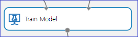

<properties 
    pageTitle="Modell Azure-Computern interessante Debuggen | Microsoft Azure" 
    description="Erläutert, wie das Modell Azure Computer interessante Debuggen." 
    services="machine-learning"
    documentationCenter="" 
    authors="garyericson" 
    manager="jhubbard" 
    editor="cgronlun"/>

<tags 
    ms.service="machine-learning" 
    ms.workload="data-services" 
    ms.tgt_pltfrm="na" 
    ms.devlang="na" 
    ms.topic="article" 
    ms.date="09/09/2016" 
    ms.author="bradsev;garye" />

# Debuggen des Modells interessante Azure-Computern

In diesem Artikel wird erläutert, wie Ihre Modelle in Microsoft Azure maschinellen Learning Debuggen. Insbesondere bedeckt sie die möglichen Gründe, warum eine der folgenden beiden Fehlerszenarien auftreten, möglicherweise, wenn sich ein Modell ausgeführt wird:

* das [Modell Zug] [ train-model] Modul löst einen Fehler aus. 
* das [Modell Punktzahl] [ score-model] Modul falsche Ergebnisse liefert. 

[AZURE.INCLUDE [machine-learning-free-trial](../../includes/machine-learning-free-trial.md)]

## Zug Modell Modul löst einen Fehler aus.

Das [Modell Zug] [ train-model] Modul erwartet die folgenden 2 Eingaben:

1. Den Typ der Klassifizierung/Regression Modell aus der Sammlung von Azure maschinellen Learning bereitgestellten Modelle
2. Die Schulung Daten mit einer angegebenen Beschriftungsspalte. Die Spalte Beschriftung gibt die Variable Vorhersagen an. Die restlichen Spalten enthalten sind davon ausgegangen, dass Features werden.

In diesem Modul löst einen Fehler in den folgenden Fällen:

1. Die Spalte Beschriftung ist falsch angegeben werden, da entweder mehr als eine Spalte als Bezeichnung oder ein falschen Spaltenindex ausgewählt ist. Beispielsweise würde der zweiten Groß-/Kleinschreibung anwenden, wenn ein Spaltenindex von 30 mit der Eingabe-Dataset verwendet wurde, das nur 25 Spalten wurde.

2. Das Dataset enthält alle Spalten Feature nicht. Beispielsweise verfügt des Eingabe-Dataset nur 1 Spalte, die als die Bezeichnungsspalte markiert ist, wäre es keine Features, mit denen zur Erstellung des Modells. In diesem Fall [Zug Modell] [ train-model] Modul wird ein Fehler ausgelöst.

3. Das Eingabe-Dataset (Features oder Bezeichnung) enthalten Unendlichkeit als Wert an.

## Punktzahl Modell Modul keine richtige Ergebnisse erhalten.

In einem normalen Schulung/testen Diagramm für überwacht learning, die [Aufgeteilten Daten] [ split] Modul teilt das ursprüngliche Dataset aus zwei Teilen: das Webpart, mit dem Modell Schulen, und das Webpart, die reserviert ist, um der Punktzahl ausgebildete Modell auf Daten Leistung nicht auf Schulen. Das Modell ausgebildete wird dann zum Testdaten Punktzahl nach denen die Ergebnisse ausgewertet werden, um die Genauigkeit des Modells zu bestimmen.

Das [Modell Punktzahl] [ score-model] Modul erfordert zwei Eingaben:

1. Eine Ausgabe ausgebildeten Modell aus [Zug Modell] [ train-model] Modul
2. Ein Bewertungssystem Dataset nicht, die das Modell nicht auf angewiesen wurde

Es kann, die vorkommen, obwohl der Versuch erfolgreich ist, das [Modell Punktzahl] [ score-model] Modul falsche Ergebnisse liefert. Mehrere Szenarien können dazu führen:

1. Wenn die angegebene Bezeichnung kategorisiert ist und ein Regressionsmodells wird auf der Registerkarte Daten gelernt, eine falsche Ausgabe vom [Punktzahl Modell] erzeugt werden[ score-model] Modul. Dies ist, da Regression eine Variable fortlaufender Antwort erforderlich ist. In diesem Fall sollten besser geeignet ein Modells Klassifizierung verwendet werden. 
2. Wenn eine Einstufung Modell auf ein Dataset beweglich Punkt Zahlen in der Spalte Beschriftung haben gelernt ist, kann es unerwünschte Ergebnissen führen. Dies ist, da Klassifizierung eine Variable diskrete Antwort erforderlich ist, die nur Werte dieser Bereich über eine begrenzte und in der Regel etwas kleine Gruppe von Klassen zulässt.
3. Wenn das Punktzahl Dataset nicht alle Funktionen verwendet, um das Modell, das [Modell Punktzahl] Schulen enthält[ score-model] erzeugt einen Fehler zurück.
4. Das [Modell Punktzahl] [ score-model] würde erzeugt keine Ausgabe, die einer Zeile in der Punktzahl Dataset, die einen fehlende oder eine unbegrenzte Wert für die Features des enthält.
5. Das [Modell Punktzahl] [ score-model] möglicherweise zu erzeugen identische Ausgaben für alle Zeilen in der Punktzahl Dataset. Dies kann vorkommen, z. B. im Feld wann versuchen Klassifizierung Entscheidung Gesamtstrukturen verwenden, wenn die minimale Anzahl von Beispielen pro Blattknoten ausgewählt ist, werden mehr als die Anzahl der Schulung Beispiele zur Verfügung.

<!-- Module References -->
[score-model]: https://msdn.microsoft.com/library/azure/401b4f92-e724-4d5a-be81-d5b0ff9bdb33/
[split]: https://msdn.microsoft.com/library/azure/70530644-c97a-4ab6-85f7-88bf30a8be5f/
[train-model]: https://msdn.microsoft.com/library/azure/5cc7053e-aa30-450d-96c0-dae4be720977/
 
