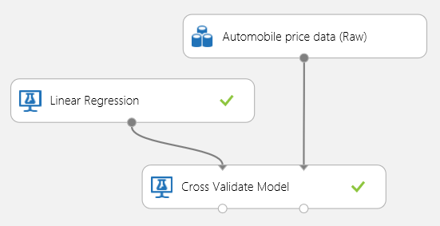
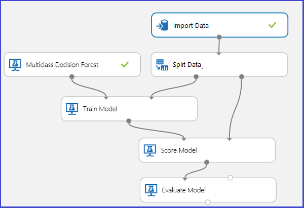

<properties 
    pageTitle="Auswerten Modell Leistung Computer interessante | Microsoft Azure" 
    description="Erläutert, wie Sie das Modell Leistung Azure Computer interessante ausgewertet werden soll." 
    services="machine-learning"
    documentationCenter="" 
    authors="garyericson" 
    manager="jhubbard" 
    editor="cgronlun"/>

<tags 
    ms.service="machine-learning" 
    ms.workload="data-services" 
    ms.tgt_pltfrm="na" 
    ms.devlang="na" 
    ms.topic="article" 
    ms.date="08/19/2016" 
    ms.author="bradsev;garye" />

# Das Modell Leistung Azure Computer interessante auswerten

In diesem Thema wird veranschaulicht, wie die Leistung von einem Datenmodell in Azure maschinellen Learning Studio ausgewertet werden soll, und enthält eine kurze Beschreibung der die Metrik verfügbar für diese Aufgabe. Drei häufige Kontrolle Learning Szenarien werden angezeigt: 

* Regressionsanalyse
* binäre Klassifizierung 
* multiclass Klassifizierung

[AZURE.INCLUDE [machine-learning-free-trial](../../includes/machine-learning-free-trial.md)]

Auswerten der Leistung eines Modells ist eine Core Phase im Prozess Wissenschaft Daten. Er gibt an, wie erfolgreich die Punktzahl (Vorhersagen) ein Dataset von einem ausgebildeten Datenmodell wurde. 

Modell Auswertung über zwei der zugehörigen Hauptfenster maschinellen learning Module Azure maschinellen Learning unterstützt: [Auswerten Modell] [ evaluate-model] und [Modell Cross überprüfen][cross-validate-model]. Diese Module können Sie sehen, wie Ihr Modell in Bezug auf eine Anzahl von Kennzahlen ausführt, die in den Computer lernen und Statistik häufig verwendet werden.

##Bewertung im Vergleich zu Cross Überprüfung##
Auswertung und Cross Überprüfung sind standard Möglichkeiten, um die Leistung des Modells messen. Beide generieren Auswertung Kennzahlen, die Sie prüfen oder mit denen der anderen Modelle vergleichen können.

[Auswerten Modells] [ evaluate-model] erwartet ein bewertete Dataset als Eingabe (oder 2 im Fall und die Leistung von 2 Modellen vergleichen möchten). Dies bedeutet, dass Sie Ihr Modell mit dem [Modell Schulen] Schulen müssen[ train-model] Modul und Tabellenerstellungsabfrage Vorhersagen auf einige Dataset mithilfe des [Modells Punktzahl] [ score-model] Modul, bevor Sie die Ergebnisse ausgewertet werden können. Die Auswertung ist die basierend auf bewertete Etiketten/Wahrscheinlichkeiten zusammen mit den true Beschriftungen, die Ausgabe vom [Punktzahl Modell] sind[ score-model] Modul.

Alternativ können Cross Überprüfung Sie eine Reihe von Vorgängen Zug Punktzahl auswerten (10 Falten) ausführen, automatisch auf verschiedenen eine Teilmenge der eingegebenen Daten. Die Eingabedaten ist in 10 Webparts, wo eine Testzwecken reserviert ist, und die anderen 9 für Schulung aufteilen. Dieses Verfahren wird 10 Mal wiederholt und die Auswertung Metrik Durchschnitt wird. Auf diese Weise können in bestimmen, wie gut ein Modells für neue Datasets generalize würden. Das [Modell Cross überprüfen] [ cross-validate-model] Modul in einem ungeschulten Modell und einige beschriftete Dataset akzeptiert und gibt die Ergebnisse der Auswertung der einzelnen der 10 Falten, zusätzlich zu den Ergebnissen Durchschnitt.

In den folgenden Abschnitten, wir einfache Regression und Klassifizierung Modelle erstellen und auswerten ihre Leistung, mit dem sowohl das [Modell auswerten] [ evaluate-model] und das [Modell Cross überprüfen] [ cross-validate-model] Module.

##Auswertung eines Regressionsmodells##
Angenommen Sie, die wir eine Auto Preis Verwendung einiger Features wie Dimensionen, Pferdestärken (PS), Engine Spezifikationen und usw. schätzen möchten. Dies ist ein Problem typische Regression, in dem die Zielvariable (*Preis*) einen kontinuierlichen numerischen Wert ist. Wir können eine einfache lineare Regressionsmodell angepasst, die den Preis von dieser Auto vorhersagen können, angegebenen Werte Feature von einem bestimmten Auto. Dieses Regressionsmodell kann verwendet werden, um das gleiche Dataset zu bewerten, die, dem wir auf gelernt. Wenn wir die geschätzte Preise für alle Autos haben, können wir die Leistung des Modells auswerten, indem Sie die Vorhersagen von der tatsächlichen Preise wie viel Durchschnitt abweichen betrachtet. Um dies zu veranschaulichen, verwenden wir verfügbaren *Auto Preis Daten (Rohstoffe) Dataset* im Abschnitt **Gespeichert Datasets** in Azure maschinellen Learning Studio aus.
 
###Erstellen des Versuchs###
Fügen Sie die folgenden Module in den Arbeitsbereich in Azure maschinellen Learning Studio hinzu:

- Kurs Autos Daten (Rohstoffe)
- [Lineare Regression][linear-regression]
- [Zug Modell][train-model]
- [Punktzahl Modell][score-model]
- [Auswerten Modells][evaluate-model]

Verbinden Sie die Ports, wie unten dargestellt, in der Abbildung 1, und legen Sie die Spalte Beschriftung des [Modells Zug] [ train-model] Modul in *Preis*.
 

Abbildung 1. Auswertung eines Regressionsmodells an.

###Prüfen der Ergebnisse der Bewertung###
Nach dem Ausführen der experimentieren, klicken Sie auf den Ausgang des [Modells auswerten] [ evaluate-model] Modul und select *visualisieren* der Auswertung Ergebnisse angezeigt. Die Auswertung Metrik für Regression Modelle verfügbar sind: *Absoluten Fehler bedeuten*, *Stamm Mittelwert absoluten Fehler*, *Relativen, absoluten Fehlers*, *Relativen im Quadrat zurück*und die *Koeffizienten von Ermittlung*.

Der Begriff "zurück" Hier stellt den Unterschied zwischen den geschätzten Wert und den Wert true. Der Absolute Wert oder das Quadrat des dieser Unterschied sind in der Regel berechnet um zu erfassen das gesamte Ausmaß des Fehlers über alle Instanzen wie der Unterschied zwischen den geschätzten und true Wert negativ in einigen Fällen werden konnte. Der Fehler Metrik messen Sie die Vorhersage Performance eines Regressionsmodells im Hinblick auf die Standardabweichung der Mittelwert der zugehörigen Vorhersagen aus den Werten true. Unteren Fehlerwerte bedeutet, dass das Modell in seine Vorhersagen genauere ist. Eine allgemeine Fehler Metrisch 0 gibt an, dass das Modell die Daten perfekte Übereinstimmung zwischen.

Koeffizienten von Ermittlung, auch bekannt als also R im Quadrat, ist ebenfalls ein Standardverfahren messen, wie gut das Modell Daten passt. Es kann als der Anteil Variation Erläuterung, indem Sie das Modell interpretiert werden. Eine höhere Verhältnis ist es besser in diesem Fall zeigt an, wobei 1 eines perfekten anpassen.
 

Abbildung 2. Lineare Regression Auswertung Kennzahlen.

###Verwenden von Cross Überprüfung###
Wie bereits zuvor erwähnt, können Sie wiederholten Schulung, bewerten und Testen der automatisch mit dem [Modell Cross überprüfen] ausführen[ cross-validate-model] Modul. In diesem Fall müssen Sie lediglich ein Dataset, ein ungeschulten Modell und ein [Modell Cross überprüfen] [ cross-validate-model] Modul (siehe die nachstehende Abbildung). Beachten Sie, dass Sie die Beschriftungsspalte in *Preis* im [Modell Cross überprüfen] festlegen müssen[ cross-validate-model] des Moduls Eigenschaften.

Abbildung 3. Cross-Überprüfen eines Regressionsmodells.

Nach dem Ausführen der experimentieren, können Sie die Ergebnisse der Auswertung, indem Sie auf der Rechte Ausgang des [Modells Cross überprüfen] prüfen[ cross-validate-model] Modul. Dies stellt eine Detailansicht der Metrik für jede Iteration (gefaltete) und die durchschnittliche Ergebnisse der einzelnen die Metrik (Abbildung 4) bereit.
 

Abbildung 4. Übergreifende Überprüfung Resultate einer Regressionsanalyse Modell.

##Auswertung eines Modells binäre Klassifizierung##
In einem Szenario binäre Klassifizierung hat die Zielvariable nur zwei möglichen Ergebnisse, z. B.: {0, 1} oder {falsch, WAHR}, {negativ, positive}. Angenommen, erhalten Sie ein Dataset Erwachsenen Mitarbeiter mit einigen demographischen und Beschäftigungsjahre Variablen, und dass Sie aufgefordert werden, die Einnahmen Ebene, eine binäre Variable mit den Werten Vorhersagen {"< 50K =", "> 50K"}. Kurzum, die negative Klasse stellt die Mitarbeiter, die kleiner als oder gleich 50 K pro Jahr stellen, und die positive Klasse darstellt, alle anderen Mitarbeiter. Wie in dem Szenario Regression möchten wir Schulen ein Modells, Punktzahl einiger Daten, und die Ergebnisse auswerten. Der wichtigste Unterschied hier ist die Wahl der Kennzahlen, die Azure maschinellen Learning berechnet, und Ausgaben. Um die Einnahmen Ebene Vorhersage Szenario veranschaulichen, verwenden wir [Erwachsenen](http://archive.ics.uci.edu/ml/datasets/Adult) Dataset zum Erstellen einer Azure maschinellen Learning experimentieren und die Leistung eines Modells zwei-Klasse logistische Regression, eine häufig verwendete binäre Klassifizierung auswerten.

###Erstellen des Versuchs###
Fügen Sie die folgenden Module in den Arbeitsbereich in Azure maschinellen Learning Studio hinzu:

- Erwachsenen Erhebung Einkommen binäre Klassifizierung dataset
- [Zwei-Klasse logistische Regression][two-class-logistic-regression]
- [Zug Modell][train-model]
- [Punktzahl Modell][score-model]
- [Auswerten Modells][evaluate-model]

Verbinden Sie die Ports, wie unten dargestellt, in der Abbildung 5, und legen Sie die Spalte Beschriftung des [Modells Zug] [ train-model] Modul *Einkommen*.

Abbildung 5. Auswertung eines Modells binäre Klassifizierung an.

###Prüfen der Ergebnisse der Bewertung###
Nach dem Ausführen der experimentieren, klicken Sie auf den Ausgang des [Modells auswerten] [ evaluate-model] Modul und select *visualisieren* , um die Ergebnisse der Auswertung (Abbildung 7) anzuzeigen. Die Auswertung Metrik für binäre Klassifizierung Modelle verfügbar sind: *Genauigkeit*, *Genauigkeit*, *Denken Sie daran*, *F1 Punktzahl*und *AUC*. Darüber hinaus gibt das Modul eine Verwirrung Matrix mit der Anzahl der WAHR positive, falsch negativ, falsche positive und negative WAHR sowie *ROC*, *Genauigkeit/zurückrufen*, und *heben Sie* Kurven aus.

Genauigkeit ist einfach das Verhältnis der ordnungsgemäß geschützten Instanzen. Es ist normalerweise der ersten Metrik, die, der Sie beim Auswerten einer Klassifizierung betrachten. Wenn die Testdaten ist jedoch nicht ausgeglichenen (Stelle, an der meisten der Instanzen einer der Klassen solchen angehören), oder Sie mehr interessiert sind in die Leistung auf einem der Klassen, nicht Genauigkeit wirklich die Effektivität einer Klassifizierung erfassen. Im Szenario Ebene Klassifizierung Einkommen wird davon ausgegangen Sie, dass Sie auf einige Daten testen, wobei 99 % der Instanzen Personen darstellen, die kleiner als oder gleich 50K pro Jahr verdienen. Es ist möglich, eine 0.99 Genauigkeit zu erzielen, indem Sie die Klasse Vorhersage "< 50K =" für alle Instanzen. In diesem Fall scheint Klassifizierung generelle gut auszuführen, aber tatsächlich fehlschlägt keines der Weltbank Personen (die 1 %) werden die richtige Klassifizierung.

Aus diesem Grund ist es hilfreich, um zusätzliche Statistiken zu berechnen, die spezifischere Aspekte der Auswertung erfassen. Bevor wir zu den Details des solche Kennzahlen, ist es wichtig, eine binäre Klassifizierung von Werten mithilfe von Matrix Verwirrung zu verstehen. Die Klasse Etiketten Schulung festlegen können nur 2 mögliche Werte, die wir in der Regel auf verweisen als positive oder negative übernehmen. Die positiven und negativen Instanzen, die eine Klassifizierung ordnungsgemäß Vorhersagen sind wahr positiver (TP) und WAHR (TN), aufgerufen. Die falsch geschützten Instanzen werden auf ähnliche Weise falsch positiv (FP) oder negativ (FN) bezeichnet. Die Verwirrung Matrix ist einfach eine Tabelle mit der Anzahl der Instanzen, die in jeder der folgenden 4 Kategorien fallen. Azure maschinellen Learning beschließt automatisch an, welche der beiden Klassen im Dataset die positive Klasse ist. Wenn die Klasse Etiketten Boolesch oder ganze Zahlen sind, werden die 'true' oder '1' beschrifteten Instanzen die positive Klasse zugewiesen. Wenn die Etiketten Zeichenfolgen sind, wie in der Groß-/Kleinschreibung des Datasets Einkünfte, die Beschriftungen werden alphabetisch und die erste Ebene wird ausgewählt, um die negative Klasse werden während die zweite Ebene die positive Klasse ist.

Abbildung 6. Binäre Klassifizierung Verwirrung Matrix.

Für das Einkommen Klassifizierung Problem zurückgehen, möchten wir bitten, dass mehrere Auswertung Fragen, die uns helfen, die Leistung der Klassifizierung verwendet verstehen. Ist eine sehr natürliche Frage: ' aus der Einzelpersonen wem das Modell um zu verdienen werden regressionsgleichung > 50 K (TP + FP), wie viele richtig klassifiziert wurden (TP)? " Diese Frage beantwortet werden kann, indem Sie die **Genauigkeit** des Modells, also der Anteil der positive, die ordnungsgemäß klassifiziert werden: TP/(TP+FP). Ist eine andere häufige Frage "aus der alle höchst jährlich mit Mitarbeitern Ertrag > 50 k (TP + FN), wie viele die Klassifizierung klassifizieren ordnungsgemäß (TP)". Dies ist tatsächlich der **zurückrufen**oder die WAHR positive Rate: TP/(TP+FN) der Klassifizierung. Sie möglicherweise feststellen, dass es ein offensichtlich Verhältnis zwischen Genauigkeit und Rückruf. Beispielsweise angegebenen ein Dataset relativ angeglichene, würde eine Klassifizierung, die hauptsächlich positive Instanzen schätzt eine hohe Rückruf haben, aber eine eher niedrige Genauigkeit wie viele der negativen Instanzen würde resultierender in einer großen Anzahl von falsche misclassified. Zum Anzeigen einer Zeichnung der folgenden zwei Kennzahlen wie variieren, klicken Sie auf der Kurve ' Genauigkeit/ZURÜCKRUFEN' in der Ausgabe Auswertung Ergebnisseite (oben im linken Bereich von Abbildung 7).

 Abbildung 7. Binäre Klassifizierung Auswertung Ergebnisse.

Eine andere verwandte Metrisch, die häufig verwendet wird, ist **F1 Punktzahl**, die sowohl Genauigkeit und Rückruf zu berücksichtigen akzeptiert. Es ist das harmonische Mittel zurück, der diese 2 Kennzahlen und als solche berechnet wird: F1 = 2 (Rückruf Genauigkeit X) / (Genauigkeit + Rückruf). Die Bewertung F1 ist eine gute Möglichkeit, die Auswertung in einer einzelnen Zahl zusammenfassen, aber es ist immer empfiehlt sich das Aussehen sowohl auf Genauigkeit Rückruf zusammen, um besser zu verstehen, wie eine Klassifizierung verhält sich.

Darüber hinaus kann eine positive WAHR Rate im Vergleich zu den falsch-positive Quote in der Kurve **Empfänger Betrieb Merkmale (ROC)** und den entsprechenden Wert für den **Bereich unter der Kurve (AUC)** prüfen. Die näher dieser Kurve wird in der oberen linken Ecke, bessere Leistung des Klassifizierung ist (, die ist WAHR positive Rate und die false-positive Rate minimiert maximieren). Kurven, die in der Nähe der diagonale aus der Zeichnung, Ergebnis von Klassifizierern, die in der Regel sind, Vorhersagen zu erstellen, die in der Nähe Zufallszahl raten sind.

###Verwenden von Cross Überprüfung###
Wie im Beispiel Regression können wir Cross Überprüfung wiederholt Schulen, Punktzahl und Auswerten von verschiedenen eine Teilmenge der Daten automatisch ausführen. Wir können auch das [Modell Cross überprüfen] [ cross-validate-model] Modul, ein Modell ungeschulten logistische Regression und ein Dataset. Die Beschriftungsspalte muss auf *Einkommen* im [Modell Cross überprüfen] festgelegt sein[ cross-validate-model] des Moduls Eigenschaften. Nach dem Ausführen von des Versuchs, und klicken Sie auf der Rechte Ausgang des [Modells Cross überprüfen] [ cross-validate-model] Modul, sehen wir die binäre Klassifizierung metrischen Werte für jede gefaltete, darüber hinaus zu den Mittelwert und die Standardabweichung der einzelnen. 
 

Abbildung 8. Cross-Überprüfen eines Modells binäre Klassifizierung.

Abbildung 9. Übergreifende Überprüfung Resultate einer binäre Klassifizierung.

##Auswertung eines Modells Multiclass Klassifizierung##
In diesem Versuch verwenden wir beliebte [Iris](http://archive.ics.uci.edu/ml/datasets/Iris "Iris") Dataset, das Instanzen von 3 verschiedenen Typen (Klassen) Pflanze Iris enthält. Es gibt 4 Feature-Werte für jede Instanz (Sepal Länge und die Breite und Länge und Breite des Blatts). In die vorherige Versuche wir gelernt und die Verwendung der gleichen Datasets Modelle getestet. Wir verwenden hier die [Aufgeteilten Daten] [ split] 2 eine Teilmenge der Daten erstellen, klicken Sie auf das erste Element, Schulen und Punktzahl und ausgewertet werden soll, klicken Sie auf das zweite Modul. Iris Dataset auf dem [UCI maschinellen Learning Repository](http://archive.ics.uci.edu/ml/index.html)öffentlich verfügbar ist, und können mithilfe eines [Daten importieren] heruntergeladen werden[ import-data] Modul.

###Erstellen des Versuchs###
Fügen Sie die folgenden Module in den Arbeitsbereich in Azure maschinellen Learning Studio hinzu:

- [Importieren von Daten][import-data]
- [Multiclass Entscheidung Gesamtstruktur][multiclass-decision-forest]
- [Aufteilen von Daten][split]
- [Zug Modell][train-model]
- [Punktzahl Modell][score-model]
- [Auswerten Modells][evaluate-model]

Verbinden Sie die Ports an, wie unten dargestellt, in der Abbildung 10.

Festlegen den Bezeichnung Spaltenindex des [Modells Zug] [ train-model] 5-Modul. Das Dataset weist keine Kopfzeile, aber wir wissen, dass die Klasse Etiketten in der fünften Spalte sind.

Klicken Sie auf die [Daten importieren] auf[ import-data] Modul und Festlegen der Eigenschaft *Datenquelle* *Über HTTP-Web-URL*, und die *URL* http://archive.ics.uci.edu/ml/machine-learning-databases/iris/iris.data.

Festlegen den Anteil der Instanzen für die Ausbildung in die [Aufgeteilten Daten] verwendet werden[ split] Modul (beispielsweise 0,7).
 

Abbildung 10. Auswertung einer Multiclass Klassifizierung

###Prüfen der Ergebnisse der Bewertung###
Ausführen der experimentieren, und klicken Sie auf den Ausgang des [Modells auswerten][evaluate-model]. Ergebnisse der Bewertung werden in diesem Fall in Form einer Matrix Verwirrung dargestellt. Die Matrix zeigt den tatsächlichen im Vergleich zu den geschätzten Instanzen für alle 3 Klassen.
 

Abbildung 11. Multiclass Klassifizierung Auswertung Ergebnisse.

###Verwenden von Cross Überprüfung###
Wie bereits zuvor erwähnt, können Sie wiederholten Schulung, bewerten und Testen der automatisch mit dem [Modell Cross überprüfen] ausführen[ cross-validate-model] Modul. Müssten Sie ein Dataset, ein ungeschulten Modell und ein [Modell Cross überprüfen] [ cross-validate-model] Modul (siehe die nachstehende Abbildung). Sie müssen erneut die Bezeichnungsspalte des [Cross überprüfen Modell] festlegen[ cross-validate-model] Modul (Spaltenindex 5 in diesem Fall). Nachdem der Versuch ausgeführt, und klicken Sie rechts auf Port des [Cross überprüfen Modell]ausgegeben[cross-validate-model], können Sie die metrischen Werte für jede gefaltete als auch die Standardabweichung Mittelwert und den Standardversionen prüfen. Die hier angezeigten Metrik ähneln der im Fall binäre Klassifizierung beschriebenen. Beachten Sie aber, dass multiclass Einstufung, die positive/negative WAHR und falsch Positives negative Ergebnisse computing erfolgt durch zählen auf Basis pro Klasse, wie es keine Klasse für insgesamt positiv oder negativ ist. Beispielsweise wird bei der Berechnung von der Genauigkeit oder Rückruf der Klasse 'Iris-Setosa' angenommen, dass dies der positive Klasse und alle anderen als negativ ist.
 

Abbildung 12. Cross-Überprüfen eines Modells Multiclass Klassifizierung.

Abbildung 13. Übergreifende Überprüfung Ergebnisse eines Modells Multiclass Klassifizierung.

<!-- Module References -->
[cross-validate-model]: https://msdn.microsoft.com/library/azure/75fb875d-6b86-4d46-8bcc-74261ade5826/
[evaluate-model]: https://msdn.microsoft.com/library/azure/927d65ac-3b50-4694-9903-20f6c1672089/
[linear-regression]: https://msdn.microsoft.com/library/azure/31960a6f-789b-4cf7-88d6-2e1152c0bd1a/
[multiclass-decision-forest]: https://msdn.microsoft.com/library/azure/5e70108d-2e44-45d9-86e8-94f37c68fe86/
[import-data]: https://msdn.microsoft.com/library/azure/4e1b0fe6-aded-4b3f-a36f-39b8862b9004/
[score-model]: https://msdn.microsoft.com/library/azure/401b4f92-e724-4d5a-be81-d5b0ff9bdb33/
[split]: https://msdn.microsoft.com/library/azure/70530644-c97a-4ab6-85f7-88bf30a8be5f/
[train-model]: https://msdn.microsoft.com/library/azure/5cc7053e-aa30-450d-96c0-dae4be720977/
[two-class-logistic-regression]: https://msdn.microsoft.com/library/azure/b0fd7660-eeed-43c5-9487-20d9cc79ed5d/
 
