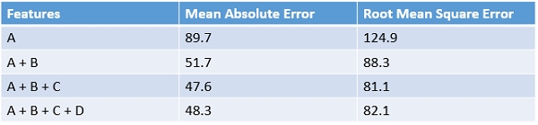
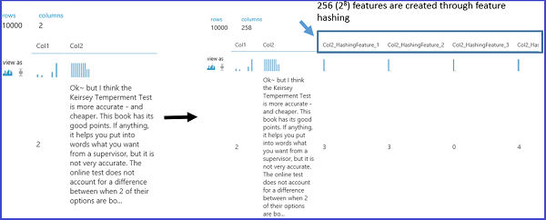
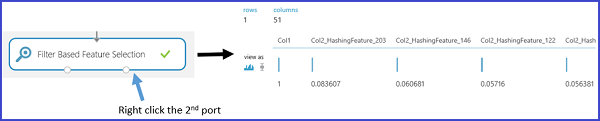

<properties
    pageTitle="Technisch und Auswahl Azure Computer interessante bereitstellen | Microsoft Azure"
    description="Erläutert den Zweck Featureauswahl und Features technisch und enthält Beispiele für ihre Rolle im Prozess Daten-Erweiterung des Computers Schulung."
    services="machine-learning"
    documentationCenter=""
    authors="bradsev"
    manager="jhubbard"
    editor="cgronlun"/>

<tags
    ms.service="machine-learning"
    ms.workload="data-services"
    ms.tgt_pltfrm="na"
    ms.devlang="na"
    ms.topic="article"
    ms.date="09/12/2016"
    ms.author="zhangya;bradsev" />

# Feature technisch und Azure Computer interessante Auswahl

In diesem Thema wird erläutert, den Zweck Feature technisch und Featureauswahl im Prozess Daten-Erweiterung des Computers Schulung. Außerdem wird veranschaulicht, was folgende Prozesse mithilfe von Beispielen von Azure maschinellen Learning Studio beinhalten.

[AZURE.INCLUDE [machine-learning-free-trial](../../includes/machine-learning-free-trial.md)]

Die verwendeten Computer interessante Schulung-Daten können häufig nach der Auswahl oder Extraktion von Features aus der erfassten Ausgangsdaten erweitert werden. Ein Beispiel für ein Engineering Feature im Kontext lernen, wie Sie die Bilder von handschriftliche Zeichen klassifizieren ist ein Bit-Dichtefunktion Schema aus den unformatierten Bit Verteilungsdaten erstellt. Diese Zuordnung hilft Ihnen die Ränder der Zeichen effizienter als unformatierten Verteilung zu suchen.

Engineering und ausgewählten Features erhöhen Sie die Effizienz des Prozesses Schulung, die versucht, die wichtige Informationen in den Daten enthaltenen extrahieren. Sie verbessern auch die Potenz dieser Modelle für die Eingabedaten exakte Klassifizierung und Aufgabenergebnisse relevante stabiler Vorhersagen. Feature technisch und Auswahl können auch kombinieren, um die Website zum Kennenlernen vom vermitteln machen. Dies geschieht nach verbessern, und klicken Sie dann Verringern der Anzahl von Features zum Kalibrieren oder Schulen eines Modells erforderlich sind. Mathematisch sprechen, sind die Features ausgewählt, um das Modell Schulen eine minimale Anzahl von unabhängigen Variablen, die erläutert, die Muster in den Daten und dann Aufgabenergebnisse erfolgreich Vorhersagen.

Die technisch und die Auswahl der Features ist ein Teil eines größeren Prozesses, die in der Regel vier Schritte umfasst:

* Datensammlung
* Verbesserung der Daten
* Modell Bauweise
* Nach der Verarbeitung

Technisch und Auswahl bilden zusammen die Erweiterung Schritt maschinellen Learning Daten. Drei Aspekte dieses Prozesses möglicherweise für unsere Zwecke unterschieden werden:

* **Pre Datenverarbeitung**: Dieser Vorgang versucht, um sicherzustellen, dass die gesammelten Daten übersichtliche und konsistent ist. Er enthält Aufgaben wie Integration von mehreren Datasets, Daten zur Behandlung von fehlenden, inkonsistente Daten zur Behandlung und Konvertieren von Datentypen.
* **Technisch empfehlen**: Dieser Vorgang versucht, um relevante Zusatzfunktionen aus der vorhandenen unformatierten Features in den Daten zu erstellen und zum Erhöhen des Learning-Algorithmus Vorhersage Power.
* **Featureauswahl**: Dieses Verfahren markiert die wichtige Teilmenge der ursprünglichen Datenfeatures, die Anzahl der Dimensionen des Problems Schulung zu verringern.

Dieses Thema enthält nur die technisch Features und Features Auswahl Aspekte des Prozesses datenerweiterung. Weitere Informationen zu den Daten vor der Verarbeitung Schritt finden Sie unter [vorab verarbeiten von Daten in Azure maschinellen Learning Studio](https://azure.microsoft.com/documentation/videos/preprocessing-data-in-azure-ml-studio/).

## Erstellen von Features aus den Daten – bereitstellen technisch

Die Schulungsdaten besteht aus einer Matrix erstellter Beispiele (Datensätze oder Beobachtungen Zeilen gehörende Kehrmatrix), von die jede eine Gruppe von Funktionen (Variablen oder Felder Spalten gehörende Kehrmatrix) hat. Kennzeichnen die Muster in den Daten werden die Features in der Versuche Entwurf angegebenen erwartet. Obwohl viele der Felder unformatierten Daten direkt in der ausgewählten Funktionsumfang verwendet, um ein Modell Schulen berücksichtigt werden können, müssen Engineering Zusatzfunktionen häufig mit den Features in die unformatierten Daten zum Generieren einer Datenmenge erweiterte Schulung erstellt werden.

Welche Arten von Features zur Verbesserung der Datenmenge, wenn ein Modell Schulung erstellt werden soll? Engineering Features, die zur Verbesserung der der Schulung finden Sie Informationen, die die Muster in den Daten besser unterscheidet. Die neuen Features, um zusätzliche Informationen bereitzustellen, die nicht klar erfasst erwartet oder einfach in der ursprünglichen oder vorhandenen Funktionsumfang, aber dieses Verfahren deutlich wird der Inhalt einer ClipArt. Audio- und produktive Entscheidungen erfordern häufig einige Fachwissen.

Beim Start mit Azure maschinellen Schulung, ist es am einfachsten, ziehen Sie dieses Verfahren mithilfe von Beispielen für Automatisierungsserver in Computer Learning Studio konkret. Zwei Beispiele werden hier dargestellt:

* Ein Beispiel für Regression ([die Anzahl der Einheiten Mieten Vorhersage](http://gallery.cortanaintelligence.com/Experiment/Regression-Demand-estimation-4)) in eine Kontrolle experimentieren, in denen die Zielwerte bekannt sind
* Eine Text-Mining Klassifizierung Beispiel für die Verwendung der [Features Hashing][feature-hashing]

### Beispiel 1: Hinzufügen von zeitliche Features für ein Regressionsmodell ###

Um zu veranschaulichen, wie Features für einen Vorgang Regression Engineering, wir verwenden die experimentieren "Demand Prognostizieren von Fahrräder" in Azure maschinellen Learning Studio. Ziel diesem Versuch ist den Bedarf für die Fahrräder vorhanden ist, d. h., die Anzahl der Einheiten Mieten innerhalb einer bestimmten Monat, Tag und Stunde Vorhersagen. Der Datenmenge **bewältigen kann Miete UCI Datenmenge** wird als unformatierten eingegebenen Daten verwendet.

Diese Datenmenge basieren auf real Daten aus dem Groß-Bikeshare Unternehmen, die einem bewältigen kann Miete Netzwerk in Washington DC in den Vereinigten Staaten unterhält. Datenmenge stellt die Anzahl der Einheiten Mieten in eine bestimmte Stunde des Tages aus 2011 auf 2012 und darin enthaltenen 17379 Zeilen und Spalten 17. Der unformatierten Funktionsumfang enthält Wetterbedingungen (Temperatur, Luftfeuchtigkeit, windgeschwindigkeit) und den Typ des Tages (Feiertag oder Wochentag). Das Feld Vorhersagen ist **Cnt**, Anzahl, die Mieten bewältigen kann in eine bestimmte Stunde darstellt und die reicht von 1 bis 977.

Zum Erstellen von effektiven Features in den Schulungsdaten werden vier Regression Modelle mit den gleichen Algorithmus, jedoch mit vier unterschiedlichen Schulung Datasets erstellt. Die vier Datensätze gleichen unformatierten Eingabedaten darstellen, aber mit einer zunehmenden Anzahl von Features festlegen. Diese Features sind in vier Kategorien unterteilt:

1. A = Wetter + "Feiertag" + Weekday + Wochenende Features für den geschätzten Tag
2. B = Anzahl der Fahrräder, die in jedem der vorherigen 12 Stunden vermieten wurden
3. C = Anzahl der Fahrräder, die in jedem der vorherigen 12 Tage bei derselben Stunde vermieten wurden
4. D = Anzahl der Fahrräder, die in jedem der vorherigen 12 Wochen bei derselben Stunde und die gleichen Tag vermieten wurden

Neben dem Feature festlegen A, die bereits in der ursprünglichen unformatierten Daten vorhanden ist, werden die drei Gruppen von Funktionen über das Feature Technik Prozess erstellt. Feature B Bildschirmausschnitte legen Sie die zuletzt verwendete Demand für die Fahrräder. Feature C Bildschirmausschnitte legen Sie den Bedarf für Fahrräder an eine bestimmte Stunde. Feature Satz D Bildschirmausschnitte Demand für Fahrräder mit bestimmten Stunde und bestimmten Tag der Woche. Jeder der vier Schulung Datengruppen enthält Features A, A + B, A + B + C und A + B + C + D, Hilfethemas.

Den Versuch Azure maschinellen Schulung werden diese vier Schulung Datasets über vier Verzweigungen-vorher bearbeitete Eingabewerte DataSet geformt. Eine Ausnahme bilden jedoch die ganz links mit jeder der folgenden Verzweigungen ein [Ausführen R Skript] enthält[ execute-r-script] Modul, in dem eine Reihe von Features (Feature setzt B, C und D) abgeleitet, Hilfethemas erstellt und angefügt, um die importierten Daten festlegen. Die folgende Abbildung veranschaulicht das R-Skript, das mit dem Featuresatz B in der zweiten linken Verzweigung erstellen.

In der folgenden Tabelle werden den Vergleich der Leistungsergebnisse der vier Modelle zusammengefasst. Die besten Ergebnisse werden nach Features A + B + C angezeigt. Beachten Sie, dass die Effektivverzinsung zurück wird verringert, wenn Sie weitere Features in den Schulungsdaten enthalten sind. Diese Funktion überprüft unsere Annahme, dass das Feature Sätze B und C Weitere relevante Informationen für den Vorgang Regression bereitstellen. Hinzufügen der Funktionsumfang D anscheinend keine zusätzliche Verkürzung der Fehler Zins bereitstellen.

### Beispiel 2: Erstellen von Features in Text mining  

Technisch Feature wird in Aufgaben, die im Zusammenhang mit Text Mining, wie etwa Klassifizierung und Grüße Dokumentanalyse stark angewendet. Wenn Sie Dokumente in mehreren Kategorien zu klassifizieren möchten, ist eine typische Annahme z. B., dass der Wörter oder Ausdrücke in einem Dokumentkategorie enthalten höchstwahrscheinlich in ein anderes Dokumentkategorie ausgeführt werden. Kurzum, kann die Häufigkeit der Verteilung Worts oder Ausdrucks kennzeichnen die anderen Dokumentkategorien. In Text Mining Clientanwendungen ist das Feature Technik Prozess erforderlich, um die Features, die im Zusammenhang mit Worts oder Ausdrucks Häufigkeiten, da die einzelnen Bestandteile der Text-Inhalt in der Regel als die Eingabedaten dienen erstellen.

Um diese Aufgabe zu erreichen, wird eine Technik namens *Feature hashing* angewendet, um effizient beliebigen Text-Funktionen in Indizes umwandeln. Statt wird jede Funktion Text (Wörter oder Ausdrücke) zu einem bestimmten Index, diese Methode funktioniert durch Anwenden einer Hashfunktion auf die Features und anhand ihrer Hashwerte als Indizes direkt an.

Azure Computer interessante, vorhanden ist ein [Feature Hashing] [ feature-hashing] Modul, das diese Features Worts oder Ausdrucks erstellt. Die folgende Abbildung zeigt ein Beispiel für die Verwendung dieses Modul. Eingabewerte Datenmenge enthält zwei Spalten: die Adressbuch Bewertung von 1 bis 5 und den tatsächlichen prüfen Inhalt. Das Ziel des dieses [Feature Hashing] [ feature-hashing] Modul zum Abrufen von neuen Features, die die Häufigkeit Vorkommen der entsprechenden Wörter oder Ausdrücke in die Bewertung von bestimmter Adressbuch angezeigt wird. Wenn Sie dieses Modul verwenden möchten, müssen Sie die folgenden Schritte ausführen:

1. Wählen Sie die Spalte mit dem eingegebenen Text (**SP2** in diesem Beispiel).
2. Festlegen von *Hashing Bitsize* 8, d.h. 2 ^ 8 = 256 Funktionen erstellt werden. Das Wort oder den Ausdruck im Text ist für 256 Indizes berechnet. Der Parameter Bereiche *Hashing Bitsize* zwischen 1 und 31 zurück. Wenn der Parameter eine größere Anzahl festgelegt ist, werden die Wörter oder Ausdrücke weniger wahrscheinlich in der gleichen Index Hash hinzugefügt werden soll.
3. Setzen Sie den Parameter *N-g* auf 2 aus. Dies ruft die Häufigkeit Vorkommen des Unigrams (ein Feature für jede einzelne Wörter) und Bigrams (ein Feature für jedes Paar benachbarte Wörter) aus dem eingegebenen Text aus. Der Parameter reicht *N-g* von 0 bis 10, der festlegt, die maximale Anzahl der sequenziellen Wörter, die in einer Funktion eingefügt werden.  

Die folgende Abbildung zeigt, wie diese neuen Features aussehen.

## Filterfunktionen aus den Daten – Featureauswahl  ##

*Featureauswahl* umfasst, die im Allgemeinen auf der Erstellung von Schulung Datasets für Vorhersage Modellierungsaufgaben wie Klassifizierung oder Regression Aufgaben angewendet wird. Das Ziel ist eine Teilmenge der Features der ursprünglichen Dataset auswählen, die die Proportionen reduziert mithilfe einen minimalen Satz von Features zum Darstellen der maximal Varianz in den Daten. Diese Teilmenge der Features enthält nur Features, um das Modell Schulen aufgenommen werden sollen. Featureauswahl fungiert beiden Hauptfunktionen:

* Featureauswahl erhöht sich häufig Klassifizierung Genauigkeit durch Vermeidung nicht relevant, redundante oder hochgradig Features in Beziehung gesetzt.
* Featureauswahl wird die Anzahl der Features, die wodurch den Modell Schulung Prozess effizienter wird verringert. Dies ist besonders wichtig für den Teilnehmern, die zum Schulen von wie Support Vektor Computern teure sind.

Obwohl Featureauswahl zum Verringern der Anzahl von Features in der Datenmenge verwendet, um das Modell Schulen anfordert, es ist nicht in der Regel genannt durch den Ausdruck *Verringerung der Anzahl der Dimensionen.* Feature Auswahlmethoden extrahieren eine Teilmenge der ursprünglichen Features in den Daten, ohne sie zu ändern.  Anzahl der Dimensionen Verringerung Methoden einsetzen Engineering Features, die die ursprüngliche Features transformieren und ändern, sodass diese können. Anzahl der Dimensionen Verringerung Methoden zählen Hauptbenutzer Komponente Analyse, kanonische Korrelationskoeffizienten Analyse und im singular Wert Gliederung.

Eine stark angewendete Kategorie von Features Auswahlmethoden in einem Kontext Kontrolle ist Filter-basierten Featureauswahl. Diese Methoden anwenden durch Auswerten der Beziehung zwischen jede Funktion und die Zielattribut, ein Measure statistische, um eine Bewertung für jede Funktion zuzuweisen. Die Features werden dann von der Punktzahl eingestuft, die Sie verwenden können, um den Schwellenwert für beibehalten oder ein bestimmtes Feature beseitigen festzulegen. In diesen Methoden verwendeten statistischen Maßnahmen zählen Pearsonschen Korrelationskoeffizienten, gemeinsamen Informationen und der Chi-Quadrat-Test.

Azure maschinellen Learning Studio bereit Featureauswahl Module. Wie in der folgenden Abbildung gezeigt wird, wird diese Module umfassen [Featureauswahl Filter-basierten] [ filter-based-feature-selection] und [Fisher linearen kombiniert werden sollen Analyse][fisher-linear-discriminant-analysis].

Beispielsweise verwenden die [Featureauswahl Filter-basierten] [ filter-based-feature-selection] Modul mit dem Text Mining Beispiel zuvor beschrieben. Angenommen, Sie möchten ein Modell Regressionsanalyse erstellen, nach dem Erstellen eine Gruppe von 256 Funktionen durch das [Feature Hashing] [ feature-hashing] Modul und, dass die Antwort Variable **SP1** ist und einem Buch Bewertung Zahl von 1 bis 5 zu überprüfen. **Feature bewerten Methode** auf **Pearsonschen Korrelationskoeffizienten**, **Zielspalte** **SP1**und die **Anzahl der gewünschten Features** auf **50**festgelegt. Das Modul [Featureauswahl Filter-basierten] [ filter-based-feature-selection] erzeugt klicken Sie dann auf eine Datengruppe zurück, die 50 Features zusammen mit der Zielattribut **SP1**enthält. Die folgende Abbildung zeigt den Fluss von diesem Versuch und die Eingabeparameter an.

Die folgende Abbildung zeigt die resultierende-Datensätze. Jedes Feature wird basierend auf den Pearsonschen Korrelationskoeffizienten zwischen sich selbst und das Zielattribut **SP1**bewertet. Die Features mit verwendete Faktoren bleiben.

Die folgende Abbildung zeigt die entsprechenden Faktoren der ausgewählten Features.

Durch Anwenden dieser [Featureauswahl Filter-basierten] [ filter-based-feature-selection] Modul 50 abwesend 256-Features ausgewählt werden, da sie die am häufigsten Features, die mit dem Ziel weisen-Variable **SP1** auf der Punktzahl Methode **Pearsonschen Korrelationskoeffizienten Basis**in Beziehung gesetzt.

## Abschluss
Feature technisch und Featureauswahl zwei Schritte, die häufig ausgeführt werden, um die Schulungsdaten vorbereiten beim Erstellen eines Modells maschinellen Learning berücksichtigt werden. In der Regel technisch Feature wird zuerst angewendet, um zusätzliche Features zu generieren, und klicken Sie dann der Feature Auswahl Schritt ausgeführt wird, um nicht relevant, redundante oder hochgradig korrelierte Features zu entfernen.

Es ist nicht immer unbedingt technisch oder Feature Featureauswahl ausführen. Gibt an, ob es erforderlich ist, hängt davon ab der Daten, die Sie sammeln oder haben, den Algorithmus, die, den Sie auswählen, und die Zielsetzung der experimentieren.

<!-- Module References -->
[execute-r-script]: https://msdn.microsoft.com/library/azure/30806023-392b-42e0-94d6-6b775a6e0fd5/
[feature-hashing]: https://msdn.microsoft.com/library/azure/c9a82660-2d9c-411d-8122-4d9e0b3ce92a/
[filter-based-feature-selection]: https://msdn.microsoft.com/library/azure/918b356b-045c-412b-aa12-94a1d2dad90f/
[fisher-linear-discriminant-analysis]: https://msdn.microsoft.com/library/azure/dcaab0b2-59ca-4bec-bb66-79fd23540080/
