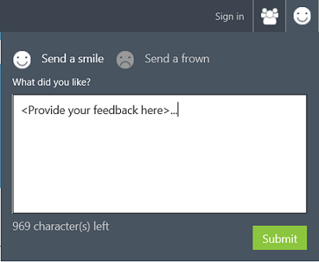

<properties
    pageTitle="Cortana Intelligence Katalog | Microsoft Azure"
    description="Freigeben und Analytics Ressourcen und mehr im Katalog Intelligence Cortana ermitteln. Lernen Sie von anderen Personen, und nehmen Sie Ihre eigenen Beiträge an der Community."
    services="machine-learning"
    documentationCenter=""
    authors="garyericson"
    manager="jhubbard"
    editor="cgronlun"/>

<tags
    ms.service="machine-learning"
    ms.workload="data-services"
    ms.tgt_pltfrm="na"
    ms.devlang="na"
    ms.topic="article"
    ms.date="10/13/2016"
    ms.author="roopalik;garye"/>

# Freigeben und Anzeigen von Ressourcen im Cortana Intelligence-Katalog

[AZURE.INCLUDE [gallery-item-selector](../../includes/machine-learning-gallery-item-selector.md)]

<!-- separating these 2 includes -->

[AZURE.INCLUDE [machine-learning-free-trial](../../includes/machine-learning-free-trial.md)]

## Was kann ich im Katalog finden?

Der Katalog Cortana Intelligence enthält eine Vielzahl von Ressourcen, die Sie verwenden können, eigene Analytics Lösungen zu entwickeln.

- **[Versuche](machine-learning-gallery-experiments.md)** - im Katalog enthält eine Vielzahl von Versuche, die in Azure maschinellen Learning Studio entwickelt wurden. Diese im Bereich von schnellen Prüfung des Konzepts Versuche, die einen bestimmten Computer learning Methode, um vollständig entwickelt Lösungen für komplexe maschinellen Learning Probleme zu veranschaulichen.

- **[Notizbücher Jupyter](machine-learning-gallery-jupyter-notebooks.md)** - Jupyter-Notizbücher enthalten Code, datenvisualisierungen und Dokumentation in einer einzelnen, interaktive Zeichenbereich.
Notizbücher im Katalog enthalten Lernprogramme und eine ausführliche Beschreibung der erweiterten maschinellen learning Techniken und Lösungen.

<!--
- **[Machine Learning APIs](https://machine-learning-gallery-apis.md)** - An experiment developed in Azure Machine Learning can be launched as a web service so that the analytics model can be accessed by others through a set of REST APIs. A variety of these APIs are available in the Gallery, such as a product recommendation engine or cloud-based face and speech recognition.
-->

-  **[Lösungen](machine-learning-gallery-solutions.md)** - schnell Cortana Intelligence Lösungen vorkonfigurierten Lösungen, Verweis Architekturen und entwurfmustern erstellen. Stellen sie Ihre eigenen mit den darin enthaltenen Anweisungen oder mit einem bereitgestellten Partner.

- **[Lernprogramme](machine-learning-gallery-tutorials.md)** – eine Reihe von Lernprogramme stehen erweiterte Methoden für verschiedene Computer learning Probleme lösen beschreiben, oder Sie learning-Technologien und Konzepte Computer durchzuführen.

Diese grundlegenden Katalog Ressourcen können zusammen auf einige verschiedene Arten gruppiert werden:

- **[Websitesammlungen](machine-learning-gallery-collections.md)** - eine Auflistung ermöglicht Ihnen, gruppieren und Versuche, APIs und andere Gallery-Elemente, die einer bestimmten Lösung oder Konzept Adresse.

- **[Branchen](machine-learning-gallery-industries.md)** - Branchen im Abschnitt im Katalog vereint verschiedene Ressourcen, die auf solche Branchen als Retail, Fertigung, Bank und Gesundheitswesen spezifisch sind.

Schließlich bieten **[Wettbewerbe](machine-learning-gallery-competitions.md)** eine attraktive Chance, mit der Daten Scientsts-Community zu lösen komplexer Probleme mit Cortana Intelligence Suite in Anspruch.

## Ermitteln und Informationen

Jeder kann navigieren und suchen die verschiedenen Typen von Ressourcen in der Galerie, die von Microsoft und der Community erweiterte Analytics beigetragen wurde haben.
Verwenden Sie diese mehr erfahren und erhalten einen schnellen Einstieg in Ihre eigenen Datenanalyse Probleme lösen.
Sie können auch Versuche und Jupyter Notizbücher zu Ihrer eigenen Computer Learning Studio-Arbeitsbereich herunterladen.

Sie können im Katalog problemlos zuletzt veröffentlichte und beliebte Ressourcen finden, oder Sie können nach Name, Kategorien, Algorithmen und andere Attribute suchen.
Klicken Sie in der Kopfzeile im Katalog auf **Alle durchsuchen** und wählen Sie die Suche eingrenzen auf der linken Seite der Seite, und geben Sie im Kopfbereich Suchbegriffe.

Beiträge in einem bestimmten Autor, indem Sie auf der Name des Autors von innerhalb der Kacheln anzeigen:

Sie können Kommentar, Feedback oder Fragen über im Kommentarbereich auf jeder Ressourcenseite.
Sie können auch eine Ressource relevante mit Freunden und Kollegen, die Verwendung der Funktionen für die Freigabe von LinkedIn oder Twitter freigeben.
Sie können auch Links zu diesen Ressourcen, die andere Benutzer einladen, Seiten anzeigen per e-Mail senden.

## Eigene Notizen hinzufügen können im Katalog

Wenn Sie sich in dem Sie Mitglied der Katalog-Community werden. So können Sie Ihre eigenen Elemente im Katalog mitwirken, damit andere Benutzer von der Solutions profitieren können, die Sie festgestellt haben.

Wie andere Personen auf Ihren Beitrag in der Galerie stoßen, können Sie die Anzahl der Ansichten und Downloads von Ihren Beitrag ausführen:

Benutzer können auch Kommentare hinzufügen und andere Mitglieder der Community Wissenschaft Daten Ihren Beitrag freigeben.
Sie können melden Sie sich mit einer Diskussionstools wie Disqus und Empfangen von Benachrichtigungen für Kommentare auf Ihre Beiträge.

Sie können die folgenden Elemente mitwirken der Katalog - führen Sie die folgenden Links, um weitere Informationen:

- **[Websitesammlungen](machine-learning-gallery-collections.md#contribute)**
- **[Versuche](machine-learning-gallery-experiments.md#contribute)**
- **[Lernprogramme](machine-learning-gallery-tutorials.md#contribute)**

## Wir möchten von Ihnen hören!
Katalog, die von unserem Benutzern und für unsere Benutzer gesteuert werden sollen. Verwenden Sie auf der rechten Seite des Smileys uns mitteilen, was Sie mögen oder über den Katalog hasse.  

**[MICH nicht zu den Katalog >>](http://gallery.cortanaintelligence.com)**
