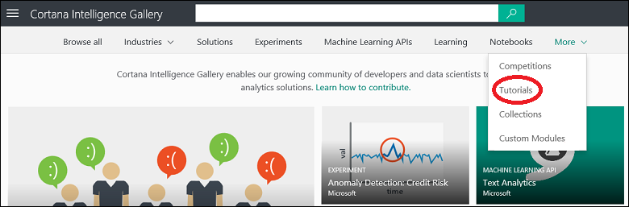

<properties
    pageTitle="Cortana Intelligence Katalog Lernprogramme | Microsoft Azure"
    description="Ermitteln und Lernprogramme im Katalog Intelligence Cortana freigeben."
    services="machine-learning"
    documentationCenter=""
    authors="garyericson"
    manager="jhubbard"
    editor="cgronlun"/>

<tags
    ms.service="machine-learning"
    ms.workload="data-services"
    ms.tgt_pltfrm="na"
    ms.devlang="na"
    ms.topic="article"
    ms.date="10/13/2016"
    ms.author="roopalik;garye"/>

# Ermitteln und Lernprogramme im Katalog Intelligence Cortana freigeben

[AZURE.INCLUDE [machine-learning-gallery-item-selector](../../includes/machine-learning-gallery-item-selector.md)]

## Lernprogramme

Eine Reihe von **[Lernprogramme](https://gallery.cortanaintelligence.com/tutorials)** stehen erweiterte Methoden für verschiedene Computer learning Probleme lösen beschreiben, oder Sie learning-Technologien und Konzepte Computer durchzuführen.

## Ermitteln

Klicken Sie zum Suchen nach Lernprogramme im Katalog öffnen im [Katalog](http://gallery.cortanaintelligence.com), zeigen Sie mit der Maus auf **Weitere** am oberen Rand der Katalog-Homepage, und wählen Sie **Lernprogramme**.

 Die **[Lernprogramme](https://gallery.cortanaintelligence.com/tutorials)** 
 Seite zeigt eine Liste der zuletzt hinzugefügten und am häufigsten verwendeten-Lernprogramme.
Klicken Sie auf **finden Sie unter alle** , um allen Lernprogrammen anzuzeigen.
Auf dieser Seite können Sie allen Lernprogrammen im Katalog durchsuchen, oder Sie können suchen, indem Sie auf der linken Seite der Seite und der Eingabe von Suchbegriffen oben Filterkriterien auswählen.

 Klicken Sie auf eine beliebige Lernprogramm zum Öffnen der Detailseite der Schulung, und Lesen Weitere Informationen.
Auf dieser Seite können Sie kommentieren, ebenfalls Feedback oder Fragen über den Abschnitt "Kommentare". Sie können auch mit Freunden und Kollegen, die Verwendung der Funktionen für die Freigabe von LinkedIn oder Twitter freigeben. Sie können auch einen Link zum Lernprogramm Einladen anderer Benutzer zum Anzeigen der Seite per e-Mail senden.

## Eigene Notizen hinzufügen

Sie können ein Lernprogramm für den Katalog, damit andere Benutzer ein Problem zu lösen, und es wird ein Konzept mitwirken.

### Erstellen Sie ein Lernprogramm

Führen Sie die Schritte zum Erstellen und ein Lernprogramm für den Katalog Cortana Intelligence mitwirken aus:

- Melden Sie sich bei dem Katalog mit Ihrem Microsoft-Konto

- Klicken Sie auf das Bild am oberen Rand des Fensters, und klicken Sie dann auf Ihren Namen

    

- Klicken Sie auf **Neues Element**

    

- Wählen Sie **Websitesammlung** für **Ein Element**aus, und geben Sie der Sammlung einen Namen, eine kurze Übersicht, einer Beschreibung und beliebige Tags ein, mit dem Benutzern die Auflistung nicht finden

    

- Klicken Sie auf **Weiter** – Sie eine Bilddatei hochladen können, oder wählen Sie ein vorhandenen Bilds, die angezeigt wird, klicken Sie mit der Auflistung. Wählen Sie einen Beitrag, mit dem Benutzer den Inhalt und Zweck der Sammlung identifizieren

    

- Klicken Sie auf **Weiter** – Sie können entscheiden, ob das Lernprogramm **öffentlichen** (kann von jeder Person angezeigt werden) oder **Nichtaufgeführter** (nur Personen mit einem direkten Link des Lernprogramms angezeigt werden kann)

    > [AZURE.IMPORTANT] Nachdem Sie ein Lernprogramm auf **Public**festgelegt haben, können Sie nicht auf **Nichtaufgeführter**festlegen.

    

- Klicken Sie auf **Erstellen**

Ihre Lernprogramm ist jetzt Teil der Cortana Intelligence-Katalog. Es werden auf Ihrer Kontoseite unter der Registerkarte **Elemente** aufgelistet.

**[MICH nicht zu den Katalog >>](http://gallery.cortanaintelligence.com)**

[AZURE.INCLUDE [machine-learning-free-trial](../../includes/machine-learning-free-trial.md)]
