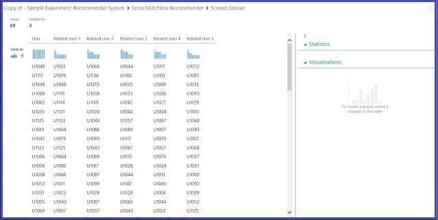

<properties
    pageTitle="Bei der Interpretation Modellergebnisse Computer interessante | Microsoft Azure"
    description="So wählen Sie den optimalen Parameter für einen Algorithmus verwenden und Visualisieren Punktzahl Modell Ausgaben festlegen."
    services="machine-learning"
    documentationCenter=""
    authors="bradsev"
    manager="jhubbard"
    editor="cgronlun"/>

<tags
    ms.service="machine-learning"
    ms.workload="data-services"
    ms.tgt_pltfrm="na"
    ms.devlang="na"
    ms.topic="article"
    ms.date="09/12/2016"
    ms.author="bradsev" />

# Bei der Interpretation Modellergebnisse in Azure Computer lernen

In diesem Thema wird erläutert, wie visualisieren und interpretieren Azure maschinellen Learning Studio Vorhersage ergibt. Nachdem Sie ein Modell gelernt und fertig Vorhersagen darauf ("das Modell bewertet") haben, müssen Sie verstehen und Interpretieren des Ergebnisses Vorhersage.

[AZURE.INCLUDE [machine-learning-free-trial](../../includes/machine-learning-free-trial.md)]

Es gibt vier Bereiche Arten von Datenmodellen in Azure maschinellen Learning learning Computer aus:

* Klassifizierung
* Cluster
* Regressionsanalyse
* Recommender Betriebssysteme

Die Module für die Vorhersage auf diese Modelle verwendet werden:

* [Punktzahl Modell] [ score-model] Modul für die Einstufung und Regression
* [Zuweisen zu Cluster] [ assign-to-clusters] -Modul für Cluster
* [Punktzahl Matchbox Recommender] [ score-matchbox-recommender] für Empfehlungen-Betriebssysteme

Dieses Dokument wird erläutert, wie bei der Interpretation Vorhersageergebnisse für jedes dieser Module. Eine Übersicht über diese Module finden Sie unter [So Parameter zum Optimieren Ihrer Algorithmen Azure Computer interessante verwenden möchten](machine-learning-algorithm-parameters-optimize.md).

Dieses Thema befasst Vorhersage Interpretation aber nicht Modell Auswertung. Weitere Informationen dazu, wie Sie Ihr Modell ausgewertet werden soll finden Sie unter [So Modell Leistung Azure Computer interessante ausgewertet werden soll](machine-learning-evaluate-model-performance.md).

Wenn Sie noch neu bei Azure maschinellen Learning sind und benötigen Sie Hilfe beim Erstellen eines einfachen experimentieren, um anzufangen, finden Sie unter [Erstellen einer einfachen experimentieren in Azure maschinellen Learning Studio](machine-learning-create-experiment.md) in Azure maschinellen Learning Studio.

## Klassifizierung ##
Es gibt zwei Unterkategorien Klassifizierung Probleme:

* Probleme mit nur zwei Klassen (zwei-Klasse oder binäre Klassifizierung)
* Probleme mit mehr als zwei Klassen (mit mehreren Klasse Klassifizierung)

Azure maschinellen Learning weist verschiedene Module für den Umgang mit jeder der folgenden Arten von Klassifizierung, aber die Methoden für die Interpretation von der Ergebnis Vorhersage ähneln.

### Zwei-Klasse Klassifizierung###
**Beispiel experimentieren**

Ein Beispiel für ein Problem Klassifizierung zwei-Klasse ist die Klassifizierung von Iris Blumen. Der Vorgang ist Iris Blumen basierend auf deren Features zu klassifizieren. Datenmenge Iris bereitgestellten Azure Computer interessante eine Teilmenge der beliebte [Iris Datengruppe zurück](http://en.wikipedia.org/wiki/Iris_flower_data_set) , Instanzen von nur zwei Arten der Blume (Klassen 0 und 1) enthalten ist. Es gibt vier Features für jedes Herz (Sepal Länge, Sepal Breite, sodass Länge und Breite des Blatts).

Abbildung 1. Iris-Klasse zwei Klassifizierung Problem experimentieren

Ein Versuch wurde zur Lösung dieses Problems erledigt, wie in Abbildung 1 dargestellt. Ein zwei-Klasse stärkere Entscheidungsbaummodell wurde gelernt bewertet und. Jetzt können Sie die Vorhersageergebnisse aus dem [Modell Punktzahl] visualisieren[ score-model] Modul, indem Sie auf den Ausgang des [Modells Punktzahl] [ score-model] Modul und dann auf **visualisieren**.

Dadurch wird die Punktzahl Ergebnisse wie in Abbildung 2 dargestellt.

Abbildung 2. Visualisieren Sie ein Modellergebnis Punktzahl in zwei-Klasse Klassifikation

**Ergebnis interpretation**

Es gibt sechs Spalten in der Ergebnistabelle aus. Die linken vier Spalten sind die vier Features. Die rechts zwei Spalten, Etiketten bewertet und Wahrscheinlichkeiten bewertet, sind die Vorhersageergebnisse. Die Spalte Wahrscheinlichkeiten bewertet zeigt die Wahrscheinlichkeit, die eine Blume gehört zur positive Klasse (Klasse 1). Die erste Zahl in der Spalte (0.028571) bedeutet es beträgt beispielsweise 0.028571 Wahrscheinlichkeit, dass die erste Blume Klasse 1 gehört. Die Spalte bewertet Etiketten zeigt die geschätzte Klasse für jedes Herz. Klicken Sie auf die Spalte Wahrscheinlichkeiten bewertet basiert. Wenn die Wahrscheinlichkeit, dass eine Blume bewertete größer als 0,5 ist, wird es als 1 Class regressionsgleichung. Andernfalls wird es als Klasse 0 regressionsgleichung.

**Webpublikation-Dienst**

Nachdem die Vorhersageergebnisse verstanden und sound als haben, kann die experimentieren als Webdienst veröffentlicht werden, damit Sie ihn in verschiedenen Anwendung bereitstellen und nennen Sie diese Klasse Vorhersagen auf alle neuen Iris Blume erhalten können. Informationen zum Ändern einer Schulung experimentieren in einer Punktzahl experimentieren und als Webdienst veröffentlichen, finden Sie unter [Veröffentlichen der Azure maschinellen Learning-Webdienst](machine-learning-walkthrough-5-publish-web-service.md). Dieses Verfahren bietet eine Punktzahl experimentieren siehe Abbildung 3.

Abbildung 3. Die Iris zwei-Klasse Klassifizierung Problem experimentieren bewerten

Sie müssen jetzt ein- und Ausgabe für den Webdienst festlegen. Die Eingabe ist der richtigen Eingang des [Modells Punktzahl][score-model], welche die Iris Blume ist Eingabesprache features. Die Wahl der Ausgabe hängt davon ab, ob Sie die geschätzte Klasse (bewertete Beschriftung), die bewertete Wahrscheinlichkeit oder beides interessiert sind. In diesem Beispiel wird davon ausgegangen, dass Sie beide interessiert sind. Verwenden Sie zum Auswählen der gewünschten Ausgabespalten einer [Spalten auswählen aus Datenmenge] [ select-columns] Modul. Klicken Sie auf [Spalten auswählen aus Datenmenge][select-columns], klicken Sie auf **Spalte Ansichtsauswahl starten**, und wählen Sie **Etiketten bewertet** und **Wahrscheinlichkeiten bewertet**. Nach dem Einrichten der Ausgang von [Spalten in einer Datengruppe zurück auswählen] [ select-columns] und erneut ausführen, Sie sollten die Punktzahl experimentieren als Webdienst veröffentlichen, indem Sie auf **Webdienst veröffentlichen**. Die endgültige experimentieren sieht wie Abbildung 4 aus.

Abbildung 4. Endgültige Punktzahl experimentieren ein Iris zwei-Klasse Klassifizierung Problem bei der

Nachdem Sie den Webdienst ausführen, und geben Sie eine Testinstanz einige Features Werte, gibt als Ergebnis zweier Zahlen zurück. Die erste Zahl ist die Bezeichnung bewertete und die Sekunde bewertete Wahrscheinlichkeit. Diese Blume wird als Klasse 1 mit 0.9655 Wahrscheinlichkeit regressionsgleichung.

Abbildung 5. Web Service Ergebnis Iris zwei-Klasse Klassifizierung

### Mehrere Class "Klassifikation"
**Beispiel experimentieren**

In diesem Versuch führen Sie einen Vorgang Buchstaben-Spracherkennung als Beispiel multiclass Klassifizierung aus. Klassifizierung versucht, die einem bestimmten Buchstaben (Klasse) auf der Grundlage einige handschriftlich Attributwerte extrahiert aus den Bildern handschriftlich Vorhersagen.

Es gibt 16 Features aus Buchstaben handschriftlich Bilder extrahiert, in den Daten Schulung. Die 26 Buchstaben bilden unsere 26 Klassen. Abbildung 6 zeigt ein Versuch, die ein Muster multiclass Klassifizierung Buchstaben Spracherkennung Schulen und Vorhersagen auf das gleiche Feature auf einer Datenmenge Test festlegen.

Abbildung 6. Buchstabe Spracherkennung multiclass Klassifizierung Problem experimentieren

Die Ergebnisse aus dem [Modell Punktzahl] visualisieren[ score-model] Modul, indem Sie auf den Ausgang des [Modells Punktzahl] [ score-model] Modul, und klicken Sie dann auf **visualisieren**, sollten Sie finden Sie unter Inhalt wie in Abbildung 7 dargestellt.

Abbildung 7. Visualisieren Sie Modell Resultat in einer mit mehreren Klasse Klassifikation

**Ergebnis interpretation**

Die Links 16 Spalten darstellen die Funktion Werte testen festlegen. Spalten mit Namen wie bewertet Wahrscheinlichkeiten für Klasse "XX" nur werden wie die Spalte Wahrscheinlichkeiten bewertet in den beiden-Klasse Fall. Sie die Wahrscheinlichkeit angezeigt, die der entsprechende Eintrag in einer bestimmten Kategorie fällt. Für den ersten Eintrag beträgt beispielsweise 0.003571 Wahrscheinlichkeit, dass es ist ein "A" 0.000451 Wahrscheinlichkeit, dass es sich um ein "B" usw. ist. Die letzte Spalte (bewertet Etiketten) entspricht dem bewertet Etiketten in den beiden-Klasse Fall. Er wählt die Klasse mit der größten bewertete Wahrscheinlichkeit als geschätzte Klasse der den entsprechenden Eintrag aus. Beispielsweise ist für den ersten Eintrag, die bewertete Bezeichnung "F" da es ein "F" (0.916995) werden die größte Wahrscheinlichkeit verfügt.

**Webpublikation-Dienst**

Sie können auch die bewertete Bezeichnung für jeden Eintrag und die Wahrscheinlichkeit, dass die Bezeichnung bewertete abrufen. Die Grundidee besteht darin, die größte Wahrscheinlichkeit zwischen bewertete Wahrscheinlichkeiten zu suchen. Dazu müssen Sie das [Ausführen R Skript] verwenden[ execute-r-script] Modul. Der R-Code in Abbildung 8 dargestellt ist, und das Ergebnis der Versuch in Abbildung 9 dargestellt wird.

Abbildung 8. R-Code zum Extrahieren von Beschriftungen bewertet und die zugehörigen Wahrscheinlichkeit von Etiketten

Abbildung 9. Endgültige Punktzahl experimentieren des Problems multiclass Klassifizierung Buchstaben-Spracherkennung

Veröffentlichen Sie nach dem, und führen Sie den Webdienst, und geben Sie einige Features von Werte, sieht die zurückgegebene Ergebnis wie aus Abbildung 10. Diesen Brief handschriftlich mit seiner extrahierten 16 Features, ist regressionsgleichung "T" mit 0.9715 Wahrscheinlichkeit sein.

Abbildung 10. Web Service Ergebnis multiclass Klassifizierung

## Regressionsanalyse

Regressionsprobleme unterscheiden sich von Klassifizierung Probleme. In ein Problem Klassifizierung versuchen Sie diskrete Klassen, Vorhersagen, wie etwa, denen Klasse eine Iris Blume gehört. Aber wie im folgenden Beispiel eines Problems Regression sehen ist, versuchen Sie, eine kontinuierliche Variable, z. B. den Preis eines Autos Vorhersagen.

**Beispiel experimentieren**

Verwenden Sie Autos Preis Vorhersage wie Ihre Beispiel für Regression. Sie versuchen, den Preis für ein Auto basierend auf deren Features, einschließlich Tabellenerstellungsabfrage Kraftstofftyps, und Textkörpertyp Laufwerk Mausrad Vorhersagen. Abbildung 11 wird der Versuch angezeigt.

Abbildung 11. Kurs Autos Regression Problem experimentieren

Visualisieren der [Punktzahl Modell] [ score-model] Modul, das Ergebnis sieht aus wie Abbildung 12.

Abbildung 12. Ergebnis Problems Vorhersage Autos Kurs

**Ergebnis interpretation**

Bewertete Etiketten ist der Ergebnisspalte dieses Ergebnis. Die Zahlen sind die geschätzte Preis für jede Auto.

**Webpublikation-Dienst**

Die Regression experimentieren in einem Webdienst veröffentlichen können und nennen Sie diese auf die gleiche Weise wie in den beiden-Klasse Klassifizierung Anwendungsfall-für Autos Preis Vorhersage.

Abbildung 13. Bewerten experimentieren ein Autos Preis Regression Problem bei der

Ausführen des Webdiensts, sieht Abbildung 14 zurückgegebene Ergebnis. Der geschätzte Preis für diese Auto ist $15,085.52.

Abbildung 14. Web Service als Ergebnis eines Autos Preis Regression problem

## Cluster

**Beispiel experimentieren**

Wir verwenden Sie Iris Datenmenge wieder zum Erstellen einer Cluster experimentieren. Hier können Sie der Klasse Etiketten in den Datensatz ein herausfiltern, sodass nur verfügt über Features und für Cluster verwendet werden können. Verwenden Sie in diesem Iris Fall, geben Sie die Anzahl der Cluster zwei während des Schulungsprozesses sein, was bedeutet, dass Sie die Blumen in zwei Klassen gruppieren möchten. Abbildung 15 wird der Versuch angezeigt.

Abbildung 15. Iris Cluster Problem experimentieren.

Cluster unterscheidet sich von der Einstufung dieses Datenmenge Schulung Grund-Wahrheitswert Etiketten allein aufweist. Cluster Gruppen die Schulung Datenmenge Instanzen in unterschiedlichen Cluster getrennt. Während des Schulungsprozesses Etiketten das Modell die Einträge lernen Sie die Unterschiede zwischen den Features auf. Anschließend kann ausgebildete Modell zu weiteren zukünftigen Einträge Klassifizierung verwendet werden. Es gibt zwei Teilen des Ergebnisses, das wir innerhalb eines Problems Cluster interessiert. Im erste Teil der Datenmenge Schulung beschriften ist, und das zweite ist einen neuen Datensatz mit dem Modell ausgebildeten klassifizieren.

Der erste Teil des Ergebnisses kann dargestellt werden, indem Sie auf der linken Ausgang von [Zug Cluster Modell] [ train-clustering-model] und dann auf **visualisieren**. Abbildung 16 wird die Visualisierung angezeigt.

Abbildung 16. Visualisieren Sie Cluster Ergebnis für die Schulung Datengruppe zurück

Abbildung 17 wird das Ergebnis des zweiten Teils, neue Einträge mit dem Modell ausgebildeten Cluster, Cluster angezeigt.

Abbildung 17. Visualisieren Sie Cluster Ergebnis auf einen neuen Datensatz

**Ergebnis interpretation**

Obwohl die Ergebnisse von zwei Teilen aus verschiedenen experimentieren Phasen abgelenkt werden, sie gleich aussehen und auf die gleiche Weise interpretiert werden. Die ersten vier Spalten sind die Features. Die letzte Spalte, Zuordnungen, ist das Vorhersageergebnis. Die Einträge, die die gleiche Anzahl zugewiesen werden regressionsgleichung im selben Cluster, d. h., werden diese gemeinsamkeiten in irgendeiner Weise freigeben (diesem Versuch verwendet die standardmäßige euklidischen Abstand Metrisch). Da Sie die Anzahl der Cluster 2 angegeben haben, sind die Einträge in Zuordnungen 0 oder 1 bezeichnet.

**Webpublikation-Dienst**

Die Cluster experimentieren in einem Webdienst veröffentlichen können und nennen Sie diese für die gleiche Weise wie in den beiden-Klasse Klassifizierung mit Case / Vorhersagen Cluster.

Abbildung 18. Bewerten experimentieren ein Iris Cluster Problem bei der

Nachdem Sie den Webdienst ausführen sieht Abbildung 19 das zurückgegebene Ergebnis. Diese Blume ist regressionsgleichung Cluster 0 sein.

Abbildung 19. Web Service Ergebnis Iris zwei-Klasse Klassifizierung

## Recommender system
**Beispiel experimentieren**

Recommender Systeme, Sie können das Restaurant Empfehlungen Problem als Beispiel: können Sie Restaurants für Kunden basierend auf deren Verlauf Bewertung empfohlen. Die Eingabedaten besteht aus drei Teilen:

* Restaurant Bewertungen von Kunden
* Feature Kundendaten
* Restaurant Featuredaten

Es gibt mehrere Bereiche, die wir Sie mit der [Zug Matchbox Recommender führen können] [ train-matchbox-recommender] Modul Azure Computer interessante:

- Vorhersagen von Bewertungen für einen bestimmten Benutzer und Element
- Elemente in einem bestimmten Benutzer empfehlen
- Suchen Sie Benutzer, die im Zusammenhang mit einem bestimmten Benutzer
- Suchen Sie nach Elementen, die im Zusammenhang mit einem bestimmten Element

Sie können auswählen, was Sie tun, indem Sie im Menü **Recommender Vorhersage Art** der vier Optionen auswählen möchten. Hier können Sie alle vier Szenarien durchzuführen.

Eine typische experimentieren Sie mit Azure maschinellen Learning eines Systems Recommender sieht wie Abbildung 20 aus. Informationen dazu, wie diese Recommender Systemmodule verwendet werden, finden Sie unter [Zug Matchbox Recommender] [ train-matchbox-recommender] und [Punktzahl Matchbox Recommender][score-matchbox-recommender].

Abbildung 20. Recommender System experimentieren

**Ergebnis interpretation**

**Vorhersagen von Bewertungen für einen bestimmten Benutzer und Element**

Indem Sie die **Bewertung Vorhersage** unter **Recommender Vorhersage Art**auswählen, werden Sie das Recommender-System, um die Bewertung für einen bestimmten Benutzer und Element Vorhersagen Fragen. Die Visualisierung von der [Punktzahl Matchbox Recommender] [ score-matchbox-recommender] Ausgabe sieht wie Abbildung 21 aus.

Abbildung 21. Visualisieren Sie das Ergebnis Punktzahl des Systems Recommender--Bewertung Vorhersage

Die ersten beiden Spalten sind die Benutzer-Element-Paare bereitgestellt werden, indem Sie die eingegebenen Daten. Die dritte Spalte ist die geschätzte Bewertung eines Benutzers für ein bestimmtes Element. In der ersten Zeile, z. B. ist Kunden: U1048 zu Rate Restaurant 135026 als 2 regressionsgleichung.

**Elemente in einem bestimmten Benutzer empfehlen**

Indem Sie **Empfehlungen Element** unter **Recommender Vorhersage Art**auswählen, sind, Fragen Sie das Recommender-System, um Elemente zu einem bestimmten Benutzer empfohlen. Der letzte Parameter wählen Sie in diesem Szenario ist *Elementauswahl empfohlen*. Die Option ist **Von bewertet Elemente (für Modell Auswertung)** hauptsächlich für Modell Auswertung während des Schulungsprozesses. Wählen Sie für diese Phase Vorhersage wir **Alle Elemente**aus. Die Visualisierung von der [Punktzahl Matchbox Recommender] [ score-matchbox-recommender] Ausgabe sieht wie Abbildung 22 aus.

Abbildung 22. Visualisieren Sie Punktzahl Ergebnis des Systems Recommender – Element Empfehlungen

Das erste der sechs Spalten darstellt die angegebene Benutzer-IDs Elemente, empfehlen, wie die Eingabedaten genannt. Die anderen fünf Spalten dar, die Elemente, die für den Benutzer in absteigender Reihenfolge nach Relevanz empfohlen. In der ersten Zeile beträgt beispielsweise das am häufigsten empfohlene Restaurant für Kunden: U1048 134986, gefolgt von 135018, 134975, 135021 und 132862 an.

**Suchen Sie Benutzer, die im Zusammenhang mit einem bestimmten Benutzer**

Indem Sie die **Zugehörigen Benutzer** unter **Recommender Vorhersage Art**auswählen, haben Sie das Recommender-System, um verwandte Benutzer zu einem bestimmten Benutzer suchen fragt. Verwandte Benutzer können sich die Benutzer, die ähnliche Voreinstellungen haben. Der letzte Parameter in diesem Szenario auswählen ist die *Auswahl der entsprechenden Benutzerinformationen*. Die Option ist **Von Benutzern, dass bewertet Elemente (für Modell Auswertung)** hauptsächlich für Modell Auswertung während des Schulungsprozesses. Wählen Sie **Alle Benutzer** für diese Stufe Vorhersage aus. Die Visualisierung von der [Punktzahl Matchbox Recommender] [ score-matchbox-recommender] Ausgabe sieht wie Abbildung 23 aus.

Abbildung 23. Visualisieren Sie Resultat des Systems Recommender – Verwandte Benutzer

Die erste der sechs Spalten zeigt dem angegebenen Benutzer IDs benötigt werden, um verwandte Benutzer Suchen von Eingabedaten zur Verfügung gestellt. Die anderen fünf Spalten speichern die geschätzte Verwandte Benutzer des Benutzers in absteigender Reihenfolge nach Relevanz. In der ersten Zeile beträgt beispielsweise der relevantesten Kunde für Kunden: U1048: U1051, gefolgt von U1066, U1044,: U1017 und: U1072 an.

**Suchen Sie nach Elementen, die im Zusammenhang mit einem bestimmten Element**

Durch Auswählen von **Zugehörigen Elemente** unter **Recommender Vorhersage Art**, Fragen Sie das Recommender-System, um verwandte Elemente zu einem bestimmten Element suchen. Verwandte Elemente sind die Elemente, die vor allem vom gleichen Benutzer befunden werden. Der letzte Parameter, wählen Sie in diesem Szenario ist *zugehörige Elementauswahl*. Die Option ist **Von bewertet Elemente (für Modell Auswertung)** hauptsächlich für Modell Auswertung während des Schulungsprozesses. Wir wählen Sie **Alle Elemente aus** dieser Phase Vorhersage aus. Die Visualisierung von der [Punktzahl Matchbox Recommender] [ score-matchbox-recommender] Ausgabe sieht wie Abbildung 24 aus.

Abbildung 24. Visualisieren Sie Resultat des Systems Recommender – verwandte Elemente

Die erste der sechs Spalten steht für das angegebene Element IDs zum finden verwandter Elemente erforderlich sind, wie die Eingabedaten genannt. Die anderen fünf Spalten speichern die geschätzte verwandte Elemente des Elements in absteigender Reihenfolge im Hinblick auf erzielen. In der ersten Zeile beträgt beispielsweise das Element relevanteste für Element 135026 135074, gefolgt von 135035, 132875, 135055 und 134992 an.

**Webpublikation-Dienst**

Der Prozess der Veröffentlichung dieser Versuche als Webdienste abzurufenden Vorhersagen ähnelt für jedes der vier Szenarien. Machen Sie hier das zweite Szenario (Elemente zu einem bestimmten Benutzer empfohlen) als Beispiel. Führen Sie dasselbe Verfahren, das mit den anderen drei.

Das System ausgebildeten Recommender als ausgebildeten Modell speichern, und Filtern die Eingabedaten mit einer einzelnen Benutzer-ID-Spalte aus, wie gewünscht, können Sie den Versuch, wie in der Abbildung 25 eingebunden und als Webdienst veröffentlichen.

Abbildung 25. Bewerten experimentieren des Problems Restaurant Empfehlungen

Ausführen des Webdiensts, sieht Abbildung 26 zurückgegebene Ergebnis. Die fünf empfohlenen Restaurants für Benutzer: U1048 sind 134986, 135018, 134975, 135021 und 132862.

Abbildung 26. Web Service Ergebnis Restaurant Empfehlungen problem

<!-- Module References -->
[assign-to-clusters]: https://msdn.microsoft.com/library/azure/eed3ee76-e8aa-46e6-907c-9ca767f5c114/
[execute-r-script]: https://msdn.microsoft.com/library/azure/30806023-392b-42e0-94d6-6b775a6e0fd5/
[select-columns]: https://msdn.microsoft.com/library/azure/1ec722fa-b623-4e26-a44e-a50c6d726223/
[score-matchbox-recommender]: https://msdn.microsoft.com/library/azure/55544522-9a10-44bd-884f-9a91a9cec2cd/
[score-model]: https://msdn.microsoft.com/library/azure/401b4f92-e724-4d5a-be81-d5b0ff9bdb33/
[train-clustering-model]: https://msdn.microsoft.com/library/azure/bb43c744-f7fa-41d0-ae67-74ae75da3ffd/
[train-matchbox-recommender]: https://msdn.microsoft.com/library/azure/fa4aa69d-2f1c-4ba4-ad5f-90ea3a515b4c/
