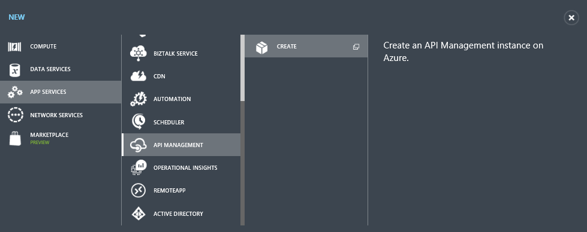

<properties
    pageTitle="Informationen zum Verwalten von AzureML Webdienste-API Management mit | Microsoft Azure"
    description="Ein Handbuch mit zum Verwalten von AzureML Webdienste-API Management verwenden."
    keywords="Computer-api Management zu lernen"
    services="machine-learning"
    documentationCenter=""
    authors="roalexan"
    manager="jhubbard"
    editor=""/>

<tags
    ms.service="machine-learning"
    ms.workload="data-services"
    ms.tgt_pltfrm="na"
    ms.devlang="na"
    ms.topic="article"
    ms.date="09/16/2016"
    ms.author="roalexan" />

# Informationen Sie zum Verwalten von AzureML Webdienste-API Management verwenden

##(Übersicht)

In diesem Handbuch wird gezeigt, wie mithilfe von zum Verwalten Ihrer AzureML Webdienste-API Management schnellen Einstieg.

##Was ist der Azure-API Management?

Azure-API Management ist eine Azure-Dienst, in der Sie Ihrer Endpunkte REST-API durch Definieren des Benutzerzugriffs, begrenzungsebene Verwendung und Überwachung Dashboard verwalten kann. Klicken Sie auf [hier](https://azure.microsoft.com/services/api-management/) Weitere Informationen zur Verwaltung von Azure-API. Klicken Sie auf [hier](../api-management/api-management-get-started.md) eine Anleitung, wie Sie den ersten Schritten mit Azure-API Management. Dieses Handbuch andere, in dem mit diesem Leitfaden basiert, behandelt weitere Themen, einschließlich Benachrichtigung Konfigurationen, Preise Ebene, Bearbeitung von Antworten, Benutzerauthentifizierung, Produkten, Entwicklertools Abonnements und Verwendung Dashboarding erstellen.

##Was ist AzureML?

AzureML ist eine Azure-Dienst für maschinelle learning, mit dem Sie auf einfache Weise erstellen, bereitstellen und erweiterte Analytics Lösungen freigeben. Klicken Sie auf [hier](https://azure.microsoft.com/services/machine-learning/) ausführliche Informationen zum AzureML.

##Erforderliche Komponenten

Um dieses Handbuch abgeschlossen haben, müssen Sie folgende Aktionen ausführen:

* Ein Azure-Konto. Wenn Sie ein Azure-Konto besitzen, klicken Sie auf [hier](https://azure.microsoft.com/pricing/free-trial/) Weitere Informationen zum Erstellen eines kostenlosen Testversion Kontos.
* Ein Konto AzureML. Wenn Sie kein AzureML-Konto haben, klicken Sie auf [hier](https://studio.azureml.net/) Weitere Informationen zum Erstellen eines kostenlosen Testversion Kontos.
* Der Arbeitsbereich, Service und Api_key für eine AzureML experimentieren als Webdienst bereitgestellt. Klicken Sie auf [hier](machine-learning-create-experiment.md) Weitere Informationen zum Erstellen einer AzureML experimentieren. Klicken Sie auf [hier](machine-learning-publish-a-machine-learning-web-service.md) ausführliche Informationen zu einem AzureML Versuch als Webdienst bereitstellen. Alternativ muss Anhang A Anleitungen zum Erstellen einer einfachen AzureML experimentieren testen und ihn als Webdienst bereitstellen.

##Erstellen Sie eine Instanz Management-API

Im folgenden sind die Schritte zur Verwendung von Management-API zum Verwalten Ihrer AzureML-Webdiensts ein. Erstellen Sie zuerst eine Instanz aus. Melden Sie sich der [Klassischen Portal](https://manage.windowsazure.com/) , und klicken Sie auf **neu** > **App Services** > **-API Management** > **Erstellen**.

Geben Sie einen eindeutigen **URL**an. Dieses Handbuch verwendet **Demoazureml** – Sprachmodule benötigen Sie etwas anderes auswählen. Wählen Sie das gewünschte **Abonnement** und die **Region** für Ihre Service-Instanz aus. Klicken Sie nachdem Sie Ihre Auswahl getroffen haben auf die Schaltfläche Weiter.

Geben Sie einen Wert für den **Namen der Organisation**an. Dieses Handbuch verwendet **Demoazureml** – Sprachmodule benötigen Sie etwas anderes auswählen. Geben Sie Ihre e-Mail-Adresse im Feld **Administrator E-mail** aus. Diese e-Mail-Adresse ist für Benachrichtigungen aus der System-API verwendet.

Klicken Sie auf das Kontrollkästchen, um Ihre Service-Instanz zu erstellen. *Es dauert bis zu 30 Minuten für eine neue Dienstleistung erstellt werden*.

##Erstellen der-API

Nachdem die Instanz des Diensts erstellt wurde, besteht der nächste Schritt die-API zu erstellen. Eine API besteht aus einer Reihe von Vorgängen, die von einer Clientanwendung aufgerufen werden können. Proxy auf vorhandene Webdienste-API Vorgänge sind. In diesem Handbuch erstellt APIs dieser Proxy mit den vorhandenen AzureML RRS und l-Webdiensten.

APIs erstellt und konfiguriert vom Portal Publisher API, die über das klassische Azure-Portal zugegriffen werden kann. Um das Publisher-Portal zu erreichen, wählen Sie Ihre Service-Instanz aus.

Klicken Sie auf **Verwalten** im klassischen Azure-Portal für Ihre API Verwaltungsdienst.

Klicken Sie im Menü " **API Management** " auf der linken Seite auf **APIs** , und klicken Sie dann auf **API hinzufügen**.

Geben Sie **AzureML Demo-API** als **Web-API Namen**ein. Geben Sie **https://ussouthcentral.services.azureml.net** als die **Webdienst-URL**ein. Geben Sie **Azureml-Demo** als **Suffix API-Web-URL**ein. Aktivieren Sie **HTTPS** als Schema **API-Web-URL** ein. Wählen Sie als **Produkte** **Starter** aus. Klicken Sie abschließend auf **Speichern** , um die-API erstellen.

##Fügen Sie Vorgänge hinzu.

Klicken Sie auf **Vorgang hinzufügen** , um diese API Vorgänge hinzufügen.

Klicken Sie im **neuen Vorgang** wird angezeigt, und die Registerkarte **Signatur** wird standardmäßig aktiviert werden.

##RRS Vorgang hinzufügen

Erstellen Sie zuerst einen Vorgang für den Dienst AzureML RRS ein. Wählen Sie als das **http-Verb** **Bereitstellen** . Typ **/workspaces/ {Arbeitsbereich} /services/ {Dienst} / Execute?api-Version = {Apiversion} & Details = {Details}** wie die **URL-Vorlage**. Geben Sie als **Anzeigename** **RRS ausführen** .

Klicken Sie auf **Antworten** > **HINZUZUFÜGEN** , klicken Sie auf die Links, und wählen **200 OK**. Klicken Sie auf **Speichern** , um diesen Vorgang zu speichern.

##Hinzufügen von Vorgängen l

Screenshots sind nicht für die Vorgänge l enthalten, wie sehr ähnlich für den Vorgang RRS hinzufügen.

###Senden ein Auftrags Stapel Datenausführungsverhinderung (aber nicht gestartet werden)

Klicken Sie auf **Vorgang hinzufügen** , um den Vorgang AzureML l die API hinzuzufügen. Wählen Sie für das **http-Verb** **Bereitstellen** . Typ **/workspaces/ {Arbeitsbereich} /services/ {Dienst} / Jobs?api-Version = {Apiversion}** für die **URL-Vorlage**. Geben Sie für den **Anzeigenamen** **L zu übermitteln** . Klicken Sie auf **Antworten** > **HINZUZUFÜGEN** , klicken Sie auf die Links, und wählen **200 OK**. Klicken Sie auf **Speichern** , um diesen Vorgang zu speichern.

###Starten eines Auftrags Stapel Ausführung

Klicken Sie auf **Vorgang hinzufügen** , um den Vorgang AzureML l die API hinzuzufügen. Wählen Sie für das **http-Verb** **Bereitstellen** . Typ **/workspaces/ {Arbeitsbereich} /services/ {Dienst} /jobs/ {Auftrags} / Start?api-Version = {Apiversion}** für die **URL-Vorlage**. Geben Sie für den **Anzeigenamen** **L zu starten** . Klicken Sie auf **Antworten** > **HINZUZUFÜGEN** , klicken Sie auf die Links, und wählen **200 OK**. Klicken Sie auf **Speichern** , um diesen Vorgang zu speichern.

###Erhalten Sie den Status oder das Ergebnis eines Auftrags Stapel Ausführung

Klicken Sie auf **Vorgang hinzufügen** , um den Vorgang AzureML l die API hinzuzufügen. Wählen Sie für das **http-Verb** **Abrufen** . Typ **/workspaces/ {Arbeitsbereich} /services/ {Dienst} /jobs/ {Auftrags} ?api Version = {Apiversion}** für die **URL-Vorlage**. Geben Sie **L Status** für den **Anzeigenamen**ein. Klicken Sie auf **Antworten** > **HINZUZUFÜGEN** , klicken Sie auf die Links, und wählen **200 OK**. Klicken Sie auf **Speichern** , um diesen Vorgang zu speichern.

###Löschen eines Auftrags Stapel Ausführung

Klicken Sie auf **Vorgang hinzufügen** , um den Vorgang AzureML l die API hinzuzufügen. Wählen Sie **Löschen** aus, für das **http-Verb**. Typ **/workspaces/ {Arbeitsbereich} /services/ {Dienst} /jobs/ {Auftrags} ?api Version = {Apiversion}** für die **URL-Vorlage**. Geben Sie für den **Anzeigenamen** **L löschen** . Klicken Sie auf **Antworten** > **HINZUZUFÜGEN** , klicken Sie auf die Links, und wählen **200 OK**. Klicken Sie auf **Speichern** , um diesen Vorgang zu speichern.

##Rufen Sie die Entwicklerportal eines Vorgangs

Vorgänge können direkt von der Entwicklerportal bietet eine bequeme Möglichkeit zum Anzeigen und testen die Vorgänge einer API aufgerufen werden. In diesem Leitfaden Schritt rufen Sie die Methode **RRS ausführen** , die das die **AzureML Demo-API**hinzugefügt wurde. Klicken Sie im Menü am oberen **Entwicklerportal** auf rechts des klassischen Portals.

Klicken Sie im oberen Menü auf **APIs** , und klicken Sie dann auf **AzureML Demo-API** , um die verfügbaren Vorgänge anzuzeigen.

Wählen Sie für den Vorgang **RRS ausführen** . Klicken Sie auf, **Probieren Sie es**.

Geben Sie für Anforderung-Parameter der **Arbeitsbereich**, **Service**, **2.0** für die **Apiversion**und **Wahr** für die **Details**aus. **Arbeitsbereich** und **Service** finden Sie im Dashboard AzureML Web Service (siehe **Testen der Webdienst** in Anhang A).

Anfrage-Header, klicken Sie auf **Kopfzeile hinzufügen** **Inhaltstyp** und **Anwendung/Json**, und klicken Sie auf **Kopfzeile hinzufügen** und geben **Autorisierung** geben und **Person <YOUR AZUREML SERVICE API-KEY> **. Finden Sie den **API-Schlüssel** im Dashboard AzureML Web Service (siehe **Testen der Webdienst** in Anhang A).

Typ **{"Eingaben": {"input1": {"ColumnNames": ["SP2"], "Werte": [["Dies ist eine gute Tag"]]}}, "GlobalParameters": {}}** für den Hauptteil der Anforderung.

Klicken Sie auf **Senden**.

Nachdem ein Vorgang aufgerufen wird, zeigt die Entwicklerportal die **URL angefordert** von Back-End-Dienst, den **Status der Antwort**, die **Antwort Kopf-**und alle **Inhalte der Antwort**an.

##Anhang A - erstellen und Testen einer einfachen AzureML-Webdienst ab

###Erstellen des Versuchs

Nachfolgend finden Sie die Schritte zum Erstellen einer einfachen AzureML experimentieren und es als Webdienst bereitstellen. Der dauert der Web-Dienst als Eingabe eine Spalte mit beliebigem Text und gibt eine Reihe von Features, die als ganze Zahlen dargestellt. Beispiel:

Text | Gestrichelte Text
--- | ---
Dies ist eine gute Tag | 1 1 2 2 0 2 0 1

Mithilfe eines Browsers Ihrer Wahl, navigieren Sie zuerst zu: [https://studio.azureml.net/](https://studio.azureml.net/) , und geben Sie Ihre Anmeldeinformationen ein, melden Sie sich an. Als Nächstes erstellen Sie eine neue leere experimentieren.

In **SimpleFeatureHashingExperiment**umbenennen. Erweitern Sie **Datasets gespeichert** , und ziehen Sie **Adressbuch Bewertungen von Amazon** auf Ihre experimentieren.

Erweitern Sie **Datentransformation** und **Bearbeitung** , und ziehen Sie **Spalten im Dataset auswählen** auf Ihre experimentieren. Verbinden Sie **Adressbuch Bewertungen von Amazon** **im Dataset Spalten**auswählen aus.

Klicken Sie auf **Spalten im Dataset auswählen** und klicken Sie auf **Spalte Ansichtsauswahl starten** , und wählen Sie **SP2**. Klicken Sie auf das Häkchen, um diese Änderungen zu übernehmen.

Erweitern Sie **Text Analytics** , und ziehen Sie die **Feature Hashing** auf den Versuch. Verbinden Sie zum **Feature Hashing** **Wählen Sie Spalten im Dataset aus** .

Geben Sie für das **Hashing Bitsize** **3** ein. Dadurch wird erstellt 8 (23) Spalten.

An diesem Punkt sollten Sie **Ausführen** , um den Versuch zu testen klicken.

###Erstellen von einem Webdienst

Erstellen Sie jetzt einen Webdienst. Erweitern Sie **Webdienst** aus, und ziehen Sie **Eingabe** auf Ihre experimentieren. Herstellen einer Verbindung **Feature Hashing**mit " **Eingabe** ". Ziehen Sie auch **die Ausgabe** auf Ihre experimentieren. Schließen Sie **die Ausgabe** an **Feature Hashing**ein.

Klicken Sie auf **Webdienst veröffentlichen**.

Klicken Sie auf **Ja,** um den Versuch zu veröffentlichen.

###Testen des Webdiensts

Ein Webdienst AzureML besteht aus RSS (Anforderung/Antwort-Dienst) und l (Stapel Ausführung Service) Endpunkte. RSS ist für die Ausführung synchroner. L ist für die Ausführung asynchrone Auftrags. Klicken Sie zum Testen des Webdiensts mit den folgenden Sample Python Source müssen Sie herunterladen und Installieren der Azure SDK für Python (finden Sie unter: [So installieren Sie Python](../python-how-to-install.md)).

Sie benötigen außerdem den **Arbeitsbereich**, **Service**und **Api_key** von Ihrem experimentieren für die Stichprobe Quelle unten. Sie können der Arbeitsbereich und der Dienst suchen, indem Sie entweder **Anforderung/Antwort** oder **Stapel Ausführung** für Ihre experimentieren im Web Service Dashboard auf.

Sie können die **Api_key** durch Klicken auf Ihre experimentieren im Web Service Dashboard suchen.

####Test RRS Endpunkt

#####Schaltfläche "testen"

Eine einfache Möglichkeit, den Endpunkt RRS testen ist auf **Testen** klicken mit der Web-Service-Dashboard.

Geben Sie **Dies ist ein guter Tag** für **SP2**aus. Klicken Sie auf das Häkchen.

Sie sehen ungefähr wie folgt

#####Beispiel-Code

Eine weitere Möglichkeit zum Testen der RRS befindet sich in der Client-Code. Wenn Sie auf dem Dashboard und Durchführen eines Bildlaufs zur unteren **Anforderung/Antwort** klicken, finden Stichprobe Sie Code für c#, Python und R. Außerdem sehen Sie die Syntax der Anfrage RRS, einschließlich der Anfrage-URI, Überschriften und Textkörper.

Dieses Handbuch zeigt ein Beispiel für Python nicht funktioniert. Sie müssen zu ändern, mit der **Arbeitsbereich**, **Service**und **Api_key** von Ihrem experimentieren.

    import urllib2
    import json
    workspace = "<REPLACE WITH YOUR EXPERIMENT’S WEB SERVICE WORKSPACE ID>"
    service = "<REPLACE WITH YOUR EXPERIMENT’S WEB SERVICE SERVICE ID>"
    api_key = "<REPLACE WITH YOUR EXPERIMENT’S WEB SERVICE API KEY>"
    data = {
    "Inputs": {
        "input1": {
            "ColumnNames": ["Col2"],
            "Values": [ [ "This is a good day" ] ]
        },
    },
    "GlobalParameters": { }
    }
    url = "https://ussouthcentral.services.azureml.net/workspaces/" + workspace + "/services/" + service + "/execute?api-version=2.0&details=true"
    headers = {'Content-Type':'application/json', 'Authorization':('Bearer '+ api_key)}
    body = str.encode(json.dumps(data))
    try:
        req = urllib2.Request(url, body, headers)
        response = urllib2.urlopen(req)
        result = response.read()
        print "result:" + result
            except urllib2.HTTPError, error:
        print("The request failed with status code: " + str(error.code))
        print(error.info())
        print(json.loads(error.read()))

####Test l Endpunkt
Klicken Sie auf dem Dashboard und Durchführen eines Bildlaufs zur unteren **Stapel Ausführung** auf. Beispiel-Code wird für c#, Python und r angezeigt werden. Außerdem sehen Sie die Syntax der l Anfragen zum Senden eines Auftrags ein Projekt beginnen, Abrufen des Status oder der Ergebnisse eines Auftrags und Löschen eines Auftrags.

Dieses Handbuch zeigt ein Beispiel für Python nicht funktioniert. Sie müssen ändern, mit der **Arbeitsbereich**, **Service**und **Api_key** von Ihrem experimentieren. Darüber hinaus müssen Sie den **Kontonamen Speicher**, **Speicher kontoschlüssel**und **Speicher Containernamen**zu ändern. Schließlich müssen Sie den Speicherort der **Datei** und den Speicherort der **Ausgabedatei**ändern.

    import urllib2
    import json
    import time
    from azure.storage import *
    workspace = "<REPLACE WITH YOUR WORKSPACE ID>"
    service = "<REPLACE WITH YOUR SERVICE ID>"
    api_key = "<REPLACE WITH THE API KEY FOR YOUR WEB SERVICE>"
    storage_account_name = "<REPLACE WITH YOUR AZURE STORAGE ACCOUNT NAME>"
    storage_account_key = "<REPLACE WITH YOUR AZURE STORAGE KEY>"
    storage_container_name = "<REPLACE WITH YOUR AZURE STORAGE CONTAINER NAME>"
    input_file = "<REPLACE WITH THE LOCATION OF YOUR INPUT FILE>" # Example: C:\\mydata.csv
    output_file = "<REPLACE WITH THE LOCATION OF YOUR OUTPUT FILE>" # Example: C:\\myresults.csv
    input_blob_name = "mydatablob.csv"
    output_blob_name = "myresultsblob.csv"
    def printHttpError(httpError):
    print("The request failed with status code: " + str(httpError.code))
    print(httpError.info())
    print(json.loads(httpError.read()))
    return
    def saveBlobToFile(blobUrl, resultsLabel):
    print("Reading the result from " + blobUrl)
    try:
        response = urllib2.urlopen(blobUrl)
    except urllib2.HTTPError, error:
        printHttpError(error)
        return
    with open(output_file, "w+") as f:
        f.write(response.read())
    print(resultsLabel + " have been written to the file " + output_file)
    return
    def processResults(result):
    first = True
    results = result["Results"]
    for outputName in results:
        result_blob_location = results[outputName]
        sas_token = result_blob_location["SasBlobToken"]
        base_url = result_blob_location["BaseLocation"]
        relative_url = result_blob_location["RelativeLocation"]
        print("The results for " + outputName + " are available at the following Azure Storage location:")
        print("BaseLocation: " + base_url)
        print("RelativeLocation: " + relative_url)
        print("SasBlobToken: " + sas_token)
        if (first):
            first = False
            url3 = base_url + relative_url + sas_token
            saveBlobToFile(url3, "The results for " + outputName)
    return

    def invokeBatchExecutionService():
    url = "https://ussouthcentral.services.azureml.net/workspaces/" + workspace +"/services/" + service +"/jobs"
    blob_service = BlobService(account_name=storage_account_name, account_key=storage_account_key)
    print("Uploading the input to blob storage...")
    data_to_upload = open(input_file, "r").read()
    blob_service.put_blob(storage_container_name, input_blob_name, data_to_upload, x_ms_blob_type="BlockBlob")
    print "Uploaded the input to blob storage"
    input_blob_path = "/" + storage_container_name + "/" + input_blob_name
    connection_string = "DefaultEndpointsProtocol=https;AccountName=" + storage_account_name + ";AccountKey=" + storage_account_key
    payload =  {
        "Input": {
            "ConnectionString": connection_string,
            "RelativeLocation": input_blob_path
        },
        "Outputs": {
            "output1": { "ConnectionString": connection_string, "RelativeLocation": "/" + storage_container_name + "/" + output_blob_name },
        },
        "GlobalParameters": {
        }
    }
        body = str.encode(json.dumps(payload))
    headers = { "Content-Type":"application/json", "Authorization":("Bearer " + api_key)}
    print("Submitting the job...")
    # submit the job
    req = urllib2.Request(url + "?api-version=2.0", body, headers)
    try:
        response = urllib2.urlopen(req)
    except urllib2.HTTPError, error:
        printHttpError(error)
        return
    result = response.read()
    job_id = result[1:-1] # remove the enclosing double-quotes
    print("Job ID: " + job_id)
    # start the job
    print("Starting the job...")
    req = urllib2.Request(url + "/" + job_id + "/start?api-version=2.0", "", headers)
    try:
        response = urllib2.urlopen(req)
    except urllib2.HTTPError, error:
        printHttpError(error)
        return
    url2 = url + "/" + job_id + "?api-version=2.0"

    while True:
        print("Checking the job status...")
        # If you are using Python 3+, replace urllib2 with urllib.request in the follwing code
        req = urllib2.Request(url2, headers = { "Authorization":("Bearer " + api_key) })
        try:
            response = urllib2.urlopen(req)
        except urllib2.HTTPError, error:
            printHttpError(error)
            return
        result = json.loads(response.read())
        status = result["StatusCode"]
        print "status:" + status
        if (status == 0 or status == "NotStarted"):
            print("Job " + job_id + " not yet started...")
        elif (status == 1 or status == "Running"):
            print("Job " + job_id + " running...")
        elif (status == 2 or status == "Failed"):
            print("Job " + job_id + " failed!")
            print("Error details: " + result["Details"])
            break
        elif (status == 3 or status == "Cancelled"):
            print("Job " + job_id + " cancelled!")
            break
        elif (status == 4 or status == "Finished"):
            print("Job " + job_id + " finished!")
            processResults(result)
            break
        time.sleep(1) # wait one second
    return
    invokeBatchExecutionService()
