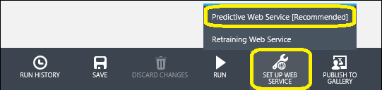
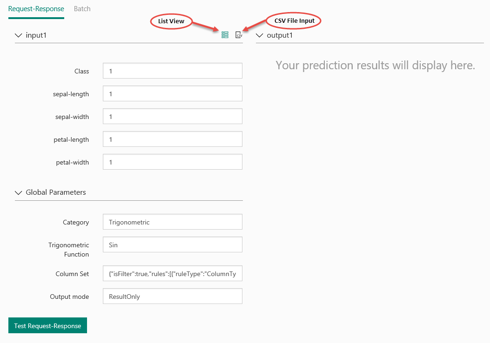
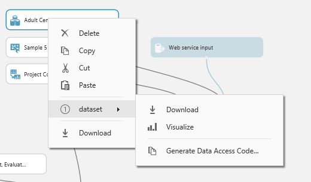
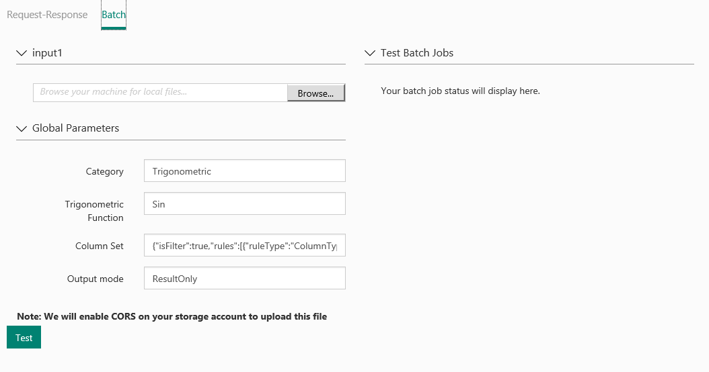
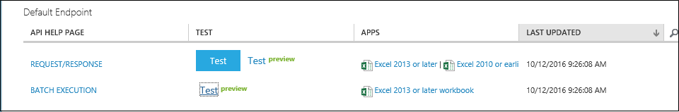
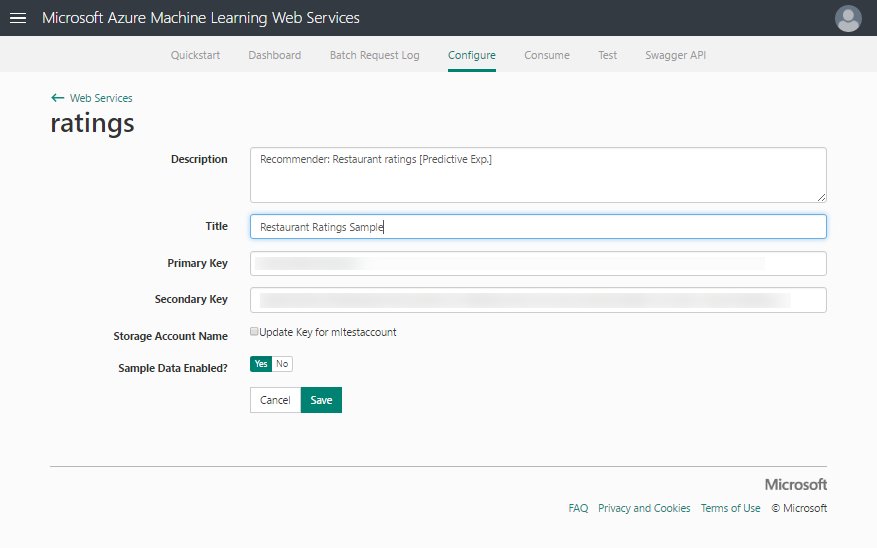
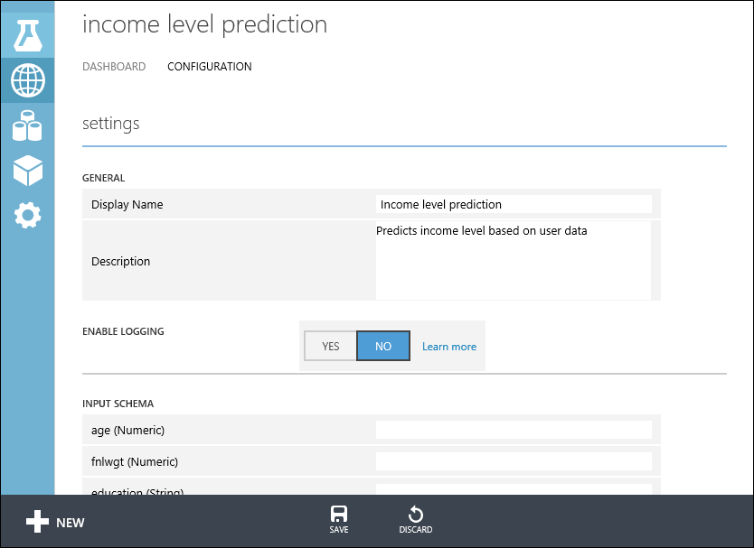

<properties
    pageTitle="Bereitstellen eines Webdiensts maschinellen Learning | Microsoft Azure"
    description="Wie eine Schulung experimentieren in einer Vorhersage experimentieren konvertieren, Vorbereiten der Arbeitsmappe für die Bereitstellung, und dann es als Webdienst Azure maschinellen Learning bereitstellen."
    services="machine-learning"
    documentationCenter=""
    authors="garyericson"
    manager="jhubbard"
    editor="cgronlun"/>

<tags
    ms.service="machine-learning"
    ms.workload="data-services"
    ms.tgt_pltfrm="na"
    ms.devlang="na"
    ms.topic="article"
    ms.date="10/04/2016"
    ms.author="garye"/>

# Bereitstellen eines Webdiensts Azure Computer-Schulung

Azure maschinellen Learning ermöglicht es Ihnen zu erstellen, testen und Bereitstellen von Vorhersage analytisches Lösungen.

Aus auf hoher Ebene-von-Sicht geschieht dies in drei Schritte:

- **[Erstellen einer Schulung experimentieren]** - Azure maschinellen Learning Studio ist eine gemeinsame visuelle Entwicklung-Umgebung, die Sie mit Schulen und Testen eines Vorhersageanalytik-Modells mithilfe von Schulungsdaten, die Sie angeben.
- **[Konvertieren sie eine Vorhersage experimentieren]** - einmal Modell weist mit den vorhandenen Daten gelernt wurde und Sie zur gemeinsamen Nutzung von Punktzahl neue Daten bereit, Sie vorbereiten und Optimieren Sie Ihr experimentieren Sie vorhersagen.
- **Bereitstellen von es als Webdienst** - können Sie Ihre Vorhersage experimentieren als [neue] oder [klassische] Azure Webdienst bereitstellen. Benutzer können Daten in Ihr Modell senden und empfangen Vorhersagen des Modells.

[AZURE.INCLUDE [machine-learning-free-trial](../../includes/machine-learning-free-trial.md)]

## Erstellen einer Schulung experimentieren

Um ein Modell Vorhersageanalytik Schulen, verwenden Sie Azure maschinellen Learning Studio zum Erstellen einer Schulung experimentieren, in dem Sie verschiedene Module Schulungsdaten laden, Vorbereiten der Daten nach Bedarf, Computer Learning Algorithmen anwenden und die Ergebnisse auswerten enthalten. Sie können auf einem Versuch durchlaufen, und versuchen Sie es anderen Computer Learning Algorithmen zum Vergleichen und die Ergebnisse auswerten.

Die Vorgehensweise zum Erstellen und Verwalten von Schulung Versuche wird an anderer Stelle noch sorgfältiger behandelt. Weitere Informationen finden Sie unter folgenden Artikeln:

- [Erstellen einer einfachen experimentieren in Azure maschinellen Learning Studio](machine-learning-create-experiment.md)
- [Entwickeln einer Vorhersagen Lösung mit Azure-Computer-Schulung](machine-learning-walkthrough-develop-predictive-solution.md)
- [Importieren Sie Ihre Daten Schulung in Azure maschinellen Learning Studio](machine-learning-data-science-import-data.md)
- [Verwalten von experimentieren Iterationen in Azure maschinellen Learning Studio](machine-learning-manage-experiment-iterations.md)

## Konvertieren Sie die Schulung experimentieren in einer Vorhersage experimentieren

Nachdem Sie Ihr Modell gelernt haben, können Sie bereit sind, Ihre Schulung experimentieren in einer Vorhersage experimentieren, um neue Daten bewerten konvertieren.

Konvertieren in einer Vorhersage experimentieren, erhalten Sie ausgebildete Modell als Punktzahl Webdienst bereitgestellt werden bieten. Benutzer des Webdiensts können Eingabedaten an Ihr Modell senden und Modell werden die Vorhersageergebnisse zurücksenden. Wie beim Konvertieren in eine Vorhersage experimentieren orientieren Sie wie erwartet Modell aus, um die von anderen verwendet werden.

Um Ihre Schulung experimentieren in einer Vorhersage experimentieren konvertieren möchten, klicken Sie auf am unteren Rand des Zeichenbereichs experimentieren **Ausführen** , klicken Sie auf **Web-Dienst**, und wählen Sie dann **Vorhersage Webdienst**.

Weitere Informationen zum Ausführen dieser Konvertierung finden Sie unter [Konvertieren eines Computer Learning Schulung experimentieren zu einer Vorhersage experimentieren](machine-learning-convert-training-experiment-to-scoring-experiment.md).

Die folgenden Schritte beschreiben einer Vorhersage experimentieren als neue Webdienst bereitstellen. Sie können auch den Versuch als klassische Webdienst bereitstellen.

## Bereitstellen der Vorhersage experimentieren als neue Webdienst

Nachdem Sie nun die Vorhersage experimentieren vorbereitet wurde, können Sie es als Azure Webdienst bereitstellen. Mithilfe des Webdiensts, Benutzer können Daten in Ihr Modell senden und das Modell zurückgegeben, deren Vorhersagen werden kann.

Um Ihre Vorhersage experimentieren bereitstellen zu können, klicken Sie auf **Ausführen** , am unteren Rand des Zeichenbereichs experimentieren. Nachdem der Versuch ausgeführt wurde, klicken Sie auf **Webdienst bereitstellen** , und wählen Sie **Webdienst bereitstellen [neu]**.  Die Bereitstellungsseite des Portals maschinellen Learning-Webdiensts wird geöffnet.

### Computer-Learning-Webdienst-Portal bereitstellen experimentieren Seite

Geben Sie einen Namen für den Webdienst, klicken Sie auf der Seite bereitstellen experimentieren.
Wählen Sie einen Preisgestaltung Plan aus. Wenn Sie einen vorhandenen Preisgestaltung Plan, dass Sie ihn auswählen können haben, müssen andernfalls Sie einen neuen Preisplan für den Dienst erstellen.

1.  In den **Preisplan** Dropdown-Liste, wählen Sie einen vorhandenen Plan aus, oder wählen Sie die Option **neuen Plan auswählen** .
2.  Geben Sie unter **Plan Name**einen Namen ein, der den Plan auf Ihrer Rechnung identifiziert.
3.  Wählen Sie eine der **Monatlichen planen Ebenen**. Plan Ebenen Standard für die Pläne für Ihre Standardregion und Ihre Webdienst wird die Region bereitgestellt.

Klicken Sie auf **Bereitstellen** und die **Schnellstart** -Seite für Ihre Web-Dienst wird geöffnet.

Schnellstart die Webseite-Dienst bietet Ihnen Hinweise und Zugriff auf die am häufigsten verwendeten Aufgaben, die Sie ausführen möchten, nach dem Erstellen von eines Webdiensts. Von hier aus können Sie einfach die Testseite und die verbrauchen Seite zugreifen.

<!-- -->

### Testen Sie Ihrer Webdienst

Klicken Sie unter Allgemeine Aufgaben auf **Webdienst testen** , klicken Sie zum Testen des neuen Webdiensts. Klicken Sie auf der Seite Test können Sie Ihre Webdienst als eine Anforderung / Antwort-Dienst (RRS) oder einem Stapel Ausführung Dienst (l) testen.

Die Testseite RRS zeigt die Eingaben, Ausgaben und globale Parameter, die Sie für den Versuch definiert haben. Klicken Sie zum Testen des Webdiensts können manuell Geben Sie die entsprechenden Werte für die Eingaben oder eine durch Trennzeichen getrennte Wert (CSV) formatierte Datei mit den Werten Test angeben.

Geben Sie die entsprechenden Werte für die Eingaben, und klicken Sie auf **Anforderung-Antwort zu testen**, um zu testen RRS, aus der Liste Ansichtsmodus verwenden. Die Vorhersageergebnisse anzeigen in der Spalte nach links.

Klicken Sie zum Testen der l auf **Stapel**. Klicken Sie auf die Testseite Stapel klicken Sie auf Durchsuchen, wählen Sie unter Ihre Eingabe, und wählen Sie eine CSV-Datei, die entsprechenden Beispielwerte enthält. Wenn Sie keine CSV-Datei, und Sie Ihre Vorhersage Experimentieren mit maschinellen Learning Studio erstellt, können Sie Datenmenge für Ihre Vorhersagen experimentieren herunterladen und verwenden.

Öffnen Sie zum Herunterladen der Datenmenge maschinellen Learning Studio aus. Öffnen Sie Ihre Vorhersage experimentieren, und klicken Sie mit der rechten Maustaste auf die Eingabe für Ihre experimentieren. Klicken Sie im Kontextmenü den Befehl wählen **Dataset** aus, und wählen Sie dann auf **herunterladen**.

Klicken Sie auf **Testen**. Zeigt der Status Ihrer Aufgaben Stapel Ausführung rechts unter **Test Stapel Projekte**.

<!---->

Auf der Seite **Konfiguration** können Sie die Beschreibung, Titel ändern, aktualisieren Sie den Speicher kontoschlüssel und Aktivieren von Beispieldaten für Ihren Webdienst.

Nachdem Sie den Webdienst bereitgestellt haben, können Sie folgende Schritte ausführen:

- **Zugriff** über die Webdienst-API.
- **Verwalten** sie über Azure maschinellen Schulung, Web Services-Portal oder im klassischen Azure-Portal.
- **Update** es, wenn Ihr Modell ändert.

### Zugriff auf den Webdienst

Nachdem Sie Ihre Webdienst von maschinellen Learning Studio bereitstellen, können Sie Daten an den Dienst senden und erhalten Antworten programmgesteuert.

Die Seite **verbrauchen** enthält alle zum Zugriff auf Ihre Webdienst erforderlichen Informationen. Beispielsweise wird die API-Taste zum Zulassen autorisierten Zugriffs auf den Dienst bereitgestellt.

Weitere Informationen zum Zugreifen auf einem Computer Learning-Webdienst Informationen Sie [zu einen bereitgestellten Azure maschinellen Learning-Webdienst nutzen](machine-learning-consume-web-services.md).

### Verwalten Sie Ihrer neuen Webdienst

Sie können Ihre Standardansicht Web Services maschinellen Learning-Webdiensten Portal verwalten. Klicken Sie im [Hauptfenster Portalseite](https://services.azureml-test.net/)auf **Webdienste**. Von der Webseite Services können Sie löschen oder Kopieren von einem Dienst. Um einen bestimmten Dienst zu überwachen, klicken Sie auf den Dienst, und klicken Sie dann auf **Dashboard**. Zum Überwachen der Stapelverarbeitung abgeschlossen, die mit dem Webdienst verknüpft ist, klicken Sie auf **Stapel anfordern Protokoll**.

## Bereitstellen der Vorhersage experimentieren als Webdienst klassischen

Nachdem Sie nun die Vorhersage experimentieren ausreichend vorbereitet wurde, können Sie es als Azure Webdienst bereitstellen. Mithilfe des Webdiensts, Benutzer können Daten in Ihr Modell senden und das Modell zurückgegeben, deren Vorhersagen werden kann.

Für die Bereitstellung Ihrer Vorhersage experimentieren klicken Sie auf am unteren Rand des Zeichenbereichs experimentieren **Ausführen** , und klicken Sie dann auf **Webdienst bereitstellen**. Der Webdienst eingerichtet wurde, und Sie befinden sich im Web Service Dashboard.

Sie können den Webdienst in der Computer Learning-Webdienste-Portal oder maschinelle Learning Studio testen.

Klicken Sie zum Testen des Webdiensts Antwort anfordern, klicken Sie auf die Schaltfläche **Testen** im Web Service Dashboard. Zum bitten Sie für die Eingabedaten für den Dienst wird ein Dialogfeld. Hierbei handelt es sich um die Spalten, die von der Punktzahl experimentieren erwartet. Geben Sie eine Reihe von Daten, und klicken Sie dann auf **OK**. Die Ergebnisse, die vom Webdienst generiert werden am unteren Rand des Dashboards angezeigt.

Sie können den Link, um dem Dienst im Portal Azure maschinellen Learning-Webdienste testen, wie zuvor im Abschnitt Dienst Web dargestellt **Testen** Vorschau klicken.

Klicken Sie zum Testen der Stapel Ausführung Dienst klicken Sie auf Vorschau des Links **zu testen** . Klicken Sie auf die Testseite Stapel klicken Sie auf Durchsuchen, wählen Sie unter Ihre Eingabe, und wählen Sie eine CSV-Datei, die entsprechenden Beispielwerte enthält. Wenn Sie keine CSV-Datei, und Sie Ihre Vorhersage Experimentieren mit maschinellen Learning Studio erstellt, können Sie Datenmenge für Ihre Vorhersagen experimentieren herunterladen und verwenden.

Sie können auf der Seite **Konfiguration** Ändern des Anzeigenamens des Diensts und probieren Sie es mit eine Beschreibung. Den Namen und die Beschreibung wird im [Azure klassischen Portal](http://manage.windowsazure.com/) , wo Sie Ihre Webdienste verwaltet wird, angezeigt.

Sie können eine Beschreibung für Ihre Eingabedaten, Ausgabedaten und Web-Dienstparameter durch Eingabe einer Zeichenfolge für jede Spalte unter **STANDARDEINGABESPRACHE SCHEMA**, **AUSGABESCHEMA**und **Der PARAMETER des DIENSTS**bereitstellen. Diese Art von Beschreibung werden in der Stichprobe Codedokumentation für den Webdienst verwendet.

Sie können Aktivieren der Protokollierung auf Fehler überprüfen, die angezeigt wird, wenn Ihr Webdienst zugegriffen wird. Weitere Informationen finden Sie unter [Aktivieren der Protokollierung für maschinelle Learning-Webdiensten](machine-learning-web-services-logging.md).

Sie können auch die Endpunkte für den Webdienst im Portal Azure maschinellen Learning-Webdiensten vergleichbar mit dem Verfahren in den neuen Abschnitt der Web-Dienst zuvor angezeigten konfigurieren. Die angezeigten Optionen hängen, können Sie hinzufügen oder Ändern der Beschreibung des Diensts, Protokollierung aktivieren und Beispieldaten zum Testen aktivieren.

### Zugriff auf den Webdienst

Nachdem Sie Ihre Webdienst von maschinellen Learning Studio bereitstellen, können Sie Daten an den Dienst senden und erhalten Antworten programmgesteuert.

Das Dashboard bietet die Informationen zum Zugreifen auf Ihre Webdiensts erforderlichen. Beispielsweise API Schlüssel dürfen autorisierten Zugriff auf den Dienst bereitgestellt wird, und API Hilfeseiten werden bereitgestellt, um zu beginnen, Schreiben von Code.

Weitere Informationen zum Zugreifen auf einem Computer Learning-Webdienst Informationen Sie [zu einen bereitgestellten Azure maschinellen Learning-Webdienst nutzen](machine-learning-consume-web-services.md).

### Verwalten des Webdiensts

Es gibt verschiedene Aktionen, die Sie ausführen können in einem Webdienst zu überwachen. Sie können es aktualisieren und löschen. Sie können auch einen klassischen Webdienst zusätzlich zu den standardmäßigen Endpunkt zusätzliche Endpunkte hinzufügen, die bei der Bereitstellung erstellt wird.

Weitere Informationen finden Sie unter [Verwalten ein Arbeitsbereich Azure maschinellen Learning](machine-learning-manage-workspace.md) und [Verwalten von einem Webdienst im Portal Azure maschinellen Learning Web Services verwenden](machine-learning-manage-new-webservice.md).

<!-- When this article gets published, fix the link and uncomment
For more information on how to manage Azure Machine Learning web service endpoints using the REST API, see **Azure machine learning web service endpoints**.
-->

## Aktualisieren Sie den Webdienst

Sie können nehmen Sie Änderungen an den Webdienst, wie z. B. Aktualisieren des Modells mit Daten zusätzliche Schulung und Bereitstellen erneut, den ursprünglichen Webdienst überschreiben.

Um den Webdienst zu aktualisieren, öffnen Sie die ursprüngliche Vorhersage experimentieren, die Sie verwendet, um den Webdienst bereitstellen, und stellen eine bearbeitbare Kopie durch Klicken auf **Speichern unter**. Nehmen Sie Ihre Änderungen vor, und klicken Sie dann auf **Webdienst bereitstellen**.

Da Sie diese experimentieren, bevor Sie bereitgestellt haben, werden Sie aufgefordert, wenn überschreiben (klassische Webdienst) oder aktualisieren (neue Webdienst) den vorhandenen Dienst werden sollen. Klicken Sie auf **Ja** , oder **Aktualisieren** stoppt den vorhandenen Webdienst und das neue bereitstellt Vorhersage experimentieren wird an ihrer Stelle bereitgestellt.

> [AZURE.NOTE] Wenn Sie im ursprünglichen Webdienst Konfiguration Änderungen vorgenommen haben, beispielsweise müssen eingeben eines neuen Anzeigenamen oder Beschreibung, Sie diese Werte erneut eingeben.

Eine Möglichkeit zum Aktualisieren des Webdiensts ist in das Modell programmgesteuert neu trainieren. Weitere Informationen finden Sie unter [neu trainieren maschinellen Learning Modelle programmgesteuert](machine-learning-retrain-models-programmatically.md).

<!-- internal links -->
[Erstellen einer Schulung experimentieren]: #create-a-training-experiment
[Um eine Vorhersage besser zu konvertieren]: #convert-the-training-experiment-to-a-predictive-experiment
[Neu]: #deploy-the-predictive-experiment-as-a-new-Web-service
[Klassische]: #deploy-the-predictive-experiment-as-a-new-Web-service
[Access]: #access-the-Web-service
[Manage]: #manage-the-Web-service-in-the-azure-management-portal
[Update]: #update-the-Web-service
