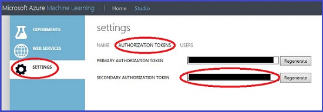

<properties 
    pageTitle="Zugriff auf Datasets mit maschinellen Learning Python-Client-Bibliothek | Microsoft Azure" 
    description="Installieren und Verwenden der Python-Client-Bibliothek zugreifen und sichere Verwalten von Azure maschinellen Learning Daten aus einer lokalen Python-Umgebung." 
    services="machine-learning" 
    documentationCenter="python" 
    authors="bradsev" 
    manager="jhubbard" 
    editor="cgronlun"/>

<tags 
    ms.service="machine-learning" 
    ms.workload="data-services" 
    ms.tgt_pltfrm="na" 
    ms.devlang="na" 
    ms.topic="article" 
    ms.date="09/12/2016" 
    ms.author="huvalo;bradsev" />

#Access-Datasets mit Python mithilfe der Azure maschinellen Learning Python-Client-Bibliothek 

Die Vorschau des Microsoft Azure maschinellen Learning Python Clientbibliothek aktivieren sicheren Zugriff für Ihre Azure maschinellen Learning Datasets aus einer lokalen Umgebung für Python und ermöglicht das Erstellen und Verwalten von Datasets in einem Arbeitsbereich.

Dieses Thema bietet Anweisungen zum:

* Installieren der Computer Learning Python-Client-Bibliothek 
* Zugreifen auf und Datasets, einschließlich Anweisungen zum Abrufen Autorisierung Azure maschinellen Learning Datasets aus Ihrem lokalen Python Umgebung Zugriff auf Hochladen
*  Access-XT für Datasets aus Versuche
*  Verwenden Sie die Python-Client-Bibliothek Datasets auflisten, Metadaten zugreifen, lesen Sie den Inhalt eines Datasets, neue Datasets erstellen und aktualisieren vorhandene datasets

[AZURE.INCLUDE [machine-learning-free-trial](../../includes/machine-learning-free-trial.md)]

 
##Erforderliche Komponenten

Die Python-Client-Bibliothek wurde unter den folgenden Umgebung getestet:

 - Unter Windows, Mac und Linux
 - Python 2.7, 3.3 und 3.4

Es ist abhängig von den folgenden Paketen:

 - Besprechungsanfragen
 - Python-dateutil
 - pandas

Es wird empfohlen, die eine Python Verteilung wie [Anaconda](http://continuum.io/downloads#all) oder [Himmelszelt](https://store.enthought.com/downloads/), die im Zusammenhang mit Python, IPython und die drei Pakete oben aufgeführten installiert. Obwohl IPython nicht unbedingt erforderlich ist, ist es eine gute Umgebung zum Bearbeiten von und Visualisieren von Daten interaktiv.

###Zum Installieren der Azure maschinellen Learning Python-Client-Bibliothek

Die Azure maschinellen Learning Python-Client-Bibliothek muss auch zum Ausführen der Aufgaben, die in diesem Artikel beschriebenen installiert sein. Es ist aus dem [Python Paket Index](https://pypi.python.org/pypi/azureml)verfügbar. Wenn Sie es in Ihrer Umgebung Python installiert haben, führen Sie den folgenden Befehl aus Ihrem lokalen Python-Umgebung aus:

    pip install azureml

Alternativ können Sie herunterladen und installieren aus den Quellen auf [Github](https://github.com/Azure/Azure-MachineLearning-ClientLibrary-Python).

    python setup.py install

Wenn Sie Git auf Ihrem Computer installiert haben, können Sie Pip, direkt über das Repository Git installieren:

    pip install git+https://github.com/Azure/Azure-MachineLearning-ClientLibrary-Python.git

##Verwenden von Studio Codeausschnitte Datasets Zugriff auf

Die Python-Client-Bibliothek bietet Ihnen den programmgesteuerten Zugriff auf Ihre vorhandene Datasets aus Versuche, die ausgeführt wurden.

Die Web-Oberfläche Studio können Sie Codeausschnitte generieren, die alle erforderlichen Informationen zum Herunterladen und Datasets als Pandas DataFrame Objekte auf Ihrem Computer Speicherort Deserialisieren enthalten.

### Sicherheit für den Zugriff auf Daten

Die von Studio für mit der Python-Client-Bibliothek Ihre Workspace-Id und die Autorisierung umfasst bereitgestellten Codeausschnitte token. Diese bietet vollständigen Zugriff auf den Arbeitsbereich und geschützt werden müssen, wie ein Kennwort.

Aus Gründen der Sicherheit steht die Funktionalität der Codeausschnitt nur für Benutzer, die ihre Rolle als **Besitzer** für den Arbeitsbereich festgelegt haben. Ihre Rolle wird auf der Seite **Benutzer** klicken Sie unter **Einstellungen**in Azure maschinellen Learning Studio angezeigt.

![Sicherheit][security]

Wenn Ihre Rolle nicht als **Besitzer**festgelegt ist, können Sie entweder erneut eingeladen werden als Besitzer oder bitten Sie den Besitzer des Arbeitsbereichs zu beschleunigen des Codeausschnitts.

Um die Autorisierungstoken zu erhalten, können Sie eine der folgenden Aktionen ausführen:

- Bitten Sie von einem Besitzer für ein Token. Besitzer können ihre Autorisierung Token von der Seite Einstellungen ihren Arbeitsbereich in Studio zugreifen. Wählen Sie **Einstellungen** aus dem linken Bereich aus, und klicken Sie auf **Autorisierung Token** zum Anzeigen der primären und sekundären Tokens.  Obwohl entweder zur primären oder der sekundären Autorisierung Token im Codeausschnitt verwendet werden können, empfiehlt es sich, dass der Besitzer nur die sekundäre Autorisierung Token freigeben.

- Fragen Sie zu Rolle der Besitzer höher gestuft wird.  Hierzu muss ein Aktueller Besitzer des Arbeitsbereichs zuerst entfernen Sie es aus dem Arbeitsbereich, und Laden Sie Sie erneut darauf als Besitzer.

Wenn Entwickler der Arbeitsbereich-Id und die Autorisierung abgerufen haben token, sie sind auf den Arbeitsbereich mithilfe des Codeausschnitts unabhängig von deren Rolle zugreifen.

Autorisierung Token werden auf der Seite **Autorisierung Token** unter **EINSTELLUNGEN**verwaltet. Sie können diese erneut generieren, aber dieses Verfahren hebt Zugriff auf dem vorherigen Token.

### Access-Datasets aus einer lokalen Python-Anwendung

1. Klicken Sie in Computer Learning Studio **DATASETS** in der Navigationsleiste auf der linken Seite auf.

2. Wählen Sie das Dataset aus, die, das Sie zugreifen möchten. Sie können eine der Datasets aus der Liste **Meine DATASETS** oder aus der Liste **Beispiele** auswählen.

3. Klicken Sie in der unteren Symbolleiste auf **Daten-Access-Code generieren**. Wenn die Daten in einem Format mit der Python-Client-Bibliothek nicht kompatibel sind, ist diese Schaltfläche deaktiviert.

    ![Datasets][datasets]

4. Wählen Sie den Codeausschnitt aus dem Fenster, das angezeigt wird, und es in die Zwischenablage zu kopieren.

    ![Access-Code][dataset-access-code]

5. Fügen Sie den Code in das Notizbuch von Ihrem lokalen Python-Anwendung.

    ![Notizbuch][ipython-dataset]

## Access-XT für Datasets von maschinellen Learning Versuche

Nach einem Versuch in Studio Learning Computer ausgeführt wird, ist es möglich, die zwischen-XT für Datasets zugreifen, die Ausgabeknoten Module. Zwischen-XT für Datasets sind Daten, die für zwischen-XT für Schritte verwendet, wenn ein Modell Tool ausgeführt wurde und erstellt wurde.

Zwischen-XT für Datasets kann zugegriffen werden, solange das Datenformat mit der Python-Client-Bibliothek kompatibel ist.

Die folgenden Dateiformate werden unterstützt (für diese Konstanten sind der `azureml.DataTypeIds` Klasse):

 - Nur-Text
 - GenericCSV
 - GenericTSV
 - GenericCSVNoHeader
 - GenericTSVNoHeader

Sie können das Format bestimmen, indem Sie auf ein Modul Ausgabeknoten Auswahlspalte zeigen. Es wird zusammen mit dem Knotennamen in einer QuickInfo angezeigt.

Einige der Module, wie etwa die [geteilten] [ split] Modul, Ausgabe in einem Format, das mit dem Namen `Dataset`, die von der Python-Client-Bibliothek nicht unterstützt.

![DataSet-Format][dataset-format]

Sie müssen ein Modul Konvertierung, wie etwa [CSV-konvertieren]verwenden[convert-to-csv], um ein unterstütztes Format ein Ergebnis zu verschaffen.

![GenericCSV formatieren][csv-format]

Die folgenden Schritte anzeigen ein Beispiel, einem Versuch erstellt, wird er ausgeführt und greift auf das mittlere dataset

1. Erstellen einer neuen experimentieren.

2. Fügen Sie ein **Dataset Erwachsenen Erhebung Einkommen binäre Klassifizierung** Modul.

3. Einfügen einer [geteilten] [ split] Modul, und verbinden Sie die Eingabe in die Ausgabe der Dataset Modul.

4. Einfügen einer [CSV-konvertieren] [ convert-to-csv] Modul, und verbinden Sie die Eingabe in eine der [geteilten] [ split] Modul ausgegeben.

5. Speichern Sie den Versuch, führen Sie aus, und warten Sie, bis er zu Ende ausgeführt werden.

6. Klicken Sie auf die Ausgabeknoten in der [CSV-konvertieren] [ convert-to-csv] Modul.

7. Wenn das Kontextmenü angezeigt wird, wählen Sie die **Daten-Access-Code generieren**.

    ![Kontextmenü][experiment]

8. Wählen Sie den Codeausschnitt und aus dem, das daraufhin angezeigten Fenster in die Zwischenablage zu kopieren.

    ![Access-Code][intermediate-dataset-access-code]

9. Fügen Sie den Code in Ihrem Notizbuch.

    ![Notizbuch][ipython-intermediate-dataset]

10. Sie können die Daten mithilfe von Matplotlib darstellen. Dies wird in einem Histogramm für die Spalte Alter angezeigt:

    ![Histogramm][ipython-histogram]

##Verwenden der Computer Learning Python-Client-Bibliothek zugreifen, lesen, erstellen und Verwalten von datasets

### Arbeitsbereich

Der Arbeitsbereich ist der Einstiegspunkt für die Python-Client-Bibliothek. Angeben der `Workspace` Klasse mit Ihrem Arbeitsplatz-Id und die Autorisierung zum Erstellen einer Instanz token:

    ws = Workspace(workspace_id='4c29e1adeba2e5a7cbeb0e4f4adfb4df',
                   authorization_token='f4f3ade2c6aefdb1afb043cd8bcf3daf')

### Datasets auflisten

Alle Datasets in einem Arbeitsbereich aufgelistet:

    for ds in ws.datasets:
        print(ds.name)

Nur die von Benutzern erstellte Datasets aufgelistet:

    for ds in ws.user_datasets:
        print(ds.name)

Nur die Beispiel Datasets aufgelistet:

    for ds in ws.example_datasets:
        print(ds.name)

Sie können ein Dataset anhand des Namens zugreifen (die Groß-/Kleinschreibung beachtet):

    ds = ws.datasets['my dataset name']

Oder Sie können darauf zugreifen, indem Sie Index:

    ds = ws.datasets[0]

### Metadaten

Datasets haben Metadaten zusätzlich zum Inhalt. (Mittlere Datasets sind eine Ausnahme von dieser Regel und verfügen nicht über alle Metadaten).

Einige Metadatenwerte werden vom Benutzer zum Zeitpunkt der Erstellung zugewiesen werden:

    print(ds.name)
    print(ds.description)
    print(ds.family_id)
    print(ds.data_type_id)

Andere sind Werte, die von Azure ML zugewiesen:

    print(ds.id)
    print(ds.created_date)
    print(ds.size)

Finden Sie unter der `SourceDataset` Klasse für Weitere Informationen zum verfügbaren Metadaten.

### Lesen Sie Inhalt

Die automatisch vom Computer Learning Studio bereitgestellten Codeausschnitte herunterladen und das Dataset zu einem Objekt Pandas DataFrame deserialisieren. Dies wird mit der `to_dataframe` Methode:

    frame = ds.to_dataframe()

Wenn Sie lieber die unformatierten Daten herunterladen und Ausführen von p selbst, ist, die eine Option aus. Dies ist im Moment für Formaten wie 'ARFF', die Python-Client-Bibliothek deserialisieren kann nicht nur die Option.

Um den Inhalt als Text lesen:

    text_data = ds.read_as_text()

Um den Inhalt als Binärdatei lesen:

    binary_data = ds.read_as_binary()

Sie können auch einfach einen Stream, um den Inhalt öffnen:

    with ds.open() as file:
        binary_data_chunk = file.read(1000)

### Erstellen eines neuen Datasets

Die Python-Client-Bibliothek können Sie Datasets aus Ihrem Programm Python hochladen. Diese Datasets sind dann für die Verwendung im Arbeitsbereich verfügbar.

Wenn Sie Ihre Daten in einer Pandas DataFrame verfügen, verwenden Sie den folgenden Code ein:

    from azureml import DataTypeIds

    dataset = ws.datasets.add_from_dataframe(
        dataframe=frame,
        data_type_id=DataTypeIds.GenericCSV,
        name='my new dataset',
        description='my description'
    )

Wenn Ihre Daten bereits serialisiert werden, können Sie Folgendes verwenden:

    from azureml import DataTypeIds

    dataset = ws.datasets.add_from_raw_data(
        raw_data=raw_data,
        data_type_id=DataTypeIds.GenericCSV,
        name='my new dataset',
        description='my description'
    )

Die Python-Client-Bibliothek ist in der Lage, eine Pandas DataFrame mit den folgenden Formaten serialisiert (für diese Konstanten sind der `azureml.DataTypeIds` Klasse):

 - Nur-Text
 - GenericCSV
 - GenericTSV
 - GenericCSVNoHeader
 - GenericTSVNoHeader

### Aktualisieren eines vorhandenen Datasets

Wenn Sie versuchen, ein neues Dataset mit einem Namen hochladen, die ein vorhandenes Dataset entspricht, sollten Sie einen Konflikt Fehler angezeigt.

Um ein vorhandenes Dataset zu aktualisieren, müssen Sie zuerst einen Verweis auf das vorhandene Dataset zu erhalten:

    dataset = ws.datasets['existing dataset']

    print(dataset.data_type_id) # 'GenericCSV'
    print(dataset.name)         # 'existing dataset'
    print(dataset.description)  # 'data up to jan 2015'

Verwenden Sie dann `update_from_dataframe` serialisiert, und Ersetzen Sie den Inhalt des Datasets auf Azure:

    dataset = ws.datasets['existing dataset']

    dataset.update_from_dataframe(frame2)

    print(dataset.data_type_id) # 'GenericCSV'
    print(dataset.name)         # 'existing dataset'
    print(dataset.description)  # 'data up to jan 2015'

Wenn Sie die Daten in ein anderes Format serialisieren möchten, geben Sie einen Wert für das optionale `data_type_id` Parameter.

    from azureml import DataTypeIds

    dataset = ws.datasets['existing dataset']

    dataset.update_from_dataframe(
        dataframe=frame2,
        data_type_id=DataTypeIds.GenericTSV,
    )

    print(dataset.data_type_id) # 'GenericTSV'
    print(dataset.name)         # 'existing dataset'
    print(dataset.description)  # 'data up to jan 2015'

Optional können Sie eine neue Beschreibung festlegen, indem Sie einen Wert für die `description` Parameter.

    dataset = ws.datasets['existing dataset']

    dataset.update_from_dataframe(
        dataframe=frame2,
        description='data up to feb 2015',
    )

    print(dataset.data_type_id) # 'GenericCSV'
    print(dataset.name)         # 'existing dataset'
    print(dataset.description)  # 'data up to feb 2015'

Optional können Sie einen neuen Namen festlegen, indem Sie einen Wert für die `name` Parameter. Von jetzt an wird das Dataset mit den neuen Namen nur abgerufen werden. Im folgende Code aktualisiert Daten, Name und Beschreibung an.

    dataset = ws.datasets['existing dataset']

    dataset.update_from_dataframe(
        dataframe=frame2,
        name='existing dataset v2',
        description='data up to feb 2015',
    )

    print(dataset.data_type_id)                    # 'GenericCSV'
    print(dataset.name)                            # 'existing dataset v2'
    print(dataset.description)                     # 'data up to feb 2015'

    print(ws.datasets['existing dataset v2'].name) # 'existing dataset v2'
    print(ws.datasets['existing dataset'].name)    # IndexError

Die `data_type_id`, `name` und `description` Parameter sind optional und auf den vorherigen Wert Standard. Die `dataframe` Parameter ist immer erforderlich.

Wenn Ihre Daten bereits serialisiert werden, verwenden Sie `update_from_raw_data` anstelle von `update_from_dataframe`. Wenn Sie nur übergeben `raw_data` anstelle von `dataframe`, ihn auf ähnliche Weise funktioniert.

<!-- Images -->
[security]:./media/machine-learning-python-data-access/security.png
[dataset-format]:./media/machine-learning-python-data-access/dataset-format.png
[csv-format]:./media/machine-learning-python-data-access/csv-format.png
[datasets]:./media/machine-learning-python-data-access/datasets.png
[dataset-access-code]:./media/machine-learning-python-data-access/dataset-access-code.png
[ipython-dataset]:./media/machine-learning-python-data-access/ipython-dataset.png
[experiment]:./media/machine-learning-python-data-access/experiment.png
[intermediate-dataset-access-code]:./media/machine-learning-python-data-access/intermediate-dataset-access-code.png
[ipython-intermediate-dataset]:./media/machine-learning-python-data-access/ipython-intermediate-dataset.png
[ipython-histogram]:./media/machine-learning-python-data-access/ipython-histogram.png

<!-- Module References -->
[convert-to-csv]: https://msdn.microsoft.com/library/azure/faa6ba63-383c-4086-ba58-7abf26b85814/
[split]: https://msdn.microsoft.com/library/azure/70530644-c97a-4ab6-85f7-88bf30a8be5f/
 
