<properties
    pageTitle="Schnellstart-Lernprogramm für R Sprache für maschinelle Learning | Microsoft Azure"
    description="Verwenden Sie den Einstieg schnell die Sprache R mit Azure maschinellen Learning Studio zum Erstellen einer Prognosen Lösung Lernprogramm R Programmierung."
    keywords="Schnellstart, R Sprache, R Programmiersprache, R programming Lernprogramm"
    services="machine-learning"
    documentationCenter=""
    authors="garyericson"
    manager="jhubbard"
    editor="cgronlun"/>

<tags
    ms.service="machine-learning"
    ms.workload="data-services"
    ms.tgt_pltfrm="na"
    ms.devlang="na"
    ms.topic="article"
    ms.date="07/12/2016"
    ms.author="garye"/>

# Schnellstart-Lernprogramm für die Programmiersprache für Azure maschinellen Learning R

Stephen F Elston, Ph.D.

##  Einführung

In diesem Lernprogramm Schnellstart hilft Ihnen, schnell und einfach starten Azure maschinellen Learning mithilfe der Programmiersprache R verlängern. Führen Sie dieses Lernprogramms R Programmierung, um zu erstellen, testen und R Code innerhalb von Azure Computer lernen ausführen. Wenn Sie das Lernprogramm durcharbeiten, erstellen Sie eine vollständige Prognose Lösung mithilfe der Sprache R Azure Computer interessante.  

Microsoft Azure maschinellen Learning enthält viele leistungsfähige Computer lernen und Daten Manipulation Module. Die leistungsfähige R Sprache hat als die Verkehrssprache des Analytics beschrieben wurde. Glücklicherweise kann Analytics und Datenverarbeitung Azure Computer interessante verlängert mithilfe von R. Diese Kombination bietet die Skalierbarkeit und einfache Bereitstellung von Azure maschinellen Learning die Flexibilität und Tiefe Analytics von R.

[AZURE.INCLUDE [machine-learning-free-trial](../../includes/machine-learning-free-trial.md)]

###Planung und das dataset

Prognostizieren ist eine stark Selbständige und sehr nützlich sein, analytical-Methode. Allgemeine Verwendungsmöglichkeiten Bereich von Vorhersage Umsätze für saisonale Elemente, die optimale Inventory Ebenen, um Vorhersage makroökonomische Variablen zu bestimmen. Prognostizieren von erfolgt normalerweise mit Uhrzeit Reihe Modelle.

Zeit Reihendaten sind in der die Werte von Indizes Zeit haben. Der Uhrzeit Index reguläre, werden, z. B. jeden Monat oder jede Minute, oder unregelmäßiges. Eine Uhrzeit Reihe Modell basiert auf Serie Zeitdaten. Das Programmiersprache R enthält ein flexibler Rahmen und eine umfassende Analytics für Reihe Zeitdaten.

In diesem Schnellstarthandbuch werden wir arbeiten mit Milchvieh Kalifornien und Preise Daten werden. Diese Daten berücksichtigt monatliche Informationen der Herstellung von mehreren Milchprodukte und den Preis von Milchfett, heutzutage ein Benchmark-Thema.

In diesem Artikel zusammen mit R Skripts, verwendeten Daten die können [hier heruntergeladen]werden[download]. Diese Daten wurde ursprünglich aus der University Wisconsin am http://future.aae.wisc.edu/tab/production.html verfügbarer Informationen umgewandelt.

### Organisation

Wir werden mehrere Schritte durchlaufen, wie Sie Informationen zu erstellen, testen und Ausführen von Analytics und Daten Manipulation R Code in der Azure maschinellen Learning-Umgebung.  

* Zunächst wird die Grundlagen der Verwendung der R Sprache in der Azure maschinellen Learning Studio-Umgebung vorgestellt.

* Klicken Sie dann Fortschreiten wir auf verschiedene Aspekte des i/o für Daten, R Code und Grafiken in der Umgebung Azure maschinellen Schulung besprochen.

* Wir werden dann im ersten Teil unserer Prognose Lösung erstellen, indem Sie Code für Daten bereinigen und Transformation erstellen.

* Mit unseren Daten vorbereitet wird wir eine Analyse der Korrelationen zwischen unterschiedliche die Variablen in unser Dataset ausgeführt.

* Schließlich wird ein saisonale Zeit Reihe Prognose Modell für Milchproduktion erstellt.

##Interagieren Sie mit R Sprache in Computer Learning Studio

In diesem Abschnitt gelangen Sie einige Grundlagen der Interaktion mit R Programmiersprache in der Computer Learning Studio-Umgebung. Die Sprache R stellt ein leistungsfähiges Tool zum Erstellen von angepassten Analytics und Daten Manipulation Module innerhalb der Azure maschinellen Learning-Umgebung.

Mithilfe von RStudio werde ich entwickeln, testen und Debuggen von R Code auf kleinen Maßstab. Dieser Code ist dann Ausschneiden und Einfügen in einem [R Skript ausführen] [ execute-r-script] Computer Learning Studio bereit sind, führen Sie im Modul.  

###Das Ausführen R Skript-Modul

In Computer Learning Studio sind R Skripts innerhalb des [R Skript ausführen] ausgeführt werden[ execute-r-script] Modul. Ein Beispiel für das [Ausführen R Skript] [ execute-r-script] Modul in Computer Learning Studio in Abbildung 1 dargestellt ist.

 ![R Programmiersprache: ausgewählten Computer Learning Studio das Ausführen R Skript-Modul][1]

*Abbildung 1. Der Computer Learning Studio-Umgebung, die mit der ausführen R Skript-Modul ausgewählt.*

Informieren Sie sich Abbildung 1, sehen wir uns einige der wichtigsten Teile der Computer Learning Studio-Umgebung für die Arbeit mit dem [Ausführen R Skript] [ execute-r-script] Modul.

- Die Module den Versuch werden im mittleren Bereich angezeigt.

- Der obere Teil im rechten Bereich enthält ein Fensters zum Anzeigen und bearbeiten Ihre Skripts R.  

- Im untere Teil des rechten Bereich enthält einige Eigenschaften des [Ausführen R Skript][execute-r-script]. Sie können die Protokolle der Fehler und Ausgabe, indem Sie auf die entsprechenden Stellen, an diesem Bereich anzeigen.

Wir werden, natürlich werden ausführlich auf das [Ausführen R Skript] [ execute-r-script] in im weiteren Verlauf dieses Dokuments detaillierter.

Bei der Arbeit mit komplexen R Funktionen empfehlen ich an, die Sie bearbeiten, testen und im RStudio Debuggen. Wie bei einer Software Weiterentwicklung erweitern Sie von Code inkrementell zu, und Testen Sie es auf kleine einfachen Test Fällen. Klicken Sie dann Ausschneiden und Einfügen von der Funktionen in das Fenster des Skript R des [Ausführen R Skript] [ execute-r-script] Modul. Dieser Ansatz können Sie sowohl die integrierte RStudio Entwicklungsumgebung (IDE) und die Leistungsfähigkeit von Azure maschinellen Learning nutzen.  

####R Code ausführen

R Code in das [Ausführen R Skript] [ execute-r-script] Modul führt beim Ausführen der experimentieren, indem Sie auf die Schaltfläche **Ausführen** . Wenn Ausführung abgeschlossen ist, wird ein Häkchen angezeigt, auf das [Ausführen R Skript] [ execute-r-script] Symbol.

####Defensive Codierung für Azure maschinellen Learning R

Wenn Sie mithilfe von Azure maschinellen Learning R Code für, sagen Sie einen Webdienst entwickeln, sollten Sie auf jeden Fall planen, wie Ihr Code ein unerwarteter Dateneingabe und Ausnahmen behandelt werden. Um die Verständlichkeit beibehalten möchten, haben ich viele beim Auschecken und in den meisten den Codebeispielen dargestellt Behandlung nicht enthalten. Jedoch wir im weiteren Verlauf erhalten ich Beispiele für verschiedene Funktionen Sie unter Verwendung des R Ausnahme Videofunktionen behandeln.  

Wenn Sie eine weitere ausführliche Erläuterung von R Behandlung von Ausnahmen benötigen, empfehlen ich Sie lesen, dass die relevanten Abschnitte des im Adressbuch nach Wickham [Anhang B – Weitere Themen](#appendixb)aufgeführt.

####Debuggen Sie und Testen Sie R in Computer Learning Studio

Zur Bestätigung, sollten Sie testen und Debuggen von R Code in geringem Umfang in RStudio. Es gibt jedoch auch Fälle, in dem Sie aufzufinden R Codeprobleme im [R Skript ausführen] müssen[ execute-r-script] selbst. Darüber hinaus ist es empfiehlt sich, die Ergebnisse in Computer Learning Studio zu überprüfen.

Ausgabe aus der Ausführung des Codes R und auf der Azure maschinellen Learning-Plattform ist hauptsächlich in output.log gefunden. Einige zusätzliche Informationen werden in error.log angezeigt werden.  

Auftretender Fehler in Computer Learning Studio während Ihrer R Code ausgeführt wird, sollten der erste Kurs Aktion error.log eigenständig. Diese Datei kann nützliche Fehlermeldungen, damit Sie verstehen und Beheben des Fehlers enthalten. Wenn error.log anzeigen möchten, klicken Sie auf auf **Fehlerprotokoll anzeigen** im **Eigenschaftenbereich** für das [Ausführen R Skript] [ execute-r-script] , die den Fehler enthält.

Beispielsweise den folgenden R Code mit einer nicht definierten Ergebnisvariable y in einem [Ausführen R Skript] ist[ execute-r-script] Modul:

    x <- 1.0
    z <- x + y

Dieser Code nicht ausgeführt, resultierender in einer Bedingung zurück. Klicken im **Eigenschaftenbereich** auf **Fehlerprotokoll anzeigen** erzeugt die Anzeige in Abbildung 2 dargestellt.

  ![Fehlermeldung popupwarnung][2]

*Abbildung 2. Fehlermeldung Popupmenü.*

Es sieht so aus, wie wir in output.log, um die Fehlermeldung R finden Sie unter suchen müssen. Klicken Sie auf das [Ausführen R Skript] [ execute-r-script] , und klicken Sie dann auf das Element **output.log Ansicht** im **Eigenschaftenbereich** nach rechts. Öffnet ein neues Browserfenster, und ich finden Sie hier.

    [Critical]     Error: Error 0063: The following error occurred during evaluation of R script:
    ---------- Start of error message from R ----------
    object 'y' not found
    
    
    object 'y' not found
    ----------- End of error message from R -----------

Diese Fehlermeldung enthält keine Auflösung und das Problem eindeutig identifiziert.

Um den Wert eines Objekts in R prüfen möchten, können Sie diese Werte in der Datei output.log drucken. Die Regeln zur Prüfung von Objektwerten sind im Wesentlichen identisch mit einer interaktiven R Sitzung. Beispielsweise wenn Sie einen Variablennamen in einer Zeile eingeben, der Wert des Objekts zu der Datei output.log gedruckt.  

####Pakete in Computer Learning Studio

Im Lieferumfang von mehr als 350 vorinstallierter R Sprachpakete Azure maschinellen Schulung. Sie können den folgenden Code in das [R Skript ausführen] [ execute-r-script] Modul, um eine Liste der vorinstallierter Pakete abzurufen.

    data.set <- data.frame(installed.packages())
    maml.mapOutputPort("data.set")

Wenn Sie zum Zeitpunkt die letzte Zeile des Codes verstehen nicht, lesen Sie weiter. Im restlichen Dokument werden wir ausführlich erläutert, R in der Azure maschinellen Learning-Umgebung verwenden.

### Einführung in RStudio

RStudio ist eine häufig verwendeten IDE für R. Ich wird RStudio zum Bearbeiten, testen und Debuggen einige der in dieser Schnellstartübersicht verwendeten R Codes verwendet. Sobald R Code getestet und bereit ist, Sie einfach Ausschneiden und Einfügen aus dem RStudio-Editor in einem Computer Learning Studio [R Skript ausführen] [ execute-r-script] Modul.  

Wenn Sie nicht die R Programmiersprache, die auf dem Desktopcomputer installiert haben, empfehlen ich Sie jetzt ausführen. Kostenlose Downloads der open-Source R Sprache sind bei der umfassende R Archiv Netzwerk (CRAN) am [http://www.r-project.org/](http://www.r-project.org/)verfügbar. Es gibt Downloads für Windows, Mac OS und Linux/UNIX verfügbar. Wählen Sie eine in der Nähe Spiegelung, und befolgen Sie die Anweisungen herunterladen. CRAN enthält darüber hinaus eine Vielzahl von nützliche Analytics und Daten Manipulation Pakete.

Wenn Sie mit RStudio vertraut sind, sollten Sie herunterladen und installieren die desktop-Version. Sie können, dass der RStudio am http://www.rstudio.com/products/RStudio/ für Windows, Mac OS und Linux/UNIX-downloads suchen. Führen Sie die Anweisungen zur Verfügung gestellt, um RStudio auf dem Desktopcomputer zu installieren.  

Eine Einführung in RStudio zusammengehörenden ist unter https://support.rstudio.com/hc/sections/200107586-Using-RStudio verfügbar.

Kann ich einige zusätzliche Informationen zur Verwendung von RStudio in [Anhang A]bieten[appendixa].  

##Abrufen von Daten ein-und das Modul R Skript ausführen

In diesem Abschnitt werden wir erläutert, wie Sie Daten in die und aus der [Ausführen R Skript] abrufen[ execute-r-script] Modul. Wir werden überprüfen, wie verschiedene Datentypen in und Abmelden bei der [Ausführen R Skript] lesen behandelt[ execute-r-script] Modul.

Der vollständige Code für diesen Abschnitt befindet sich die Zip-Datei, die Sie zuvor heruntergeladen haben.

###Laden und aktivieren Sie das Kontrollkästchen in Computer Learning Studio

####Laden Sie das dataset

Beginnen wir mit dem Laden der **csdairydata.csv** -Datei in Azure maschinellen Learning Studio.

- Starten Sie Ihre Azure maschinellen Learning Studio-Umgebung.

- Klicken Sie auf __+ neue__ in der unteren linken Ecke des Bildschirms auf, und wählen Sie **Dataset**aus.

- Wählen Sie **Lokale Dateien**, und klicken Sie dann **Durchsuchen** um die Datei auszuwählen.

- Stellen Sie sicher, dass Sie **generische CSV-Datei mit Kopf-(CSV)** als den Datentyp für das Dataset ausgewählt haben.

- Klicken Sie auf das Häkchen.

- Nachdem das Dataset hochgeladen wurde, sollte das neue Dataset, indem Sie auf der Registerkarte **Datasets** angezeigt werden.  

####Erstellen einer experimentieren.

Nun wir einige Daten in Computer Learning Studio verfügen, müssen wir Erstellen einer experimentieren, um die Analyse auszuführen.  

- Klicken Sie auf __+ neue__ in der unteren linken Ecke auf, und wählen Sie **experimentieren**, und klicken Sie dann auf **Leere experimentieren**.

- Sie können Ihre experimentieren benennen, durch das auswählen und ändern, den Titel **experimentieren... auf erstellt** am oberen Rand der Seite. Beispielsweise wird in **CA Milchprodukte Analyse**geändert.

- Erweitern Sie auf der linken Seite der Seite experimentieren **Datasets gespeichert**, und klicken Sie dann **Meine Datasets**aus. Die **cadairydata.csv** sollte angezeigt werden, die Sie zuvor hochgeladen.

- Drag & drop der **csdairydata.csv Dataset** in der experimentieren.

- Geben Sie im Feld **Suche experimentieren Elemente** am oberen Rand im linken Bereich [Ausführen R Skript][execute-r-script]. Sie sehen, dass das Modul, in der Suchliste angezeigt werden.

- Drag & drop [Ausführen R Skript] [ execute-r-script] Modul auf der Palette.  

- Verbinden die Ausgabe der **csdairydata.csv Dataset** mit der Eingabe ganz links (**Dataset1**) das [Ausführen R Skript][execute-r-script].

- **Vergessen Sie nicht, klicken Sie auf 'Speichern' auf!**  

An diesem Punkt sollte Ihre experimentieren etwa Abbildung 3 aussehen.

![Die Zertifizierungsstelle Milchprodukte Analyse Probieren Sie Dataset und Ausführen R Skript-Modul][3]

*Abbildung 3. Die Zertifizierungsstelle Milchprodukte Analyse experimentieren Sie mit Dataset und Ausführen R Skript-Modul.*

####Aktivieren Sie auf der Registerkarte Daten

Lassen Sie uns einen Blick auf die Daten, die wir in unseren experimentieren geladen haben. Den Versuch klicken Sie auf die Ausgabe des **cadairydata.csv Dataset** aus, und wählen Sie **darstellen**. Es sollte etwa Abbildung 4 angezeigt.  

![Übersicht über das Dataset cadairydata.csv][4]

*Abbildung 4. Zusammenfassung der cadairydata.csv Dataset.*

In dieser Ansicht sehen wir zahlreiche nützliche Informationen an. Sehen wir die ersten Dataset in mehreren Zeilen ein. Wenn wir eine Spalte auswählen, wird im Abschnitt Statistik Weitere Informationen über die Spalte. Die Zeile Funktionstyp zeigt uns beispielsweise, welche Datentypen Azure maschinellen Learning Studio der Spalte zugewiesen. Probleme einen Blick wie folgt ist gute Überprüfung, bevor alle schwerwiegenden Arbeit erledigen.

### Erste R-Skript

Wir erstellen ein einfaches ersten R Skript zum Experimentieren Azure maschinellen Learning Studio aus. Ich habe erstellt und das folgende Skript in RStudio getestet.  

    ## Only one of the following two lines should be used
    ## If running in Machine Learning Studio, use the first line with maml.mapInputPort()
    ## If in RStudio, use the second line with read.csv()
    cadairydata <- maml.mapInputPort(1)
    # cadairydata  <- read.csv("cadairydata.csv", header = TRUE, stringsAsFactors = FALSE)
    str(cadairydata)
    pairs(~ Cotagecheese.Prod + Icecream.Prod + Milk.Prod + N.CA.Fat.Price, data = cadairydata)
    ## The following line should be executed only when running in
    ## Azure Machine Learning Studio
    maml.mapOutputPort('cadairydata')

Jetzt muss ich dieses Skript in Azure maschinellen Learning Studio übertragen. Ich kann einfach Ausschneiden und einfügen. Allerdings werden in diesem Fall ich meine R Skript über eine Zip-Datei übertragen.

### Dateneingabe in das Modul R Skript ausführen

Lassen Sie uns einen Blick auf die Eingaben für das [Ausführen R Skript] [ execute-r-script] Modul. In diesem Beispiel werden wir Kalifornien Milchprodukte Daten in das [Ausführen R Skript] gelesen[ execute-r-script] Modul.  

Es gibt drei mögliche Eingaben für das [Ausführen R Skript] [ execute-r-script] Modul. Sie können eine oder alle der folgenden Eingaben, je nach Ihrer Anwendung verwenden. Es ist auch völlig angemessen ein R-Skript zu verwenden, die keine Eingabe gar akzeptiert.  

Betrachten wir nun jeder diese Eingaben, für den Wechsel von links nach rechts. Sie können die Namen der einzelnen Eingaben, platzieren Sie den Cursor über die Eingabe, und Lesen Sie die QuickInfo anzeigen.  

#### Skript-Paket

Das Skript-Paket Eingabemethoden können Sie den Inhalt von Zip-Datei in [Ausführen R Skript] übergeben[ execute-r-script] Modul. Um den Inhalt der Zip-Datei in Ihren Code R Lesen, können Sie einen der folgenden Befehle verwenden.

    source("src/yourfile.R") # Reads a zipped R script
    load("src/yourData.rdata") # Reads a zipped R data file

> [AZURE.NOTE] Azure maschinellen Learning Dateien im Zip behandelt, als wären sie in der Src / Directory, daher Sie den Dateinamen Ihrer mit diesem Ordnernamen Präfix müssen. Angenommen, die Zip Dateien enthält `yourfile.R` und `yourData.rdata` im Stammverzeichnis der Zip, möchten Sie diese als Adresse `src/yourfile.R` und `src/yourData.rdata` bei Verwendung von `source` und `load`.

Wir besprochen bereits laden Datasets in [das Dataset geladen](#loading). Nachdem Sie erstellt und das Skript R in dem vorherigen Abschnitt getestet haben, führen Sie folgende Schritte aus:

1. Speichern Sie das Skript R in ein. R-Datei. Rufen Sie ich meine Skriptdatei "Simpleplot. "R". Hier sind die Inhalte aus.

        ## Only one of the following two lines should be used
        ## If running in Machine Learning Studio, use the first line with maml.mapInputPort()
        ## If in RStudio, use the second line with read.csv()
        cadairydata <- maml.mapInputPort(1)
        # cadairydata  <- read.csv("cadairydata.csv", header = TRUE, stringsAsFactors = FALSE)
        str(cadairydata)
        pairs(~ Cotagecheese.Prod + Icecream.Prod + Milk.Prod + N.CA.Fat.Price, data = cadairydata)
        ## The following line should be executed only when running in
        ## Azure Machine Learning Studio
        maml.mapOutputPort('cadairydata')

2.  Erstellen einer Zip-Datei, und kopieren Sie das Skript in dieser Zip-Datei. Unter Windows können Sie mit der rechten Maustaste auf die Datei und wählen Sie __Senden an__und dann auf __Ordner__. Dies erstellt eine neue Zip-Datei, die mit der "Simpleplot. R"-Datei.

3.  Die Datei die **Datasets** in Computer Learning Studio Angabe des Typs als **Zip**hinzugefügt. Es sollte jetzt die Zip-Datei in Ihrer Datasets angezeigt.

4.  Drag & drop Zip-Datei aus **Datasets** auf **ML Studio Zeichnungsbereich**.

5.  Die Ausgabe des Symbols **Zip-Daten** mit der Eingabe **Skript-Paket** das [Ausführen R Skript] verbinden[ execute-r-script] Modul.

6.  Typ der `source()` Funktion mit Ihrer Zip-Dateinamen in das Codefenster für das [Ausführen R Skript] [ execute-r-script] Modul. In meinem Fall nach der Eingabe von `source("src/simpleplot.R")`.  

7.  Stellen Sie sicher, dass Sie auf **Speichern**klicken.

Nachdem Sie diese Schritte ausgeführt wurden das [Ausführen R Skript] [ execute-r-script] Modul führt das Skript R in die Zip-Datei, wenn der Versuch ausgeführt wird. An diesem Punkt sollte Ihre experimentieren wie Abbildung 5 aussehen.

![Experimentieren Sie mit der komprimierten R-Skript][6]

*Abbildung 5. Experimentieren Sie mit komprimierten R Skript.*

#### DataSet1

Sie können eine rechteckige Tabelle mit Daten zu Ihrem Code R mithilfe der Eingabe Dataset1 übergeben. Im einfachen Skript der `maml.mapInputPort(1)` Funktion liest die Daten aus Port 1. Diese Daten ist dann ein Dataframe Variablenname im Code zugewiesen. Im einfachen Skript führt die erste Zeile des Codes die Zuordnung an.

    cadairydata <- maml.mapInputPort(1)

Führen Sie Ihre experimentieren, indem Sie auf die Schaltfläche **Ausführen** . Klicken Sie auf das [Ausführen R Skripts] auf Abschluss die Ausführung[ execute-r-script] Modul, und klicken Sie dann im Eigenschaftenbereich auf **die Ausgabeprotokoll anzeigen** . Eine neue Seite sollte in Ihrem Browser, die mit dem Inhalt der Datei output.log angezeigt werden. Wenn Sie einen Bildlauf nach unten durchführen sollte etwa Folgendes angezeigt werden.

    [ModuleOutput] InputDataStructure
    [ModuleOutput]
    [ModuleOutput] {
    [ModuleOutput]  "InputName":Dataset1
    [ModuleOutput]  "Rows":228
    [ModuleOutput]  "Cols":9
    [ModuleOutput]  "ColumnTypes":System.Int32,3,System.Double,5,System.String,1
    [ModuleOutput] }

Weiter unten auf der Seite ist, dass detailliertere Informationen für die Spalten, das ungefähr wie folgt aussieht.

    [ModuleOutput] [1] "Loading variable port1..."
    [ModuleOutput]
    [ModuleOutput] 'data.frame':    228 obs. of  9 variables:
    [ModuleOutput]
    [ModuleOutput]  $ Column 0         : int  1 2 3 4 5 6 7 8 9 10 ...
    [ModuleOutput]
    [ModuleOutput]  $ Year.Month       : num  1995 1995 1995 1995 1995 ...
    [ModuleOutput]
    [ModuleOutput]  $ Month.Number     : int  1 2 3 4 5 6 7 8 9 10 ...
    [ModuleOutput]
    [ModuleOutput]  $ Year             : int  1995 1995 1995 1995 1995 1995 1995 1995 1995 1995 ...
    [ModuleOutput]
    [ModuleOutput]  $ Month            : chr  "Jan" "Feb" "Mar" "Apr" ...
    [ModuleOutput]
    [ModuleOutput]  $ Cotagecheese.Prod: num  4.37 3.69 4.54 4.28 4.47 ...
    [ModuleOutput]
    [ModuleOutput]  $ Icecream.Prod    : num  51.6 56.1 68.5 65.7 73.7 ...
    [ModuleOutput]
    [ModuleOutput]  $ Milk.Prod        : num  2.11 1.93 2.16 2.13 2.23 ...
    [ModuleOutput]
    [ModuleOutput]  $ N.CA.Fat.Price   : num  0.98 0.892 0.892 0.897 0.897 ...

Diese Ergebnisse sind hauptsächlich erwartungsgemäß mit 228 Beobachtungen und 9 Spalten in der Dataframe aus. Wir können den Spaltennamen, den Datentyp und ein Beispiel für jede Spalte anzeigen.

> [AZURE.NOTE] Diese derselben Druckausgabe steht praktisch aus der Ausgabe R Gerät des [Ausführen R Skript] [ execute-r-script] Modul. Erörtert die Ausgaben des [Ausführen R Skript] [ execute-r-script] Modul im nächsten Abschnitt.  

####Datensatz2

Das Verhalten der Eingabe Datensatz2 ist identisch mit dem der Dataset1. Verwenden diese Eingabe können Sie eine zweite rechteckige Tabelle mit Daten in den Code R übergeben. Die Funktion `maml.mapInputPort(2)`, mit dem Argument 2, verwendet, um die Daten zu übergeben.  

###Skript R Ausgaben ausführen

####Die Ausgabe eines dataframe

Sie können mithilfe des Inhalts einer R Dataframe als rechteckige Tabelle über den Port Ergebnis Dataset1 ausgeben der `maml.mapOutputPort()` (Funktion). Im einfachen Skript R ist dies durch die folgende Zeile durchgeführt.

    maml.mapOutputPort('cadairydata')

Nach dem Ausführen des Versuchs, klicken Sie auf das Ergebnis Dataset1 Ausgang und klicken Sie dann auf **visualisieren**. Es sollte nun wie Abbildung 6 angezeigt.

![Die Visualisierung der Ausgabe Kalifornien Milchprodukte Daten][7]

*Abbildung 6. Die Visualisierung der Ausgabe Kalifornien Milchprodukte Daten.*

Diese Ausgabe sieht identisch mit der Eingabe, genau wie wir erwartet.  

### R Gerät Ausgabe

Die Ausgabe Gerät des [Ausführen R Skript] [ execute-r-script] Modul enthält Nachrichten und Grafiken Ausgabe. Beide standard Ausgabe und Standardfehler Nachrichten R sind R Gerät-Ausgang gesendet.  

Wenn die Ausgabe R Gerät anzeigen möchten, klicken Sie auf auf den Port, und klicken Sie dann auf **visualisieren**. Wir finden Sie unter der standard-Ausgabe und Standardfehler aus dem Skript R in Abbildung 7.

![Standardmäßige Ausgabe und Standardfehler aus den Port R-Gerät][8]

*Abbildung 7. Standardmäßige Ausgabe und Standardfehler aus den Port R Gerät.*

Durchführen eines Bildlaufs nach unten wir die Grafikausgabe unsere R Skripts in Abbildung 8 angezeigt.  

![Grafikausgabe aus den Port R-Gerät][9]

*Abbildung 8. Grafiken vom Gerät R Anschluss ausgeben.*  

##Filtern von Daten und transformation

In diesem Abschnitt werden wir einige grundlegende Daten filtern und-Transformationsvorgängen für Kalifornien Milchprodukte Daten ausführen. In diesem Abschnitt am Ende haben wir Daten in einem Format für das Erstellen eines Modells analytisches geeignet.  

Genauer, in diesem Abschnitt wir werden mehrere häufige Aufgaben Daten bereinigen und Transformation: Geben Sie die Transformation (XSLT) auf Dataframes, Hinzufügen von neuen berechneten Spalten, Filtern und Transformationen Wert. Diesen Hintergrund helfen Ihnen die Umgang mit vielen Variationen in reale Probleme aufgetreten ist.

Der vollständige R Code für diesen Abschnitt steht in der Zipdatei, die Sie zuvor heruntergeladen haben.

### Typ Transformationen

Jetzt, da wir die California Milchprodukte Daten in den R-Code in das [Ausführen R Skript] lesen kann[ execute-r-script] Modul, müssen wir sicherstellen, dass die Daten in den Spalten den gewünschten Typ und das Format hat.  

R ist eine dynamisch eingegebenen Sprache, was bedeutet, dass eine zu einem anderen nach Bedarf Datentypen umgewandelt werden. Atomare Datentypen in R gehören numerischen, logische und Zeichen. Der Faktor Typ wird verwendet, um die kategorisierte Daten kompakt zu speichern. Sie können viel mehr Informationen zu Datentypen in die Bezüge in [Anhang B - Lektüre](#appendixb)suchen.

Wenn Sie Tabellendaten in R aus einer externen Quelle zu lesen ist, ist es immer eine gute Idee, die sich daraus ergebende Typen in den Spalten an. Es empfiehlt sich auf eine Spalte vom Typzeichen, aber in vielen Fällen folgt wird angezeigt als Faktor oder umgekehrt. In anderen Fällen eine Spalte, die Sie wahrscheinlich sollten wird numerischen Zeichen Daten, z. B. '1,23' dargestellt, statt als Gleitkommazahl 1,23 Zahl zeigen.  

Glücklicherweise ganz einfach Konvertieren von einem Typ in einen anderen, solange die Zuordnung möglich ist. Beispielsweise 'Nevada' können nicht in einen numerischen Wert konvertiert, aber Sie können ein Faktor (kategorisierten Variable) konvertieren. Ein weiteres Beispiel können Sie einen numerischen 1 in ein Zeichen "1" oder ein Faktor konvertieren.  

Die Syntax für eine der folgenden Konvertierungen ist einfach: `as.datatype()`. Diese Konvertierungsfunktionen für folgende:

* `as.numeric()`

* `as.character()`

* `as.logical()`

* `as.factor()`

Die Datentypen der Spalten, die wir im vorherigen Abschnitt Eingabemethoden betrachtet: sind stets alle Spalten vom Typ numerische, eine Ausnahme bilden jedoch die Spalte mit der Bezeichnung "Month", die vom Typzeichen ist. Lassen Sie uns dies in einem Faktor konvertieren, und Testen Sie die Ergebnisse.  

Ich habe haben die Zeile gelöscht, die die Matrix Scatterplot erstellt und eine Zeile die Spalte "Month" auf den Faktor konvertieren hinzugefügt. In meinem Versuch ich nur Ausschneiden und Einfügen den R-Code in das Codefenster des [Ausführen R Skript] wird[ execute-r-script] Modul. Sie auch die Zip-Datei zu aktualisieren und Hochladen auf Azure maschinellen Learning Studio konnte, aber dies erfordert mehrere Schritte.  

    ## Only one of the following two lines should be used
    ## If running in Machine Learning Studio, use the first line with maml.mapInputPort()
    ## If in RStudio, use the second line with read.csv()
    cadairydata <- maml.mapInputPort(1)
    # cadairydata  <- read.csv("cadairydata.csv", header = TRUE, stringsAsFactors = FALSE)
    ## Ensure the coding is consistent and convert column to a factor
    cadairydata$Month <- as.factor(cadairydata$Month)
    str(cadairydata) # Check the result
    ## The following line should be executed only when running in
    ## Azure Machine Learning Studio
    maml.mapOutputPort('cadairydata')

Lassen Sie uns dieser Code ausgeführt, und schauen Sie sich das Protokoll Ausgabe für das Skript R. Die relevanten Daten aus dem Protokoll ist in Abbildung 9 dargestellt.

    [ModuleOutput] [1] "Loading variable port1..."
    [ModuleOutput] 
    [ModuleOutput] 'data.frame':    228 obs. of  9 variables:
    [ModuleOutput] 
    [ModuleOutput]  $ Column 0         : int  1 2 3 4 5 6 7 8 9 10 ...
    [ModuleOutput] 
    [ModuleOutput]  $ Year.Month       : num  1995 1995 1995 1995 1995 ...
    [ModuleOutput] 
    [ModuleOutput]  $ Month.Number     : int  1 2 3 4 5 6 7 8 9 10 ...
    [ModuleOutput] 
    [ModuleOutput]  $ Year             : int  1995 1995 1995 1995 1995 1995 1995 1995 1995 1995 ...
    [ModuleOutput] 
    [ModuleOutput]  $ Month            : Factor w/ 14 levels "Apr","April",..: 6 5 9 1 11 8 7 3 14 13 ...
    [ModuleOutput] 
    [ModuleOutput]  $ Cotagecheese.Prod: num  4.37 3.69 4.54 4.28 4.47 ...
    [ModuleOutput] 
    [ModuleOutput]  $ Icecream.Prod    : num  51.6 56.1 68.5 65.7 73.7 ...
    [ModuleOutput] 
    [ModuleOutput]  $ Milk.Prod        : num  2.11 1.93 2.16 2.13 2.23 ...
    [ModuleOutput] 
    [ModuleOutput]  $ N.CA.Fat.Price   : num  0.98 0.892 0.892 0.897 0.897 ...
    [ModuleOutput] 
    [ModuleOutput] [1] "Saving variable  cadairydata  ..."
    [ModuleOutput] 
    [ModuleOutput] [1] "Saving the following item(s):  .maml.oport1"

*Abbildung 9. Zusammenfassung der Dataframe mit einer Variablen Faktor.*

Der Datentyp für Monat sollte '**Varianzanalyse mit 14 Ebenen**' nun angezeigt werden. Dies ist ein Problem aufgetreten, da es nur 12 Monate im Jahr gibt. Sie können auch überprüfen, um anzuzeigen, dass der Typ in **visualisieren** des Ergebnisses Dataset Ports '**Categorical**' ist.

Das Problem ist, dass die Spalte "Month" systematisch nicht codiert wurde. In einigen Fällen heißt ein Monat April und in andere wurde es als Apr verkürzt. Wir können dieses Problem lösen, indem der Zeichenfolge in Zeichen 3 zuschneiden. Die Zeile des Codes sieht jetzt wie folgt aus:

    ## Ensure the coding is consistent and convert column to a factor
    cadairydata$Month <- as.factor(substr(cadairydata$Month, 1, 3))

Führen Sie die experimentieren erneut aus, und zeigen Sie das Ergebnis an. Abbildung 10 werden die erwarteten Ergebnisse angezeigt.  

    [ModuleOutput] [1] "Loading variable port1..."
    [ModuleOutput] 
    [ModuleOutput] 'data.frame':    228 obs. of  9 variables:
    [ModuleOutput] 
    [ModuleOutput]  $ Column 0         : int  1 2 3 4 5 6 7 8 9 10 ...
    [ModuleOutput] 
    [ModuleOutput]  $ Year.Month       : num  1995 1995 1995 1995 1995 ...
    [ModuleOutput] 
    [ModuleOutput]  $ Month.Number     : int  1 2 3 4 5 6 7 8 9 10 ...
    [ModuleOutput] 
    [ModuleOutput]  $ Year             : int  1995 1995 1995 1995 1995 1995 1995 1995 1995 1995 ...
    [ModuleOutput] 
    [ModuleOutput]  $ Month            : Factor w/ 12 levels "Apr","Aug","Dec",..: 5 4 8 1 9 7 6 2 12 11 ...
    [ModuleOutput] 
    [ModuleOutput]  $ Cotagecheese.Prod: num  4.37 3.69 4.54 4.28 4.47 ...
    [ModuleOutput] 
    [ModuleOutput]  $ Icecream.Prod    : num  51.6 56.1 68.5 65.7 73.7 ...
    [ModuleOutput] 
    [ModuleOutput]  $ Milk.Prod        : num  2.11 1.93 2.16 2.13 2.23 ...
    [ModuleOutput] 
    [ModuleOutput]  $ N.CA.Fat.Price   : num  0.98 0.892 0.892 0.897 0.897 ...
    [ModuleOutput] 
    [ModuleOutput] [1] "Saving variable  cadairydata  ..."
    [ModuleOutput] 
    [ModuleOutput] [1] "Saving the following item(s):  .maml.oport1"

*Abbildung 10. Zusammenfassung der Dataframe mit richtige Anzahl von Ebenen Faktor.*

Unsere Faktor Variable verfügt jetzt über den gewünschten 12 Level.

###Grundlegende Daten Rahmen filtern

Leistungsstarke Filterfunktionen R Dataframes zu unterstützen. Datasets können in Teilmengen unterteilt werden, mithilfe von logischen Filtern auf Zeilen oder Spalten. In vielen Fällen werden komplexe Filterkriterien benötigt. Die Bezüge in [Anhang B - Lektüre](#appendixb) enthalten umfassende Beispiele Dataframes filtern.  

Es wird ein Bit der Filters sollten wir unser Dataset Aktionen. Wenn Sie sich die Spalten in der Cadairydata Dataframe anschauen, sehen Sie zwei überflüssiger Spalten. Die erste Spalte enthält nur eine Zeilennummer, die was nicht sehr hilfreich ist. Die zweite Spalte, Year.Month, enthält redundante Informationen an. Wir können einfach in diesen Spalten ausschließen, indem Sie mit dem folgenden Code der R.

> [AZURE.NOTE] Von jetzt an in diesem Abschnitt nur erfahren, den zusätzlichen Code ich bin im [Ausführen R Skript] hinzufügen[ execute-r-script] Modul. Ich wird jede Zeile der neuen **vor dem** Hinzufügen der `str()` (Funktion). Verwenden Sie diese Funktion zur Überprüfung meine Ergebnisse in Azure maschinellen Learning Studio.

Meine R-Code in das [Ausführen R Skript] die folgende Zeile hinzugefügt[ execute-r-script] Modul.

    # Remove two columns we do not need
    cadairydata <- cadairydata[, c(-1, -2)]

Führen Sie diesen Code in Ihrem Versuch, und aktivieren Sie das Ergebnis aus dem Ausgabe-Protokoll. Diese Ergebnisse werden in Abbildung 11 dargestellt.

    [ModuleOutput] [1] "Loading variable port1..."
    [ModuleOutput] 
    [ModuleOutput] 'data.frame':    228 obs. of  7 variables:
    [ModuleOutput] 
    [ModuleOutput]  $ Month.Number     : int  1 2 3 4 5 6 7 8 9 10 ...
    [ModuleOutput] 
    [ModuleOutput]  $ Year             : int  1995 1995 1995 1995 1995 1995 1995 1995 1995 1995 ...
    [ModuleOutput] 
    [ModuleOutput]  $ Month            : Factor w/ 12 levels "Apr","Aug","Dec",..: 5 4 8 1 9 7 6 2 12 11 ...
    [ModuleOutput] 
    [ModuleOutput]  $ Cotagecheese.Prod: num  4.37 3.69 4.54 4.28 4.47 ...
    [ModuleOutput] 
    [ModuleOutput]  $ Icecream.Prod    : num  51.6 56.1 68.5 65.7 73.7 ...
    [ModuleOutput] 
    [ModuleOutput]  $ Milk.Prod        : num  2.11 1.93 2.16 2.13 2.23 ...
    [ModuleOutput] 
    [ModuleOutput]  $ N.CA.Fat.Price   : num  0.98 0.892 0.892 0.897 0.897 ...
    [ModuleOutput] 
    [ModuleOutput] [1] "Saving variable  cadairydata  ..."
    [ModuleOutput] 
    [ModuleOutput] [1] "Saving the following item(s):  .maml.oport1"

*Abbildung 11. Zusammenfassung der Dataframe mit zwei Spalten entfernt.*

Herzlichen Glückwunsch! Wir werden die erwarteten Ergebnisse erhalten.

###Hinzufügen einer neuen Spalte

Zum Erstellen von Zeit Reihe Modelle werden praktisch, wenn eine Spalte mit den Monaten seit dem Start der Serie Zeit. Wir erstellen Sie eine neue Spalte 'Month.Count'.

Um zu strukturieren den Code erstellen wir unsere erste einfache Funktion `num.month()`. Diese Funktion zum Erstellen einer neuen Spalteninhalts in der Dataframe wird dann angewendet. Der neue Code lautet wie folgt aus.

    ## Create a new column with the month count
    ## Function to find the number of months from the first
    ## month of the time series
    num.month <- function(Year, Month) {
      ## Find the starting year
      min.year  <- min(Year)

      ## Compute the number of months from the start of the time series
      12 * (Year - min.year) + Month - 1
    }

    ## Compute the new column for the dataframe
    cadairydata$Month.Count <- num.month(cadairydata$Year, cadairydata$Month.Number)

Jetzt führen Sie die aktualisierten experimentieren, und verwenden Sie der Ausgabe anmelden, um die Ergebnisse anzuzeigen. Diese Ergebnisse werden in Abbildung 12 dargestellt.

    [ModuleOutput] [1] "Loading variable port1..."
    [ModuleOutput] 
    [ModuleOutput] 'data.frame':    228 obs. of  8 variables:
    [ModuleOutput] 
    [ModuleOutput]  $ Month.Number     : int  1 2 3 4 5 6 7 8 9 10 ...
    [ModuleOutput] 
    [ModuleOutput]  $ Year             : int  1995 1995 1995 1995 1995 1995 1995 1995 1995 1995 ...
    [ModuleOutput] 
    [ModuleOutput]  $ Month            : Factor w/ 12 levels "Apr","Aug","Dec",..: 5 4 8 1 9 7 6 2 12 11 ...
    [ModuleOutput] 
    [ModuleOutput]  $ Cotagecheese.Prod: num  4.37 3.69 4.54 4.28 4.47 ...
    [ModuleOutput] 
    [ModuleOutput]  $ Icecream.Prod    : num  51.6 56.1 68.5 65.7 73.7 ...
    [ModuleOutput] 
    [ModuleOutput]  $ Milk.Prod        : num  2.11 1.93 2.16 2.13 2.23 ...
    [ModuleOutput] 
    [ModuleOutput]  $ N.CA.Fat.Price   : num  0.98 0.892 0.892 0.897 0.897 ...
    [ModuleOutput] 
    [ModuleOutput]  $ Month.Count      : num  0 1 2 3 4 5 6 7 8 9 ...
    [ModuleOutput] 
    [ModuleOutput] [1] "Saving variable  cadairydata  ..."
    [ModuleOutput] 
    [ModuleOutput] [1] "Saving the following item(s):  .maml.oport1"

*Abbildung 12. Zusammenfassung der Dataframe mit weiteren Spalte.*

Es sieht so aus, wie alles funktioniert. Wir haben die neue Spalte mit den erwarteten Werten in unseren Dataframe.

###Wert Transformationen

In diesem Abschnitt werden wir einige einfachen Transformationen auf die Werte in einige der Spalten von unserem Dataframe durchführen. Die Sprache R unterstützt nahezu beliebiger Wert Transformationen. Die Bezüge in [Anhang B – Weitere Themen](#appendixb) enthalten ausführliche Beispielen.

Wenn Sie die Werte in der Zusammenfassung der unsere Dataframe betrachten sollte ungefähr ungerade hier angezeigt werden. Werden weitere Eiscreme als Milch wird in Kalifornien erstellt? Nein, natürlich nicht, wie dies nicht sinnvoll, als dies Trauriges einige von uns Freunde der Eiskrem möglicherweise. Die Einheiten unterscheiden sich. Der Preis ist in einer anderen Einheit von uns Pfund, Milch wird in einer anderen Einheit von 1 M US Pfund, Eiskrem ist in einer anderen Einheit von 1.000 uns Gallonen und Hüttenkäse in einer anderen Einheit von 1.000 US-Pound. Vorausgesetzt, dass Eiscreme Info 6.5 Pfund pro Gallone entspricht, können wir einfach tun Multiplikation um, sodass sie alle gleich Einheiten von 1.000 Pound werden diese Werte zu konvertieren.

Für unsere Prognose Modell verwenden wir ein multiplikativ Modell für Trend und saisonale Anpassung dieser Daten ein. Eine Transformation Protokoll ermöglicht es, ein Lineares Modell, vereinfachen dieses Verfahren verwenden. Wir können die Transformation Log in die gleiche Funktion anwenden, die Stelle, an der der Multiplikator angewendet wird.

In den folgenden Code definieren ich eine neue Funktion, `log.transform()`, und wenden Sie sie auf die Zeilen, die die numerischen Werte enthält. Das R `Map()` Funktion dient zum Anwenden der `log.transform()` Funktion auf die ausgewählten Spalten von der Dataframe. `Map()`ähnelt dem `apply()` aber mehr als eine Liste der Argumente für die Funktion ermöglicht. Beachten Sie, dass eine Liste von Multiplikatoren das zweite Argument zum Angeben der `log.transform()` (Funktion). Die `na.omit()` Funktion als ein bisschen Aufräumen verwendet, um sicherzustellen, wir haben keinen fehlende oder nicht definierte Werten in der Dataframe.

    log.transform <- function(invec, multiplier = 1) {
      ## Function for the transformation, which is the log
      ## of the input value times a multiplier

      warningmessages <- c("ERROR: Non-numeric argument encountered in function log.transform",
                           "ERROR: Arguments to function log.transform must be greate than zero",
                           "ERROR: Aggurment multiplier to funcition log.transform must be a scaler",
                           "ERROR: Invalid time seies value encountered in function log.transform"
                           )

      ## Check the input arguments
      if(!is.numeric(invec) | !is.numeric(multiplier)) {warning(warningmessages[1]); return(NA)}  
      if(any(invec < 0.0) | any(multiplier < 0.0)) {warning(warningmessages[2]); return(NA)}
      if(length(multiplier) != 1) {{warning(warningmessages[3]); return(NA)}}

      ## Wrap the multiplication in tryCatch
      ## If there is an exception, print the warningmessage to
      ## standard error and return NA
      tryCatch(log(multiplier * invec),
               error = function(e){warning(warningmessages[4]); NA})
    }

    ## Apply the transformation function to the 4 columns
    ## of the dataframe with production data
    multipliers  <- list(1.0, 6.5, 1000.0, 1000.0)
    cadairydata[, 4:7] <- Map(log.transform, cadairydata[, 4:7], multipliers)

    ## Get rid of any rows with NA values
    cadairydata <- na.omit(cadairydata)  

Es ist ziemlich Bit diesen in der `log.transform()` (Funktion). Die meisten dieser Code gesucht potenzieller Probleme mit den Argumenten oder Umgang mit Ausnahmen, die während der Berechnungen weiterhin auftreten können. Nur ein paar Zeilen dieser Code können tatsächlich die Berechnungen.

Das Ziel des defensive Programmierung ist zu verhindern, dass den Fehler, der eine einzelne Funktion, die verhindert, Verarbeitung nicht fortgesetzt werden kann dass. Ein Fehler abrupten einer umfangreichen Analyse kann für Benutzer sehr frustrierend sein. Um dies zu vermeiden, müssen Standard-Rückgabewerte ausgewählt werden, dass die Beschädigung der untergeordneten Verarbeitung einschränken wird. Eine ausgegeben, auch um Benutzer darauf hinzuweisen, dass etwas schief geht.

Wenn Sie nicht zum defensive Programmierung in R werden verwendet, scheint mit diesem Code möglicherweise etwas überfordert. Ich führt Sie durch die wichtigsten Schritte:

1. Ein Vektor von vier Nachrichten definiert ist. Diese Nachrichten werden verwendet, um die Kommunikation von Informationen zu einigen der mögliche Fehler und Ausnahmen, die mit diesem Code auftreten können.

2. Kann ich zurückgeben einen Wert NV für jeden Fall. Es gibt viele in anderer Weise, die möglicherweise weniger Seite Effekte aus. Ich kann ein Vektor von Nullen und der ursprünglichen Eingabewerte Vektor, beispielsweise zurückgegeben.

3. Überprüft werden auf die Argumente für die Funktion ausgeführt werden. In jedem Fall, wenn ein Fehler erkannt wird, ein Standardwert zurückgegeben und eine Nachricht wird durch erzeugt der `warning()` (Funktion). Verwende ich `warning()` sondern `stop()` wie letztere Ausführung beenden wird, genau wie ich versuche, zu vermeiden. Beachten Sie, dass ich diesen Code zu Vorgehensweisen Formatvorlage, wie in diesem Fall einen funktionsübergreifendes Ansatz erschien komplexe und undurchsichtig geschrieben haben.

4. Die Protokoll Berechnungen werden in umschlossen `tryCatch()` , sodass die Ausnahmen nicht mit einer abrupten Halt Verarbeitung verursacht. Ohne `tryCatch()` die meisten Fehler ausgelöst durch R Funktionen Ergebnis in einem Signal beenden, die genau das ermöglicht.

Dieser R-Code in Ihrem Versuch ausgeführt und einen Blick auf die Druckausgabe in der Datei output.log haben. Sie sehen nun die umgewandelte Werte der vier Spalten im Protokoll, wie in Abbildung 13 dargestellt.

    [ModuleOutput] [1] "Loading variable port1..."
    [ModuleOutput] 
    [ModuleOutput] 'data.frame':    228 obs. of  8 variables:
    [ModuleOutput] 
    [ModuleOutput]  $ Month.Number     : int  1 2 3 4 5 6 7 8 9 10 ...
    [ModuleOutput] 
    [ModuleOutput]  $ Year             : int  1995 1995 1995 1995 1995 1995 1995 1995 1995 1995 ...
    [ModuleOutput] 
    [ModuleOutput]  $ Month            : Factor w/ 12 levels "Apr","Aug","Dec",..: 5 4 8 1 9 7 6 2 12 11 ...
    [ModuleOutput] 
    [ModuleOutput]  $ Cotagecheese.Prod: num  1.47 1.31 1.51 1.45 1.5 ...
    [ModuleOutput] 
    [ModuleOutput]  $ Icecream.Prod    : num  5.82 5.9 6.1 6.06 6.17 ...
    [ModuleOutput] 
    [ModuleOutput]  $ Milk.Prod        : num  7.66 7.57 7.68 7.66 7.71 ...
    [ModuleOutput] 
    [ModuleOutput]  $ N.CA.Fat.Price   : num  6.89 6.79 6.79 6.8 6.8 ...
    [ModuleOutput] 
    [ModuleOutput]  $ Month.Count      : num  0 1 2 3 4 5 6 7 8 9 ...
    [ModuleOutput] 
    [ModuleOutput] [1] "Saving variable  cadairydata  ..."
    [ModuleOutput] 
    [ModuleOutput] [1] "Saving the following item(s):  .maml.oport1"

*Abbildung 13. Zusammenfassung der umgewandelte Werte in der Dataframe.*

Wir sehen, dass die Werte transformiert wurden. Jetzt Milchproduktion überschreitet erheblich alle anderen Milcherzeugnis Fertigung zurückrufen, dass wir nun einen Log Maßstab anzeigen.

An diesem Punkt bereinigt unsere Daten, und wir werden für einige Modellierung bereit. Die Visualisierung für die Ausgabe Ergebnis Dataset Zusammenfassung unserer [Ausführen R Skript] betrachtet[ execute-r-script] Modul, Sie sehen die Spalte "Month" ist 'Categorical' mit eindeutigen Werten 12, wieder, genau wie wir wollten.

##Zeit Reihenobjekte und Korrelations-Analyse

In diesem Abschnitt werden wir einige grundlegende R Zeit Reihenobjekte untersuchen und analysieren die Korrelationen zwischen einige der Variablen. Unser Ziel ist zur Ausgabe eines Dataframe mit den Informationen paarweiser Korrelationskoeffizienten bei mehrere fällt ab.

Der vollständige R Code für diesen Abschnitt befindet sich die Zip-Datei, die Sie zuvor heruntergeladen haben.

###Zeit Reihenobjekte in R

Wie bereits erwähnt, Zeit Reihe eine Reihe von Datenwerte nach Zeiten indiziert sind. R Zeit Reihenobjekte dienen zum Erstellen und Verwalten des Zeit Indexes. Es gibt mehrere Vorteile der Verwendung von Zeit Reihenobjekte. Zeit Reihenobjekte, die Sie über die Verwaltung der Zeit Reihe Indexwerte, die in das Objekt gekapselt sind viele Details freigeben. Darüber hinaus ermöglichen Zeit Reihenobjekte verwenden, die viele Zeit Reihe Methoden zum Zeichnen, drucken, Modellierung usw..

Die POSIXct Zeit Reihe Klasse wird häufig verwendet und einfach ist. Dieser Zeitreihe Klasse Measures Zeit ab Beginn der Epoche, 1. Januar 1970. In diesem Beispiel werden POSIXct Zeit Reihenobjekte verwendet. Andere häufig verwendeten R Zeit Reihe Objektklassen gehören Zoo und Xts, extensible Zeitreihe.
<!-- Additional information on R time series objects is provided in the references in Section 5.7. [commenting because this section doesn't exist, even in the original] -->

### Zeit Reihe Objekt (Beispiel)

Lassen Sie uns erste Schritte mit diesem Beispiel. Drag & drop auf eine **neue** [Ausführen R Skript] [ execute-r-script] Modul in Ihrem experimentieren. Schließen Sie den Ergebnis Dataset1 Ausgabe Port des vorhandenen [R Skript ausführen] [ execute-r-script] Modul, um die Dataset1 Eingabemethoden Anschluss des neuen [Ausführen R Skript] [ execute-r-script] Modul.

Wie kann ich für den ersten Beispielen wir über das Beispiel Fortschreiten, wird am einige Punkte ich nur die inkrementellen zusätzlichen Codezeilen R bei jedem Schritt angezeigt.  

####    Lesen Sie die dataframe

Als ersten Schritt lassen Sie uns in einer Dataframe lesen und stellen Sie sicher, dass wir die erwarteten Ergebnisse zu erzielen. Im folgende Code sollte diese Aufgabe zu erledigen.

    # Comment the following if using RStudio
    cadairydata <- maml.mapInputPort(1)
    str(cadairydata) # Check the results

Führen Sie nun die experimentieren. Abbildung 14 sollte das Protokoll des neuen ausführen R Skript Shapes aussehen.

    [ModuleOutput] [1] "Loading variable port1..."
    [ModuleOutput] 
    [ModuleOutput] 'data.frame':    228 obs. of  8 variables:
    [ModuleOutput] 
    [ModuleOutput]  $ Month.Number     : int  1 2 3 4 5 6 7 8 9 10 ...
    [ModuleOutput] 
    [ModuleOutput]  $ Year             : int  1995 1995 1995 1995 1995 1995 1995 1995 1995 1995 ...
    [ModuleOutput] 
    [ModuleOutput]  $ Month            : Factor w/ 12 levels "Apr","Aug","Dec",..: 5 4 8 1 9 7 6 2 12 11 ...
    [ModuleOutput] 
    [ModuleOutput]  $ Cotagecheese.Prod: num  1.47 1.31 1.51 1.45 1.5 ...
    [ModuleOutput] 
    [ModuleOutput]  $ Icecream.Prod    : num  5.82 5.9 6.1 6.06 6.17 ...
    [ModuleOutput] 
    [ModuleOutput]  $ Milk.Prod        : num  7.66 7.57 7.68 7.66 7.71 ...
    [ModuleOutput] 
    [ModuleOutput]  $ N.CA.Fat.Price   : num  6.89 6.79 6.79 6.8 6.8 ...
    [ModuleOutput] 
    [ModuleOutput]  $ Month.Count      : num  0 1 2 3 4 5 6 7 8 9 ...

*Abbildung 14. Zusammenfassung der Dataframe im Modul R Skript ausführen.*

Diese Daten ist der erwarteten Typen und Format. Beachten Sie, dass die Spalte "Month" vom Typ Faktor ist und die erwartete Anzahl von Ebenen weist.

####Erstellen einer Reihe Time-Objekt

Müssen wir eine Uhrzeit Reihe Objekt unsere Dataframe hinzufügen. Ersetzen Sie den aktuellen Code mit den folgenden, die eine neue Spalte in der Klasse POSIXct hinzufügt.

    # Comment the following if using RStudio
    cadairydata <- maml.mapInputPort(1)

    ## Create a new column as a POSIXct object
    Sys.setenv(TZ = "PST8PDT")
    cadairydata$Time <- as.POSIXct(strptime(paste(as.character(cadairydata$Year), "-", as.character(cadairydata$Month.Number), "-01 00:00:00", sep = ""), "%Y-%m-%d %H:%M:%S"))

    str(cadairydata) # Check the results

Überprüfen Sie nun das Protokoll aus. Es sollte wie Abbildung 15 aussehen.

    [ModuleOutput] [1] "Loading variable port1..."
    [ModuleOutput] 
    [ModuleOutput] 'data.frame':    228 obs. of  9 variables:
    [ModuleOutput] 
    [ModuleOutput]  $ Month.Number     : int  1 2 3 4 5 6 7 8 9 10 ...
    [ModuleOutput] 
    [ModuleOutput]  $ Year             : int  1995 1995 1995 1995 1995 1995 1995 1995 1995 1995 ...
    [ModuleOutput] 
    [ModuleOutput]  $ Month            : Factor w/ 12 levels "Apr","Aug","Dec",..: 5 4 8 1 9 7 6 2 12 11 ...
    [ModuleOutput] 
    [ModuleOutput]  $ Cotagecheese.Prod: num  1.47 1.31 1.51 1.45 1.5 ...
    [ModuleOutput] 
    [ModuleOutput]  $ Icecream.Prod    : num  5.82 5.9 6.1 6.06 6.17 ...
    [ModuleOutput] 
    [ModuleOutput]  $ Milk.Prod        : num  7.66 7.57 7.68 7.66 7.71 ...
    [ModuleOutput] 
    [ModuleOutput]  $ N.CA.Fat.Price   : num  6.89 6.79 6.79 6.8 6.8 ...
    [ModuleOutput] 
    [ModuleOutput]  $ Month.Count      : num  0 1 2 3 4 5 6 7 8 9 ...
    [ModuleOutput] 
    [ModuleOutput]  $ Time             : POSIXct, format: "1995-01-01" "1995-02-01" ...

*Abbildung 15. Zusammenfassung der Dataframe mit einer Reihe Time-Objekt.*

Wir können aus der Zusammenfassung anzeigen, die die neue Spalte wirklich der POSIXct-Klasse ist.

###Untersuchen und Transformieren der Daten

Betrachten wir einige der Variablen in diesem Dataset. Eine Scatterplot-Matrix ist eine gute Möglichkeit, um einen Blick zu erzeugen. Ich bin ersetzen die `str()` Funktion im vorherigen R Code durch die folgende Zeile.

    pairs(~ Cotagecheese.Prod + Icecream.Prod + Milk.Prod + N.CA.Fat.Price, data = cadairydata, main = "Pairwise Scatterplots of dairy time series")

Führen Sie diesen Code, und sehen Sie, was passiert. Abbildung 16 sollte der Zeichnung am Gerät R Port gefertigt aussehen.

![Scatterplot Matrix der ausgewählten Variablen][17]

*Abbildung 16. Scatterplot Matrix der ausgewählten Variablen.*

Es gibt einige odd-looking Struktur in die Beziehungen zwischen diesen Variablen ein. Vielleicht entsteht dies von Trends in Daten und darauf, dass wir die Variablen nicht standardisiert haben.

###Korrelations-Analyse

Um den Korrelationskoeffizienten kompliziertere müssen wir heben trend sowohl die Variablen Standardisierung. Wir können einfach das R `scale()` KN(x) zurück, die sowohl zentriert und Variablen skaliert. Diese Funktion möglicherweise auch schneller ausgeführt werden. Jedoch, ich möchte Sie ein Beispiel für defensive Programing in r anzeigen

Die `ts.detrend()` unten angezeigte Funktion führt beide Vorgänge. Die beiden folgenden Codezeilen trend heben die Daten und Standardisierung klicken Sie dann auf die Werte.

    ts.detrend <- function(ts, Time, min.length = 3){
      ## Function to de-trend and standardize a time series

      ## Define some messages if they are NULL  
      messages <- c('ERROR: ts.detrend requires arguments ts and Time to have the same length',
                    'ERROR: ts.detrend requires argument ts to be of type numeric',
                    paste('WARNING: ts.detrend has encountered a time series with length less than', as.character(min.length)),
                    'ERROR: ts.detrend has encountered a Time argument not of class POSIXct',
                    'ERROR: Detrend regression has failed in ts.detrend',
                    'ERROR: Exception occurred in ts.detrend while standardizing time series in function ts.detrend'
    )
      # Create a vector of zeros to return as a default in some cases
      zerovec  <- rep(length(ts), 0.0)

      # The input arguments are not of the same length, return ts and quit
      if(length(Time) != length(ts)) {warning(messages[1]); return(ts)}

      # If the ts is not numeric, just return a zero vector and quit
      if(!is.numeric(ts)) {warning(messages[2]); return(zerovec)}

      # If the ts is too short, just return it and quit
      if((ts.length <- length(ts)) < min.length) {warning(messages[3]); return(ts)}

      ## Check that the Time variable is of class POSIXct
      if(class(cadairydata$Time)[[1]] != "POSIXct") {warning(messages[4]); return(ts)}

      ## De-trend the time series by using a linear model
      ts.frame  <- data.frame(ts = ts, Time = Time)
      tryCatch({ts <- ts - fitted(lm(ts ~ Time, data = ts.frame))},
               error = function(e){warning(messages[5]); zerovec})

      tryCatch( {stdev <- sqrt(sum((ts - mean(ts))^2))/(ts.length - 1)
                 ts <- ts/stdev},
                error = function(e){warning(messages[6]); zerovec})

      ts
    }  
    ## Apply the detrend.ts function to the variables of interest
    df.detrend <- data.frame(lapply(cadairydata[, 4:7], ts.detrend, cadairydata$Time))

    ## Plot the results to look at the relationships
    pairs(~ Cotagecheese.Prod + Icecream.Prod + Milk.Prod + N.CA.Fat.Price, data = df.detrend, main = "Pairwise Scatterplots of detrended standardized time series")

Es ist ziemlich Bit diesen in der `ts.detrend()` (Funktion). Die meisten dieser Code gesucht potenzieller Probleme mit den Argumenten oder Umgang mit Ausnahmen, die während der Berechnungen weiterhin auftreten können. Nur ein paar Zeilen dieser Code können tatsächlich die Berechnungen.

Wir haben bereits ein Beispiel für defensive Programmierung in [Wert Transformationen](#valuetransformations)besprochen. Sind beide Blöcke Berechnung umschlossen `tryCatch()`. Einige Fehler ist es sinnvoll, um den ursprünglichen Eingabewerte Vektor zurückzukehren, und in anderen Fällen kann ich einen Vektor von Nullen zurückgeben.  

Beachten Sie, dass die lineare Regression für heben Trends verwendet eine Uhrzeit Reihe Regression ist. Die Vorhersage-Variable ist eine Reihe Time-Objekt.  

Einmal `ts.detrend()` definiert ist wir die Variablen Zeitpunkte in unseren Dataframe anwenden. Wir müssen umgewandelt, werden in der Ergebnisliste erstellte `lapply()` zu Dataframe von Daten mithilfe von `as.data.frame()`. Da defensive Aspekte des `ts.detrend()`, Fehler beim Prozess eine der Variablen wird nicht verhindern, dass der richtige Verarbeitung von den anderen.  

Die letzte Zeile des Codes erstellt eine paarweiser Scatterplot. Nachdem der R-Code ausgeführt werden, sind die Ergebnisse der Scatterplot in Abbildung 17 aufgeführt.

![Paarweiser Scatterplot heben Trend und die standardisierte Reihe][18]

*Abbildung 17. Paarweiser Scatterplot heben Trend und die standardisierte Reihe.*

Sie können diese Ergebnisse in Zeitschritten Abbildung 16 vergleichen. Mit der Trend entfernt, und die Variablen standardisiert sehen wir viel weniger Struktur in die Beziehungen zwischen diesen Variablen.

Der Code zum Berechnen der Korrelationen als R ccf Objekte ist wie folgt aus.

    ## A function to compute pairwise correlations from a
    ## list of time series value vectors
    pair.cor <- function(pair.ind, ts.list, lag.max = 1, plot = FALSE){
      ccf(ts.list[[pair.ind[1]]], ts.list[[pair.ind[2]]], lag.max = lag.max, plot = plot)
    }

    ## A list of the pairwise indices
    corpairs <- list(c(1,2), c(1,3), c(1,4), c(2,3), c(2,4), c(3,4))

    ## Compute the list of ccf objects
    cadairycorrelations <- lapply(corpairs, pair.cor, df.detrend)  

    cadairycorrelations

Ausführen dieses Codes erzeugt das Log in Abbildung 18 dargestellt.

    [ModuleOutput] Loading objects:
    [ModuleOutput]   port1
    [ModuleOutput] [1] "Loading variable port1..."
    [ModuleOutput] [[1]]
    [ModuleOutput] 
    [ModuleOutput] 
    [ModuleOutput] Autocorrelations of series 'X', by lag
    [ModuleOutput] 
    [ModuleOutput] 
    [ModuleOutput]    -1     0     1 
    [ModuleOutput] 0.148 0.358 0.317 
    [ModuleOutput] 
    [ModuleOutput] 
    [ModuleOutput] [[2]]
    [ModuleOutput] 
    [ModuleOutput] 
    [ModuleOutput] Autocorrelations of series 'X', by lag
    [ModuleOutput] 
    [ModuleOutput] 
    [ModuleOutput]     -1      0      1 
    [ModuleOutput] -0.395 -0.186 -0.238 
    [ModuleOutput] 
    [ModuleOutput] 
    [ModuleOutput] [[3]]
    [ModuleOutput] 
    [ModuleOutput] 
    [ModuleOutput] Autocorrelations of series 'X', by lag
    [ModuleOutput] 
    [ModuleOutput] 
    [ModuleOutput]     -1      0      1 
    [ModuleOutput] -0.059 -0.089 -0.127 
    [ModuleOutput] 
    [ModuleOutput] 
    [ModuleOutput] [[4]]
    [ModuleOutput] 
    [ModuleOutput] 
    [ModuleOutput] Autocorrelations of series 'X', by lag
    [ModuleOutput] 
    [ModuleOutput] 
    [ModuleOutput]    -1     0     1 
    [ModuleOutput] 0.140 0.294 0.293 
    [ModuleOutput] 
    [ModuleOutput] 
    [ModuleOutput] [[5]]
    [ModuleOutput] 
    [ModuleOutput] 
    [ModuleOutput] Autocorrelations of series 'X', by lag
    [ModuleOutput] 
    [ModuleOutput] 
    [ModuleOutput]     -1      0      1 
    [ModuleOutput] -0.002 -0.074 -0.124 

*Abbildung 18. Liste der ccf Objekte aus der Analyse paarweiser Korrelationskoeffizienten.*

Ein für jede positiven Korrelationswert ist vorhanden. Keiner dieser Werte Korrelationskoeffizienten ist groß erheblich sein. Wir können die davon ausgehen, dass wir jede Variable unabhängig voneinander modellieren zu können.

###Die Ausgabe eines dataframe

Wir haben die paarweiser Korrelationen als eine Liste von Objekten R ccf berechnet. Dies stellt ein bisschen ein Problem aufgetreten, da das Ergebnis Dataset Ausgang wirklich ein Dataframe erfordert. Darüber hinaus das Objekt ccf selbst ist eine Liste, und wir möchten, dass nur die Werte in das erste Element in dieser Liste, die Korrelationen in den verschiedenen fällt ab.

Im folgende Code extrahiert die positiven Werte aus der Liste der ccf-Objekte, die sich selbst Listen sind.

    df.correlations <- data.frame(do.call(rbind, lapply(cadairycorrelations, '[[', 1)))

    c.names <- c("correlation pair", "-1 lag", "0 lag", "+1 lag")
    r.names  <- c("Corr Cot Cheese - Ice Cream",
                  "Corr Cot Cheese - Milk Prod",
                  "Corr Cot Cheese - Fat Price",
                  "Corr Ice Cream - Mik Prod",
                  "Corr Ice Cream - Fat Price",
                  "Corr Milk Prod - Fat Price")

    ## Build a dataframe with the row names column and the
    ## correlation data frame and assign the column names
    outframe <- cbind(r.names, df.correlations)
    colnames(outframe) <- c.names
    outframe

    ## WARNING!
    ## The following line works only in Azure Machine Learning
    ## When running in RStudio, this code will result in an error
    #maml.mapOutputPort('outframe')

Die erste Zeile des Codes ist ein wenig knifflig und einige Erläuterung kann Ihnen helfen zu verstehen sie. Arbeiten auf inside out haben wir vor:

1.  Die '**[[**' Operator für das Argument "**1**" markiert den Vektor Korrelationen bei der fällt ab aus dem ersten Element in der Objektliste ccf.

2.  Die `do.call()` Funktion wendet die `rbind()` Funktion über die Elemente in der Liste gibt `lapply()`.

3.  Die `data.frame()` Funktion wandelt den Wert von erzeugten Ergebnisses `do.call()` zu einer Dataframe.

Beachten Sie, dass die Zeile in einer Spalte mit den Dataframe sind. Wenn sie die Ausgabe des [Ausführen R Skript]werden Namen wie folgt in diesem Fall behält die Zeile[execute-r-script].

Ausführen des Codes für die Ausgabe der Abbildung 19 Wenn ich **visualisieren** der Ausgabe am Ergebnis Dataset Anschluss. Die Zeilennamen werden in der ersten Spalte wie beabsichtigt funktioniert.

![Die Ergebnisausgabe aus der Korrelations-Analyse][20]

*Abbildung 19. Die Ergebnisse aus der Analyse Korrelationskoeffizienten ausgeben.*

##Zeit Reihe Beispiel: saisonale Prognose

Unsere Daten sind jetzt in einem Formular für die Analyse geeignet, und wir haben festgestellt, dass es gibt keine wesentlichen Korrelationen zwischen den Variablen. Lassen Sie uns auf Verschieben und eine Uhrzeit Reihe prognostizieren Modell erstellen. Verwenden dieses Modell werden wir Kalifornien Milchproduktion für die 12 Monate 2013 SCHÄTZER.

Unser Prognose Modell haben zwei Komponenten, einer Komponente Trend und eine saisonale Komponente. Die Planung abgeschlossen ist das Produkt aus zwei Komponenten. Diese Art von Modell wird als multiplikativ Modell bezeichnet. Die Alternative ist ein Modell erweiterbar. Wir haben bereits eine Log-Transformation angewendet, die an die relevante, Variablen, die diese Analyse vermitteln wodurch.

Der vollständige R Code für diesen Abschnitt befindet sich die Zip-Datei, die Sie zuvor heruntergeladen haben.

### Erstellen der Dataframe für die Analyse

Hinzufügen eines **neuen** [Ausführen R Skript] zunächst[ execute-r-script] zu Ihrer experimentieren. Verbinden Sie die **Ergebnis Dataset** Ausgabe des vorhandenen [R Skript ausführen] [ execute-r-script] Modul mit der Eingabe **Dataset1** das neue Modul. Das Ergebnis sieht ungefähr wie folgt Abbildung 20.

![Der Versuch mit dem neuen ausführen R Skript-Modul hinzugefügt][21]

*Abbildung 20. Die experimentieren Sie mit dem neuen ausführen R Skript-Modul hinzugefügt.*

Als müssen mit der Korrelations-Analyse, die wir gerade abgeschlossen haben, die wir eine Spalte mit einem POSIXct Zeit Reihe Objekt hinzuzufügen. Im folgende Code wird nur ausführen.

    # If running in Machine Learning Studio, uncomment the first line with maml.mapInputPort()
    cadairydata <- maml.mapInputPort(1)

    ## Create a new column as a POSIXct object
    Sys.setenv(TZ = "PST8PDT")
    cadairydata$Time <- as.POSIXct(strptime(paste(as.character(cadairydata$Year), "-", as.character(cadairydata$Month.Number), "-01 00:00:00", sep = ""), "%Y-%m-%d %H:%M:%S"))

    str(cadairydata)

Führen Sie diesen Code, und schauen Sie sich das Protokoll. Abbildung 21 sollte das Ergebnis aussehen.

    [ModuleOutput] [1] "Loading variable port1..."
    [ModuleOutput] 
    [ModuleOutput] 'data.frame':    228 obs. of  9 variables:
    [ModuleOutput] 
    [ModuleOutput]  $ Month.Number     : int  1 2 3 4 5 6 7 8 9 10 ...
    [ModuleOutput] 
    [ModuleOutput]  $ Year             : int  1995 1995 1995 1995 1995 1995 1995 1995 1995 1995 ...
    [ModuleOutput] 
    [ModuleOutput]  $ Month            : Factor w/ 12 levels "Apr","Aug","Dec",..: 5 4 8 1 9 7 6 2 12 11 ...
    [ModuleOutput] 
    [ModuleOutput]  $ Cotagecheese.Prod: num  1.47 1.31 1.51 1.45 1.5 ...
    [ModuleOutput] 
    [ModuleOutput]  $ Icecream.Prod    : num  5.82 5.9 6.1 6.06 6.17 ...
    [ModuleOutput] 
    [ModuleOutput]  $ Milk.Prod        : num  7.66 7.57 7.68 7.66 7.71 ...
    [ModuleOutput] 
    [ModuleOutput]  $ N.CA.Fat.Price   : num  6.89 6.79 6.79 6.8 6.8 ...
    [ModuleOutput] 
    [ModuleOutput]  $ Month.Count      : num  0 1 2 3 4 5 6 7 8 9 ...
    [ModuleOutput] 
    [ModuleOutput]  $ Time             : POSIXct, format: "1995-01-01" "1995-02-01" ...

*Abbildung 21. Eine Zusammenfassung der Dataframe.*

Mit diesem Ergebnis können wir unsere Analyse beginnen.

###Erstellen Sie ein Dataset Schulung

Mit den Dataframe erstellt müssen wir eine Schulung Dataset zu erstellen. Diese Daten werden umfassen alle die Beobachtung mit Ausnahme der letzten 12, der das Jahr 2013, welche unser Test-Dataset ist. Im folgenden code Untergruppen der Dataframe und Flächen der Herstellung und Preis Milchprodukte Variablen erstellt. Ich habe dann Einträge der vier Herstellung erstellen und Variablen Preis. Eine anonyme Funktion wird verwendet, um einige Aufwertung für Zeichnungsfläche definieren, und klicken Sie dann durchlaufen Sie die in der Liste der anderen beiden Argumente mit `Map()`. Wenn Sie, die planen eine für Schleife hier Feinabstimmung gearbeitet haben möchten, Sie richtig sind. Aber, da R ist ein funktionsübergreifendes Sprache, die ich einen funktionsübergreifendes Ansatz gezeigt wird.

    cadairytrain <- cadairydata[1:216, ]

    Ylabs  <- list("Log CA Cotage Cheese Production, 1000s lb",
                   "Log CA Ice Cream Production, 1000s lb",
                   "Log CA Milk Production 1000s lb",
                   "Log North CA Milk Milk Fat Price per 1000 lb")

    Map(function(y, Ylabs){plot(cadairytrain$Time, y, xlab = "Time", ylab = Ylabs, type = "l")}, cadairytrain[, 4:7], Ylabs)

Ausführen des Codes erzeugt die Reihe von Serie aus der R Gerät Ausgabe Abbildung 22 zeichnet Zeit. Beachten Sie, dass die Zeitachse in einer anderen Einheit von Datumsangaben, ein Vorteil der Zeitangabe Reihe Methode darstellen.

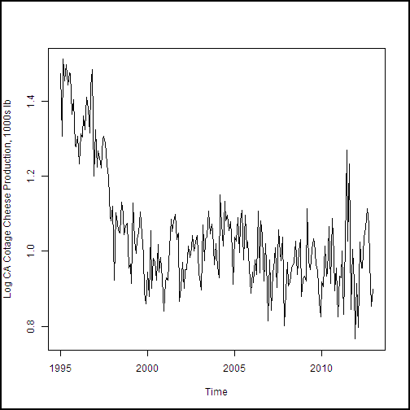

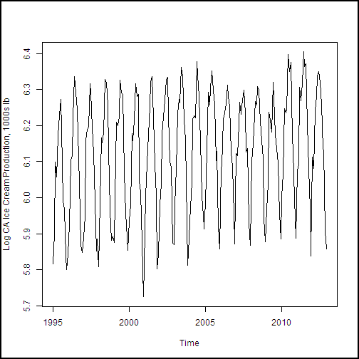

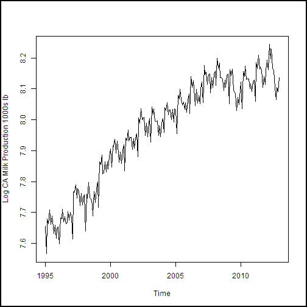

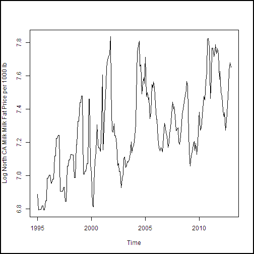

*Abbildung 22. Zeit Reihe Flächen Milchvieh Kalifornien und Preisdaten.*

### Ein Modell trend

Probleme erstellt eine Reihe Time-Objekt und hat einen Blick auf die Daten, beginnen Sie zunächst ein Modells Trend für die California Milch Daten erstellen. Dies ist mit einer Reihe Regression auf Zeit möglich. Es ist jedoch in der Zeichnung, die wir benötigen mehr als eine Steigung und ACHSENABSCHNITT, um genau den beobachteten Trend in den Schulungsdaten modellieren löschen.

Ausgehend von der kleinem Umfang der Daten, wird ich Erstellen des Modells für Trend in RStudio und dann Ausschneiden und einfügen das resultierende Modell in Azure maschinellen Learning. RStudio bietet eine interaktive Umgebung für diese Art von interaktive Analyse.

Als ersten werde ich eine polynomische Regression mit bis zu 3 Potenzen versuchen. Es ist einem real erhöhten einpassen zu viel auf folgende Arten von Datenmodellen. Daher ist es sinnvoll, Ausdrücke höherer Priorität zu vermeiden. Die `I()` (Funktion) unterdrückt Interpretation des Inhalts (interpretiert den Inhalt 'ungeändert') und ermöglicht Ihnen, eine Literal interpretierte Funktion in einer Regressionsgerade schreiben.

    milk.lm <- lm(Milk.Prod ~ Time + I(Month.Count^2) + I(Month.Count^3), data = cadairytrain)
    summary(milk.lm)

Dadurch wird die folgenden generiert.

    ##
    ## Call:
    ## lm(formula = Milk.Prod ~ Time + I(Month.Count^2) + I(Month.Count^3),
    ##     data = cadairytrain)
    ##
    ## Residuals:
    ##      Min       1Q   Median       3Q      Max
    ## -0.12667 -0.02730  0.00236  0.02943  0.10586
    ##
    ## Coefficients:
    ##                   Estimate Std. Error t value Pr(>|t|)
    ## (Intercept)       6.33e+00   1.45e-01   43.60   <2e-16 ***
    ## Time              1.63e-09   1.72e-10    9.47   <2e-16 ***
    ## I(Month.Count^2) -1.71e-06   4.89e-06   -0.35    0.726
    ## I(Month.Count^3) -3.24e-08   1.49e-08   -2.17    0.031 *  
    ## ---
    ## Signif. codes:  0 '***' 0.001 '**' 0.01 '*' 0.05 '.' 0.1 ' ' 1
    ##
    ## Residual standard error: 0.0418 on 212 degrees of freedom
    ## Multiple R-squared:  0.941,  Adjusted R-squared:  0.94
    ## F-statistic: 1.12e+03 on 3 and 212 DF,  p-value: <2e-16

Von Werten P (Kurs (> | t |)) in dieser Ausgabe können wir sehen, dass der quadratischen Ausdruck möglicherweise nicht signifikante. Verwende ich die `update()` (Funktion), um dieses Modell zu ändern, indem Sie den Ausdruck quadratischen ablegen.

    milk.lm <- update(milk.lm, . ~ . - I(Month.Count^2))
    summary(milk.lm)

Dadurch wird die folgenden generiert.

    ##
    ## Call:
    ## lm(formula = Milk.Prod ~ Time + I(Month.Count^3), data = cadairytrain)
    ##
    ## Residuals:
    ##      Min       1Q   Median       3Q      Max
    ## -0.12597 -0.02659  0.00185  0.02963  0.10696
    ##
    ## Coefficients:
    ##                   Estimate Std. Error t value Pr(>|t|)
    ## (Intercept)       6.38e+00   4.07e-02   156.6   <2e-16 ***
    ## Time              1.57e-09   4.32e-11    36.3   <2e-16 ***
    ## I(Month.Count^3) -3.76e-08   2.50e-09   -15.1   <2e-16 ***
    ## ---
    ## Signif. codes:  0 '***' 0.001 '**' 0.01 '*' 0.05 '.' 0.1 ' ' 1
    ##
    ## Residual standard error: 0.0417 on 213 degrees of freedom
    ## Multiple R-squared:  0.941,  Adjusted R-squared:  0.94
    ## F-statistic: 1.69e+03 on 2 and 213 DF,  p-value: <2e-16

Dies sieht besser aus. Alle Begriffe sind wichtig. Der Wert 2e-16 ist der Standardwert und sollten nicht zu sehr ernst unternommen werden.  

Als besten Test stellen Sie uns eine Uhrzeit Reihe Zeichnungsfläche Kalifornien Milchvieh Daten mit der Trend Kurve angezeigt. Kann ich den folgenden Code in das Azure maschinellen Learning [Ausführen R Skript] hinzugefügt haben[ execute-r-script] Modell (nicht RStudio) zum Erstellen des Modells und einer Zeichnung. Abbildung 23 wird das Ergebnis angezeigt.

    milk.lm <- lm(Milk.Prod ~ Time + I(Month.Count^3), data = cadairytrain)

    plot(cadairytrain$Time, cadairytrain$Milk.Prod, xlab = "Time", ylab = "Log CA Milk Production 1000s lb", type = "l")
    lines(cadairytrain$Time, predict(milk.lm, cadairytrain), lty = 2, col = 2)

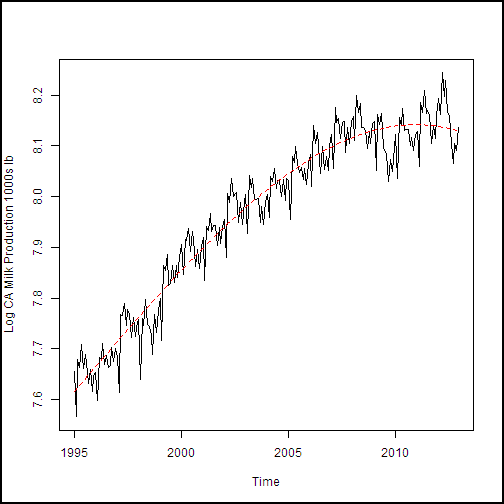

*Abbildung 23. Kalifornien Milch Herstellung Daten mit Trend Modell dargestellt.*

Es sieht so aus, wie das Modell Trend Daten ganz gut passt. Darüber hinaus anscheinend gibt es nicht Nachweis für Blinde Formstück, werden wie in der Kurve Modell unregelmäßigen verwackelt wird.  

###Saisonale Modell

Mit einem Modell Trend in Hand müssen wir drücken, und die saisonale Effekte enthalten. Wir verwenden den Monat eines Jahres als-platzhalterprodukt Variable im linearen Modell, um den Monat-Effekt erfassen. Beachten Sie, dass der y-Schnittpunkt Wenn Sie Faktor von Variablen in einem Modell einführen, nicht berechnet werden muss. Wenn Sie dies tun, wird die Formel zu viel angegeben ist, und R legen Sie die gewünschten Faktoren aber den Ausdruck Achsenabschnitt beibehalten werden.

Da wir ein Modells ausreichenden Trend haben können wir die `update()` Funktion zum Hinzufügen neuer Ausdrücke zum vorhandenen Modell. Die-1 in der Formel aktualisieren legt den Ausdruck Achsenabschnitt ab. In RStudio fortgesetzt für den Pearsonschen:

    milk.lm2 <- update(milk.lm, . ~ . + Month - 1)
    summary(milk.lm2)

Dadurch wird die folgenden generiert.

    ##
    ## Call:
    ## lm(formula = Milk.Prod ~ Time + I(Month.Count^3) + Month - 1,
    ##     data = cadairytrain)
    ##
    ## Residuals:
    ##      Min       1Q   Median       3Q      Max
    ## -0.06879 -0.01693  0.00346  0.01543  0.08726
    ##
    ## Coefficients:
    ##                   Estimate Std. Error t value Pr(>|t|)
    ## Time              1.57e-09   2.72e-11    57.7   <2e-16 ***
    ## I(Month.Count^3) -3.74e-08   1.57e-09   -23.8   <2e-16 ***
    ## MonthApr          6.40e+00   2.63e-02   243.3   <2e-16 ***
    ## MonthAug          6.38e+00   2.63e-02   242.2   <2e-16 ***
    ## MonthDec          6.38e+00   2.64e-02   241.9   <2e-16 ***
    ## MonthFeb          6.31e+00   2.63e-02   240.1   <2e-16 ***
    ## MonthJan          6.39e+00   2.63e-02   243.1   <2e-16 ***
    ## MonthJul          6.39e+00   2.63e-02   242.6   <2e-16 ***
    ## MonthJun          6.38e+00   2.63e-02   242.4   <2e-16 ***
    ## MonthMar          6.42e+00   2.63e-02   244.2   <2e-16 ***
    ## MonthMay          6.43e+00   2.63e-02   244.3   <2e-16 ***
    ## MonthNov          6.34e+00   2.63e-02   240.6   <2e-16 ***
    ## MonthOct          6.37e+00   2.63e-02   241.8   <2e-16 ***
    ## MonthSep          6.34e+00   2.63e-02   240.6   <2e-16 ***
    ## ---
    ## Signif. codes:  0 '***' 0.001 '**' 0.01 '*' 0.05 '.' 0.1 ' ' 1
    ##
    ## Residual standard error: 0.0263 on 202 degrees of freedom
    ## Multiple R-squared:     1,   Adjusted R-squared:     1
    ## F-statistic: 1.42e+06 on 14 and 202 DF,  p-value: <2e-16

Wir sehen, dass das Modell nicht mehr einen Begriff Achsenabschnitt weist und 12 signifikante Monat Faktoren hat. Dies ist genau das, was wir finden Sie unter wollten.

Wir stellen eine andere Uhrzeit Reihe Zeichnungsfläche Kalifornien Milchvieh Daten sehen, wie gut saisonale Modell arbeitet. Kann ich den folgenden Code in das Azure maschinellen Learning [Ausführen R Skript] hinzugefügt haben[ execute-r-script] zum Erstellen des Modells und einer Zeichnung.

    milk.lm2 <- lm(Milk.Prod ~ Time + I(Month.Count^3) + Month - 1, data = cadairytrain)

    plot(cadairytrain$Time, cadairytrain$Milk.Prod, xlab = "Time", ylab = "Log CA Milk Production 1000s lb", type = "l")
    lines(cadairytrain$Time, predict(milk.lm2, cadairytrain), lty = 2, col = 2)

Ausführen dieses Codes Azure Computer interessante erzeugt der Zeichnung in Abbildung 24 dargestellt.

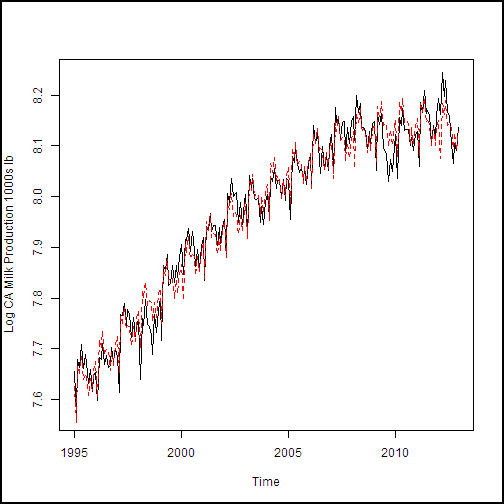

*Abbildung 24. Kalifornien Milchproduktion mit saisonale Effekte einschließlich Modell.*

Die an die Daten in der Abbildung 24 anpassen ist lieber da. Suchen Sie sowohl den Trend und der saisonale Effekt (monatliche Variation) angemessenen.

Als eine andere Überprüfung auf unser Modell lassen Sie uns einen Blick auf die Residuen aus. Der folgende Code berechnet die geschätzten Werten aus zwei-Modelle, berechnet die Residuen für saisonale Modell und dann zeichnet diese Residuen für die Ausbildung Daten.

    ## Compute predictions from our models
    predict1  <- predict(milk.lm, cadairydata)
    predict2  <- predict(milk.lm2, cadairydata)

    ## Compute and plot the residuals
    residuals <- cadairydata$Milk.Prod - predict2
    plot(cadairytrain$Time, residuals[1:216], xlab = "Time", ylab ="Residuals of Seasonal Model")

Abbildung 25 wird die Restwert Zeichnungsfläche angezeigt.

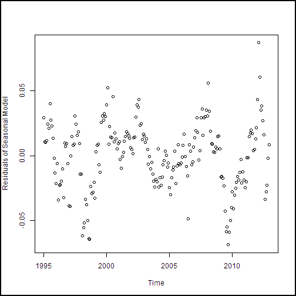

*Abbildung 25. Residuen des Modells für die Schulungsdaten saisonale.*

Diese Residuen suchen sinnvolle. Es gibt keine bestimmten Struktur, außer das Verhalten der Rezession 2008-2009, die unser Modell nicht berücksichtigt besonders gut.

Die Zeichnung in der Abbildung 25 angezeigtes eignet sich für das Erkennen von keine Abhängigkeit von der Zeit Muster in der Residuen. Der explizite Ansatz computing und Darstellung von der verwendeten Residuen legt die Residuen in Zeit Reihenfolge auf die Zeichnung. Wenn andererseits, ich gezeichnet haben `milk.lm$residuals`, die Zeichnung hätten in Zeit Reihenfolge.

Sie können auch `plot.lm()` um eine Reihe von Diagnoseprotokollen Flächen zu erzeugen.

    ## Show the diagnostic plots for the model
    plot(milk.lm2, ask = FALSE)

Dieser Code erzeugt eine Reihe von Diagnoseprotokollen Flächen 26 Abbildung dargestellt.

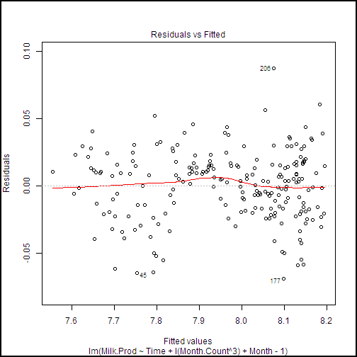

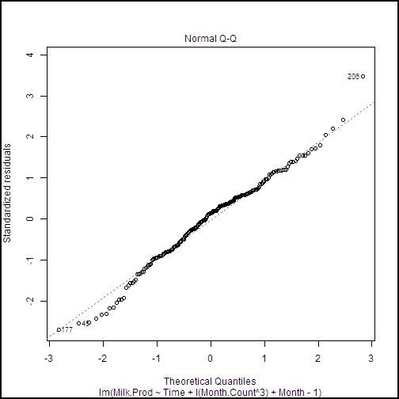

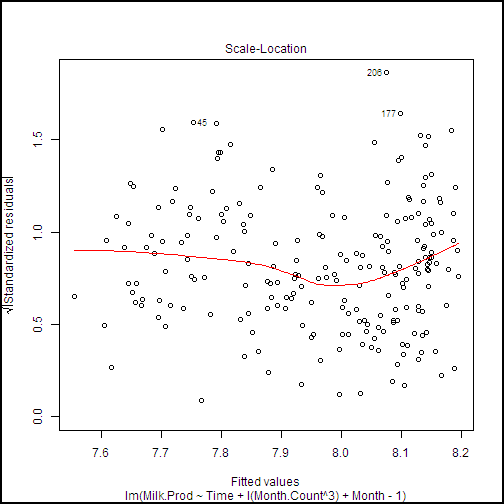

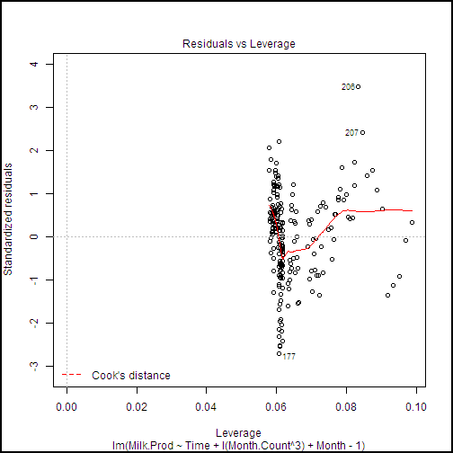

*Abbildung 26. Diagnostic zeichnet für saisonale Modell.*

Einige hochgradig Einfluss Punkte in relevante, jedoch nichts großer Wichtigkeit verursachen identifiziert werden. Darüber hinaus sehen aus der Zeichnung Normal F-F Sie, dass die Residuen schließen, um eine wichtige Annahme bei linearen Modellen normalverteilt sind.

###Prognose und Modell Bewertung

Es gibt nur einen zusätzlichen Schritt zum Beispiel abzuschließen. Müssen wir Trends zu berechnen und Messen des Fehlers anhand der tatsächlichen Daten. Unsere SCHÄTZER werden für die 12 Monate 2013. Wir können ein Fehler Measure für diese Planung und der tatsächlichen Daten, die nicht Bestandteil unserer Schulung Dataset ist zu berechnen. Darüber hinaus können wir Leistung der Schulungsdaten zu den 12 Monaten Datenseite Testen der 18 Jahren vergleichen.  

Eine Anzahl von Kennzahlen werden verwendet, um die Messen der Leistung von Zeit Reihe Modelle. In diesem Fall verwenden wir das quadratische Mittel (RMS) zurück. Die folgende Funktion berechnet den RMS-Fehler zwischen zwei Reihe.  

    RMS.error <- function(series1, series2, is.log = TRUE, min.length = 2){
      ## Function to compute the RMS error or difference between two
      ## series or vectors

      messages <- c("ERROR: Input arguments to function RMS.error of wrong type encountered",
                    "ERROR: Input vector to function RMS.error is too short",
                    "ERROR: Input vectors to function RMS.error must be of same length",
                    "WARNING: Funtion rms.error has received invald input time series.")

      ## Check the arguments
      if(!is.numeric(series1) | !is.numeric(series2) | !is.logical(is.log) | !is.numeric(min.length)) {
        warning(messages[1])
        return(NA)}

      if(length(series1) < min.length) {
        warning(messages[2])
        return(NA)}

      if((length(series1) != length(series2))) {
        warning(messages[3])
        return(NA)}

      ## If is.log is TRUE exponentiate the values, else just copy
      if(is.log) {
        tryCatch( {
          temp1 <- exp(series1)
          temp2 <- exp(series2) },
          error = function(e){warning(messages[4]); NA}
        )
      } else {
        temp1 <- series1
        temp2 <- series2
      }

     ## Compute predictions from our models
    predict1  <- predict(milk.lm, cadairydata)
    predict2  <- predict(milk.lm2, cadairydata)

    ## Compute the RMS error in a dataframe
      tryCatch( {
        sqrt(sum((temp1 - temp2)^2) / length(temp1))},
        error = function(e){warning(messages[4]); NA})
    }

Wie bei der `log.transform()` (Funktion), die im Abschnitt "Wert Transformationen" besprochen viele Auschecken und Ausnahme Wiederherstellung Fehlercode in dieser Funktion vorhanden ist. Die Grundsätze beschäftigt sind gleich. Die Arbeit an zwei Orten umschlossen abgeschlossen ist `tryCatch()`. Zunächst werden die Uhrzeit Reihe Exponentiated, da wir die Protokolle der Werte gearbeitet haben. Zweites, wird der tatsächliche RMS-Fehler berechnet.  

Ausgestattet mit einer Funktion messen, in den RMS-Fehler, lassen Sie uns erstellen und eine Dataframe mit den RMS-Fehlern ausgeben. Wir wird Ausdrücke für den Trend Modell allein und vollständigen Modells mit saisonale Faktoren berücksichtigen. Mit dem folgende Code erledigt die Arbeit mit den beiden linearen Modellen, die wir erstellt haben.

    ## Compute the RMS error in a dataframe
    ## Include the row names in the first column so they will
    ## appear in the output of the Execute R Script
    RMS.df  <-  data.frame(
    rowNames = c("Trend Model", "Seasonal Model"),
      Traing = c(
      RMS.error(predict1[1:216], cadairydata$Milk.Prod[1:216]),
      RMS.error(predict2[1:216], cadairydata$Milk.Prod[1:216])),
      Forecast = c(
        RMS.error(predict1[217:228], cadairydata$Milk.Prod[217:228]),
        RMS.error(predict2[217:228], cadairydata$Milk.Prod[217:228]))
    )
    RMS.df

    ## The following line should be executed only when running in
    ## Azure Machine Learning Studio
    maml.mapOutputPort('RMS.df')

Ausführen dieses Codes die Ausgabe der Abbildung 27 am Ergebnis Dataset Ausgabe Port angezeigt.

![Vergleich der RMS-Fehler für die Modelle][26]

*Abbildung 27. Vergleich der RMS-Fehler für die Modelle.*

Aus diesen Ergebnissen sehen wir, dass die saisonalen Faktoren in das Datenmodell hinzufügen den RMS-Fehler erheblich reduziert. Auch Lücke besteht der RMS-Fehler für die Ausbildung Daten ein wenig kleiner als für die Planung.

##Anhang A: Leitfaden für RStudio

RStudio ist ziemlich gut dokumentierten, sodass in diesem Anhang ich einige Links zu den wichtigsten Abschnitten der Dokumentation RStudio zu Ihnen den Einstieg anbieten wird.

1.  Erstellen von Projekten

    Sie können organisieren und Verwalten von R Code in Projekten mithilfe von RStudio. Die Dokumentation, die Projekte verwendet finden Sie unter https://support.rstudio.com/hc/articles/200526207-Using-Projects.

    Ich empfehlen, befolgen Sie diese Anweisungen und erstellen Sie ein Projekt für den R Codebeispielen in diesem Dokument.  

2.  Bearbeiten und Ausführen von R code

    RStudio bietet eine integrierte Umgebung für die Bearbeitung und R Code ausführen. Dokumentation finden Sie unter https://support.rstudio.com/hc/articles/200484448-Editing-and-Executing-Code.

3.  Für das Debuggen

    RStudio umfasst leistungsfähige Debuggen Funktionen. Dokumentation für diese Features ist unter https://support.rstudio.com/hc/articles/200713843-Debugging-with-RStudio.

    Die Funktionen für die Problembehandlung fortzuschreiten werden am https://support.rstudio.com/hc/articles/200534337-Breakpoint-Troubleshooting beschrieben.

##Anhang B: Lektüre

Lernprogramm R programming behandelt die Grundlagen des müssen die Sprache R mit Azure maschinellen Learning Studio verwenden. Wenn Sie nicht mit R vertraut sind, stehen zwei Einführung auf CRAN:

- R für Anfänger durch Emmanuel Paradis ist ein guter http://cran.r-project.org/doc/contrib/Paradis-rdebuts_en.pdf zu starten.  

- Einführung in die R durch w N. Venables Set. Al. Wechselt in ein bisschen genauer am http://cran.r-project.org/doc/manuals/R-intro.html.

Es gibt viele Bücher auf R, die Ihnen beim Einstieg helfen können. Hier sind einige, die ich hilfreich sein:

- Die Art der R Programmierung: eine Tour von statistischen Software Design von Norman Matloff ist eine hervorragende Einführung zu Programmierung in R.  

- R Kochbuch von Paul Teetor bietet einen Problem und Lösung Ansatz bei der Verwendung von R.  

- In Aktion von Robert Kabacoff R ist eine andere nützliche Einführung Adressbuch. Die Companion-Symbolleiste R-Website ist eine hilfreiche Ressource am http://www.statmethods.net/.

- R Inferno durch Patrick Burns ist ein erstaunlich lustig Adressbuch, die mit einer Reihe von knifflig und schwierig Themen behandelt, die beim Programmieren in r auftreten können Das Adressbuch ist http://www.burns-stat.com/documents/books/the-r-inferno/ kostenlos verfügbar.

- Wenn Sie eine detaillierte technische Informationen in den erweiterten Themen in R möchten, haben Sie wollen im Adressbuch erweitert R durch Hadley Wickham. Die Onlineversion von diesem Handbuch steht kostenlos auf http://adv-r.had.co.nz/.

Ein Katalog eines R Zeit Reihe-Paketen finden Sie in der Aufgabenansicht CRAN für die Reihe Zeitanalyse: http://cran.r-project.org/web/views/TimeSeries.html. Informationen zu bestimmten Zeitpunkt Reihe Pakete Objekt finden Sie in der Dokumentation für das Paket.

Im Adressbuch Einführung Zeitreihe mit R von Paul Cowpertwait und Andrew Metcalfe bietet eine Einleitung zur Verwendung von R für Zeit Reihe Analyse. Weitere theoretischen vielfach Beispiele R.

Einige großartige Internetressourcen:

- DataCamp: DataCamp vermittelt, R in den Komfort Ihres Browsers mit video Lektionen und Codierung Übungen. Es gibt interaktive Lernprogramme auf die neueste R Techniken und Pakete. Bearbeiten Sie das kostenlose interaktive R-Lernprogramm am https://www.datacamp.com/courses/introduction-to-r  

- Ein kurzes Lernprogramm R durch Kelly Black aus Clarkson University http://www.cyclismo.org/tutorial/R/

- 60 + R Ressourcen aufgeführt, die bei http://www.computerworld.com/article/2497464/business-intelligence-60-r-resources-to-improve-your-data-skills.html

<!--Image references-->
[1]: ./media/machine-learning-r-quickstart/fig1.png
[2]: ./media/machine-learning-r-quickstart/fig2.png
[3]: ./media/machine-learning-r-quickstart/fig3.png
[4]: ./media/machine-learning-r-quickstart/fig4.png
[5]: ./media/machine-learning-r-quickstart/fig5.png
[6]: ./media/machine-learning-r-quickstart/fig6.png
[7]: ./media/machine-learning-r-quickstart/fig7.png
[8]: ./media/machine-learning-r-quickstart/fig8.png
[9]: ./media/machine-learning-r-quickstart/fig9.png
[10]: ./media/machine-learning-r-quickstart/fig10.png
[11]: ./media/machine-learning-r-quickstart/fig11.png
[12]: ./media/machine-learning-r-quickstart/fig12.png
[13]: ./media/machine-learning-r-quickstart/fig13.png
[14]: ./media/machine-learning-r-quickstart/fig14.png
[15]: ./media/machine-learning-r-quickstart/fig15.png
[16]: ./media/machine-learning-r-quickstart/fig16.png
[17]: ./media/machine-learning-r-quickstart/fig17.png
[18]: ./media/machine-learning-r-quickstart/fig18.png
[19]: ./media/machine-learning-r-quickstart/fig19.png
[20]: ./media/machine-learning-r-quickstart/fig20.png
[21]: ./media/machine-learning-r-quickstart/fig21.png
[22]: ./media/machine-learning-r-quickstart/fig22.png

[26]: ./media/machine-learning-r-quickstart/fig26.png

<!--links-->
[appendixa]: #appendixa
[download]: https://azurebigdatatutorials.blob.core.windows.net/rquickstart/RFiles.zip

<!-- Module References -->
[execute-r-script]: https://msdn.microsoft.com/library/azure/30806023-392b-42e0-94d6-6b775a6e0fd5/
