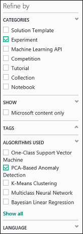
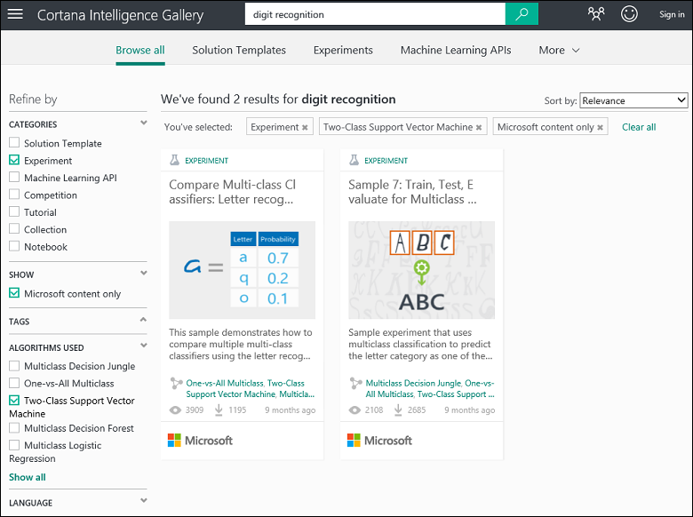
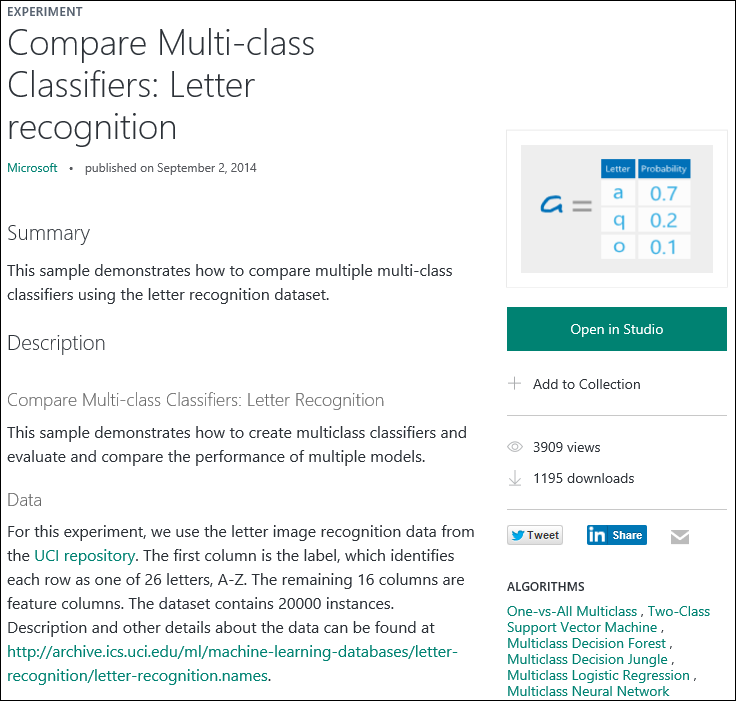

<properties
    pageTitle="Kopieren maschinellen learning Stichprobe Versuche | Microsoft Azure"
    description="Informationen Sie zum Beispiel maschinellen learning Versuche verwenden, um neue Versuche mit Cortana Intelligence Katalog und lernen, Microsoft Azure Computer zu erstellen."
    services="machine-learning"
    documentationCenter=""
    authors="cjgronlund"
    manager="jhubbard"
    editor="cgronlun"/>

<tags
    ms.service="machine-learning"
    ms.workload="data-services"
    ms.tgt_pltfrm="na"
    ms.devlang="na"
    ms.topic="get-started-article"
    ms.date="08/17/2016"
    ms.author="cgronlun;chhavib;olgali"/>

# Kopieren der Stichprobe Versuche zum Erstellen neuen Computers learning Versuche
Erfahren Sie, wie mit Stichprobe Versuche aus [Cortana Intelligence Katalog](http://gallery.cortanaintelligence.com/) beginnt, statt maschinellen Learning Versuche von Grund auf neu zu erstellen. Die Beispiele können Sie Ihre eigenen Computer learning Lösung erstellen.

Im Katalog sind Stichprobe Versuche von Microsoft Azure maschinellen Learning-Team sowie Beispiele von maschinellen Learning Community gemeinsam verwendet werden. Sie können auch Fragen oder Kommentare zu Versuche Posten.

Um so verwenden Sie den Katalog anzuzeigen, sehen Sie die 3-minütiges video [Gesprächspartner Arbeit zum Ausführen von Wissenschaft Daten kopieren](machine-learning-data-science-for-beginners-copy-other-peoples-work-to-do-data-science.md) aus der Serie [Daten Wissenschaft für Anfänger](machine-learning-data-science-for-beginners-the-5-questions-data-science-answers.md)aus.

[AZURE.INCLUDE [machine-learning-free-trial](../../includes/machine-learning-free-trial.md)]

## Suchen nach einem Versuch Cortana Intelligence Katalog kopieren

Wechseln Sie zu der [Katalog](http://gallery.cortanaintelligence.com/) und **Versuche** am oberen Rand der Seite klicken Sie auf, um festzustellen, welche Versuche verfügbar sind.

### Suchen Sie die neuesten oder am häufigsten verwendeten Versuche

Sie können auf dieser Seite finden Sie unter **zuletzt hinzugefügten** Versuche oder führen Sie einen Bildlauf nach unten zu wollen, **Was ist beliebte** oder die neuesten **beliebte Microsoft Versuche**.

### Suchen Sie nach einem Versuch, die bestimmte Anforderungen entspricht

Sämtliche Versuche durchsuchen:

1. Klicken Sie auf **Alle durchsuchen** , am oberen Rand der Seite.
2. Wählen Sie unter **verfeinern, indem Sie** **experimentieren** zur sämtliche Versuche im Katalog finden Sie unter ein.
3. Sie können Versuche finden, die Ihren Anforderungen einige verschiedene Arten entsprechen:
    * **Wählen Sie Filter auf der linken Seite aus.** Wählen Sie beispielsweise um Versuche durchsuchen, in denen eine Anomalie PCA-basierten Erkennungsalgorithmus verwendet, **experimentieren** , klicken Sie unter **Kategorien**und **PCA-Based Normalbetriebswerte** unter **Algorithmen verwendet**. (Wenn Sie dieses Algorithmus angezeigt werden, klicken Sie am Ende der Liste **Alle anzeigen** .)  
      
    *  **Verwenden Sie das Suchfeld ein.** Geben Sie beispielsweise um Versuche von Microsoft im Zusammenhang mit der Spracherkennung Ziffer beigetragen zu finden, die einen zwei Unterstützung Vector maschinellen Algorithmus verwenden, "Ziffer Erkennung" in das Suchfeld. Wählen Sie dann die Filter **experimentieren**, **nur Microsoft Inhalte**und **Zwei-Klasse Support Vektor Computer**aus: 
4. Klicken Sie auf eine experimentieren, um weitere Informationen.
5. Zum Ausführen und/oder den Versuch zu ändern, klicken Sie auf den Versuch der Seite auf **in Studio geöffnet** .

    > [AZURE.NOTE] Zum Öffnen einer experimentieren in Computer Learning Studio müssen Sie sich Ihre Anmeldeinformationen ein Microsoft-Konto anmelden. Wenn Sie noch nicht über einen Computer Learning-Arbeitsbereich, ein kostenloser Testversion Arbeitsbereich wird erstellt. [Erfahren Sie, was in den Computer Learning kostenlose Testversion enthalten](https://azure.microsoft.com/pricing/details/machine-learning/)

     

## Verwenden einer Vorlage in Computer Learning Studio

Sie können auch eine neue experimentieren in Computer Learning Studio mithilfe einer Stichprobe Katalog als Vorlage erstellen.

1. Melden Sie sich mit Ihre Anmeldeinformationen ein Microsoft-Konto, das [Studio](https://studio.azureml.net), und klicken Sie dann auf **neu** , um eine neue experimentieren zu erstellen.
2. Durchsuchen Sie den Beispieltext, und klicken Sie auf eine.

Eine neue experimentieren wird im Arbeitsbereich mit der Stichprobe experimentieren als Vorlage erstellt.

## Nächste Schritte
- [Bereiten Sie Ihrer Daten vor](machine-learning-data-science-import-data.md)
- [Versuchen Sie es mit R in Ihrem Versuch](machine-learning-r-quickstart.md)
- [Überprüfen der Stichprobe R Versuche](machine-learning-r-csharp-web-service-examples.md)
- [Erstellen einer Webdienst-API](machine-learning-publish-a-machine-learning-web-service.md)
- [Navigieren Sie sofort einsatzbereite Applikationen](https://datamarket.azure.com/browse?query=machine+learning)
