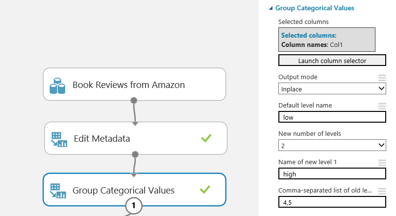
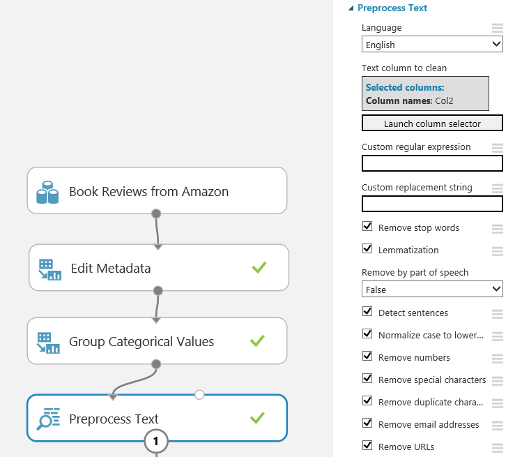
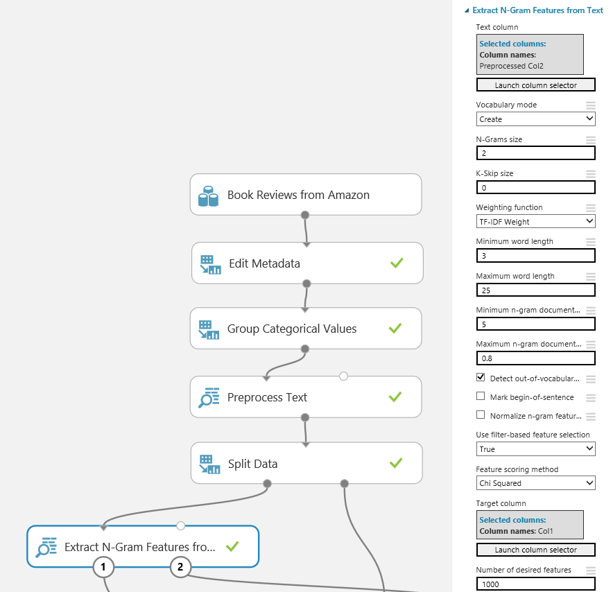
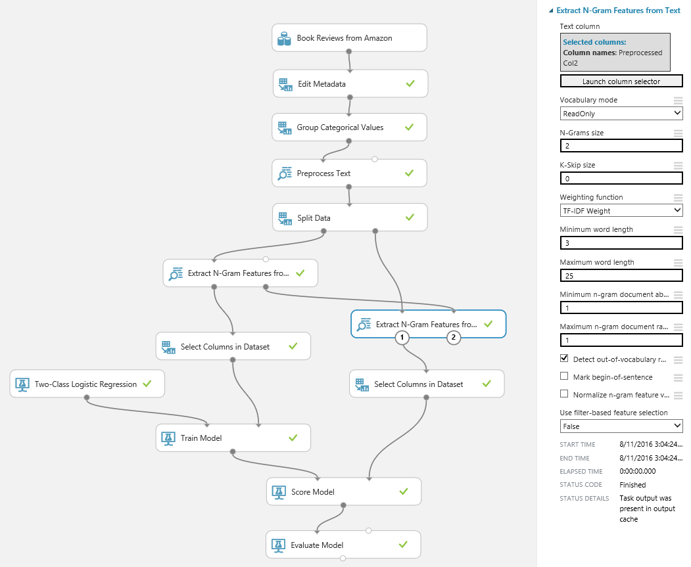
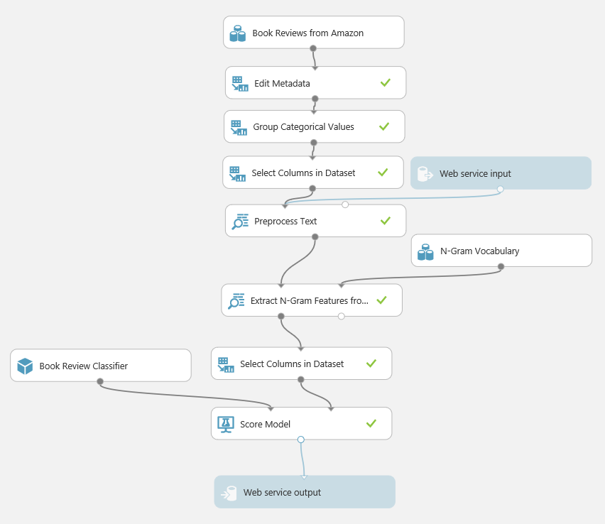

<properties
    pageTitle="Text in Azure maschinellen Learning Studio Analytics-Modelle erstellen | Microsoft Azure"
    description="So erstellen Sie Text Analytics-Modelle in Azure maschinellen Learning Studio Module für Text preprocessing, N – g oder Feature hashing verwenden"
    services="machine-learning"
    documentationCenter=""
    authors="rastala"
    manager="jhubbard"
    editor=""/>

<tags
    ms.service="machine-learning"
    ms.workload="data-services"
    ms.tgt_pltfrm="na"
    ms.devlang="na"
    ms.topic="article"
    ms.date="09/06/2016"
    ms.author="roastala" />

#Erstellen von Text Analytics-Modelle in Azure maschinellen Learning Studio

Azure maschinellen Schulung können das Erstellen und Prozessen umsetzen Text Analytics-Modelle. Diese Modelle vermitteln Ihnen ein, beispielsweise Dokument Klassifizierung oder Grüße Analyse Probleme zu lösen.

In einem Text Analytics experimentieren würden Sie normalerweise an:

 1. Bereinigen und Text Dataset verarbeiten
 2. Numerische Feature Vektoren vorher bearbeitete Text extrahieren
 3. Zug Klassifizierung oder Regression Modell
 4. Bewerten Sie und überprüfen Sie das Modell
 5. Bereitstellen des Modells zu Herstellung

In diesem Lernprogramm erfahren Sie folgende Schritte aus, wie wir eines Grüße Analysis-Modells mit Amazon Adressbuch Prüfungen Dataset durchzuführen (finden Sie in diesem Dokument Recherchieren "Biographien, Bollywood, Ausleger-Feldern und Blenders: Domäne Anpassung für Grüße Klassifikation" Johann Blitzer Dredze markieren und Fernando Pereira; Zuordnung von Computerlinguistik (ACL), 2007.) Dieses Dataset besteht aus überprüfen Bewertungen der Lesbarkeit (1 und 2 oder 4 und 5) und eine Freiform-Text. Ziel ist es, die Bewertung überprüfen Vorhersagen: Niedrig (1 - 2) oder hoch (4 und 5).

Sie können in diesem Lernprogramm am Cortana Intelligence Katalog verdeckt Versuche finden:

[Vorhersagen Sie Adressbuch Prüfungen] (https://gallery.cortanaintelligence.com/Experiment/Predict-Book-Reviews-1)

[Vorhersagen Sie Adressbuch Prüfungen - Vorhersage experimentieren] (https://gallery.cortanaintelligence.com/Experiment/Predict-Book-Reviews-Predictive-Experiment-1)

## Schritt 1: Bereinigen und Text Dataset verarbeiten

Beginnen wir die experimentieren, durch Dividieren der Ergebnisse überprüfen in kategorisierten Höchst- und Buckets das Problem als zwei-Klasse Klassifizierung zu erstellen. Wir verwenden [Metadaten bearbeiten] (https://msdn.microsoft.com/library/azure/dn905986.aspx) und Module [Gruppe kategorisierten Values] (https://msdn.microsoft.com/library/azure/dn906014.aspx).

Klicken Sie dann bereinigen wir den Text mithilfe von Modul [Text verarbeiten] (https://msdn.microsoft.com/library/azure/mt762915.aspx). Die säubern reduziert das Rauschen im Dataset, helfen Ihnen die wichtigsten Features zu finden, und verbessern die Genauigkeit des Modells abgeschlossen. Wir entfernen Stoppwörter - allgemeine Wörter wie "the" oder "a" - und Zahlen, Sonderzeichen, duplizierten Zeichen, e-Mail-Adressen und URLs. Wir auch konvertieren Sie den Text in Kleinbuchstaben, Wörter lemmatize, und erkennen Satz Begrenzung, die dann durch gekennzeichnet sind "|||" Symbol vorher bearbeitete Text.

Was passiert, wenn Sie eine benutzerdefinierte Liste von Stoppwörter verwenden? Sie können ihn als optionale Eingabe übergeben. Sie können auch benutzerdefinierte C#-Syntax regulären Ausdruck verwenden, um die untergeordneten Zeichenfolgen ersetzen und Wörter zu entfernen, indem Sie Teil eines Satzes: Substantive, Verben oder Adjektiven.

Nach Abschluss der preprocessing wir die Daten in Zug aufteilen und Datensätze zu testen.

## Schritt 2: Extrahieren Sie numerische Feature Vektoren vorher bearbeitete Text

Zum Erstellen eines Modells für Textdaten müssen Sie in der Regel Freiform-Text in numerischen Feature Vektoren konvertieren. In diesem Beispiel verwenden wir [N-g Features aus Text extrahieren] (https://msdn.microsoft.com/library/azure/mt762916.aspx)-Modul für die Datentransformation Text solche Format. Dieses Modul erfordert eine Spalte von Leerzeichen durch Trennzeichen getrennten Wörter und berechnet ein Wörterbuch Wörter oder N-g Wörter, die das Dataset angezeigt werden. Klicken Sie dann gezählt zählt, wie viele, wie oft jede word oder N-g, in jedem Datensatz angezeigt wird, und Feature Vektoren erstellt, von denen. In diesem Lernprogramm festlegen wir N-g Größe auf 2, damit unsere Feature Vektoren einzelne Wörter und zwei nachfolgenden Wortkombinationen enthalten.

Wir übernehmen TF * IDF (Ausdruck Häufigkeit umgekehrten Dokument Häufigkeit) auf der N-g Gewichtung ermittelt. Dieser Ansatz fügt die Stärke der Wörter, die häufig in einem einzigen Datensatz angezeigt, jedoch sind selten über das gesamte Dataset hinzu. Weitere Optionen umfassen binäre, TF, und mit einem Gewicht von Aktienkursen.

Solche Textfeatures müssen häufig hohe Anzahl der Dimensionen. Beispielsweise, wenn Ihre trennen 100.000 eindeutigen Wörter enthält, hätte Ihren Space Feature 100.000 Dimensionen oder mehrere, wenn N-g verwendet werden. Das Modul extrahieren N-g Features bietet Ihnen eine Reihe von Optionen zum Reduzieren der Anzahl der Dimensionen. Sie können auswählen, um Wörter auszuschließen, die kurzen oder langen, oder auch selten oder zu häufig signifikante Vorhersage-Wert haben sind. In diesem Lernprogramm schließen wir N g, die weniger als 5 Datensätze oder in mehr als 80 % der Datensätze angezeigt werden.

Darüber hinaus können Sie Featureauswahl verwenden, um nur bestimmte Features auszuwählen, die am häufigsten korrelierte mit Ziel-Vorhersage sind. Wir verwenden Chi-Quadrat-Featureauswahl 1000 Features auswählen. Sie können des Vokabulars der ausgewählten Wörter oder N-g anzeigen, indem Sie auf die korrekte Ausgabe des Moduls extrahieren N-g.

Als Alternative zu extrahieren N-g Features verwenden können Sie Feature Hashing Modul. Beachten Sie, obwohl die [Feature Hashing] (https://msdn.microsoft.com/library/azure/dn906018.aspx) nicht integrierte Features Auswahlfunktionen TF oder verfügt * IDF abwägen.

## Schritt 3: Schulen Sie Klassifizierung oder Regression Modell

Der Text weist jetzt Feature numerische Spalten transformiert wurden. Das Dataset enthält immer noch Zeichenfolgenspalten aus der vorherigen Phasen, damit wir Spalten auswählen im Dataset verwenden, um sie auszuschließen.

Wir verwenden dann [zwei-Klasse logistische Regression] (https://msdn.microsoft.com/library/azure/dn905994.aspx) um unser Ziel Vorhersagen: Punktzahl hohe oder niedrige überprüfen. An diesem Punkt wurde das Text Analytics Problem in eine normale Klassifizierung Problem transformiert. Die verfügbaren Azure Computer interessante Tools können Sie um das Modell zu verbessern. Sie können beispielsweise experimentieren Sie mit anderen Klassifizierern, um herauszufinden, wie genau Ergebnisse, die sie gewähren, oder verwenden Hyperparameter angepasst werden, um die Genauigkeit zu verbessern.

## Schritt 4: Bewerten Sie, und überprüfen Sie das Modell

Wie prüfen Sie das ausgebildete Modell? Wir erzielen sie gegen das Test-Dataset und die Genauigkeit auswerten. Das Modell Kenntnisse jedoch des Vokabulars der N-g und ihrem jeweiligen Gewicht aus dem Dataset Schulung. Wir sollten daher die Begriffe und diese-Stärken verwenden, wenn Sie Features von Daten für die Tests im Gegensatz zum Erstellen von einer neuen Vokabulars extrahieren. Daher wir Modul extrahieren N g Features in den Punktzahl Zweig von den Versuch hinzufügen, das Ausgabe Vokabular aus Schulung Zweig verbinden und den Vokabular Modus auf schreibgeschützt festzulegen. Wir auch deaktivieren das Filtern von N-g nach Häufigkeit durch Festlegen der Minimalwert 1 Instanz und Maximum auf 100 % und deaktivieren Sie die Featureauswahl.

Nach die Spalte Testdaten Feature numerische Spalten transformiert wurden, schließen wir die Zeichenfolgenspalten aus der vorherigen Phasen wie in Schulung Verzweigung. Wir verwenden dann Punktzahl Modell Modul, Vorhersagen zu erstellen und auswerten Modell-Modul für die Genauigkeit ausgewertet werden soll.

## Schritt 5: Bereitstellen des Modells für Herstellung

Das Modell ist in Kürze in Herstellung bereitgestellt werden. Wenn als Webdienst bereitgestellt, es Freiform-Textzeichenfolge als Eingabe akzeptiert und zurückgeben eine Vorhersage "Hoch" oder "Niedrig". Das Gelernte N-g Vokabular verwendet, um Text Features und ausgebildeten logistische Regressionsmodell für eine Vorhersage von diese Funktionen transformieren. 

Zum Einrichten der Vorhersage experimentieren speichern wir zuerst der N-g Begriffe als Dataset, und das Modell ausgebildeten logistische Regression aus der Schulung Teil der experimentieren. Klicken Sie dann speichern wir den Versuch, die mit "Speichern unter" zum Erstellen eines Diagramms experimentieren für Vorhersage experimentieren. Wir Entfernen des Moduls aufgeteilten Daten und der Schulung Verzweigung aus dem Versuch, ein. Wir dann die zuvor gespeicherte N-g-Begriffe und Modell Herstellen einer Verbindung mit N-g-Features extrahieren und Module Punktzahl Modell, Hilfethemas. Wir entfernen auch das Modul Modell ausgewertet werden soll.

Wir wählen Sie Spalten im Dataset Modul vor dem Text verarbeiten Modul So entfernen Sie die Beschriftungsspalte einfügen, und deaktivieren Sie "Anfügen Punktzahl Spalte Dataset" Option im Modul Punktzahl. Auf diese Weise fordert der Webdienst nicht, die Beschriftung, die sie vorhersagen will, und Features nicht Echo verfügt über die Eingabe in die Antwort.

Nun verfügen wir einem Versuch, die als Webdienst veröffentlicht und mit der Anforderung-Antwort oder einer Batchdatei Ausführung APIs aufgerufen werden kann.

## Nächste Schritte

Erfahren Sie mehr über Text Analytics Module aus [MSDN-Dokumentation] (https://msdn.microsoft.com/library/azure/dn905886.aspx).
