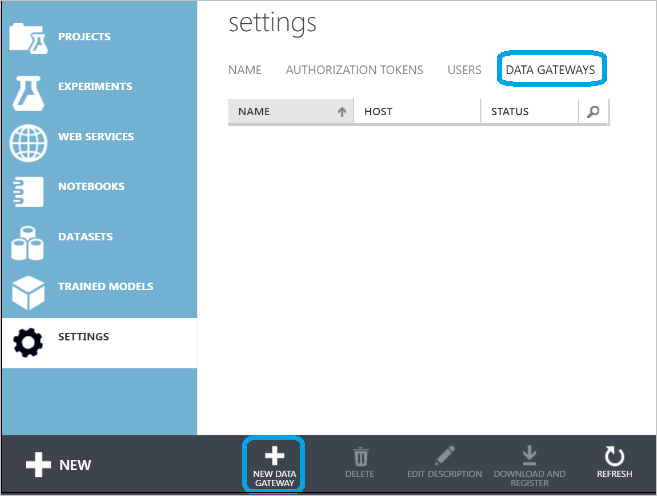
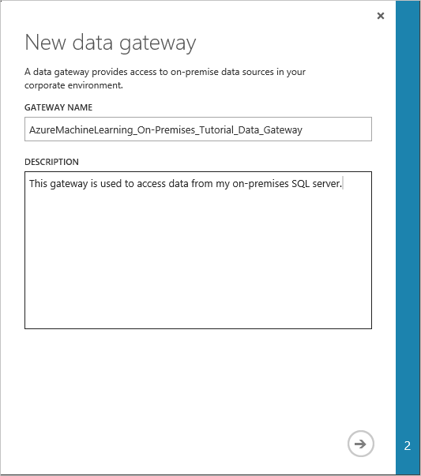
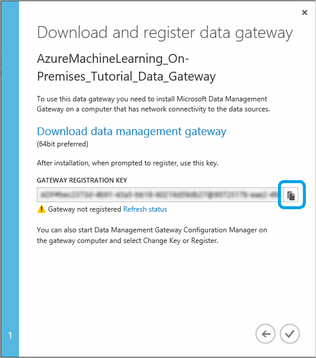
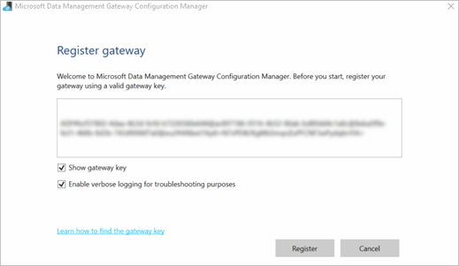
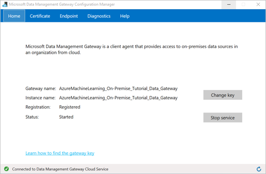

<properties
pageTitle="Verwenden von Daten aus einer lokalen SQL Server-Datenbank in Computer Learning | Azure"
description="Verwenden Sie Daten aus einer lokalen SQL Server-Datenbank, um erweiterte Analytics mit Azure maschinellen Learning auszuführen."
services="machine-learning"
documentationCenter=""
authors="garyericson"
manager="jhubbard"
editor="cgronlun"/>

<tags
ms.service="machine-learning"
ms.workload="data-services"
ms.tgt_pltfrm="na"
ms.devlang="na"
ms.topic="article"
ms.date="09/16/2016"
ms.author="garye;krishnan"/>

# Führen Sie erweiterte Analytics mit Azure maschinellen Learning mithilfe von Daten aus einer lokalen SQL Server-Datenbank

Häufig Unternehmen, die Arbeit mit lokaler Daten möchte nutzen, von dem Maßstab und und Flexibilität der Cloud für ihren Rechner learning Auslastung. Aber nicht möchten, um ihre aktuellen Geschäftsprozesse und Workflows zu stören, indem Sie ihre Daten lokal in der Cloud verschieben. Azure maschinellen Learning unterstützt jetzt Lesen von Daten aus einer lokalen SQL Server-Datenbank und dann Schulung und Bewerten eines Modells mit diesen Daten. Sie müssen nicht mehr manuell kopieren und Synchronisieren von Daten zwischen der Cloud und Ihrem lokalen Server. Stattdessen kann das Modul **Importieren von Daten** in Azure maschinellen Learning Studio nun direkt aus Ihrem lokalen SQL Server-Datenbank für Ihre Schulung und bewerten Aufträge lesen. 

Dieser Artikel enthält eine Übersicht, wie eingehende SQL Server-Daten in Azure maschinellen Learning lokalen. Es wird vorausgesetzt, dass es sich bei Ihnen bekannte Azure maschinellen Learning Konzepte wie Arbeitsbereiche, Module, Datasets, Versuche oder *usw.*..

> [AZURE.NOTE] Dieses Feature ist nicht verfügbar für kostenlosen Arbeitsbereiche. Weitere Informationen zur maschinellen Learning-Preisgestaltung und Ebenen, finden Sie unter [Azure maschinellen Learning Preise](https://azure.microsoft.com/pricing/details/machine-learning/).

<!-- --> 

[AZURE.INCLUDE [machine-learning-free-trial](../../includes/machine-learning-free-trial.md)]

## Installieren Sie das Microsoft-Datenverwaltungsgateway

Zugriff auf eine lokale SQL Server-Datenbank Azure Computer interessante müssen Sie herunterladen und installieren das Microsoft-Datenverwaltungsgateway aus. Beim Konfigurieren der Gateway-Verbindungs in Computer Learning Studio müssen Sie die Möglichkeit zum Herunterladen und Installieren des Gateways im Dialogfeld **Download und Register Daten Gateways** , die nachfolgend beschriebenen verwenden.

Sie können auch das Datenverwaltungsgateway voraus installieren, indem Sie herunterladen und dem MSI-Installationspaket aus dem [Microsoft Download Center](https://www.microsoft.com/download/details.aspx?id=39717)ausgeführt. Wählen Sie die neueste Version, 32-Bit- oder 64-Bit-Bedarf Ihren Computer auswählen aus. Die MSI-Datei kann auch so aktualisieren Sie eine vorhandene Datenverwaltungsgateway auf die neueste Version, mit alle Einstellungen beibehalten verwendet werden.

Das Gateway weist die folgenden Komponenten:

- Unterstützten Windows-Betriebssystemversionen sind Windows 7, Windows 8/8.1, 10 für Windows, Windows Server 2008 R2, Windows Server 2012 und Windows Server 2012 R2.
- Die empfohlene Konfiguration für die Gatewaycomputer ist mindestens 2 GHz, 4 Kernen, 8 GB RAM und 80 GB Festplatten.
- Wenn der Hostcomputer im Ruhezustand befindet, kann das Gateway keine Daten Besprechungsanfragen beantworten werden. Daher können konfigurieren Sie einen entsprechenden Power-Plan auf dem Computer vor der Neuinstallation des Gateways. Die Gateway-Installation wird eine Meldung angezeigt, wenn der Computer den Ruhezustand konfiguriert ist.
- Da kopieren Aktivitäten mit einer bestimmten Häufigkeit auftritt, resultiert Ressource: Einsatz (CPU, Speicher) auf dem Computer auch das gleiche Muster mit Höchstwert und im Leerlauf Zeiten aus. Ressource Auslastung hängt auch stark von der Datenmenge verschoben wird. Wenn mehrere Kopieraufträge ausgeführt werden erhalten Sie Ressource: Einsatz Höchstwert Zeiten steigen beobachten. Während die minimale Konfiguration aufgeführten technisch betrachtet nicht ausreichend ist, möchten Sie möglicherweise eine Konfiguration mit mehr Ressourcen als die minimale Konfiguration je nach der bestimmten Auslastung für das Verschieben von Daten haben.

Berücksichtigen Sie beim Einrichten und Verwenden eines Datenverwaltungsgateways Folgendes ein:

- Sie können nur eine Instanz des Datenverwaltungsgateways auf einem Computer installieren.
- Sie können ein einzelnes Gateway für mehrere lokale Datenquellen verwenden.
- Sie können mehrere Gateways auf unterschiedlichen Computern mit der gleichen lokalen Datenquelle herstellen.
- Sie konfigurieren ein Gateways für nur einen Arbeitsbereich jeweils ein. Gateways können zu diesem Zeitpunkt Arbeitsbereiche hinweg freigegeben werden.
- Sie können mehrere Gateways für einen einzelnen Arbeitsbereich konfigurieren. Möglicherweise möchten Sie beispielsweise eines Gateways, das auf Ihre Test-Datenquellen während der Entwicklung verbunden ist und ein Gateway Herstellung verwenden, wenn Sie bereit sind, Prozessen umsetzen.
- Das Gateway muss nicht auf dem gleichen Computer als Datenquelle werden, aber zur Vermeidung näher an der Datenquelle weniger Zeit für das Gateway die Verbindung zur Datenquelle herstellen. Es empfiehlt sich, dass Sie des Gateways auf einem Computer, die sich von der unterscheidet, die die lokalen Datenquelle hostet installieren, damit dem Gateway und der Datenquelle nicht für Ressourcen konkurrieren.
- Wenn Sie bereits über ein Gateway auf Ihrem Computer mit dem Erstellen von Power BI oder Azure Data Factory Szenarien installiert haben, installieren Sie einen separaten Gateway für Azure maschinellen Schulung, auf einem anderen Computer. 

    > [AZURE.NOTE] Datenverwaltungsgateway und Power BI-Gateway kann nicht auf dem gleichen Computer ausgeführt werden.

- Sie müssen das Datenverwaltungsgateway für Azure maschinellen Learning zu verwenden, auch wenn Sie Azure ExpressRoute für andere Daten verwenden. Sie sollten Ihre Datenquelle als einer lokalen Datenquelle (die hinter einer Firewall befindet) behandeln auch wenn Sie ExpressRoute verwenden und das Datenverwaltungsgateway verwenden, um die Verbindung zwischen dem Computer lernen und der Datenquelle herzustellen. 

Ausführliche Informationen zu Installationsvoraussetzungen, Installationsschritte und Tipps zur Problembehandlung finden Sie im Artikel [Verschieben von Daten zwischen lokalen Quellen und Cloud mit Datenverwaltungsgateway](../data-factory/data-factory-move-data-between-onprem-and-cloud.md#considerations-for-using-data-management-gateway), beginnend mit im Abschnitt [Aspekte der Verwendung von Datenverwaltungsgateway](../data-factory/data-factory-move-data-between-onprem-and-cloud.md#considerations-for-using-data-management-gateway)haben.

## Eingehende Daten aus lokalen SQL Server-Datenbank in Azure Computer-Schulung

In dieser Anleitung erfahren Einrichten eines Datenverwaltungsgateways in einem Arbeitsbereich Azure maschinellen Schulung, konfigurieren und Lesen Sie dann die Daten aus einer lokalen SQL Server-Datenbank.

> [AZURE.TIP] Bevor Sie beginnen, deaktivieren Sie den Druckbefehl des Browsers Popupblocker für `studio.azureml.net`. Wenn Sie den Google Chrome-Browser verwenden, herunterladen Sie und installieren Sie mehrere Plug-ins erhältlich bei Google Chrome WebStore [Klicken Sie auf einmal App Erweiterung](https://chrome.google.com/webstore/search/clickonce?_category=extensions).

### Schritt 1: Erstellen eines Gateways

Dieser erste Schritt besteht zu erstellen und Einrichten des Gateways Zugriff auf Ihre lokalen SQL-Datenbank.

1. Melden Sie sich [Azure maschinellen Learning Studio](https://studio.azureml.net/Home/) , und wählen Sie den Arbeitsbereich, der Sie arbeiten möchten.

2. Klicken Sie auf das Blade **EINSTELLUNGEN** auf der linken Seite, und klicken Sie dann auf der Registerkarte **DATENGATEWAYS** oben.

3. Klicken Sie auf **Neue DATENVERWALTUNGSGATEWAY** am unteren Rand des Bildschirms.

    

4. Klicken Sie im Dialogfeld **neue datenverwaltungsgateway** Geben Sie den **Namen** und optional fügen Sie eine **Beschreibung hinzu**. Klicken Sie auf den Pfeil in der unteren rechten Ecke, mit dem nächsten Schritt der Konfiguration zu gelangen.

    

5. Herunterladen und Register datenverwaltungsgateway im Dialogfeld in die Zwischenablage kopieren der GATEWAY-REGISTRIERUNGSSCHLÜSSEL.

    

6. Wenn Sie noch nicht heruntergeladen und das Microsoft-Datenverwaltungsgateway installiert haben, klicken Sie dann auf **datenverwaltungsgateway herunterladen**. Dadurch gelangen Sie zum Microsoft Download Center, wo Sie können die Gateway-Version, die Sie ihn herunterladen müssen, die wählen Sie aus, und installieren Sie es. Ausführliche Informationen auf Installationsvoraussetzungen, Installationsschritte und Tipps zur Problembehandlung finden Sie in den Abschnitten Anfang des Artikels [Verschieben von Daten zwischen lokalen Quellen und Cloud mit Datenverwaltungsgateway](../data-factory/data-factory-move-data-between-onprem-and-cloud.md).

7. Nach der Installation des Gateways Daten Management Gateway-Konfigurations-Manager wird geöffnet, und das Dialogfeld **Gateway zu registrieren** wird angezeigt. Fügen Sie den **Gateway-Registrierungsschlüssel** , den Sie in die Zwischenablage kopiert haben, und klicken Sie auf **Registrieren**.

8. Wenn Sie bereits über ein Gateway installiert haben, führen Sie die Daten Management Gateway-Konfigurations-Manager auf **Key ändern**, fügen Sie den  **Gateway-Registrierungsschlüssel** , den Sie in die Zwischenablage kopiert haben, und klicken Sie auf **OK**.

9. Wenn die Installation abgeschlossen ist, wird das Dialogfeld **Gateway zu registrieren** für Microsoft Data Management Gateway-Konfigurations-Manager angezeigt. Fügen Sie der GATEWAY-REGISTRIERUNGSSCHLÜSSEL, den Sie in die Zwischenablage oben kopiert haben, und klicken Sie auf **Registrieren**.

    

10. Die Gateway-Konfiguration ist abgeschlossen, wenn die folgenden Werte, klicken Sie auf der Registerkarte **Start** in Microsoft Data Management Gateway-Konfigurations-Manager festgelegt sind:

    - **Gatewayname** und den **Instanznamen** werden auf den Namen des Gateways festgelegt.

    - **Registrierung** wird auf **registriert**festgelegt.

    - **Status** wird auf **gestartet**festgelegt.

    - Die Statusleiste am unteren Bildschirmrand wird **verbunden mit Daten Management Gateway-Cloud-Dienst** zusammen mit einem grünen Häkchen angezeigt.

     

     Azure maschinellen Learning Studio ruft auch aktualisiert, wenn die Registrierung erfolgreich ist.

    

11. Klicken Sie im Dialogfeld **herunterladen und datenverwaltungsgateway zu registrieren** auf das Häkchen, um die Einrichtung abzuschließen. **Die Einstellungsseite** zeigt den gatewaystatus als "Online". Klicken Sie im rechten finden Sie Status und andere nützliche Informationen.

    

12. Microsoft Data Management Gateway Konfigurations-Manager wechseln zur Registerkarte **Zertifikat** . Das Zertifikat, das auf dieser Registerkarte festgelegten dient zum Verschlüsseln/Anmeldeinformationen für den lokalen Datenspeicher entschlüsseln, die Sie im Portal angeben. Dies ist der Standardzertifikat, das generiert wird. Microsoft empfiehlt, ändern dies in Ihrer eigenen Zertifikat, das Sie in Ihrem Zertifikat Managementsystem sichern. Klicken Sie auf **Ändern** , um Ihr eigenes Zertifikat stattdessen verwenden.

    

13. (optional) Wenn Sie akzeptieren, um Probleme mit dem Gateway behandelt die ausführliche Protokollierung aktivieren möchten, wechseln Sie zur Registerkarte **Diagnose** in der Konfigurations-Manager von Microsoft Data Management des, und aktivieren Sie die Option **für die Problembehandlung ausführliche Protokollierung aktivieren** . Die protokollierten Informationen finden Sie in der Windows-Ereignisanzeige unter **Anwendungen und Dienste Protokolle**  - &gt; **Datenverwaltungsgateway** -Knoten. Sie können auch die Registerkarte **Diagnose** zum Testen der Verbindung mit einer lokalen Datenquelle mithilfe des Gateways verwenden.

    

Dies schließt das Gateway Prozess Azure Computer interessante einrichten.
Sie nun können die Daten lokal verwenden.

Sie können erstellen und Einrichten von mehreren Gateways in Studio für jeden Arbeitsbereich. Angenommen, Sie möglicherweise eines Gateways, das Sie während der Entwicklung mit der Test-Datenquellen herstellen möchten, und einem anderen Gateway für Ihre Herstellung Datenquellen. Azure maschinellen Learning bietet Ihnen die Flexibilität mehrerer Gateways abhängig von Ihrer Umgebung Ihres Unternehmens einrichten. Aktuell Gateway zwischen Arbeitsbereiche können nicht freigegeben werden, und nur von einem Gateway kann auf einem einzelnen Computer installiert werden. Weitere Aspekte, die bei der Installation des Gateways finden Sie im Artikel [Verschieben von Daten zwischen lokalen Quellen und Cloud mit Datenverwaltungsgateway](../data-factory/data-factory-move-data-between-onprem-and-cloud.md) [Aspekte der Verwendung von Datenverwaltungsgateway](../data-factory/data-factory-move-data-between-onprem-and-cloud.md#considerations-for-using-data-management-gateway) .

### Schritt 2: Verwenden des Gateways zum Lesen von Daten aus einer lokalen Datenquelle

Nachdem Sie das Gateway eingerichtet haben, können Sie ein Modul **Importieren von Daten** zu einem Versuch hinzufügen, die die Daten aus lokalen SQL Server-Datenbank eingibt.

1.  In Computer Learning Studio wählen Sie die Registerkarte **Versuche** , klicken Sie auf **+ neu** in der unteren linken Ecke, und wählen Sie **Leere experimentieren** (oder wählen Sie eine der mehrere Stichprobe Versuche verfügbar).

2.  Suchen nach, und ziehen Sie das Modul **Importieren von Daten** in den Zeichenbereich experimentieren.

3.  Klicken Sie auf **Speichern** unter den Zeichenbereich. Geben Sie "Azure maschinellen Learning lokalen SQL Server-Lernprogramm" für den Namen experimentieren, wählen Sie den Arbeitsbereich aus, und klicken Sie auf das Häkchen **OK** .

    

4.  Klicken Sie auf das Modul **Daten importieren** , um ihn auszuwählen, und klicken Sie dann im Bereich **Eigenschaften** rechts neben den Zeichenbereich, wählen Sie in der Dropdownliste **Datenquelle** "Lokalen SQL-Datenbank" aus.

5.  Wählen Sie das **Gateway Daten** Sie installiert und registriert. Sie können ein anderes Gateway einrichten, indem Sie "(Hinzufügen neuen Datenverwaltungsgateway...)" auswählen.

    

6.  Geben Sie die SQL **Server-Datenbankname** und den **Datenbanknamen**, zusammen mit der SQL- **Datenbankabfrage** , die Sie ausführen möchten.

7.  Klicken Sie auf **Eingabe Werte** unter **Benutzername und Kennwort** ein, und geben Sie Ihre Datenbankanmeldeinformationen. Sie können integrierte Windows-Authentifizierung oder SQL Server-Authentifizierung, je nachdem, wie Ihre lokalen SQL Server konfiguriert ist.

    
    
    Die Meldung "Werte erforderlich" ändert sich in "Werte festlegen" mit einem grünen Häkchen angezeigt. Sie müssen lediglich die Anmeldeinformationen gleichzeitig eingeben, es sei denn, die Datenbankinformationen oder Kennwort geändert wird. Azure maschinellen Learning verwendet das Zertifikat, das Sie bei der Installation des Gateways auf die Verschlüsselung der Anmeldeinformationen in der Cloud bereitgestellt. Azure werden nie lokale Anmeldeinformationen ohne Verschlüsselung gespeichert.

    

8.  Klicken Sie auf **Ausführen** , um den Versuch auszuführen.

Nach Beendigung der experimentieren kann ausführen, müssen Sie die Daten grafisch darzustellen, die Sie aus der Datenbank importiert haben, indem Sie auf den Ausgang des Moduls **Daten importieren** und **visualisieren**.

Nachdem Sie die Entwicklung Ihrer experimentieren abgeschlossen haben, können Sie bereitstellen und Prozessen umsetzen Modell. Verwenden den Stapel Ausführung Dienst, werden zur Bewertung Daten aus lokalen SQL Server-Datenbank, die so konfiguriert, dass im Modul " **Daten importieren** " gelesen und verwendet. Während Sie die Antwort anfordern Service zur Bewertung lokaler Daten verwenden können, empfiehlt es sich stattdessen mit dem [Excel-Add-in](machine-learning-excel-add-in-for-web-services.md) . Derzeit wird mit einer lokalen SQL Server schreiben Datenbank durch die **Daten exportieren** nicht in Ihrer Versuche oder veröffentlichten Webdienste unterstützt.

