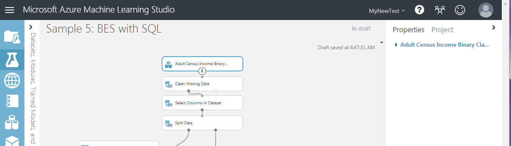
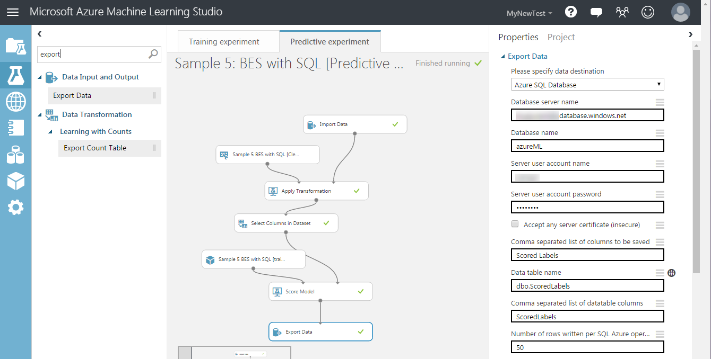

<properties
    pageTitle="Bereitstellen von Azure ML-Webdiensten, mit denen Daten importieren und Exportieren von Daten Module | Microsoft Azure"
    description="Erfahren Sie, wie die Module Daten importieren und Exportieren von Daten für das Senden und Empfangen von Daten von einem Webdienst verwendet."
    services="machine-learning"
    documentationCenter=""
    authors="vDonGlover"
    manager="raymondlaghaeian"
    editor=""/>

<tags
    ms.service="machine-learning"
    ms.workload="data-services"
    ms.tgt_pltfrm="na"
    ms.devlang="na"
    ms.topic="article"
    ms.date="08/12/2016"
    ms.author="v-donglo"/>

# Bereitstellen von Azure ML-Webdiensten, die Daten importieren und Exportieren von Daten Module verwenden 

Beim Erstellen einer Vorhersage experimentieren, fügen Sie einer Web Service Eingabe- und in der Regel hinzu. Wenn Sie den Versuch bereitstellen, können Nutzer senden und Empfangen von Daten aus dem Webdienst durch die Eingaben und Ausgaben. Bei einigen Applikationen möglicherweise einen Consumer, der Daten aus einem Datenfeed zur Verfügung oder befinden sich bereits in einer externen Datenquelle, z. B. Azure Blob-Speicher. In diesen Fällen müssen sie nicht lesen und Schreiben von Daten mithilfe von Web Service ein- und Ausgaben. Sie können, verwenden Sie stattdessen den Stapel Ausführung Service (l) zum Lesen von Daten aus der Datenquelle mithilfe eines Moduls Daten importieren und Schreiben der Punktzahl Ergebnisse an eine andere Daten Position ein Modul Exportieren von Daten mit.

Die Daten importieren und exportieren Daten Module, kann Lese- und auf eine Anzahl von Ihnen bereitgestellten Orten wie z. B. eine Web-URL über HTTP, einer Abfrage Struktur, eine SQL Azure-Datenbank, Azure Table Storage, Azure Blob-Speicher, einem Datenfeed Daten oder einer SQL-Datenbank mit lokalen schreiben.

In diesem Thema wird verwendet, die "Beispiel 5: Zug, Tests auswerten für binäre Klassifizierung: Erwachsenen Dataset" (Beispiel) und es wird vorausgesetzt, das Dataset wurde bereits in einer SQL Azure-Tabelle mit dem Namen Censusdata geladen.

## Erstellen des Versuchs Schulung 
 
Beim Öffnen der "Beispiel 5: Zug, Tests auswerten für binäre Klassifizierung: Erwachsenen Dataset" Stichprobe Stichprobe Erwachsenen Erhebung Einkommen binäre Klassifizierung Dataset verwendet. Und der Versuch in den Zeichenbereich ist sieht ungefähr wie die folgende Abbildung.

  

Lesen Sie die Daten aus der SQL Azure-Tabelle:

1.  Löschen Sie das Dataset Modul.
2.  Geben Sie im Feld Suchen Komponenten importieren.
3.  Hinzufügen von aus der Ergebnisliste ein Modul *Importieren von Daten* zu den Zeichenbereich experimentieren.
4.  Verbinden Sie die Ausgabe des Moduls *Daten importieren* die Eingabe des Moduls *Säubern fehlen Daten* .
5.  Wählen Sie im Eigenschaftenbereich **Azure SQL-Datenbank** in der Dropdownliste **Datenquelle** aus.
6.  Geben Sie in der **Datenbankservername**, **Datenbankname**, **Benutzername**und **Kennwort** Felder die entsprechende Informationen für die Datenbank ein.
7.  Geben Sie im Feld Datenbank Abfrage die folgende Abfrage ein.

        select [age],
           [workclass],
           [fnlwgt],
           [education],
           [education-num],
           [marital-status],
           [occupation],
           [relationship],
           [race],
           [sex],
           [capital-gain],
           [capital-loss],
           [hours-per-week],
           [native-country],
           [income]
        from dbo.censusdata;

8.  Klicken Sie am unteren Rand der experimentieren Zeichnungsbereich, klicken Sie auf **Ausführen**.

## Erstellen der Vorhersagen experimentieren.

Richten Sie als Nächstes die Vorhersage experimentieren, aus der Sie Ihren Webdienst bereitstellen, werden, ein.

1.  Klicken Sie am unteren Rand des Zeichenbereichs experimentieren klicken Sie auf **Web-Dienst** , und wählen Sie **Vorhersagen Webdienst [empfohlen]**.
2.  Entfernen Sie die *Web Service Eingabe* und die *Ausgabe der Web-Dienst Module* aus dem Versuch, Vorhersage aus. 
3.  Geben Sie im Feld Suchen Komponenten exportieren.
4.  Hinzufügen von aus der Ergebnisliste ein Modul *Daten exportieren* zu den Zeichenbereich experimentieren.
5.  Verbinden Sie die Ausgabe des Moduls *Punktzahl Modell* die Eingabe des Moduls *Daten exportieren* . 
6.  Wählen Sie im Eigenschaftenbereich **Azure SQL-Datenbank** in der Dropdownliste den Daten Ziel ein.
7.  Geben Sie in der **Datenbankservername**, **Datenbankname**, **Server-Konto Benutzernamen**und **Server des Kennworts des Benutzerkontos** Felder die entsprechende Informationen für die Datenbank ein.
8.  Geben Sie im Feld **durch Trennzeichen getrennte Liste von Spalten zu speichernden** bewertet Etiketten ein.
9.  Geben Sie im **Namensfeld der Datentabelle**Dbo ein. ScoredLabels. Wenn die Tabelle nicht vorhanden ist, wird es erstellt, wenn der Versuch ausgeführt wird, oder der Webdienst aufgerufen wird.
10. Geben Sie im Feld **durch Trennzeichen getrennte Liste der Datentabelle Spalten** ScoredLabels ein.

Wenn Sie eine Anwendung, die den endgültige Webdienst aufgerufen wird schreiben, können Sie verschiedene Eingabewerte Abfragen oder Zieltabelle Laufzeit angeben möchten. Das Feature Web Service Parameter können Sie diese Eingaben und Ausgaben um zu konfigurieren, die *Daten importieren* Modul *Data Source* -Eigenschaft und die Eigenschaft *Daten exportieren* Modus Data Ziel festlegen.  Weitere Informationen zu Web Service Parametern finden Sie unter den [Eintrag AzureML Web Service Parameters](https://blogs.technet.microsoft.com/machinelearning/2014/11/25/azureml-web-service-parameters/) Cortana Intelligence und Computer-Learning-Blog.

So konfigurieren Sie die Web-Service-Parameter für die Abfrage importieren und die Zieltabelle

1.  Klicken Sie im Bereich Eigenschaften für das Modul *Daten importieren* auf das Symbol in der oberen rechten Ecke der **Datenbankabfrage** Feld und ausgewählten **als Web Service Parameter festlegen**.
2.  Klicken Sie im Bereich Eigenschaften für das Modul *Daten exportieren* auf das Symbol oben rechts auf der das Feld **Name der Tabelle mit Daten** und den ausgewählten **als Web Service Parameter festlegen**.
3.  Klicken Sie am unteren Rand der *Daten exportieren* Modul Eigenschaftenbereich im Abschnitt **Web Service Parameter** Datenbankabfrage klicken Sie auf, und benennen sie die Abfrage.
4.  Klicken Sie auf **Name der Tabelle mit Daten** , und benennen sie die **Tabelle**.

Wenn Sie fertig sind, sollte der experimentieren ähnlich wie die folgende Abbildung aussehen.
 

Jetzt können Sie den Versuch als Webdienst bereitstellen.

## Bereitstellen des Webdiensts 
Sie können entweder eine Classic oder neuen Webdienst bereitstellen.

### Bereitstellen eines klassischen Webdiensts

Als klassische Webdienst bereitstellen, und erstellen eine Anwendung zu verwenden:

1.  Klicken Sie am unteren Rand des Zeichenbereichs experimentieren auf ausführen.
2.  Nach Abschluss der ausführen, klicken Sie auf **Webdienst bereitstellen** , und wählen Sie **Webdienst bereitstellen [klassischen]**.
3.  Suchen Sie auf dem Dashboard Web-Dienst den Key API aus. Kopieren Sie und speichern Sie es zu einem späteren Zeitpunkt verwenden.
4.  Klicken Sie in der Tabelle **Endpunkt Standard** auf den **Stapel Ausführung** -Link, um die API Hilfeseite zu öffnen.
5.  Erstellen Sie eine C#-Console-Anwendung in Visual Studio.
6.  Suchen Sie auf die API-Hilfeseite **Stichprobe** Codeabschnitt am unteren Rand der Seite ein.
7.  Kopieren Sie und fügen Sie den C#-Code Stichprobe in Ihrer Datei Program.cs, und entfernen Sie alle Verweise auf den Blob-Speicher.
8.  Aktualisieren Sie den Wert der Variablen *ApiKey* mit dem API Schlüssel zuvor gespeichert.
9.  Suchen Sie die Anfrage Deklaration und aktualisieren Sie die Werte der Web-Dienstparameter, die die *Daten importieren* und *Exportieren von Daten* Module übergeben werden. Es werden in diesem Fall verwenden Sie die ursprüngliche Abfrage, aber einen neuen Tabellennamen definieren.

        var request = new BatchExecutionRequest() 
        {   
            GlobalParameters = new Dictionary<string, string>() {
            { "Query", @"select [age], [workclass], [fnlwgt], [education], [education-num], [marital-status], [occupation], [relationship], [race], [sex], [capital-gain], [capital-loss], [hours-per-week], [native-country], [income] from dbo.censusdata" },
            { "Table", "dbo.ScoredTable2" },
            }
        };

10. Führen Sie die Anwendung. 

Nach Abschluss der ausführen wird eine neue Tabelle in der Datenbank, die mit den Ergebnissen der Punktzahl hinzugefügt.

### Bereitstellen eines neuen Webdiensts

Als neue Webdienst bereitstellen, und erstellen eine Anwendung zu verwenden:

1.  Klicken Sie am unteren Rand der experimentieren Zeichnungsbereich, klicken Sie auf **Ausführen**.
2.  Nach Abschluss der ausführen, klicken Sie auf **Webdienst bereitstellen** , und wählen Sie **[New] Webdienst bereitstellen**.
3.  Geben Sie einen Namen für den Webdienst auf der Seite bereitstellen experimentieren wählen Sie einen Preisgestaltung Plan aus, und klicken Sie auf **Bereitstellen**.
4.  Klicken Sie auf der Seite **Schnellstart** auf **verbrauchen**.
5.  Klicken Sie im Abschnitt **Beispiel-Code** auf **Stapel**.
6.  Erstellen Sie eine C#-Console-Anwendung in Visual Studio.
7.  Kopieren Sie und fügen Sie den C#-Code Stichprobe in Ihrer Datei Program.cs.
8.  Aktualisieren Sie den Wert der Variablen *ApiKey* mit dem **Primärschlüssel** im Abschnitt **Verbrauch grundlegende Informationen** ein.
9.  Suchen Sie die Deklaration *ScoreRequest* und aktualisieren Sie die Werte der Web-Dienstparameter, die die *Daten importieren* und *Exportieren von Daten* Module übergeben werden. Es werden in diesem Fall verwenden Sie die ursprüngliche Abfrage, aber einen neuen Tabellennamen definieren.

        var scoreRequest = new
        {
            Inputs = new Dictionary<string, StringTable>()
            {
            },
            GlobalParameters = new Dictionary<string, string>() {
                 { "Query", @"select [age], [workclass], [fnlwgt], [education], [education-num], [marital-status], [occupation], [relationship], [race], [sex], [capital-gain], [capital-loss], [hours-per-week], [native-country], [income] from dbo.censusdata" },
                { "Table", "dbo.ScoredTable3" },
            }
        };

10. Führen Sie die Anwendung. 
 

