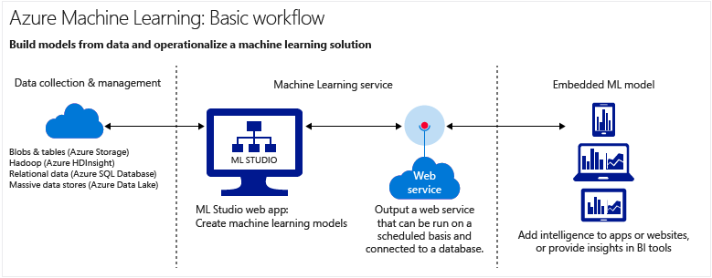
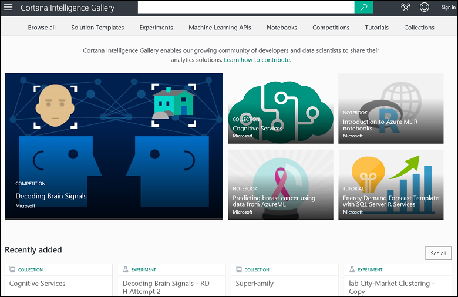
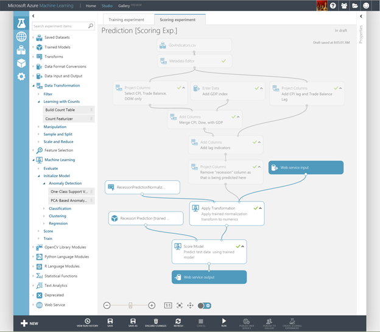

<properties
    pageTitle="Neuigkeiten von maschinellen Learning auf Azure? | Microsoft Azure"
    description="Erläutert die grundlegenden Konzepte von maschinellen Learning in der Cloud, beschreibt, wie Sie verwendet werden können und Computer Learning Ausdrücke definiert."
    keywords="Neuigkeiten maschinellen Schulung, Computer learning Ausdrücke, Vorhersage, was ist Vorhersageanalytik, Prozessen umsetzen"
    services="machine-learning"
    documentationCenter=""
    authors="cjgronlund"
    manager="jhubbard"
    editor="cgronlun"/>

<tags
    ms.service="machine-learning"
    ms.workload="data-services"
    ms.tgt_pltfrm="na"
    ms.devlang="na"
    ms.topic="get-started-article"
    ms.date="08/17/2016"
    ms.author="cgronlun;tedway;olgali"/>

# Einführung in Computer Learning in der cloud

## Was ist maschinelle Schulung?

Computer-Schulung ist eine Methode der Wissenschaft Daten, die aus bestehenden Daten erfahren Sie, um zukünftigen Verhalten, Aufgabenergebnisse und Trends SCHÄTZER Computern hilft.  

Diese Vorhersagen oder Vorhersagen von maschinellen Learning umso optimiertes apps und Geräte. Wenn Sie online kaufen, hilft maschinellen Learning empfiehlt sich andere Produkte, die Sie vielleicht interessieren könnten basierend auf was Sie erworben haben. Wenn Ihre Kreditkarte Magnetstreifenkarte ist, Computer Learning vergleicht die Transaktion zu einer Datenbank von Transaktionen und hilft erkennen Betrug. Wenn Ihre Robot Staubsauger einem Chatroom vacuums, können Sie Computer Learning entscheiden, ob das Projekt abgeschlossen ist.

Versuchen Sie für eine kurze Übersicht über die Videoreihe [Daten Wissenschaft für Anfänger](machine-learning-data-science-for-beginners-the-5-questions-data-science-answers.md)aus. Ohne Jargon oder mathematische Daten für Wissenschaft für Anfänger führt Computer Learning und führt Sie durch ein einfaches Vorhersage Modell.

## Was ist maschinelle Learning in der Cloud Microsoft Azure?

Azure maschinellen Learning ist ein leistungsfähige cloudbasierten Vorhersageanalytik-Dienst, der es ermöglicht, schnell erstellen und Bereitstellen von Vorhersage Modelle als Analytics Lösungen. Wenn Sie die Azure Cloud mithilfe maschinellen Learning Versuche ausführen oder Erstellen von Lösungen, müssen Sie keine teure Hardware oder Infrastruktur erwerben.

Azure maschinellen Learning nicht nur stellt Tools bereit, Vorhersageanalytik modellieren, sondern auch bietet einen vollständig verwalteten Dienst, die, den Sie verwenden können, Ihre Vorhersage Modelle als sofort nutzen Webdienste bereitstellen. Azure maschinellen Learning enthält Tools zum Erstellen von abgeschlossen Vorhersageanalytik Lösungen in der Cloud: schnell erstellen, testen, Prozessen umsetzen und Vorhersage Modelle verwalten.

[AZURE.INCLUDE [machine-learning-free-trial](../../includes/machine-learning-free-trial.md)]

## Was ist Vorhersageanalytik?

Vorhersageanalytik verwendet verschiedene mathematische Formeln Algorithmen, die zurückliegende oder aktuelle Daten für Mustern und Trends analysieren und Prognostizieren des zukünftigen Ereignisse bezeichnet.

Azure maschinellen Learning ist eine besonders effiziente Möglichkeit zum Vorhersageanalytik führen: können Sie aus einer Bibliothek sofort einsatzbereite Algorithmen arbeiten, verwenden Sie die Algorithmen Modelle auf einem PC Internetzugang erstellen und Ihre Vorhersage Lösung schnell bereitstellen. Um schnell Ergebnisse zu erhalten, beginnen Sie mit sofort einsatzbereite Beispiele und Lösungen im [Cortana Intelligence-Katalog](http://gallery.cortanaintelligence.com/).

## Erstellen Sie vollständige Computer learning Solutions in der cloud

Azure maschinellen Learning verfügt über alles, was Sie benötigen Vorhersageanalytik Lösungen in der Cloud zu einer Studio zum Erstellen von Modellen, um eine einfache Möglichkeit zum Bereitstellen des Modells als Webdienst aus einer großen Algorithmus-Bibliothek zu erstellen.

### Studio für maschinelle Schulung: Erstellen Sie Vorhersage Datenmodellen

In [Computer Learning Studio](machine-learning-what-is-ml-studio.md)können Sie schnell Vorhersage Modelle durch Ziehen und Ablegen Module Verbindung erstellen. Es ist einfach so experimentieren Sie mit anderen Kombinationen, und Sie [Dieses Skript kostenlos ausprobieren](https://studio.azureml.net/?selectAccess=true&o=2).

* [Cortana Intelligence Katalog](machine-learning-gallery-how-to-use-contribute-publish.md)können Sie versuchen Analytics-Lösungen, die von anderen Personen verfasst oder eigene mitwirken. Stellen Sie Fragen oder Kommentare zu Versuche an der Community oder Teilen von Links zu Versuche über sozialen Netzwerken wie LinkedIn und Twitter.

  

* Verwenden Sie eine umfangreiche Bibliothek von [maschinellen Learning Algorithmen und Module](https://msdn.microsoft.com/library/azure/f5c746fd-dcea-4929-ba50-2a79c4c067d7) in Computer Learning Studio, um Ihre Vorhersage Modelle sofort. Wählen Sie aus der Stichprobe Versuche, R und Python-Paketen und beste Algorithmen aus Microsoft Unternehmen wie Xbox und Bing. Studio Module mit Ihrer eigenen benutzerdefinierten [R](machine-learning-r-quickstart.md) und [Python](machine-learning-execute-python-scripts.md) Skripts zu erweitern.

  

### Prozessen umsetzen Vorhersageanalytik Lösungen: Webdienste kaufen oder veröffentlichen Sie Ihre eigenen

* Kaufen Sie sofort nutzen Webdienste aus [Microsoft Azure Marketplace](https://datamarket.azure.com/browse?query=machine+learning), z. B. Empfehlungen, Text Analytics und Normalbetriebswerte aus.

* Prozessen umsetzen Sie Ihrer Modelle Vorhersageanalytik aus:
    * [Webdienste bereitstellen](machine-learning-publish-a-machine-learning-web-service.md)
    * [Schulen Sie und neu Trainieren Sie Modelle über APIs](machine-learning-retrain-models-programmatically.md)
    * [Webdienst-Endpunkte verwalten](machine-learning-create-endpoint.md)
    * [Skalieren von einem Webdienst](machine-learning-scaling-webservice.md)
    * [Verwenden von-Webdiensten](machine-learning-consume-web-services.md)

## Key maschinellen learning Konzepte und Begriffe

Maschinelle Learning Ausdrücke verwirrend. Hier sind Definitionen wichtiger Begriffe, die Ihnen helfen. Verwenden von Kommentaren zum Teilen Sie uns ein anderer Begriff gewünschten definiert folgen.

### Durchsuchen von Daten, beschreibenden Analytics und Vorhersageanalytik

**Durchsuchen von Daten** ist die Vorgehensweise zum Sammeln von Informationen über einer großen und häufig unstrukturierte Datenmenge um Merkmale für markierten Analyse finden. **Datamining** bezieht sich auf Durchsuchen von automatisierte Daten.

**Beschreibender Analytics** ist die Vorgehensweise zum Analysieren einer Datengruppe zurück, um den Vorkommnissen zusammenfassen. Es sind die meisten der BA – wie Verkaufsberichte, Web Kennzahlen und sozialen Netzwerken Analysis - beschreibenden.

**Vorhersageanalytik** versteht Modelle aus zurückliegenden oder aktuellen Daten erstellen, um zukünftigen Aufgabenergebnisse SCHÄTZER.

### Kontrolle und unbeaufsichtigt Schulung
 **Learning Supervised** Algorithmen werden angewiesen, mit beschriftete Daten – Zählung ausnehmen Daten Beispiele für die Antworten unerwünscht besteht aus. Ein Modell, das kennzeichnet gefälschte Kreditkarte verwenden möchten beispielsweise aus einer Datenmenge mit beschriftete Datenpunkten bekannte Betrug und gültigen Gebühren gelernt werden. Die meisten Computer Learning überwacht wird.

 **Learning Unsupervised** auf Daten mit keine Etiketten verwendet wird, und das Ziel ist, Beziehungen in den Daten zu suchen. Beispielsweise sollten Sie die Gruppierung von Kunden Demographie mit ähnlichen kaufen Listen finden.

### Modell Schulung und Bewertung
Ein Computer-Learning-Modell ist ein Modell für die Frage, die Sie beantworten oder das Ergebnis, das Sie vorhersagen möchten. Modelle werden gelernt und aus bestehenden Daten ausgewertet.

#### Schulungsdaten
Wenn Sie ein Modell aus Daten Schulen, mithilfe eine bekannte Datenmenge und in das Datenmodell anhand der Datenmerkmale in der Regel das beste Antwort erhalten Anpassungen vornehmen. Azure Computer interessante wird ein Modell aus einem Algorithmus-Modul, die Schulungsdaten verarbeitet und funktionsübergreifendes Module, wie etwa ein Modul Punktzahl erstellt.

Wenn Sie ein Modell Betrug Erkennung, Schulung sind, verwenden Sie Kontrolle interessante, eine Reihe von Transaktionen, die als entweder gefälschte oder gültig gekennzeichnet sind. Sie den Datensatz zufällig Teilen und Webpart zum Schulen von dem Modell und dem Teil testen oder Auswerten des Modells verwenden.

#### Von Auswertungsdaten
Nachdem Sie ein Modell ausgebildeten haben, ausgewertet werden Sie mithilfe der verbleibende Test-Modell aus. Sie verwenden Daten, die, denen Sie bereits vertraut die möglichen sind, damit Sie erkennen können, ob Ihr Modell präzise vorhersagen.

## Andere allgemeine maschinellen Learning Begriffe

* **Algorithmus**: einen eigenständigen Satz von Regeln, bis Datenverarbeitung, Mathematik oder automatisierte Logik Probleme zu lösen, verwendet.
* **Normalbetriebswerte**: Entdecken Sie ein Modell, das kennzeichnet, Werte oder ungewöhnliche Ereignisse und hilft Ihnen, Probleme. Beispielsweise sucht Kreditkarte Betrugsversuche für ungewöhnliche Einkäufe ein.
* **kategorisierten Daten**: Daten Kategorien geordnet ist und, die in Gruppen aufgeteilt werden können. Beispielsweise könnten eine kategorisierte Datenmenge für Auto Jahr, Marke, Modell und Preis angeben.
* **Klassifizierung**: ein Modell zum Organisieren der Datenpunkte in Kategorien auf Grundlage einer Datengruppe zurück, die für die Kategorie Gruppierungen bereits bekannt sind.
* **technisch Features**: die Vorgehensweise zum Extrahieren oder auswählen von Funktionen im Zusammenhang mit einer Datengruppe zurück, um Datenmenge zu verbessern und Aufgabenergebnisse verbessern. Beispielsweise könnten Flug Daten durch die Wochentage und Feiertage erweitert werden. Finden Sie unter [Auswahl und technisch Azure Computer interessante bereitstellen](machine-learning-feature-selection-and-engineering.md).
* **Modul**: ein funktionsübergreifendes Webpart in einem Computer Learning Studio-Modell, wie das Eingeben von Daten-Modul, das eingeben und Bearbeiten von kleine Datasets ermöglicht. Ein Algorithmus ist auch eine Art des Moduls in Computer Learning Studio.
* **Modell**: ein Modell Kontrolle Lernen ist das Produkt aus einem Computer learning experimentieren Schulungsdaten, ein Modul Algorithmus und funktionsübergreifendes Module, wie etwa ein Modul Punktzahl Modell besteht aus.
* **numerische Daten**: Daten, die Bedeutung als Maße (fortlaufender Daten) oder ermittelt (diskrete Daten). Auch bezeichnet als *quantitative Daten*.
* **Partition**: die Methode, an dem Sie Daten in Beispiele unterteilen. Weitere Informationen finden Sie unter [Partition und Stichprobe](https://msdn.microsoft.com/library/azure/dn905960.aspx) .
* **Vorhersage**: eine Vorhersage ist eine Planung einen Wert oder Werte aus einem Computer Learning-Modell. Sie möglicherweise auch Anzeigen der Begriff "geschätzte Punktzahl". Geschätzte Ergebnisse sind jedoch nicht die endgültige Ausgabe eines Modells. Eine Bewertung des Modells resultiert die Bewertung aus.
* **Regression**: ein Modells für einen Wert, der ausgehend von unabhängigen Variablen, z. B. den Preis eines Autos Vorhersage Vorhersage Basis seines Jahr und erstellen.
* **Punktzahl**: eine geschätzte Wert aus einem ausgebildeten Klassifizierung oder Regression Modell, mit dem [Modell Punktzahl Modul](https://msdn.microsoft.com/library/azure/dn905995.aspx) maschinellen Learning Studio generiert. Klassifizierung Modelle wird auch eine Bewertung für die Wahrscheinlichkeit, dass die geschätzte Wert zurückgegeben. Nachdem Sie die Ergebnisse aus einem Modell generiert haben, können Sie die Genauigkeit des Modells mit dem [Modell evaluieren Modul](https://msdn.microsoft.com/library/azure/dn905915.aspx)auswerten.
* **Beispiel**: ein Teil einer Datengruppe zurück Vertreter der ganzen werden soll. Beispiele können zufällig ausgewählten oder basierend auf bestimmte Features der Datenmenge werden.

## Nächste Schritte
Erfahren Sie die Grundlagen Vorhersageanalytik und Computer-Schulung, die ein [schrittweises Lernprogramm](machine-learning-create-experiment.md) mit sowie [Beispiele erstellen](machine-learning-sample-experiments.md).  

<!-- Module References -->
[learning-with-counts]: https://msdn.microsoft.com/library/azure/81c457af-f5c0-4b2d-922c-fdef2274413c/
