<properties
   pageTitle="Erste Schritte mit privaten Vorlagen | Microsoft Azure"
   description="Fügen Sie hinzu, verwalten Sie und freigeben Sie Ihrer privaten Vorlagen Azure-Portal, die Azure CLI oder PowerShell verwenden."
   services="marketplace-customer"
   documentationCenter=""
   authors="VybavaRamadoss"
   manager="asimm"
   editor=""
   tags="marketplace, azure-resource-manager"
   keywords=""/>

<tags
   ms.service="marketplace"
   ms.devlang="na"
   ms.topic="get-started-article"
   ms.tgt_pltfrm="na"
   ms.workload="na"
   ms.date="05/18/2016"
   ms.author="vybavar"/>

# Erste Schritte mit privaten Vorlagen im Azure-Portal

Eine Vorlage [Azure Ressourcenmanager](../resource-group-authoring-templates.md) ist deklarative Vorlage verwendet, um die Bereitstellung definieren. Sie können definieren die Ressourcen, die für eine Lösung bereitstellen, und geben Sie Parameter und Variablen, mit die Sie Werte für die verschiedenen Umgebungen eingeben können. Die Vorlage besteht aus JSON und Ausdrücke, die Sie verwenden können, um Werte für die Bereitstellung zu erstellen.

Können die neue **Vorlagen** -Funktion im [Portal Azure](https://portal.azure.com) zusammen mit den **Microsoft.Gallery** Ressourcenanbieter als Erweiterung von dem [Azure Marketplace](https://azure.microsoft.com/marketplace/) , damit Benutzer zu erstellen, verwalten und Bereitstellen von Vorlagen für private aus einer persönliche Bibliothek.

Dieses Dokument führt Sie durch Hinzufügen, verwalten und Freigeben einer privaten **Vorlage** über das Azure-Portal.

## Anleitung

Die folgenden Vorschläge helfen Ihnen die vollständige **Vorlagen** Nutzen bei der Arbeit mit Ihrem Lösungen:

- Eine **Vorlage** ist eine kapselnden Ressource, die eine Vorlage Ressourcenmanager und zusätzliche Metadaten enthält. Es verhält sich sehr ähnlich wie ein Element in der Marketplace. Der wesentliche Unterschied ist, dass es ein privates Element im Gegensatz zu den öffentlichen Marketplace Elemente ist.
- **Die Vorlagenbibliothek** eignet sich gut für Benutzer, deren Bereitstellungen anpassen müssen.
- **Vorlagen** eignen sich gut für Benutzer, die ein einfaches Repository in Azure benötigen.
- Beginnen Sie mit einer vorhandenen Ressourcenmanager Vorlage. Suchen nach Vorlagen in [Github](https://github.com/Azure/azure-quickstart-templates) von [Vorlage exportieren](../resource-manager-export-template.md) aus einer vorhandenen Ressourcengruppe.
- **Vorlagen** werden dem Benutzer, der diese veröffentlicht verknüpft. Der Name des Herausgebers wird angezeigt, für jede Person, die gelesen darauf zugreifen.
- **Vorlagen** werden Ressourcenmanager Ressourcen und kann nicht umbenannt werden, sobald veröffentlicht.

## Hinzufügen einer Vorlagenressource

Es gibt zwei Methoden zum Erstellen einer **Vorlage** Ressource im Azure-Portal an.

### Methode 1: Erstellen einer neuen Vorlagenressource aus einer laufenden Ressourcengruppe

1. Navigieren Sie zu einer vorhandenen Ressourcengruppe Azure-Portal. Wählen Sie in den **Einstellungen** **Vorlage exportieren** .
2. Sobald die Vorlage Ressourcenmanager exportiert wurden, verwenden Sie die **Vorlage speichern** -Schaltfläche, um es der **Vorlagen** Repository gespeichert. Vollständige Details für exportieren Vorlage finden [können](../resource-manager-export-template.md).
  
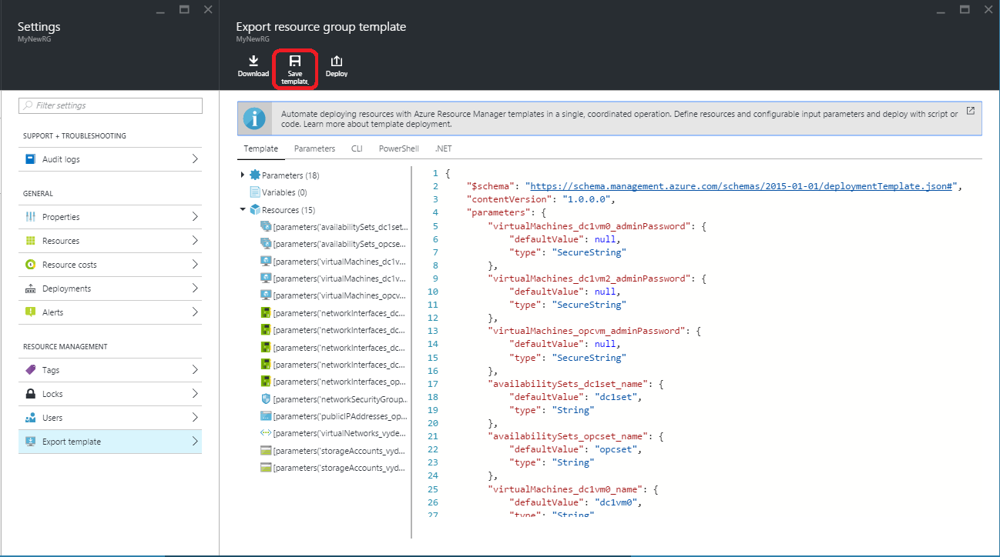   

3. Wählen Sie die Befehlsschaltfläche **als Vorlage speichern** .
  

4. Geben Sie die folgenden Informationen ein:

    - Name – Name des Template-Objekts (Hinweis: Dies ist der Name einer Azure Ressourcenmanager basiert. Alle naming Einschränkungen gelten, und es kann nicht nach der Erstellung geändert werden).
    - Beschreibung – schnelle Übersicht über die Vorlage ein.

    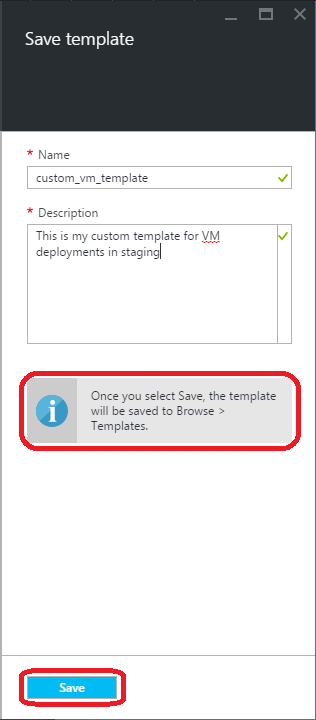   

5. Klicken Sie auf **Speichern**.

    > [AZURE.NOTE] Das Exportieren Vorlage Blade zeigt Benachrichtigungen aus, wenn die exportierte Ressourcenmanager Vorlage Fehler hat, aber immer noch dieser Vorlage Ressourcenmanager auf die Vorlagen speichern sein. Stellen Sie sicher, dass Sie überprüfen und beheben Sie alle Ressourcenmanager Vorlage erneut die exportierte Ressourcenmanager Vorlage bereit.

### B. Methode 2: Hinzufügen einer neuen Vorlagenressource aus durchsuchen

Sie können auch eine neue **Vorlage** vollständig neuen hinzufügen der + hinzufügen Befehlsschaltfläche in **Durchsuchen > Vorlagen**. Sie müssen einen Namen, Beschreibung und die Vorlage Ressourcenmanager JSON bereitstellen.

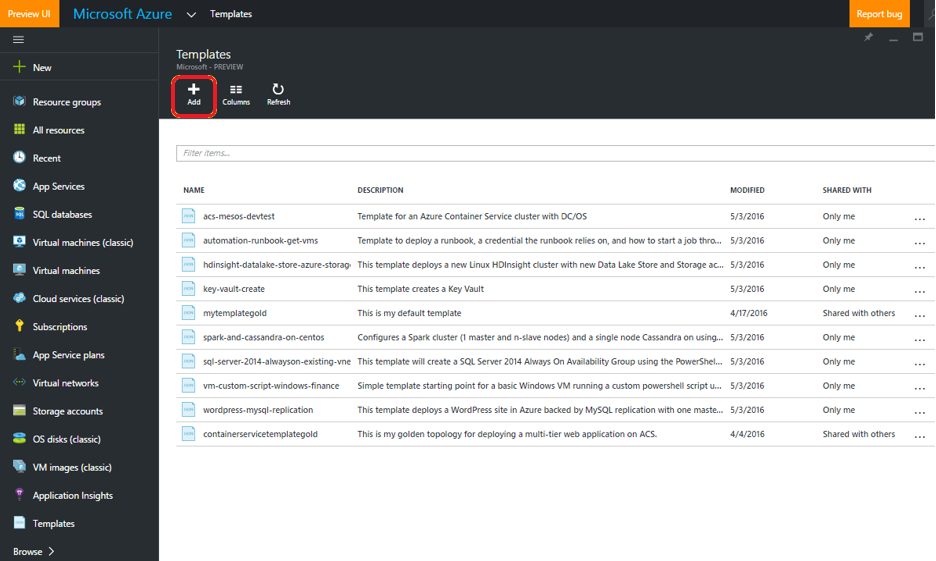   

> [AZURE.NOTE] Microsoft.Gallery ist ein Mandanten Anbieter Azure Ressourcen basierenden. Die Vorlagenressource ist für den Benutzer verknüpft, die sie erstellt hat. Es ist nicht zu keinem bestimmten Abonnement verknüpft. Ein Abonnement muss nur, wenn Sie eine Vorlage bereitstellen ausgewählt werden.

## Die Vorlagenressourcen anzeigen

Alle **Vorlagen** verfügbar sind, Sie sehen am **Durchsuchen > Vorlagen**. Dies umfasst **Vorlagen** , die Sie als auch jene erstellt haben, die mit unterschiedlichen Berechtigungsstufen für Sie freigegeben wurden. Weitere Details im Abschnitt [Steuerung des Benutzerzugriffs](#access-control-for-a-tenant-resource-provider) .

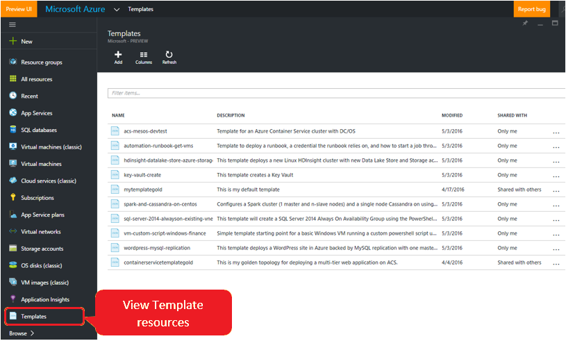   

Sie können die Details einer **Vorlage** anzeigen, indem Sie in ein Element in der Liste auf.

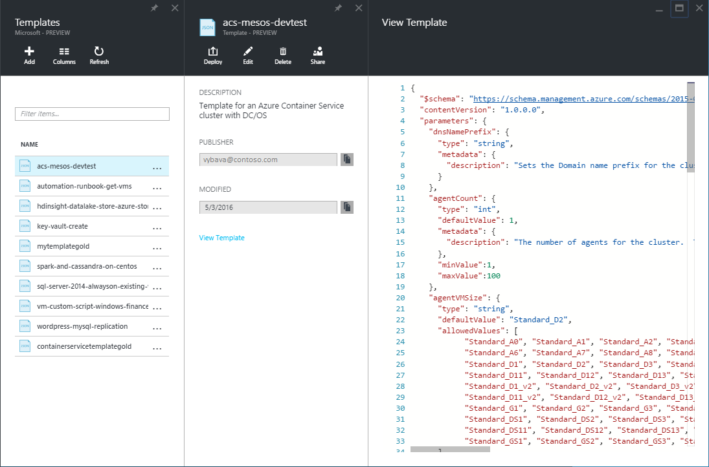   

## Bearbeiten einer Vorlagenressource

Sie können den Datenfluss bearbeiten für eine **Vorlage** nach der rechten Maustaste auf das Element in der Liste durchsuchen oder indem Sie auf der Befehlsschaltfläche ' Bearbeiten ' initiieren.

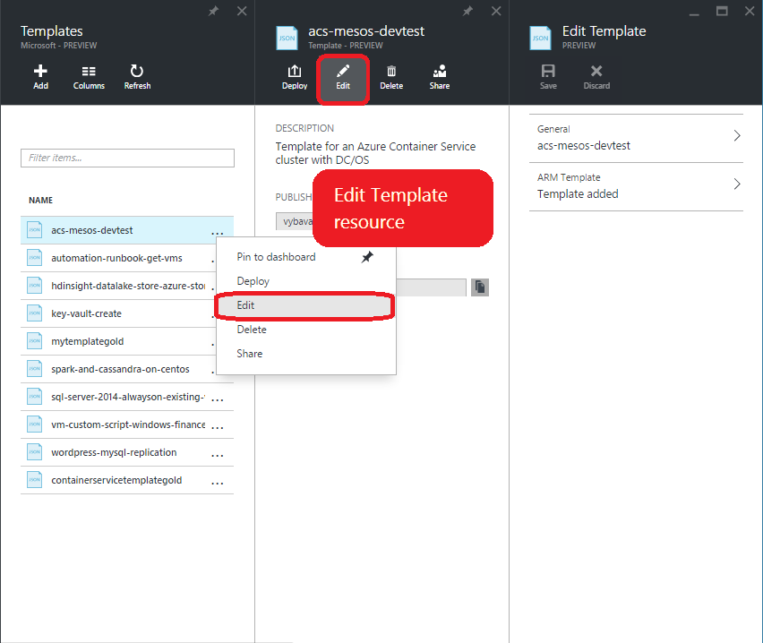   

Sie können die Beschreibung oder Ressourcenmanager Vorlagentext bearbeiten. Sie können nicht den Namen bearbeiten, da es sich um einen Ressourcennamen Ressourcenmanager handelt. Beim Bearbeiten Sie der Vorlage Ressourcenmanager JSON wir überprüfen werden, um sicherzustellen, das es sich um gültige JSON ist. Wählen Sie **OK** und dann auf **Speichern** die aktualisierte Vorlage zu speichern.

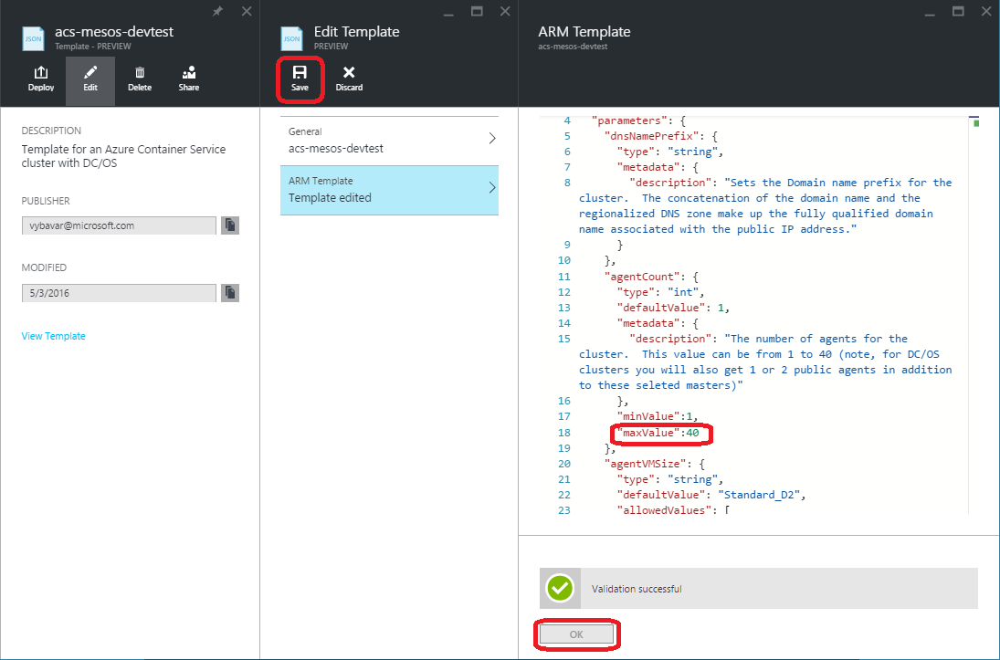   

Nachdem Sie die **Vorlage** gespeichert ist, sehen Sie eine bestätigungsbenachrichtigung zur.

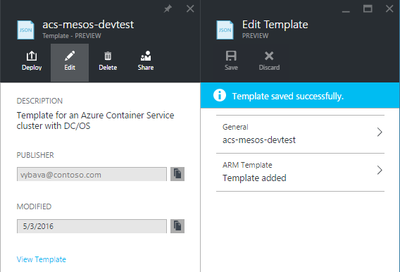   

## Bereitstellen einer Vorlagenressource

Sie können eine **Vorlage** bereitstellen, die Sie über **Leseberechtigungen** verfügen, klicken Sie auf. Bereitstellung illustrieren startet das standardmäßige Azure Vorlage Bereitstellung Blade. Füllen Sie die Werte für die Ressourcenmanager Vorlagenparameter, mit der Bereitstellung fortzufahren.

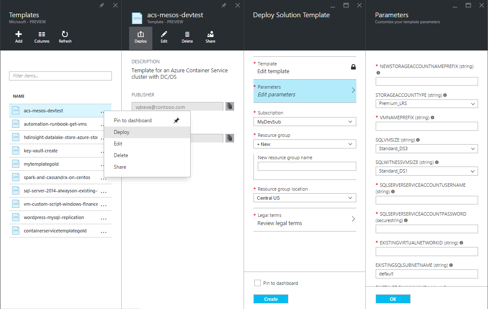   

## Freigeben einer Vorlagenressource

Eine **Vorlage** Ressource kann mit Ihren Kollegen gemeinsam genutzt werden. Freigabe verhält sich ähnlich wie [rollenzuweisung für eine Ressource Azure](../active-directory/role-based-access-control-configure.md). Der Besitzer der **Vorlage** bietet Berechtigungen für andere Benutzer, die zu interagieren mit einer Vorlagenressource ein. Die Person oder Gruppe von Personen, denen die mit der **Vorlage** freigegeben, werden Ressourcenmanager Vorlage und ihre Eigenschaften Katalog sehen können.

### Access-Steuerelement für die Ressourcen Microsoft.Gallery

Rolle | Berechtigungen
---|----
Besitzer | Ermöglicht Vollzugriff auf die Vorlagenressource einschließlich freigeben
Reader | Ermöglicht das Lesen und Execute(Deploy) für die Ressource Vorlage
Mitwirkenden | Können auf die Vorlagenressource über Berechtigungen zum Bearbeiten und löschen. Benutzer kann nicht die Vorlage für andere freigeben.

Markieren Sie die **Freigabe** für das Durchsuchen Element durch Klicken auf mit der rechten Maustaste, oder klicken Sie auf das Blade Ansicht eines bestimmten Elements. Dadurch wird eine Erfahrung freigeben.

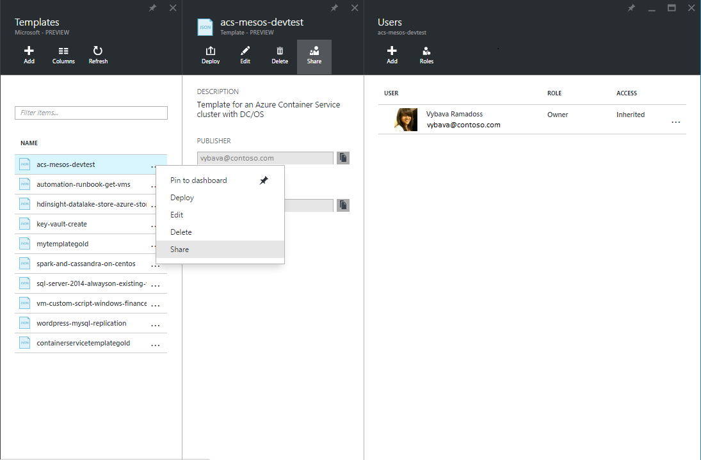   

 Sie können nun eine Rolle und einen Benutzer oder eine Gruppe den Zugriff auf eine bestimmte **Vorlage**auswählen. Die verfügbaren Rollen sind Besitzer, Reader und Mitwirkender. Weitere Details im Abschnitt [Steuerung des Benutzerzugriffs](#access-control-for-a-tenant-resource-provider) .

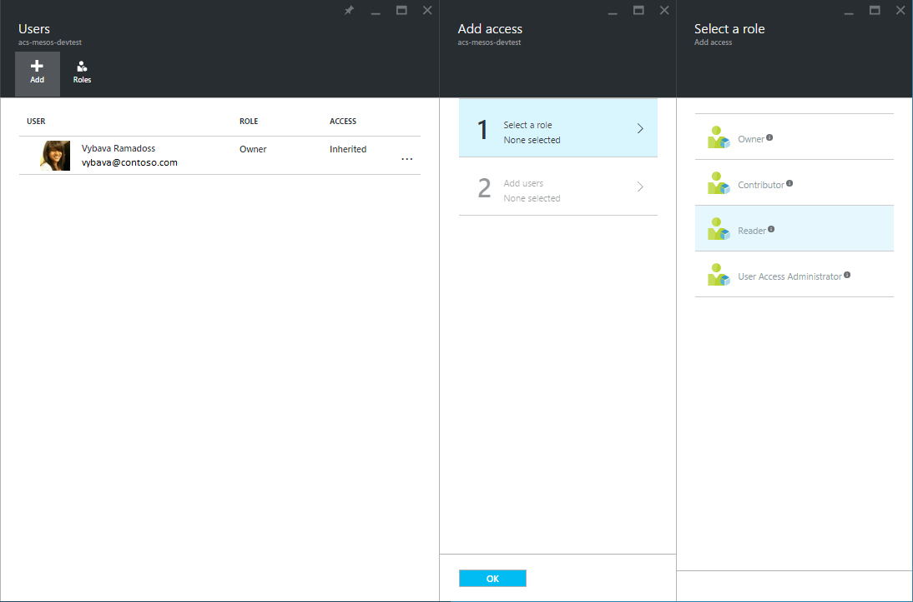   

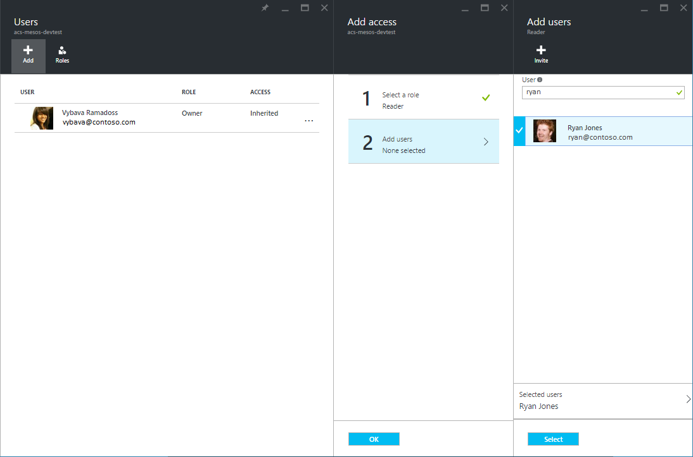   

Klicken Sie auf **auswählen** und auf **Ok**. Sie können nun sehen die Benutzer oder Gruppen, die Sie der Ressource hinzugefügt.

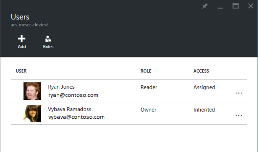   

> [AZURE.NOTE] Eine Vorlage kann nur mit Benutzern und Gruppen in der gleichen Azure Active Directory-Mandanten freigegeben werden. Wenn Sie eine Vorlage für eine e-Mail-Adresse, die nicht in Ihrem Mandanten ist freigeben, wird eine Einladung gesendet werden Frage an den Benutzer an den Mandanten als Gast teilzunehmen.

## Nächste Schritte

- Weitere Informationen zum Erstellen von Vorlagen für Ressourcenmanager, finden Sie unter [Authoring-Vorlagen](../resource-group-authoring-templates.md)
- Um die Funktionen zu verstehen, die Sie in einer Vorlage Ressourcenmanager verwenden können, finden Sie unter [Vorlagenfunktionen](../resource-group-template-functions.md)
- Anleitungen zum Entwerfen von Ihrer Vorlagen finden Sie unter [bewährte Methoden zum Entwerfen von Ressourcenmanager Azure-Vorlagen](../best-practices-resource-manager-design-templates.md)
