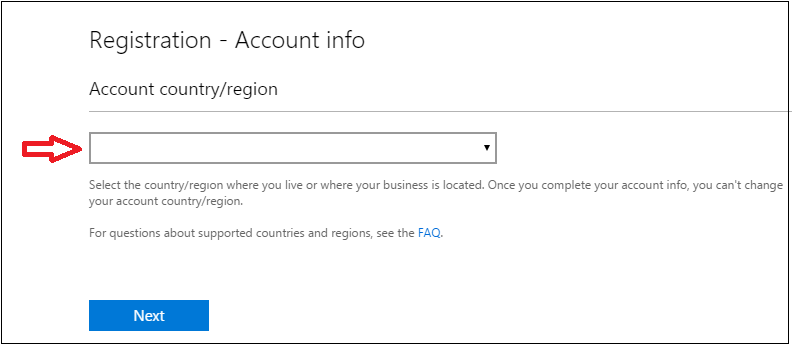
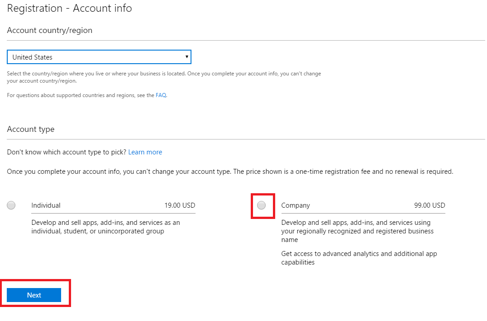
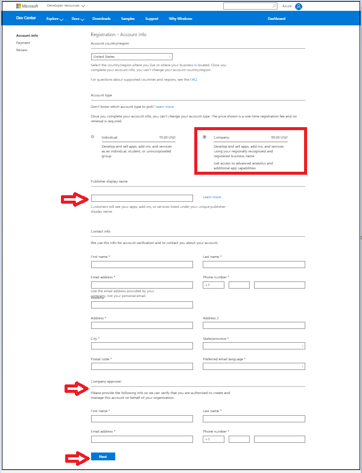
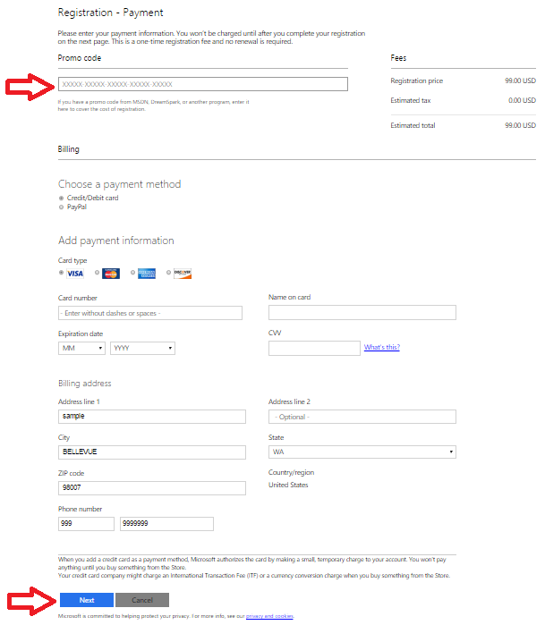
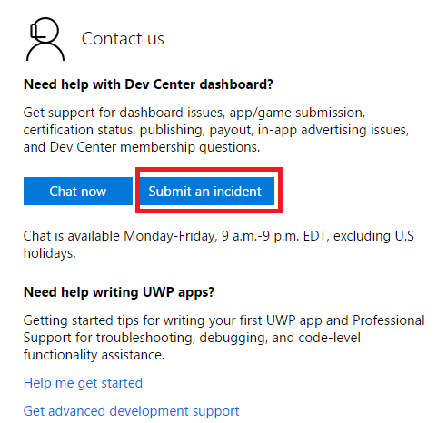
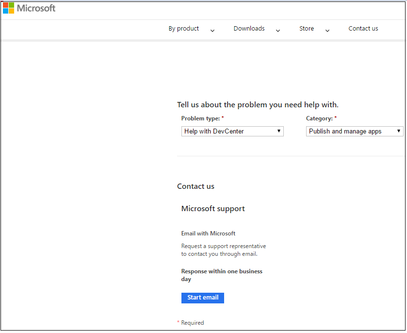
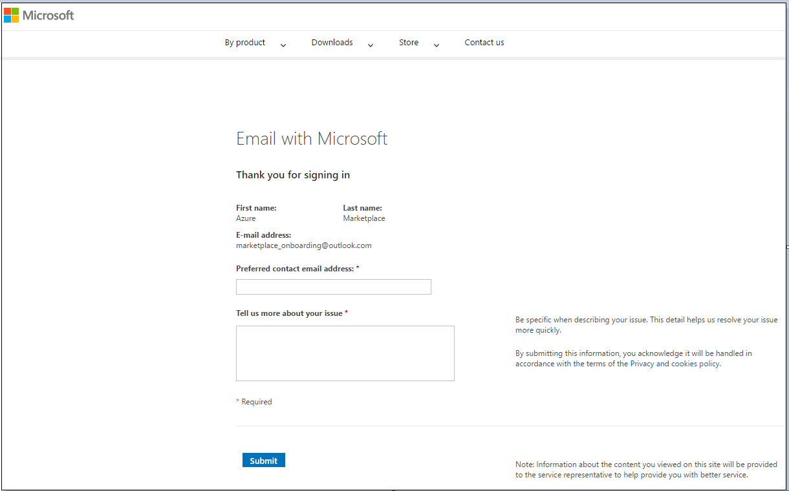
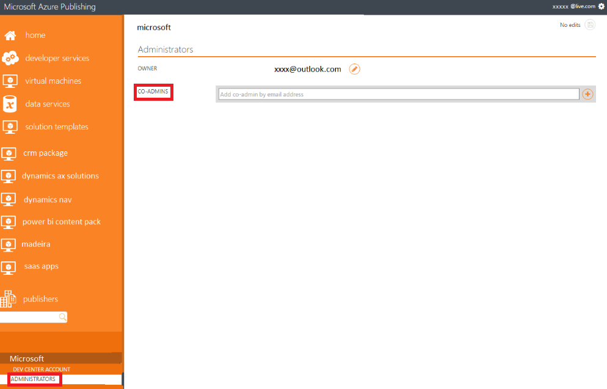
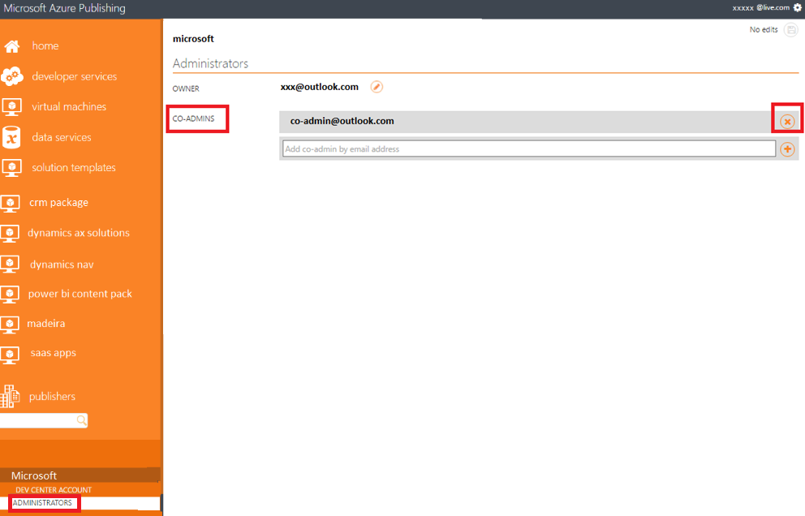

<properties
   pageTitle="Erstellen und Registrieren des Publisher-Kontos | Microsoft Azure"
   description="Anweisungen zum Erstellen eines Microsoft Developer-Kontos aus, damit nach der Genehmigung Sie verschiedene verkaufen können bieten die Typen auf dem Azure Marketplace."
   services="Azure Marketplace"
   documentationCenter=""
   authors="HannibalSII"
   manager="hascipio"
   editor=""/>

<tags
   ms.service="marketplace"
   ms.devlang="na"
   ms.topic="article"
   ms.tgt_pltfrm="na"
   ms.workload="na"
   ms.date="08/18/2016"
   ms.author="hascipio"/>

# Erstellen eines Microsoft Developer-Kontos
In diesem Artikel führt Sie durch die Erstellung des Kontos erforderlich und Registrierung von Azure Marketplace eines genehmigten Microsoft Developer vorgesehen ist.

## 1. erstellen Sie 1. ein Microsoft-Konto
Zum Starten des Veröffentlichungsvorgangs, müssen Sie ein Microsoft-Konto zu erstellen. Dieses Konto wird in der **Microsoft Developer Center** und die **Azure Veröffentlichungsportal**registrieren verwendet werden. Sie sollten nur ein Microsoft-Konto verfügen, die Angebote Azure Marketplace. Sie sollten nicht auf Dienste oder Angebote zugeschnitten.

Die Adresse, die den Benutzernamen bildet sollten in Ihrer Domäne und mit Ihrem Team gesteuert. Alle für die Veröffentlichung verwandten Aktivitäten sollte über dieses Konto erfolgen.

  >[AZURE.WARNING] Wörter wie **"Azure"** und **"Microsoft"** werden für die Registrierung von Microsoft-Konto nicht unterstützt. Vermeiden Sie diese Wörter, um die Erstellung von Benutzerkonten und Registrierungsprozess abzuschließen.

### Anweisungen

1. Erstellen einer Verteilerliste (DL) oder eine Sicherheitsgruppe (SG) innerhalb der Domäne Ihres Unternehmens. Mithilfe einer Verteilerliste kann mehrere Personen e-Mail-Benachrichtigungen erhalten, die für die Meldung des Auszahlung Informationen wichtig sind. Außerdem wird sichergestellt, dass Besitzrechte für das Microsoft-Konto übertragen werden kann und auf eine Einzelperson verknüpft ist nicht.
Folgen Sie den Anweisungen, die die folgenden Angaben.

    1. Ihr Team Onboarding zu der Verteilerliste hinzufügen.
    2. Sicherstellen, dass die DL/SG eine aktive e-Mail-Adresse ist und zum Empfang von e-Mails, da die Zahlung, Steuerinformationen zu und reporting wird über dieses Konto weitergeleitet werden.
    3. Es wird empfohlen, etwa marketplace@partnercompany.com als die e-Mail-Adresse für die DL/SG.

2. Öffnen Sie eine neue Incognito Chrome oder Internet Explorer InPrivate-Browsersitzung um sicherzustellen, dass Sie nicht mit einem vorhandenen Konto angemeldet sind.
3. Registrieren der Verteilerliste, die als Microsoft-Konto mithilfe der Link [https://signup.live.com/signup.aspx](https://signup.live.com/signup.aspx)in Schritt 1 erstellt haben. Führen Sie die folgenden Schritte aus.

    1. Während Ihr Konto wird als Microsoft-Konto registriert, müssen Sie eine gültige Telefonnummer für das System zum Senden von eines Konto Überprüfung Codes als Textnachricht oder einen automatisierten Anruf bereitstellen.
    2. Während Sie Ihr Konto wird als Microsoft-Konto registriert, müssen Sie eine gültige e-Mail-Id für den Empfang von einer automatisierten e-Mails für Konto Überprüfung bereitzustellen.

4. Überprüfen Sie die e-Mail-Adresse, an der Verteilerliste gesendet werden.
5. Sie nun können mit dem neuen Microsoft-Konto in Microsoft Developer Center.

## 2. erstellen Sie Ihr Microsoft Developer Center-Konto
Microsoft Developer Center wird verwendet, um die einmal die Firmeninformationen zu registrieren. Die Registrant muss ein gültiger Vertreter des Unternehmens, und muss als eine Möglichkeit, um seine Identität überprüfen ihre persönlichen Informationen bereitstellen. Die Person registrieren muss ein Microsoft-Konto, die für das Unternehmen, freigegeben ist verwenden **und das gleiche Konto muss verwendet werden, in der Azure Veröffentlichungsportal.** Sie sollten überprüfen, um sicherzustellen, dass Ihr Unternehmen nicht bereits ein Microsoft Developer Center-Konto verfügt, bevor Sie versuchen, eine zu erstellen. Während des Vorgangs wir Adresse Firmeninformationen, Bankkontoinformationen sammeln und Informationen steuern. Dies sind in der Regel Finanzen oder Business Kontakte erhältlich.

> [AZURE.IMPORTANT] Sie müssen die folgenden Komponenten von Entwicklertools Profil akzeptieren, um die verschiedenen Phasen der Erstellung Angebot und Bereitstellung durchlaufen abschließen.

| Developer-Profil | So starten Sie den Entwurf | Staging | Veröffentlichen von freien und Lösungsvorlage | Kommerzielle veröffentlichen |
|----|----|----|----|----|
|Registrierung für Unternehmen | Müssen | Müssen | Müssen | Müssen |
|Steuern Profil-ID | Optional | Optional | Optional | Müssen |
|Bankkonto | Optional | Optional | Optional | Müssen |

> [AZURE.NOTE] Zeigen Sie Ihre eigenen Lizenz (BYOL) wird nur für virtuellen Computern unterstützt und ein **kostenloses** Angebot gilt.

### Registrieren Sie Ihr Unternehmenskonto
1. Öffnen Sie eine neue Internet Explorer InPrivate- oder Chrome Incognito Browsersitzung um sicherzustellen, dass Sie nicht mit einem persönlichen Konto angemeldet sind.

2. Wechseln Sie zu [http://dev.windows.com/registration?accountprogram=azure](http://dev.windows.com/registration?accountprogram=azure) sich selbst als Verkäufer in der Developer Center registrieren. Lesen Sie die folgende wichtige Notiz, bevor Sie fortfahren.

    >[AZURE.IMPORTANT] Sicherstellen Sie, dass die e-Mail-Id oder Verteilerliste aus (eine Verteilerliste wird empfohlen, in Abhängigkeit von Einzelpersonen entfernen) die Sie zum Registrieren in der Developer Center verwendet werden am zuerst als Microsoft-Konto registriert. Wenn dies nicht der Fall ist, verwenden diesen [Link](https://signup.live.com/signup?uaid=e479342fe2824efeb0c3d92c8f961fd3&lic=1)dann registrieren. Darüber hinaus **eine e-Mail-Id, unter der Domäne des Unternehmens Microsoft h. @microsoft.com kann nicht verwendet werden** für die Registrierung Developer Center.

    ![Zeichnung][img-signin]

3. Führen Sie den Assistenten "Helfen Sie uns, Schutz Ihres Kontos", in der Ihre Identität über Telefonnummer oder e-Mail-Adresse zu überprüfen, wird ein.

    ![Zeichnung][img-verify]

4. Wählen Sie im Abschnitt "Registrierung-Kontoinformationen" Ihr **Konto Land/Region** aus dem Dropdownmenü aus.

    

    > [AZURE.WARNING] **"Verkaufen von" Länder:** Ihrer Dienste auf dem Azure Marketplace verkaufen möchten, muss sich Ihre registrierte Entität aus einem der Länder genehmigten "Verkaufen-von" oben befinden. Diese Einschränkung ist Auszahlung und Besteuerung Gründen. Wir werden aktiv diese Liste der Länder in Kürze erweitern, also demnächst gefunden. Weitere Informationen finden Sie unter die [Marketplace Teilnahme Richtlinien](http://go.microsoft.com/fwlink/?LinkID=526833).

5. Wählen Sie als **Unternehmen** "Kontotyp" aus, und klicken Sie dann auf die Schaltfläche **Weiter** .

    > [AZURE.IMPORTANT] Zum besseren Verständnis Kontotypen und welche für Sie wählen Sie am besten geeignet ist, zeigen Sie die Seite [Kontotypen, Speicherorten und Gebühren](https://msdn.microsoft.com/library/windows/apps/jj863494.aspx)

    

6. Geben Sie an, der **Anzeigename der Publisher**normalerweise der Name Ihres Unternehmens.

    > [AZURE.TIP] Der Publisher-Anzeigename in der Developer Center eingegeben wird nicht in der Azure Marketplace angezeigt, nachdem Ihr Angebot aufgeführten wechselt. Aber dies muss ausgefüllt werden, um die Registrierung abzuschließen.

7. Geben Sie den **Kontaktinformationen** für die Überprüfung Konto ein.

    > [AZURE.IMPORTANT] Sie müssen die genaue Kontaktinformationen angeben, da es im Developer Center genehmigt werden in unseren Überprüfung für Ihr Unternehmen verwendet werden.

8. Geben Sie die Kontaktinformationen des **Unternehmens genehmigenden Person**ein. Unternehmen Genehmiger handelt es sich um die Person, die überprüfen kann, ob Sie berechtigt sind, ein Konto in der Developer Center für Ihre Organisation zu erstellen. Klicken Sie auf **Weiter** , um den **"Abschnitt Zahlung"** , sobald Sie fertig sind.

    

9. Geben Sie Ihre Zahlungsinformationen Interesse für Ihr Konto ein. Wenn Sie einen promotionscode, der die Kosten der Registrierung behandelt haben, können Sie die hier eingeben. Andernfalls bieten Sie Ihre Kreditkarteninformationen (oder PayPal in unterstützten Märkten). Wenn Sie fertig sind, klicken Sie auf **Weiter** , um die **"Bildschirm überprüfen"**auf.

    

10. Überprüfen Sie Ihre Kontoinformationen ein, und bestätigen Sie, dass alles richtig ist. Klicken Sie dann gelesen und die allgemeinen Geschäftsbedingungen des [Microsoft Azure Marketplace Publisher-Lizenzvertrag](http://go.microsoft.com/fwlink/?LinkID=699560)anzunehmen. Aktivieren Sie das Kontrollkästchen, um anzugeben, Sie gelesen haben und diese Ausdrücke akzeptiert.

11. Klicken Sie auf **Fertig stellen** , um Ihre Registrierung zu bestätigen. Wir wird eine bestätigungsmeldung an Ihre e-Mail-Adresse senden.

12. Wenn Sie beabsichtigen, um nur kostenlose Angebote veröffentlichen, klicken Sie auf können **Wechseln Sie zur Azure Marketplace-Veröffentlichungsportal** , und Sie zum Abschnitt 3 dieses Dokuments, [Ihr Konto in der Veröffentlichungsportal registrieren](#3-register-your-account-in-the-publishing-portal)überspringen.

Wenn Sie beabsichtigen kommerzielle veröffentlichen bietet (z. B. virtuellen Computern Angebote mit stündlich Abrechnung Modell), klicken Sie auf die Stelle, an der Sie die Mehrwertsteuer und Bankinformationen in Ihrem Konto Developer Center ausfüllen müssen **Ihre Kontoinformationen zu aktualisieren** .

Wenn Sie es vorziehen, die später Ihre steuern und Bank zu aktualisieren, können Sie mit dem nächsten Abschnitt h. Abschnitt 3 dieses Dokuments, [Ihr Konto in der Veröffentlichungsportal registrieren](#3-register-your-account-in-the-publishing-portal), verschieben und im Zusammenhang später über die Links in der Azure Veröffentlichungsportal zurückzukehren.

> [AZURE.IMPORTANT] Bei kommerzielle Angebote werden Sie nicht Ihre Angebote auf die Herstellung laden, ohne die Informationen zu steuern und Bankkonto durchführen können.

Wenn Sie es vorziehen, Ihre steuern und Bank zu einem späteren Zeitpunkt aktualisieren, können Sie finden Sie in Abschnitt 3, [Ihr Konto in der Veröffentlichungsportal registrieren](#3-register-your-account-in-the-publishing-portal), und im Zusammenhang später über die Links in der Azure Veröffentlichungsportal zurückzukehren.

### Hinzufügen von steuern und Bankinformationen
 Wenn Sie kommerzielle Angebote kaufen veröffentlichen möchten, müssen Sie auch Auszahlung hinzufügen und Informationen zu steuern, und senden Sie ihn zur Überprüfung in die Developer Center. Wenn Sie nur kostenlose veröffentlicht (oder BYOL bietet), müssen Sie nicht diese Informationen hinzufügen. Können Sie es später hinzufügen, aber es dauert einige Zeit, um die Mehrwertsteuer zu überprüfen. Wenn Sie wissen, dass Sie kaufen kommerzielle Angebote anbieten, empfehlen wir, dass Sie so früh wie möglich hinzufügen.

**Bankinformationen**

1. Melden Sie sich [Microsoft Developer Center](http://dev.windows.com/registration?accountprogram=azure) mit Ihrem Microsoft-Konto.

2. Klicken Sie im linken Menü auf **Auszahlung-Konto** , klicken Sie unter **Zahlungsmethode auswählen** auf **Bankkonto** oder **PayPal**.

    > [AZURE.IMPORTANT] Wenn Sie kommerzielle Angebote, die Kunden in der Marketplace erwerben verfügen, ist dies das Konto, wo Sie Auszahlung für diese Einkäufe erhalten.

3. Geben Sie die Zahlungsinformationen ein, und klicken Sie auf **Speichern** , wenn Sie zufrieden sind.

    > [AZURE.IMPORTANT] Wenn Sie aktualisieren oder Ihr Konto Auszahlung ändern müssen, führen Sie dieselben Schritte, über den aktuellen Status durch die neuen Informationen ersetzt werden. Ändern Ihr Konto Auszahlung können Sie Ihre Zahlungen von bis zu einem Zahlung Zyklus verzögern. Diese Verzögerung tritt auf, da wir müssen überprüfen, ob das Konto ändern, wie wir konnten, wenn Sie zuerst die Auszahlung-Konto einrichten. Sie werden weiterhin für den gesamten Betrag bezahlt werden, nachdem Ihr Konto überprüft wurde; alle Zahlungen Fälligkeitsdatum für die aktuelle Zahlung Kreis wird nach dem nächsten Vorkommen hinzugefügt werden.

4. Klicken Sie auf **Weiter**.

**Informationen zur Steuer**

1. Melden Sie sich bei der [Microsoft Developer Center](http://dev.windows.com/registration?accountprogram=azure) mit Ihrem Microsoft-Konto (falls erforderlich).

2. Klicken Sie im linken Menü auf **Profil steuern** .

3. Klicken Sie auf der Seite **einrichten auf dem Formular Mehrwertsteuer** wählen Sie das Land oder Region, in dem Sie permanente Ort haben, und wählen Sie dann das Land oder Region, in dem Sie die primäre Engagement halten. Klicken Sie auf **Weiter**.

4. Geben Sie Ihre Steuersätzen, und klicken Sie dann auf **Weiter**.

> [AZURE.WARNING] Sie werden nicht an die Herstellung übertragen Ihrer kommerzielle bietet, ohne die Informationen zu steuern und Bankkonto in Ihr Konto Microsoft Developer Center durchführen können.

Wenn Sie Probleme mit der Registrierung Developer Center haben, wenden Sie sich bitte melden Sie sich Support-Ticket als unten

1. Wechseln Sie zu den Support-Link [https://developer.microsoft.com/windows/support](https://developer.microsoft.com/windows/support)
2. Klicken Sie unter **Kontakt** -Bereich auf die Schaltfläche **Absenden ein Vorfall** (wie im folgenden Screenshot gezeigt)

    

3. Wählen Sie "Hilfe mit Developer Center" als **Problemtyp** und "Veröffentlichen und Verwalten von apps" als **Kategorie**. Klicken Sie anschließend auf die Schaltfläche "Start-e-Mail".

    

4. Sie können mit einer Anmeldeseite bereitgestellt werden. Verwenden eines Microsoft-Konto anmelden. Wenn Sie nicht über eine mithilfe dieser [Link](https://signup.live.com/signup?uaid=0089f09ccae94043a0f07c2aaf928831&lic=1)erstellen Sie dann ein Microsoft-Konto verfügen.
5. Füllen Sie die Details des Problems sowie Subit das Ticket, indem Sie auf die Schaltfläche **Senden** aus.

    

## 3. registrieren Sie Ihres Kontos in der Veröffentlichungsportal
Die [Veröffentlichung Portal](http://publish.windowsazure.com) dient zum Veröffentlichen und Verwalten Ihrer Angebot(e).

1. Öffnen Sie eine neue Incognito Chrome oder Internet Explorer InPrivate-Browsersitzung um sicherzustellen, dass Sie nicht mit einem persönlichen Konto angemeldet sind.

2. Wechseln Sie zu [http://publish.windowsazure.com](http://publish.windowsazure.com).

3. Wenn Sie einen neuen Benutzer und Anmelden bei der Veröffentlichung sind Portal zum ersten Mal, Sie müssen melden Sie sich mit der gleichen e-Mail-Id, mit dem Ihr Konto Developer Center registriert ist. Auf diese Weise wird Ihr Konto Developer Center und Veröffentlichen von Portalseite Konto miteinander verknüpft werden. Sie können die anderen Mitgliedern des Unternehmens, an der Anwendung arbeiten, später als co-Administrator in der Veröffentlichung hinzufügen Portals, indem Sie die nachstehenden Schritte durchführen.

Wenn Sie als co-Administrator in der Veröffentlichung hinzugefügt werden Portals, Sie können melden Sie sich mit Ihrem Konto co-Admin.

  > [AZURE.TIP] Die Teilnahme an der-Richtlinien werden auf der [Website Azure](https://azure.microsoft.com/support/legal/marketplace/participation-policies/)beschrieben.

## 4. Schritte zum Hinzufügen eines co-Administrators der Veröffentlichung Portal
**Unter der Voraussetzung, dass Sie der Administrator sind** die folgenden Angaben werden die Schritte zum Hinzufügen einer co-Administrator.

>[AZURE.NOTE] **Für die neuen Benutzer,** bevor Sie die Veröffentlichung ein co-Administrators hinzufügen Portal, stellen Sie sicher, dass Sie mindestens eine Anwendung, in der Veröffentlichung erstellt haben Portal. Dies ist erforderlich, wie die Registerkarte **HERAUSGEBER** angezeigt werden, nur nach dem Erstellen der Veröffentlichung von mindestens eine Anwendung Portal.

1. Stellen Sie sicher, dass die co-Admin-e-Mail-Id eines Microsoft-account(MSA) ist. Wenn dies nicht der Fall ist, wird als eine MSA mit diesem [Link](https://signup.live.com/signup?uaid=0089f09ccae94043a0f07c2aaf928831&lic=1)registrieren.
2. Stellen Sie sicher, dass es mindestens eine Anwendung unter dem Administratorkonto ist, bevor Sie versuchen, eine co-Administrator hinzufügen
3. Nachdem die obigen Schritte fertig sind, melden Sie sich die Veröffentlichung Portal mit dem co-Admin-e-Mail-Id und klicken Sie dann auf Abmelden.
4. Jetzt melden Sie sich die Veröffentlichung mit der Admin-e-Mail-Id Portal.
5. Navigieren Sie zu Herausgeber-Ihr Konto -> auswählen > Administratoren -> Hinzufügen der co-Administrator (Screenshot unten)

  

## 5. Schritte zum Löschen eines co-Administrators für die Veröffentlichung Portal
**Unter der Voraussetzung, dass Sie der Administrator sind** die folgenden Angaben werden die Schritte zum Löschen einer co-Administrator.

1. Melden Sie sich die Veröffentlichung mit der Admin-e-Mail-Id Portal.
2. Navigieren Sie zu **Herausgeber** -Ihr Konto- **Administratoren**> auswählen > -> **Co-Administratoren**.
3. Klicken Sie auf die Schaltfläche **X** neben der gewünschten Vers löschen (Screenshot nachfolgenden) co-Administrator.

    

## Nächste Schritte
Jetzt, da Ihr Konto erstellt und registriert ist, stellen Sie sicher, Sie erfüllen oder alle technischen erforderliche Komponenten für Ihr Angebot veröffentlichen, indem Sie [technischen erforderlichen Komponenten](marketplace-publishing-pre-requisites.md)entsprechen.

## Siehe auch
- [Erste Schritte: So veröffentlichen ein Angebots zu Azure Marketplace](marketplace-publishing-getting-started.md)

[img-msalive]:media/marketplace-publishing-accounts-creation-registration/creating-msa-account-msa-live.jpg
[img-email]:media/marketplace-publishing-accounts-creation-registration/creating-msa-account-msa-verifyemail.jpg
[img-sd-url]:media/marketplace-publishing-accounts-creation-registration/seller-dashboard-incognito.jpg
[img-signin]:media/marketplace-publishing-accounts-creation-registration/seller-dashboard-login.jpg
[img-verify]:media/marketplace-publishing-accounts-creation-registration/seller-dashboard-verify.jpg
[img-sd-top]:media/marketplace-publishing-accounts-creation-registration/seller-dashboard-personal-acc-details.jpg
[img-sd-info]:media/marketplace-publishing-accounts-creation-registration/seller-dashboard-personal.jpg
[img-sd-type]:media/marketplace-publishing-accounts-creation-registration/seller-dashboard-personal-acc-type.jpg
[img-sd-mktg1]:media/marketplace-publishing-accounts-creation-registration/seller-dashboard-personal-comp-det1.jpg
[img-sd-mktg2]:media/marketplace-publishing-accounts-creation-registration/seller-dashboard-personal-comp-det2.jpg
[img-sd-addr]:media/marketplace-publishing-accounts-creation-registration/seller-dashboard-personal-comp-add.jpg
[img-sd-legal]:media/marketplace-publishing-accounts-creation-registration/seller-dashboard-personal-cmp.jpg
[img-sd-submit]:media/marketplace-publishing-accounts-creation-registration/seller-dashboard-approval.jpg

[link-msdndoc]: https://msdn.microsoft.com/library/jj552460.aspx
[link-sellerdashboard]: http://sellerdashboard.microsoft.com/
[link-pubportal]: https://publish.windowsazure.com
[link-single-vm]:marketplace-publishing-vm-image-creation.md
[link-single-vm-prereq]:marketplace-publishing-vm-image-creation-prerequisites.md
[link-multi-vm]:marketplace-publishing-solution-template-creation.md
[link-multi-vm-prereq]:marketplace-publishing-solution-template-creation-prerequisites.md
[link-datasvc]:marketplace-publishing-data-service-creation.md
[link-datasvc-prereq]:marketplace-publishing-data-service-creation-prerequisites.md
[link-devsvc]:marketplace-publishing-dev-service-creation.md
[link-devsvc-prereq]:marketplace-publishing-dev-service-creation-prerequisites.md
[link-pushstaging]:marketplace-publishing-push-to-staging.md
