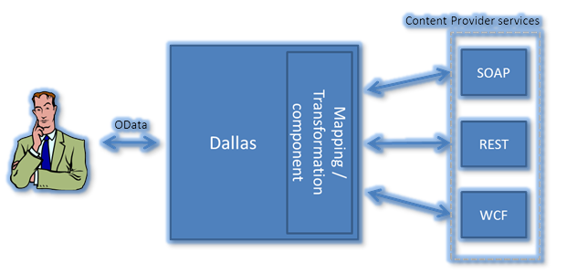
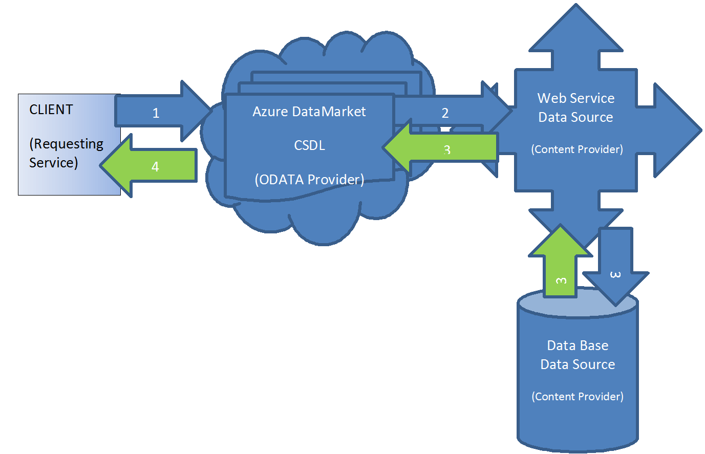
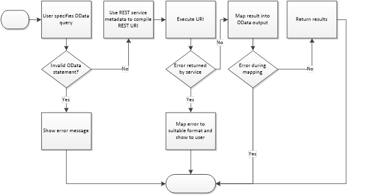

<properties
   pageTitle="Leitfaden zum Erstellen einer Data Service von Marketplace | Microsoft Azure"
   description="Wenn Sie ausführliche Anweisungen zum Erstellen, zertifizieren und Bereitstellen einer Data Service für kaufen auf Azure Marketplace."
   services="marketplace-publishing"
   documentationCenter=""
   authors="HannibalSII"
   manager="hascipio"
   editor=""/>

   <tags
      ms.service="marketplace"
      ms.devlang="na"
      ms.topic="article"
      ms.tgt_pltfrm="na"
      ms.workload="na"
      ms.date="08/26/2016"
      ms.author="hascipio; avikova" />

# Zuordnen eines vorhandenen Webdiensts mit OData bis CSDL

>[AZURE.IMPORTANT] **Zu diesem Zeitpunkt sind wir nicht mehr Onboarding alle neuen Data Service Herausgeber. Neue Dataservices wird nicht für Auflistung genehmigt abrufen.** Wenn Sie eine SaaS Business-Anwendung haben Sie auf Elemente verwenden veröffentlichen möchten Sie weitere Informationen finden Sie [hier](https://appsource.microsoft.com/partners). Oder wenn Sie eine IaaS Applikationen Entwicklertools Dienst auf Azure Marketplace, die Sie veröffentlichen möchten weitere Informationen finden Sie [hier](https://azure.microsoft.com/marketplace/programs/certified/).

Dieser Artikel enthält eine Übersicht zur Verwendung einer CSDL zuordnen einen vorhandenen Dienst an einen OData-Dienst kompatibel. Es wird erläutert, wie zum Erstellen des Dokuments Zuordnung (CSDL), die die Eingabe Anforderung vom Client über ein Anruf transformiert und die Ausgabe (Daten) an den Client über ein kompatibles OData-feed zurück. Microsoft Azure Marketplace macht den Endbenutzer-Dienste mithilfe des OData-Protokolls verfügbar. Dienste, die von Inhaltsanbietern (Datenbesitzer) verfügbar gemacht werden, sind in einer Vielzahl von Formularen, wie z. B. REST, SOAP usw. bereitgestellt.

## Was ist eine CSDL und deren Struktur?
Einer CSDL (konzeptionelle Schema Definition Language) ist eine Spezifikation definieren so Webdienst oder im allgemeinen XML-Wortlaut zu Azure Marketplace-Datenbank-Dienst zu beschreiben.

Einfache Übersicht über die **Fluss anfordern:**

  `Client -> Azure Marketplace -> Content Provider’s Web Service (Get, Post, Delete, Put)`

Der **Datenfluss** ist in der entgegengesetzten Richtung:

  `Client <- Azure Marketplace <- Content Provider’s WebService`

**Abbildung 1** Diagrammen wie ein Client Daten aus Content-Anbieter (dem Dienst) erhalten würden geschieht mit dem Azure Marketplace.  CSDL von der Zuordnung/Transformation Komponente verwendet, um die Anfrage zu behandeln und Daten zwischen den Inhalt Anbieter Dienste und den anfragenden Client zu übergeben.

*Abbildung 1: Detaillierte Fluss anfordern Desktopclient zu Content über Azure Marketplace-Anbieter*

  

Weitere Hintergrundinformationen zur Atom, Atom Pub und das OData-Protokoll auf dem Azure Marketplace-Erweiterungen aufbauen, Bitte überprüfen: [http://msdn.microsoft.com/library/ff478141.aspx](http://msdn.microsoft.com/library/ff478141.aspx)

Ausschnitt von oberhalb der Link:     *"ist dafür CRUD-Stil-Operationen (erstellen, lesen, aktualisieren und löschen) für Ressourcen, die als Data Services verfügbar gemacht werden, ein Protokoll REST-basierten der Zweck der Open Data Protocol (im als OData bezeichnet). "Data Service" ist ein Endpunkt besteht die Daten aus einer oder mehrerer "Sammlungen" jedes mit 0 (null) oder mehr "Einträge", die aus bestehen verfügbar gemacht eingegebene mit dem Namen / Wert-Paare. OData wird von Microsoft veröffentlichten unter OASIS (Organization for der Advancement of Structured Information Standards) Standards, dass jede Person, die möchte Servern, Clients oder Tools ohne Tantiemen oder Einschränkungen erstellen kann."*

### Drei wichtige Textstellen, die von der CSDL definiert werden, sind:

- Der **Endpunkt** von der Service Provider im Web Adresse (URI) des Diensts
- Die **Datenparameter** als Eingabe für den Dienstanbieter übergebene die Definitionen der Parameter gesendet an den Inhaltsanbieter-Dienst auf den Datentyp.
- **Schema** der Daten, die den Dienst anfordern das Schema der Daten übermittelt, indem Sie den Inhaltsanbieter-Dienst, einschließlich Container, Websitesammlungen/Tabellen, Variablen/Spalten und Datentypen zurückgegeben werden.

Das folgende Diagramm zeigt einen Überblick über den Datenfluss aus, bei dem der Client die OData-Anweisung (Anruf an den Inhalt Anbieter-Webdienst) eingibt, dem die Ergebnisse/Daten wieder abrufen.

  

### Schritte aus:

1. Client sendet Anforderung per Serviceanfrage samt Eingabeparameter definiert in XML-Datei zu Azure Marketplace
2. CSDL wird verwendet, um den Anruf Service zu überprüfen.
    - Die formatiert Serviceanfragen wird dann zum Inhalt Anbieter Dienst nach dem Azure Marketplace gesendet
3. Der Webdienst ausgeführt wird und die Aktion für das HTTP-Verb vornimmt (d. h. erhalten) die Daten werden unter Verwendung der in der CSDL definierten Zuordnung zu Azure Marketplace, wo finde ich die angeforderten Daten (falls vorhanden) macht im XML-Format an den Client, zurückgegeben.
4. Der Client wird die Daten (falls vorhanden) im XML- oder JSON-Format gespeichert

## Definitionen

### OData-ATOM pub

Legen Sie eine Erweiterung für die ATOM-Pub, wobei jeder Eintrag eine Zeile mit einem Ergebnis darstellt. Der Inhalte Teil den Eintrag wurde verbessert, um die Werte aus der Zeile – als Key Wert-Paare enthalten. Weitere Informationen finden Sie hier: [https://www.odata.org/documentation/odata-version-3-0/atom-format/](https://www.odata.org/documentation/odata-version-3-0/atom-format/)

### CSDL - konzeptionelle Schema Definition Language

Ermöglicht das Definieren von Funktionen (Routeninformationen) und Personen, die über eine Datenbank verfügbar gemacht werden. Weitere Informationen finden Sie hier: [http://msdn.microsoft.com/library/bb399292.aspx](http://msdn.microsoft.com/library/bb399292.aspx)  

> [AZURE.TIP] Klicken Sie auf den Dropdownpfeil **anderen Versionen** , und wählen Sie eine Version aus, wenn Sie den Artikel nicht angezeigt werden.

### EDM - Eintrag-Datenmodell
- Übersicht: [http://msdn.microsoft.com/library/vstudio/ee382825 (v=vs.100).aspx][OverviewLink] [OverviewLink]: http://msdn.microsoft.com/library/vstudio/ee382825 (v=vs.100).aspx
- Vorschau: [http://msdn.microsoft.com/library/aa697428 (v=vs.80).aspx][PreviewLink] [PreviewLink]: http://msdn.microsoft.com/library/aa697428 (v=vs.80).aspx
- Datentypen: [http://msdn.microsoft.com/library/bb399548 (v=VS.100).aspx][DataTypesLink] [DataTypesLink]: http://msdn.microsoft.com/library/bb399548 (v=VS.100).aspx

Das folgende zeigt die detaillierte links nach rechts Datenfluss aus, bei dem der Client die OData-Anweisung (Anruf an den Inhalt Anbieter-Webdienst) eingibt am besten Ergebnisse/Daten zurück:

  

## CSDL-Grundlagen

Einer CSDL (konzeptionelle Schema Definition Language) ist eine Spezifikation definieren so Webdienst oder im allgemeinen XML-Wortlaut zu Azure Marketplace-Datenbank-Dienst zu beschreiben. CSDL beschreibt die kritischen Teile, die **ermöglicht die Übergabe von Daten aus der Datenquelle zum Azure Marketplace.** Die Hauptteilen werden hier beschrieben:

- Informationen zur Benutzeroberfläche, die alle öffentlich verfügbare Funktionen (FunctionImport Knoten) beschreiben
- Informationen über Datentypen für alle Nachrichten requests(input) und Nachricht responses(outputs) (EntityContainer/EntitySet/EntityType Knoten)
- Informationen über das Transportprotokoll werden Bindung verwendet (Kopfzeile Knoten)
- Adressinformationen für die Suche nach dem angegebenen Dienst (BaseURI Attribut)

Kurz gesagt, stellt CSDL einen Vertrag unabhängig von Plattform und Sprache zwischen das jeweilige Dienst und dem Dienstanbieter. Verwenden die CSDL, einem Client Suchen nach einem Webdienst-Service-Datenbank und seiner öffentlich verfügbare Funktionen aufrufen.

### Bezug einer CSDL mit einer Datenbank oder einer Websitesammlung
**Die CSDL-Spezifikation**

CSDL ist XML-Grammatik zur Beschreibung von eines Webdiensts. Die Spezifikation selbst ist in 4 Hauptelemente unterteilt: EntitySet, FunctionImport; NameSpace und EntityType.

Um diese Abstraktion ermöglicht schwer zu vereinfachen Verknüpfen einer CSDL zu einer Tabelle.

Beachten Sie auch;

  CSDL stellt einen Vertrag unabhängig von Plattform und Sprache zwischen den **Dienst Requestor** und **Dienstanbieter**. Verwenden von CSDL, einen **Client** kann suchen Sie nach einer **Webdienst-Service-Datenbank** und Aufrufen einer öffentlich zugänglichen **Funktionen.**

Für einen Datendienst können die vier Komponenten einer CSDL auch mithilfe einer Datenbank, Tabelle, Spalte und Store Verfahren vorstellen.

Im Zusammenhang dieser für einen Datendienst wie folgt aus:

- EntityContainer ~ = Datenbank
- EntitySet ~ = Tabelle
- EntityType ~ = Spalten
- FunctionImport ~ = gespeicherte Prozedur

**HTTP-Verben zulässig.**
- GET – gibt Werte aus der Datenbank (gibt eine Websitesammlung)
- Beitrag – verwendet, um Daten zu und optional Rückgabewerte übergeben, aus der Datenbank (Erstellen eines neuen Eintrags in der Websitesammlung zurückgegebene Id-URI)
- Löschen Sie – Löschen von Daten aus der Datenbank (löscht eine Websitesammlung)
- Setzen Sie – Aktualisieren von Daten in einer DB (eine Auflistung ersetzen oder erstellen Sie eine)

## Metadaten/Zuordnung Dokument

Metadaten/Zuordnung Dokument wird verwendet, um die vorhandene Webdienste einen Inhalt Anbieter zuordnen, sodass es als Webdienst OData durch das Azure Marketplace-System verfügbar gemacht werden kann. Es basiert auf CSDL und implementiert ein paar Erweiterungen zu CSDL und die REST Bedürfnissen gerecht werden kann-Webdiensten über Azure Marketplace verfügbar gemacht werden. Die Extensions finden Sie in den Namespace [http://schemas.microsoft.com/dallas/2010/04](http://schemas.microsoft.com/dallas/2010/04) .

CSDL beispielsweise wie folgt: (Kopieren und Einfügen der gezeigten Beispiel CSDL in einer XML-Editor geöffnet und ändern, zu den Dienst entsprechen.  Fügen Sie in CSDL Zuordnung unter DataService Registerkarte beim Erstellen des Diensts im [Azure Marketplace-Veröffentlichungsportal](https://publish.windowsazure.com)).

**Ausdrücke:** Betreffend die CSDL Begriffe der Ausdrücke [Veröffentlichungsportal](https://publish.windowsazure.com) Benutzeroberfläche (PPUI).
- Bieten Sie an, dass "Titel" in der PPUI mit MyWebOffer verbunden ist
- MyCompany in der PPUI bezieht sich auf **Publisher Anzeigenamen** im [Microsoft Developer Center](http://dev.windows.com/registration?accountprogram=azure) Benutzeroberfläche
- Ihre API bezieht sich auf ein Web oder Data Service (einem Plan in der PPUI)

**Hierarchie:** 
 eines Unternehmens (Content Provider) gehören Angebot(e) die Feedbackergebnisse haben, nämlich Konto, welche Zeile nach oben mit einer API.

### Webdienst CSDL-Beispiel

Eine Verbindung mit einem Dienst, der einen Endpunkt des Web-Anwendung (wie eine C#-Anwendung) verfügbar machen, ist

        <?xml version="1.0" encoding="utf-8"?>
        <!-- The namespace attribute below is used by our system to generate C#. You can change “MyCompany.MyOffer” to something that makes sense for you, but change “MyOffer” consistently throughout the document. -->
        <Schema Namespace="MyCompany.MyWebOffer" Alias="MyOffer" xmlns="http://schemas.microsoft.com/ado/2009/08/edm" xmlns:d="http://schemas.microsoft.com/dallas/2010/04" >
        <!-- EntityContainer groups all the web service calls together into a single offering. Every web service call has a FunctionImport definition. -->
          <EntityContainer Name="MyOffer">
        <!-- EntitySet is defined for CSDL compatibility reasons, not required for ReturnType=”Raw”
        @Name is used as reference by FunctionImport @EntitySet. And is used in the customer facing UI as name of the Service.
        @EntityType is used to point at the type definition near the bottom of this file. -->
            <EntitySet Name="MyEntities" EntityType="MyOffer.MyEntityType" />
        <!-- Add a FunctionImport for every service method. Multiple FunctionImports can share a single return type (EntityType). -->
        <!-- ReturnType is either Raw() for a stream or Collection() for an Atom feed. Ex. of Raw: ReturnType=”Raw(text/plain)” -->
        <!—EntitySet is the entityset defined above, and is needed if ReturnType is not Raw -->
        <!-- BaseURI attribute defines the service call, replace & with the encode value (&amp;).
        In the input name value pairs {param} represents passed in value.
        Or the value can be hard coded as with AccountKey. -->
        <!-- AllowedHttpMethods optional (default = “GET”), allows the CSDL to specifically specify the verb of the service, “Get”, “Post”, “Put”, or “Delete”. -->
        <!-- EncodeParameterValues, True encodes the parameter values, false does not. -->
        <!-- BaseURI is translated into an URITemplate which defines how the web service call is exposed to marketplace customers.
        Ex. https://api.datamarket.azure.com/mycompany/MyOfferPlan?name={name}
        BaseURI is XML encoded, the {...} point to the parameters defined below.
        Marketplace will read the parameters from this URITemplate and fill the values into the corresponding parameters of the BaseUri or RequestBody (below) during calls to your service.  
        It is okay for @d:BaseUri to include information only for Marketplace consumption, it will not be exposed to end users. i.e. the hardcoded AccountKey in the above BaseURI does not show up in the client facing URITemplate. -->
            <FunctionImport Name="MyWebServiceMethod"
                            EntitySet="MyEntities"
                            ReturnType="Collection(MyOffer.MyEntityType)"
        d:AllowedHttpMethods="GET"
        d:EncodeParameterValues="true"
        d:BaseUri="http://services.organization.net/MyServicePath?name={name}&amp;AccountKey=22AC643">
        <!-- Definition of the RequestBody is only required for HTTP POST requests and is optional for HTTP GET requests. -->
        <d:RequestBody d:httpMethod="POST">
                <!-- Use {} for placeholders to insert parameters. -->
                <!-- This example uses SOAP formatting, but any POST body can be used. -->
            <!-- This example shows how to pass userid and password via the header -->
                <![CDATA[<soapenv:Envelope xmlns:soapenv="http://schemas.xmlsoap.org/soap/envelope/" xmlns:MyOffer="http://services.organization.net/MyServicePath">
                  <soapenv:Header/>
                  <soapenv:Body>
                    <MyOffer:ws_MyWebServiceMethod>
                      <myWebServiceMethodRequest>
                        <!--This information is not exposed to end users. -->
                        <UserId>userid</UserId>
                        <Password>password</Password>
                        <!-- {name} is replaced with the value read from @d:UriTemplate above -->
                        <Name>{name}</Name>
                        <!-- Parameters can be used more than once and are not limited to appearing as the value of an element -->
                        <CustomField Name="{name}" />
                        <MyField>Static content</MyField>
                      </myWebServiceMethodRequest>
                    </MyOffer:ws_MyWebServiceMethod>
                  </soapenv:Body>
                </soapenv:Envelope>      
              ]]>
        </d:RequestBody>
        <!-- Title, Rights and Description are optional and used to specify values to insert into the ATOM feed returned to the end user.  You can specify the element to contain a fixed message by providing a value for the element (this is the default value).  @d:Map is an XPath expression that points into the response returned by your service and is optional.  -->
        <d:Title d:Map="/MyResponse/Title">Default title.</d:Title>
        <d:Rights>© My copyright. This is a fixed response. It is okay to also add a d:Map attribute to override this text.</d:Rights>
        <d:Description d:Map="/MyResponse/Description"></d:Description>
        <d:Namespaces>
        <d:Namespace d:Prefix="p"  d:Uri="http://schemas.organization.net/2010/04/myNamespace" />
        <d:Namespace d:Prefix="p2" d:Uri="http://schemas.organization.net/2010/04/MyNamespace2" />
        </d:Namespaces>
        <!-- Parameters of the web service call:
        @Name should match exactly (case sensitive) the {…} placeholders in the @d:BaseUri, @d:UriTemplate, and d:RequestBody, i.e. “name” parameter in above BaseURI.
        @Mode is always "In", compatibility with CSDL
        @Type is the EDM.SimpleType of the parameter, see http://msdn.microsoft.com/library/bb399548(v=VS.100).aspx
        @d:Nullable indicates whether the parameter is required.
        @d:Regex - optional, attribute to describe the string, limiting unwanted input at the entry of the system
        @d:Description - optional, is used by Service Explorer as help information
        @d:SampleValues - optional, is used by Service Explorer as help information. Multiple Sample values are separated by '|', e.g. "804735132|234534224|23409823234"
        @d:Enum - optional for string type. Contains an enumeration of possible values separated by a '|', e.g. d:enum="english|metric|raw". Will be converted in a dropdown list in the Service Explorer.
        -->
        <Parameter name="name" Mode="In" Type="String" d:Nullable="false" d:Regex="^[a-zA-Z]*$" d:Description="A name that cannot contain any spaces or non-alpha non-English characters"
        d:Enum="George|John|Thomas|James"
        d:SampleValues="George"/>
        <Parameter Name=" AccountKey" Mode="In" Type="String" d:Nullable="false" />

        <!-- d:ErrorHandling is an optional element. Use it define standardized errors by evaluating the service response. -->
        <d:ErrorHandling>
        <!-- Any number of d:Condition elements are allowed, they are evaluated in the order listed.
        @d:Match is an Xpath query on the service response, it should return true or false where true indicates an error.
        @d:httpStatusCode is the error code to return if an response matches the error.
        @d:errorMessage is the user friendly message to return when an error occurs.
        -->
        <d:Condition d:Match="/Result/ErrorMessage[text()='Invalid token']" d:HttpStatusCode="403" d:ErrorMessage="User cannot connect to the service." />
        </d:ErrorHandling>
           </FunctionImport>

            <!-- The EntityContainer defines the output data schema -->
        </EntityContainer>
        <!-- The EntityType @d:Map defines the repeating node (an XPath query) in the response (output data schema). -->
        <!-- If these nodes are outside a namespace, add the prefix in the xpath. -->
        <!--
        @Name - define your user readable name, will become an XML element in the ATOM feed, so comply with the XML element naming restrictions (no spaces or other illegal characters).
        @Type is the EDM.SimpleType of the parameter, see http://msdn.microsoft.com/library/bb399548(v=VS.100).aspx.
        @d:Map uses an Xpath query to point at the location to extract the content from your services response.
        The "." is relative to the repeating node in the EntityType @d:Map Xpath expression.
        -->
            <EntityType Name="MyEntityType" d:Map="/MyResponse/MyEntities">
        <Property Name="ID" d:IsPrimaryKey="True" Type="Int32"  Nullable="false" d:Map="./Remaining[@Amount]"/>
        <Property Name="Amount" Type="Double"   Nullable="false" d:Map="./Remaining[@Amount]"/>
        <Property Name="City"   Type="String"   Nullable="false" d:Map="./City"/>
        <Property Name="State"  Type="String"   Nullable="false" d:Map="./State"/>
        <Property Name="Zip"    Type="Int32"    Nullable="false" d:Map="./Zip"/>
        <Property Name="Updated"    Type="DateTime" Nullable="false" d:Map="./Updated"/>
        <Property Name="AdditionalInfo" Type="String" Nullable="true"
        d:Map="./Info/More[1]"/>
            </EntityType>
        </Schema>

> [AZURE.TIP] Weitere Beispiele für die CSDL Webdienst im Artikel [Beispiele für einen vorhandenen Webdienst mit OData bis CSDLs Zuordnung](marketplace-publishing-data-service-creation-odata-mapping-examples.md) anzeigen

###DataService CSDL-Beispiel

Verbindet mit einem Dienst, der eine Datenbanktabelle oder Sicht verfügbar machen ist, wie ein Endpunkt gezeigten Beispiel zeigt zwei APIs für Daten Basis-API CSDL basierend auf (können Sichten anstelle von Tabellen verwenden).

        <?xml version="1.0"?>
        <!-- The namespace attribute below is used by our system to generate C#. You can change “MyCompany.MyOffer” to something that makes sense for you, but change “MyOffer” consistently throughout the document. -->
        <Schema Namespace="MyCompany.MyDataOffer" Alias="MyOffer" xmlns:xsd="http://www.w3.org/2001/XMLSchema" xmlns:xsi="http://www.w3.org/2001/XMLSchema-instance" xmlns="http://schemas.microsoft.com/ado/2009/08/edm">
        <!-- EntityContainer groups all the data service calls together into a single offering. Every web service call has a FunctionImport definition. -->
        <EntityContainer Name="MyOfferContainer">
        <!-- EntitySet is defined for CSDL compatibility reasons, not required for ReturnType=”Raw”
            Think of the EntitySet as a Service
        @Name is used in the customer facing UI as name of the Service.
        @EntityType is used to point at the type definition (returned set of table columns). -->
        <EntitySet Name="CompanyInfoEntitySet" EntityType="MyOffer.CompanyInfo" />
        <EntitySet Name="ProductInfoEntitySet" EntityType="MyOffer.ProductInfo" />
        </EntityContainer>
        <!-- EntityType defines result (output); the table (or view) and columns to be returned by the data service.)
            Map is the schema.tabel or schema.view
            dals.TableName is the table Name
            Name is the name identifier for the EntityType and the Name of the service exposed to the client via the UI.
            dals:IsExposed determines if the table schema is exposed (generally true).
            dals:IsView (optional) true if this is based on a view rather than a table
            dals:TableSchema is the schema name of the table/view
        -->
        <EntityType
        Map="[dbo].[CompanyInfo]"
        dals:TableName="CompanyInfo"
        Name="CompanyInfo"
        dals:IsExposed="true"
        dals:IsView="false"
        dals:TableSchema="dbo"
        xmlns:dals="http://schemas.microsoft.com/dallas/2010/04">
        <!-- Property defines the column properties and the output of the service.
            dals:ColumnName is the name of the column in the table /view.
            Type is the emd.SimpleType
            Nullable determines if NULL is a valid output value
            dals.CharMaxLenght is the maximum length of the output value
            Name is the name of the Property and is exposed to the client facing UI
            dals:IsReturned is the Boolean that determines if the Service exposes this value to the client.
            IsQueryable is the Boolean that determines if the column can be used in a database query
            (For data Services: To improve Performance make sure that columns marked ISQueryable=”true” are in an index.)
            dals:OrdinalPosition is the numerical position x in the table or the View, where x is from 1 to the number of columns in the table.
            dals:DatabaseDataType is the data type of the column in the database, i.e. SQL data type dals:IsPrimaryKey indicates if the column is the Primary key in the table/view.  (The columns marked ISPrimaryKey are used in the Order by clause when returning data.)
        -->
        <Property dals:ColumnName="data" Type="String" Nullable="true" dals:CharMaxLength="-1" Name="data" dals:IsReturned="true" dals:IsQueryable="false" dals:IsPrimaryKey="false" dals:OrdinalPosition="3" dals:DatabaseDataType="nvarchar" />
        <Property dals:ColumnName="id" Type="Int32" Nullable="false" Name="id" dals:IsReturned="true" dals:IsQueryable="true" dals:IsPrimaryKey="true" dals:OrdinalPosition="1" dals:NumericPrecision="10" dals:DatabaseDataType="int" />
        <Property dals:ColumnName="ticker" Type="String" Nullable="true" dals:CharMaxLength="10" Name="ticker" dals:IsReturned="true" dals:IsQueryable="true" dals:IsPrimaryKey="false" dals:OrdinalPosition="2" dals:DatabaseDataType="nvarchar" />
        </EntityType>
        <EntityType Map="[dbo].[ProductInfo]" dals:TableName="ProductInfo" Name="ProductInfo" dals:IsExposed="true" dals:IsView="false" dals:TableSchema="dbo" xmlns:dals="http://schemas.microsoft.com/dallas/2010/04">
        <Property dals:ColumnName="companyid" Type="Int32" Nullable="true" Name="companyid" dals:IsReturned="true" dals:IsQueryable="true" dals:IsPrimaryKey="false" dals:OrdinalPosition="2" dals:NumericPrecision="10" dals:DatabaseDataType="int" />
        <Property dals:ColumnName="id" Type="Int32" Nullable="false" Name="id" dals:IsReturned="true" dals:IsQueryable="true" dals:IsPrimaryKey="true" dals:OrdinalPosition="1" dals:NumericPrecision="10" dals:DatabaseDataType="int" />
        <Property dals:ColumnName="product" Type="String" Nullable="true" dals:CharMaxLength="50" Name="product" dals:IsReturned="true" dals:IsQueryable="true" dals:IsPrimaryKey="false" dals:OrdinalPosition="3" dals:DatabaseDataType="nvarchar" />
        </EntityType>
        </Schema>

## Siehe auch
- Wenn Sie interessiert sind lernen und verstehen die bestimmten Knoten und deren Parameter, lesen Sie diesen Artikel [Data Service OData Zuordnung Knoten](marketplace-publishing-data-service-creation-odata-mapping-nodes.md) für Definitionen und erläuterungen, Beispiele, und verwenden die Groß-/Kleinschreibung Kontext.
- Wenn Sie Beispiele überprüfen möchten, lesen Sie diesen Artikel [Data Service OData Zuordnen von Beispielen](marketplace-publishing-data-service-creation-odata-mapping-examples.md) finden Sie unter Beispielcode und Syntax von Feldfunktionen und den Kontext verstehen.
- Lesen Sie diesen Artikel [Data Service Publishing Guide](marketplace-publishing-data-service-creation.md), um den vorgegebenen Pfad für die Veröffentlichung von einem Datendienst zu Azure Marketplace zurückzukehren.
