<properties
   pageTitle="Leitfaden zum Erstellen einer Data Service von Marketplace | Microsoft Azure"
   description="Wenn Sie ausführliche Anweisungen zum Erstellen, zertifizieren und Bereitstellen einer Data Service für kaufen auf Azure Marketplace."
   services="marketplace-publishing"
   documentationCenter=""
   authors="HannibalSII"
   manager="hascipio"
   editor=""/>

   <tags
      ms.service="marketplace"
      ms.devlang="na"
      ms.topic="article"
      ms.tgt_pltfrm="na"
      ms.workload="na"
      ms.date="08/26/2016"
      ms.author="hascipio; avikova" />

# Data Service veröffentlichen Leitfaden für die Azure Marketplace

>[AZURE.IMPORTANT] **Zu diesem Zeitpunkt sind wir nicht mehr Onboarding alle neuen Data Service Herausgeber. Neue Dataservices wird nicht für Auflistung genehmigt abrufen.** Wenn Sie eine SaaS Business-Anwendung haben Sie auf Elemente verwenden veröffentlichen möchten Sie weitere Informationen finden Sie [hier](https://appsource.microsoft.com/partners). Oder wenn Sie eine IaaS Applikationen Entwicklertools Dienst auf Azure Marketplace, die Sie veröffentlichen möchten weitere Informationen finden Sie [hier](https://azure.microsoft.com/marketplace/programs/certified/).

Nach Abschluss des Schritt 1, [Konto erstellen und registrieren](marketplace-publishing-accounts-creation-registration.md), schrittweise wir Sie über die [technischen Allgemein](marketplace-publishing-pre-requisites.md) und [Technische Anforderungen](marketplace-publishing-data-service-creation-prerequisites.md) ein Angebot Data Service auf Azure Marketplace. Jetzt wir Sie die Schritte zum Erstellen eines Angebots Data Service im [Veröffentlichungsportal] durchzuführen wird[ link-pubportal] von Azure Marketplace.

## 1 melden Sie sich an den veröffentlichenden Portal.

Wechseln Sie zu [https://publish.windowsazure.com](https://publish.windowsazure.com. )

**Verwenden Sie für die ersten Mal Anmeldung Veröffentlichungsportal dasselbe Konto mit dem Ihres Unternehmens Verkäuferprofil Developer Center registriert wurde.**  (Später können Sie einen beliebigen Mitarbeiter Ihres Unternehmens als co-Administrator in der Veröffentlichungsportal hinzufügen).

Klicken Sie auf die Kachel **Veröffentlichen eines Data Services** ist dies das erste Login in der Veröffentlichungsportal.

## 2. Wählen Sie im Navigationsmenü auf der linken Seite **Data Services** .

  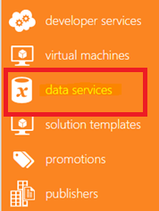

## 3 Erstellen Sie 3 einen neuen Datendienst

Füllen Sie den Titel für Ihre neue Dienst anbieten, und klicken Sie auf auf "+" auf der rechten Seite.

  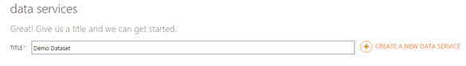

## 4 Überprüfen Sie 4 unter der neu erstellten Data Service im Navigationsmenü im Untermenü.

Klicken Sie auf der Registerkarte **Exemplarische Vorgehensweise** auf, und überprüfen Sie alle erforderlichen Schritte zum Datendienst auf Azure Marketplace ordnungsgemäß Veröffentlichen erforderlich sind.

> [AZURE.TIP] Sie können immer klicken Sie auf die Links auf der Seite "Exemplarische Vorgehensweise" oder verwenden Sie Registerkarten auf der Data Service-Angebot Untermenü auf der linken Seite.

## 5 Erstellen eines neuen Plans.

### Angebote, Pläne, Transaktionen.

Jede anbieten muss kann verfügen über mehrere Pläne, aber mindestens eins (1)-Plan. Wenn Ihr Angebot Endbenutzer abonnieren abonnieren sie für eine eines Plans für das Angebot. Jeder Plan definiert wie Endbenutzer den Dienst verwendet werden können.

Zurzeit Azure Marketplace nur monatliche Abonnement Transaktion basierend auf Modell für Data Services unterstützt, d. h. Endbenutzer werden entsprechend den Preis von den spezifischen Plan aus, die, dem Sie abonniert, monatliche Gebühr bezahlen und sind in der Lage, nutzen jeden Monat Anzahl Transaktion, indem Sie den Plan definiert.

Jede Transaktion in der Regel als die Anzahl der Datensätze, die Ihre Datendienst zurückgeben definiert basierend auf der Abfrage, die an den Dienst gesendet werden. Die Standardeinstellung ist 100. Anzahl der Transaktionen, die zu jeder Abfrage zurückgegeben werden Zahl von Datensätzen, die geteilt durch 100 und auf die nächste ganze Zahl gerundet.

Es ist Azure Marketplace-Dienst Layer Zuständigkeit (Meter) viele Transaktionen verbraucht nach jeder Abfrage überwacht.

> [AZURE.IMPORTANT] Endbenutzer, die die Transaktion während des Monats erreicht werden nicht fortgesetzt werden kann, verwenden Sie den Dienst bis zum Ende ihrer monatlichen Abonnement erreicht blockiert.

> Den Plan oder eine der Pläne können (aber nicht müssen) unbegrenzte Anzahl von Transaktionen enthalten.

### Erstellen Sie einen Plan.
1. Klicken Sie auf **"+"** neben "Hinzufügen ein neues Plans".

2. Wählen Sie eine der Optionen aus: **unbeschränkt** oder **eingeschränkten** Verwendung für diesen Plan.  Wenn die Beschränkung Geben Sie dann die Anzahl der Transaktion lässt der Plan in einen Monat nutzen.

    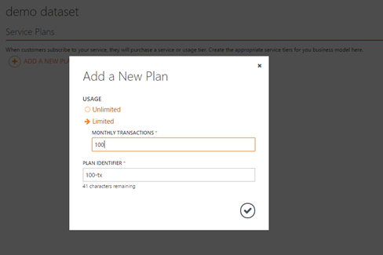  

    Veröffentlichen Portals auch schlägt "Plan Erkennungszeichen", die den Namen des Plans in der Benutzeroberfläche den Endbenutzer mitgeteilt und vom Dienst Markt auch verwendet werden, um den Plan zu identifizieren. Wenn Sie möchten, können Sie "Planen Erkennungszeichen" ändern.

    > [AZURE.NOTE] "Planen Erkennungszeichen" muss in den Bereich neben dem jeweiligen Angebot eindeutig sein. Wie viele andere Bezeichner in der Bezeichner für die Veröffentlichung Portal planen verwendet wird nach die erste Veröffentlichung Herstellung und Sie können diesen Bezeichner ändern nicht gesperrt werden.

3. Klicken Sie auf diese Option, um die Auswahl zu bestätigen.

4. Dann werden Sie einige zusätzliche Fragen bezüglich Ihres Plans neu erstellten aufgefordert werden.

    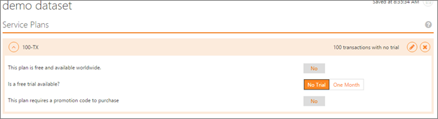

|Frage|Genauigkeit|
|----|----|
|**Dieser Plan ist kostenlos weltweit?**|Sie können einen Plan vollständig frei-von-Gebühr erstellen. Ist der einzige Plan für dieses Angebot – Dies bedeutet, dass Sie "Kostenlose bieten" auf der Marketplace veröffentlichen. Ist nur für eine (wenige) Plan, It bietet Ihnen eine Option, um weitere Informationen zu dem Dienst mit relativ wenigen Transaktionen pro Monat Endbenutzer anbieten.  Ist die Antwort "Ja", werden keine weiteren Fragen aufgefordert.|

> [AZURE.NOTE] Endbenutzer können auf die kostenpflichtiges Pläne immer aktualisieren.

|Frage|Genauigkeit|
|----|----|
|**Steht kostenlose Testversion?**|Wählen Sie zwischen "Keine Testversion" gar oder geben Sie eine Option aus, um Ihr Plan für "Einen Monat" verwenden. Herausgeber wie mit dieser Option Endbenutzer die Möglichkeit, die Vorteile des Angebots kostenlos für einen Monat Grundlegendes zum Bereitstellen.|

> [AZURE.IMPORTANT] Endbenutzer sind nur Lage, eine kostenlose Testversion erwerben, wenn sie die Zahlung Urkunde z. B. Kreditkarte Enterprise-Vertrag eingerichtet haben.

> Nach einem Monat des kostenlose Testversion beginnt Azure Marketplace belasten Kunden den Kurs zum Datum des Abonnements, es sei denn, der Kunden die Kündigung Abonnement initiiert. Keine spezielle Benachrichtigung wird an den Endbenutzer bereitgestellt werden.

|Frage|Genauigkeit|
|----|----|
|**Dieser Plan erfordert einen Code Werbeaktion erwerben?**| Herausgeber haben die Möglichkeit, den Zugriff auf ihre Service-Pläne zu beschränken, indem Sie eine spezielle Codes, so genannte "A Promocode" für bestimmte Kunden. Nur Endbenutzer denen diese Promocode werden können, um den Plan zu abonnieren. Wenn Sie "Nein" klicken, stimmen Sie, dass jede Person aus dem Bereich, in dem das Angebot verfügbar (finden Sie unter [Marketplace Marketing Inhalt Leitfaden](marketplace-publishing-push-to-staging.md) für weitere Details) ist, um diesen Plan abonnieren kann. Keine weiteren Fragen werden aufgefordert.|
|**Ausblenden von diesem Plan aus jeder Benutzer, der einen gültigen Code hat auch?**|Ist die Antwort zur vorherigen Frage "Ja" weist die Publisher eine Option, um diesen Plan vollständig entfernen, in der Benutzeroberfläche von der Marketplace angezeigt werden. Dies bedeutet, werden Kunden keine dieser Plan in das Angebot der Detailseite angezeigt. Endbenutzer, die eine Promocode zum kaufen, empfangen werden können sie mithilfe dieser Promocode abonnieren.|

## 6. erstellen Sie Ihrer Marketplace marketing-Inhalt
Informationen über das Bereitstellen von Informationen in den Registerkarten **Marketing, Preise, Support und Kategorien** Bitte besuchen erforderlich [Marketplace Marketing Content Guide](marketplace-publishing-push-to-staging.md) also für alle Elemente in der Azure Marketplace veröffentlicht.  

## 7 verbinden Sie 7 Ihr Angebot mit Ihrem Dienst (SQL Azure-basierten oder Webdienst Basis).

Klicken Sie auf das Untermenü **Data Services** .

Klicken Sie auf der oberen Hälfte der Seite werden Sie aufgefordert, das Angebot des **Namespace**bereit.  

  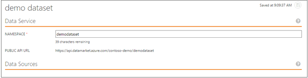

Die unter Frage wird festgelegt werden, wie die Publisher zu machen neu erstellte Angebot zu Azure Marketplace. (Weitere Informationen hierzu finden Sie in der [Data Services technische vorbereitende Guide](marketplace-publishing-data-service-creation-prerequisites.md)).

  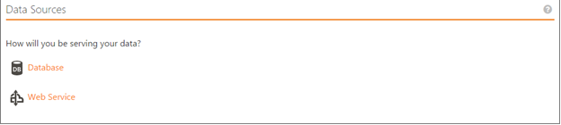

**Veröffentlichen des Datenbank auf der Basis-Diensts**

Klicken Sie auf **Datenbank**. Die folgende Seite wird angezeigt:

  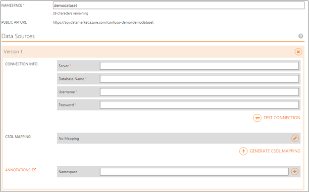

So erstellen Sie eine Zuordnung CSDL für das Dataset basierend auf der SQL Azure-Datenbank

  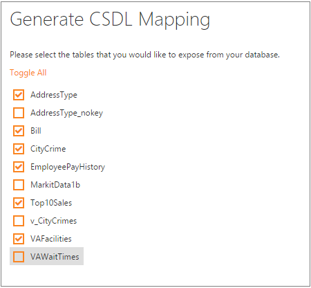

Und dann für jede Tabelle

  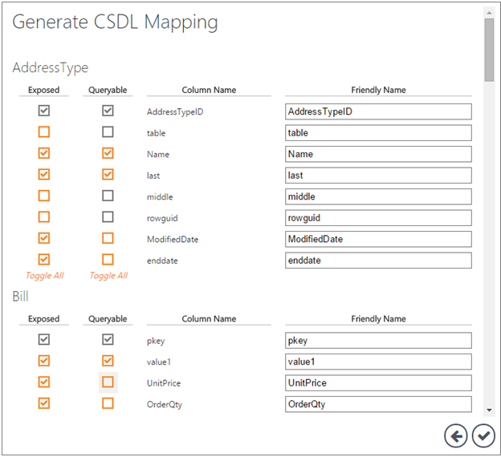

  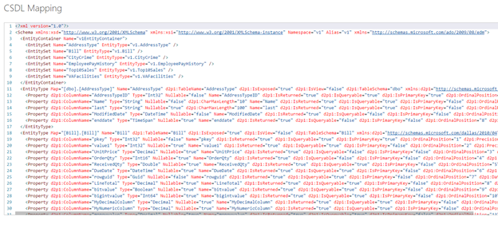

Wenn-Webdienst ab

  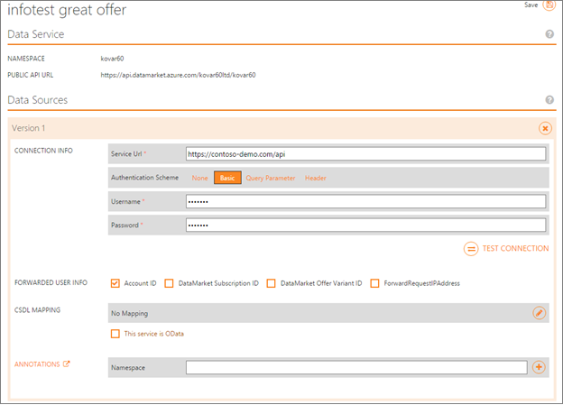

> [AZURE.IMPORTANT] Lesen Sie [einen vorhandenen Webdienst mit OData bis CSDL Zuordnung](marketplace-publishing-data-service-creation-odata-mapping.md) für detaillierte Informationen und Beispiele für das Erstellen eines Webdiensts CSDL aus.

## Nächste Schritte
Jetzt, da Sie Ihr Angebot Data Service erstellt haben, stellen Sie sicher, dass Sie die Anweisungen im [Marketplace Marketing Content Guide](marketplace-publishing-push-to-staging.md) abgeschlossen haben, bevor Sie vorwärts zum [Testen der Data Service Staging](marketplace-publishing-data-service-test-in-staging.md)verschieben.

## Siehe auch
- [Erste Schritte: Wie veröffentlichen ein Angebots zu Azure Marketplace](marketplace-publishing-getting-started.md)
- Wenn Sie die allgemeine OData-Zuordnungsprozess und Zweck Grundlegendes interessiert sind, lesen Sie diesen Artikel [Data Service OData-Zuordnung](marketplace-publishing-data-service-creation-odata-mapping.md) zu Definitionen, Strukturen und Anweisungen zu überprüfen.
- Wenn Sie interessiert sind lernen und verstehen die bestimmten Knoten und deren Parameter, lesen Sie diesen Artikel [Data Service OData Zuordnung Knoten](marketplace-publishing-data-service-creation-odata-mapping-nodes.md) für Definitionen und erläuterungen, Beispiele, und verwenden die Groß-/Kleinschreibung Kontext.
- Wenn Sie Beispiele überprüfen möchten, lesen Sie diesen Artikel [Data Service OData Zuordnen von Beispielen](marketplace-publishing-data-service-creation-odata-mapping-examples.md) finden Sie unter Beispielcode und Syntax von Feldfunktionen und den Kontext verstehen.

[link-pubportal]:https://publish.windowsazure.com
