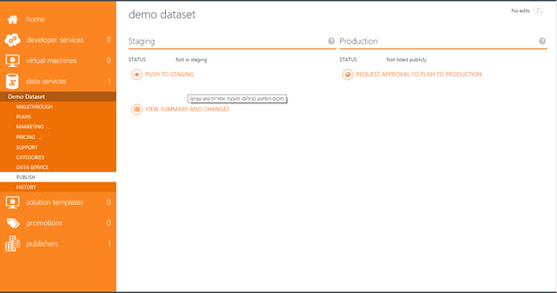
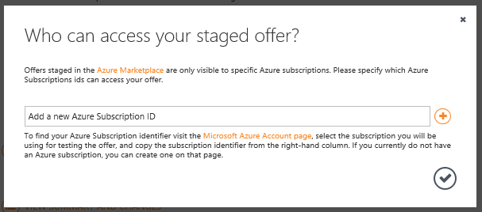
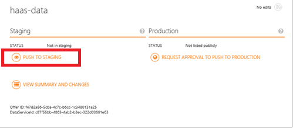
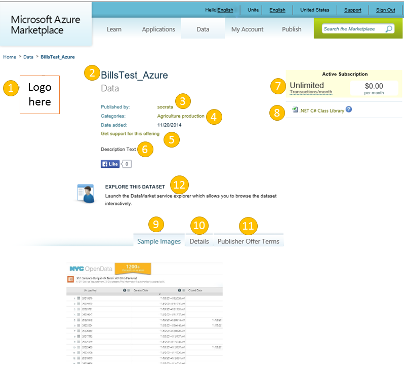

<properties
   pageTitle="Testen Ihr Angebot Data Service von Marketplace | Microsoft Azure"
   description="Verstehen Sie, wie Ihr Angebot Data Service von Azure Marketplace zu testen."
   services="marketplace-publishing"
   documentationCenter=""
   authors="HannibalSII"
   manager="hascipio"
   editor=""/>

<tags
   ms.service="marketplace"
   ms.devlang="na"
   ms.topic="article"
   ms.tgt_pltfrm="na"
   ms.workload="na"
   ms.date="08/26/2016"
   ms.author="hascipio; avikova" />

# Testen Ihr Angebot Data Service Staging

>[AZURE.IMPORTANT] **Zu diesem Zeitpunkt sind wir nicht mehr Onboarding alle neuen Data Service Herausgeber. Neue Dataservices wird nicht für Auflistung genehmigt abrufen.** Wenn Sie eine SaaS Business-Anwendung haben Sie auf Elemente verwenden veröffentlichen möchten Sie weitere Informationen finden Sie [hier](https://appsource.microsoft.com/partners). Oder wenn Sie eine IaaS Applikationen Entwicklertools Dienst auf Azure Marketplace, die Sie veröffentlichen möchten weitere Informationen finden Sie [hier](https://azure.microsoft.com/marketplace/programs/certified/).

Nach Abschluss der [Erstellung des Kontos Microsoft Developer](marketplace-publishing-accounts-creation-registration.md) und [erstellen Ihre Daten Dienst anbieten in Veröffentlichungsportal](marketplace-publishing-data-service-creation.md) ersten beiden Schritte können Sie für Ihr Angebot zur Verfügung stellen, in dem Azure Marketplace. In diesem Thema führt Sie durch die ersten, Fortgeschrittene und Schritt "Staging" bezeichnet

Staging bedeutet Bereitstellen von Ihr Angebot in einem privaten "Sandkasten", wo Sie testen und seine Funktionalität zu überprüfen, bevor sie nach der Herstellung drücken können. Das Angebot wird angezeigt, in das staging genau wie bei einem Kunden, die sie bereitgestellt hat.

## Schritt 1. Drücken Ihr Angebot auf staging
Drücken Ihr Angebot auf Staging, können Sie das Angebot zu testen, bevor sie an zukünftigen Abonnenten verfügbar sind.  Sie können sehen, wie Ihr Angebot angezeigt werden und für Personen mit Ihren Daten abonnieren-Funktion.  

  

1.  Melden Sie sich in der [Veröffentlichung Portal](https://publish.windowsazure.com)
2.  Wählen Sie im linken Navigationsbereich **Data Services**
3.  Wählen Sie Ihr Angebot an Staging übertragen werden soll. Den oben angegebenen Bildschirm wird angezeigt.
4.  Klicken Sie auf die Schaltfläche **Zum Staging Pushbenachrichtigungen** .  
5.  Falls Probleme mit dem Angebot, die erforderlich vor drücken Sie nach Staging abgeschlossen sein soll, sehen Sie eine Liste mit angezeigt.  Korrigieren Sie diese Punkte, indem Sie auf jedes Element in der Liste aus. Wenn alle Korrekturen vorgenommen klicken Sie erneut auf die Schaltfläche **drücken, um das Staging** .

Wenn es keine Probleme mit Ihr Angebot liegen wird unten im Popupfenster angezeigt.  

Wenn Sie nicht planen/nicht genehmigt sind, um Ihr Angebot Azure-Portal bereitstellen (aktuell weist begrenzter Kapazität), schließen Sie dann nur das Popup-Fenster.

Klicken Sie zum Testen der Data Service Azure-Portal (zusätzlich zu den DataMarket-Portal) benötigen Sie eine Azure-Abonnement-ID zum Testen.  Dieses Abonnement-ID wird das Konto identifizieren möchten, das So testen Sie Ihr Angebot gewährt werden soll.  

Schneiden Sie aus und fügen Sie Ihrem Abonnement-ID, und klicken Sie auf das Häkchen, um den Vorgang fortzusetzen.

  

> [AZURE.NOTE] Diese Azure Abonnements IDs sind nur für Test- und staging im [Verwaltungsportal Azure](https://manage.windowsazure.com)erforderlich ist. Sie sind nicht erforderlich, testen Sie in Azure Marketplace.

Dem nächsten Bildschirm, der zeigt angezeigt wird, dass für die Veröffentlichung stattfindet informiert das Symbol "In Bearbeitung" hervorgehoben Gelb unten an. Drücken Sie nach Staging dauert zwischen 10 bis 15 Minuten.  Wenn sie länger dauert, aktualisieren Sie zuerst Browser (drücken Sie F5 in Internet Explorer).  In Ausnahmefällen, wo Ihr Angebot weiterhin nach Staging nach einer Stunde drücken ist, klicken Sie auf den Kontakt Kontakt-link zu lassen Sie uns wissen, dass ein Problem vorliegt.

  

Abschluss der Pushbenachrichtigungen zu Staging das Symbol "In Bearbeitung" werden beenden verschieben und den Status auf "'bereitgestellt'" aktualisiert werden.  Sie können nun zum Testen Ihr Angebots.  

## Schritt 2. Testen Sie Ihr Angebot bereitgestellte in DataMarket

Klicken Sie auf den Link, folgen den Text **"Finden Sie unter dem Dienst bieten bei..."** auf den Bildschirm anzeigt, dass der Abonnent angezeigt wird, wenn Ihr Angebot zum Herstellung wechselt und wird im DataMarket angezeigt.

  

Testen oder aller 12 Elemente über gekennzeichnet, um sicherzustellen, dass alle Logos Preise/Transaktionen, Text, Bilder, Dokumentation und Links sind korrekt und arbeiten ordnungsgemäß überprüft werden.  Dies ist ein guter Zeitpunkt, um sicherzustellen, dass alle Testwerte, die Sie eingegeben haben, wenn Sie Ihr Angebot erstellen mit tatsächlichen Werte ersetzt wurden.

1. Anbieten von Logos
2. Anbieten von Namen
3. Publisher-Link Name Ihres Unternehmens-Website
4. Suchkategorien für Ihr Angebot
5. Ihr Angebot den Support-Link zu Abonnenten unterstützen
6. Kontextbezogene Beschreibung für Ihr Angebot
7. Angebot Plan Abrechnungsinformationen darstellen
8. Link zur Implementierungscode
9. Beispiel für Bilder, die veranschaulichen, verwenden Angebot Daten
10. Ein-/Ausgabe Metadaten für jeden Dienst innerhalb des Angebots
11. Nutzungsbedingungen des Angebots
12. Vorschau der Daten für das Angebot

Überprüfen Sie schließlich, dass der Dienst über die Datamarket funktionieren, indem Sie auf den Link "Diese DATASET Durchsuchen".  Öffnen eines neuen Fensters wird im Tool wir "Service-Explorer" aufrufen, damit Sie die Ergebnisse einer Abfrage mit dem Dienst eine Vorschau anzeigen können.  In diesem Fenster können Geben Sie die erforderlichen Parameter und die Ergebnisse von einer Abfrage an Ihrem Dienst angezeigt.   Angezeigt wird auch die URL für die Abfrage.  

> [AZURE.NOTE] Achten Sie darauf, um zu überprüfen, die Beschreibung des Diensts oben angezeigt.  Und wenn Sie Ihr Angebot besteht aus mehr als einen Dienst anrufen, klicken Sie auf die Registerkarten am unteren Rand, wechseln Sie zu der nächsten Dienst zu überprüfen und zu testen.

## Als Nächstes
Wenn Sie sind, gibt es Probleme und benötigen Sie Hilfe beim Beheben sie [Azure Publisher-Support]( http://go.microsoft.com/fwlink/?LinkId=272975)wenden Sie sich an.

Wenn Sie einverstanden und veröffentlichen sind lesen Sie Ihr Angebot bitte die [Genehmigung anfordern, um Pushbenachrichtigungen zu Herstellung](marketplace-publishing-push-to-production.md) Dokumentation.

## Siehe auch
- [Erste Schritte: Wie veröffentlichen ein Angebots zu Azure Marketplace](marketplace-publishing-getting-started.md)
