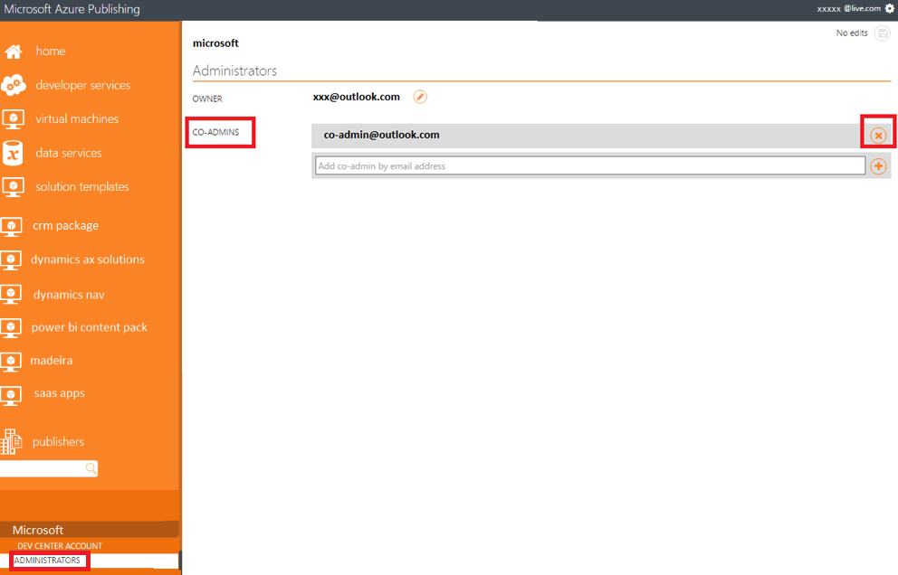

<properties
   pageTitle="Technischen Vorkenntnisse zum Erstellen eines Angebots für Azure Marketplace | Microsoft Azure"
   description="Grundlegendes zu den Anforderungen zum Erstellen und Bereitstellen eines Angebots zu Azure Marketplace für andere Benutzer erwerben."
   services="marketplace-publishing"
   documentationCenter=""
   authors="HannibalSII"
   manager="hascipio"
   editor=""/>

<tags
  ms.service="marketplace"
  ms.devlang="na"
  ms.topic="article"
  ms.tgt_pltfrm="Azure"
  ms.workload="na"
  ms.date="08/18/2016"
  ms.author="hascipio"/>

# Allgemeine Vorkenntnisse zum Erstellen eines Angebots für Azure Marketplace
Verstehen Sie die allgemeinen, Business Process-reduzierte erforderlichen Komponenten, die erforderlich sind, mit den Erstellungsprozess Angebot nach vorne verschieben.

## Stellen Sie sicher, dass Sie als Verkäufer mit Microsoft registriert sind
Detaillierte Informationen zum Registrieren eines Kontos Verkäufer mit Microsoft wechseln Sie zu [Konto erstellen und registrieren](marketplace-publishing-accounts-creation-registration.md).

- **Wenn Ihr Unternehmen bereits als Verkäufer in der Developer Center registriert ist und Sie ein neues Angebot, erstellen möchten** , und melden Sie sich die Veröffentlichung Portal mit der gleichen e-Mail-Id, mit welcher Developer Center Registrierung abgeschlossen ist. Dieser Schritt ist erforderlich, damit das Portal Developer Center und Veröffentlichung miteinander verknüpft sind.
- **Wenn Ihr Unternehmen bereits als Verkäufer in der Developer Center registriert ist und Sie zum Bearbeiten eines vorhandenen Angebots möchten,** und klicken Sie dann entweder Anmeldung bei der Veröffentlichung Portal mit dem Administratorkonto oder über ein Konto aus, die als co-Administrator in der Veröffentlichung hinzugefügt wird Portal. Schritte zum Hinzufügen eines Kontos co-Administrator wird unter angegeben.

## Schritte zum Hinzufügen eines co-Administrators in der Veröffentlichungsportal
Administratoren der Veröffentlichung Portal die anderen Mitgliedern des Unternehmens, an der Anwendung arbeiten, als co-Administrator in der Veröffentlichung hinzufügen Portal. **Unter der Voraussetzung, dass Sie der Administrator sind** die folgenden Angaben werden die Schritte zum Hinzufügen einer co-Administrator.

>[AZURE.NOTE] Für neue Benutzer, bevor Sie hinzufügen ein co-Administrators in der Veröffentlichung Portal, stellen Sie sicher, dass Sie mindestens eine Anwendung, in der Veröffentlichung erstellt haben Portal. Dies ist erforderlich, wie die Registerkarte **HERAUSGEBER** angezeigt werden, nur nach dem Erstellen der Veröffentlichung von mindestens eine Anwendung Portal.

1. Stellen Sie sicher, dass die co-Admin-e-Mail-Id eines Microsoft-account(MSA) ist. Wenn dies nicht der Fall ist, wird als eine MSA mit diesem [Link](https://signup.live.com/signup?uaid=0089f09ccae94043a0f07c2aaf928831&lic=1)registrieren.
2. Stellen Sie sicher, dass es mindestens eine Anwendung unter dem Administratorkonto ist, bevor Sie versuchen, eine co-Administrator hinzufügen
3. Nachdem die obigen Schritte fertig sind, melden Sie sich die Veröffentlichung Portal mit dem co-Admin-e-Mail-Id und klicken Sie dann auf Abmelden.
4. Jetzt melden Sie sich die Veröffentlichung mit der Admin-e-Mail-Id Portal.
5. Navigieren Sie zu Herausgeber-Ihr Konto -> auswählen > Administratoren -> Hinzufügen der co-Administrator (Screenshot unten)

    

6. Stellen Sie sicher, dass in den einzelnen Phasen des Veröffentlichungsprozesses (z. B. Developer Center, veröffentlichen Portals) bereitgestellten e-Mail-Ids für alle Kommunikation von Microsoft überwacht werden.
7. Vermeiden Sie für die Registrierung Developer Center mit einem Konto eine einzige Person zugeordnet. Dies wird für eine Einzelperson Abhängigkeit entfernen vorgeschlagen.
8. Wenn Sie Probleme mit der Registrierung Developer Center konfrontiert sind, wenden Sie sich bitte Stufen Sie ein Ticket mit diesen [Link](https://developer.microsoft.com/en-us/windows/support).

## Schritte zum Löschen eines co-Administrators für die Veröffentlichung Portal
**Unter der Voraussetzung, dass Sie der Administrator sind** die folgenden Angaben werden die Schritte zum Löschen einer co-Administrator.

1. Melden Sie sich die Veröffentlichung mit der Admin-e-Mail-Id Portal.
2. Navigieren Sie zu **Herausgeber** -Ihr Konto- **Administratoren**> auswählen > -> **Co-Administratoren**.
3. Klicken Sie auf die Schaltfläche **X** neben der gewünschten Vers löschen (Screenshot nachfolgenden) co-Administrator.

    

> [AZURE.IMPORTANT] Sie müssen nicht Firmeninformationen steuern und Bank abschließen, wenn Sie planen, veröffentlichen nur kostenlose (oder bringen Ihre eigenen Lizenz).

> Die Registrierung Unternehmen muss abgeschlossen sein, um anzufangen. Während der Mehrwertsteuer und Bank Informationen in das Konto Microsoft Developer Ihr Unternehmen arbeitet, die Entwickler können jedoch starten, arbeiten auf das Bild des virtuellen Computers im [Veröffentlichungsportal](https://publish.windowsazure.com)erste es zertifiziert, erstellen und Testen Sie es in das staging Azure-Umgebung. Sie benötigen die Genehmigung abgeschlossen Verkäufer Konto nur für den letzten Schritt zum Veröffentlichen Ihr Angebots zum Azure Marketplace.

## Erwerben eines "je nach Bedarf berechnet" Azure-Abonnements
Dies ist das Abonnement, das auf Ihre Bilder virtueller Computer erstellen und über die Bilder zu [Azure Marketplace](https://azure.microsoft.com/marketplace/)hand erfolgen soll. Wenn Sie nicht mit ein vorhandenes Abonnement verfügen, wenden Sie sich bitte melden Sie sich anschließend bei https://account.windowsazure.com/signup?offer=ms-azr-0003p.

## "Verkaufen von" Länder
> [AZURE.WARNING]
Ihrer Dienste auf dem Azure Marketplace verkaufen möchten, müssen Sie sicherstellen, dass Ihre registrierte Entität aus einem der Länder genehmigte "Verkaufen-von" ist. Diese Einschränkung ist Auszahlung und Besteuerung Gründen. Wir werden aktiv diese Liste der Länder in Kürze erweitern, also demnächst gefunden. Eine vollständige Liste finden Sie unter Abschnitt 1 b der [Azure Marketplace Teilnahme Richtlinien](http://go.microsoft.com/fwlink/?LinkID=526833).

## Nächste Schritte
Nachdem Sie die erforderlichen technischen Komponenten erfüllt, weiter sind Angebot spezifische technische Vorkenntnisse. Klicken Sie auf den Link zum Artikel für den jeweiligen Angebot ein, den Sie für die Azure Marketplace erstellen möchten.

- [Virtueller Computer technische erforderlichen Komponenten](marketplace-publishing-vm-image-creation-prerequisites.md)
- [Lösung Vorlage technische erforderlichen Komponenten](marketplace-publishing-solution-template-creation-prerequisites.md)

## Siehe auch
- [Erste Schritte: So veröffentlichen ein Angebots zu Azure Marketplace](marketplace-publishing-getting-started.md)
