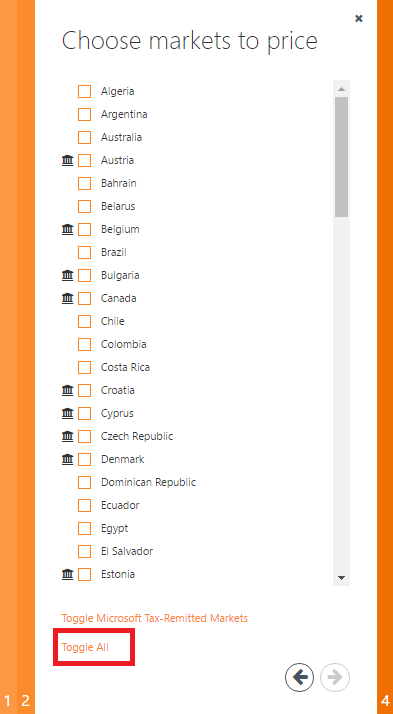

<properties
   pageTitle="Vorbereiten und Testen Sie Ihr Angebot für die Bereitstellung auf dem Azure Marketplace | Microsoft Azure"
   description="Detaillierte Informationen zum Bereitstellen marketing-Inhalt, Preisgestaltung Pläne konfigurieren und Testen Ihr Angebot vor der Bereitstellung zu Azure Marketplace."
   services="marketplace-publishing"
   documentationCenter=""
   authors="HannibalSII"
   manager="hascipio"
   editor=""/>

<tags
   ms.service="marketplace"
   ms.devlang="na"
   ms.topic="article"
   ms.tgt_pltfrm="Azure"
   ms.workload="na"
   ms.date="08/17/2016"
   ms.author="hascipio"/>

# Schließen Sie die Erstellung Angebot mit marketing-content
In diesem Schritt des Veröffentlichungsprozesses müssen Sie bestimmte marketing-Content und Details zu Ihrem Angebot und/oder SKUs in dem Azure Marketplace bereitstellen. Beispielsweise werden Sie eine Beschreibung der Ihres Produkts, Firmenlogos, Kurs Pläne, Details Pläne und andere Informationen, die erforderlich sind, um Ihr Angebot und/oder SKU zu Staging Pushbenachrichtigungen bereitstellen. Diese Informationen werden als marketing-Content im Portal Azure verwendet. Sie beginnen, dieses Verfahren im [Veröffentlichungsportal][link-pubportal].

## Schritt 1: Bereitstellen Sie Marketplace marketing-Inhalt
**Englisch ist der Standardwert, und nur unterstützte Sprache.** Stellen Sie sicher, dass alle Angaben, die in den Feldern nur auf Englisch verfügbar sind. Zu einem beliebigen Zeitpunkt, bis Sie auf Staging Pushbenachrichtigungen, kann alle Informationen bearbeitet werden.

  1. Wechseln Sie zu der Veröffentlichungsportal [https://publish.windowsazure.com](https://publish.windowsazure.com).
  2. Klicken Sie im Menü links auf der Registerkarte ' **Marketing** '.
  3. Klicken Sie im Hauptfenster angezeigt auf die Schaltfläche für **Englisch (USA)** .

  > [AZURE.IMPORTANT] Alle Felder müssen Einträge, einschließlich der Bilder für Sie zu Staging Pushbenachrichtigungen können.

### Details und Pläne
1.  Geben Sie den Titel Angebot (maximal 50 Zeichen), bieten Sie Zusammenfassung (maximal 100 Zeichen), bieten Sie lange Zusammenfassung (maximal 256 Zeichen), bieten Sie Beschreibung (maximal 1300-Zeichen), klicken Sie auf die Registerkarte **Details** logos
2.  Geben Sie Plan Titel (maximal 50 Zeichen), Plan-Zusammenfassung (maximal 100 Zeichen), Planen Sie Beschreibung (maximal 2000 Zeichen), klicken Sie auf der Registerkarte **Pläne** .

    >[AZURE.NOTE] Sie können den folgenden HTML-Tags Zusammenfassung, lange Zusammenfassung zu formatieren und Beschreibung der Angebot und Pläne verwenden. Die zulässige HTML-Tags sind h1, h2, h3, h4, h5, p, Ol, Ul, Müller, eine [Ziel | Href], sicherer, langen, b, ich.

3.  Geben Sie unter anbieten und planen Beschreibung duplizierten Text nicht.
4.  Geben Sie unter Titel und lange Sammelvorgang Angebot des Plans duplizierten Text nicht.
5.  Geben Sie unter Plan Titel duplizierten Text und bieten Sie Zusammenfassung nicht.
6.  Geben Sie für ein Angebot mit mehreren Pläne nicht identisch Plan Titel.
7.  Hochladen von Bildern der erforderlichen Spezifikationen (in der Veröffentlichungsportal erwähnt) im PNG-Format, eine für jede Größe.
8.  Stellen Sie sicher, dass die Logos führen Sie die unten aufgeführten Azure Marketplace-Logo-Richtlinien.

  

**Richtlinien für Azure Marketplace-Logo**

Alle Logos, die in der Veröffentlichungsportal hochgeladen sollte führen Sie die unter Richtlinien:

- Das Design Azure weist eine einfache Farbpalette. Halten Sie die Anzahl der primären und sekundären Farben auf Ihr Logo niedrig.
- Designfarben des Portals Azure sind weiß und Schwarz. Daher vermeiden Sie diese Farben als die Hintergrundfarbe für Ihre Logos. Verwenden Sie einige Farbe, die Ihre Logos Azure-Portal herausragender vornehmen möchten. Wir empfehlen einfache primär Farben aus. **Wenn Sie mit transparenten Hintergrund arbeiten, stellen Sie sicher, dass der Logos/Text sind nicht weiß oder Schwarz oder Blau.**
- Verwenden Sie einen Hintergrund mit Farbverlauf nicht auf das Logo ein.
- Platzieren von Text, auch Ihre Firma oder Marke Name, klicken Sie auf das Logo zu vermeiden. Das Aussehen und Verhalten des Logos Farbverläufe vermeiden und sollten 'flachen'.
- Das Logo sollte nicht gestreckt werden.
- Kleines Logo sollten Größe 40 X 40 px
- Logo mittlerer Größe 90 X 90 sollten px
- Großes Logo sollten Größe 115 X 115 px
- Logo und einer Höhe von Größe 255 X 115 sollten px
- Hero Logo sollten Größe 815 X 290 px

>[AZURE.NOTE] Das Logo Hero ist optional. Herausgeber kann nicht zu einem Hero Logo Hochladen auswählen. Jedoch einmal hochgeladene das Symbol Hero kann nicht gelöscht werden, aus der Veröffentlichung Portal. Zu diesem Zeitpunkt muss der Partner die Azure Marketplace-Richtlinien für Hero Symbole folgen.

  

**Weitere Richtlinien für das Hero-Logo-Symbol (optional)**

- Das Logo Hero ist optional. Herausgeber kann nicht zu einem Hero Logo Hochladen auswählen. **Jedoch einmal hochgeladene das Symbol Hero kann nicht gelöscht werden, aus der Veröffentlichung Portal. Zu diesem Zeitpunkt muss des Partners die Azure Marketplace-Richtlinien für Hero Symbole sonst, die das Angebot nicht genehmigt werden, werden, in der Herstellung folgen.**
- Den Anzeigenamen Publisher, Plan Titel und lange Sammelvorgang Angebot Leuchten in Weiß Schriftfarbe. Daher sollten Sie einen hellen Farbe im Hintergrund des Symbols Hero planmäßigen an. Schwarz, weißem und mit transparentem Hintergrund ist für Hero Symbole nicht zulässig.
- Der Anzeigename des Publisher aufgeführt planen, dass Titel, lange Sammelvorgang Angebot und die Schaltfläche erstellen programmgesteuert in einem Logo Hero eingebettet wurden, sobald das Angebot wird. Daher sollten Sie nicht Text eingeben, während Sie das Logo Hero entwerfen. Lassen Sie einfach leeren Bereich auf der rechten Seite, da der Text (d. h. Publisher Anzeigename, Plan Titel, lange Sammelvorgang Angebot) wird von uns über dort programmgesteuert enthalten sein. Der leere Bereich für den Text sollten 415 x 100 auf der rechten Seite (und es wird Versatz durch 370px von links).

  

### Links
Geben Sie auf der Registerkarte **Links** auf der linken Leiste Links mit Informationen, die Kunden helfen können. Geben Sie einen Namen und einen URL für jede Verknüpfung aus.

### Beispiel für Bilder (optional)
> [AZURE.NOTE]Ein Beispielbild einschließlich ist Schritt optional.
> Obwohl Sie mehrere Bilder in der Veröffentlichung hochladen können Portals, wird nur ein Bild (zufällig ausgewählten vom System) im Azure-Portal angezeigt. Es wird empfohlen, daher höchstens eine Stichprobe Bild hochladen.

Auf der Registerkarte **Bilder** im linken Menü upload ein neues Bild klicken Sie auf **ein neues Bild hochladen**. Wenn Sie ein vorhandenes Bild und sie ersetzen möchten, klicken Sie auf **Bild ersetzen**.

### Rechtliche Hinweise
Klicken Sie auf die Registerkarte **Rechtliche Hinweise** bieten Sie einen Link zu Ihrer Richtlinien/Nutzungsbedingungen. Geben Sie oder fügen Sie die Konditionen in großen **Nutzungsbedingungen** Feld. Die Zeichengrenze für die Vertragsbedingungen Bedienung beträgt 1.000.000 Zeichen.

**Hinweis:** Für virtuellen Computern zur Verfügung sobald eine Angebot-SKU im Portal Azure bereitgestellt wird können Sie die unten stehenden Felder nicht ändern:

- **Bezeichner anbieten:** [Veröffentlichen Portals-virtuellen Computern > -> Ihr Angebot -> Bilder virtueller Computer Registerkarte -> Bezeichner anbieten]
- **SKU-Kennung:** [Veröffentlichen Portals-virtuellen Computern >-Ihr Angebot -> auswählen > Registerkarte -> SKUs hinzufügen eine SKU]
- **Publisher Namespace:** [Veröffentlichen Portals-virtuellen Computern >-Exemplarische Vorgehensweise Registerkarte-erkennen Sie uns über Ihr Unternehmen (gefunden unter "Schritt 2 Registrieren Sie sich Ihr Unternehmen") -> > > Namespace Publisher-Namespace >]

Für virtuellen Computern zur Verfügung sobald die Angebot-SKU, in dem Azure Marketplace aufgeführt ist, können Sie die unten stehenden Felder nicht ändern:

- **Bezeichner anbieten:** [Veröffentlichen Portals-virtuellen Computern >-Ihr Angebot -> auswählen > Bilder virtueller Computer -> Bezeichner anbieten]
- **SKU-Kennung:** [Veröffentlichen Portals-virtuellen Computern >-Ihr Angebot -> auswählen > SKUs-Registerkarte > hinzufügen eine SKU]
- **Publisher Namespace:** [Veröffentlichen Portals-virtuellen Computern >-Exemplarische Vorgehensweise-Registerkarte > > Teilen Sie uns zu Ihr Unternehmen (gefunden unter Schritt 2 registrieren) Publisher Namespace-Namespace >]
- **Ports:** [Veröffentlichen Portals-virtuellen Computern > -> Ihr Angebot-virtuellen Computer Bilder > Registerkarte-Ports öffnen >]
- **Ändern der aufgeführten SKU(s) Preise**
- **Modell Ändern der aufgelisteten SKU(s) Abrechnung**
- **Entfernen von Regionen der aufgeführten SKU(s) Abrechnung**
- **Ändern die Daten Datenträgeranzahl der aufgeführten SKU(s)**

## Schritt 2: Richten Sie Ihrer Preise ein
### Preise Modelle
|Preise Modell |Beschreibung |
|---------------|------------------------------------------|
|Basis| Geringe monatliche Zinssatz gezahlt zum Zeitpunkt des Kaufs. z. B. $10 pro Monat.|
|Verbrauch (auch bekannt als Verwendung, Meter) | Bezahlen Sie pro verwenden, die von einem Herausgeber des Angebots definiert ist. Überschuss werden nicht pro Arbeitsplatz, pro Benutzer usw., definiert, wie gibt es kein Konzept von Dezimalbruch eines Benutzers oder Videofunktionen zeitgleiche ausführen. Auslastung wird durch den Partner stündlich angezeigt. Kunden ausgezahlt werden bei der der monatlichen Abrechnungszyklus im Gegensatz zum Vorfeld wie monatliche Pläne. |
|Kostenlose Testversion | Kunde möglicherweise kostenlos, verwenden Sie für eine begrenzte Zeit, und klicken Sie dann Kostensätze für normale danach. |
|Kostenlose Ebene | Plan ist immer kostenlos. |
| Migration (auch bekannt als Konvertierung oder Upgrade/Downgrade) des Plans | Konzept eines Benutzers Verschieben von deren aktuellen Plan in einen anderen zulässigen Plan; durch Partner definiert. |

**Preise Modelle nach Typ des Angebots sind verfügbar**

> [AZURE.IMPORTANT] Verfügbarkeit von bestimmter Preisgestaltung Modelle variieren je nach Typ des Angebots. Finden Sie in der folgenden Tabelle aus.

| | Nur Base | Verbrauch nur | Basis + Verbrauch |
|---|---|---|---|
| Abbildung des virtuellen Computern | Nein | Ja | Nein|
| Developer-Dienst | Ja | Ja | Ja |

### 2.1. Legen Sie Ihren Preisen virtueller Computer
Derzeit verfüge wir für virtuelle Maschinen, die folgenden **3 Typen von Abrechnung Modelle:**

- **Pro Stunde:** Kunden erhalten auf Grundlage der Sätzen festlegen, indem Sie den Herausgeber auf der Größe des virtuellen Computer pro Stunde Basis in Rechnung gestellt. Bei **stündlich Abrechnung** Modell der SKU werden der Gesamtpreis die Summe der Softwarekosten belastet vom Herausgeber sowie die Infrastrukturkosten belastet von Microsoft. Diese Gesamtkosten angezeigt wird, an den Kunden ein Preis pro Stunde und monatliche Beachten sie für das Kaufangebot werden (Siehe den Screenshot). **Publisher empfängt 80 % der Softwarekosten belastet, indem Sie diese an.** Daher stellen Sie die Berechnung entsprechend vor dem Einrichten für Ihre SKUs Preise.

    

- **Testversion:** Hierbei handelt es sich um eine andere Art des Modells stündlich. Hier der Kunden keine Softwarekosten für die ersten 30 days(Free) in Rechnung gestellt abrufen nach der Bereitstellung von den virtuellen Computer. Nach dem 30days erhalten sie auf Grundlage der Sätzen festlegen, indem Sie den Herausgeber im Modell stündlich Basis pro Stunde berechnet wurden.
- **Bringen-Your-Besitzer-Lizenz (BYOL):** Der Herausgeber verwalten Lizenzierung der Software des virtuellen Computers ausgeführt.

**Wichtige:** Nachdem die Angebot-SKU der Azure Marketplace angezeigt wird, können Sie die unten stehenden Felder nicht ändern.

- **Ändern der aufgeführten SKU(s) Preise**
- **Modell Ändern der aufgelisteten SKU(s) Abrechnung**
- **Entfernen von Regionen der aufgeführten SKU(s) Abrechnung**
- **Ändern die Daten Datenträgeranzahl der aufgeführten SKU(s)**
- **Bezeichner anbieten:** [Veröffentlichen Portals-virtuellen Computern >-Ihr Angebot -> auswählen > Bilder virtueller Computer -> Bezeichner anbieten]
- **SKU-Kennung:** [Veröffentlichen Portals-virtuellen Computern >-Ihr Angebot -> auswählen > Registerkarte -> SKUs hinzufügen eine SKU]
- **Publisher Namespace:** [Veröffentlichen Portals-virtuellen Computern >-Exemplarische Vorgehensweise-Registerkarte > > Teilen Sie uns zu Ihr Unternehmen (gefunden unter Schritt 2 registrieren) Publisher Namespace-Namespace >]
- **Ports:** [Veröffentlichen Portals-virtuellen Computern > -> Ihr Angebot-virtuellen Computer Bilder > Registerkarte-Ports öffnen >]

### "Verkaufen an" Länder der SKU
Sie müssen genau überlegen, wo Sie Ihre SKUs zur Verfügung stellen. Einige Länder klassifiziert werden als "Microsoft Zuständigkeit" und andere klassifiziert werden als "ISV Zuständigkeit".

- "Microsoft Zuständigkeit" Länder Microsoft sammelt Steuern von Kunden und steuern (verweist), die der Regierung auszahlt.
- In "ISV einreichen" Ländern für Partner steuern Kunden sammeln und bezahlen Steuern der Regierung verantwortlich sind. Wenn Sie in "ISV einreichen" Ländern verkaufen entscheiden, müssen Sie die Funktion zum Berechnen und bezahlen steuern in Länder, die Sie auswählen verfügen.

>[AZURE.NOTE] Ihrer SKU sind nicht in den Ländern verfügbar, es sei denn, Sie deren Preise in der [Veröffentlichung Portal](https://publish.windowsazure.com)festlegen. Leitfäden zum Abrufen oder Festlegen der Preise stündlich und BYOL SKUs wird unten angezeigt.

### 2.1.1 so einrichten, die Preise stündlich Modell für eine SKU
Führen Sie die folgenden Schritte aus, um stündlich Modell für eine SKU Preise einrichten:

1.  Melden Sie sich auf das [Portal veröffentlichen](https://publish.windowsazure.com).
2.  Navigieren Sie zur Registerkarte **virtuellen Computern** , und wählen Sie Ihr Angebot aus.
3.  Klicken Sie im Menü der linken Seite auf die Registerkarte **SKUS** .
4.  Stellen Sie sicher, dass die SKU als "Stündlich Abrechnung Model" markiert ist. Wenn dies nicht der Fall ist, klicken Sie dann auf die Schaltfläche **Bearbeiten** des Modells wiederherstellen. Ein Fenster wird geöffnet. Deaktivieren Sie das Kontrollkästchen 'Abrechnung und Lizenzierung erfolgt extern aus Azure (QuickInfos wieder abrufen Ihrer eigenen Lizenz)' und speichern Sie die Änderungen zu.
5.  Wenn Sie die kostenlose Testversion für den ersten 30days von SKU Bereitstellung aktivieren möchten, wählen Sie dann der Option "Einen Monat" für die Frage "Ist eine kostenlose Testversion zur Verfügung?" Wählen Sie andernfalls die Option "Keine Testversion" ein. Führen Sie jetzt die folgenden Schritte aus.
6.  Wählen Sie im Menü linke Seite klicken Sie auf der Registerkarte **Preise** .
7.  Wählen Sie Ihre Basis Region ein.

    

8. Legen Sie die Preise für alle Kerne. **Sie müssen für alle Kerne von einer SKU Preis bereitstellen, auch wenn Ihre SKU nicht unterstützt wird.**

    

9.  Die Preise für die anderen Regionen manuell festlegen oder Sie können den AUTOPRICE-Assistenten verwenden, die Preise anderer Regionen basierend auf der Basis Region festlegen. Verwenden des AUTOPRICE-Assistenten klicken Sie auf die Schaltfläche **AUTOPRICE anderen Märkten basierend auf Preisen IN Vereinigte Staaten.** **Hinweis:** Die Beschriftung der Schaltfläche kann sich je nach der Region unterscheiden, die Sie ausgewählt haben. Da wir Vereinigten Staaten beim Erstellen dieses Dokument markiert haben, wird also die Schaltfläche mit der Bezeichnung wie "Automatische Preis anderen Märkten basierend auf den Preisen in den Vereinigten Staaten" in den folgenden Screenshot.

    

10. Der Assistent für automatische Kurs wird geöffnet. Die erste Seite wird für Basis Markt angezeigt. Stellen Sie einen Abschnitt, und wechseln Sie zur nächsten Seite, indem Sie auf die Schaltfläche "->".

    

11. Option zum Auswählen der Adern und Pläne wird auf der Seite 2 angezeigt. Wählen Sie die gewünschten Pläne aus, und klicken Sie auf die Schaltfläche "->". **Meter** oder Sie können manuell aktivieren Sie das Kontrollkästchen, und klicken Sie auf die Schaltfläche **Umschalten alles** , um die **Dienstpläne** auszuwählen. **Sie müssen für alle Kerne von einer SKU Preis bereitstellen, auch wenn Ihre SKU nicht unterstützt wird.** Daher sicherstellen Sie, dass alle die Core Größen ausgewählt sind.

    

12. Seite 3 zeigt die Märkten/Regionen zurück. Klicken Sie auf die Schaltfläche **Alles Umschaltfläche** um alle Bereiche auswählen oder manuell die Kontrollkästchen für die Region. Klicken Sie auf die Schaltfläche "->", um zur nächsten Seite zu wechseln. **Hinweis:** Microsoft steuern eingereicht Länder sind durch ein Haus wie Symbol gekennzeichnet. Weitere Informationen hierzu finden Sie im Abschnitt "Verkaufen an" Länder der SKU dieser Seite.

    

13. Seite 4 zeigt die Exchange-Sätze. Klicken Sie auf die Schaltfläche Fertig stellen, um die Schritte ausführen.

### 2.1.2 so BYOL Modell für eine SKU Preise für die Einrichtung
Führen Sie die folgenden Schritte aus, BYOL Modell für eine SKU Preise einrichten:

1.  Melden Sie sich auf das [Portal veröffentlichen](https://publish.windowsazure.com).
2.  Navigieren Sie zur Registerkarte **virtuellen Computern** , und wählen Sie Ihr Angebot aus.
3.  Klicken Sie im Menü der linken Seite auf die Registerkarte **SKUS** .
4.  Stellen Sie sicher, dass die SKU wie "eigene Lizenz SKU bringen" gekennzeichnet ist. Wenn dies nicht der Fall ist, klicken Sie dann auf die Schaltfläche Bearbeiten des Modells wiederherstellen. Ein Fenster wird geöffnet. Aktivieren Sie das Kontrollkästchen 'Abrechnung und Lizenzierung erfolgt extern aus Azure (QuickInfos wieder abrufen Ihrer eigenen Lizenz)' und speichern Sie die Änderungen zu.

    

5.  Wählen Sie im Menü linke Seite klicken Sie auf der Registerkarte **Preise** .
6.  Wählen Sie Ihre Region Basis und die SKU zur Verfügung stellen in der Region durch Aktivieren des Kontrollkästchens anhand der SKU unter dem Abschnitt EXTERNALLY-LICENSED (BYOL) SKU Verfügbarkeit (Siehe den Screenshot).

    

7.  Verfügbarmachen der SKUs in den anderen Regionen manuell oder können Sie für diesen Zweck des AUTOPRICE-Assistenten. Verweisen auf die Punkte #9 bis #13 (das wird erläutert, die Verwendung des Assistenten AUTOPRICE) im Abschnitt **"2.1.1 so eingerichtet stündlich Preise Modell für eine SKU"** dieser Seite.

### 2.2. Festlegen der geltenden Entwicklertools
Pläne können eine beliebige Kombination von Base + Ernährung wobei Basis der monatlichen Preis und veralteten wird die Bezahlung pro Einsatz Preis sein. (Siehe unten für weitere Details.)

**Beispiel:**  Contoso Developer Service-Angebot

| Planen | Kurs | Enthält | Migrationspfad |
|-------|------|-------|-------|
|Kostenlose|0 $/ Monat|Grundfunktionen.|Migrieren von können zu einem beliebigen anderen plan|
|Bronze|$10 pro Monat|Grundfunktionen und ein Kontingent von 1.000 des Features "X".|Migrieren von können für Bronze Plus, Silber und Gold-Pläne|
|Bronze Pluszeichen|Kostenlosen Testversion: $0/ Monat + $0/meter01 |Grundfunktionen und ein Kontingent von 10.000 des Features "X".  Sobald die Funktion X Kontingent verwendet wird, kann der Kunden pro Einsatz über meter01 bezahlen.|Migrieren von können für Silber Plus und Gold-Pläne|
|Bronze Pluszeichen| Periode bezahlt (auch bekannt als kostenlose Testversion abgelaufen): $10 pro Monat + $ 0,05/meter01|Grundfunktionen und ein Kontingent von 10.000 des Features "X".  Sobald die Funktion X Kontingent verwendet wird, kann der Kunden pro Einsatz über meter01 bezahlen.|Migrieren von können für Silber Plus und Gold-Pläne|
|Silber|$ 0,15/meter01|Der Kunden kann pro Einsatz über meter01, Zahlen, die für die Funktion X ist.|Migrieren von können für Bronze- und Gold-Pläne|
|Silber Pluszeichen|20 Euro/Monat + $ 0,15/meter01 + 0,01 US-Dollar/meter02|Grundfunktionen und ein Kontingent von der Funktion X 10.000 und 100 des Features "Y".  Nachdem das Feature "X" Kontingent verwendet wird, kann der Kunden pro Einsatz über meter01 bezahlen.  Nachdem das Feature "Y" Kontingent verwendet wird, kann der Kunden pro Einsatz über meter02 bezahlen.|Migrieren von können für Bronze Plus und Gold-Pläne|
|Gold|$1.000 pro Monat|Speicherkontingent von der Funktion X, 1.000 Features Y-und 10.000 und unbegrenzte Features Z.|Migrieren von können für alle Pläne außer frei|

## Schritt 3: Bieten Unterstützung Informationen
Wenden Sie sich dienen nur interne Kommunikation zwischen dem Partner und Microsoft. Die Support-URL wird an das Ende Kunden verfügbar sein.

1.  Wechseln Sie zur **Unterstützung** Überschrift klicken Sie auf der linken Seite des der Veröffentlichungsportal aus.
2.  Geben Sie Informationen unter **Engineering Kontakt**aus.
3.  Geben Sie Informationen unter **Kundensupport**aus. Wenn Sie nur e-Mail-Support bereitstellen, geben Sie eine Telefonnummer-platzhalterprodukt, und Ihre bereitgestellten e-Mail wird stattdessen verwendet werden.
4.  Geben Sie den Support-URL ein.

## Schritt 4: Auswählen der Azure Marketplace-Kategorien
Die Registerkarte **Kategorien** enthält ein Array von Auswahl. Ihr Angebot möglicherweise fallen unter diese, und Sie können bis zu fünf Kategorien auswählen.

## Wie Ihrem Marketing angezeigt wird
Es folgt eine Detailansicht wie das Angebot marketing-Informationen auf der [Azure Marketplace-Website](https://azure.microsoft.com/marketplace/) und der [Azure-Portal](https://portal.azure.com)verwendet wird.

### Azure Marketplace-website

*Liste der Angebote auf der Website Azure Marketplace*

*Angebotsdetails Beschreibung der Azure Marketplace-Website*

*Anbieten von Beschreibung Preise Details auf der Azure Marketplace-website*

### Azure-Portal

*Auflistung von Angeboten Azure-Portal*

*Angebotsdetails Beschreibung der Azure-Portal*

## Nächste Schritte
Nachdem Sie nun der Inhalt Marketplace geladen wird, lassen Sie uns nach vorne verschieben mit testen Ihr Angebot in staging Jedoch müssen Sie den entsprechenden Angebot Typ aus der Liste unter, auswählen, wie Schritte nach Typ Angebot variieren.

- [Testen Sie Ihr Angebot virtueller Computer Staging](marketplace-publishing-vm-image-test-in-staging.md)
- [Testen Sie Ihre Lösung Vorlage Angebot Staging](marketplace-publishing-solution-template-test-in-staging.md)

## Siehe auch

- [Erste Schritte: So veröffentlichen ein Angebots zu Azure Marketplace](marketplace-publishing-getting-started.md)

[img-map-acom]:media/marketplace-publishing-push-to-staging/pubportal-mapping-acom.jpg
[img-map-portal]:media/marketplace-publishing-push-to-staging/pubportal-mapping-azure-portal.jpg
[img-map-link]:media/marketplace-publishing-push-to-staging/marketing-content-guide-links.jpg
[img-map-logo]:media/marketplace-publishing-push-to-staging/marketing-content-guide-logos.jpg
[img-map-title]:media/marketplace-publishing-push-to-staging/marketing-content-guide-publisher-offer.png

[link-pubportal]:https://publish.windowsazure.com
[link-push-to-production]:marketplace-publishing-push-to-production.md
