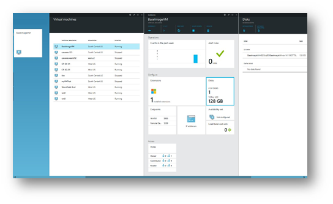
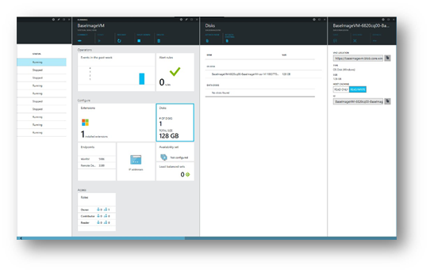
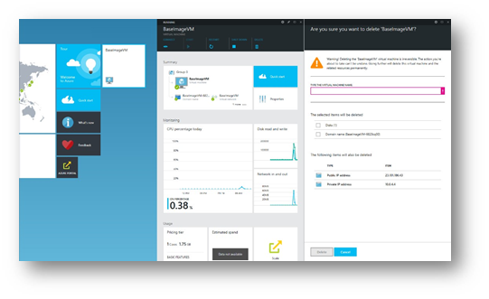
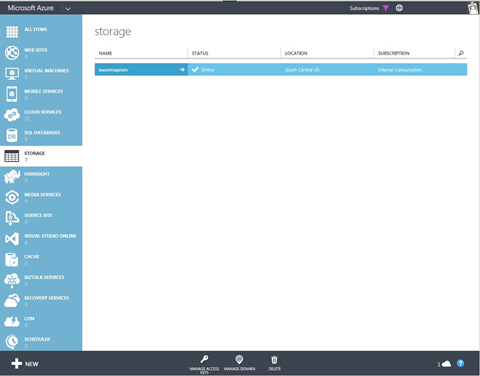
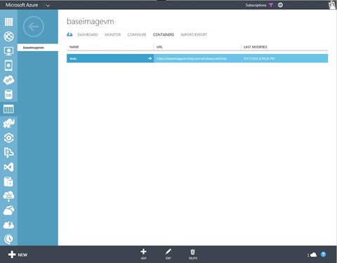
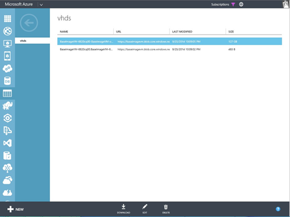
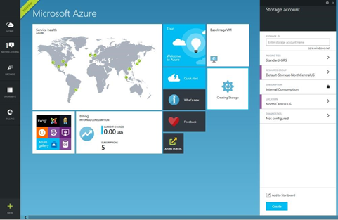
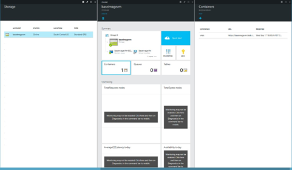
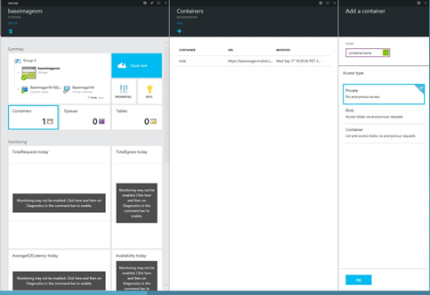

<properties
   pageTitle="Erstellen ein Bild der lokalen virtuellen Computern von Azure Marketplace | Microsoft Azure"
   description="Grundlegendes zu, und führen Sie die Schritte zum Erstellen einer lokalen virtuellen Computer Bild und Bereitstellen für Azure Marketplace für andere erwerben."
   services="marketplace-publishing"
   documentationCenter=""
   authors="HannibalSII"
   manager="hascipio"
   editor=""/>

<tags
  ms.service="marketplace"
  ms.devlang="na"
  ms.topic="article"
  ms.tgt_pltfrm="Azure"
  ms.workload="na"
  ms.date="04/29/2016"
  ms.author="hascipio; v-divte"/>

# Entwickeln einer lokalen virtuellen Computern Abbildung von Azure Marketplace
Es wird dringend empfohlen, mithilfe des Remote Desktop Protocol Azure virtuellen Festplatten (virtuelle Festplatten) direkt in der Cloud zu entwickeln. Wenn Sie müssen, ist es jedoch möglich, eine virtuelle Festplatte herunterladen und sie mithilfe der lokalen Infrastruktur entwickeln.  

Für die lokale Entwicklung müssen Sie das Betriebssystem virtuelle Festplatte, der den erstellten virtuellen Computer herunterladen. Diese Schritte würde als Teil der Schritt 3.3, über stattfinden.  

## Ein Festplattenabbild virtuelle herunterladen
### Suchen Sie nach einem Blob-URL
Um die virtuelle Festplatte herunterladen möchten, suchen Sie zuerst die Blob-URL für den Datenträger Betriebssystem aus.

Suchen Sie das neue [Microsoft Azure-Portal](https://portal.azure.com)die BLOB-URL ein:

1.  Wechseln Sie zur **Suche** > **virtuellen Computern**, und wählen Sie dann den bereitgestellten virtuellen Computer.
2.  Aktivieren Sie unter **Konfigurieren**die Kachel **Datenträger** , die wodurch das Blade Datenträger geöffnet wird ein.

  

3.  Wählen Sie **OS Datenträger**, die ein anderes Blade wird, die Festplatte Eigenschaften geöffnet, einschließlich der Position virtuelle Festplatte angezeigt werden.
4.  Kopieren Sie diese Blob-URL ein.

  

5.  Löschen Sie den bereitgestellten virtuellen Computer jetzt, ohne die zugrunde liegende Datenträger löschen. Sie können auch den virtuellen Computer, anstatt ihn zu löschen beenden. Heruntergeladen Sie das Betriebssystem virtuelle Festplatte kann nicht werden, wenn der virtuellen Computer ausgeführt wird.

  

### Eine virtuelle Festplatte herunterladen
Nachdem Sie die Blob-URL kennen, können Sie die virtuelle Festplatte mithilfe der [Azure-Portal](http://manage.windowsazure.com/) oder PowerShell herunterladen.  
> [AZURE.NOTE] Zum Zeitpunkt der Erstellung des Leitfadens steht die Funktionalität eine virtuellen Festplatte herunterladen noch nicht in das neue Microsoft Azure-Portal präsentieren.  

**Herunterladen des Betriebssystems virtuelle Festplatte über das aktuelle [Azure-portal](http://manage.windowsazure.com/)**

1.  Melden Sie sich bei der Azure-Portal, wenn Sie nicht bereits getan haben.
2.  Klicken Sie auf die Registerkarte **Speicher** .
3.  Wählen Sie das Speicherkonto, in dem die virtuelle Festplatte gespeichert ist.

  

4.  Dadurch werden die Eigenschaften von Benutzerkonten. Wählen Sie die Registerkarte **Container** aus.

  

5.  Markieren Sie den Container, in dem die virtuelle Festplatte gespeichert ist. Standardmäßig wird bei der Erstellung von im Portal die virtuelle Festplatte in einem Container virtuellen Festplatten gespeichert.

  

6.  Wählen Sie das richtige Betriebssystem virtuelle Festplatte durch Vergleich der URL für das Element, das Sie gespeichert haben.
7.  Klicken Sie auf **herunterladen**.

  

### Herunterladen einer virtuellen mithilfe der PowerShell
Zusätzlich zur Verwendung des Azure-Portals an, können Sie das Cmdlet [Speichern-AzureVhd](http://msdn.microsoft.com/library/dn495297.aspx) das Betriebssystem virtuelle Festplatte herunterladen.

        Save-AzureVhd –Source <storageURIOfVhd> `
        -LocalFilePath <diskLocationOnWorkstation> `
        -StorageKey <keyForStorageAccount>
Beispielsweise speichern AzureVhd-Quelle "https://baseimagevm.blob.core.windows.net/vhds/BaseImageVM-6820cq00-BaseImageVM-os-1411003770191.vhd" - LocalFilePath "C:\Users\Administrator\Desktop\baseimagevm.vhd" - StorageKey<String>

> [AZURE.NOTE] **Speichern-AzureVhd** verfügt auch über die Option **NumberOfThreads** , die verwendet werden kann, um Parallelism um optimal nutzen der verfügbaren Bandbreite für den Download zu erhöhen.

## Hochladen von virtuellen Festplatten mit einer Firma Azure-Speicher
Wenn Sie Ihre virtuellen Festplatten lokal vorbereitet haben, müssen Sie diese in einem Speicherkonto in Azure hochladen. Dieser Schritt erfolgt, nach dem Erstellen der virtuellen Festplatte lokale, aber davor Erhalt einer Zertifizierung Bild virtueller Computer.

### Erstellen eines Speicher-Konto und container
Es empfiehlt sich, dass virtuelle Festplatten in ein Speicherkonto in einem Bereich, in den Vereinigten Staaten hochgeladen werden. Alle virtuellen Festplatten für eine einzelne SKU sollte in einem einzelnen Container innerhalb einer einzelnen Speicherkonto platziert werden.

Um ein Speicherkonto zu erstellen, können Sie im [Microsoft Azure-Portal](https://portal.azure.com/), PowerShell oder der Linux Befehlszeile Tool verwenden.  

**Erstellen eines Speicher-Kontos vom Microsoft Azure-portal**

1.  Klicken Sie auf **neu**.
2.  Wählen Sie **Speicherplatz**aus.
3.  Füllen Sie im Feld Kontoname Speicher, und wählen Sie dann einen Speicherort aus.

  

4.  Klicken Sie auf **Erstellen**.
5.  Das Blade für das Speicherkonto erstellten sollte geöffnet sein. Wählen Sie andernfalls **Durchsuchen** > **Speicher-Konten**. Wählen Sie auf das Konto Blade Speicher das erstellte Speicherkonto ein.
6.  Wählen Sie **Container**aus.

   

7.  Wählen Sie in den Container Blade **Hinzufügen**aus, und geben Sie einen Containernamen und der Berechtigungen für Container. Wählen Sie **als "Privat"** Container Berechtigungen aus.

> [AZURE.TIP] Es empfiehlt sich, dass Sie einen Container pro SKU, die Sie planen erstellen, veröffentlichen.

  

### Erstellen Sie ein Speicherkonto mithilfe der PowerShell
Erstellen Sie mithilfe der PowerShell, ein Speicherkonto mithilfe des Cmdlets [New-AzureStorageAccount](http://msdn.microsoft.com/library/dn495115.aspx) .

        New-AzureStorageAccount -StorageAccountName “mystorageaccount” -Location “West US”

Dann können Sie einen Container in diesem Storage-Konto erstellen, mithilfe des Cmdlets [NewAzureStorageContainer](http://msdn.microsoft.com/library/dn495291.aspx) .

        New-AzureStorageContainer -Name “containername” -Permission “Off”

> [AZURE.NOTE] Diese Befehle wird davon ausgegangen, dass im aktuellen Kontext der Speicher Konto bereits in PowerShell festgelegt wurde.   Weitere Informationen zum Einrichten der PowerShell finden Sie unter [Einrichten von Azure PowerShell](marketplace-publishing-powershell-setup.md) .
 
### Erstellen eines Speicher-Kontos mit dem Befehlszeile Tool für Mac und Linux
Erstellen Sie auf [Linux Befehlszeile Tool](../virtual-machines/virtual-machines-linux-cli-manage.md)ein Speicherkonto wie folgt ein.

        azure storage account create mystorageaccount --location "West US"

Erstellen eines Containers wie folgt aus.

        azure storage container create containername --account-name mystorageaccount --accountkey <accountKey>

## Hochladen der virtuellen Festplatte
Nachdem das Speicherkonto und Container erstellt wurden, können Sie Ihre vorbereiteten virtuellen Festplatten hochladen. Sie können PowerShell, die Befehlszeile Linux-Tool oder andere Tools zum Projektmanagement Azure-Speicher.

### Hochladen einer virtuellen über PowerShell
Verwenden Sie das Cmdlet [AzureVhd hinzufügen](http://msdn.microsoft.com/library/dn495173.aspx) .

        Add-AzureVhd –Destination “http://mystorageaccount.blob.core.windows.net/containername/vmsku.vhd” -LocalFilePath “C:\Users\Administrator\Desktop\vmsku.vhd”

### Hochladen der virtuellen Festplatte mithilfe des Befehlszeilen Tools für Mac und Linux
Mit dem [Linux Befehlszeile Tool](../virtual-machines-command-line-tools.md), verwenden Sie die folgenden: Azure-virtuellen Computer Bild erstellt <image name> – Speicherort <Location of the data center> – OS Linux<LocationOfLocalVHD>

## Siehe auch
- [Erstellen ein Bild von virtuellen Computern von Marketplace](marketplace-publishing-vm-image-creation.md)
- [Einrichten von Azure PowerShell](marketplace-publishing-powershell-setup.md)
