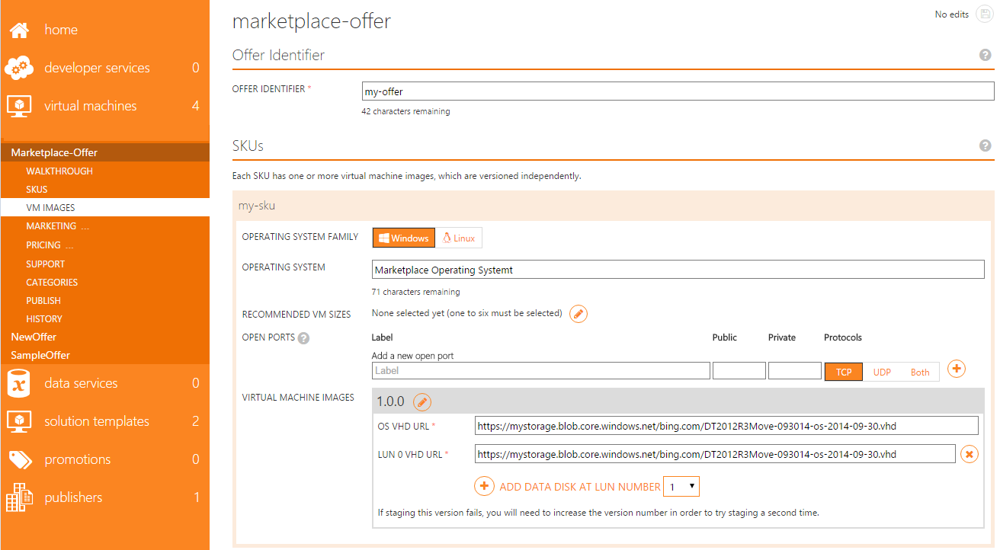

<properties
   pageTitle="Erstellen ein Bild von virtuellen Computern von Azure Marketplace | Microsoft Azure"
   description="Wenn Sie ausführliche Anweisungen zum Erstellen eines Bilds virtuellen Computern von Azure Marketplace für andere Benutzer erwerben."
   services="Azure Marketplace"
   documentationCenter=""
   authors="HannibalSII"
   manager="hascipio"
   editor=""/>

<tags
   ms.service="marketplace"
   ms.devlang="na"
   ms.topic="article"
   ms.tgt_pltfrm="Azure"
   ms.workload="na"
   ms.date="07/13/2016"
   ms.author="hascipio; v-divte"/>

# Leitfaden zum Erstellen eines Bilds virtuellen Computern von Azure Marketplace

In diesem Artikel, **Schritt2**, führt Sie durch die virtuellen Festplatten (virtuelle Festplatten), die Sie zu Azure Marketplace bereitstellen vorbereiten. Ihre virtuellen Festplatten sind die Grundlage für die gewünschte SKU. Der Vorgang unterscheidet sich je nachdem, ob Sie eine Linux oder Windows-basierten SKU bereitstellen. In diesem Artikel werden die beiden Szenarien behandelt. Dieses Verfahren kann parallel mit der [Erstellung des Kontos und Registrierung]ausgeführt werden[link-acct-creation].

## 1. definieren Sie 1. Angebote und SKUs

In diesem Abschnitt lernen, wie Sie diese Angebote und ihre zugeordneten SKUs definieren.

Ein Angebot ist "Parent" für alle zugehörigen SKU. Sie können mehrere Angebote haben. Wie Sie Ihre Angebote strukturieren doch liegt bei Ihnen. Wenn ein Angebot ans Staging verschoben wird, wird es zusammen mit allen zugehörigen SKU abgelegt. Überlegen Sie Ihre SKU Bezeichnern, da sie in der URL angezeigt werden:

- Azure.com: http://azure.microsoft.com/marketplace/partners/ {PartnerNamespace} / {OfferIdentifier}-{SKUidentifier}

- Vorschau der Azure-Portal: https://portal.azure.com/#gallery/ {PublisherNamespace}. {OfferIdentifier} {SKUIDdentifier}  

Eine SKU wird kommerzielle Name für ein Bild virtueller Computer. Ein virtueller Computer Bild enthält eine Betriebssystem-Datenträger und 0 (null) oder mehr Datenfestplatten. Es ist im Wesentlichen die vollständige Speicher Profil für einen virtuellen Computer. Eine virtuelle Festplatte ist pro Datenträger erforderlich. Daten auch leere Datenträger erfordern eine virtuelle Festplatte erstellt werden.

Unabhängig davon, welches Betriebssystem Sie verwenden, fügen Sie nur die Mindestanzahl der Daten Datenträger durch die SKU erforderlich. Kunden können Datenträger, die zum Zeitpunkt der Bereitstellung eines Bilds gehören nicht entfernen jedoch immer hinzufügen Datenträger während oder nach der Bereitstellung, wenn diese gebraucht.

>[AZURE.IMPORTANT] **Ändern Sie die Zahl in eine neue Version des Bilds Laufwerke nicht.** Wenn Sie Daten Datenträger in das Bild neu konfiguriert werden müssen, definieren Sie einen neuen SKU. Veröffentlichen einer neuen Bildversion mit anderen Datenträger zählt haben die möglicherweise abgeschnitten werden neue Bereitstellung das neue Bildversion in Fällen der automatische Skalierung, automatische Bereitstellung von Lösungen durch Cloud-Vorlagen und anderen Szenarien basiert auf.

### 1.1 Hinzufügen eines Angebots

1. Melden Sie sich bei der [Veröffentlichungsportal] [ link-pubportal] mit Ihrem Verkäuferkonto.
2. Wählen Sie die Registerkarte **virtuellen Computern** der Veröffentlichungsportal aus. Geben Sie in das Eintragsfeld dazu aufgefordert werden den Namen Ihres Angebots aus. Der Namen des Angebots ist normalerweise der Name des Produkts oder der Dienst, den Sie planen, in dem Azure Marketplace verkaufen.
3. Wählen Sie auf **Erstellen**.

### 1.2 Definieren einer SKUs
Nachdem Sie ein Angebot hinzugefügt haben, müssen Sie definieren und Ihre SKUs zu identifizieren. Sie können mehrere Angebote haben, und sind die einzelnen anbieten kann mehrere Artikel darunter. Wenn ein Angebot ans Staging verschoben wird, wird es zusammen mit allen zugehörigen SKU abgelegt.

1. **Fügen Sie eine SKU hinzu.** Die SKU erfordert eine ID, die in der URL verwendet wird. Der Bezeichner muss in Ihrem Profil für die Veröffentlichung eindeutig sein, doch es gibt keine Risiken der Bezeichner Konflikte mit anderen Herausgeber.

    > [AZURE.NOTE] Das Angebot und SKU Bezeichner werden die Angebots-URL auf der Marketplace angezeigt.

2. **Fügen Sie eine Zusammenfassung Beschreibung für die gewünschte SKU hinzu.** Zusammenfassung Beschreibungen sind für Kunden, sichtbar, sodass Sie diese einfach lesbaren erstellen sollten. Diese Informationen muss nicht gesperrt werden, bis der Phase "Pushbenachrichtigungen zu Staging". Bis zu diesem Zeitpunkt können Sie kostenlose, um ihn zu bearbeiten.
3. Wenn Sie Windows-basiertem SKUs verwenden, folgen Sie den vorgeschlagenen Hyperlinks zum Erfassen der genehmigten Versionen von Windows Server aus.

## 2. erstellen Sie eine Azure-kompatiblen virtuelle Festplatte (Linux-basiert)
In diesem Abschnitt Schwerpunkt auf bewährte Methoden zum Erstellen eines Bilds virtuellen Linux-basierten Computer von Azure Marketplace. Eine schrittweise Anleitung, finden Sie in der folgenden Dokumentation: [Erstellen und Hochladen einer virtuellen Festplatte, die das Betriebssystem Linux enthält,](../virtual-machines/virtual-machines-linux-classic-create-upload-vhd.md)

## 3. erstellen Sie eine Azure-kompatiblen virtuelle Festplatte (Windows-basiert)
In diesem Abschnitt Schwerpunkt auf die Schritte zum Erstellen einer SKUs ausgehend von Windows Server von Azure Marketplace.

### 3.1 Stellen Sie sicher, dass Sie die richtigen Basis virtuellen Festplatten arbeiten
Das Betriebssystem virtuelle Festplatte für Ihr Bild virtueller Computer muss auf Basis Azure genehmigte-Image basieren, die Windows Server oder SQL Server enthält.

Beginnen möchten, erstellen einen virtuellen Computer eine der folgenden Bilder, die [Microsoft Azure-Portal]am[link-azure-portal]:

- WindowsServer ([2012 R2 Datacenter][link-datactr-2012-r2], [2012 Datacenter][link-datactr-2012], [2008 R2 SP1][link-datactr-2008-r2])
- SQLServer 2014 ([Enterprise][link-sql-2014-ent], [Standard][link-sql-2014-std], [Web][link-sql-2014-web])
- SQL Server 2012 SP2 ([Enterprise][link-sql-2012-ent], [Standard][link-sql-2012-std], [Web][link-sql-2012-web])

Diese Links können auch in der Veröffentlichungsportal unter der Seite SKU gefunden werden.

> [AZURE.TIP] Wenn Sie die aktuellen Azure-Portal oder PowerShell verwenden, werden Windows Server Bilder auf 8 September 2014 veröffentlichten und höher zugelassen.

### 3,2 Erstellen Sie Ihrer Windows-basiertem virtueller Computer
Vom Microsoft Azure-Portal können Sie Ihre virtuellen Computer basierend auf einer genehmigten Basis-Image in wenigen einfachen Schritten erstellen. Im folgenden finden eine Übersicht über den Prozess:

1. Wählen Sie auf der Seite Basis-Image **Erstellen von virtuellen Computern** an das neue [Microsoft Azure-Portal]geleitet werden[link-azure-portal].

    ![Zeichnung][img-acom-1]

2. Melden Sie sich mit dem Portal mit dem Microsoft-Konto und das Kennwort für das Azure-Abonnement, die, das Sie verwenden möchten.
3. Folgen Sie den Anweisungen zum Erstellen eines virtuellen Computers mithilfe der Basis-Image, die Sie ausgewählt haben. Sie müssen eine Host Name (Name des Computers), (registriert als Administrator) Benutzernamen und Kennwort für den virtuellen Computer bereit.

    ![Zeichnung][img-portal-vm-create]

4. Wählen Sie die Größe der virtuellen Computer bereitgestellt:

    ein.  Wenn Sie beabsichtigen, die virtuelle Festplatte lokalen entwickeln, wird die Größe spielt keine Rolle. Erwägen Sie eine kleinere der virtueller Computer.

    b.  Wenn Sie das Bild in Azure entwickeln möchten, sollten Sie mithilfe einer der empfohlenen virtueller Computer Größen für das ausgewählte Bild.

    c.  Preisinformationen, finden Sie in der **Ebenen Preise empfohlen** Ansichtsauswahl auf das Portal angezeigt. Es werden die drei empfohlenen Größen vom Herausgeber bereitgestellten bereitgestellt. (In diesem Fall ist der Herausgeber Microsoft.)

    ![Zeichnung][img-portal-vm-size]

5. Festlegen von Eigenschaften:

    ein.  Für eine schnelle Installation lassen Sie die Standardwerte für die Eigenschaften unter **Optionale Konfiguration** und **Ressourcengruppe**.

    b.  Klicken Sie unter **Speicher-Konto**können Sie optional das Speicherkonto auswählen, in dem das Betriebssystem virtuelle Festplatte gespeichert werden sollen.

    c.  Klicken Sie unter **Ressourcengruppe**können Sie optional die logische Gruppe zu platzieren Sie den virtuellen Computer auswählen.
6. Wählen Sie den **Speicherort** für die Bereitstellung aus:

    ein.  Wenn Sie beabsichtigen, die virtuelle Festplatte lokalen entwickeln, spielt der Speicherort keine Rolle, da Sie das Bild später in Azure hochladen möchten.

    b.  Wenn Sie das Bild in Azure entwickeln möchten, sollten Sie mithilfe einer der US-basierten Microsoft Azure Regionen ab dem Anfang. Dadurch wird die Geschwindigkeit des virtuelle Festplatte Kopiervorgang zu, dem beim Übermitteln Ihr Bilds für die Zertifizierung Ihrem Auftrag Microsoft durchführt.

    ![Zeichnung][img-portal-vm-location]

7. Klicken Sie auf **Erstellen**. Der virtuellen Computer startet bereitstellen. Innerhalb weniger Minuten werden Sie eine erfolgreiche Bereitstellung und können beginnen, um das Bild für Ihre SKU zu erstellen.

### 3.3 entwickeln Sie Ihrer virtuellen Festplatte in der cloud
Es wird dringend empfohlen, dass Sie Ihre virtuelle Festplatte in der Cloud (Remotedesktopprotokoll) mit entwickeln. Sie Herstellen einer Verbindung mit RDP für den Benutzernamen und das Kennwort während der Bereitstellung.

> [AZURE.IMPORTANT] Bei der Entwicklung Ihrer virtuelle Festplatte lokalen (was nicht empfohlen wird), finden Sie unter [Erstellen eines Bilds virtuellen Computern lokalen](marketplace-publishing-vm-image-creation-on-premise.md). Es ist nicht erforderlich, wenn Sie in der Cloud entwickeln, Ihre virtuelle Festplatte herunterladen.

**Verbinden Sie über RDP über das [Microsoft Azure-portal][link-azure-portal]**

1. Wählen Sie **Durchsuchen** > **virtuellen Computern**.
2. Das Blade virtuellen Computern wird geöffnet. Stellen Sie sicher, dass der virtuellen Computer die gewünschte Verbindung mit wird ausgeführt, und wählen Sie ihn aus der Liste der bereitgestellten virtuellen Computern aus.
3. Eine Blade wird geöffnet, die den ausgewählten virtuellen Computer beschreibt. Klicken Sie oben auf **Verbinden**.
4. Aufgefordert werden, geben Sie den Benutzernamen und das Kennwort, die Sie während der Bereitstellung angegeben haben.

**Verbinden Sie über RDP mithilfe der PowerShell**

Wenn eine remote desktop-Datei auf einem lokalen Computer herunterladen möchten, verwenden Sie das [Cmdlet "Get-AzureRemoteDesktopFile"][link-technet-2]. Dieses Cmdlet verwenden möchten, müssen Sie den Namen des den Dienst und den Namen für den virtuellen Computer kennen. Wenn Sie den virtuellen Computer aus dem [Microsoft Azure-Portal]erstellt[link-azure-portal], können Sie diese Informationen unter Eigenschaften virtueller Computer finden:

1. Wählen Sie im Microsoft Azure-Portal **Durchsuchen** > **virtuellen Computern**.
2. Das Blade virtuellen Computern wird geöffnet. Wählen Sie den virtuellen Computer, die Sie bereitgestellt.
3. Eine Blade wird geöffnet, die den ausgewählten virtuellen Computer beschreibt.
4. Klicken Sie auf **Eigenschaften**.
5. Im erste Teil der Domänenname ist der Name des Dienstes. Der Hostname ist der Name des virtuellen Computers.

    ![Zeichnung][img-portal-vm-rdp]

6. Das Cmdlet zum Herunterladen der RDP-Datei für den erstellten virtuellen Computer, auf dem lokalen Desktop des Administrators sieht wie folgt aus.

        Get‐AzureRemoteDesktopFile ‐ServiceName “baseimagevm‐6820cq00” ‐Name “BaseImageVM” –LocalPath “C:\Users\Administrator\Desktop\BaseImageVM.rdp”

Weitere Informationen zu RDP kann auf MSDN im Artikel [mit einer Azure-virtuellen Computer mit RDP oder SSH](http://msdn.microsoft.com/library/azure/dn535788.aspx)gefunden werden.

**Konfigurieren eines virtuellen Computers und erstellen Sie die gewünschte SKU**

Verwenden Sie nachdem das Betriebssystem, die, das virtuelle Festplatte heruntergeladen wurde Hyper-v und Konfigurieren eines virtuellen Computers, um zu Ihrer SKU erstellen. Detaillierten Schritte finden Sie unter folgendem Link TechNet: [Hyper-v installieren und Konfigurieren eines virtuellen Computers](http://technet.microsoft.com/library/hh846766.aspx).

### 3.4 Wählen Sie die richtige Größe der virtuellen Festplatte
Windows-Betriebssystems virtuelle Festplatte im Bild virtueller Computer sollte als virtuelle Festplatte 128 GB-Format erstellt werden.  

Wenn die physische Größe kleiner als 128 GB ist, sollte die virtuelle Festplatte gering sein. Basis zur Verfügung gestellt Windows- und SQL Server Bilder bereits diese Anforderungen entsprechen, also kann nicht ändern, das Format oder die Größe der virtuellen Festplatte für Ihren Kunden.  

Daten Datenträger können als 1 TB so groß sein. Beachten Sie bei der Entscheidung auf die Größe des Kunden virtuellen Festplatten innerhalb eines Bilds zum Zeitpunkt der Bereitstellung Größe ändern können. Daten Datenträger virtueller Festplatten sollten als virtuelle Festplatte-Format erstellt werden. Sie sollten auch gering sein. Daten Datenträger können Daten enthalten oder leer sein.

### 3.5 installieren Sie die jeweils neuesten Updates für Windows
Die Basis Bilder enthalten, die jeweils neuesten Updates auf ihre veröffentlichten Datum. Vor der Veröffentlichung des Betriebssystems virtuelle Festplatte, die Sie erstellt haben, stellen Sie sicher, dass Windows Update ausgeführt wurde, und dass alle neuesten kritisch und wichtig Updates installiert wurden.

### 3.6 führen Sie zusätzliche Konfiguration und des Zeitplans Aufgaben nach Bedarf aus
Wenn zusätzliche Konfiguration erforderlich ist, sollten Sie mithilfe eines geplanten Vorgangs, das beim Start abgeschlossen Änderungen an den virtuellen Computer vornehmen, nachdem sie bereitgestellt wurde ausgeführt wird:

- Es wird empfohlen, dass den Vorgang selbst nach erfolgreicher Ausführung löschen.
- Keine Konfiguration sollte auf anderen Laufwerken als Laufwerke C oder D, verlassen, da diese nur zwei Laufwerke sind, die immer garantiert vorhanden sind. Laufwerk C ist der Datenträger Betriebssystem und Laufwerk D befindet sich die temporäre lokale Datenträger.

### 3,7 generalize des Bilds
Alle Bilder in der Azure Marketplace muss generische Weise wiederverwendet werden. Kurzum, muss das Betriebssystem virtuelle Festplatte GRG werden:

- Für Windows das Bild sollten "Sysprep", und keine Konfigurationen sollte erfolgen, die nicht den Befehl **Sysprep** unterstützen.
- Sie können den folgenden Befehl aus dem Verzeichnis % windir%\System32\Sysprep ausführen.

        sysprep.exe /generalize /oobe /shutdown

  Anleitungen zu Sysprep wie das Betriebssystem, das in Schritt der MSDN-Artikel bereitgestellt wird: [Erstellen und Hochladen einer Windows Server virtuellen in Azure](../virtual-machines/virtual-machines-windows-classic-createupload-vhd.md).

## 4. Bereitstellen eines virtuellen Computers aus Ihrer virtuellen Festplatten
Nachdem Sie Ihre virtuellen Festplatten (das GRG Betriebssystem virtuelle Festplatte und NULL oder mehr Daten virtuellen Festplatten Datenträger) mit einer Firma Azure-Speicher hochgeladen haben, können Sie diese als Bild virtueller Computer Benutzer registrieren. Dann können Sie das Bild testen. Beachten Sie, dass, weil Ihr Betriebssystem virtuelle Festplatte GRG ist, Sie direkt den virtuellen Computer bereitstellen können, können, indem Sie die URL für die virtuelle Festplatte.

Weitere Informationen zum virtuellen Computer Bilder zu finden, überprüfen Sie die folgenden Blogbeiträge:

- [Virtueller Computer Bild](https://azure.microsoft.com/blog/vm-image-blog-post/)
- [Virtueller Computer Bild PowerShell wie](https://azure.microsoft.com/blog/vm-image-powershell-how-to-blog-post/)
- [Informationen zu virtuellen Computer Bilder in Azure](https://msdn.microsoft.com/library/azure/dn790290.aspx)

### 4.1 Benutzer virtueller Computer Image Erstellen
Um ein Benutzer virtueller Computer Bild aus Ihrer SKU beginnen, Bereitstellen von mehreren virtuellen Computern erstellen zu können, müssen Sie das [Erstellen von virtuellen Computer Image Rest API](http://msdn.microsoft.com/library/azure/dn775054.aspx) verwenden, um virtuelle Festplatten als Bild virtueller Computer zu registrieren.

Das Cmdlet **Aufrufen-WebRequest** können Sie um ein Bild virtueller Computer von PowerShell zu erstellen. Das folgende PowerShell-Skript wird gezeigt, wie ein Bild virtueller Computer mit einer Betriebssystem-Datenträger und einen Datenträger zu erstellen. Beachten Sie, dass ein Abonnement und der PowerShell-Sitzung bereits eingerichtet werden soll.

        # Image Parameters to Specify
        $ImageName=’ENTER-YOUR-OWN-IMAGE-NAME-HERE’
        $Label='ENTER-YOUR-LABEL-HERE'
        $Description='DESCRIBE YOUR IMAGE HERE’
        $osCaching='ReadWrite'
        $os = 'Windows'
        $state = 'Generalized'
        $osMediaLink = 'https://mystorageaccount.blob.core.windows.net/vhds/myosvhd.vhd'
        $dataCaching='None'
        $lun='1'
        $dataMediaLink='http://mystorageaccount.blob.core.windows.net/vhds/mydatavhd.vhd'
        # Subscription-Related Properties
        $SrvMngtEndPoint='https://management.core.windows.net'
        $subscription = Get-AzureSubscription -Current -ExtendedDetails
        $certificate = $subscription.Certificate
        $SubId = $subscription.SubscriptionId
        $body =  
        "<VMImage xmlns=`"http://schemas.microsoft.com/windowsazure`" xmlns:i=`"http://www.w3.org/2001/XMLSchema-instance`">" + Name>" + $ImageName + "</Name>" +
        "<Label>" + $Label + "</Label>" +
        "<Description>" + $Description + "</Description>" + "<OSDiskConfiguration>" +
        "<HostCaching>" + $osCaching + "</HostCaching>" +
        "<OSState>" + $state + "</OSState>" +
        "<OS>" + $os + "</OS>" +
        "<MediaLink>" + $osMediaLink + "</MediaLink>" +
        "</OSDiskConfiguration>" +
        "<DataDiskConfigurations>" +
        "<DataDiskConfiguration>" +
        "<HostCaching>" + $dataCaching + "</HostCaching>" +
        "<Lun>" + $lun + "</Lun>" +
        "<MediaLink>" + $dataMediaLink + "</MediaLink>" +
        "</DataDiskConfiguration>" +
        "</DataDiskConfigurations>" +
        "</VMImage>"
        $uri = $SrvMngtEndPoint + "/" + $SubId + "/" + "services/vmimages" $headers = @{"x-ms-version"="2014-06-01"}
        $response = Invoke-WebRequest -Uri $uri -ContentType "application/xml" -Body
        $body -Certificate $certificate -Headers $headers -Method POST
        if ($response.StatusCode -ge 200 -and $response.StatusCode -lt 300)
        {
        echo "Accepted"
        } else {
        echo "Not Accepted" }
        $opId = $response.Headers.'x-ms-request-id'
        $uri2 = $SrvMngtEndPoint + "/" + $SubId + "/" + "operations" + "/" + $opId $response2 = Invoke-WebRequest -Uri $uri2 -ContentType "application/xml" -
        Certificate $certificate -Headers $headers -Method GET
        $response2.RawContent

Durch Ausführen dieses Skripts, erstellen Sie ein Bild des Benutzers virtueller Computer mit dem Namen, die, den Sie den Parameter ImageName, MyVMImage zur Verfügung gestellt. Es besteht eine Betriebssystem und gegenseitig-Datenträger aus.

Diese API ist eine asynchrone Operation und mit einem 202 "akzeptiert" Code reagiert. Um festzustellen, ob das Bild virtueller Computer erstellt wurde, müssen Sie eine Abfrage nach Vorgangsstatus. Die X-ms-Anforderung-Id in der Antwort zurückgegeben wird der Vorgang-ID. Diese ID sollte in folgenden $opId festgelegt werden.

        $opId = #Fill In With Operation ID
        $uri2 = $SrvMngtEndPoint + "/" + $SubId + "/" + "operations" + "/" + "opId"
        $response2 = Invoke‐WebRequest ‐Uri $uri2 ‐ContentType "application/xml" ‐Certificate $certificate ‐Headers $headers ‐Method GET

Verwenden Sie zum Erstellen eines Bilds virtueller Computer von einem Betriebssystem virtuelle Festplatte und eine weitere leere Daten Datenträger (Sie müssen die virtuelle Festplatte für diesen Datenträger erstellt keinen) mithilfe der Erstellen virtueller Computer Image API das folgende Skript.

        # Image Parameters to Specify
        $ImageName=’myVMImage’
        $Label='IMAGE_LABEL'
        $Description='My VM Image to Test’
        $osCaching='ReadWrite'
        $os = 'Windows'
        $state = 'Generalized'
        $osMediaLink = 'http://mystorageaccount.blob.core.windows.net/containername/myOSvhd.vhd'
        $dataCaching='None'
        $lun='1'
        $emptyDiskSize= 32
        # Subscription-Related Properties
        $SrvMngtEndPoint='https://management.core.windows.net'
        $subscription = Get‐AzureSubscription –Current ‐ExtendedDetails
        $certificate = $subscription.Certificate
        $SubId = $subscription.SubscriptionId
        $body =
        "<VMImage xmlns="http://schemas.microsoft.com/windowsazure" xmlns:i="http://www.w3.org/2001/XMLSchema‐instance">" +
        "<Name>" + $ImageName + "</Name>" +
        "<Label>" + $Label + "</Label>" +
        "<Description>" + $Description + "</Description>" +
        "<OSDiskConfiguration>" +
        "<HostCaching>" + $osCaching + "</HostCaching>" +
        "<OSState>" + $state + "</OSState>" +
        "<OS>" + $os + "</OS>" +
        "<MediaLink>" + $osMediaLink + "</MediaLink>" +
        "</OSDiskConfiguration>" +
        "<DataDiskConfigurations>" +
        "<DataDiskConfiguration>" +
        "<HostCaching>" + $dataCaching + "</HostCaching>" +
        "<Lun>" + $lun + "</Lun>" +
        "<MediaLink>" + $dataMediaLink + "</MediaLink>" +
        "<LogicalDiskSizeInGB>" + $emptyDiskSize + "</LogicalDiskSizeInGB>" +
        "</DataDiskConfiguration>" +
        "</DataDiskConfigurations>" +
        "</VMImage>"
        $uri = $SrvMngtEndPoint + "/" + $SubId + "/" + "services/vmimages"
        $headers = @{"x‐ms‐version"="2014‐06‐01"}
        $response = Invoke‐WebRequest ‐Uri $uri ‐ContentType "application/xml" ‐Body $body ‐Certificate $certificate ‐Headers $headers ‐Method POST
        if ($response.StatusCode ‐ge 200 ‐and $response.StatusCode ‐lt 300)
        {
        echo "Accepted"
        }
        else
        {
        echo "Not Accepted"
        }

Durch Ausführen dieses Skripts, erstellen Sie ein Bild des Benutzers virtueller Computer mit dem Namen, die, den Sie den Parameter ImageName, MyVMImage zur Verfügung gestellt. Es besteht eine Betriebssystem und gegenseitig-Datenträger aus.

Diese API ist eine asynchrone Operation und mit einem 202 "akzeptiert" Code reagiert. Um festzustellen, ob das Bild virtueller Computer erstellt wurde, müssen Sie eine Abfrage nach Vorgangsstatus.  Die X-ms-Anforderung-Id in der Antwort zurückgegeben wird der Vorgang-ID. Diese ID sollte in folgenden $opId festgelegt werden.

        $opId = #Fill In With Operation ID
        $uri2 = $SrvMngtEndPoint + "/" + $SubId + "/" + "operations" + "/" + "$opId"
        $response2 = Invoke-WebRequest -Uri $uri2 -ContentType "application/xml" Certificate $certificate -Headers $headers -Method GET

Verwenden Sie zum Erstellen eines Bilds virtueller Computer von einem Betriebssystem virtuelle Festplatte und eine weitere leere Daten Datenträger (Sie müssen die virtuelle Festplatte für diesen Datenträger erstellt keinen) mithilfe der Erstellen virtueller Computer Image API das folgende Skript.

        # Image Parameters to Specify
        $ImageName=’myVMImage’
        $Label='IMAGE_LABEL'
        $Description='My VM Image to Test’
        $osCaching='ReadWrite'
        $os = 'Windows'
        $state = 'Generalized'
        $osMediaLink =
        'http://mystorageaccount.blob.core.windows.net/containername/myOSvhd.vhd'
        $dataCaching='None'
        $lun='1'
        $emptyDiskSize= 32
        # Subscription-Related Properties
        $SrvMngtEndPoint='https://management.core.windows.net'
        $subscription = Get-AzureSubscription –Current -ExtendedDetails
        $certificate = $subscription.Certificate
        $SubId = $subscription.SubscriptionId
        $body =  
        "<VMImage xmlns=`"http://schemas.microsoft.com/windowsazure`" xmlns:i=`"http://www.w3.org/2001/XMLSchema-instance`">" +
        "<Name>" + $ImageName + "</Name>" +
        "<Label>" + $Label + "</Label>" +
        "<Description>" + $Description + "</Description>" + "<OSDiskConfiguration>" + "<HostCaching>" + $osCaching + "</HostCaching>" +
        "<OSState>" + $state + "</OSState>" +
        "<OS>" + $os + "</OS>" +
        "<MediaLink>" + $osMediaLink + "</MediaLink>" +
        "</OSDiskConfiguration>" +
        "<DataDiskConfigurations>" +
        "<DataDiskConfiguration>" +
        "<HostCaching>" + $dataCaching + "</HostCaching>" +
        "<Lun>" + $lun + "</Lun>" +
        "<MediaLink>" + $dataMediaLink + "</MediaLink>" +
        "<LogicalDiskSizeInGB>" + $emptyDiskSize + "</LogicalDiskSizeInGB>" + "</DataDiskConfiguration>" +
        "</DataDiskConfigurations>" +
        "</VMImage>"
        $uri = $SrvMngtEndPoint + "/" + $SubId + "/" + "services/vmimages"
        $headers = @{"x-ms-version"="2014-06-01"}
        $response = Invoke-WebRequest -Uri $uri -ContentType "application/xml" -Body $body Certificate $certificate -Headers $headers -Method POST
        if ($response.StatusCode -ge 200 -and $response.StatusCode -lt 300)
        { echo "Accepted"
        } else
        { echo "Not Accepted"
        }

Durch Ausführen dieses Skripts, erstellen Sie ein Bild des Benutzers virtueller Computer mit dem Namen, die, den Sie den Parameter ImageName, MyVMImage zur Verfügung gestellt.  Es besteht eine Betriebssystem-Laufwerk, auf der Grundlage der virtuellen Festplatte Sie übergeben und eine leere 32-GB Daten Datenträger aus.

### 4.2 Bereitstellen eines virtuellen Computers aus einem Benutzer virtueller Computer Bild
Zum Bereitstellen eines virtuellen Computers aus einem Benutzer virtueller Computer Bild können Sie die aktuellen [Azure-Portal](https://manage.windowsazure.com) oder PowerShell verwenden.

**Bereitstellen eines virtuellen Computers vom aktuellen Azure-portal**

1. Wechseln Sie zu **neu** > **berechnen** > **virtuellen Computers** > **aus dem Katalog**.

    ![Zeichnung][img-manage-vm-new]

2. Wechseln Sie zu **Meine Bilder**, und wählen Sie dann auf das Bild virtuellen Computer aus dem ein virtuellen Computers bereitgestellt:
  1. Achten Sie, welches Bild Sie auswählen, da in die Ansicht **Meine Bilder** sowohl das Betriebssystem von Bildern und Bilder virtueller Computer aufgelistet sind.
  2. Die Anzahl der Datenträger betrachtet können Sie herausfinden des Bilds in welcher Sie bereitstellen, da die Mehrzahl der virtuellen Computer Bilder haben mehr als einen Datenträger. Es ist jedoch weiterhin die Möglichkeit, ein Bild virtueller Computer mit nur einem einzelnen Betriebssystem Datenträger, verfügen, die **Anzahl der Datenträger** auf 1 festgelegt müssten.

    ![Zeichnung][img-manage-vm-select]

3. Führen Sie den Assistenten zum Erstellen von virtuellen Computer, und geben Sie die virtuellen Computer Name, virtueller Computer Größe, Speicherort, Benutzername und Kennwort.

**Bereitstellen eines virtuellen Computers von PowerShell**

Zum Bereitstellen eines großen virtuellen Computers aus dem GRG virtueller Computer Bild gerade erstellt haben, können Sie die folgenden Cmdlets verwenden.

    $img = Get‐AzureVMImage ‐ImageName "myVMImage"
    $user = "user123"
    $pass = "adminPassword123"
    $myVM = New‐AzureVMConfig ‐Name "VMImageVM" ‐InstanceSize "Large" ‐ImageName $img.ImageName | Add‐AzureProvisioningConfig ‐Windows ‐AdminUsername $user ‐Password $pass
    New‐AzureVM ‐ServiceName "VMImageCloudService" ‐VMs $myVM ‐Location "West US" ‐WaitForBoot

## 5. Zertifizierung für das Bild virtueller Computer zu erhalten
Im nächsten Schritt bei der Vorbereitung virtueller Computer Bild von Azure Marketplace ist es zertifiziert sein.

Dieser Vorgang umfasst eine spezielle Zertifizierung Tool ausführen, Hochladen der Ergebnisse der Verifizierung auf den Azure Container, in denen Ihre virtuellen Festplatten befinden, Hinzufügen eines Angebots, Ihrer SKU definieren und übermitteln Ihr Bild virtueller Computer für die Zertifizierung.

### 5.1 herunterladen Sie, und führen Sie das Zertifizierung Test-Tool für Azure zertifiziert
Das Tool Zertifizierung ausgeführt wird, auf einer laufenden virtuellen Computer nach der Bereitstellung von Ihrer Benutzer virtueller Computer Bild-, um sicherzustellen, dass das Bild virtueller Computer mit Microsoft Azure kompatibel ist. Es werden Stellen Sie sicher, dass die Hinweise und zum Vorbereiten Ihrer virtuelle Festplatte Anforderungen erfüllt sind. Die Ausgabe des Tools ist ein Kompatibilitätsbericht, die auf die Veröffentlichungsportal während anfordern Zertifizierung hochgeladen werden soll.

Das Tool Zertifizierung kann mit Windows und Linux virtuellen Computern verwendet werden. Es stellt eine Verbindung mit Windows-basierten virtuellen Computern, über PowerShell und eine Verbindung mit Linux virtuellen Computern über SSH.Net:

1. Laden Sie zunächst das Tool Zertifizierung bei der [Microsoft Downloadwebsite][link-msft-download].
2. Öffnen Sie das Tool Zertifizierung, und klicken Sie dann auf die Schaltfläche **Neue Test zu starten** .
3. Geben Sie einen Namen für den Testlauf, wählen Sie im Fenster **Informationen zu testen** .
4. Wählen Sie aus, ob Ihre virtuellen Computer unter Linux oder Windows ist. Je nach dem Sie sich entscheiden wählen Sie die nachfolgenden Optionen.

### **Herstellen einer Verbindung ein Linux VM Bild mit dem Tool Zertifizierung**

1. Wählen Sie den Authentifizierungsmodus SSH: Kennwort oder Schlüssel-Datei.
2. Wenn Authentifizierung verwenden möchten, geben Sie der Domain Name System (DNS) Namen, Benutzernamen und das Kennwort ein.
3. Wenn Authentifizierung über Key zu verwenden, geben Sie die DNS-Name, Benutzername und private Schlüssel Speicherort aus.

  ![Kennwortauthentifizierung Linux virtueller Computer Bilds][img-cert-vm-pswd-lnx]

  ![Key Authentifizierung über Linux virtueller Computer Bilds][img-cert-vm-key-lnx]

### **Herstellen einer Verbindung eines Bilds von Windows-basiertem virtueller Computer mit dem Tool Zertifizierung**

1. Geben Sie den vollqualifizierten VM DNS-Namen (beispielsweise MyVMName.Cloudapp.net).
2. Geben Sie den Benutzernamen und das Kennwort ein.

  ![Kennwortauthentifizierung Windows virtueller Computer Bilds][img-cert-vm-pswd-win]

Nachdem Sie die richtigen Optionen für das Bild Linux oder Windows-basiertem virtueller Computer ausgewählt haben, wählen Sie die **Verbindung testen** , um sicherzustellen, dass SSH.Net oder PowerShell weist eine gültige Verbindung zu Testzwecken. Nachdem eine Verbindung hergestellt wurde, wählen Sie **Weiter** an den Test zu starten.

Wenn der Test abgeschlossen ist, erhalten Sie die Ergebnisse (Fail/Pass/Warnung) für jedes Testelement.

![Testen von Fällen für Linux virtueller Computer Bild][img-cert-vm-test-lnx]

![Testen von Fällen für Windows virtueller Computer Bild][img-cert-vm-test-win]

Wenn einer der Tests fehlschlägt, wird das Bild nicht zertifiziert. In diesem Fall, überprüfen Sie die Anforderungen, und nehmen Sie alle erforderlichen Änderungen vor.

Nach dem automatisierten Test werden Sie aufgefordert, um zusätzliche Eingabe auf dem Bild virtueller Computer über einen Bildschirm Befragung bereitzustellen.  Nehmen Sie die Fragen, und wählen Sie dann auf **Weiter**.

![Zertifizierung Tool Befragung][img-cert-vm-questionnaire]

![Zertifizierung Tool Befragung][img-cert-vm-questionnaire-2]

Nachdem Sie die Befragung abgeschlossen haben, können Sie zusätzliche Informationen, wie z. B. SSH Access Informationen für die Linux VM Bild und eine Erläuterung für eine fehlgeschlagene Bewertung bereitstellen. Sie können die Testergebnisse und Protokolldateien für den ausgeführten Test Fällen sowie die Antworten auf die Befragung herunterladen. Speichern Sie die Ergebnisse in der gleichen Container wie Ihre virtuellen Festplatten.

![Speichern Sie Zertifizierung Testergebnisse.][img-cert-vm-results]

### 5.2 Abrufen der gemeinsamen Zugriff Signatur URI für Ihre Bilder virtueller Computer

Während des Veröffentlichungsvorgangs Geben Sie den uniform Resource Identifier (URIs), die zu den einzelnen der virtuellen Festplatten führen, die Sie für Ihre SKU erstellt haben. Microsoft benötigt Zugriff auf diese virtuelle Festplatten während des Prozesses Zertifizierung an. Daher müssen Sie zum Erstellen einer freigegebenen Access-Signatur URI für jede virtuelle Festplatte. Hierbei handelt es sich um die URI, die auf der Registerkarte **Bilder** in die Veröffentlichungsportal eingegeben werden sollen.

Die folgenden Anforderungen sollte die URI erstellte Signatur freigegebenen Access beachtet werden:

- Beim gemeinsamen Zugriff Signatur URIs für Ihre virtuellen Festplatten generieren, sind die Berechtigungen für Liste und Lesen ausreichend. Bieten Sie keinen Zugriff schreiben oder löschen.
- Die Dauer für den Zugriff sollten mindestens sieben Arbeitstage aus, wenn die freigegebenen Access Signatur URI erstellt wird.
- Geben Sie zur Vermeidung von sofortige Fehlern aufgrund Uhr schief eingezogenen Blättern jeweils 15 Minuten, bevor Sie die aktuelle Uhrzeit ein.

Zum Erstellen einer freigegebenen Access-Signatur URI, Sie können die Anweisungen bereitgestellten [Signaturen für freigegebene Access, Teil 1: Grundlegendes zu SAS-Modell] [ link-azure-1] und [Signaturen für freigegebene Access, Teil 2: Erstellen und Verwenden eines SAS mit dem Azure Blob-Dienst][link-azure-2].

Basiert einer freigegebenen Zugriffstaste mithilfe von Code können Sie auch Speicher-Tools, wie etwa [Azure-Speicher-Explorer][link-azure-codeplex].

**Verwenden Sie zum Generieren einer freigegebenen Zugriffstaste Azure-Speicher-Explorer**

1. Herunterladen von [Azure-Speicher-Explorer] [ link-azure-codeplex] 6 und höher von CodePlex.
2. Nach der Installation, öffnen Sie die Anwendung.
3. Klicken Sie auf **Konto hinzufügen**.

    ![Zeichnung][img-azstg-add]

4. Geben Sie den Kontonamen Speicher, Speicher kontoschlüssel und Speicher Endpunkte Domäne. Wählen Sie die **HTTPS verwenden**.

    ![Zeichnung][img-azstg-setup-1]

5. Azure-Speicher-Explorer ist jetzt bei Ihrem Speicherkonto bestimmten verbunden. Es beginnt mit allen Containern innerhalb des Speicherkontos. Wählen Sie den Container, in dem Sie die Datei des Betriebssystems Datenträger virtuelle Festplatte (auch Daten Datenträger, wenn sie für Ihr Szenario für anwendbar sind) kopiert haben.

    ![Zeichnung][img-azstg-setup-2]

6. Nach der Auswahl des Blob-Containers, Azure-Speicher-Explorer mit der Dateien innerhalb des Containers wird gestartet. Wählen Sie die Bilddatei (VHD), die gesendet werden soll.

    ![Zeichnung][img-azstg-setup-3]

7. Klicken Sie nachdem Sie auf im Container VHD-Datei auf der Registerkarte **Sicherheit** .

    ![Zeichnung][img-azstg-setup-4]

8. Klicken Sie im Dialogfeld **Blob Container Sicherheit** lassen Sie die Standardeinstellungen auf der Registerkarte **Zugriffsebene** , und klicken Sie dann auf die Registerkarte **Freigegebene Access Signaturen** .

    ![Zeichnung][img-azstg-setup-5]

9. Führen Sie die Schritte zum Erstellen eine freigegebenen Access Signatur URI für das VHD-Bild aus:

    ![Zeichnung][img-azstg-setup-6]

    ein.  **Zugriff von zulässig**: um UTC-Zeit zu schützen, wählen Sie den Tag vor dem aktuellen Datum. Ist das aktuelle Datum 6 Oktober 2014, wählen Sie beispielsweise 10/5/2014.

    b.  **Zugriff auf zulässig**: Wählen Sie ein Datum aus, die mindestens 7 bis 8 Tage nach dem Datum **Access aus zulässig** ist.

    c.  **Aktionen zulässig**: Wählen Sie die Berechtigungen für die **Liste** und **Lesen** .

    d.  Wenn Sie die VHD-Datei richtig ausgewählt haben, wird Ihre Datei **Blob** -Namen für den Zugriff auf mit der Erweiterung VHD.

    e.  Klicken Sie auf **generieren Signatur**.

    f.  Aktivieren Sie im **Generiert freigegeben Access Signatur URI dieses Containers**als hervorgehobenen über Folgendes:

    -   Stellen Sie sicher, dass die URL nicht mit "Https" beginnt.
    -   Stellen Sie sicher, dass Ihre Namen der Bilddatei und "VHD" in den URI befinden.
    -   Am Ende der Signatur sicherzustellen Sie, dass "Rl =" angezeigt wird. Hierdurch wird veranschaulicht, dass Lese-und Liste erfolgreich bereitgestellt wurde.

    g.  Klicken Sie auf **im Browser testen**, um sicherzustellen, dass die generierten Access Signatur URI Works freigegeben. Es sollte dem Herunterladen zu beginnen.
10. Kopieren Sie die Signatur gemeinsamen Zugriff URI. Hierbei handelt es sich um den URI, um in den Veröffentlichungsportal einzufügen.
11. Wiederholen Sie diese Schritte für jede virtuelle Festplatte in die SKU aus.

### 5.3 bieten Sie Informationen über das Bild virtueller Computer und fordern in der Veröffentlichungsportal Zertifizierung an
Nachdem Sie Ihr Angebot und SKU erstellt haben, sollten Sie diese SKU zugeordneten Bilddetails eingeben:

1. Wechseln Sie zu der [Veröffentlichungsportal][link-pubportal], und melden Sie sich mit Ihrem Verkäuferkonto.
2. Wählen Sie die Registerkarte **virtueller Computer Bilder** .
3. Der Bezeichner am oberen Rand der Seite aufgelistet ist tatsächlich das Angebot-ID und nicht die SKU-ID an.
4. Füllen Sie die Eigenschaften unter dem Abschnitt **SKUs** .
5. Klicken Sie unter **Betriebssystem Familie**klicken Sie auf die Art des Betriebssystems das Betriebssystem virtuelle Festplatte zugeordnet.
6. Beschreiben Sie im Feld **Betriebssystem** das Betriebssystem aus. Erwägen Sie ein Format aus, z. B.: das Betriebssystem Familie, Typ, Version und Updates. Ein Beispiel ist "Windows Server Datacenter 2014 R2".
7. Wählen Sie bis zu sechs empfohlene virtuellen Computern Größen aus. Hierbei handelt es sich um Empfehlungen, die an den Kunden in vorher Preise Ebene in der Azure-Portal angezeigt erhalten, wenn sie entscheiden, ob zum Kauf und zur Bild bereitstellen. **Hierbei handelt es sich um nur Empfehlungen. Der Kunde ist jede beliebige Größe virtueller Computer auswählen, der die Datenträger in das Bild angegebenen ausgelegt ist.**
8. Geben Sie die Version aus. Das Versionsfeld kapselt semantische Version, die Sie das Produkt und seine Updates zu ermitteln:
  - Versionen sollten des Formulars X.Y.Z, wobei X-, Y- und Z ganze Zahlen sind.
  - Bilder in verschiedenen SKUs können unterschiedliche Versionen von Haupt- und Nebenversionen haben.
  - Versionen innerhalb einer SKU sollten nur ändert, werden die Patch-Version (Z aus X.Y.Z) zu erhöhen.
9. Geben Sie in das Feld **OS virtuelle Festplatte-URL** die freigegebenen Access-Signatur, die für das Betriebssystem virtuelle Festplatte URI erstellt ein.
10. Wenn diese SKU zugeordneten Daten-Datenträger vorhanden sind, wählen Sie die logische Einheit (LUN), dem Sie diese Daten Datenträger bei der Bereitstellung bereitzustellende möchten.
11. Geben Sie in das Feld **LUN X virtuelle Festplatte URL** die freigegebenen Access-Signatur, die für die ersten Daten virtuelle Festplatte URI erstellt ein.

    

## Als Nächstes
Nachdem Sie mit den Details SKU fertig sind, können Sie nach vorne zu wechseln des [Azure Marketplace marketing Inhalt Leitfaden][link-pushstaging]. In diesem Schritt des Veröffentlichungsprozesses bieten Sie marketing-Content, Preise und andere Informationen erforderlich, vor dem **Schritt 3: Testen der virtuellen Computer Staging anbieten**, in dem Sie verschiedene Anwendungsfall-Szenarien testen, vor der Bereitstellung von Angebot zu Azure Marketplace für öffentliche Sichtbarkeit und erwerben.  

## Siehe auch
- [Erste Schritte: So veröffentlichen ein Angebots zu Azure Marketplace](marketplace-publishing-getting-started.md)

[img-acom-1]:media/marketplace-publishing-vm-image-creation/vm-image-acom-datacenter.png
[img-portal-vm-size]:media/marketplace-publishing-vm-image-creation/vm-image-portal-size.png
[img-portal-vm-create]:media/marketplace-publishing-vm-image-creation/vm-image-portal-create-vm.png
[img-portal-vm-location]:media/marketplace-publishing-vm-image-creation/vm-image-portal-location.png
[img-portal-vm-rdp]:media/marketplace-publishing-vm-image-creation/vm-image-portal-rdp.png
[img-azstg-add]:media/marketplace-publishing-vm-image-creation/vm-image-storage-add.png
[img-azstg-setup-1]:media/marketplace-publishing-vm-image-creation/vm-image-storage-setup.png
[img-azstg-setup-2]:media/marketplace-publishing-vm-image-creation/vm-image-storage-setup-2.png
[img-azstg-setup-3]:media/marketplace-publishing-vm-image-creation/vm-image-storage-setup-3.png
[img-azstg-setup-4]:media/marketplace-publishing-vm-image-creation/vm-image-storage-setup-4.png
[img-azstg-setup-5]:media/marketplace-publishing-vm-image-creation/vm-image-storage-setup-5.png
[img-azstg-setup-6]:media/marketplace-publishing-vm-image-creation/vm-image-storage-setup-6.png
[img-manage-vm-new]:media/marketplace-publishing-vm-image-creation/vm-image-manage-new.png
[img-manage-vm-select]:media/marketplace-publishing-vm-image-creation/vm-image-manage-select.png
[img-cert-vm-key-lnx]:media/marketplace-publishing-vm-image-creation/vm-image-certification-keyfile-linux.png
[img-cert-vm-pswd-lnx]:media/marketplace-publishing-vm-image-creation/vm-image-certification-password-linux.png
[img-cert-vm-pswd-win]:media/marketplace-publishing-vm-image-creation/vm-image-certification-password-win.png
[img-cert-vm-test-lnx]:media/marketplace-publishing-vm-image-creation/vm-image-certification-test-sample-linux.png
[img-cert-vm-test-win]:media/marketplace-publishing-vm-image-creation/vm-image-certification-test-sample-win.png
[img-cert-vm-results]:media/marketplace-publishing-vm-image-creation/vm-image-certification-results.png
[img-cert-vm-questionnaire]:media/marketplace-publishing-vm-image-creation/vm-image-certification-questionnaire.png
[img-cert-vm-questionnaire-2]:media/marketplace-publishing-vm-image-creation/vm-image-certification-questionnaire-2.png
[img-pubportal-vm-skus]:media/marketplace-publishing-vm-image-creation/vm-image-pubportal-skus.png
[img-pubportal-vm-skus-2]:media/marketplace-publishing-vm-image-creation/vm-image-pubportal-skus-2.png

[link-pushstaging]:marketplace-publishing-push-to-staging.md
[link-github-waagent]:https://github.com/Azure/WALinuxAgent
[link-azure-codeplex]:https://azurestorageexplorer.codeplex.com/
[link-azure-2]: ../storage/storage-dotnet-shared-access-signature-part-2.md
[link-azure-1]: ../storage/storage-dotnet-shared-access-signature-part-1.md
[link-msft-download]:http://www.microsoft.com/download/details.aspx?id=44299
[link-technet-3]:https://technet.microsoft.com/library/hh846766.aspx
[link-technet-2]:https://msdn.microsoft.com/library/dn495261.aspx
[link-azure-portal]:https://portal.azure.com
[link-pubportal]:https://publish.windowsazure.com
[link-sql-2014-ent]:http://azure.microsoft.com/marketplace/partners/microsoft/sqlserver2014enterprisewindowsserver2012r2/
[link-sql-2014-std]:http://azure.microsoft.com/marketplace/partners/microsoft/sqlserver2014standardwindowsserver2012r2/
[link-sql-2014-web]:http://azure.microsoft.com/marketplace/partners/microsoft/sqlserver2014webwindowsserver2012r2/
[link-sql-2012-ent]:http://azure.microsoft.com/marketplace/partners/microsoft/sqlserver2012sp2enterprisewindowsserver2012/
[link-sql-2012-std]:http://azure.microsoft.com/marketplace/partners/microsoft/sqlserver2012sp2standardwindowsserver2012/
[link-sql-2012-web]:http://azure.microsoft.com/marketplace/partners/microsoft/sqlserver2012sp2webwindowsserver2012/
[link-datactr-2012-r2]:http://azure.microsoft.com/marketplace/partners/microsoft/windowsserver2012r2datacenter/
[link-datactr-2012]:http://azure.microsoft.com/marketplace/partners/microsoft/windowsserver2012datacenter/
[link-datactr-2008-r2]:http://azure.microsoft.com/marketplace/partners/microsoft/windowsserver2008r2sp1/
[link-acct-creation]:marketplace-publishing-accounts-creation-registration.md
[link-technet-1]:https://technet.microsoft.com/library/hh848454.aspx
[link-azure-vm-2]:./virtual-machines-linux-agent-user-guide/
[link-openssl]:https://www.openssl.org/
[link-intsvc]:http://www.microsoft.com/download/details.aspx?id=41554
[link-python]:https://www.python.org/
