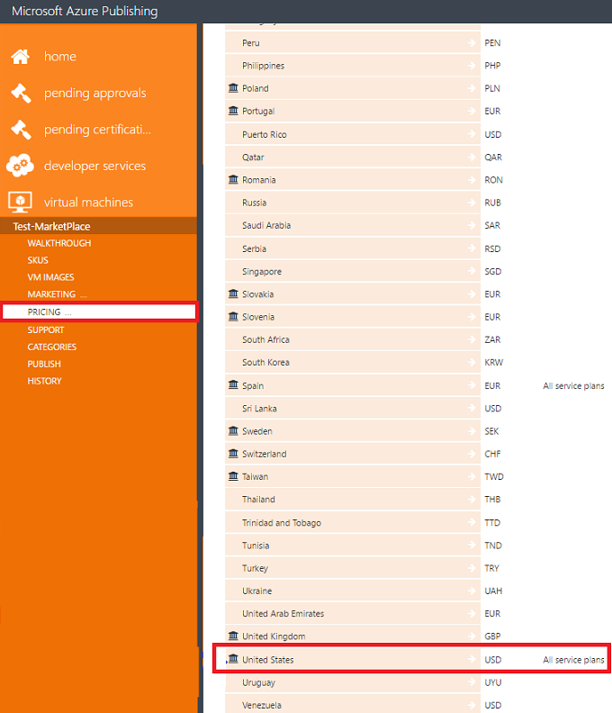

<properties
   pageTitle="Verwalten von virtuellen Computerabbild auf dem Azure Marketplace | Microsoft Azure"
   description="Ausführlicher Leitfaden zum Verwalten von virtuellen Computerabbild auf dem Azure Marketplace nach Erste Veröffentlichung."
   services="Azure Marketplace"
   documentationCenter=""
   authors="HannibalSII"
   manager="hascipio"
   editor=""/>

<tags
   ms.service="marketplace"
   ms.devlang="na"
   ms.topic="article"
   ms.tgt_pltfrm="Azure"
   ms.workload="na"
   ms.date="08/03/2016"
   ms.author="hascipio;"/>

# Nach der Herstellung Leitfaden für virtuellen Computern Angebote in der Azure Marketplace

In diesem Artikel wird erläutert, wie Sie eine live virtuellen Computern Angebot, in dem Azure Marketplace aktualisieren können. Außerdem führt Sie auf die Vorgehensweise zum Hinzufügen eines vorhandenen Angebots eine oder mehrere neue SKUs und Entfernen von live virtuellen Computern Angebot oder SKU aus dem Azure Marketplace.

Nachdem eine Angebot-SKU im [Portal Azure](http://portal.azure.com)bereitgestellt wird, können Sie die unten stehenden Felder nicht ändern:

- **Bezeichner anbieten:** [Veröffentlichen Portals-virtuellen Computern >-Ihr Angebot -> auswählen > Registerkarte virtueller Computer Bilder -> Bezeichner anbieten]
- **SKU-Kennung:** [Veröffentlichen Portals-virtuellen Computern >-Ihr Angebot -> auswählen > Registerkarte -> SKUs hinzufügen eine SKU]
- **Publisher Namespace:** [Veröffentlichen Portals-virtuellen Computern >-Exemplarische Vorgehensweise Registerkarte-erkennen Sie uns über Ihr Unternehmen (gefunden unter "Schritt 2 Registrieren Sie sich Ihr Unternehmen") -> > > Namespace Publisher-Namespace >]

Nachdem die Angebot-SKU in dem [Azure Marketplace](http://azure.microsoft.com/marketplace)aufgeführt ist, können nicht Sie die unten stehenden Felder ändern:

- **Bezeichner anbieten:** [Veröffentlichen Portals-virtuellen Computern >-Ihr Angebot -> auswählen > Registerkarte virtueller Computer Bilder -> Bezeichner anbieten]
- **SKU-Kennung:** [Veröffentlichen Portals-virtuellen Computern >-Ihr Angebot -> auswählen > Registerkarte -> SKUs hinzufügen eine SKU]
- **Publisher Namespace:** [Veröffentlichen Portals-virtuellen Computern >-Exemplarische Vorgehensweise-Registerkarte > > Teilen Sie uns zu Ihr Unternehmen (gefunden unter Schritt 2 registrieren) Publisher Namespace-Namespace >]
- **Ports** [Veröffentlichen Portals-virtuellen Computern >-Ihr Angebot -> auswählen > Registerkarte Bilder virtueller Computer-Ports öffnen >]
- **Ändern der aufgeführten SKU(s) Preise**
- **Modell Ändern der aufgeführten SKU(s) Abrechnung**
- **Zum Entfernen des Dropdownfelds Regionen der aufgeführten SKU(s)**
- **Ändern die Daten Datenträgeranzahl der aufgeführten SKU(s)**

## 1. so aktualisieren Sie die technische Details einer SKU

Sie können eine neue Version der aufgeführten SKU hinzufügen und erneut veröffentlichen Ihr Angebot, indem Sie die folgenden Schritte aus:

1. Melden Sie sich auf das [Portal veröffentlichen](https://publish.windowsazure.com).
2. Navigieren Sie zur Registerkarte **virtuellen Computern** , und wählen Sie Ihr Angebot aus.
3. Wählen Sie im Menü linke Seite klicken Sie auf auf der Registerkarte **Bilder virtueller Computer** .
4. Suchen Sie die SKU, die Sie aktualisieren möchten, klicken Sie im Abschnitt **SKUs** der Registerkarte **Virtueller Computer Bilder** .
5. Anschließend fügen Sie eine neue Versionsnummer der SKU hinzu, und klicken Sie auf die Schaltfläche **"+"** . Die neue Version sollte X.Y.Z Format aufweisen, in dem X-, Y-und Z ganze Zahlen sind. Version Änderungen sollten nur inkrementell.
6. Klicken Sie im **OS virtuelle Festplatte URL** fügen Sie die freigegebenen Access-Signatur hinzu, die für das Betriebssystem virtuelle Festplatte URI erstellt, und speichern Sie die Änderungen zu.

    >[AZURE.IMPORTANT] Sie können keine Inkrement/die Daten Datenträgeranzahl von einer aufgelisteten SKU verringern. Sie müssen eine neue SKU in diesem Fall erstellen. Lizenzinformationen finden Sie im Abschnitt [3. So fügen Sie eine neue SKU unter einem aufgelisteten Angebot](#3-how-to-add-a-new-sku-under-a-live-offer) eine umfassende Unterstützung für.

7. Navigieren Sie nachdem Sie die Änderungen vorgenommen haben zu der Registerkarte **Veröffentlichen** , und klicken Sie auf die Schaltfläche **Zum STAGING PUSHBENACHRICHTIGUNGEN**. Ausführliche Informationen zum Testen Ihr Angebots in das staging-Umgebung finden Sie in diesen [link](marketplace-publishing-vm-image-test-in-staging.md)
8. Nachdem Sie Ihr Angebot Staging getestet haben, navigieren Sie zu der Registerkarte **Veröffentlichen** in der Veröffentlichung Portal, und klicken Sie auf die Schaltfläche **PUSHBENACHRICHTIGUNGEN Genehmigung zum Herstellung anfordern** Ihr Angebot, in dem Azure Marketplace erneut veröffentlichen.

    

## 2. so aktualisieren Sie die technischen Details eines Angebots oder einer SKU

Sie können die technischen aktualisieren (marketing, rechtliche Hinweise, unterstützen, Kategorien) Details Ihrer live Angebot oder SKU in dem Azure Marketplace.

### 2.1 Aktualisieren der Beschreibung des Angebots und logos

Sie können die Angebotdetails aktualisieren und erneut Ihr Angebot veröffentlichen, indem Sie die folgenden Schritte:

1. Melden Sie sich auf das [Portal veröffentlichen](https://publish.windowsazure.com).
2. Navigieren Sie zur Registerkarte **virtuellen Computern** , und wählen Sie Ihr Angebot aus.
3. Klicken Sie im Menü die linke Seite klicken Sie auf der Registerkarte ' **MARKETING** ' auf.
4. Klicken Sie auf die Schaltfläche für **Englisch (USA)** .
5. Klicken Sie im Menü der linken Seite auf der Registerkarte **DETAILS** auf. Unter der Registerkarte **DETAILS** im Abschnitt *Beschreibung* können den Titel Angebot aktualisieren, Zusammenfassung anbieten, lange Zusammenfassung anbieten und die Änderungen zu speichern.

    >[AZURE.NOTE] Bitte achten Sie die folgenden gedrückt, während Sie die Details SKU aktualisieren möchten.
    **Geben Sie unter der Beschreibung des Angebots und die Beschreibung SKU duplizierten Text nicht. Geben Sie unter den Titel SKU und lange Sammelvorgang Angebot duplizierten Text nicht. Geben Sie unter den SKU Titel und Zusammenfassung Angebot duplizierten Text nicht.**

    

6. Klicken Sie unter der Registerkarte **DETAILS** im Abschnitt *LOGOS* können Sie die Logos aktualisieren. Allerdings sicherstellen, dass die Logos führen Sie die [Azure Marketplace-Richtlinien](marketplace-publishing-push-to-staging.md#step-1-provide-marketplace-marketing-content) (finden Sie im Abschnitt Schritt 1: marketing Inhalte bereitstellen Marketplace-Details > -> Azure Marketplace-Logo-Richtlinien).

    >[AZURE.NOTE] Hero Symbol ist optional. Sie können nicht auf ein Symbol Hero Hochladen auswählen. Allerdings nachdem Hero Symbol hochgeladen wird, klicken Sie dann es gibt keine Möglichkeit zum Löschen aus der Veröffentlichung Portal. In diesem Fall müssen Sie die [Hero Symbol Richtlinien](marketplace-publishing-push-to-staging.md#step-1-provide-marketplace-marketing-content) folgen (finden Sie im Abschnitt Schritt 1: marketing Inhalte bereitstellen Marketplace-Details > Weitere Richtlinien für das Logo-Banner Hero ->).

7. Navigieren Sie nachdem Sie die Änderungen vorgenommen haben zu der Registerkarte **Veröffentlichen** , und klicken Sie auf die Schaltfläche **Zum STAGING PUSHBENACHRICHTIGUNGEN**. Ausführliche Informationen zum Testen Ihr Angebots in das staging-Umgebung finden Sie in diesen [Link](marketplace-publishing-vm-image-test-in-staging.md).
8. Nachdem Sie Ihr Angebot Staging getestet haben, navigieren Sie zu der Registerkarte **Veröffentlichen** in der Veröffentlichung Portal, und klicken Sie auf die Schaltfläche **PUSHBENACHRICHTIGUNGEN Genehmigung zum Herstellung anfordern** Ihr Angebot, in dem Azure Marketplace erneut veröffentlichen.

    

### 2.2. Aktualisieren Sie die Beschreibung SKU

Sie können die SKU Details zu aktualisieren und erneut Ihr Angebot veröffentlichen, indem Sie die folgenden Schritte:

1. Melden Sie sich im [Portal veröffentlichen](https://publish.windowsazure.com)
2. Navigieren Sie zur Registerkarte **virtuellen Computern** , und wählen Sie Ihr Angebot aus.
3. Klicken Sie im Menü die linke Seite klicken Sie auf der Registerkarte ' **MARKETING** ' auf.
4. Klicken Sie auf die Schaltfläche für **Englisch (USA)** .
5. Klicken Sie im Menü der linken Seite auf die Registerkarte **Pläne** . Unter dem Abschnitt *SKUs* der Registerkarte **Pläne** können SKU Titel, SKU Zusammenfassung und Details für SKU Beschreibung aktualisieren und die Änderungen zu speichern.

    >[AZURE.NOTE] Bitte achten Sie die folgenden gedrückt, während Sie die Details SKU aktualisieren möchten. **Geben Sie unter der Beschreibung des Angebots und die Beschreibung SKU duplizierten Text nicht. Geben Sie unter die SKUs Titels und lange Sammelvorgang Angebot duplizierten Text nicht. Geben Sie unter den SKU Titel und Zusammenfassung Angebot duplizierten Text nicht.**

6. Navigieren Sie nachdem Sie die Änderungen vorgenommen haben zu der Registerkarte **Veröffentlichen** , und klicken Sie auf die Schaltfläche **Zum STAGING PUSHBENACHRICHTIGUNGEN**. Ausführliche Informationen zum Testen Ihr Angebots in das staging-Umgebung finden Sie in diesen link
7. Nachdem Sie Ihr Angebot Staging getestet haben, navigieren Sie zu der Registerkarte **Veröffentlichen** in der Veröffentlichung Portal, und klicken Sie auf die Schaltfläche **PUSHBENACHRICHTIGUNGEN Genehmigung zum Herstellung anfordern** Ihr Angebot, in dem Azure Marketplace erneut veröffentlichen.

    

### 2.3 ändern Sie die vorhandene Hyperlinks, oder fügen Sie neue Hyperlinks

Die vorhandene Hyperlinks ändern oder neue Hyperlinks hinzufügen, und klicken Sie dann erneut veröffentlichen Ihr Angebot, indem Sie die folgenden Schritte aus:

1. Melden Sie sich im [Portal veröffentlichen](https://publish.windowsazure.com)
2. Navigieren Sie zur Registerkarte **virtuellen Computern** , und wählen Sie Ihr Angebot aus.
3. Klicken Sie im Menü die linke Seite klicken Sie auf der Registerkarte ' **MARKETING** ' auf.
4. Klicken Sie auf die Schaltfläche für **Englisch (USA)** .
5. Klicken Sie im Menü der linken Seite auf der Registerkarte **LINKS** auf.
6. Wenn Sie einen neuen Link hinzufügen möchten, klicken Sie unter den *Links* im Abschnitt klicken Sie dann auf die Schaltfläche **Hyperlink hinzufügen** . Das Dialogfeld *"Link hinzufügen"* wird geöffnet. In diesem Dialogfeld können Sie den Link Titel hinzufügen und URL-Felder und die Änderungen zu speichern. Sie können einen beliebigen Link eingeben, der Informationen enthält, die die Kunden helfen können.
7. Wenn Sie aktualisieren oder Löschen eines vorhandenen links, dann wählen Sie den geeigneten Link und klicken Sie auf die Bearbeitungsschaltfläche oder die Schaltfläche Löschen entsprechend möchten.

    >[AZURE.NOTE] Stellen Sie sicher, dass die Links, die Sie in diesem Abschnitt eingegeben haben ordnungsgemäß arbeiten, wie diese Links während Ihrer Anforderung Produktionsprozess überprüft abrufen.

8. Navigieren Sie nachdem Sie die Änderungen vorgenommen haben zu der Registerkarte **Veröffentlichen** , und klicken Sie auf die Schaltfläche **Zum STAGING PUSHBENACHRICHTIGUNGEN**. Ausführliche Informationen zum Testen Ihr Angebots in das staging-Umgebung finden Sie in diesen [Link](marketplace-publishing-vm-image-test-in-staging.md).
9. Nachdem Sie Ihr Angebot Staging getestet haben, navigieren Sie zu der Registerkarte **Veröffentlichen** in der Veröffentlichung Portal, und klicken Sie auf die Schaltfläche **PUSHBENACHRICHTIGUNGEN Genehmigung zum Herstellung anfordern** Ihr Angebot, in dem Azure Marketplace erneut veröffentlichen.

    

    

### 2.4 Ändern eines vorhandenen Stichprobe Bilds oder Hinzufügen eines neuen Stichprobe

Ändern einer vorhandenen Bilder oder neue Bilder hinzufügen, und klicken Sie dann erneut veröffentlichen Ihr Angebot, indem Sie die folgenden Schritte aus:

>[AZURE.NOTE] Nur eine Stichprobe-Bild wird in der [https://portal.azure.com](https://portal.azure.com)angezeigt.

1. Melden Sie sich im [Portal veröffentlichen](https://publish.windowsazure.com)
2. Navigieren Sie zur Registerkarte **virtuellen Computern** , und wählen Sie Ihr Angebot aus.
3. Klicken Sie im Menü die linke Seite klicken Sie auf der Registerkarte ' **MARKETING** ' auf.
4. Klicken Sie auf die Schaltfläche für **Englisch (USA)** .
5. Wählen Sie im Menü linke Seite klicken Sie auf auf der Registerkarte **Bilder** .
6. Wenn Sie ein neues Beispielbild hinzufügen möchten, klicken Sie dann unter dem Abschnitt *Beispielbilder* auf, klicken Sie auf die Schaltfläche **Neues Bild hochladen** , und speichern Sie die Änderungen vor.

    >[AZURE.NOTE] Ein Beispielbild einschließlich ist Schritt optional.

7. Wenn Sie aktualisieren oder ein vorhandenes Stichprobe Bild löschen möchten, suchen Sie die geeignete Probe Bild und klicken Sie dann auf die Schaltfläche **Bild ersetzen** oder auf die Schaltfläche Löschen entsprechend.

8. Navigieren Sie nachdem Sie die Änderungen vorgenommen haben zu der Registerkarte **Veröffentlichen** , und klicken Sie auf die Schaltfläche **Zum STAGING PUSHBENACHRICHTIGUNGEN**. Ausführliche Informationen zum Testen Ihr Angebots in das staging-Umgebung finden Sie in diesen [Link](marketplace-publishing-vm-image-test-in-staging.md).
9. Nachdem Sie Ihr Angebot Staging getestet haben, navigieren Sie zu der Registerkarte **Veröffentlichen** in der Veröffentlichung Portal, und klicken Sie auf die Schaltfläche **PUSHBENACHRICHTIGUNGEN Genehmigung zum Herstellung anfordern** Ihr Angebot, in dem Azure Marketplace erneut veröffentlichen.

    

### 2,5 aktualisieren Sie relevanter Inhalte

Sie können relevanter Inhalte zu aktualisieren und erneut veröffentlichen Ihr Angebot, indem Sie die folgenden Schritte aus:

1. Melden Sie sich im [Portal veröffentlichen](https://publish.windowsazure.com)
2. Navigieren Sie zur Registerkarte **virtuellen Computern** , und wählen Sie Ihr Angebot aus.
3. Klicken Sie im Menü die linke Seite klicken Sie auf der Registerkarte ' **MARKETING** ' auf.
4. Klicken Sie auf die Schaltfläche für **Englisch (USA)** .
5. Wählen Sie im Menü linke Seite klicken Sie auf klicken Sie auf die Registerkarte **Rechtliche Hinweise** . Klicken Sie im Abschnitt *Rechtliche Hinweise* können Sie Ihre Richtlinien/Nutzungsbedingungen aktualisieren. Geben Sie oder fügen Sie die Richtlinien/Begriffe in das Textfeld *Nutzungsbedingungen* und speichern Sie die Änderungen zu.
6. Die Zeichengrenze für die Vertragsbedingungen Bedienung beträgt 1.000.000 Zeichen.
7. Navigieren Sie nachdem Sie die Änderungen vorgenommen haben zu der Registerkarte **Veröffentlichen** , und klicken Sie auf die Schaltfläche **Zum STAGING PUSHBENACHRICHTIGUNGEN**. Ausführliche Informationen zum Testen Ihr Angebots in das staging-Umgebung finden Sie in diesen [link](marketplace-publishing-vm-image-test-in-staging.md)
8. Nachdem Sie Ihr Angebot Staging getestet haben, navigieren Sie zu der Registerkarte **Veröffentlichen** in der Veröffentlichung Portal, und klicken Sie auf die Schaltfläche **PUSHBENACHRICHTIGUNGEN Genehmigung zum Herstellung anfordern** Ihr Angebot, in dem Azure Marketplace erneut veröffentlichen.

    

### 2.6 Aktualisieren der Informationen zum support

Sie können die Supportinformationen aktualisieren und erneut Ihr Angebot veröffentlichen, indem Sie die folgenden Schritte:

1. Melden Sie sich im [Portal veröffentlichen](https://publish.windowsazure.com)
2. Navigieren Sie zur Registerkarte **virtuellen Computern** , und wählen Sie Ihr Angebot aus.
3. Klicken Sie im Menü der linken Seite auf der Registerkarte **SUPPORT** auf.
4. Unter dem Abschnitt *Engineering wenden Sie sich an* den **SUPPORT** -Registerkarte können Sie die Kontaktinformationen zu aktualisieren. Diese Details sind für die interne Kommunikation zwischen dem Partner und Microsoft nur verwendet.
5. Unter dem Abschnitt *Kundensupport* der **SUPPORT** Registerkarte können Sie den Supportkontaktdetails wie **Namen, E-Mail, Telefon** und **Support-URL**aktualisieren. Diese Details sind für die interne Kommunikation zwischen dem Partner und Microsoft nur verwendet.

    >[AZURE.NOTE] Wenn Sie nur e-Mail-Support angeben möchten, geben Sie unter dem Abschnitt **Kundensupport** eine-platzhalterprodukt Telefonnummer. In diesem Fall wird stattdessen Ihren bereitgestellten e-Mails verwendet werden.

6. Navigieren Sie nachdem Sie die Änderungen vorgenommen haben zu der Registerkarte **Veröffentlichen** , und klicken Sie auf die Schaltfläche **Zum STAGING PUSHBENACHRICHTIGUNGEN**. Ausführliche Informationen zum Testen Ihr Angebots in das staging-Umgebung finden Sie in diesen [link](marketplace-publishing-vm-image-test-in-staging.md)
7. Nachdem Sie Ihr Angebot Staging getestet haben, navigieren Sie zu der Registerkarte **Veröffentlichen** in der Veröffentlichung Portal, und klicken Sie auf die Schaltfläche **PUSHBENACHRICHTIGUNGEN Genehmigung zum Herstellung anfordern** Ihr Angebot, in dem Azure Marketplace erneut veröffentlichen.

    

### 2.7 aktualisieren Sie Kategorien

Sie können im Abschnitt Kategorien für Ihr Angebot aktualisieren und Ihr Angebot erneut veröffentlichen, indem Sie die nachstehenden Schritte durchführen:

1. Melden Sie sich im [Portal veröffentlichen](https://publish.windowsazure.com)
2. Navigieren Sie zur Registerkarte **virtuellen Computern** , und wählen Sie Ihr Angebot aus.
3. Klicken Sie im Menü der linken Seite auf die Registerkarte **Kategorien** .
4. Klicken Sie im Abschnitt *Kategorien* können Sie Kategorien für Ihr Angebot aktualisieren und die Änderungen zu speichern. Sie können bis zu fünf Kategorien für den Katalog Azure Marketplace auswählen.
5. Navigieren Sie nachdem Sie die Änderungen vorgenommen haben zu der Registerkarte **Veröffentlichen** , und klicken Sie auf die Schaltfläche **Zum STAGING PUSHBENACHRICHTIGUNGEN**. Ausführliche Informationen zum Testen Ihr Angebots in das staging-Umgebung finden Sie in diesen [link](marketplace-publishing-vm-image-test-in-staging.md)
6. Nachdem Sie Ihr Angebot Staging getestet haben, navigieren Sie zu der Registerkarte **Veröffentlichen** in der Veröffentlichung Portal, und klicken Sie auf die Schaltfläche **PUSHBENACHRICHTIGUNGEN Genehmigung zum Herstellung anfordern** Ihr Angebot, in dem Azure Marketplace erneut veröffentlichen.

    

## 3. zum Hinzufügen eines neuen SKUs unter einem aufgelisteten Angebot

Sie können eine neue SKU unter Ihr live Angebot hinzufügen, anhand der folgenden Schritte aus:

1. Melden Sie sich auf das [Portal veröffentlichen](https://publish.windowsazure.com).
2. Navigieren Sie zur Registerkarte **virtuellen Computern** , und wählen Sie Ihr Angebot aus.
3. Klicken Sie im Menü die linke Seite auf der Registerkarte **SKUs** auf. Nachdem die auf die Schaltfläche **Hinzufügen A SKU**.  Im Dialogfeld neue wird geöffnet. Geben Sie eine SKU-Kennung in Kleinbuchstaben ein. Aktivieren Sie das Kontrollkästchen für den model(BYOL) bringen eigener, wenn Sie die neue SKU mit BYOL Abrechnung Modell veröffentlichen möchten. Deaktivieren Sie das Kontrollkästchen andernfalls für BYOL. Nach dieser auf ein Häkchen im Dialogfeld zum Erstellen eines neuen SKUs gekennzeichnet. Wenn Sie nicht für die BYOL des Modells für das neue SKU Suchbegriffen, wird dann Abrechnung Modell automatisch stündlich für das neue SKU festgelegt werden. Wenn Sie die 30days kostenlose Testversion für stündlich Abrechnung Modell aktivieren möchten, "steht klicken Sie dann auf die Option"Einen Monat"für eine kostenlose Testversion?". Wählen Sie andernfalls "Kein Testversion" aus. [Hinweis: die Option "ist eine kostenlose Testversion zur Verfügung?" wird nur angezeigt, wenn Sie BYOL nicht im Dialogfeld, beim Erstellen der neuen SKUs ausgewählt haben.]

    >[AZURE.IMPORTANT] Die Option "Diese SKU aus dem Marketplace ausblenden, da es immer über eine Lösungsvorlage erworben werden sollte" werden sollen, die als "Ja" nur, wenn Sie für die Veröffentlichung einer Lösung Vorlage Angebot in dem Azure Marketplace genehmigt werden. Diese Option sollte andernfalls immer als "Nein" markiert werden.

4. Jetzt aus dem linken Bildschirmseite Menü, klicken Sie auf der Registerkarte **Virtueller Computer Bilder** auf, und finden Sie heraus, die neue SKU, die Sie erstellt haben.
5. Um die neue SKU eingerichtet haben, finden Sie in der Schritt 5 dieser [Link](marketplace-publishing-vm-image-creation.md#5-obtain-certification-for-your-vm-image) Anleitung.
6. Wenn das marketing-Material für die neue SKU hinzufügen möchten, finden Sie im Abschnitt Schritt 1: marketing Inhalte bereitstellen Marketplace-Details > -> Punkt Zahlen 2 bis 5 für diese [Verknüpfung](marketplace-publishing-push-to-staging.md#step-1-provide-marketplace-marketing-content).
7. Wenn die Preisinformationen für das neue SKU hinzufügen möchten, finden Sie im Abschnitt 2.1. Festlegen der virtuellen Computer Preise dieser [link](marketplace-publishing-push-to-staging.md#step-2-set-your-prices)
8. Navigieren Sie nachdem Sie die Änderungen vorgenommen haben zu der Registerkarte **Veröffentlichen** , und klicken Sie auf die Schaltfläche **Zum STAGING PUSHBENACHRICHTIGUNGEN**. Ausführliche Informationen zum Testen Ihr Angebots in das staging-Umgebung finden Sie in diesen [link](marketplace-publishing-vm-image-test-in-staging.md)
9. Nachdem Sie Ihr Angebot Staging getestet haben, navigieren Sie zu der Registerkarte **Veröffentlichen** in der Veröffentlichung Portal, und klicken Sie auf die Schaltfläche **PUSHBENACHRICHTIGUNGEN Genehmigung zum Herstellung anfordern** Ihr Angebot, in dem Azure Marketplace erneut veröffentlichen.

    

    

## 4. zum Ändern der Daten Datenträgeranzahl für eine aufgelisteten SKU von wie

Sie können keine Inkrement/die Daten Datenträgeranzahl von einer aufgelisteten SKU verringern. In diesem Fall benötigen Sie ein Erstellen einer neuen SKU. Lizenzinformationen finden Sie im Abschnitt [3. So fügen Sie eine neue SKU unter einer live Angebot](#3-how-to-add-a-new-sku-under-a-live-offer) eine umfassende Unterstützung für.

## 5. zum Löschen einer aufgelisteten Angebot aus dem Azure Marketplace

Es gibt verschiedene Aspekte, die bei der Anforderung einer So entfernen Sie eine live Angebot durchgeführt werden müssen. Führen Sie die folgenden Schritte zur Anleitungen vom Entfernen einer aufgelisteten Angebot aus dem Azure Marketplace-Supportteam erhalten:

1.  Auslösen einer Support-Ticket verwenden diesen [link](https://support.microsoft.com/en-us/getsupport?wf=0&tenant=ClassicCommercial&oaspworkflow=start_1.0.0.0&locale=en-us&supportregion=en-us&pesid=15635&ccsid=635993707583706681)
2.  Wählen Sie als **"Verwaltung Angebote"** Problemtyp aus, und wählen Sie Kategorie als **"Ändern eines Angebots und/oder SKU bereits in der Herstellung"**
3.  Senden Sie die Anforderung

Das Supportteam führt Sie durch den Löschvorgang Angebot/SKU.

>[AZURE.NOTE] Sie können das Angebot immer löschen, während sie einen Entwurfsstatus wird (d. h., nicht im STAGING oder Fertigung), indem Sie auf die Schaltfläche **Entwurf verwerfen** , klicken Sie auf die Registerkarte **Verlauf** .

## 6. So löschen Sie eine aufgelistete SKU aus dem Azure Marketplace

Sie können eine aufgelistete SKU aus dem Azure Marketplace löschen, anhand der folgenden Schritte aus:

1. Melden Sie sich auf das [Portal veröffentlichen](https://publish.windowsazure.com).
2. Navigieren Sie zur Registerkarte **virtuellen Computern** , und wählen Sie Ihr Angebot aus.
3. Im linken Bereich klicken Sie auf der Registerkarte **SKUS** .
4. Wählen Sie die SKU welche löschen, und klicken Sie auf die Schaltfläche Löschen anhand dieser SKU werden sollen.
5. Sobald Sie fertig sind, navigieren Sie zu der Registerkarte Veröffentlichen in der Veröffentlichung Portal, und klicken Sie auf die Schaltfläche **PUSHBENACHRICHTIGUNGEN Genehmigung zum Herstellung anfordern** Angebot in dem Azure Marketplace erneut veröffentlichen.
6. Nachdem das Angebot erneut in der Azure Marketplace veröffentlicht wird, wird die SKU aus dem Azure Marketplace und Azure-Portal gelöscht.

## 7. zum Löschen der aktuellen Version eines aufgelisteten SKU aus dem Azure Marketplace

Sie können die aktuelle Version von einer aufgelisteten SKU aus dem Azure Marketplace löschen, anhand der folgenden Schritte aus. Nachdem der Vorgang abgeschlossen ist, wird die SKU auf der vorherigen Version zurückgesetzt.

1. Melden Sie sich auf das [Portal veröffentlichen](https://publish.windowsazure.com).
2.  Navigieren Sie zur Registerkarte **virtuellen Computern** , und wählen Sie Ihr Angebot aus.
3.  Im linken Bereich klicken Sie auf der Registerkarte **Bilder virtueller Computer** .
4.  Wählen Sie die SKU, deren aktuellen Version löschen, und klicken Sie auf die Schaltfläche Löschen anhand dieser Version werden soll.
5.  Sobald Sie fertig sind, navigieren Sie zu der Registerkarte **Veröffentlichen** in der Veröffentlichung Portal, und klicken Sie auf die Schaltfläche **PUSHBENACHRICHTIGUNGEN Genehmigung zum Herstellung anfordern** Angebot in dem Azure Marketplace erneut veröffentlichen.
6.  Nachdem das Angebot erneut in der Azure Marketplace veröffentlicht wird, wird die aktuelle Version von der aufgeführten SKU aus dem Azure Marketplace und Azure-Portal gelöscht. Die SKU wird auf der vorherigen Version zurückgesetzt werden.

## 8. wie Auflistung Preis Herstellung Werte wiederherstellen
Ich habe geändert, die Preise von einer aufgelisteten SKU (oder ich die Abrechnung Bereiche eines aufgelisteten SKU entfernt haben). Da es in der Azure Marketplace nicht unterstützt wird, möchten ich meine Änderungen an der Herstellung Werte wiederherstellen. Wie werden dies erreicht?

Führen Sie die folgenden Schritte aus:

1. Melden Sie sich auf das [Portal veröffentlichen](https://publish.windowsazure.com).
2. Navigieren Sie zur Registerkarte **virtuellen Computern** , und wählen Sie Ihr Angebot aus.
3. Klicken Sie im Menü der linken Seite auf der Registerkarte **Preise** .
4. Wählen Sie unter der Registerkarte Preise eines Bereichs, deren Preis, die Sie zurücksetzen möchten.

    

5. Setzen Sie bei SKUs mit stündlich Abrechnung Modell die Preise für alle Kerne wie bei der Herstellung für den ausgewählten Bereich. Für SKUs mit BYOL Abrechnung Modell, das SKU zur Verfügung stellen in der Region durch Aktivieren des Kontrollkästchens anhand der SKU unter dem Abschnitt EXTERNALLY-LICENSED (BYOL) SKU Verfügbarkeit (Siehe den Screenshot).

    

6. Klicken Sie nun auf die Schaltfläche **AUTOPRICE anderen Märkten basierend auf Preisen IN Vereinigte Staaten**.

    >[AZURE.NOTE] Die Beschriftung der Schaltfläche kann sich je nach der Region unterscheiden, die Sie ausgewählt haben. Da wir Vereinigten Staaten beim Erstellen dieses Dokument markiert haben, wird also die Schaltfläche mit der Bezeichnung wie "Automatische Preis anderen Märkten basierend auf den Preisen in den Vereinigten Staaten" in den folgenden Screenshot.

    

7. Der Assistent für automatische Kurs wird geöffnet. Die erste Seite wird für Basis Markt angezeigt. Stellen Sie einen Abschnitt, und wechseln Sie zur nächsten Seite, indem Sie auf die Schaltfläche **"->"** .

    

8. Option zum Auswählen der Adern und Pläne wird auf der Seite 2 angezeigt. Wählen Sie die gewünschten Pläne und die Kerne aus, und klicken Sie auf die Schaltfläche "->".

    

9. Seite 3 zeigt die Märkten/Regionen zurück. Klicken Sie auf die Schaltfläche Alles Umschaltfläche um alle Bereiche auswählen oder manuell die Kontrollkästchen für die Region. Klicken Sie auf die Schaltfläche "->", um zur nächsten Seite zu wechseln.

    

10. Seite 4 zeigt die Exchange-Sätze. Klicken Sie auf die Schaltfläche Fertig stellen, um die Schritte ausführen. Der Assistent wird die Preise entsprechend Ihrer Auswahl zurücksetzen.

11. Navigieren Sie zur Registerkarte Preisgestaltung jetzt, und klicken Sie auf die Schaltfläche "Zusammenfassung und ÄNDERUNGEN anzeigen".
Wählen Sie "Entwurf" im Abschnitt "Version anzeigen" und "Herstellung" im Abschnitt "Vergleichen mit" (Siehe den Screenshot). Wenn Sie keine Preisgestaltung Unterschied zu sehen, impliziert dies, dass die Preise der Herstellung Werte wurde wiederhergestellt wurde.

    

12. Navigieren Sie nachdem Sie die Änderungen vorgenommen haben zu der Registerkarte veröffentlichen, und klicken Sie auf die Schaltfläche **Zum STAGING PUSHBENACHRICHTIGUNGEN**. Ausführliche Informationen zum Testen Ihr Angebots in das staging-Umgebung finden Sie in diesen [link](marketplace-publishing-vm-image-test-in-staging.md)
13. Nachdem Sie Ihr Angebot Staging getestet haben, navigieren Sie zu der Registerkarte Veröffentlichen in der Veröffentlichung Portal, und klicken Sie auf die Schaltfläche **PUSHBENACHRICHTIGUNGEN Genehmigung zum Herstellung anfordern** Ihr Angebot, in dem Azure Marketplace erneut veröffentlichen.

## 9. wie Abrechnung Modell Herstellung Werte wiederherstellen
Ich habe das Modell Abrechnung von einer aufgelisteten SKU geändert. Da es in der Azure Marketplace nicht unterstützt wird, möchten ich meine Änderungen an der Herstellung Werte wiederherstellen. Wie werden dies erreicht?

Führen Sie die folgenden Schritte aus:

1. Melden Sie sich auf das [Portal veröffentlichen](https://publish.windowsazure.com).
2. Navigieren Sie zur Registerkarte **virtuellen Computern** , und wählen Sie Ihr Angebot aus.
3. Klicken Sie im Menü der linken Seite auf die Registerkarte **SKUS** .
4. Klicken Sie auf die Schaltfläche Bearbeiten, um das Modell Abrechnung wiederherstellen. Ein Fenster wird geöffnet. Aktivieren Sie oder deaktivieren Sie das Kontrollkästchen **'Abrechnung und Lizenzierung erfolgt extern aus Azure (QuickInfos wieder abrufen Ihrer eigenen Lizenz)'** entsprechend.

    

5. Einmal Lizenzinformationen finden Sie die Antwort der Frage 8 in diesem Dokument wieder die Preise wiederherstellen.
6. Nachdem die navigieren Sie zur Registerkarte **Veröffentlichen** in der Veröffentlichung Portal und Pushbenachrichtigungen das Angebot für das staging um ihn zu testen. Nachdem Sie mit testen Ihr Angebot fertig sind und dann klicken Sie auf die Schaltfläche **PUSHBENACHRICHTIGUNGEN Genehmigung zum Herstellung anfordern** Ihr Angebot, in dem Azure Marketplace erneut veröffentlichen.

## 10. für die Sichtbarkeit von einer aufgelisteten SKU auf den Wert für die Herstellung Wiederherstellen von wie

Führen Sie die folgenden Schritte aus:

1. Melden Sie sich auf das [Portal veröffentlichen](https://publish.windowsazure.com).
2. Navigieren Sie zur Registerkarte **virtuellen Computern** , und wählen Sie Ihr Angebot aus.
3. Klicken Sie im Menü der linken Seite auf die Registerkarte **SKUS** .
4. Wiederherstellen der sichtbarkeitseinstellung für die SKU auf den Wert für die Herstellung, und wählen Sie die gewünschte SKU aus.

    

5. Nachdem Sie mit den Änderungen abgeschlossen haben und dann klicken Sie auf die Schaltfläche **PUSHBENACHRICHTIGUNGEN Genehmigung zum Herstellung anfordern** Ihr Angebot, in dem Azure Marketplace erneut veröffentlichen.

## Siehe auch
- [Erste Schritte: Wie veröffentlichen ein Angebots zu Azure Marketplace](marketplace-publishing-getting-started.md)
- [Grundlegendes zu Verkäufer Einsichten reporting](marketplace-publishing-report-seller-insights.md)
- [Grundlegendes zu reporting Auszahlung](marketplace-publishing-report-payout.md)
- [Zum Ändern der Cloud Solution Provider Reseller incentive](marketplace-publishing-csp-incentive.md)
- [Behandlung von Problemen für die Veröffentlichung auf der Marketplace](marketplace-publishing-support-common-issues.md)
- [Anfordern von Unterstützung als eines Herausgebers](marketplace-publishing-get-publisher-support.md)
- [Erstellen ein Bild virtueller Computer lokal](marketplace-publishing-vm-image-creation-on-premise.md)
- [Erstellen Sie einen virtuellen Computer mit Windows Azure Preview-Portal](../virtual-machines/virtual-machines-windows-hero-tutorial.md)
