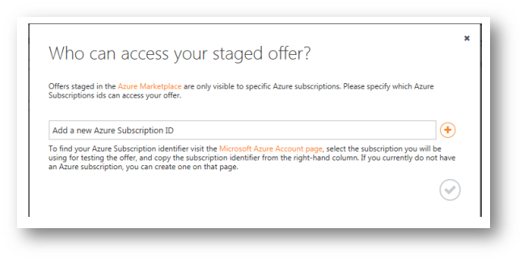
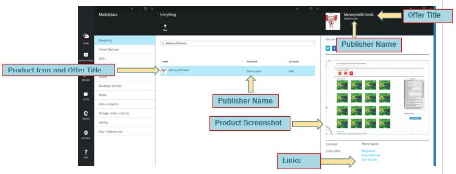

<properties
   pageTitle="Testen Sie Ihr Angebot virtueller Computer von Marketplace | Microsoft Azure"
   description="Verstehen Sie, wie Ihr Bild virtueller Computer von Azure Marketplace testen."
   services="marketplace-publishing"
   documentationCenter=""
   authors="HannibalSII"
   manager="hascipio"
   editor=""/>

<tags
   ms.service="marketplace"
   ms.devlang="na"
   ms.topic="article"
   ms.tgt_pltfrm="na"
   ms.workload="na"
   ms.date="08/01/2016"
   ms.author="hascipio" />

# Testen Sie Ihr Angebot virtueller Computer von Azure Marketplace Staging

Staging bedeutet Bereitstellen von Ihrer SKU in einem privaten "Sandkasten", wo Sie testen und seine Funktionalität vor der Bereitstellung zu Marketplace überprüfen können. Die SKU wird das staging genau wie bei einem Kunden, die sie bereitgestellt hat. Bild virtueller Computer muss auf Staging abgelegt werden zertifiziert sein.

## Schritt 1: Drücken Sie Ihr Angebot auf staging

1. Klicken Sie auf der Registerkarte **Veröffentlichen** auf **drücken, um das Staging**.

    

2. Wenn die Veröffentlichungsportal über Fehlern benachrichtigt, korrigieren sie.
3.  In der **können, wer Ihr Angebot bereitgestellte zugreifen?** Dialogfeld Geben Sie die Liste der Azure-Abonnements, mit denen Sie Ihr Angebot im [Portal Azure Vorschau](https://portal.azure.com)eine Vorschau anzeigen.

    >[AZURE.NOTE] Bei virtuellen Computern und Lösung Vorlagen, melden Sie **keine** weißen Abonnements vom Typ CSP, DreamSpark oder Azure öffnen.

    > Beim Klicken auf die Schaltfläche **Zum STAGING PUSHBENACHRICHTIGUNGEN**, sind die folgenden Schritte bei virtuellen Computern hinter der Szene ausgeführt. Sie werden möglicherweise den Fortschritt der einzelnen Schritte unter der Registerkarte Veröffentlichen in der Veröffentlichung anzeigen Portal. Überprüfen Sie diese Seite in regelmäßigen Abständen (bis der Status ' bereitgestellt ' zeigt) Fehler Informationen, die Korrektur von Ihrer Seite aus benötigen.

    > - Auf den ersten, geht staging Anforderung an Zertifizierung Teams, die die virtuelle Festplatte zu überprüfen. Jedoch wenn Anforderung nur marketing ändern eingerichtet wurde, wird der Zertifizierung, Schritt übersprungen.
    > - Sobald die Zertifizierung abgeschlossen ist, die Replikation des Angebots über alle den Azure Datencentern starten. Im Allgemeinen dauert 24-48hours für die Replikation abgeschlossen, aber es kann bis zu eine Woche, abhängig von der Größe der virtuellen Festplatte dauern. Wenn Ihre Anforderung nur marketing ändern eingerichtet wurde, ist jedoch dann die Replikation schneller.
    > - Klicken Sie nach Abschluss die Replikation wird das Angebot im [Portal Azure](http:/portal.azure.com)verfügbar. AT, die Uhrzeit den Status in der Veröffentlichung bereitgestellt werden Portal. Ein eingerichtetes Angebot wird in der [Azure-Portal](http:/portal.azure.com) verwenden nur die e-Mail-IDs zugeordnet ist, mit dem Abonnement, mit dem das Angebot bereitgestellt wird, angezeigt.

4. Melden Sie sich an den [Azure Vorschau Portal](https://portal.azure.com) mithilfe einer der im vorherigen Schritt aufgeführten Azure Abonnements.
5. Suchen Sie Ihr Angebot, und überprüfen Sie Ihre virtuellen Computer Bild Punkte:
  - Stellen Sie sicher, dass Inhalt marketing ordnungsgemäß in der Marketplace wird angezeigt.
  - End-to-End-Bereitstellung des Bilds virtueller Computer.

      

> [AZURE.IMPORTANT] Ihr Angebot bleibt in das staging, bis Sie Microsoft über die Veröffentlichungsportal benachrichtigen [Registerkarte**Veröffentlichen** > Klicken Sie auf die Schaltfläche **"Anfordern der Genehmigung zum Pushbenachrichtigungen zu Herstellung"**], dass Sie bereit sind, auf die Herstellung laden. Dies ist eine ideale Zeit alle Mitglieder der Ihr Team Kontrollkästchen über alles in Vorbereitung für Ihr Angebot aufgeführten vertraut sein.

> Die staging Plattform dient zum Testen Ihr Angebot in einer Seitenansicht vom Herausgeber. Wir Stimme verhindern, verwenden diese Platofrm professioneller Zwecken.

## Nächste Schritte
Jetzt, da Ihr Angebot "bereitgestellt", und Sie haben überprüft, deren Funktionalität und marketing-Inhalt, können Sie fahren Sie mit der letzten Veröffentlichung Phase **Schritt 4**: [Bereitstellen von Ihr Angebot zum Marketplace](marketplace-publishing-push-to-production.md).

## Siehe auch
- [Erste Schritte: So veröffentlichen ein Angebots zu Azure Marketplace](marketplace-publishing-getting-started.md)
