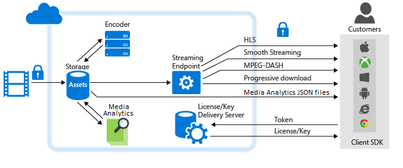

<properties
    pageTitle="Azure Media Services Analytics Übersicht | Microsoft Azure"
    description="Azure Media Services bietet die öffentliche Vorschau Azure Medien Analytics, eine Sammlung von Sprachein-/Ausgabe und Computer Sehschwäche Diensten am Enterprise-Skala, Compliance, Sicherheit und globale Reichweite. Azure Medien Analytics Services werden mithilfe von Azure Media Services Plattform-Hauptkomponenten erstellt und daher sind für die Bearbeitung von Medien auf den ersten Tag bei Verarbeitung bereit. "
    services="media-services"
    documentationCenter=""
    authors="juliako"
    manager="erikre"
    editor=""/>

<tags
    ms.service="media-services"
    ms.workload="media"
    ms.tgt_pltfrm="na"
    ms.devlang="dotnet"
    ms.topic="article"
    ms.date="10/24/2016"   
    ms.author="milanga;juliako;johndeu"/>

# Azure Media Services Analytics (Übersicht)

##(Übersicht)

Weitere Organisationen und Unternehmen sind Video als das bevorzugte Medium an ihre Mitarbeiter Schulen, wenden Sie sich an ihren Kunden und Dokument realen Geschäftsfunktionen einführen. Cloud computing macht ihn effektiver zu speichern, übertragen und diese große Mediendateien zugreifen, doch Unternehmen, deren Inhalt Videobibliothek wachsen, muss auch ein gleichmäßig effektives Mittel für extrahierende neue Einblicken Video erstellen aussagekräftiger, individuellen Interaktionen mit ihren Zielgruppen und optimieren ihr Unternehmen auf die nächste Ebene.

Zur Behebung dieses wachsende Bedarf auf der Marketplace bietet Azure Media Services Medien Analytics, eine Sammlung von Sprachein-/Ausgabe und Vision Komponenten (bei unternehmensweite Compliance, Sicherheit und globale Reichweite), die für Organisationen und Unternehmen nützliche Einblicke in ihre Videodateien abgeleitet erleichtern. Azure Medien Analytics Services werden mithilfe von Azure Media Services Plattform-Hauptkomponenten erstellt und daher sind für die Bearbeitung von Medien auf den ersten Tag bei Verarbeitung bereit.

Azure Medien Analytics können Entwickler schnell erste Schritte mit eingeschränkter Funktionen für Video in begrenztem Umfang und bringen diese erweiterte Funktionen in Applications. Azure Medien Analytics wird erstellt, um von Enterprise-Umgebungen mit vollständigen Skalierung, Compliance, Sicherheit und globale Reichweite erforderlich große Organisationen verwendet werden.

Das folgende Diagramm veranschaulicht **Medien Analytics** und andere Hauptteilen der Plattform Media-Dienste. 

Medien Analytics Media-Prozessoren erzeugen, MP4-Dateien oder JSON-Dateien. Wenn ein Medienprozessor MP4-Datei angefallen, können Sie die Datei schrittweise herunterladen. Wenn ein Medienprozessor eine JSON-Datei erstellt, können Sie die Datei aus dem Azure Blob-Speicher herunterladen. 

## Azure Medien Analytics-Dienste

- **Indexer** – Azure Medien Indexer können Sie auch geschlossene Untertiteln Spuren generieren Inhalte durchsucht, machen. Azure Media-Dienste veröffentlicht **Azure Medien Indexer 2 Preview** mit schneller Indizierung und umfassendere Unterstützung für Sprachen. Unterstützte Sprachen gehören Englisch, Spanisch, Französisch, Deutsch, Italienisch, Chinesisch, Portugiesisch und Arabisch. Ausführliche Informationen und Beispiele hierzu finden Sie unter [Prozess Videos mit Azure Media Indexer 2](media-services-process-content-with-indexer2.md)
 
- **Hyperlapse** – Microsoft Hyperlapse ist ein Ergebnis von mehr als 20 Jahren Computer Sehschwäche Recherchieren bei Microsoft Research (MSR), Kombinieren von video Stabilisierung und Zeit Beseitigung um schnelle, verwendet, ansprechender Videos aus dem Formular lange Inhalt zu erstellen. Neben erstellen Zeit Ablauf, können Sie auch Hyperlapse unveränderliche Videos aus flackernd Videos über Handys und Camcorders erfasst erstellen verwenden. Ausführliche Informationen und Beispiele hierzu finden Sie unter [Hyperlapse Mediendateien mit Azure Medien Hyperlapse](media-services-hyperlapse-content.md)
 
- **Bewegung Erkennung** – Sie können diesen Dienst verwenden, um Bewegung in ein Video mit Briefpapierhintergründe zu erkennen. Dies ist ideal für Kunden, die von false Positives auf Bewegung Ereignisse erkannt durch Überwachungskameras auf die Überwachung video Feeds prüfen möchten. Ausführliche Informationen und Beispiele finden Sie unter [Animationspfade Erkennung für Azure Medien Analytics](media-services-motion-detection.md).
 
- **Smiley Erkennung und Smiley Emotionen** – diese-Dienst verwenden, können Sie erkennen, Volksrepublik Flächen und deren Emotionen, einschließlich Glück Sadness plötzlich Anger Contempt Angst Abschicken und gleichgültig/Neutral. Dies hat mehrere hilfreiche Industry-Anwendungen erläutert, wie aggregieren und Analysieren von Reaktionen von Personen, die Teilnahme an einer Veranstaltung. Ausführliche Informationen und Beispiele hierzu finden Sie unter [Smiley und Emotionen Erkennung für Azure Medien Analytics](media-services-face-and-emotion-detection.md).
 
- **Video Zusammenfassung** – Video Zusammenfassung helfen Ihnen die Zusammenfassung der langen Videos erstellen, indem Sie interessante Codeausschnitte automatisch aus dem Quellvideo auswählen. Dies ist nützlich, wenn Sie einen schnellen Überblick über was Sie erwartet in einem langen Video bereitstellen möchten. Ausführliche Informationen und Beispiele hierzu finden Sie unter [Verwenden Azure Medien Video Miniaturansichten zum Erstellen einer Video-Zusammenfassung](media-services-video-summarization.md)

- **Optische Zeichen Spracherkennung** - Azure Medien Analytics OCR (optische Zeichen Spracherkennung) ermöglicht es Ihnen, Textinhalt in Videodateien in bearbeitbar, durchsucht digitale Text zu konvertieren. So können Sie die Extraktion von Metadaten aussagekräftigen aus das Videosignal Ihrer Medien zu automatisieren.
 
- **Skalierbare Smiley Schwärzen** - **Azure Medien Redactor** ist einem Azure Media-Analytics Management Pack, die skalierbare Smiley Schwärzen in der Cloud bietet. Smiley Schwärzen ermöglicht es Ihnen, das Video zu ändern, und Flächen des ausgewählten Personen verwischen. Sie möchten den Smiley Schwärzen-Dienst in öffentlichen Sicherheit und News Medien Szenarien verwenden. Können einige Minuten lang, die mehrere Flächen enthält Stunden manuell Schwärzen dauern, aber mit diesem Dienst wird der Smiley Schwärzen Prozess wenige einfache Schritten erforderlich. Weitere Informationen finden Sie [in](media-services-face-redaction.md) diesem Artikel aus.

 
## Häufige Szenarien

Nachstehend sind ein paar Szenarien, wo Azure Medien Analytics hilft Organisationen und Unternehmen in Branchen abrufen, neue Einblicken Video weitere individuelle Zielgruppe und Mitarbeiter Projekte zu erstellen, als auch eine effektivere Verwaltung von großen Lautstärke Videoinhalt:

- **Anruf zentriert** – gerade mit der Einführung von sozialen Medien, Kundenanruf Centers zu noch einen großen Prozentsatz der Dienst Kundentransaktionen erleichtern. In diesem Audiodaten codiert ist eine Vielzahl von Informationen zu Kunden, die analysiert werden können, um das Produkt Leitfäden zu verbessern und auch Schulen von Mitarbeitern zum Anruf Center höhere Kunden zufrieden zu erzielen. Mithilfe von Azure Medien Indexer können Kunden Sie zum Extrahieren von Text und Erstellen einer Suchindex und Dashboards zu extrahieren Intelligence, um die am häufigsten darin, darin Quellcodes und andere solche relevanten Daten.

- **Benutzer generiert Inhalt Moderation** – haben von News Medien Ausgänge zu Polizei Abteilungen, viele Organisationen öffentliche zugänglichen communityportalen, wo sie UGC Medien, wie etwa Videos und Bilder annehmen. Die Lautstärke der Inhalt kann aufgrund unerwarteter Ereignisse kurzzeitigen Anstieg. In diesen Szenarien es ist in der Nähe nicht möglich, eine effektive manuelle Überprüfung des Inhalts für Angemessenheit durchführen. Kunden können verlassen sich auf den Inhalt Moderation Dienst auf den Inhalt konzentrieren, die geeignet ist.

- **Überwachung** - mit den Wertzuwachs IP-Kameras, es gibt eine Explosion Überwachung Videos. Manuelles Überprüfen Überwachung Video ist Zeit stark und zu personenbezogenen zurück. Azure Medien Analytics bietet mehrere Komponenten wie Bewegung Erkennung, Smiley Erkennung und Hyperlapse, um die Vorgehensweise zum Überprüfen, verwalten und Erstellen von Varianten einfacher zu gestalten.

## Media-Dienste Analytics Media-Prozessoren 

Dieser Abschnitt listet alle die Medien Services Analytics Medien Prozessoren (VA) und zeigt wie .NET oder REST zum verwenden um ein Objekts MP zu erhalten.

### MP Namen

- Vorschau von Azure Media Indexer 2
- Azure Media Indexer
- Azure Media Hyperlapse
- Azure Media Smiley Erkennung
- Bewegungsmelder Azure Medien
- Video Miniaturansichten Azure Medien
- Azure Media OCR

### .NET

Die folgende Funktion akzeptiert einen angegebenen MP Namen und MP Objekt zurückgegeben.

    static IMediaProcessor GetLatestMediaProcessorByName(string mediaProcessorName)
    {
        var processor = _context.MediaProcessors
            .Where(p => p.Name == mediaProcessorName)
            .ToList()
            .OrderBy(p => new Version(p.Version))
            .LastOrDefault();

        if (processor == null)
            throw new ArgumentException(string.Format("Unknown media processor",
                                                       mediaProcessorName));

        return processor;
    }

## REST

Anfordern:

    GET https://media.windows.net/api/MediaProcessors()?$filter=Name%20eq%20'Azure%20Media%20OCR' HTTP/1.1
    DataServiceVersion: 1.0;NetFx
    MaxDataServiceVersion: 3.0;NetFx
    Accept: application/json
    Accept-Charset: UTF-8
    User-Agent: Microsoft ADO.NET Data Services
    Authorization: Bearer <token>
    x-ms-version: 2.12
    Host: media.windows.net
    
Antwort:
        
    . . .
    
    {  
       "odata.metadata":"https://media.windows.net/api/$metadata#MediaProcessors",
       "value":[  
          {  
             "Id":"nb:mpid:UUID:074c3899-d9fb-448f-9ae1-4ebcbe633056",
             "Description":"Azure Media OCR",
             "Name":"Azure Media OCR",
             "Sku":"",
             "Vendor":"Microsoft",
             "Version":"1.1"
          }
       ]
    }

##Demos

[Azure Medien Analytics demos](http://azuremedialabs.azurewebsites.net/demos/Analytics.html)

##Nächste Schritte

Überprüfen Sie die Pfade learning Media-Dienste.

[AZURE.INCLUDE [media-services-learning-paths-include](../../includes/media-services-learning-paths-include.md)]

##Angeben von feedback

[AZURE.INCLUDE [media-services-user-voice-include](../../includes/media-services-user-voice-include.md)]

##Verwandte Artikel

[Media Services Analytics Ankündigung](https://azure.microsoft.com/blog/introducing-azure-media-analytics/)
  

<!-- Images -->

[overview]: ./media/media-services-video-on-demand-workflow/media-services-video-on-demand.png
