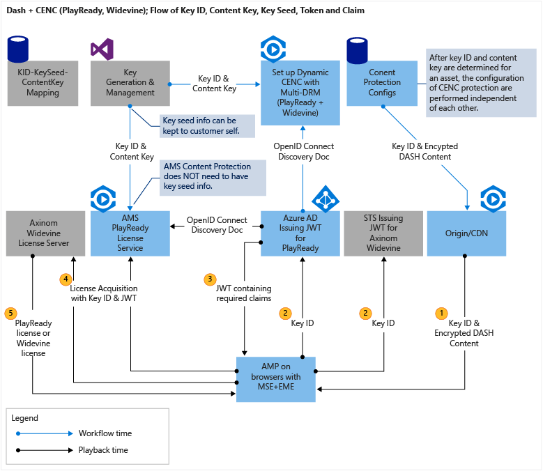

<properties 
    pageTitle="Mithilfe von Axinom Widevine Lizenzen Azure Media Services vorführen | Microsoft Azure" 
    description="Dieser Artikel beschreibt, wie Sie einen Stream vorführen, der dynamisch von AMS mit PlayReady und Widevine DRMs verschlüsselt ist Azure Media Services (AMS) verwenden können. Die Lizenz PlayReady stammt, von Medien Services PlayReady Lizenz-Server und Widevine Lizenz von Axinom Lizenzserver übermittelt wird." 
    services="media-services" 
    documentationCenter="" 
    authors="willzhan" 
    manager="dwrede" 
    editor=""/>

<tags 
    ms.service="media-services" 
    ms.workload="media" 
    ms.tgt_pltfrm="na" 
    ms.devlang="na" 
    ms.topic="article" 
    ms.date="09/26/2016"   
    ms.author="willzhan;Mingfeiy;rajputam;Juliako"/>

#Verwenden Axinom Widevine Lizenzen Azure Media Services vorführen  

> [AZURE.SELECTOR]
- [castLabs](media-services-castlabs-integration.md)
- [Axinom](media-services-axinom-integration.md)

##(Übersicht)

Azure Media Services (AMS) Google Widevine dynamischen Schutz hinzugefügt hat (Details finden Sie im [Blog des Mingfei](https://azure.microsoft.com/blog/azure-media-services-adds-google-widevine-packaging-for-delivering-multi-drm-stream/) ). Darüber hinaus hat Azure Media Player (AMP) auch Widevine Support hinzugefügt (Details finden Sie unter [AMP Dokument](http://amp.azure.net/libs/amp/latest/docs/) ). Dies ist bereits als große Leistung in streaming Gedankenstrich Inhalt geschützt durch CENC mit multi-native-DRM (PlayReady und Widevine) auf modernen Browsern mit MSE und EME ausgestattet.

Beginnend mit Media Services .NET SDK, Version 3.5.2, können Media Services Sie Widevine Lizenz Vorlage konfigurieren und Widevine Lizenzen erhalten. Sie können auch die folgenden AMS Partner verwenden, helfen Sie Lizenzen Widevine vorführen: [Axinom](http://www.axinom.com/press/ibc-axinom-drm-6/), [EZDRM](http://ezdrm.com/), [CastLabs](http://castlabs.com/company/partners/azure/).

Dieser Artikel beschreibt, wie integrieren und Testen Sie Widevine Lizenzserver von Axinom verwaltet werden. Insbesondere bedeckt sie:  

- Konfigurieren von dynamischen allgemeine Verschlüsselung mit Multi-DRM (PlayReady und Widevine) mit den entsprechenden Lizenz Acquisition URLs;
- Generieren einer JWT Token akzeptieren, um die Lizenz Server erfüllen;
- Entwickeln Azure Media Player app die Lizenz Acquisition mit JWT token Authentifizierung behandelt;

Die vollständige System und die Übermittlung von Inhalten, die Key, Key-ID, Key Startwert, JTW Token und seine Ansprüche am besten kann, indem Sie das folgende Diagramm beschrieben werden.

##Schutz von Inhalten

Zum Konfigurieren von dynamischen Schutz und Key Übermittlung Richtlinie, finden Sie unter Mingfeis Blog: [Widevine Verpackung mit Azure Media-Dienste zu konfigurieren](http://mingfeiy.com/how-to-configure-widevine-packaging-with-azure-media-services).

Sie können dynamische CENC Schutz für Gedankenstrich streaming beide der folgenden Probleme mit Multi-DRM konfigurieren:

1. PlayReady Schutz für MS Edge und IE11, die einen token Autorisierung Einschränkungen nutzen können. Die token eingeschränkte Richtlinie muss ein Token ausgestellt von einer Secure Token Service (STS), z. B. Azure Active Directory beizufügen.
1. Widevine Schutz für Chrome, können sie mit Token ausgestellt von einem anderen STS token Authentifizierung erforderlich. 

[JWT Token Generation](media-services-axinom-integration.md#jwt-token-generation) finden Sie im Abschnitt für Gründe für Axinoms Widevine Lizenzserver Azure Active Directory als ein STS verwendet werden kann.

###Aspekte

1. Verwenden Sie die angegebenen Axinom Key Startwert (8888000000000000000000000000000000000000) und der generierten oder ausgewählten wichtiger ID zum Generieren des Inhalts Schlüssels zum Übermittlungsdienst Key konfigurieren. Axinom-Lizenz-Server werden alle Lizenzen, die Inhalte basierend auf demselben Key Startwert, also für Test- und Herstellung gültig Schlüssel enthält ausgeben.
1. Die URL Widevine Lizenz Acquisition testen: [https://drm-widevine-licensing.axtest.net/AcquireLicense](https://drm-widevine-licensing.axtest.net/AcquireLicense). HTTP- und HTTS zulässig sind.

##Azure Media Player Vorbereitung

AMP v1.4.0 unterstützt die Wiedergabe von AMS Inhalten, die dynamisch mit PlayReady und Widevine DRM verpackt ist.
Wenn Widevine Lizenzserver keine token Authentifizierung erforderlich ist, wird nichts zusätzliche Sie tun müssen, um einen Gedankenstrich Inhalt durch Widevine geschützt zu testen. Ein Beispiel enthält das Team AMP ein einfaches [Beispiel](http://amp.azure.net/libs/amp/latest/samples/dynamic_multiDRM_PlayReadyWidevine_notoken.html), Stelle, an der Sie arbeiten mit Rand und IE11 mit PlayReady und Chrome mit Widevine angezeigt werden können.
Von Axinom bereitgestellten Widevine License Server erfordert JWT token Authentifizierung. Das JWT Token muss mit Lizenz Anforderung über einen HTTP-Header "X-AxDRM-Nachricht" übermittelt werden. Für diesen Zweck müssen Sie den folgenden JavaScript-Code in die Webseite Hostinganbieter AMP vor dem Einrichten der Quelle hinzufügen:

    

Die restlichen AMP Code ist standard AMP-API wie AMP Dokument [hier](http://amp.azure.net/libs/amp/latest/docs/).

Beachten Sie, dass das oben genannten Javascript für Einstellung benutzerdefinierte Autorisierung Kopf-noch eine kurzfristig Ansatz vor der offiziellen, langfristig Ansatz in AMP freigegeben wird.

##JWT Token der zweiten Generation

Axinom Widevine Lizenzserver Testzwecken ist token JWT-Authentifizierung erforderlich. Darüber hinaus ist eine der Ansprüche im Token JWT von einer komplexen Objekttyp statt primitiver Datentyp.

Leider kann Azure AD JWT Token nur mit Grundtypen ausgeben. .NET Framework-API (System.IdentityModel.Tokens.SecurityTokenHandler und JwtPayload) können auf ähnliche Weise nur Sie komplexe Objekttyp als Ansprüche Eingabemethoden. Die Ansprüche werden jedoch weiterhin als Zeichenfolge serialisiert. Daher können wir keinen der beiden zum Generieren des JWT Tokens für Widevine Lizenz Anforderung verwenden.

John Sheehans [JWT Nuget-Paket](https://www.nuget.org/packages/JWT) entspricht die Anforderungen, damit wir verwenden diese Nuget-Paket abgelegt werden.

Im folgenden ist der Code für Generieren von JWT Token mit der benötigten Ansprüchen je nach Bedarf von Axinom Widevine Lizenzserver Testzwecken ein:

    
    using System;
    using System.Collections.Generic;
    using System.Linq;
    using System.Web;
    using System.IdentityModel.Tokens;
    using System.IdentityModel.Protocols.WSTrust;
    using System.Security.Claims;
    
    namespace OpenIdConnectWeb.Utils
    {
        public class JwtUtils
        {
            //using John Sheehan's NuGet JWT library: https://www.nuget.org/packages/JWT/
            public static string CreateJwtSheehan(string symmetricKeyHex, string key_id)
            {
                byte[] symmetricKey = ConvertHexStringToByteArray(symmetricKeyHex);  //hex string to byte[] Note: Note that the key is a hex string, however it must be treated as a series of bytes not a string when encoding.
    
                var payload = new Dictionary<string, object>()
                             {
                                 { "version", 1 },
                                 { "com_key_id", System.Configuration.ConfigurationManager.AppSettings["ax:com_key_id"] },
                                 { "message", new { type = "entitlement_message", key_ids = new string[] { key_id } }  }
                             };
    
                string token = JWT.JsonWebToken.Encode(payload, symmetricKey, JWT.JwtHashAlgorithm.HS256);
    
                return token;
            }
    
            //convert hex string to byte[]
            public static byte[] ConvertHexStringToByteArray(string hexString)
            {
                if (hexString.Length % 2 != 0)
                {
                    throw new ArgumentException(String.Format(System.Globalization.CultureInfo.InvariantCulture, "The binary key cannot have an odd number of digits: {0}", hexString));
                }
    
                byte[] HexAsBytes = new byte[hexString.Length / 2];
                for (int index = 0; index < HexAsBytes.Length; index++)
                {
                    string byteValue = hexString.Substring(index * 2, 2);
                    HexAsBytes[index] = byte.Parse(byteValue, System.Globalization.NumberStyles.HexNumber, System.Globalization.CultureInfo.InvariantCulture);
                }
    
                return HexAsBytes;
            }
    
        }  
    
    }  

Axinom Widevine Lizenz-server

    <add key="ax:laurl" value="http://drm-widevine-licensing.axtest.net/AcquireLicense" />
    <add key="ax:com_key_id" value="69e54088-e9e0-4530-8c1a-1eb6dcd0d14e" />
    <add key="ax:com_key" value="4861292d027e269791093327e62ceefdbea489a4c7e5a4974cc904b840fd7c0f" />
    <add key="ax:keyseed" value="8888000000000000000000000000000000000000" />

###Aspekte

1.  Obwohl AMS PlayReady Lizenz Übermittlungsdienst erfordert "Person =" vor einem Authentifizierungstoken, Axinom Widevine Lizenzserver verwendet sie nicht.
2.  Der Schlüssel für die Kommunikation Axinom wird als Schlüssel signieren verwendet. Beachten Sie, dass die Taste eine hexadezimale Zeichenfolge, doch es beim Codierung als eine Reihe von Bytes keine Zeichenfolge behandelt werden muss. Dies wird durch die Methode ConvertHexStringToByteArray erreicht.

##Abrufen von Schlüssel-ID

Möglicherweise haben Sie bemerkt, dass der Code für das Generieren einer JWT token, Key-ID erforderlich ist. Da der JWT token muss bereit, bevor Sie laden AMP-Player werden wichtiger muss ID abgerufen werden, um JWT Token generieren.

ID des Kurses aus, es gibt mehrere Methoden zum Abrufen halten der Schlüssel Beispielsweise kann eine speichern key ID zusammen mit Inhaltsmetadaten in einer Datenbank. Oder Abrufen key ID aus Datei Gedankenstrich MPD (Medien Präsentation Beschreibung). Im folgenden Code wird für letztere.

    //get key_id from DASH MPD
    public static string GetKeyID(string dashUrl)
    {
        if (!dashUrl.EndsWith("(format=mpd-time-csf)"))
        {
            dashUrl += "(format=mpd-time-csf)";
        }
    
        XPathDocument objXPathDocument = new XPathDocument(dashUrl);
        XPathNavigator objXPathNavigator = objXPathDocument.CreateNavigator();
        XmlNamespaceManager objXmlNamespaceManager = new XmlNamespaceManager(objXPathNavigator.NameTable);
        objXmlNamespaceManager.AddNamespace("",     "urn:mpeg:dash:schema:mpd:2011");
        objXmlNamespaceManager.AddNamespace("ns1",  "urn:mpeg:dash:schema:mpd:2011");
        objXmlNamespaceManager.AddNamespace("cenc", "urn:mpeg:cenc:2013");
        objXmlNamespaceManager.AddNamespace("ms",   "urn:microsoft");
        objXmlNamespaceManager.AddNamespace("mspr", "urn:microsoft:playready");
        objXmlNamespaceManager.AddNamespace("xsi",  "http://www.w3.org/2001/XMLSchema-instance");
        objXmlNamespaceManager.PushScope();
    
        XPathNodeIterator objXPathNodeIterator;
        objXPathNodeIterator = objXPathNavigator.Select("//ns1:MPD/ns1:Period/ns1:AdaptationSet/ns1:ContentProtection[@value='cenc']", objXmlNamespaceManager);
    
        string key_id = string.Empty;
        if (objXPathNodeIterator.MoveNext())
        {
            key_id = objXPathNodeIterator.Current.GetAttribute("default_KID", "urn:mpeg:cenc:2013");
        }
    
        return key_id;
    }

##Zusammenfassung

Mit der neuesten Zusatz von Widevine Unterstützung in Azure Media Services Content Protection und Azure Media Player können wir implementieren streaming Gedankenstrich + Multi-native-DRM (PlayReady + Widevine) für beide PlayReady Lizenz-Dienst in AMS und Widevine Lizenzserver als Axinom für die folgenden moderne Browser:

- Chrome
- Microsoft Windows 10 Kante
- IE 11 unter Windows 8.1 und Windows 10
- Firefox (Desktop), und Safari auf einem Mac (nicht iOS) werden auch über Silverlight und dieselbe URL mit Azure Media Player unterstützt.

Die folgenden Parameter werden in Mini Lösung Nutzung von Axinom Widevine License Server erforderlich ist. Eine Ausnahme bilden jedoch Schlüssel-ID, die restlichen Parameter werden von bereitgestellt Axinom basierend auf deren Widevine Server einrichten.

Parameter|Wie sie genutzt werden
---|---
Kommunikation key-ID|Als Wert des anfordern "Com_key_id" im JWT Token einbezogen werden muss ( [in diesem](media-services-axinom-integration.md#jwt-token-generation) Abschnitt finden Sie unter).
Schlüssel für die Kommunikation|Als den signierenden Schlüssel JWT Token verwendet werden muss ( [in diesem](media-services-axinom-integration.md#jwt-token-generation) Abschnitt finden Sie unter).
Key Startwert|Muss verwendet werden, um Inhalt Schlüssel mit dem angegebenen Inhalt zu erzeugen key ID ( [in diesem](media-services-axinom-integration.md#content-protection) Abschnitt finden Sie unter).
Widevine Lizenz Acquisition-URL|Muss in konfigurieren Anlage Übermittlung Richtlinie für Gedankenstrich streaming (siehe [dieser](media-services-axinom-integration.md#content-protection) Abschnitt) verwendet werden.
Inhalt Schlüssel-ID|Muss als Teil des Werts über Anspruch Nachricht Inanspruchnahme einer JWT Token enthalten ( [in diesem](media-services-axinom-integration.md#jwt-token-generation) Abschnitt finden Sie unter). 

##Media-Dienste Learning Wege

[AZURE.INCLUDE [media-services-learning-paths-include](../../includes/media-services-learning-paths-include.md)]

##Angeben von feedback

[AZURE.INCLUDE [media-services-user-voice-include](../../includes/media-services-user-voice-include.md)]

###Danksagungen 

Wir bestätigen Sie die folgenden Personen, die eine bestimmte Abteilung in Richtung dieses Dokument erstellen möchten: Kristjan Jõgi von Axinom, Mingfei Yan und Amit Rajput.
