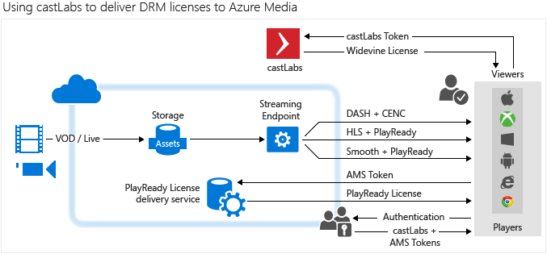

<properties 
    pageTitle="Mithilfe von CastLabs Widevine Lizenzen Azure Media Services vorführen | Microsoft Azure" 
    description="Dieser Artikel beschreibt, wie Sie einen Stream vorführen, der dynamisch von AMS mit PlayReady und Widevine DRMs verschlüsselt ist Azure Media Services (AMS) verwenden können. Die Lizenz PlayReady stammt, von Medien Services PlayReady Lizenz-Server und Widevine Lizenz von CastLabs Lizenzserver übermittelt wird." 
    services="media-services" 
    documentationCenter="" 
    authors="Mingfeiy" 
    manager="erikre" 
    editor=""/>

<tags 
    ms.service="media-services" 
    ms.workload="media" 
    ms.tgt_pltfrm="na" 
    ms.devlang="na" 
    ms.topic="article" 
    ms.date="09/26/2016"  
    ms.author="Mingfeiy;willzhan;Juliako"/>

#Verwenden CastLabs Widevine Lizenzen Azure Media Services vorführen

> [AZURE.SELECTOR]
- [Axinom](media-services-axinom-integration.md)
- [castLabs](media-services-castlabs-integration.md)

##(Übersicht)

Dieser Artikel beschreibt, wie Sie einen Stream vorführen, der dynamisch von AMS mit PlayReady und Widevine DRMs verschlüsselt ist Azure Media Services (AMS) verwenden können. Die Lizenz PlayReady stammt, von Medien Services PlayReady Lizenz-Server und Widevine Lizenz von **CastLabs** Lizenzserver übermittelt wird.

Wiedergabe streaming von Inhalten durch CENC (PlayReady und/oder Widevine) geschützt ist können Sie [Azure Media Player](http://amsplayer.azurewebsites.net/azuremediaplayer.html)verwenden. Details finden Sie unter [AMP Dokument](http://amp.azure.net/libs/amp/latest/docs/) .

Das folgende Diagramm veranschaulicht, einen auf hoher Ebene Azure Media Services und CastLabs Integrationsarchitektur.

##Einrichten von Systemdateien

- Medieninhalten wird in AMS gespeichert.
- Key-IDs von Inhalten Tasten sind CastLabs und AMS gespeichert.
- haben CastLabs und AMS token integrierte Authentifizierung. In den folgenden Abschnitten erläutern Authentifizierungstoken. 
- Bei einer Client-Anfragen in Stream das Video, wird der Inhalt verschlüsselt dynamisch mit **Allgemeine Verschlüsselung** (CENC) und dynamisch durch AMS interpolierten Streaming und Gedankenstrich verpackt. Wir bieten außerdem PlayReady M2TS Mitarbeit Streamverschlüsselung für HLS streaming-Protokoll.
- PlayReady Lizenz wird von AMS Lizenzserver abgerufen und Widevine Lizenz wird von CastLabs Lizenzserver abgerufen. 
- Media Player beschließt automatisch an, welche Lizenz abgerufen werden sollen auf der Client-Plattform-Funktion basiert. 

##Authentifizierung token Generation für den Abruf von einer Lizenz

Sowohl die CastLabs AMS unterstützen JWT (JSON Web Token) token Format verwendet, um eine Lizenz zu autorisieren. 

###JWT Token in AMS 

Die folgende Tabelle beschreibt die JWT Token in AMS. 

Herausgeber|Herausgeber Verbindungszeichenfolge aus der ausgewählten Secure Token Service (STS)
---|---
Zielgruppe|Zielgruppe Verbindungszeichenfolge aus der verwendeten STS
Ansprüche|Eine Reihe von Ansprüchen
Nicht vor|Starten Sie die Gültigkeit der token
Läuft ab|Ende der Token Gültigkeit
SigningCredentials|Der Schlüssel, der zwischen PlayReady License Server, CastLabs License Server und STS, freigegeben ist dies möglicherweise entweder symmetrische oder asymmetrische Schlüssel.

###JWT Token in castLabs

Die folgende Tabelle beschreibt die JWT Token in CastLabs. 

Namen|Beschreibung
---|---
optData|Eine JSON-Zeichenfolge, die persönliche Informationen enthält. 
CRT|Eine JSON-Zeichenfolge mit Informationen über die Anlage, deren Lizenzrechte Informationen und abspielen.
IAT|Der aktuelle Datetime in Epoche.
JTI|Ein eindeutiger Bezeichner über dieses Token (jeder Token kann nur einmal im CastLabs System verwendet werden).

##Beispiel-Lösung einrichten 

Die [Stichprobe Lösung](https://github.com/AzureMediaServicesSamples/CastlabsIntegration) besteht aus zwei Projekte:

-   Eine Console-app, die zum Festlegen von DRM Einschränkungen auf Anlage bereits Motor angesaugten für PlayReady und Widevine verwendet werden kann.
-   Eine Anwendung, die sich Token, Hände, die als eine sehr vereinfacht Version von einem STS angesehen werden könnten.

So verwenden Sie die Console-Anwendung

1.  Ändern der app.config um AMS Anmeldeinformationen, CastLabs Anmeldeinformationen, STS Konfiguration und gemeinsamen Schlüssel für die Einrichtung an.
2.  Hochladen einer Anlageguts in AMS an.
3.  Rufen Sie die UUID in die hochgeladene Anlage, und ändern Sie die Zeile 32 in der Datei Program.cs:

         var objIAsset = _context.Assets.Where(x => x.Id == "nb:cid:UUID:dac53a5d-1500-80bd-b864-f1e4b62594cf").FirstOrDefault();

4.  Verwenden Sie eine Posten-ID für die Benennung von der Anlage im CastLabs System (Zeile 44 in der Datei Program.cs) ein.

    Sie müssen Posten-ID für **CastLabs**festlegen. Es muss eine eindeutige alphanumerische Zeichenfolge sein.

5.  Führen Sie das Programm.

So verwenden Sie die Web-Anwendung (STS)

1.  Ändern der web.config Setup Castlabs Händler-ID, die Konfiguration STS und den freigegebenen Schlüssel.
2.  Bereitstellen Sie für Azure Websites.
3.  Navigieren Sie zu der Website an.

##Wiedergeben eines Videos

Wiedergabe eines Videos mit allgemeine Verschlüsselung betreiben (PlayReady und/oder Widevine) können Sie die [Azure Media Player](http://amsplayer.azurewebsites.net/azuremediaplayer.html)verwenden. Wenn Sie die app Console ausführen zu können, sind die Inhalte Schlüssel-ID und die URL Manifest wiedergegeben.

1.  Öffnen einer neuen Registerkarte, und starten Sie Ihr STS: http://[yourStsName].azurewebsites.net/api/token/assetid/[yourCastLabsAssetId]/contentkeyid/[thecontentkeyid].
2.  Wechseln Sie zur [Azure MediaPlayer](http://amsplayer.azurewebsites.net/azuremediaplayer.html).
3.  Fügen Sie das streaming-URL ein.
4.  Klicken Sie auf das Kontrollkästchen **Erweiterte Optionen** .
5.  Wählen Sie in der Dropdownliste den **Schutz** PlayReady und/oder Widevine aus.
6.  Fügen Sie das Token, das Sie von Ihrem STS in das Textfeld Token erhalten haben. 
    
    CastLab License Server muss nicht die "Person =" Präfix vor dem Token. So entfernen Sie, die vor dem Senden des Tokens.
7.  Aktualisieren Sie die Medienwiedergabe verwendet.
8.  Das Video sollte wiedergegeben werden.

##Media-Dienste Learning Wege

[AZURE.INCLUDE [media-services-learning-paths-include](../../includes/media-services-learning-paths-include.md)]

##Angeben von feedback

[AZURE.INCLUDE [media-services-user-voice-include](../../includes/media-services-user-voice-include.md)]
