<properties 
    pageTitle="CENC mit Multi-DRM und Access-Steuerelement: ein Bezug Entwurf und Implementierung auf Azure und Azure Media-Dienste | Microsoft Azure" 
    description="Informationen zur Lizenzierung von Microsoft® interpolierten Streaming Client Portieren Kit." 
    services="media-services" 
    documentationCenter="" 
    authors="willzhan"  
    manager="erikre" 
    editor=""/>

<tags 
    ms.service="media-services" 
    ms.workload="media" 
    ms.tgt_pltfrm="na" 
    ms.devlang="na" 
    ms.topic="article" 
    ms.date="09/26/2016"  
    ms.author="willzhan;kilroyh;yanmf;juliako"/>

#CENC mit Multi-DRM und Access-Steuerelement: ein Bezug Entwurf und Implementierung auf Azure und Azure Media-Dienste

##Schlüsselwörter
 
Azure Active Directory, Azure Media Services, Azure Media Player, Dynamic-Verschlüsselung Lizenz Übermittlung PlayReady, Widevine, FairPlay, allgemeine Encryption(CENC), Multi-DRM, Axinom, Gedankenstrich, EME, MSE, JSON Web Token (JWT), Ansprüche, modernen Browsern, Schlüssel Rollover, symmetrischen Schlüssel, asymmetrische Schlüssel, OpenID verbinden, X509 Zertifikat. 

##In diesem Artikel

In diesem Artikel werden die folgenden Themen behandelt:

- [Einführung](media-services-cenc-with-multidrm-access-control.md#introduction)
    - [In diesem Artikel im Überblick](media-services-cenc-with-multidrm-access-control.md#overview-of-this-article)
- [Ein Verweis-design](media-services-cenc-with-multidrm-access-control.md#a-reference-design)
- [Zuordnung Entwurf Implementierung-Technologie](media-services-cenc-with-multidrm-access-control.md#mapping-design-to-technology-for-implementation)
- [Implementierung](media-services-cenc-with-multidrm-access-control.md#implementation)
    - [Implementierung Verfahren](media-services-cenc-with-multidrm-access-control.md#implementation-procedures)
    - [Einige Tricks in Implementierung](media-services-cenc-with-multidrm-access-control.md#some-gotchas-in-implementation)
- [Weitere Themen Implementierung](media-services-cenc-with-multidrm-access-control.md#additional-topics-for-implementation)
    - [HTTP oder HTTPS](media-services-cenc-with-multidrm-access-control.md#http-or-https)
    - [Azure-Active Directory signieren Key rollover](media-services-cenc-with-multidrm-access-control.md#azure-active-directory-signing-key-rollover)
    - [Wo befindet sich die Access-Token?](media-services-cenc-with-multidrm-access-control.md#where-is-the-access-token)
    - [Wissenswertes zum Live Streaming?](media-services-cenc-with-multidrm-access-control.md#what-about-live-streaming)
    - [Wissenswertes zu Lizenzservern außerhalb Azure Media Services](media-services-cenc-with-multidrm-access-control.md#what-about-license-servers-outside-of-azure-media-services)
    - [Was geschieht, wenn ich einen benutzerdefinierten STS verwenden möchte?](media-services-cenc-with-multidrm-access-control.md#what-if-i-want-to-use-a-custom-sts)
- [Abgeschlossene und Testen Sie es](media-services-cenc-with-multidrm-access-control.md#the-completed-system-and-test)
    - [Anmeldung des Benutzers](media-services-cenc-with-multidrm-access-control.md#user-login)
    - [Verwenden von verschlüsselten Medien Erweiterungen für PlayReady](media-services-cenc-with-multidrm-access-control.md#using-encrypted-media-extensipons-for-playready)
    - [Mithilfe von EME für Widevine](media-services-cenc-with-multidrm-access-control.md#using-eme-for-widevine)
    - [Nicht berechtigt, von Benutzern](media-services-cenc-with-multidrm-access-control.md#not-entitled-users)
    - [Ausführen von benutzerdefinierten Secure Token Service](media-services-cenc-with-multidrm-access-control.md#running-custom-secure-token-service)
- [Zusammenfassung](media-services-cenc-with-multidrm-access-control.md#summary)

##Einführung

Es ist bekannt, dass es ist eine komplexe Aufgabe entwerfen und erstellen ein Subsystem DRM für eine OTT oder online streaming-Lösung. Und es ist üblich für Operatoren/online video Anbieter dieses Teils für spezielle DRM Dienstanbieter überlassen. Das Ziel dieses Dokuments ist ein Bezug-Planung und Implementierung von End-to-End-DRM Subsystem OTT oder online streaming Lösung darstellen.

Ingenieure im DRM Subsystem OTT online streaming/multi-screen Lösungen oder alle Leser DRM Subsystem interessiert sind die gezielte Leser dieses Dokuments. Ausgegangen ist, dass die Leser mit mindestens eines der DRM Technologien auf dem Markt, wie beispielsweise PlayReady, Widevine, FairPlay oder Adobe Access vertraut sind.

Durch DRM einbeziehen wir auch CENC (Allgemeine Verschlüsselung) mit Multi-DRM. Ein Haupt-Trend online streaming und OTT Branche besteht darin, verwenden CENC mit multi-native-DRM auf verschiedenen Client-Plattformen, welche ist eine Schicht aus der vorherigen Trend der Verwendung eines einzelnen DRM und dessen Client SDK für verschiedene Client-Plattformen. Bei der CENC mit mehreren native DRM sind sowohl PlayReady und Widevine nach der Spezifikation der [Allgemeinen Verschlüsselung (ISO/IEC 23001 bis 7 CENC)](http://www.iso.org/iso/home/store/catalogue_ics/catalogue_detail_ics.htm?csnumber=65271/) verschlüsselt.

Die Vorteile von CENC mit Multi-DRM werden wie folgt aus:

1. Reduziert Kosten, da Verarbeitung von einer einzelnen Verschlüsselung verwendet wird, für andere Plattformen mit seiner systemeigenen DRMs Verschlüsselung;
1. Verringert die Kosten der Verwaltung von verschlüsselter Posten, da nur ein einzelnes Dokument von verschlüsselten Ressourcen benötigt wird;
1. Entfällt DRM Client Lizenzierung Kosten, da der native Client DRM normalerweise auf seiner einheitlichen Plattform frei ist.

Microsoft wurde einer aktiven Promoter Gedankenstrich und CENC zusammen mit einige Unternehmen der wichtigsten Branche zusammen. Unterstützung von Gedankenstrich und CENC weist Microsoft Azure Media Services liefert. Zuletzt verwendete Ankündigungen, finden Sie unter Mingfeis Blogs: [Ankündigung von Google Widevine Lizenz Übermittlung Services in Azure Media Services](https://azure.microsoft.com/blog/announcing-general-availability-of-google-widevine-license-services/)und [Azure Media Services fügt Google Widevine Verpackung Zielcomputern Multi-DRM Stream hinzu](https://azure.microsoft.com/blog/azure-media-services-adds-google-widevine-packaging-for-delivering-multi-drm-stream/).  

### In diesem Artikel im Überblick

Das Ziel dieses Artikels enthält Folgendes:

1. Stellt ein Bezug des DRM Subsystems CENC mit Multi-DRM verwenden;
1. Stellt eine Verweis-Implementierung auf Microsoft Azure/Azure Media Services-Plattform bereit.
1. Werden einige Themen Planung und Implementierung.

In diesem Artikel werden "Multi-DRM" folgende Themen behandelt:

1. Microsoft PlayReady
1. Google Widevine
1. Apple-FairPlay (noch nicht unterstützt von Azure Media Services)

In der folgenden Tabelle werden die app einheitlichen Plattform/systemeigene und durch jeden DRM unterstützten Browser zusammengefasst.

**Client-Plattform**|**Unterstützung für systemeigene DRM**|**Browser-App**|**Streaming-Formate**
----|------|----|----
**Smart-TVs, Operator STB, OTT STB**|PlayReady hauptsächlich, und/oder Widevine und/oder andere|Linux, Opera, WebKit, andere|Verschiedene Formate
**Windows-10-Geräte (Windows-PC, Windows-Tablets, Windows Phone, Xbox)**|PlayReady|MS Kante/IE11/EME   UWP|Gedankenstrich (für HLS, PlayReady wird nicht unterstützt)  Gedankenstrich, interpolierten Streaming (für HLS, PlayReady wird nicht unterstützt) 
**Android-Geräten (Telefon, Tablet, Fernsehen)**|Widevine|Chrome/EME|GEDANKENSTRICH
**iOS (iPhone, iPad), OS X-Clients und Apple-TV**|FairPlay|Safari 8 + / EME|HLS
**-Plug-Ins: Adobe-vorzeigbare**|Vorzeigbare Zugriff|Browser-Plug-Ins|HDS, HLS

In Anbetracht der aktuelle Status der Bereitstellung für jedes DRM wird ein Dienst in der Regel möchten 2 oder 3 DRMs, um sicherzustellen, dass Sie alle Arten von Endpunkten in die beste Methode Adresse implementieren.

Es gibt eine Wechselbeziehung zwischen der Komplexität der die Logik und die Komplexität clientseitig ein gewisses Benutzerfunktionalität auf den verschiedenen Clients erreicht haben.

Wenn Sie Ihre Auswahl getroffen haben, beachten Sie Folgendes:

- PlayReady ist systembedingt in jeder Windows-Gerät auf einige Android-Geräten und verfügbar bis Software SDKs auf nahezu jeder Plattform implementiert werden.
- Widevine ist systembedingt in jeder Android-Gerät, Chrome und einige andere Geräte implementiert.
- FairPlay steht nur für iOS und Mac OS-Clients oder über iTunes.

Eine typische Multi-DRM würde folgendermaßen aussehen:

- Option 1: PlayReady und Widevine
- Option 2: PlayReady, Widevine und FairPlay

## Ein Verweis-design

In diesem Abschnitt werden wir einen Verweis Entwurf präsentieren also unabhängig von Technologies verwendet, um es zu implementieren.

Ein DRM-Subsystem kann die folgenden Komponenten enthalten:

1. Key-Verwaltung
1. DRM Verpackung
1. DRM Lizenz Übermittlung
1. Ansprüche überprüfen
1. Authentifizierung/Autorisierung
1. Player
1. Origin/CDN

Das folgende Diagramm veranschaulicht, die auf hoher Ebene Interaktion zwischen den Komponenten in einem DRM Subsystem.

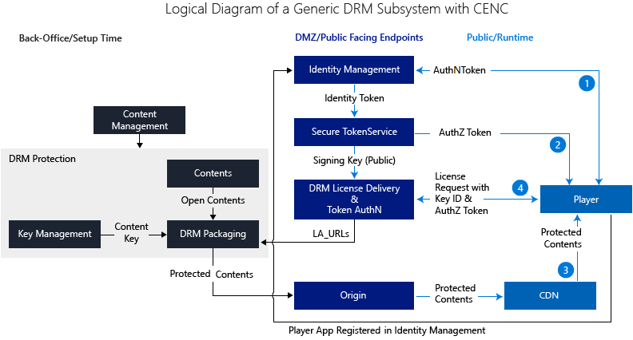
 
Es gibt drei grundlegende "Ebenen" in das Design ein:

1. Sichern von Office Layer (in Schwarz), die extern nicht verfügbar gemacht werden.
1. "DMZ" Layer (Blau), die alle enthält die Endpunkte gegenüberliegende öffentlichen;
1. Öffentliche Internetebene (hellblau) mit CDN und Spieler mit den Datenverkehr öffentlichen Internet.
 
Eine Content Management-Tool für DRM Schutz steuern sollten, unabhängig davon statische oder dynamische Verschlüsselung. Die Eingaben für die Verschlüsselung der DRM sollte umfassen:

1. MBR-Videoinhalt;
1. Inhalt Schlüssel;
1. Lizenz Acquisition URLs.

Während der Wiedergabe erfolgt die auf hoher Ebene:

1. Benutzer authentifiziert wird.
1. Autorisierungstoken wird für den Benutzer erstellt.
1. DRM-geschützte Inhalte (Manifest) werden in Player heruntergeladen;
1. Player übermittelt Lizenz Acquisition-Anforderung zur Lizenzservers zusammen mit Key-ID und Autorisierung token.

Bevor Sie mit dem nächsten Thema, über die Gestaltung von Key-Verwaltung ein Paar Wörter verschieben.

**ContentKey – zu-Objekt**|**Szenario**
------|---------------------------
1: 1 –|Die einfachste Fall. Die besten Kontrolle darüber. Aber im Allgemeinen wird dadurch die höchste Lizenz Übermittlung Kosten. Bei minimalen eine Lizenz ist Anfrage für jede geschützten Anlage erforderlich.
1: N –|Sie können den gleichen Inhalten Schlüssel für mehrere Anlagen verwenden. Für alle Anlagen in einer logischen Gruppe wie Genre oder Teilmenge der Genre (oder Film Gens) verwenden Sie beispielsweise einen einzigen Content Schlüssel.
N – 1|Mehrere Inhalt Schlüssel sind für jedes Objekt erforderlich.   Wenn Sie dynamische CENC-Schutz mit Multi-DRM für MPEG-Strich und dynamische AES-128 Verschlüsselung für HLS anwenden müssen, benötigen Sie zwei separate Inhalt Schlüssel, jede mit einem eigenen ContentKeyType. (Für den Inhalt Schlüssel zum Schutz vor dynamischen CENC verwendet, sollten ContentKeyType.CommonEncryption verwendet haben, klicken Sie für den Inhalt Schlüssel für die Verschlüsselung der dynamischen AES-128, sollte ContentKeyType.EnvelopeEncryption verwendet werden.)  Ein weiteres Beispiel, in CENC Schutz von Inhalten Gedankenstrich, in der Theorie eine, die Inhalt-Taste zum Schutz von Videodatenstrom und ein anderer Inhalt zur Audiodatenstrom schützen verwendet werden kann. 
Viele – bis - viele|Kombination der beiden obigen Szenarios: eine Reihe von Inhalten Tasten werden für jede der mehrere Anlagen in der gleichen Anlage "Gruppe" verwendet.

Ein weiterer wichtiger Faktor zu berücksichtigen ist die Verwendung von Lizenzen beständigen und nicht beständige.

Warum sind folgende Aspekte wichtig? 

Wenn Sie öffentliche Cloud für die Lizenz Übermittlung verwenden, sind diese direkten Einfluss Lizenz Übermittlung Kosten. Sehen Sie sich die folgenden zwei verschiedenen Entwurf Fällen zu veranschaulichen:

1. Monatliches Abonnement: Verwenden von beständigen Lizenz und 1: n-Inhalt Key-Objekt-Zuordnung. Z. B. für alle Kinder Filme verwenden wir einen einzelnen Inhalten Schlüssel für die Verschlüsselung. In diesem Fall: 

    Gesamte # Lizenzen für alle Kinder Filme/Gerät angefordert = 1

1. Monatliches Abonnement: Verwenden Sie nicht beständige Lizenz und 1: 1-Zuordnung zwischen Content-Taste und die Anlage. In diesem Fall:

    Gesamte # Lizenzen für alle Kinder Filme/Gerät angefordert = [# Filme beobachtete] x [# Sitzungen]

Wie Sie ganz einfach sehen können, führen die zwei verschiedenen Designs dar sehr unterschiedliche Lizenz Anforderung Muster daher Lizenz Übermittlung Kosten, wenn die Lizenz Übermittlungsdienst von einer öffentlichen Cloud wie Azure Media Services bereitgestellt wird.

## Zuordnung Entwurf Implementierung-Technologie

Als Nächstes ordnen Sie wir unsere generische Entwurf Technologien auf Microsoft Azure/Azure Media Services-Plattform, indem Sie welche Technologie für jede Baustein verwendet.

Die folgende Tabelle zeigt die Zuordnung an:

**Baustein**|**Technologie**
------|-------
**Player**|[Azure MediaPlayer](https://azure.microsoft.com/services/media-services/media-player/)
**Identitätsanbieter (IDP)**|Azure-Active Directory
**Secure Token Service (STS)**|Azure-Active Directory
**DRM Schutz Workflow**|Azure Media Services dynamischen Schutz
**DRM Lizenz Übermittlung**|1. Azure Media Services Lizenz Übermittlung (PlayReady, Widevine, FairPlay), oder  2. Axinom Lizenz-Server  3 individuelle PlayReady License Server
**Origin**|Azure Media Services Streaming Endpunkt
**Key-Verwaltung**|Für die Verweis-Implementierung benötigt nicht
**Content Management**|Eine C#-Console-Anwendung

Kurzum, werden sowohl Identität Anbieter (IDP) und Secure Token Service (STS) Azure AD. Für Player verwenden wir [Azure Media Player-API](http://amp.azure.net/libs/amp/latest/docs/). Sowohl Azure Media Services und Azure Media Player unterstützt Gedankenstrich und CENC mit Multi-DRM.

Das folgende Diagramm zeigt die allgemeine Struktur und Flow mit den oben angegebenen Technologie-Zuordnung an.

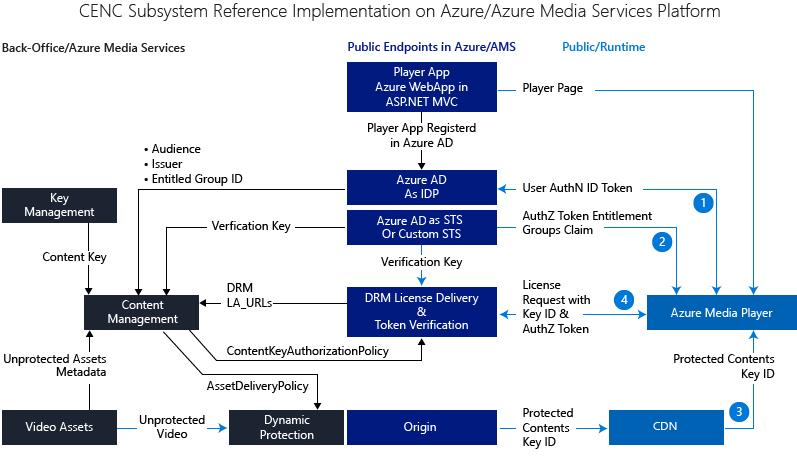

Um dynamische CENC Verschlüsselung eingerichtet haben, wird das Content Management-Tool die folgenden Eingaben verwenden:

1. Öffnen der Inhalte;
1. Inhalt Key von Key Generation/Management;
1. Lizenz Acquisition URLs;
1. Eine Liste der Informationen aus dem Azure Active Directory.

Die Ausgabe des Content Management-Tools werden:

1. ContentKeyAuthorizationPolicy, enthält die Spezifikation auf wie Lizenz Übermittlung ein JWT Token und DRM Lizenz Spezifikationen überprüft;
1. AssetDeliveryPolicy, Spezifikationen Streaming Format, DRM Schutz und Lizenz Acquisition-URLs enthält.

Während der Laufzeit des Ablaufs als ist unter:

1. Bei der Benutzerauthentifizierung wird ein JWT Token generiert;
1. Eine der im JWT Token enthaltenen Ansprüche ist "Gruppen" anfordern, die die Gruppe Objekt-ID "EntitledUserGroup" enthält. Dieser Anspruch wird für die Übergabe "Anspruch Kontrollkästchen" verwendet werden.
1. Player Downloads Clientmanifest von einem CENC geschützter Inhalte und "sieht" Folgendes:
    1. wichtiger-ID 
    1. der Inhalt ist CENC geschützt werden,
    1. Lizenz Acquisition URLs.

1. Player führt die Anforderung einer Lizenz Acquisition basierend auf dem Browser/DRM unterstützt. In der Lizenz Acquisition Anforderung, key-ID und das Token JWT auch gesendet wird. Lizenz Übermittlung Service prüft das JWT Token und die Ansprüche enthalten sind, bevor Sie die Lizenz erforderlich.

##Implementierung

###Implementierung Verfahren

Die Implementierung umfasst die folgenden Schritte aus:

1. Vorbereiten der Stapelverarbeitung enthaltenen Test Integration: Testvideo auf Multi-Bitrate codieren/Paket fragmentiert MP4 in Azure Media-Dienste. Dieses Objekt ist nicht DRM geschützt. DRM Schutz wird von dynamischen Schutz später ausgeführt werden.
1. Erstellen von Key-ID und Inhalt Key (optional von Key Startwert). Für unsere Zwecke Schlüsselverwaltungsdienst-System ist nicht erforderlich, da wir nur einen einzigen Satz von zuständig sind die wichtigsten-ID und Inhalt Schlüssel für verschiedene Test Vermögenswerte;
1. Verwenden Sie AMS-API, Multi-DRM Lizenz Übermittlung Services für die Anlage Test konfigurieren. Wenn Sie benutzerdefinierte Lizenzservers durch Ihr Unternehmen oder Lieferanten Ihres Unternehmens, statt Lizenz Services in Azure Media-Dienste verwenden, können Sie diesen Schritt überspringen und Lizenz Acquisition URLs im Schritt zum Konfigurieren der Lizenz Übermittlung angeben. AMS-API ist erforderlich, um anzugeben, dass einige Konfigurationen, wie z. B. Autorisierung Richtlinie Einschränkung, Lizenz Antwort Vorlagen für verschiedene DRM Lizenz Dienste usw. detaillierte. Zu diesem Zeitpunkt bietet das Azure-Portal noch die benötigte Benutzeroberfläche für diese Konfiguration keine. API Ebene Informationen zu finden und Code in Julia Kornichs Dokuments (Beispiel): [mithilfe von PlayReady und/oder Widevine dynamische allgemeine Verschlüsselung](media-services-protect-with-drm.md). 
1. Verwenden Sie AMS-API so konfigurieren Sie die Anlage Übermittlung Richtlinie für den Test-Objekt aus. API Ebene Informationen zu finden und Code in Julia Kornichs Dokuments (Beispiel): [mithilfe von PlayReady und/oder Widevine dynamische allgemeine Verschlüsselung](media-services-protect-with-drm.md).
1. Erstellen Sie und konfigurieren Sie einer Azure Active Directory-Mandanten in Azure;
1. Erstellen Sie ein paar Benutzerkonten und Gruppen in Ihrem Mandanten Azure Active Directory: Erstellen Sie mindestens "EntitledUser" Gruppieren und Hinzufügen eines Benutzers zu dieser Gruppe. Benutzer in dieser Gruppe Lizenz Acquisition Anspruch Kontrollkästchen übergibt und Benutzer nicht in dieser Gruppe tritt ein Kontrollkästchen Authentifizierung übergeben, und ist nicht möglich, eine Lizenz zu erwerben. Zur Mitgliedschaft in dieser Gruppe "EntitledUser" ist ein Anspruch erforderlichen "Gruppen" im JWT Token ausgestellt von Azure AD. Diese Anforderung anfordern sollte in Multi-DRM Lizenz Übermittlung Services Schritt konfigurieren angegeben werden muss.
1. Erstellen einer ASP.NET-MVC app, die Hosten von Ihrem Videoplayer. Diese app ASP.NET wird mit Benutzerauthentifizierung für den Mandanten Azure Active Directory geschützt werden. Gemischte Ansprüche werden in nach Benutzerauthentifizierung erhaltenen Access Token enthalten sein. OpenID verbinden API empfiehlt sich für diesen Schritt. Sie müssen die folgenden NuGet Pakete zu installieren:
    - Installieren-Paket Microsoft.Azure.ActiveDirectory.GraphClient
    - Installieren-Paket Microsoft.Owin.Security.OpenIdConnect
    - Installieren-Paket Microsoft.Owin.Security.Cookies
    - Installieren-Paket Microsoft.Owin.Host.SystemWeb
    - Installieren-Paket Microsoft.IdentityModel.Clients.ActiveDirectory
1. Erstellen Sie einen Player mit [Azure Media Player-API](http://amp.azure.net/libs/amp/latest/docs/). [Azure Media Player ProtectionInfo API](http://amp.azure.net/libs/amp/latest/docs/) können Sie angeben, welche Technologie DRM auf anderen DRM Plattform verwendet.
1. Testmatrix:

**DRM**|**Browser**|**Ergebnis für berechtigt Benutzer**|**Ergebnis für dauerhaften berechtigt Benutzer**
---|---|-----|---------
**PlayReady**|MS Kante oder IE11 auf Windows-10|Erfolgreich ausgeführt werden kann|Möglicher Fehler
**Widevine**|Chrome unter Windows 10|Erfolgreich ausgeführt werden kann|Möglicher Fehler
**FairPlay** |TBD||

George Trifonov Azure Media Services Teams geschrieben hat einen detaillierten Schritte beim Einrichten des Azure Active Directory für eine ASP.NET-MVC Player app bereitstellen Blog: [integrieren Azure Media Services OWIN MVC Grundlage app mit Azure Active Directory und Bereitstellung von Inhalten basierend auf JWT Ansprüche einschränken](http://gtrifonov.com/2015/01/24/mvc-owin-azure-media-services-ad-integration/).

Georg hat auch einen Blog auf [JWT token Authentifizierung in Azure Media Services und dynamische Verschlüsselung](http://gtrifonov.com/2015/01/03/jwt-token-authentication-in-azure-media-services-and-dynamic-encryption/)geschrieben werden. Und so sieht seine [Stichprobe auf Azure AD-Integration in Key Übermittlung Azure Media-Dienste](https://github.com/AzureMediaServicesSamples/Key-delivery-with-AAD-integration/).

Informationen zum Azure Active Directory:

- Sie können Informationen für Entwickler in [Azure Active Directory Developer's Guide](../active-directory/active-directory-developers-guide.md)suchen.
- Sie können Informationen für Administratoren im [Verwalten Ihrer Azure AD-Verzeichnis](../active-directory/active-directory-administer.md)suchen.

### Einige Tricks in Implementierung

Es gibt einige "Tricks" in der Implementierung. Hoffentlich hilft die folgende Liste von "Tricks" Ihnen zur Problembehandlung für den Fall, dass Sie Probleme auftreten.

1. **Herausgeber** URL muss mit **"/"**enden.  

    **Zielgruppe** sollte die Player-Client-ID und sollten Sie auch **"/"** am Ende der URL des Herausgebers hinzufügen.

        <add key="ida:audience" value="[Application Client ID GUID]" />
        <add key="ida:issuer" value="https://sts.windows.net/[AAD Tenant ID]/" /> 

    [JWT Decoder](http://jwt.calebb.net/)sollten Sie **also** und **Iss** als unten im Token JWT angezeigt werden:
    
    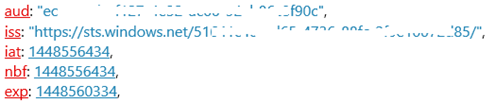

2. Hinzufügen von Berechtigungen zur Anwendung in AAD (auf der Registerkarte zum Konfigurieren der Anwendung). Dies ist für jede Anwendung (lokale und bereitgestellten Versionen) erforderlich.

    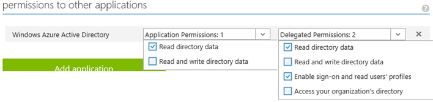

3. Verwenden Sie den richtigen Herausgeber in dynamischen CENC Schutz einrichten:

        <add key="ida:issuer" value="https://sts.windows.net/[AAD Tenant ID]/"/>
    
    Die folgenden funktionieren nicht:
    
        <add key="ida:issuer" value="https://willzhanad.onmicrosoft.com/" />
    
    Die GUID ist die AAD Mandanten-ID an. Die GUID kann in Endpunkte Popup Azure-Portal gefunden werden.

4. Erteilen der Gruppenmitgliedschaft Ansprüche Berechtigungen. Vergewissern Sie sich in AAD Anwendungsmanifestdatei, wir haben die folgenden

    "GroupMembershipClaims": "Alle", (der Standardwert ist null)

5. Legen beim Erstellen der Einschränkung Anforderungen gemischte "TokenType".

        objTokenRestrictionTemplate.TokenType = TokenType.JWT;

    Seit dem Hinzufügen der Unterstützung der JWT (AAD) sowie SWT (ACS), ist der Standardwert "TokenType" TokenType.JWT. Wenn Sie SWT/ACS verwenden, müssen Sie auf TokenType.SWT festlegen.

## Weitere Themen Implementierung
Als Nächstes werden wir einige weiteren Themen in unseren Planung und Implementierung uss Disagio.

###HTTP oder HTTPS?

Der Player ASP.NET-MVC-Anwendung, die wir erstellt, muss die folgenden Funktionen:

1. Benutzerauthentifizierung über Azure AD-, die unter HTTPS sein muss;
1. JWT token Exchange zwischen Client und Azure AD-, die unter HTTPS sein muss;
1. DRM Lizenz Acquisition vom Client das benötigt wird, klicken Sie unter HTTPS sein, wenn Lizenz deren Übermittlung verhindern von Azure Media Services bereitgestellt wird. Produkt-Suite PlayReady verlangen natürlich nicht HTTPS für die Lizenz Übermittlung. Ist der PlayReady Lizenzserver außerhalb Azure Media Services konnte entweder HTTP oder HTTPS verwendet werden.

Daher wird die Anwendung von ASP.NET Player HTTPS als bewährte Methode verwenden. Dies bedeutet, dass die Azure Media Player auf einer Seite unter HTTPS angezeigt wird. Jedoch für das streaming wir lieber HTTP, daher müssen wir gemischter Inhalt Problem zu berücksichtigen.

1. Gemischten Inhalt zulässig Browser nicht. Aber wie Silverlight und OSMF-Plug-In für glätten und Bindestrich-Plug-Ins zulassen. Gemischter Inhalt ist ein Sicherheitsrisiko – Dies wird durch das Risiko von die Möglichkeit, bösartiger JS einzufügen, die die Kundendaten Risiko werden führen kann.  Browser blockieren dies standardmäßig und bisher die einzige Möglichkeit zum umgehen wird auf dem Server (Origin), können Sie alle Domänen (unabhängig Https oder http). Dies ist entweder wahrscheinlich nicht zurückgibt.
1. Wir sollten gemischten Inhalt: Verwenden Sie beide HTTP oder beides verwenden HTTPS. Wenn gemischten Inhalt wiedergegeben, erfordert SilverlightSS Tech eine gemischte Inhalte Warnung zu deaktivieren. FlashSS Tech übernimmt gemischten Inhalt ohne gemischter Inhalt Warnung.
1. Wenn Ihre streaming Endpunkt vor August 2014 erstellt wurde, wird es HTTPS nicht unterstützt. In diesem Fall erstellen Sie und verwenden Sie einen neuen streaming Endpunkt für HTTPS.

Die Verweis-Implementierung für DRM geschützten Inhalt werden sowohl die Anwendung als auch die streaming unter HTTTPS. Bei geöffneten gehalten benötigt im Player nicht Authentifizierung oder Lizenz, damit Sie frei HTTP oder HTTPS verwendet haben.

### Azure-Active Directory signieren Key rollover

Dies ist ein wichtiger Punkt Ihre Implementierung berücksichtigen. Wenn Sie dies nicht in der Implementierung berücksichtigen, stoppt das fertige System vollständig innerhalb von höchstens 6 Wochen später arbeiten.

Azure AD verwendet Industriestandard Vertrauensstellung zwischen sich selbst und Azure AD-Anwendungen einrichten. Insbesondere verwendet Azure AD einen signierenden Schlüssel, der aus einem öffentlichen und privaten Schlüssel Paar besteht. Wenn Azure AD ein Sicherheitstoken, die Informationen über den Benutzer enthält erstellt, ist dieses Token signiert von Azure Active Directory mithilfe des privaten Schlüssels aus, bevor sie an die Anwendung gesendet wird. Zum Überprüfen, ob das Token gültig und stammt tatsächlich aus Azure AD ist, muss die Anwendung überprüft werden das Token der Signatur mit dem öffentlichen Schlüssel von Azure AD, die in den Mandanten Föderation Metadatendokument enthalten sind verfügbar gemacht werden. Öffentlicher Schlüssel – und dem signierenden Schlüssel von dem abgeleitet wird – werden die gleiche für alle Mandanten in Azure AD verwendet.

Detaillierte Informationen zur Azure AD-Key Rollover finden Sie im Dokument: [Wichtige Informationen zu signieren Schlüssel Rollover in Azure Active Directory](../active-directory/active-directory-signing-key-rollover.md).

Zwischen den [öffentlichen - privaten](https://login.windows.net/common/discovery/keys/), 

- Der private Schlüssel wird von Azure Active Directory zum Generieren einer JWT Token;
- Öffentliche Schlüssel wird durch eine Anwendung wie DRM Lizenz Delivery Services in AMS zur Überprüfung des JWT Tokens verwendet.
 
Aus Gründen der Sicherheit dreht Azure Active Directory regelmäßig dieses Zertifikat (alle 6 Wochen). Bei einem Sicherheit Verstoß gegen kann das wichtige Rollover jederzeit auftreten. Daher müssen die Übermittlung Dienste AMS Lizenz aktualisieren Sie den öffentlichen Schlüssel verwendet, wie Azure AD den Key Paar dreht, andernfalls token Authentifizierung in AMS fehl schlägt und es wird keine Lizenz ausgegeben. 

Dies wird durch Festlegen der TokenRestrictionTemplate.OpenIdConnectDiscoveryDocument beim Konfigurieren von DRM Lizenz Übermittlung Services erreicht.

Die JWT token läuft als unter:

1.  Azure AD wird die JWT mit dem aktuellen privaten Schlüssel für einen authentifizierten Benutzer auszustellen;
2.  Wenn ein Spieler ein CENC mit Multi-DRM geschützten Inhalten sieht, wird zuerst das JWT Token ausgestellt von Azure AD suchen.
3.  Der Player sendet Lizenz Acquisition-Anforderung mit dem JWT Token auf Lizenz Übermittlung Dienste in AMS;
4.  Die Übermittlung Dienste AMS Lizenz werden den aktuelle/gültige öffentlichen Product Key aus Azure AD das Token JWT überprüfen, bevor Sie Lizenzen verwendet.

DRM Lizenz Übermittlung Services werden immer für den aktuellen/gültigen öffentlichen Schlüssel aus Azure AD überprüft werden. Der Schlüssel präsentiert von Azure AD werden die Schlüssel für die Überprüfung einer JWT Token ausgestellt von Azure AD.

Was geschieht, wenn das Key Rollover nachdem AAD ein JWT Token generiert jedoch vor der JWT Token Spieler auf DRM-Lizenz Übermittlung Dienste in AMS zur Überprüfung gesendet wird? 

Da Sie ein Schlüssel zu einem beliebigen Zeitpunkt rückgängig gemacht werden könnte, besteht immer mehr als eine gültiger öffentlicher Schlüssel im Dokument Metadaten Föderation verfügbar. Azure Media Services Lizenz deren Übermittlung verhindern können die Tasten angegebenen im Dokument, da nacheinander bald rückgängig gemacht werden könnte, möglicherweise ein anderes werden dem neuen und so weiter.

### Wo befindet sich die Access-Token?

Wenn Sie schauen Sie sich wie eine Web app-API app unter [Anwendungsidentität mit OAuth 2.0 Client Anmeldeinformationen erteilen](active-directory-authentication-scenarios.md#web-application-to-web-api)Anrufe, die Authentifizierung läuft als unter:

1.  Ein Benutzer bei Azure AD in der Webanwendung angemeldet ist (Siehe im [Webbrowser zu Webanwendung](active-directory-authentication-scenarios.md#web-browser-to-web-application).
2.  Der Autorisierung Azure AD-Endpunkt leitet Benutzer-Agents an die Clientanwendung mit einer Autorisierungscode. Der Benutzer-Agents gibt Autorisierungscode auf der Clientanwendung Umleitung URI an.
3.  Die Anwendung muss eine Access-Token zu erfassen, damit es im Web-API authentifizieren und die gewünschte Ressource abrufen kann. Dies ist eine Anforderung an Azure AD-token Endpunkt, die Anmeldeinformationen, Client-ID und Webanwendung-APIs URI-ID bereitstellen. Es stellt den Autorisierungscode um nachzuweisen, dass der Benutzer zugestimmt hat.
4.  Azure AD authentifiziert die Anwendung, und gibt eine JWT Access Token, die Nummer im Web API verwendet wird.
5.  Über HTTPS verwendet die Anwendung das zurückgegebene JWT Access Token JWT Zeichenfolge mit einer Bezeichnung "Person" in der Kopfzeile Autorisierung der Anfrage im Web-API hinzuzufügen. Das Web-API das JWT Token überprüft und wenn die Überprüfung erfolgreich ist, gibt die gewünschte Ressource.

In diesem Fluss "Anwendungsidentität" vertraut das Web-API an, dass die Anwendung der Benutzer authentifiziert. Aus diesem Grund heißt dieses Muster ein vertrauenswürdiges Subsystem. Das [Diagramm auf dieser Seite](http://msdn.microsoft.com/library/azure/dn645542.aspx/) beschrieben, wie Autorisierungscode erteilen Fluss funktioniert.

Bei Lizenz Anschaffungskosten mit token Einschränkung folgen das gleiche vertrauenswürdigem Subsystem Muster. Und der Lizenz Übermittlungsdienst in Azure Media Services im Web API Ressource, muss eine Webanwendung für den Zugriff auf "Back-End-Ressourcen". Wo ist das Zugriffstoken?

Wir sind tatsächlich um, Access Token aus Azure Active Directory abrufen. Nach dem erfolgreichen Benutzerauthentifizierung Autorisierungscode zurückgegeben. Der Autorisierungscode anschließend, zusammen mit Client-ID "und" app-Taste, wird für Access-Token austauschen. Und das Access-Token ist für den Zugriff auf ein "Zeiger" Anwendung zeigt oder Azure Media Services Lizenz Übermittlungsdienst darstellt.

Beginn müssen wir zum Registrieren und Konfigurieren der app "Zeiger" Azure AD, indem Sie die folgenden Schritte aus:

1.  In den Azure AD-Mandanten

    - Fügen Sie eine Anwendung (Ressourcen) mit anmelden URL hinzu: 

    https://[resource_name].azurewebsites.NET/ und 

    - App-ID-URL: 
    
    https://[aad_tenant_name].onmicrosoft.com/[resource_name]; 
2.  Fügen Sie einen neuen Product Key für die Ressource app hinzu;
3.  Aktualisieren Sie die app-Manifestdatei aus, damit die Eigenschaft GroupMembershipClaims den folgenden Wert vorhanden ist: "GroupMembershipClaims": "Alle"  
4.  In der Azure AD-app auf der Player Web app im Abschnitt "Berechtigungen in anderen Programmen" Hinzufügen der Ressource-app, die in Schritt 1 oben hinzugefügt wurde. Aktivieren Sie unter "Berechtigungen delegiert" Häkchen "Access [Resource_name]" ein. Dadurch werden die Web app-Berechtigung zum Erstellen von Access-Token für den Zugriff auf die Ressource app. Für lokale und bereitgestellten Version der Web-app soll, wenn Sie mit Visual Studio und Azure Web app entwickeln.
    
Daher ist das JWT Token ausgestellt von Azure AD tatsächlich um das Token Access für den Zugriff auf diese Ressource "Zeiger".

### Wissenswertes zum Live Streaming?

In den oben genannten hat unsere Diskussion konzentrieren wurde auf bei Bedarf Posten. Wissenswertes zum live streaming?

Die gute Nachricht ist, dass Sie genau demselben Design und der Implementierung verwenden können, für den Schutz von live streaming in Azure Media Services, indem der Anlage zugeordnete Programm als "VOD Anlage" behandelt.

Es handelt sich hierbei bekannt, dass zum Ausführen live streaming in Azure Media-Diensten, Sie einen Kanal, und klicken Sie dann unter den Kanal Programm erstellen müssen. Um das Programm zu erstellen, müssen Sie eine Anlage zu erstellen, die das live Archiv für das Programm enthält. Um Multi-DRM Schutz von live-Inhalten CENC bereitzustellen, alle Sie ausführen müssen, ist das Anwenden der gleichen Setup/Verarbeitung auf die Anlage, als wäre sie "VOD Anlage" wurde, bevor Sie das Programm starten.

### Wissenswertes zu Lizenzservern außerhalb Azure Media Services

Häufig Kunden möglicherweise investiert haben in Lizenz Serverfarm entweder in ihre eigenen Daten zu zentrieren oder gehostet durch DRM-Dienstanbieter. Glücklicherweise Azure Media Services Content Protection können Sie im Hybridmodus ausgeführt werden: Inhalt gehostet und dynamisch geschützt in Azure Media-Diensten, während DRM Lizenzen von außerhalb Azure Media Services-Servern übermittelt werden. Es gibt in diesem Fall der ändert sich unter folgenden Aspekten:

1. Secure Token Service muss Token Emission annehmbar sind und durch die Lizenz Serverfarm überprüft werden können. Die von Axinom bereitgestellten Widevine Lizenz-Server erfordert beispielsweise ein bestimmtes JWT Token, das "Anspruch Nachricht" enthält. Daher müssen Sie ein STS zu solchen JWT auszustellen haben. Die Autoren eine solche Implementierung abgeschlossen haben und die Details finden Sie im folgenden Dokument [Azure Dokumentation](https://azure.microsoft.com/documentation/)Center: [Mithilfe von Axinom Widevine Lizenzen für Azure Media Services vorführen](media-services-axinom-integration.md). 
1. Sie müssen nicht mehr Lizenz Übermittlung Service (ContentKeyAuthorizationPolicy) in Azure Media-Dienste zu konfigurieren. Was Sie tun müssen, besteht darin, die der Lizenz Acquisition URLs (PlayReady, Widevine und FairPlay) dafür, dass beim Einrichten von CENC mit Multi-DRM AssetDeliveryPolicy konfigurieren.
 
### Was geschieht, wenn ich einen benutzerdefinierten STS verwenden möchte?

Hierfür kann es verschiedene Gründe, die möglicherweise ein Kunden auswählen, um einen benutzerdefinierten STS (Secure Token Service) zu verwenden, für die Bereitstellung von JWT Token. Einige davon sind:

1.  STS unterstützt der vom Kunden verwendete Identität Anbieter (IDP) nicht. In diesem Fall möglicherweise einen benutzerdefinierten STS eine Option.
2.  Der Kunden möglicherweise flexible oder enger Steuerelement in der Integration von STS mit Kunden Abonnenten Abrechnung System benötigen. Beispielsweise möglicherweise ein Operator MVPD anbieten, mehrere OTT Abonnenten Pakete wie Premium, grundlegende, Sportarten usw.. Der Operator möchten möglicherweise die Ansprüche in einem Token mit einem Abonnenten Paket entspricht, sodass nur der Inhalt im richtigen Paket zur Verfügung gestellt wird. In diesem Fall eines benutzerdefinierten STS stellt die benötigten Flexibilität und Kontrolle.

Zwei Änderungen müssen vorgenommen werden, wenn Sie einen benutzerdefinierten STS verwenden:

1.  Beim Lizenz Übermittlungsdienst für eine Anlage konfigurieren zu können, müssen Sie den Sicherheitsschlüssel für die Überprüfung durch die benutzerdefinierten STS (Weitere Details unten) anstelle des aktuellen Schlüssels aus Azure Active Directory angeben.
2.  Wenn ein JTW Token generiert wird, ist ein Sicherheitsschlüssel anstelle der aktuellen X509 den privaten Schlüssel angegeben Zertifikat in Azure Active Directory.

Es gibt zwei Arten von Sicherheitsschlüsseln aus:

1.  Symmetrischen Schlüssel: demselben Schlüssel dient zum Generieren von sowohl Überprüfung ein Token JWT;
2.  Asymmetrische Schlüssel: eine öffentlich-privaten Schlüssel in einer X509 Zertifikat mit privaten Schlüssel zum Verschlüsseln/Generieren einer JWT Token und dem öffentlichen Schlüssel für die Token bestätigt verwendet wird.

####Tech Notiz

Wenn Sie .NET Framework verwenden / Ihre Entwicklungsplattform, die X509 C#-Zertifikat für asymmetrische Sicherheitsschlüssel müssen mindestens 2048 Länge. Dies ist eine Vorbedingung der Klasse System.IdentityModel.Tokens.X509AsymmetricSecurityKey in .NET Framework. Andernfalls wird die folgende Ausnahme ausgelöst:

IDX10630: Zum Signieren 'System.IdentityModel.Tokens.X509AsymmetricSecurityKey' darf nicht kleiner als '2048' Bits sein. 

## Abgeschlossene und Testen Sie es

Wir werden einige Szenarien in der fertigen End-to-End-System durchzuführen, sodass die Leser ein Basic das Verhalten "Bild" haben können, bevor Sie ein Anmeldekonto.

Die Web-Player und deren Anmeldung finden Sie [hier](https://openidconnectweb.azurewebsites.net/).

Ist, benötigen Sie "nicht integrierten" Szenario: video-Ressourcen gehostet in Azure Media Services sind entweder nicht geschützt oder DRM geschützten, aber ohne token Authentifizierung (eine Lizenz an einzuladen ausgeben sie anfordert), (indem Sie auf HTTP umstellen, ist Ihre video-streaming über HTTP) ohne Anmeldung testen.

Wenn Sie gesuchte integrierte End-to-End-Szenario ist: video-Ressourcen unter dynamische DRM Schutz in Azure Media-Dienste, mit token Anmelde- und JWT Token von Azure Active Directory generiert wird, müssen Sie anmelden.

### Anmeldung des Benutzers

Um festzustellen, ob das integrierte End-to-End-DRM-System, müssen Sie ein "Konto" erstellt oder hinzugefügt haben. 

Welches Konto?

Auch Azure ursprünglich nur von Benutzern von Microsoft-Konto zugreifen, wenn können sie jetzt Zugriff durch Benutzer aus beiden Systemen. Dies erfolgte, dass alle Azure Eigenschaften Trust Azure AD-für die Authentifizierung, Probleme Azure AD Organisations-Benutzer authentifiziert und durch Erstellen einer Beziehung Föderation, in dem Microsoft-Konto Consumer Identität System zum Authentifizieren von Benutzern Consumer vertraut Azure AD. Daher ist Azure AD Microsoft-Konten "Gast" sowie "systemeigener" Azure AD-Konten authentifizieren können.

Da Azure AD Microsoft-Konto (MSA)-Domäne vertraut, können Sie alle Konten aus einer der folgenden Domänen in der benutzerdefinierten Azure AD Mandanten und verwenden Sie das Konto für die Anmeldung hinzufügen:

**Domänennamen**|**Domäne**
-----------|----------
**Benutzerdefinierte Azure AD-Mandanten Domäne**|somename.onmicrosoft.com
**Corporate Domäne**|Microsoft.com
**Microsoft-Konto (MSA) Domäne**|Outlook.com, live.com, hotmail.com

Sie können eine der Autoren ein Konto erstellt oder für die Sie hinzugefügt haben kontaktieren. 

Nachfolgend finden Sie die Screenshots anderen Login Seiten, die von anderen Domänenkonten verwendet.

**Benutzerdefinierte Azure AD-Mandanten Domänenkonto**: In diesem Fall finden Sie die angepasste Anmeldeseite des benutzerdefinierten Azure AD-Mandanten Domäne.

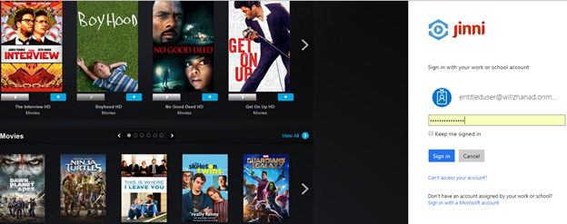

**Microsoft-Domänenkonto mit Smartcard**: In diesem Fall finden Sie die Anmeldeseite von Microsoft corporate angepasst IT mit einer zweistufigen Authentifizierung.

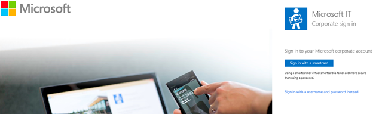

**Microsoft-Konto (MSA)**: In diesem Fall finden Sie die Anmeldeseite von Microsoft Account für Verbraucher.

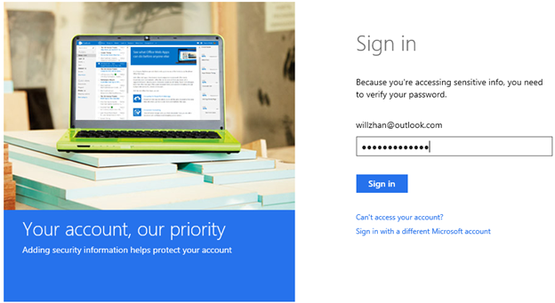

### Verwenden von verschlüsselten Medien Erweiterungen für PlayReady

Auf einem modernen Browser mit verschlüsselt Medien Erweiterungen (EME) für die Unterstützung von PlayReady, wie etwa Internet Explorer 11 auf Windows 8.1 und nach oben und Microsoft Edge Browser auf Windows-10 werden PlayReady der zugrunde liegenden DRM für EME aus.

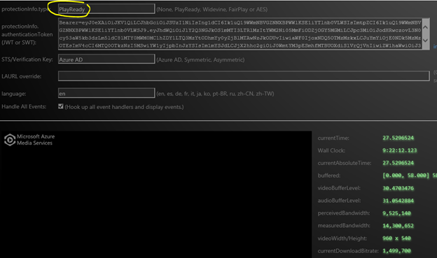

Der Bereich dunkel Player ist, PlayReady Schutz verhindert, dass eine Bildschirmaufnahme geschützten Videos vornimmt. 

Im folgenden Bildschirm zeigt die Player-Plug-Ins und MSE/EME Support.

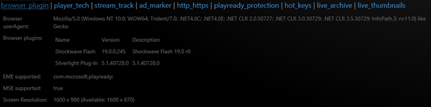

EME in Microsoft Edge und Internet Explorer 11 unter Windows 10 ermöglicht Aufrufen von [PlayReady SL3000](https://www.microsoft.com/playready/features/EnhancedContentProtection.aspx/) auf Windows 10 Geräten, die es unterstützen. PlayReady SL3000 hebt die Sperre des Ablaufs erweiterte Premiuminhalt (4K, HDR, usw.) und neue Bereitstellung von Inhalten Modelle (früher Fenster für erweiterte Inhalte).

Fokussierung auf die Windows-Geräte: PlayReady ist der einzige DRM in der Hardware, die auf Windows-Geräten (PlayReady SL3000) verfügbar. Ein streaming-Dienst mit PlayReady über EME oder einer Anwendung UWP und bieten eine höhere Videoqualität PlayReady SL3000 als ein anderes DRM verwenden. In der Regel fließt 2 K Inhalt durch Chrome oder Firefox und 4 K Inhalte über Microsoft Kante/IE11 oder eine UWP-Anwendung auf dem gleichen Gerät (je nach diensteinstellungen und Implementierung).

#### Mithilfe von EME für Widevine

Auf einem modernen Browser mit EME/Widevine Support, wie z. B. Chrome 41 + 10 für Windows, Mac OSX Yosemite, Windows 8.1 und Chrome auf Android 4.4.4 ist Google Widevine der DRM hinter EME.

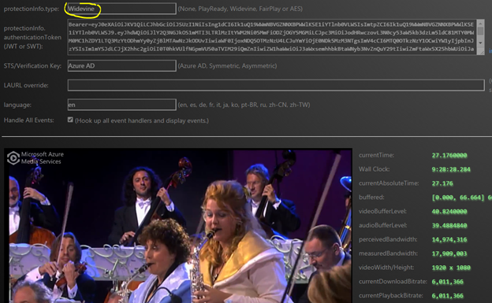

Beachten Sie, dass eine Bildschirmaufnahme geschützten Videos vornimmt Widevine nicht verhindert wird.

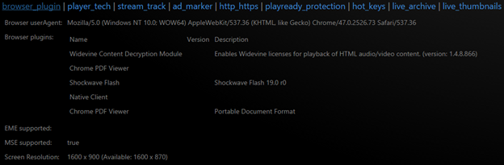

### Nicht berechtigt, von Benutzern

Wenn ein Benutzer nicht Mitglied der Gruppe "Benutzer hinzufügen" ist, des Benutzers werden nicht "Anspruch Kontrollkästchen" übergeben und Multi-DRM Lizenzdienst verweigern, wird die angeforderte Lizenz auszustellen, wie unten dargestellt. Die detaillierte Beschreibung ist "Lizenz erwerben Fehler beim", welche wie vorgesehen ist.

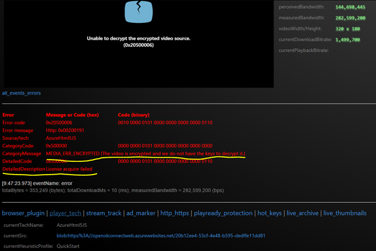

### Ausführen von benutzerdefinierten Secure Token Service

Für das Szenario der Ausführung von benutzerdefinierten Secure Token Service (STS) wird das Token JWT mit entweder symmetrische oder asymmetrische Schlüssel vom benutzerdefinierten STS ausgestellt werden. 

Die Groß-/Kleinschreibung symmetrischen Schlüssel (mit Chrome):

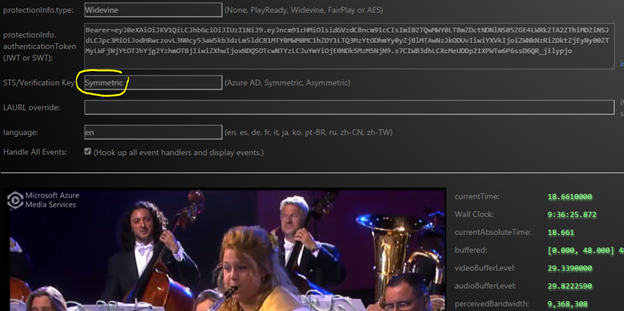

Die Groß-/Kleinschreibung von asymmetrische Schlüssel über eine X509 mit Zertifikat (mit Microsoft modernen Browser).

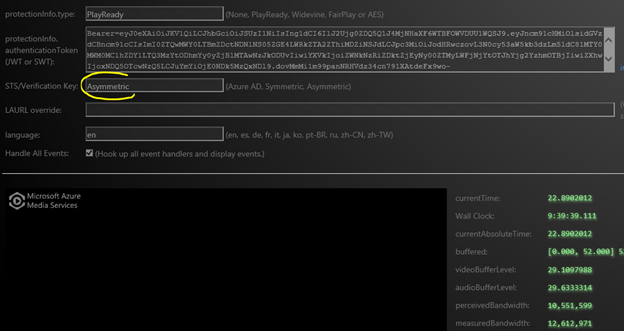

In den beiden oben genannten Fälle bleibt Benutzerauthentifizierung – bei Azure AD. Der einzige Unterschied ist, dass JWT Token vom benutzerdefinierten STS statt Azure AD ausgestellt werden. Natürlich beim Schutz der dynamischen CENC konfigurieren, die Beschränkung der Lizenz Übermittlungsdienst gibt an, welche JWT Token, entweder symmetrische oder asymmetrische Schlüssel.

## Zusammenfassung

In diesem Dokument besprochen CENC mit mehreren native DRM und Access-Steuerelement über token Authentifizierung: das Design und seine Implementierung mit Azure, Azure Media Services und Azure Media Player.

- Ein Bezug Entwurf wird angezeigt, der alle notwendigen Komponenten in einem Subsystem DRM/CENC enthält;
- Eine Implementierung der Bezug auf Azure, Azure Media Services und Azure Media Player.
- Einige Themen direkt des Entwurfs und der Implementierung beteiligt werden ebenfalls beschrieben.

##Media-Dienste Learning Wege

[AZURE.INCLUDE [media-services-learning-paths-include](../../includes/media-services-learning-paths-include.md)]

##Angeben von feedback

[AZURE.INCLUDE [media-services-user-voice-include](../../includes/media-services-user-voice-include.md)]

###Danksagungen 

William Zhang, Mingfei Yan, Roland Le Franc, Kilroy Ralls, aufzunehmen Kornich
