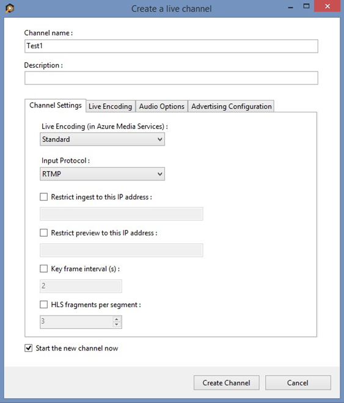
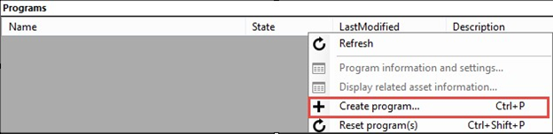

<properties 
    pageTitle="Konfigurieren den Encoder NewTek TriCaster zum Senden eines einzelnen Bitrate live Streams | Microsoft Azure" 
    description="In diesem Thema wird gezeigt, wie konfigurieren den Encoder Tricaster live, um einen einzelnen Bitrate Stream an AMS Kanäle zu senden, die für die live-Codierung aktiviert sind." 
    services="media-services" 
    documentationCenter="" 
    authors="cenkdin" 
    manager="erikre" 
    editor=""/>

<tags 
    ms.service="media-services" 
    ms.workload="media" 
    ms.tgt_pltfrm="na" 
    ms.devlang="ne" 
    ms.topic="article" 
    ms.date="10/12/2016" 
    ms.author="juliako;cenkd;anilmur"/>

#Verwenden der Encoder NewTek TriCaster zu einen einzelnen Bitrate live Stream senden

> [AZURE.SELECTOR]
- [Tricaster](media-services-configure-tricaster-live-encoder.md)
- [Live Elementen](media-services-configure-elemental-live-encoder.md)
- [Wirecast](media-services-configure-wirecast-live-encoder.md)
- [FMLE](media-services-configure-fmle-live-encoder.md)

In diesem Thema wird gezeigt, wie konfigurieren den Encoder [NewTek TriCaster](http://newtek.com/products/tricaster-40.html) live, um einen einzelnen Bitrate Stream an AMS Kanäle zu senden, die für die live-Codierung aktiviert sind. Weitere Informationen finden Sie unter [Arbeiten mit Kanäle, die zum Ausführen mit Azure Media Services Codierung Live aktiviert sind](media-services-manage-live-encoder-enabled-channels.md).

In diesem Lernprogramm erfahren zum Verwalten von Azure Media Services (AMS) mit dem Tool Azure Media Services Explorer (AMSE). Dieses Tool kann nur auf Windows-Computer ausgeführt werden. Wenn Sie Mac oder Linux sind, verwenden Sie das Azure-Portal [Kanäle](media-services-portal-creating-live-encoder-enabled-channel.md#create-a-channel) und [Programme](media-services-portal-creating-live-encoder-enabled-channel.md#create-and-manage-a-program)zu erstellen.

>[AZURE.NOTE]Bei Verwendung von Tricaster zum Senden in einen Beitrag-Feeds mit AMS-Kanäle, die für die live-Codierung aktiviert sind, können in vorhanden sein Video oder Audio Probleme aufgeführt live-Ereignis, wenn Sie bestimmte Features von Tricaster, wie z. B. schnelle zwischen Feeds Ausschneiden, oder wechseln Sie zu/von Slate verwenden. Das Team AMS arbeitet, klicken Sie auf diese Probleme beheben, bis zu diesem Zeitpunkt, es ist nicht empfiehlt sich diese Features verwenden.

##Erforderliche Komponenten

- [Erstellen Sie ein Konto Azure Media Services](media-services-portal-create-account.md)
- Stellen Sie sicher, es ist eine Streaming-Endpunkt mit mindestens eine streaming Einheit zugeordnet wird ausgeführt. Weitere Informationen finden Sie unter [Verwalten von Streaming Endpunkte in einer Media Services-Kontos](media-services-portal-manage-streaming-endpoints.md)
- Installieren Sie die neueste Version des Tools [AMSE](https://github.com/Azure/Azure-Media-Services-Explorer) .
- Starten Sie das Tool, und Verbinden mit Ihrem Konto AMS.

##Tipps

- Verwenden Sie nach Möglichkeit eine Verbindung zum Internet gehört.
- Eine gute Faustregel, wenn die Bandbreite Anforderungen bestimmen besteht darin, das streaming eine Bitrate doppelklicken. Während Sie dies nicht obligatorisch erforderlich ist, wird es hilfreich sein, den Einfluss der Überlastung des Netzwerks zu verringern.
- Bei der Verwendung von Software Grundlage Encoder, schließen Sie alle nicht benötigten Programme.

## Erstellen Sie einen Kanal

1.  Klicken Sie im Tool AMSE navigieren Sie zur Registerkarte **Live** , und klicken Sie mit der rechten Maustaste in den Bereich Channel. Wählen Sie **Erstellen Kanal...** aus dem Menü aus.

2. Geben Sie einen Channel an das Beschreibungsfeld ist optional. Kanal aktivieren Sie unter Einstellungen **Standard** für die Codierung Live die Option, mit der Eingabe-Protokoll auf **RTMP**festgelegt. Lassen Sie andere Einstellungen wie ist ein.

Stellen Sie sicher, dass die **Starten Sie den neuen Kanal jetzt** ausgewählt ist.

3. Klicken Sie auf **Channel erstellen**.

>[AZURE.NOTE] Der Kanal kann bis zu 20 Minuten zum Starten dauern.

Beim Start von des Kanals können Sie [den Encoder konfigurieren](media-services-configure-tricaster-live-encoder.md#configure_tricaster_rtmp).

>[AZURE.IMPORTANT] Beachten Sie, dass Abrechnung wird gestartet, sobald Channel in einen bereiten Zustand wechselt. Weitere Informationen finden Sie unter [den Channel Staaten](media-services-manage-live-encoder-enabled-channels.md#states).

##Konfigurieren des NewTek TriCaster Encoders

In diesem Lernprogramm werden die folgenden ausgabeeinstellungen verwendet. Im weiteren Verlauf dieses Abschnitts werden Konfigurationsschritte ausführlicher beschrieben. 

**Video**:
 
- Codec: h. 264. 
- Profil: Hoch (Ebene 4.0) 
- Bitrate: 5000/s 
- Schlüsselbild: 2 Sekunden (60 Sekunden) 
- Frame Rate: 30
 
**Audio**:

- Codec: AAC (LC) 
- Bitrate: 192/s 
- Sample-Rate: 44,1 kHz

###Konfigurationsschritte

1. Erstellen eines neuen Projekts von **NewTek TriCaster** je nachdem, welche video Eingabewerte Quelle verwendet wird. 
2. Einmal innerhalb dieses Projekt, suchen Sie die Schaltfläche **Stream** , und klicken Sie auf das Zahnradsymbol neben dem Eintrag im Konfiguration Stream zugreifen.

    
3. Sobald das Menü geöffnet, klicken Sie unter der Überschrift Verbindung auf **neu** . Wenn Sie für den Verbindungstyp aufgefordert werden, wählen Sie **Adobe Flash**.

    

4. Klicken Sie auf **OK**.

5. Ein Profil FMLE kann jetzt importiert werden, indem Sie auf den Dropdown-Pfeil unter **Streaming Profil** , und navigieren zur **Suche**.

    

6. Navigieren Sie zu der Stelle, an der das konfigurierte FMLE Profil gespeichert wurde.
7. Wählen Sie ihn aus, und klicken Sie auf **OK**.

    Nachdem das Profil hochgeladen wird, fahren Sie mit dem nächsten Schritt fort.

6. Abrufen einer URL im Kanal um den Tricaster **RTMP Endpunkt**zugewiesen.
    
    Navigieren Sie zurück zu den AMSE-Tool, und klicken Sie auf den Kanalstatus aktivieren. Sobald der Zustand zum **Ausführen**von **Felder starten** geändert hat, können Sie die eingegebene URL abrufen.
      
    Wenn der Kanal ausgeführt wird, klicken Sie mit der rechten Maustaste auf der Channelname, navigieren Sie nach unten bis zum Hover über **Eingabe-URL in Zwischenablage kopieren** , und wählen Sie **Primäre Eingabe URL**aus.  
    
    

7. Fügen Sie diese Informationen im Feld **Ort** unter **Flash Server** innerhalb des Projekts Tricaster. Weisen Sie auch einen Stream Namen im Feld **Stream-ID** an. 

    Wenn das Profil FMLE Stream Informationen hinzugefügt wurde, können sie auch in diesem Abschnitt importiert, indem **Importieren**, navigieren zu der gespeicherten FMLE Profil aus, und klicken Sie auf **OK**. Die relevanten Felder von Flash Server sollte mit den Informationen aus FMLE ausgefüllt.

    

9. Klicken Sie abschließend auf **OK** am unteren Rand des Bildschirms. Wenn video und audio Eingaben in der Tricaster bereit sind, beginnen Sie an AMS streaming, indem Sie auf die Schaltfläche **Stream** aus.

    

>[AZURE.IMPORTANT]Bevor Sie **Stream**geklickt haben, sicherstellen **müssen** Sie, dass der Kanal bereit. 
>Stellen Sie außerdem sicher nicht zu den Kanal Status bereit ohne eine Eingabe Beitrag länger als 15 Minuten > feed zu verlassen. 

##Der Testwiedergabe
  
1. Navigieren Sie zu dem Tool AMSE, und klicken Sie mit der rechten Maustaste den Kanal getestet werden. Wählen Sie im Menü zeigen Sie auf **Wiedergabe der Vorschau** , und wählen Sie **mit Azure Media Player**.  

    

Wenn Streams im Player angezeigt wird, hat der Encoder ordnungsgemäß konfiguriert wurde, zum Verbinden mit AMS. 

Wenn eine Fehlermeldung angezeigt wird, wird der Kanal zurückgesetzt werden müssen, und Encoder Einstellungen angepasst. Finden Sie im Thema [zur Problembehandlung](media-services-troubleshooting-live-streaming.md) für Anleitungen.  

##Erstellen Sie ein Programm

1. Sobald Channel Wiedergabe bestätigt ist, erstellen Sie ein Programm aus. Klicken Sie auf der Registerkarte **Live** im Tool AMSE klicken Sie mit der rechten Maustaste in den Bereich Programm, und wählen Sie **Neues Programm erstellen**aus.  

    

2. Benennen Sie die Anwendung und, falls erforderlich, passen Sie die **Länge der Archiv-Fenster** (die 4 Stunden standardmäßig verwendet). Sie können auch Geben Sie einen Speicherort oder als Standard lassen.  
3. Aktivieren Sie das Kontrollkästchen **Starten Sie das Programm jetzt** ein.
4. Klicken Sie auf **Programm erstellen**.  
  
    Hinweis: Die Erstellung des weniger Zeit als Channel erstellen.    
 
5. Nachdem das Programm ausgeführt wird, bestätigen Sie Wiedergabe von rechten Maustaste auf das Programm und navigieren zu der **Wiedergabe der Programme** aus, und klicken Sie dann **mit Azure Media Player**auswählen.  
6. Nachdem bestätigt, nach rechts klicken Sie auf das Programm erneut und wählen Sie aus **den Ausgabe-URL in Zwischenablage kopieren** (oder rufen Sie diese Informationen über die Option **Programminformationen und Einstellungen** im Menü ab). 

Der Stream ist jetzt bereit sind, werden in einem Player eingebettet oder an einer Zielgruppe, für die Anzeige im live verteilt.  

## Behandlung von Problemen

Finden Sie im Thema [zur Problembehandlung](media-services-troubleshooting-live-streaming.md) für Anleitungen. 

##Als Nächstes

Überprüfen Sie die Pfade learning Media-Dienste.

[AZURE.INCLUDE [media-services-learning-paths-include](../../includes/media-services-learning-paths-include.md)]

##Angeben von feedback

[AZURE.INCLUDE [media-services-user-voice-include](../../includes/media-services-user-voice-include.md)]
