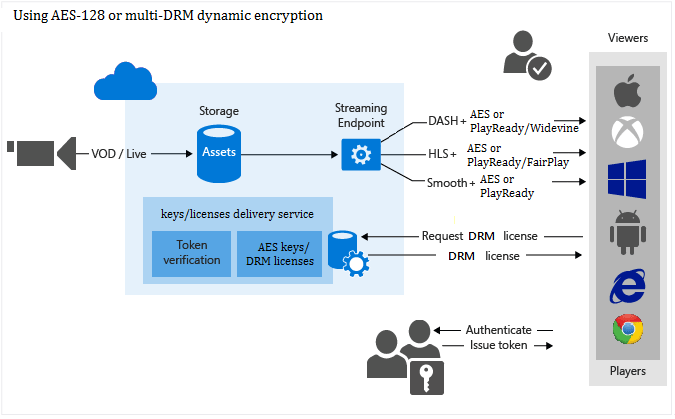

<properties 
    pageTitle="Schützen von Inhalten Übersicht | Microsoft Azure" 
    description="Dieser Artikel Geben Sie einen Überblick über den Schutz von Inhalten mit Media-Dienste." 
    services="media-services" 
    documentationCenter="" 
    authors="Juliako" 
    manager="erikre" 
    editor=""/>

<tags 
    ms.service="media-services" 
    ms.workload="media" 
    ms.tgt_pltfrm="na" 
    ms.devlang="na" 
    ms.topic="article" 
    ms.date="09/27/2016" 
    ms.author="juliako"/>

#Schützen von Inhalten (Übersicht)

Microsoft Azure Media Services ermöglicht Ihnen, Ihre Medien ab dem Zeitpunkt zu schützen, wenn sie Ihren Computer über Speicher, Verarbeitung und Übermittlung verlässt. Media Services können Sie Ihre live und bei Bedarf Inhalte, die verschlüsselt dynamisch mit erweiterte Verschlüsselung AES (Standard) (mit 128-Bit-Verschlüsselung Tasten) oder keines der wichtigsten DRMs bereitzustellen: Microsoft PlayReady, Google Widevine und Apple FairPlay. Media Services bietet auch Dienstleistungen für die Vorführung AES Tasten und DRM (PlayReady, Widevine und FairPlay) Lizenzen für autorisierte Clients. 

Die folgende Abbildung zeigt den Schutz von Inhalten in Workflows, die AMS unterstützt. 

>[AZURE.NOTE]Um dynamische Verschlüsselung verwenden können, müssen Sie zunächst mindestens eine streaming reservierte Einheit für das streaming Endpunkt abrufen, aus denen Sie verschlüsselte Inhalte übertragen möchten.

In diesem Thema wird erläutert, [Konzepte und Begriffe](media-services-content-protection-overview.md) für Grundlegendes zum Schützen von Inhalten mit AMS relevant. Das Thema enthält auch [Links](media-services-content-protection-overview.md#common-scenarios) zu Themen zum Schutz von Inhalten Aufgaben zu erzielen. 

##Dynamic-Verschlüsselung

Microsoft Azure Media Services ermöglicht es Ihnen, Ihre Inhalte dynamisch mit AES Schlüssel zum Löschen oder DRM Verschlüsselung verschlüsselt vorführen: Microsoft PlayReady, Google Widevine und Apple FairPlay.

Aktuell, können Sie die folgenden streaming-Formate verschlüsseln: HLS, MPEG Gedankenstrich und interpolierten Streaming. Sie können nicht verschlüsseln HDS streaming-Format oder "Progressiv".

Wenn Sie für Media-Dienste zu eine Anlage verschlüsseln möchten, müssen Sie Zuordnen eines Verschlüsselungsschlüssels (CommonEncryption oder EnvelopeEncryption) mit der Anlage und auch Autorisierungsrichtlinien für die Taste konfigurieren.

Sie müssen außerdem der Anlage Übermittlung Richtlinie konfigurieren. Wenn Sie eine verschlüsselte Speicher-Anlage übertragen möchten, stellen Sie sicher, um anzugeben, wie Sie ihn vorführen, indem Anlage Übermittlung Richtlinie konfigurieren möchten.

Wenn ein Stream von einem Player angefordert wird, verwendet Media-Dienste den angegebenen Schlüssel, um Ihre Inhalte, die mithilfe von AES Schlüssel zum Löschen oder DRM-Verschlüsselung dynamisch zu verschlüsseln. Entschlüsseln des Streams wird der Player die Taste vom Übermittlungsdienst Key anfordern. Um zu entscheiden, und zwar unabhängig davon, ob der Benutzer berechtigt ist, können Sie die Taste gelangen, wertet der Dienst die Autorisierungsrichtlinien, die Sie für den Schlüssel angegeben haben.

>[AZURE.NOTE]Um dynamische Verschlüsselung nutzen zu können, müssen Sie zunächst mindestens eine bei Bedarf streaming Einheit für das streaming Endpunkt abrufen, aus denen Sie bis zur Bereitstellung verschlüsselte des Inhalts planen. Weitere Informationen finden Sie unter [So skalieren Media-Dienste](media-services-portal-manage-streaming-endpoints.md).

##Speicher-Verschlüsselung

Formular mit Speicher Verschlüsselung Verschlüsseln löschen Inhalte lokal mit AES 256-Bit-Verschlüsselung und anschließendes Hochladen auf Azure-Speicher Speicherort auf Rest verschlüsselt. Posten mit Speicher Verschlüsselung geschützt werden automatisch entschlüsselt in eine verschlüsselte Dateisystem vor Codierung platziert und optional vor dem Hochladen wieder als eine neue Ausgabe Anlage erneut verschlüsselt. Die primäre Anwendungsfall-für die Verschlüsselung der Speicher ist, wenn Sie von hoher Qualität von Mediendateien mit Verschlüsselung statisch sind auf dem Datenträger sichern möchten.

Um eine verschlüsselte Speicher-Anlage vorführen möchten, müssen Sie der Anlage Übermittlung Richtlinie konfigurieren, damit Media-Dienste weiß, wie Sie Ihre Inhalte bereitstellen möchten. Vor der Anlage gestreamt werden kann, der streaming-Server die Verschlüsselung Speicher entfernt, und streamt von Inhalten, die Richtlinie angegebenen Übermittlung (z. B. AES, allgemeine Verschlüsselung oder keine Verschlüsselung) verwenden.

## Allgemeine Verschlüsselung (CENC)

Allgemeine Verschlüsselung wird verwendet, wenn Ihre Inhalte mit PlayReady verschlüsseln oder / und Widewine.

## Verwenden von Cbcs Aapl Verschlüsselung

CBCs-Aapl wird verwendet, wenn Inhalt mit FairPlay verschlüsseln.

## Umschlag-Verschlüsselung 

Verwenden Sie diese Option, wenn Sie den Inhalt mit AES-128 löschen Schlüssel schützen möchten. Wenn Sie eine Option sicherere möchten, wählen Sie eine der DRMs in diesem Thema aufgeführt. 

##Lizenzen und Schlüssel Übermittlung-Dienst

Media-Dienste bietet einen Dienst für die Bereitstellung von Lizenzen für DRM (PlayReady, Widevine, FairPlay) und AES Tasten auf autorisierte Clients löschen. [Azure-Portal](media-services-portal-protect-content.md), REST-API oder Media Services SDK für .NET können Autorisierung und Authentifizierung Richtlinien für Ihre Lizenzen und Schlüssel konfigurieren.

##Token Einschränkung

Die Autorisierungsrichtlinie Inhalt Key konnte eine oder mehrere Autorisierung Einschränkungen haben: Öffnen oder Einschränkung token. Die token eingeschränkte Richtlinie ein Token ausgestellt von einem Secure Token Service (STS) beizufügen. Media Services unterstützt Token in den einfachen Web Token (SWT) und JSON Web Token (JWT) Format an. Media Services bietet keine Secure Token Services. Erstellen eines benutzerdefinierten STS oder Microsoft Azure ACS zu Problem Token nutzen können. Der STS müssen konfiguriert sein, um ein Token mit der angegebenen Schlüssel und Problem Ansprüchen aus, die Sie in der Konfiguration token Einschränkung angegeben angemeldet zu erstellen. Die wichtigsten Übermittlung Medien Dienste gibt die angeforderten Schlüssel (oder Lizenz) den Client, wenn das Token gültig ist und die Ansprüche im token Übereinstimmung so konfiguriert, die dass für die Taste (oder Lizenz) zurück.

Wenn die Richtlinie konfigurieren das Token beschränkt werden, müssen Sie die primäre Überprüfung Schlüssel, Herausgeber und Zielgruppe Parameter angeben. Die primäre Überprüfung Taste enthält den Schlüssel, dem mit das Token signiert wurde, Herausgeber ist der secure token Dienst, der das Token ausgestellt. Die Zielgruppe (auch als Bereich bezeichnet) beschreibt die Absicht des Token oder die Ressource das Token autorisiert Zugriff auf. Die wichtigsten Übermittlung Medien Dienste überprüft, dass diese Werte im Token die Werte in der Vorlage übereinstimmen.

##Streaming URLs

Wenn Ihre Anlage mit mehreren DRM verschlüsselt wurde, sollten Sie eine Kategorie Verschlüsselung verwenden, in der streaming URL: (Format = 'm3u8-Aapl' Verschlüsselung = 'Funktionen Länge und LÄNGEB').

Folgendes gilt:

- Nur 0 (null) oder eine können Verschlüsselung angegeben werden.
- Verschlüsselungstyp muss nicht in der Url angegeben werden muss, wenn nur eine Verschlüsselung auf die Anlage angewendet wurde.
- Verschlüsselung Datentyp Groß-/Kleinschreibung wird.
- Die folgenden Arten von Verschlüsselung können angegeben werden:  
    - **Cenc**: Allgemeine Verschlüsselung (Playready oder Widevine)
    - **CBCs-Aapl**: Fairplay
    - **CBC**: AES Umschlag-Verschlüsselung.

##Häufige Szenarien

Die folgenden Themen veranschaulichen, wie Schützen von Inhalten in Speicher dynamisch verschlüsselte streaming Media vorführen, AMS Schlüssel/Lizenz Übermittlungsdienst verwenden

- [Mit AES schützen](media-services-protect-with-aes128.md) 
- [Schützen Sie mit PlayReady und/oder Widevine](media-services-protect-with-drm.md)
- [Übertragen Sie Ihre HLS Inhalt geschützten mit Apple FairPlay und/oder PlayReady](media-services-protect-hls-with-fairplay.md)

### Zusätzliche Szenarien

- [Wie PlayReady-Lizenz Azure Service mit Ihrer eigenen Encryptor/streaming Server integriert werden soll](http://mingfeiy.com/integrate-azure-playready-license-service-encryptorstreaming-server).
- [Verwenden von CastLabs DRM Lizenzen Azure Media Services vorführen](media-services-castlabs-integration.md)
 
##Media-Dienste Learning Wege

[AZURE.INCLUDE [media-services-learning-paths-include](../../includes/media-services-learning-paths-include.md)]

##Angeben von feedback

[AZURE.INCLUDE [media-services-user-voice-include](../../includes/media-services-user-voice-include.md)]

##Links zu verwandten Themen

[Ankündigung von PlayReady als Dienst und dynamische AES-Verschlüsselung mit Azure Media Services](http://mingfeiy.com/playready)

[Erläuterung der Azure Media Services PlayReady Lizenz Übermittlung Preise](http://mingfeiy.com/playready-pricing-explained-in-azure-media-services)

[Das Debuggen für AES verschlüsselten Stream in Azure Media-Dienste](http://mingfeiy.com/debug-aes-encrypted-stream-azure-media-services)

[JWT token authenitcation](http://www.gtrifonov.com/2015/01/03/jwt-token-authentication-in-azure-media-services-and-dynamic-encryption/)

[Integrieren Azure Media Services OWIN MVC Grundlage app mit Azure Active Directory und Bereitstellung von Inhalten basierend auf JWT Ansprüche einschränken](http://www.gtrifonov.com/2015/01/24/mvc-owin-azure-media-services-ad-integration/).

[Azure-ACS zu Problem Token verwenden](http://mingfeiy.com/acs-with-key-services).

[content-protection]: ./media/media-services-content-protection-overview/media-services-content-protection.png
