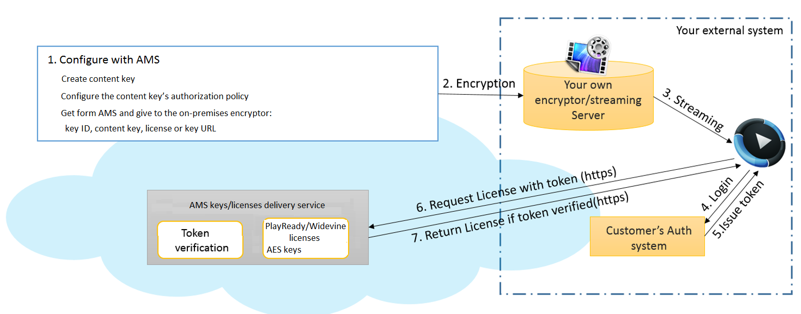

<properties 
    pageTitle="Verwenden von Azure Media Services DRM Lizenzen oder AES Tasten vorführen" 
    description="Dieser Artikel beschreibt, wie Sie Azure Media Services (AMS) PlayReady vorführen und/oder Widevine Lizenzen und AES Schlüssel führen Sie aber den Rest (Codierung, Verschlüsselung, streaming) mit Ihrem lokalen Servers." 
    services="media-services" 
    documentationCenter="" 
    authors="Juliako" 
    manager="erikre" 
    editor=""/>

<tags 
    ms.service="media-services" 
    ms.workload="media" 
    ms.tgt_pltfrm="na" 
    ms.devlang="na" 
    ms.topic="article" 
    ms.date="09/26/2016"
    ms.author="juliako"/>

#Verwenden von Azure Media Services DRM Lizenzen oder AES Tasten vorführen

Azure Media Services (AMS) ermöglicht es Ihnen, Aufnahme, codieren, Inhalt schützen und übertragen Sie den Inhalt ( [in](media-services-protect-with-drm.md) diesem Artikel Weitere Informationen finden Sie unter). Es gibt jedoch Kunden, die nur AMS führen Sie zum Vorführen Lizenzen und/oder Tasten und Codierung, verschlüsseln und streaming mit ihren lokalen Servern verwenden möchten. In diesem Artikel werden die Nutzung AMS PlayReady und/oder Widevine Lizenzen vorführen, aber führen Sie die restlichen mit Ihrem lokalen-Servern. 

## (Übersicht)

Media Services bietet eine Zielcomputern PlayReady und Widevine DRM Lizenzen und AES-128 Schlüssel. Media Services enthält zudem APIs Ihnen die Konfiguration der Verwaltung von Informationsrechten und Einschränkungen, die für die Laufzeit DRM ermöglichen zu erzwingen, wenn ein Benutzer das DRM wiedergegeben werden soll, die Inhalt geschützt. Wenn ein Benutzer den geschützten Inhalt anfordert, wird die Player-Anwendung eine Lizenz aus dem AMS Lizenzdienst anfordern. AMS Lizenzdienst wird die Lizenz für den Player ausgeben (sofern er berechtigt ist). Die Lizenzen PlayReady und Widevine enthalten die Taste entschlüsseln, die durch den Client-Player zum Entschlüsseln und den Inhalt des Streams verwendet werden kann.

Media Services unterstützt mehrere Arten von Autorisieren von Benutzern, die Lizenz oder Key Anfragen zu machen. Konfigurieren von Richtlinien für den Inhalt Schlüssel Autorisierung und die Richtlinie kann dies einen oder mehrere Einschränkungen: Öffnen oder Einschränkung token. Die token eingeschränkte Richtlinie ein Token ausgestellt von einem Secure Token Service (STS) beizufügen. Media Services unterstützt Token in den einfachen Web Token (SWT) und JSON Web Token (JWT) Format an.

Das folgende Diagramm zeigt die wichtigsten Schritte, die Sie ergreifen können, um AMS PlayReady und/oder Widevine Lizenzen vorführen, aber führen Sie die restlichen mit Ihrem lokalen Servern verwenden benötigen.

##Beispiel für herunterladen

Sie können das Beispiel in diesem Artikel aus [hier](https://github.com/Azure/media-services-dotnet-deliver-drm-licenses)beschriebenen herunterladen.

##Beispiel für .NET code

Code veranschaulicht in diesem Thema, wie einen gemeinsamen Inhalten Schlüssel erstellen und PlayReady oder Widevine Lizenz Acquisition URLs. Sie müssen die folgenden Teile der Informationen aus AMS abrufen und Konfigurieren der lokalen: **Inhalt Key**, **Key-Id**, **Lizenz Acquisition URL**. Nachdem Sie auf den Server lokal konfigurieren, könnten Sie von Ihrem eigenen streaming Server streamen. Da die verschlüsselten Stream Punkte zu AMS Server lizenzieren, wird der Player eine Lizenz von AMS anfordern. Falls token Authentifizierung gewünscht AMS License Server wird das Token, die, das Sie per HTTPS gesendet, überprüfen und (sofern gültig) bietet, die Lizenz wieder zu Ihren Player. (Das Codebeispiel zeigt nur so erstellen Sie einen allgemeinen Inhalten Schlüssel und PlayReady oder Widevine Lizenz Acquisition URLs abrufen. Wenn Sie die Übermittlung AES-128 Tasten möchten, müssen Sie einen Umschlag Inhalt Schlüssel erstellen und erhalten einer URLs Erwerb und [in](media-services-protect-with-aes128.md) diesem Artikel wird die Vorgehensweise).
    
    
    using System;
    using System.Collections.Generic;
    using System.Configuration;
    using System.IO;
    using System.Linq;
    using System.Threading;
    using Microsoft.WindowsAzure.MediaServices.Client;
    using Microsoft.WindowsAzure.MediaServices.Client.ContentKeyAuthorization;
    using Microsoft.WindowsAzure.MediaServices.Client.DynamicEncryption;
    using Microsoft.WindowsAzure.MediaServices.Client.Widevine;
    using Newtonsoft.Json;
    
    
    namespace DeliverDRMLicenses
    {
        class Program
        {
            // Read values from the App.config file.
            private static readonly string _mediaServicesAccountName =
                ConfigurationManager.AppSettings["MediaServicesAccountName"];
            private static readonly string _mediaServicesAccountKey =
                ConfigurationManager.AppSettings["MediaServicesAccountKey"];
    
            private static readonly Uri _sampleIssuer =
                new Uri(ConfigurationManager.AppSettings["Issuer"]);
            private static readonly Uri _sampleAudience =
                new Uri(ConfigurationManager.AppSettings["Audience"]);
    
            // Field for service context.
            private static CloudMediaContext _context = null;
            private static MediaServicesCredentials _cachedCredentials = null;
    
            static void Main(string[] args)
            {
                // Create and cache the Media Services credentials in a static class variable.
                _cachedCredentials = new MediaServicesCredentials(
                                _mediaServicesAccountName,
                                _mediaServicesAccountKey);
                // Used the cached credentials to create CloudMediaContext.
                _context = new CloudMediaContext(_cachedCredentials);
    
                bool tokenRestriction = true;
                string tokenTemplateString = null;
    
    
                IContentKey key = CreateCommonTypeContentKey();
    
                // Print out the key ID and Key in base64 string format
                Console.WriteLine("Created key {0} with key value {1} ", 
                    key.Id, System.Convert.ToBase64String(key.GetClearKeyValue()));
    
                Console.WriteLine("PlayReady License Key delivery URL: {0}", 
                    key.GetKeyDeliveryUrl(ContentKeyDeliveryType.PlayReadyLicense));
    
                Console.WriteLine("Widevine License Key delivery URL: {0}",
                    key.GetKeyDeliveryUrl(ContentKeyDeliveryType.Widevine));
    
                if (tokenRestriction)
                    tokenTemplateString = AddTokenRestrictedAuthorizationPolicy(key);
                else
                    AddOpenAuthorizationPolicy(key);
    
                Console.WriteLine("Added authorization policy: {0}", 
                    key.AuthorizationPolicyId);
                Console.WriteLine();
                Console.ReadLine();
            }
    
            static public void AddOpenAuthorizationPolicy(IContentKey contentKey)
            {
    
                // Create ContentKeyAuthorizationPolicy with Open restrictions 
                // and create authorization policy          
    
                List<ContentKeyAuthorizationPolicyRestriction> restrictions = 
                    new List<ContentKeyAuthorizationPolicyRestriction>
                {
                    new ContentKeyAuthorizationPolicyRestriction
                    {
                        Name = "Open",
                        KeyRestrictionType = (int)ContentKeyRestrictionType.Open,
                        Requirements = null
                    }
                };
    
                // Configure PlayReady and Widevine license templates.
                string PlayReadyLicenseTemplate = ConfigurePlayReadyLicenseTemplate();
    
                string WidevineLicenseTemplate = ConfigureWidevineLicenseTemplate();
    
                IContentKeyAuthorizationPolicyOption PlayReadyPolicy =
                    _context.ContentKeyAuthorizationPolicyOptions.Create("",
                        ContentKeyDeliveryType.PlayReadyLicense,
                            restrictions, PlayReadyLicenseTemplate);
    
                IContentKeyAuthorizationPolicyOption WidevinePolicy =
                    _context.ContentKeyAuthorizationPolicyOptions.Create("",
                        ContentKeyDeliveryType.Widevine,
                        restrictions, WidevineLicenseTemplate);
    
                IContentKeyAuthorizationPolicy contentKeyAuthorizationPolicy = _context.
                            ContentKeyAuthorizationPolicies.
                            CreateAsync("Deliver Common Content Key with no restrictions").
                            Result;
    
    
                contentKeyAuthorizationPolicy.Options.Add(PlayReadyPolicy);
                contentKeyAuthorizationPolicy.Options.Add(WidevinePolicy);
                // Associate the content key authorization policy with the content key.
                contentKey.AuthorizationPolicyId = contentKeyAuthorizationPolicy.Id;
                contentKey = contentKey.UpdateAsync().Result;
            }
    
            public static string AddTokenRestrictedAuthorizationPolicy(IContentKey contentKey)
            {
                string tokenTemplateString = GenerateTokenRequirements();
    
                List<ContentKeyAuthorizationPolicyRestriction> restrictions = 
                    new List<ContentKeyAuthorizationPolicyRestriction>
                {
                    new ContentKeyAuthorizationPolicyRestriction
                    {
                        Name = "Token Authorization Policy",
                        KeyRestrictionType = (int)ContentKeyRestrictionType.TokenRestricted,
                        Requirements = tokenTemplateString,
                    }
                };
    
                // Configure PlayReady and Widevine license templates.
                string PlayReadyLicenseTemplate = ConfigurePlayReadyLicenseTemplate();
    
                string WidevineLicenseTemplate = ConfigureWidevineLicenseTemplate();
    
                IContentKeyAuthorizationPolicyOption PlayReadyPolicy =
                    _context.ContentKeyAuthorizationPolicyOptions.Create("Token option",
                        ContentKeyDeliveryType.PlayReadyLicense,
                            restrictions, PlayReadyLicenseTemplate);
    
                IContentKeyAuthorizationPolicyOption WidevinePolicy =
                    _context.ContentKeyAuthorizationPolicyOptions.Create("Token option",
                        ContentKeyDeliveryType.Widevine,
                            restrictions, WidevineLicenseTemplate);
    
                IContentKeyAuthorizationPolicy contentKeyAuthorizationPolicy = _context.
                            ContentKeyAuthorizationPolicies.
                            CreateAsync("Deliver Common Content Key with token restrictions").
                            Result;
    
                contentKeyAuthorizationPolicy.Options.Add(PlayReadyPolicy);
                contentKeyAuthorizationPolicy.Options.Add(WidevinePolicy);
    
                // Associate the content key authorization policy with the content key
                contentKey.AuthorizationPolicyId = contentKeyAuthorizationPolicy.Id;
                contentKey = contentKey.UpdateAsync().Result;
    
                return tokenTemplateString;
            }

            static private string GenerateTokenRequirements()
            {
                TokenRestrictionTemplate template = new TokenRestrictionTemplate(TokenType.SWT);
    
                template.PrimaryVerificationKey = new SymmetricVerificationKey();
                template.AlternateVerificationKeys.Add(new SymmetricVerificationKey());
                template.Audience = _sampleAudience.ToString();
                template.Issuer = _sampleIssuer.ToString();
                template.RequiredClaims.Add(TokenClaim.ContentKeyIdentifierClaim);
    
                return TokenRestrictionTemplateSerializer.Serialize(template);
            }

            static private string ConfigurePlayReadyLicenseTemplate()
            {
                // The following code configures PlayReady License Template using .NET classes
                // and returns the XML string.
    
                //The PlayReadyLicenseResponseTemplate class represents the template 
                //for the response sent back to the end user. 
                //It contains a field for a custom data string between the license server 
                //and the application (may be useful for custom app logic) 
                //as well as a list of one or more license templates.
    
                PlayReadyLicenseResponseTemplate responseTemplate = 
                    new PlayReadyLicenseResponseTemplate();
    
                // The PlayReadyLicenseTemplate class represents a license template 
                // for creating PlayReady licenses
                // to be returned to the end users. 
                // It contains the data on the content key in the license 
                // and any rights or restrictions to be 
                // enforced by the PlayReady DRM runtime when using the content key.
                PlayReadyLicenseTemplate licenseTemplate = new PlayReadyLicenseTemplate();
    
                // Configure whether the license is persistent 
                // (saved in persistent storage on the client) 
                // or non-persistent (only held in memory while the player is using the license).  
                licenseTemplate.LicenseType = PlayReadyLicenseType.Nonpersistent;
    
                // AllowTestDevices controls whether test devices can use the license or not.  
                // If true, the MinimumSecurityLevel property of the license
                // is set to 150.  If false (the default), 
                // the MinimumSecurityLevel property of the license is set to 2000.
                licenseTemplate.AllowTestDevices = true;
    
                // You can also configure the Play Right in the PlayReady license by using the PlayReadyPlayRight class. 
                // It grants the user the ability to playback the content subject to the zero or more restrictions 
                // configured in the license and on the PlayRight itself (for playback specific policy). 
                // Much of the policy on the PlayRight has to do with output restrictions 
                // which control the types of outputs that the content can be played over and 
                // any restrictions that must be put in place when using a given output.
                // For example, if the DigitalVideoOnlyContentRestriction is enabled, 
                //then the DRM runtime will only allow the video to be displayed over digital outputs 
                //(analog video outputs won’t be allowed to pass the content).
    
                // IMPORTANT: These types of restrictions can be very powerful 
                // but can also affect the consumer experience. 
                // If the output protections are configured too restrictive, 
                // the content might be unplayable on some clients. 
                // For more information, see the PlayReady Compliance Rules document.
    
                // For example:
                //licenseTemplate.PlayRight.AgcAndColorStripeRestriction = new AgcAndColorStripeRestriction(1);
    
                responseTemplate.LicenseTemplates.Add(licenseTemplate);
    
                return MediaServicesLicenseTemplateSerializer.Serialize(responseTemplate);
            }
    
    
            private static string ConfigureWidevineLicenseTemplate()
            {
                var template = new WidevineMessage
                {
                    allowed_track_types = AllowedTrackTypes.SD_HD,
                    content_key_specs = new[]
                    {
                        new ContentKeySpecs
                        {
                            required_output_protection = 
                                new RequiredOutputProtection { hdcp = Hdcp.HDCP_NONE},
                            security_level = 1,
                            track_type = "SD"
                        }
                    },
                    policy_overrides = new
                    {
                        can_play = true,
                        can_persist = true,
                        can_renew = false
                    }
                };
    
                string configuration = JsonConvert.SerializeObject(template);
                return configuration;
            }
    
    
            static public IContentKey CreateCommonTypeContentKey()
            {
                // Create envelope encryption content key
                Guid keyId = Guid.NewGuid();
                byte[] contentKey = GetRandomBuffer(16);
    
                IContentKey key = _context.ContentKeys.Create(
                                        keyId,
                                        contentKey,
                                        "ContentKey",
                                        ContentKeyType.CommonEncryption);
    
                return key;
            }
    
    
    
            static private byte[] GetRandomBuffer(int length)
            {
                var returnValue = new byte[length];
    
                using (var rng =
                    new System.Security.Cryptography.RNGCryptoServiceProvider())
                {
                    rng.GetBytes(returnValue);
                }
    
                return returnValue;
            }
    
    
        }
    }
    

##Media-Dienste Learning Wege

[AZURE.INCLUDE [media-services-learning-paths-include](../../includes/media-services-learning-paths-include.md)]

##Angeben von feedback

[AZURE.INCLUDE [media-services-user-voice-include](../../includes/media-services-user-voice-include.md)]

##Siehe auch

[Verwenden allgemeine PlayReady und/oder Widevine Dynamic-Verschlüsselung](media-services-protect-with-drm.md)

[Verwendung von AES-128 dynamisches Verschlüsselung und Key Übermittlungsdienst](media-services-protect-with-aes128.md)

[Verwenden von Partner Widevine Lizenzen Azure Media Services vorführen](media-services-licenses-partner-integration.md)