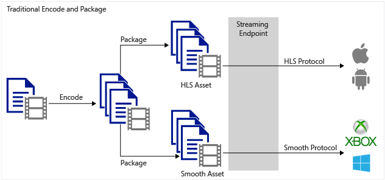
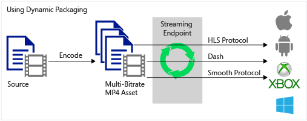

<properties
    pageTitle="Dynamische Verpackung Übersicht | Microsoft Azure"
    description="Das Thema bietet und dynamische Verpackung im Überblick."
    authors="Juliako"
    manager="erikre"
    editor=""
    services="media-services"
    documentationCenter=""/>

<tags
    ms.service="media-services"
    ms.workload="media"
    ms.tgt_pltfrm="na"
    ms.devlang="na"
    ms.topic="article"
    ms.date="10/24/2016" 
    ms.author="juliako"/>

# Dynamische Verpackung

##(Übersicht)

Microsoft Azure Media Services können verwendet werden, um viele Quelle Mediendateiformate Media streaming-Formaten vorführen und Schutz von Inhalten auf einer Vielzahl von Clienttechnologien Formate (z. B. iOS, XBOX, Silverlight, Windows 8). Diese Clients verstanden werden verschiedene Protokolle, beispielsweise iOS erfordert ein Format HTTP Live Streaming (HLS) V4 und Silverlight und Xbox erfordern interpolierten Streaming. Wenn Sie eine Reihe von adaptive Bitrate (Multi-Bitrate) haben MP4 (ISO Basis 14496 bis 12) Mediendateien oder eine Reihe von adaptive Bitrate interpolierten Streaming-Dateien, die Sie für Clients bereitgestellt, die MPEG Gedankenstrich, HLS oder interpolierten Streaming verstehen möchten, sollten Sie nutzen Sie die Vorteile der dynamischen Verpackung Media-Dienste.

Mit dynamischen Verpacken, die Sie benötigen lediglich eine Anlage zu erstellen, die eine Reihe von adaptive Bitrate MP4-Dateien oder adaptive Bitrate interpolierten Streaming-Dateien enthält. Klicken Sie dann wird basierend auf dem angegebenen Format in der Besprechungsanfrage Manifest oder Fragment, das auf Anforderung Streaming Server stellen Sie sicher, dass Sie den Stream in das Protokoll erhalten, die Sie ausgewählt haben. Daher müssen Sie nur zu speichern und die Dateien in den einzelnen Speicherformat bezahlen und Media-Dienste-Dienst erstellen und die entsprechende Antwort basierend auf einem Client-Anfragen dienen.

Das folgende Diagramm zeigt der herkömmlichen Codierung und statischen Verpackung Workflow an.

Das folgende Diagramm veranschaulicht den dynamischen Verpackung-Workflow.

>[AZURE.NOTE]Um dynamische Verpackung nutzen zu können, müssen Sie zunächst mindestens eine bei Bedarf streaming Einheit für das streaming Endpunkt abrufen, aus denen Sie bis zur Bereitstellung des Inhalts planen. Weitere Informationen finden Sie unter [So skalieren Media-Dienste](media-services-portal-manage-streaming-endpoints.md).

##Allgemeine Szenario

1. Hochladen einer Datei (eine Datei Mezzanine bezeichnet). Beispielsweise h. 264, MP4 oder WMV (für die Liste der unterstützten Formate finden Sie unter [Formate von der Media Encoder Standard unterstützt](media-services-media-encoder-standard-formats.md).

1. Codieren Sie Ihre Datei Mezzanine h. 264 MP4 adaptive Bitrate Gruppen.

1. Veröffentlichen Sie die Anlage, die die adaptive Bitrate MP4 festlegen enthält, indem Sie im Locator auf Anforderung erstellen.

1. Erstellen Sie die streaming URLs zum Zugreifen auf und den Inhalt des Streams.

##Vorbereitung von Ressourcen für dynamische streaming

Um Ihrer Ressource für dynamische streaming vorbereiten stehen Ihnen zwei Optionen:

1. [Hochladen einer Datei master](media-services-dotnet-upload-files.md).
2. [Verwenden Sie den Media Encoder Standard Encoder zu erzeugen, h. 264 MP4 adaptive Bitrate Sätze](media-services-dotnet-encode-with-media-encoder-standard.md).
3. [Stream von Inhalten](media-services-deliver-content-overview.md).

##Dateiformate, die vom dynamische Verpackung nicht unterstützt werden

Die folgenden Datenquellen-Dateiformate werden vom dynamische Verpackung nicht unterstützt.

- Dolby digital mp4-Dateien.
- Dolby digitalen interpolierten Dateien.

##Media-Dienste Learning Wege

[AZURE.INCLUDE [media-services-learning-paths-include](../../includes/media-services-learning-paths-include.md)]

##Angeben von feedback

[AZURE.INCLUDE [media-services-user-voice-include](../../includes/media-services-user-voice-include.md)]
