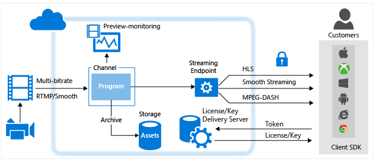
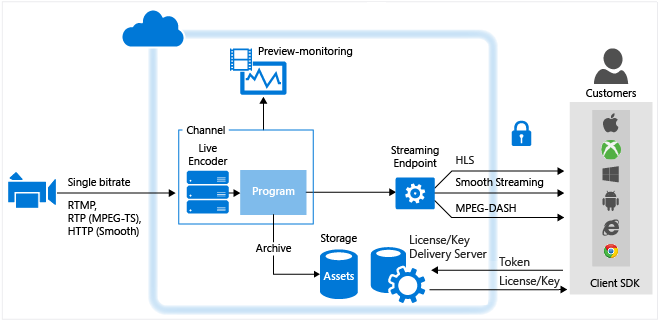

<properties 
    pageTitle="Übersicht über Live gekocht mit Azure Media Services | Microsoft Azure" 
    description="Dieses Thema bietet einen Überblick über die live gekocht Azure Media Services verwenden." 
    services="media-services" 
    documentationCenter="" 
    authors="Juliako" 
    manager="erikre" 
    editor=""/>

<tags 
    ms.service="media-services" 
    ms.workload="media" 
    ms.tgt_pltfrm="na" 
    ms.devlang="ne" 
    ms.topic="article" 
    ms.date="10/17/2016"
    ms.author="juliako"/>

#Übersicht über Live gekocht Azure Media Services verwenden

##(Übersicht)

Beim Vorführen live streaming Ereignisse mit Azure Media Services sind die folgenden Komponenten häufig beteiligt:

- Kamera, mit der ein Ereignis zu übertragen.
- Eine live video Encoder, der von der Kamera Signale in Streams konvertiert, die an einen live-streaming-Dienst gesendet werden.

    Optional können Sie mehrere live Zeit synchronisiert Encoder. Für bestimmte kritische live Ereignisse, dass bei Bedarf sehr hohen Verfügbarkeit und für Quality of Experience, es empfohlen wird, redundante Encoder mit Synchronisierung aktive nahtloses Failover ohne Datenverlust erzielen einzusetzen.
- Ein live streaming-Dienst, der Sie Folgendes ausführen kann:
    
    - Aufnahme live-Inhalten mithilfe verschiedener live streaming Protokolle (beispielsweise RTMP oder interpolierten Streaming)
    - (optional) codieren Sie der Stream in adaptive Bitrate stream
    - für eine Vorschau der live-Streams
    - Zeichnen Sie auf und speichern Sie den Inhalt der Motor angesaugten und höher (Demand) gestreamt werden
    - Stellen Sie das Content über gängige streaming Protokolle (z. B. MPEG Gedankenstrich, Weiche, HLS, HDS), direkt an Ihre Kunden oder zu einer Inhalt Delivery Network (CDN) für die weitere Verteilung.

**Microsoft Azure Media-Dienste** (AMS) bietet die Möglichkeit, Aufnahme, codieren, Vorschau, speichern und Vorführen Ihrer live streaming von Inhalten.

Beim Übermitteln von Inhalten für Kunden ist das Ziel ein Videos hoher Qualität verschiedenen Geräten unter anderen Netzwerkprobleme vorführen. Um dies zu erreichen, verwenden Sie live Encoder, um Ihre Stream in einen Multi-Bitrate (adaptive Bitrate) video Stream codieren.  Verwenden Sie zum Übernehmen von streaming auf verschiedenen Geräten, Media-Dienste [dynamische Verpackung](media-services-dynamic-packaging-overview.md) dynamisch Ihre Stream zu anderen Protokolle erneut verpacken. Media-Dienste unterstützt die folgenden adaptive Bitrate streaming Technologien Übermittlung: HTTP Live Streaming (HLS), interpolierten Streaming, MPEG Gedankenstrich und HDS (für nur Adobe vorzeigbare/Access Lizenznehmern).

In Azure Media-Diensten behandeln **Kanäle**, **Programme**und **StreamingEndpoints** alle live streaming Funktionen einschließlich Erfassung, Formatierung, DVR, Sicherheit, Skalierbarkeit und Redundanz.

Ein **Channel** stellt eine Verkaufspipeline für die Verarbeitung von live streaming von Inhalten. Ein Kanal kann eine live erhalten Eingabemethoden Streams auf folgende Weise:

- Klicken Sie auf eine lokale live Encoder sendet Multi-Bitrate **RTMP** oder **Interpolierten Streaming** (fragmentierte MP4) an den Kanal, der für die **Pass-Through-** Übermittlung konfiguriert ist. Die **Pass-Through** -Übermittlung ist, wenn der Motor angesaugten Streams **Channel**s weitergeben, ohne die weitere Verarbeitung. Sie können die folgenden live Encoder, die Multi-Bitrate interpolierten Streaming ausgeben: Elementen, Envivio, Cisco.  Die folgenden live Encoder ausgeben RTMP: Adobe Flash Medien Live Encoder (FMLE), Telestream Wirecast und Tricaster Kodierungsprogramme.  Ein live Encoder kann auch einen einzelnen Bitrate Stream an einen Kanal senden, die für die live-Codierung nicht aktiviert ist, aber, die nicht empfohlen wird. Wenn Sie aufgefordert werden, bietet ein Media-Dienste Streams.

    >[AZURE.NOTE] Mithilfe einer Pass-Through-Methode ist die am häufigsten preisgünstige Möglichkeit zum streaming live, wenn Sie mehrere Ereignisse über längere Zeit durchführen, und Sie haben bereits in der lokalen Encoder investiert. Anzeigen von Details [Preise](/pricing/details/media-services/) .
    
    
- Ein lokale live Encoder sendet einen einzelnes-Bitrate Stream an den Kanal, die zum Ausführen der live-Codierung mit den Diensten von Medien in einem der folgenden Formate aktiviert ist: RTMP oder interpolierten Streaming (fragmentierte MP4). RTP (MPEG-Terminaldienste) wird ebenfalls unterstützt, wenn Sie eine dedizierte Verbindung Azure Data Center verfügen. Die folgenden live Encoder mit RTMP Ausgabe für die Arbeit mit Kanäle dieses Typs bekannt sind: Telestream Wirecast, FMLE. Klicken Sie dann der Kanal führt live-Codierung des eingehenden einzelnen Bitrate Stream zu einem Videodatenstrom Multi-Bitrate (adaptive). Wenn Sie aufgefordert werden, bietet ein Media-Dienste Streams.

Ab Release Media Services 2.10, wenn Sie einen Kanal erstellen, können Sie angeben, auf welche Weise Sie für Ihre Channel Eingabe-Stream erhalten möchten und, unabhängig davon, ob Sie für den Kanal live Codieren von Ihrem Stream ausführen möchten. Sie haben zwei Optionen:

- **Keine** (Pass-Through) – Geben Sie diesen Wert, ein, wenn Sie beabsichtigen, einen lokalen live Encoder verwenden, die Multi-Bitrate Stream (Pass-Through-Stream) ausgegeben wird. In diesem Fall übergeben ohne beliebiger Codierung der eingehende Stream durch in die Ausgabe ein. Dies ist das Verhalten der einen Kanal vor Version 2.10.  

- **Standard** – dies Wert, wenn Sie beabsichtigen, Media-Dienste zu verwenden, um Ihre einzelnen Bitrate live Stream in Multi-Bitrate Stream codieren auswählen. Diese Methode ist für die Skalierung von schnell für seltene Ereignisse. Achten Sie darauf, dass eine Abrechnung Auswirkung für live Codierung und denken Sie daran, dass einen live codieren Kanal in den Status "Ausführen" verlassen Gebühren anfallen.  Es wird empfohlen, dass Ihre laufenden Kanäle sofort zu beenden, nachdem Ihr live streaming Ereignis zusätzliche stündliche Gebühren zu vermeiden abgeschlossen ist. 

##Vergleich der Channel-Typen

In der folgenden Tabelle Leitfaden ein für Vergleich der zwei Typen von Channel unterstützt Media-Dienste

Feature|Pass-Through-Kanal|Standard-Kanal
---|---|---
Einzelne Bitrate Eingabe wird in mehreren eine Bitrate in der Cloud codiert.|Nein|Ja
Maximale Auflösung, die Anzahl der Ebenen|1080p, 8 Ebenen, 60 + f/s|720p, 6 Layer, 30 Frames/s
Eingabe Protokolle|RTMP, Streaming Glätten|RTMP, interpolierten Streaming und RTP
Kurs|Die [Preise Seite](/pricing/details/media-services/) finden Sie unter, und klicken Sie auf der Registerkarte "Live Video"|Die [Seite Preise](/pricing/details/media-services/) finden Sie unter 
Maximale Laufzeit|24 x 7|8 Stunden
Unterstützung für Slate einfügen|Nein|Ja
Unterstützung für Ad Signalton|Nein|Ja
Pass-Through-CEA 608/708 Beschriftungen|Ja|Ja
Möglichkeit zum Wiederherstellen von kurze Stellplätze in Beitrag-Feeds|Ja|Nein (Channel wird Slating nach 6 + Sekunden eingegebenen Daten beginnen)
Unterstützung für ungleichmäßig Eingabemethoden GOPs|Ja|Nein – muss Eingabe 2 sec GOPs konstant bleiben
Unterstützung für Variable Rahmen Zins Eingabe|Ja|Nein – muss Eingabesprache Frame-Rate behoben werden. Kleinere Variationen werden beispielsweise während high-Motion Szenen vorgenommen. Aber Encoder zu 10 Rahmen/s kann nicht gelöscht werden.
Abschalten der Kanäle Wenn Eingabemethoden-feed geht verloren|Nein|Nach 12 Stunden, wenn kein Programm ausführen 

##Arbeiten mit Kanäle, die Multi-Bitrate live Stream von lokalen Encoder (Pass-Through) erhalten

Das folgende Diagramm zeigt die wichtigsten Teile der AMS-Plattform, die beteiligt sind, **Pass-Through** -Workflows aufzurufen.

Weitere Informationen finden Sie unter [Arbeiten mit Kanäle dieser empfangen Multi-Bitrate Live Stream aus lokalen Encoder](media-services-live-streaming-with-onprem-encoders.md).

##Arbeiten mit Kanäle, die auszuführenden live Codierung mit Azure Media Services aktiviert sind

Das folgende Diagramm zeigt die wichtigsten Teile der AMS-Plattform, die beteiligt sind in Live Streaming Workflow, ein Kanal live Codierung mit den Diensten von Medien ausführen aktiviert ist.

Weitere Informationen finden Sie unter [Arbeiten mit Kanäle, die zum Ausführen mit Azure Media Services Codierung Live aktiviert sind](media-services-manage-live-encoder-enabled-channels.md).

##Beschreibung der einen Kanal und die zugehörigen Komponenten

###Kanal

Media-Dienste [Channel](https://msdn.microsoft.com/library/azure/dn783458.aspx)s Verarbeitung live streaming-Inhalten verantwortlich sind. Ein Kanal stellt von außen liegenden Tabellenblättern (Aufnahme URL), klicken Sie dann auf einem live Kodierungsprogramm anzugeben. Der Kanal empfängt live Eingabewerte Streams aus der live Kodierungsprogramm und für das streaming über eine oder mehrere StreamingEndpoints bereitgestellt. Kanäle bieten auch einen Endpunkt Preview (Vorschau-URL), den Sie in der Vorschau und überprüfen Ihre Stream, bevor Sie weitere Verarbeitung und Übermittlung verwenden.

Wenn Sie den Kanal erstellen, können Sie die URL für die Erfassung und die Vorschau-URL erhalten. Um diese URLs zu gelangen, verfügt der Kanal nicht im Schritte Zustand sein. Wenn Sie zum Senden der Daten aus einem live Kodierungsprogramm in den Kanal starten bereit sind, muss der Kanal gestartet werden. Nachdem die live Kodierungsprogramm Aufnahme Daten startet, können Sie Ihre Stream Vorschau anzeigen.

Jedes Konto Media-Dienste kann mehrere Kanäle, mehrere Programme und mehrere StreamingEndpoints enthalten. Je nach den Erfordernissen Bandbreite und Sicherheit können StreamingEndpoint Services auf einen oder mehrere Kanäle reserviert sein. Alle StreamingEndpoint kann von einem beliebigen Kanal abrufen.

###Programm 

Ein [Programm](https://msdn.microsoft.com/library/azure/dn783463.aspx) ermöglicht es Ihnen, die für die Veröffentlichung und Speicherung Segmente in einem live Stream steuern. Kanäle verwalten Programme. Die Beziehung Channel und Programm ist sehr ähnlich wie herkömmliche Medien, wo ein Kanal hat einen Konstanten Videodatenstrom von Inhalten und ein Programm ist auf einigen terminierten Ereignis in diesem Kanal ausgelegte.
Sie können angeben, die Anzahl der Stunden, die den aufgezeichneten Inhalt für das Programm durch Festlegen der Eigenschaft **ArchiveWindowLength** beibehalten werden sollen. Dieser Wert kann maximal 25 Stunden aus mindestens 5 Minuten festgelegt werden. 

ArchiveWindowLength schreibt auch vor, dass die maximale Größe des Zeit-Clients aus der die aktuelle Position live zeitlich rückwärts anfordern kann. Programme ausgeführt werden können, über den festgelegten Zeitraum, aber Inhalt, der hinter dem Fensterlänge fällt wird kontinuierlich verworfen. Dieser Wert dieser Eigenschaft bestimmt auch an, wie lange die Client-Manifeste wachsen können.

Jedes Programm ist eine Anlage zugeordnet. Um das Programm zu veröffentlichen, müssen Sie einen Locator für die zugeordnete Anlage erstellen. Diese Locator Probleme aktivieren Sie zum Erstellen eines streaming URL, die für Kunden bereitgestellt werden können.

Ein Kanal unterstützt bis zu drei gleichzeitig ausgeführte Programme an, sodass Sie mehrere Archiven des gleichen eingehende Streams erstellen können. So können Sie veröffentlichen und anderen Teile eines Ereignisses archivieren, je nach Bedarf. Beispielsweise ist Ihre geschäftliche Anforderung 6 Stunden eines Programms archivieren, sondern nur in den letzten 10 Minuten übertragen. Um dies zu erreichen, müssen Sie zwei gleichzeitig ausgeführte Programme erstellen. Archivieren von 6 Stunden des Ereignisses ein Programm festgelegt ist, aber das Programm wird nicht veröffentlicht. Das andere Programm für 10 Minuten archivieren festgelegt ist, und dieses Programm veröffentlicht wird.

##Auswirkungen der Abrechnung

Ein Kanal beginnt, sobald sie Übergänge zwischen in "Running" über die-API ist Abrechnung.  

Die folgende Tabelle zeigt, wie Channel Staaten Abrechnung Zuständen im Portal API und Azure zugeordnet. Beachten Sie, dass die Staaten weicht zwischen API und Portal UX. Sobald ein Kanal in den Status "Einstieg" über die-API oder in den Status "Bereit" oder "Streaming" Azure-Portal ist, wird der Abrechnung aktiv sein.

Zum Beenden des Kanals aus Sie weiteren Abrechnung, müssen Sie den Kanal über die-API oder der Azure-Portal zu beenden.
Sie sind verantwortlich für Ihre Kanäle beenden, wenn Sie mit dem Kanal fertig sind. So beenden Sie den Kanal Fehler führt kontinuierliche Abrechnung.

>[AZURE.NOTE]Bei der Arbeit mit herkömmliche Kanäle wird AMS Silhouette keinen Kanal automatisch, die sich noch im Status "Ausführen" 12 Stunden nach der Eingabe Feed verloren geht, und es sind keine Programme ausgeführt wird. Jedoch erhalten Sie weiterhin für die Uhrzeit Abrechnung, die im Status "Ausführen" Kanal war.

###Channel Staaten und deren Zuordnung in den Modus Abrechnung 

Der aktuelle Status eines Channel. Mögliche Werte sind:

- **Nicht mehr**. Dies ist der anfänglicher Status des den Kanal nach der Erstellung (sofern keine Autostart im Portal ausgewählt wurde). Keine Abrechung in diesem Zustand. In diesem Zustand die Channel-Eigenschaften können aktualisiert werden, aber streaming ist nicht zulässig.
- **Starten**. Der Kanal wird gestartet. Keine Abrechung in diesem Zustand. Keine Updates oder streaming während dieser Status zulässig ist. Falls ein Fehler auftritt, gibt der Kanal in den Zustand beendet.
- **Ausgeführt wird**. Der Kanal ist Lage live Streams zu verarbeiten. Es ist jetzt Verwendung Abrechnung. Sie müssen den Kanal, um zu verhindern, dass weitere Abrechnung beenden. 
- **Beenden**. Der Kanal wird gestoppt. Keine Abrechung in diesem vorübergehenden Zustand. Keine Updates oder streaming während dieser Status zulässig ist.
- **Löschen**. Der Kanal wird gelöscht. Keine Abrechung in diesem vorübergehenden Zustand. Keine Updates oder streaming während dieser Status zulässig ist.

Die folgende Tabelle zeigt die Channel Staaten wie in den Modus Abrechnung zuordnen. 
 
Channel Zustand|Portal Benutzeroberfläche Indikatoren|Handelt es sich um Abrechnung?
---|---|---
Starten|Starten|Keine (vorübergehenden Zustand)
Ausführen|Sofort (keine ausgeführte Programme) oder Streaming (mindestens ein Programm ausführt)|JA
Beenden|Beenden|Keine (vorübergehenden Zustand)
Beendet|Beendet|Nein

##Media-Dienste Learning Wege

[AZURE.INCLUDE [media-services-learning-paths-include](../../includes/media-services-learning-paths-include.md)]

##Angeben von feedback

[AZURE.INCLUDE [media-services-user-voice-include](../../includes/media-services-user-voice-include.md)]

##Verwandte Themen

[Azure Media Services fragmentierte MP4 Live Aufnahme Spezifikation](media-services-fmp4-live-ingest-overview.md)

[Arbeiten mit Kanäle, die zum Ausführen mit Azure Media Services Codierung Live aktiviert sind](media-services-manage-live-encoder-enabled-channels.md)

[Arbeiten mit Kanäle, die Multi-Bitrate Live Stream von lokalen Encoder erhalten](media-services-live-streaming-with-onprem-encoders.md)

[Kontingente und Einschränkungen](media-services-quotas-and-limitations.md).  

[Media-Dienste (Konzepte)](media-services-concepts.md)
