<properties
    pageTitle="Verwenden mehrere Eingabe- und Komponenteneigenschaften mit Premium Encoder | Microsoft Azure"
    description="In diesem Thema wird erläutert, wie SetRuntimeProperties Verwenden mehrerer Eingabewerte Dateien und benutzerdefinierte Daten an den Media Encoder Premium Workflow Medienprozessor verwenden."
    services="media-services"
    documentationCenter=""
    authors="xpouyat"
    manager="erikre"
    editor=""/>

<tags
    ms.service="media-services"
    ms.workload="media"
    ms.tgt_pltfrm="na"
    ms.devlang="na"
    ms.topic="article"
    ms.date="10/10/2016"  
    ms.author="xpouyat;anilmur;juliako"/>

# Verwenden von mehreren Eingabe- und Komponenteneigenschaften mit Premium Encoder

## (Übersicht)

Es gibt Szenarien, in denen Sie möglicherweise müssen Komponenteneigenschaften anpassen Clip Liste XML-Inhalt angeben oder Senden mehrerer Eingabewerte Dateien beim Übermitteln einer Aufgabe mit dem **Media Encoder Premium Workflow** Medienprozessor. Einige Beispiele für sind:

- Überlagern von Text auf Video und festlegen den Textwert enthaltenen Textwert (beispielsweise das aktuelle Datum) zur Laufzeit für jedes von Video.
- Anpassen der ClipArt Liste XML (um einer oder mehreren Quelldateien mit oder ohne verkürzen usw. anzugeben.).
- Überlagern ein Logobild die Eingabe video während des Videos codiert ist.

Um den **Media Encoder Premium Workflow** wissen, dass Sie beim Erstellen der Aufgabe oder mehrere Eingabewerte Dateien senden einige Eigenschaften im Workflow ändern möchten, müssen Sie eine Konfigurationszeichenfolge verwenden können enthält, **SetRuntimeProperties** und/oder **TranscodeSource**. In diesem Thema wird erläutert, wie sie verwendet werden.

## Die Syntax der Konfiguration-Zeichenfolge

Die Konfigurationszeichenfolge in der Codierung Vorgang festlegen verwendet ein XML-Dokument, das sieht wie folgt aus:

    <?xml version="1.0" encoding="utf-8"?>
    <transcodeRequest>
      <transcodeSource>
      </transcodeSource>
      <setRuntimeProperties>
        <property propertyPath="Media File Input/filename" value="MyInputVideo.mp4" />
      </setRuntimeProperties>
    </transcodeRequest>

Im folgenden werden die C#-Code, der die XML-Konfiguration aus einer Datei gelesen und übergibt, die dem Vorgang in einem Projekt:

    XDocument configurationXml = XDocument.Load(xmlFileName);
    IJob job = _context.Jobs.CreateWithSingleTask(
                                                  "Media Encoder Premium Workflow",
                                                  configurationXml.ToString(),
                                                  myAsset,
                                                  "Output asset",
                                                  AssetCreationOptions.None);

## Anpassen der Komponenteneigenschaften  

### Die Eigenschaft mit einem einfachen Wert
In einigen Fällen ist es sinnvoll, eine Komponenteneigenschaft zusammen mit der Workflow-Datei anpassen möchten, die von Media Encoder Premium Workflow ausgeführt werden.

Angenommen Sie, Sie entworfen eines Workflows überlagert Texts auf Videos und der Text (beispielsweise das aktuelle Datum) zur Laufzeit festgelegt werden soll. Sie können hierzu Senden des Texts als den neuen Wert für die Texteigenschaft der Überlagerung Komponente aus dem Codierung Vorgang festgelegt werden. Dieses Verfahren können Sie andere Eigenschaften einer Komponente im Workflow (wie etwa die Position oder Farbe der Überlagerung, die Bitrate des AVC Encoder usw..) ändern.

**SetRuntimeProperties** wird verwendet, um eine Eigenschaft in den Komponenten des Workflows zu überschreiben.

Beispiel:

    <?xml version="1.0" encoding="utf-8"?>
      <transcodeRequest>
        <setRuntimeProperties>
          <property propertyPath="Media File Input/filename" value="MyInputVideo.mp4" />
          <property propertyPath="/primarySourceFile" value="MyInputVideo.mp4" />
          <property propertyPath="Optional Overlay/Overlay/filename" value="MyLogo.png"/>
          <property propertyPath="Optional Text Overlay/Text To Image Converter/text" value="Today is Friday the 13th of May, 2016"/>
      </setRuntimeProperties>
    </transcodeRequest>

### Mit einer XML-Wert der Eigenschaft

Um eine Eigenschaft festzulegen, die einen XML-Wert erwartet, zu einschließen, indem Sie mit `<![CDATA[ and ]]>`.

Beispiel:

    <?xml version="1.0" encoding="utf-8"?>
      <transcodeRequest>
        <setRuntimeProperties>
          <property propertyPath="/primarySourceFile" value="start.mxf" />
          <property propertyPath="/inactiveTimeout" value="65" />
          <property propertyPath="clipListXml" value="xxx">
          <extendedValue><![CDATA[<clipList>
            <clip>
              <videoSource>
                <mediaFile>
                  <file>start.mxf</file>
                </mediaFile>
              </videoSource>
              <audioSource>
                <mediaFile>
                  <file>start.mxf</file>
                </mediaFile>
              </audioSource>
            </clip>
            <primaryClipIndex>0</primaryClipIndex>
            </clipList>]]>
          </extendedValue>
          </property>
          <property propertyPath="Media File Input Logo/filename" value="logo.png" />
        </setRuntimeProperties>
      </transcodeRequest>

>[AZURE.NOTE]Vergewissern Sie sich nicht in einen Wagenrücklauf Absenderadresse nur nach `<![CDATA[`.

### PropertyPath-Wert

In den vorherigen Beispielen, wurde die PropertyPath "/ von Mediendateien Eingabe/Dateiname" oder "/ InactiveTimeout" oder "ClipListXml".
Dies ist im Allgemeinen den Namen der Komponente, und klicken Sie dann auf den Namen der Eigenschaft. Der Pfad kann mehr oder weniger Ebenen enthalten, wie "/ PrimarySourceFile" (da die Eigenschaft im Stammverzeichnis der Workflow ist) oder "/ Video Verarbeitung/Grafik Überlagerung/Deckkraft" (da die Überlagerung in einer Gruppe ist).    

Um den Pfad und die Eigenschaft Namen überprüfen zu können, verwenden Sie die interaktive Schaltfläche, die unmittelbar neben jeder Eigenschaft ist. Sie können klicken Sie auf diese Aktionsschaltfläche,, und wählen Sie **Bearbeiten**aus. Daraufhin wird der tatsächliche Name der Eigenschaft und unmittelbar darüber Namespace angezeigt.

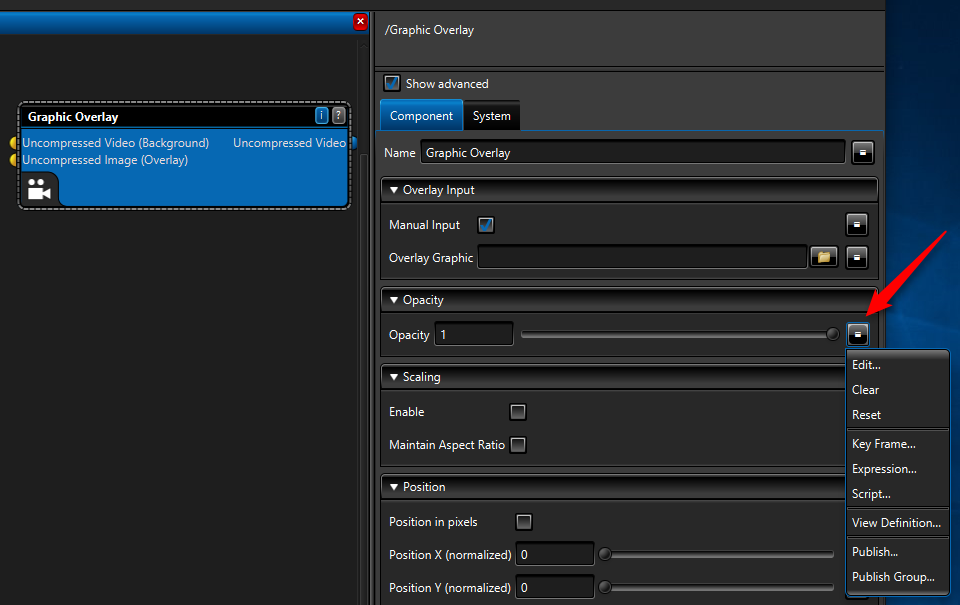

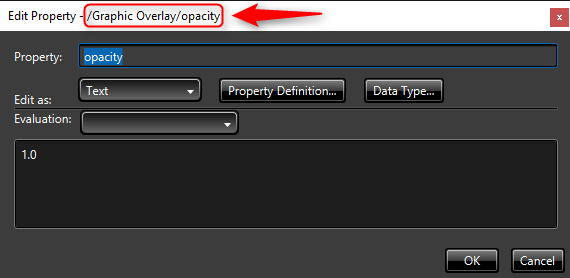

## Mehrere von Dateien

Jede Aufgabe, die Sie mit dem **Media Encoder Premium Workflow** senden erfordert zwei Anlagen:

- Die erste ist eine *Workflow-Anlage* , die eine Workflow-Datei enthält. Sie können Workflowdateien mithilfe des [Workflow-Designers](media-services-workflow-designer.md)entwerfen.
- Die zweite ist eine *Anlage Medien* , die die Mediendatei(en) enthält, die codiert werden soll.

Wenn Sie mehrere Mediendateien an den Encoder **Media Encoder Premium Workflow** senden, gelten die folgenden Einschränkungen:

- Die Mediendateien müssen den gleichen *Medien Anlage*. Verwenden von mehreren Medienobjekten wird nicht unterstützt.
- Sie müssen die primäre Datei in dieser Anlage Medien festlegen (idealerweise Dies ist das Hauptfenster Videodatei, die der Encoder Verarbeitungszeit aufgefordert wird).
- Es ist erforderlich, Konfigurationsdaten zu übergeben, die das Element **SetRuntimeProperties** und/oder **TranscodeSource** an den Prozessor enthält.
  - **SetRuntimeProperties** wird verwendet, um die Filename-Eigenschaft oder eine andere Eigenschaft in den Komponenten des Workflows zu überschreiben.
  - **TranscodeSource** wird verwendet, um den Clip Liste XML-Inhalt anzugeben.

Verbindungen im Workflow:

 - Wenn Sie eine oder mehrere Medien Datei Eingabesprache Komponenten und planen **SetRuntimeProperties** verwenden, um anzugeben, den Dateinamen verwenden, dann schließen Sie die primäre Datei Komponente Pin können. Stellen Sie sicher, dass es keine Verbindung zwischen dem primären Dateiobjekt und der Medien Datei Aussteuerungsanzeige besteht.
 - Wenn Sie bevorzugen jeweils das XML-Liste der ClipArt und eine Medien Quellkomponente, und klicken Sie dann beide miteinander zu verbinden.

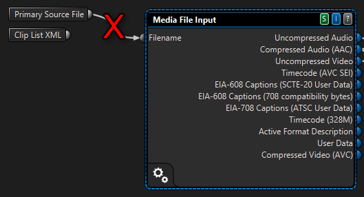

*Es gibt keine Verbindung zwischen der primären Datei und Medien Datei Eingabesprache Komponenten, wenn Sie SetRuntimeProperties verwenden, um die Filename-Eigenschaft festzulegen.*

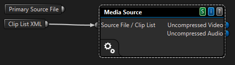

*Sie können Herstellen einer Verbindung Medienquelle mit ClipArt Liste XML und TranscodeSource verwenden.*

### ClipArt Liste XML-Anpassung
Sie können die ClipArt-Liste XML-Daten im Workflow zur Laufzeit in der Konfigurationszeichenfolge XML mithilfe von **TranscodeSource** angeben. Setzt die ClipArt-Liste XML-Pin für die Medien Quellkomponente im Workflow verbunden sein.

    <?xml version="1.0" encoding="utf-16"?>
      <transcodeRequest>
        <transcodeSource>
          <clipList>
            <clip>
              <videoSource>
                <mediaFile>
                  <file>video-part1.mp4</file>
                </mediaFile>
              </videoSource>
              <audioSource>
                <mediaFile>
                  <file>video-part1.mp4</file>
                </mediaFile>
              </audioSource>
            </clip>
            <primaryClipIndex>0</primaryClipIndex>
          </clipList>
        </transcodeSource>
        <setRuntimeProperties>
          <property propertyPath="Media File Input Logo/filename" value="logo.png" />
        </setRuntimeProperties>
      </transcodeRequest>

Wenn Sie /primarySourceFile zur Verwendung dieser Eigenschaft die Ausgabedateien mithilfe von 'Ausdrücke' Namen angeben möchten, wird empfohlen dann übergeben die ClipArt-Liste XML-Daten als eine Eigenschaft *nach* der Eigenschaft /primarySourceFile zu verhindern, dass die ClipArt-Liste, die durch die /primarySourceFile-Einstellung außer Kraft gesetzt werden.

    <?xml version="1.0" encoding="utf-8"?>
      <transcodeRequest>
        <setRuntimeProperties>
          <property propertyPath="/primarySourceFile" value="c:\temp\start.mxf" />
          <property propertyPath="/inactiveTimeout" value="65" />
          <property propertyPath="clipListXml" value="xxx">
          <extendedValue><![CDATA[<clipList>
            <clip>
              <videoSource>
                <mediaFile>
                  <file>c:\temp\start.mxf</file>
                </mediaFile>
              </videoSource>
              <audioSource>
                <mediaFile>
                  <file>c:\temp\start.mxf</file>
                </mediaFile>
              </audioSource>
            </clip>
            <primaryClipIndex>0</primaryClipIndex>
            </clipList>]]>
          </extendedValue>
          </property>
          <property propertyPath="Media File Input Logo/filename" value="logo.png" />
        </setRuntimeProperties>
      </transcodeRequest>

Mit zusätzlichen Rahmen genau verkürzen:

    <?xml version="1.0" encoding="utf-8"?>
      <transcodeRequest>
        <setRuntimeProperties>
          <property propertyPath="/primarySourceFile" value="start.mxf" />
          <property propertyPath="/inactiveTimeout" value="65" />
          <property propertyPath="clipListXml" value="xxx">
          <extendedValue><![CDATA[<clipList>
            <clip>
              <videoSource>
                <trim>
                  <inPoint fps="25">00:00:05:24</inPoint>
                  <outPoint fps="25">00:00:10:24</outPoint>
                </trim>
                <mediaFile>
                  <file>start.mxf</file>
                </mediaFile>
              </videoSource>
              <audioSource>
               <trim>
                  <inPoint fps="25">00:00:05:24</inPoint>
                  <outPoint fps="25">00:00:10:24</outPoint>
                </trim>
                <mediaFile>
                  <file>start.mxf</file>
                </mediaFile>
              </audioSource>
            </clip>
            <primaryClipIndex>0</primaryClipIndex>
            </clipList>]]>
          </extendedValue>
          </property>
          <property propertyPath="Media File Input Logo/filename" value="logo.png" />
        </setRuntimeProperties>
      </transcodeRequest>

## Beispiel

Erwägen Sie ein Beispiel, in dem Überlagern von ein Logobild auf die Eingabe video während des Videos codiert werden soll. In diesem Beispiel das Eingabewerte Video ist mit der Bezeichnung "MyInputVideo.mp4", und das Logo ist mit der Bezeichnung "MyLogo.png". Führen Sie die folgenden Schritte aus:

- Erstellen einer Workflow-Anlage mit der Workflow-Datei (siehe folgendes Beispiel).
- Erstellen Sie eine Anlage Medien, die zwei Dateien enthält: MyInputVideo.mp4 als die primäre Datei und MyLogo.png.
- Senden einer Aufgabe an den Media Encoder Premium Workflow Medienprozessor mit der obigen Eingabewerte Posten, und geben Sie die folgende Konfigurationszeichenfolge.

Konfiguration:

    <?xml version="1.0" encoding="utf-8"?>
      <transcodeRequest>
        <setRuntimeProperties>
          <property propertyPath="Media File Input/filename" value="MyInputVideo.mp4" />
          <property propertyPath="/primarySourceFile" value="MyInputVideo.mp4" />
          <property propertyPath="Media File Input Logo/filename" value="MyLogo.png" />
        </setRuntimeProperties>
      </transcodeRequest>

Im obigen Beispiel wird der Name der Videodatei an die Medien Datei Eingabesprache Komponente und die Eigenschaft PrimarySourceFile gesendet. Der Namen der Logodatei ein wird an eine andere Medien Datei Eingabesprache gesendet, die auf die Grafik Überlagerung Komponente verbunden ist.

>[AZURE.NOTE]Der Name der Videodatei wird an die Eigenschaft PrimarySourceFile gesendet. Der Grund dafür besteht darin, verwenden diese Eigenschaft im Workflow für die richtige Ausgabedateinamen mithilfe von Ausdrücken, beispielsweise erstellen.

### Schrittweise Workflows erstellen, die ein Logo auf das Video überlagert     

Hier sind die Schritte zum Erstellen eines Workflows, die beiden Dateien als Eingabe akzeptiert: ein Video und ein Bild. Es wird das Bild auf das Video überlagern.

**Workflow-Designer** zu öffnen, und wählen Sie die **Datei** > **Neuen Arbeitsbereich** > **Codierung Entwurf**.

Der neue Workflow zeigt drei Elemente:

- Primäre Quelldatei
- ClipArt-XML-Liste
- Die Ausgabe Datei/Anlage  

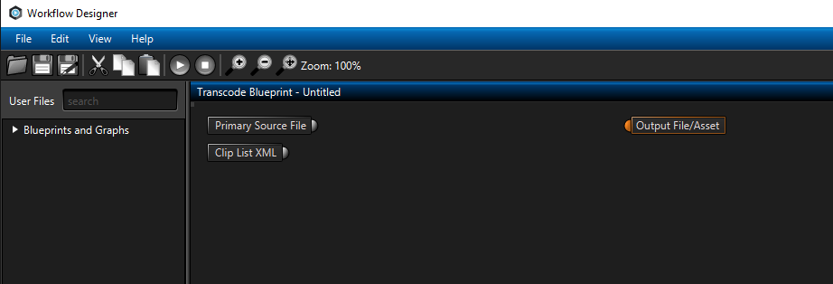

*Neue Codierung Workflow*

Akzeptieren, um die Mediendatei von annehmen möchten, beginnen Sie mit eine Medien Datei Eingabewerte Komponente hinzufügen. Um eine Komponente mit dem Workflow hinzuzufügen, ihn in das Suchfeld Repository suchen Sie, und ziehen Sie den gewünschten Eintrag in der Designer-Bereich.

Fügen Sie die Videodatei für das Entwerfen des Workflows verwendet werden. Hierzu klicken Sie im Bereich Hintergrund im Workflow-Designer auf, und suchen Sie nach der primären Quelldatei-Eigenschaft auf den rechten Eigenschaftenbereich. Klicken Sie auf das Ordnersymbol, und wählen Sie die entsprechenden Videodatei aus.

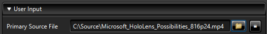

*Primäre Dateiquelle*

Geben Sie dann die Videodatei in der Komponente Medien Dateieingabe.   

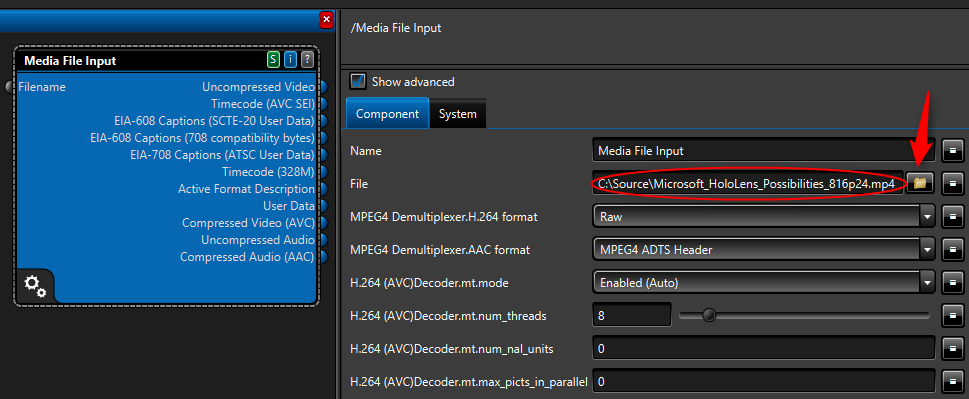

*Eingabe Quelle von Mediendateien*

Sobald dies der Fall, wird die Komponente Medien Dateieingabe prüfen die Datei und füllen Sie die Ausgabe Stifte entsprechend die Datei, die sie überprüft.

Im nächsten Schritt wird eine "Video Datentyp Updater" zum Angeben des Farbspektrum zu Rec.709 hinzufügen. Hinzufügen eines "Video formatieren Konverter", die auf Daten Layout/Layouttyp festgelegt werden = konfigurierbare Ebene. Dies wird den Videodatenstrom in ein Format konvertiert, die als Quelle für die Überlagerung Komponente durchgeführt werden können.

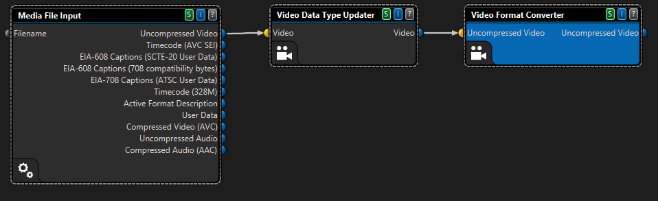

*Videodaten Typ Updater und Dateiformat-Konverter*

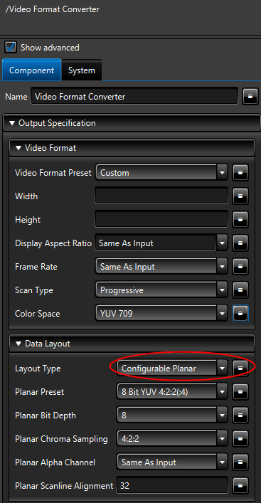

*Layouttyp ist konfigurierbare Ebene*

Fügen Sie eine Komponente Überlagern von Videos, und Herstellen einer Verbindung die (nicht komprimiert) video Pin der Eingabe Datei Medien mit video Pin (nicht komprimiert).

Hinzufügen einer anderen Medien Dateieingabe (zum Laden die Datei des Logos), klicken Sie auf diese Komponente benennen Sie sie in "Medien Datei Eingabesprache Logo", und wählen Sie ein Bild (beispielsweise eine PNG-Datei) in der Dateieigenschaft. Herstellen einer Verbindung die Pin nicht komprimierten Image der Überlagerung mit der Pin nicht komprimiert Bild.

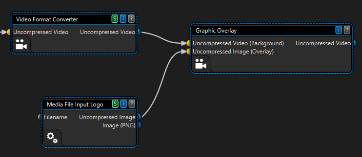

*Überlagern von Komponente und Bild Dateiquelle*

Wenn Sie die Position des Logos auf das Video ändern möchten (beispielsweise Sie möglicherweise möchten sie bei 10 Prozent sich von der oberen linken Ecke des Videos positionieren), deaktivieren Sie das Kontrollkästchen "Manuelle Eingabe". Dies ist möglich, da Sie die Logodatei für die Überlagerung Komponente Bereitstellen einer Medien Dateieingabe verwenden.

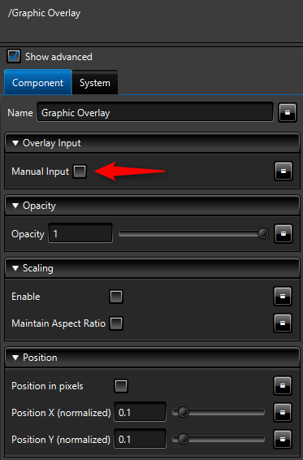

*Überlagern von position*

Um den Videodatenstrom zu h. 264 codieren, fügen Sie die Video Encoder AVC und AAC Encoder-Komponenten der Oberfläche des Designers hinzu. Verbinden Sie die Stifte.
Einrichten der AAC Encoder, und wählen Sie Audio Format Konvertierung/Voreinstellung: 2.0 (L, R).

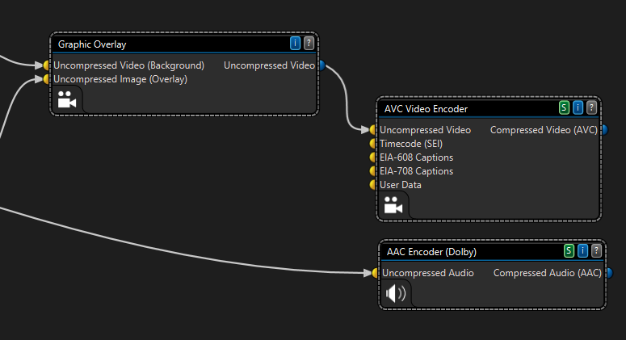

*Audio und Video Encoder*

Jetzt fügen Sie die **ISO Mpeg-4 Multiplexer** und **DateiAusgabe** Komponenten hinzu und verbinden Sie die Stifte wie dargestellt.

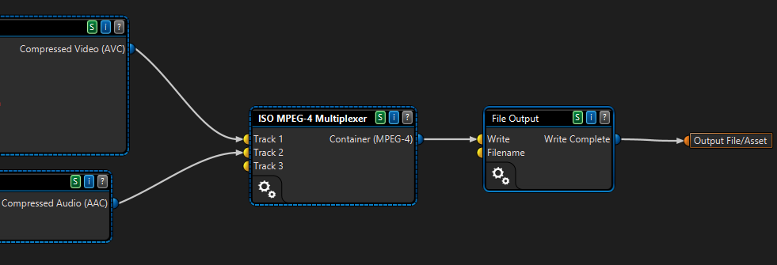

*MP4 multiplexer und Dateiausgabe*

Sie müssen den Namen für die Ausgabedatei festlegen. Klicken Sie auf die **DateiAusgabe** Komponente und bearbeiten Sie den Ausdruck für die Datei:

    ${ROOT_outputWriteDirectory}\${ROOT_sourceFileBaseName}_withoverlay.mp4

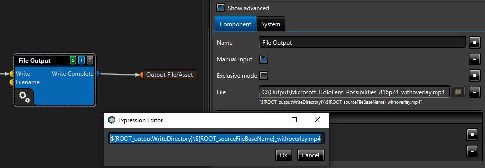

*Die Ausgabe-Dateiname*

Sie können den Workflow lokal an, um sicher, dass es richtig läuft ausführen.

Nachdem er beendet hat, können Sie es in Azure Media Services ausführen.

Zunächst vorbereiten eine Anlage in Azure Media Services mit zwei Dateien darin: die Videodatei und das Logo. Sie können dies mithilfe des .NET oder REST-API ausführen. Sie können auch hierfür mithilfe der Azure-Portal oder [Azure Media Services Explorer](https://github.com/Azure/Azure-Media-Services-Explorer) (AMSE).

In diesem Lernprogramm erfahren Sie, wie zum Verwalten von Anlagen mit AMSE. Es gibt zwei Methoden zum Hinzufügen von Dateien zu einer Anlage aus:

- Erstellen Sie einen lokalen Ordner, kopieren Sie die beiden Dateien darin, und Drag & drop den Ordner, um die Registerkarte **Anlage** .
- Die Videodatei als Anlage hochladen, die Informationen zum Posten anzuzeigen, wechseln Sie zur Registerkarte Dateien und Hochladen einer zusätzlichen Datei (Logo).

>[AZURE.NOTE]Vergewissern Sie sich in einer primären Datei in die Anlage (das Hauptfenster Videodatei) festlegen.

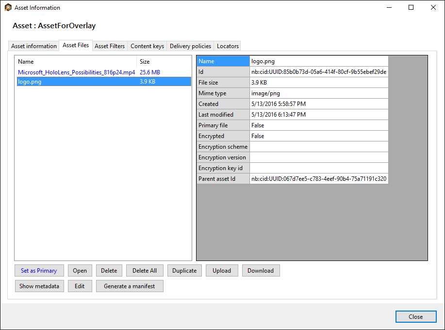

*Objektdateien in AMSE*

Wählen Sie die Anlage, und wählen Sie es mit Premium Encoder codieren. Hochladen des Workflows, und wählen Sie ihn aus.

Klicken Sie auf die Schaltfläche, um die Daten an den Prozessor übergeben, und fügen Sie die folgenden XML-Code zum Festlegen der Laufzeiteigenschaften hinzu:

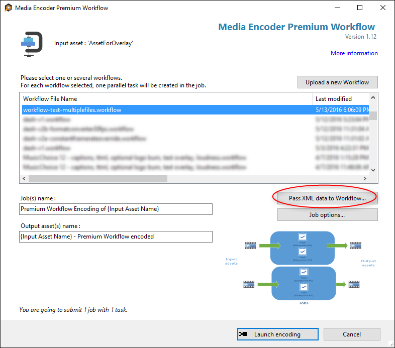

*Premium Encoder in AMSE*

Fügen Sie dann die folgenden XML-Daten aus. Sie müssen den Namen der Videodatei für die Medien Datei Eingabe- und PrimarySourceFile angeben. Geben Sie den Namen des Dateinamens für das Logo zu.

    <?xml version="1.0" encoding="utf-16"?>
      <transcodeRequest>
        <setRuntimeProperties>
          <property propertyPath="Media File Input/filename" value="Microsoft_HoloLens_Possibilities_816p24.mp4" />
          <property propertyPath="/primarySourceFile" value="Microsoft_HoloLens_Possibilities_816p24.mp4" />
          <property propertyPath="Media File Input Logo/filename" value="logo.png" />
        </setRuntimeProperties>
      </transcodeRequest>

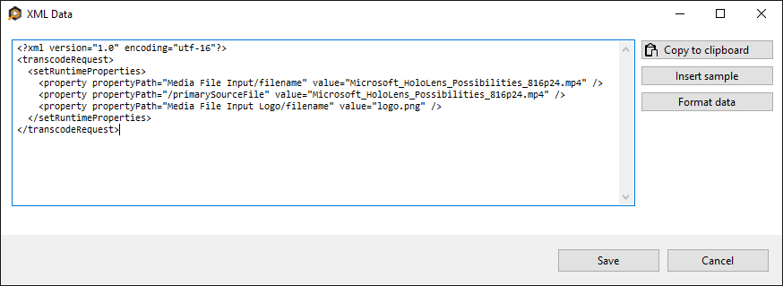

*setRuntimeProperties*

Wenn Sie der .NET SDK mithilfe erstellen und Ausführen der Aufgabe, müssen diese XML-Daten als die Konfigurationszeichenfolge weitergegeben werden.

    public ITask AddNew(string taskName, IMediaProcessor mediaProcessor, string configuration, TaskOptions options);

Nachdem das Projekt abgeschlossen ist, zeigt die MP4-Datei in der Ausgabe Anlage die Überlagerung!

*Überlagern von Videos*

Sie können den musterworkflow von [GitHub](https://github.com/Azure/azure-media-services-samples/tree/master/Encoding%20Presets/VoD/MediaEncoderPremiumWorkfows/)herunterladen.

## Siehe auch

- [Einführung in Premium Codierung in Azure Media Services](http://azure.microsoft.com/blog/2015/03/05/introducing-premium-encoding-in-azure-media-services)

- [Verwendung von Premium Codierung Azure Media Services](http://azure.microsoft.com/blog/2015/03/06/how-to-use-premium-encoding-in-azure-media-services)

- [Codierung bei Bedarf von Inhalt mit Azure Media Services](media-services-encode-asset.md#media_encoder_premium_workflow)

- [Media Encoder Premium Workflow Formate und codecs](media-services-premium-workflow-encoder-formats.md)

- [Workflow-Beispieldateien](https://github.com/AzureMediaServicesSamples/Encoding-Presets/tree/master/VoD/MediaEncoderPremiumWorkfows)

- [Azure Media Services Explorer-Tools](http://aka.ms/amse)

## Media-Dienste Learning Wege

[AZURE.INCLUDE [media-services-learning-paths-include](../../includes/media-services-learning-paths-include.md)]

## Angeben von feedback

[AZURE.INCLUDE [media-services-user-voice-include](../../includes/media-services-user-voice-include.md)]
