<properties 
    pageTitle="Avanced Media Encoder Premium Workflow-Lernprogramme" 
    description="Dieses Dokument enthält exemplarische Vorgehensweisen, die wie für erweiterte Aufgaben mit Media Encoder Premium Workflow sowie zum Erstellen von komplexen Workflows mit Workflow-Designers anzeigen." 
    services="media-services" 
    documentationCenter="" 
    authors="xstof" 
    manager="erikre" 
    editor=""/>

<tags 
    ms.service="media-services" 
    ms.workload="media" 
    ms.tgt_pltfrm="na" 
    ms.devlang="na" 
    ms.topic="article" 
    ms.date="10/03/2016"  
    ms.author="xstof;xpouyat;juliako"/>

#Erweiterte Media Encoder Premium Workflow-Lernprogramme

##(Übersicht) 

Dieses Dokument enthält exemplarische Vorgehensweisen, die zeigen, wie Workflows mit **Workflow-Designer**anpassen. Die ist-Workflowdateien finden Sie [hier](https://github.com/Azure/azure-media-services-samples/tree/master/Encoding%20Presets/VoD/MediaEncoderPremiumWorkfows/PremiumEncoderWorkflowSamples).  

##INHALTSVERZEICHNIS

Es werden folgende Themen behandelt:

- [In einer einzelnen Bitrate MP4-Codierung MXF](media-services-media-encoder-premium-workflow-tutorials.md#MXF_to_MP4)
    - [Starten eines neuen Workflows](media-services-media-encoder-premium-workflow-tutorials.md#MXF_to_MP4_start_new) 
    - [Verwenden die Eingabe der Media-Datei](media-services-media-encoder-premium-workflow-tutorials.md#MXF_to_MP4_with_file_input)
    - [Prüfen von Mediastreams](media-services-media-encoder-premium-workflow-tutorials.md#MXF_to_MP4_streams)
    - [Hinzufügen von einem video Encoder für ein. Generierung von MP4-Dateien](media-services-media-encoder-premium-workflow-tutorials.md#MXF_to_MP4_file_generation)
    - [Den Audiodatenstrom Codierung](media-services-media-encoder-premium-workflow-tutorials.md#MXF_to_MP4_audio)
    - [Audio und Video-Streams in einem MP4-Container Multiplexing](media-services-media-encoder-premium-workflow-tutorials.md#MXF_to_MP4_audio_and_fideo)
    - [Schreiben der MP4-Datei](media-services-media-encoder-premium-workflow-tutorials.md#MXF_to_MP4_writing_mp4)
    - [Erstellen einer Media Services-Objekt aus der Ausgabedatei](media-services-media-encoder-premium-workflow-tutorials.md#MXF_to_MP4_asset_from_output)
    - [Testen des fertigen Workflows lokal](media-services-media-encoder-premium-workflow-tutorials.md#MXF_to_MP4_test)
- [MXF in Multibitrate MP4s - Codierung dynamische Verpackung aktiviert](media-services-media-encoder-premium-workflow-tutorials.md#MXF_to_MP4_with_dyn_packaging)
    - [Eine oder mehrere zusätzliche MP4-Ausgaben hinzufügen](media-services-media-encoder-premium-workflow-tutorials.md#MXF_to_MP4_with_dyn_packaging_more_outputs)
    - [Konfigurieren die Dateinamen für die Ausgabe](media-services-media-encoder-premium-workflow-tutorials.md#MXF_to_MP4_with_dyn_packaging_conf_output_names)
    - [Hinzufügen einer separaten Audio-Spur](media-services-media-encoder-premium-workflow-tutorials.md#MXF_to_MP4_with_dyn_packaging_audio_tracks)
    - [Hinzufügen der. ISM SMIL-Datei](media-services-media-encoder-premium-workflow-tutorials.md#MXF_to_MP4_with_dyn_packaging_ism_file)
- [Codierung MXF in Multibitrate MP4 - erweiterte Entwurf](media-services-media-encoder-premium-workflow-tutorials.md#MXF_to__multibitrate_MP4)
    - [Übersicht über die Workflow zu verbessern](media-services-media-encoder-premium-workflow-tutorials.md#MXF_to__multibitrate_MP4_overview)
    - [Datei Benennungskonventionen](media-services-media-encoder-premium-workflow-tutorials.md#MXF_to__multibitrate_MP4_file_naming)
    - [Eigenschaften der Veröffentlichung auf den Workflow-Stammwebsite](media-services-media-encoder-premium-workflow-tutorials.md#MXF_to__multibitrate_MP4_publishing)
    - [Ausgabedatei, die Namen auf veröffentlichten Immobilienwerte verlassen, haben generiert werden.](media-services-media-encoder-premium-workflow-tutorials.md#MXF_to__multibitrate_MP4_output_files)
- [Hinzufügen von Miniaturansichten zu Multibitrate MP4-Ausgabe](media-services-media-encoder-premium-workflow-tutorials.md#thumbnails_to__multibitrate_MP4)
    - [Übersicht über die Workflow Miniaturansichten auf Hinzufügen.](media-services-media-encoder-premium-workflow-tutorials.md#thumbnails_to_multibitrate_MP4_overview)
    - [Hinzufügen von JPG-Codierung](media-services-media-encoder-premium-workflow-tutorials.md#thumbnails_to__multibitrate_MP4__with_jpg)
    - [Umgang mit Farbspektrum Konvertierung](media-services-media-encoder-premium-workflow-tutorials.md#thumbnails_to__multibitrate_MP4_color_space)
    - [Die Miniaturansichten schreiben](media-services-media-encoder-premium-workflow-tutorials.md#thumbnails_to__multibitrate_MP4_writing_thumbnails)
    - [Erkennen von Fehlern in einem workflow](media-services-media-encoder-premium-workflow-tutorials.md#thumbnails_to__multibitrate_MP4_errors)
    - [Workflow abgeschlossen](media-services-media-encoder-premium-workflow-tutorials.md#thumbnails_to__multibitrate_MP4_finish)
- [Zeitbasierte Verkürzen der Multibitrate MP4-Ausgabe](media-services-media-encoder-premium-workflow-tutorials.md#time_based_trim)
    - [Workflowübersicht fangen Sie zum Zuschneiden](media-services-media-encoder-premium-workflow-tutorials.md#time_based_trim_start)
    - [Verwenden der Stream Trimmer](media-services-media-encoder-premium-workflow-tutorials.md#time_based_trim_use_stream_trimmer)
    - [Workflow abgeschlossen](media-services-media-encoder-premium-workflow-tutorials.md#time_based_trim_finish)
- [Einführung in die Skript-Komponente](media-services-media-encoder-premium-workflow-tutorials.md#scripting)
    - [Innerhalb eines Workflows Scripting: Hallo Welt](media-services-media-encoder-premium-workflow-tutorials.md#scripting_hello_world)
- [Frame-basierte Verkürzen der Multibitrate MP4-Ausgabe](media-services-media-encoder-premium-workflow-tutorials.md#frame_based_trim)
    - [Übersicht der Entwurf fangen Sie zum Zuschneiden](media-services-media-encoder-premium-workflow-tutorials.md#frame_based_trim_start)
    - [Verwendung der ClipArt XML-Liste](media-services-media-encoder-premium-workflow-tutorials.md#frame_based_trim_clip_list)
    - [Ändern der Liste ClipArt aus einer Komponente Skript erstellt](media-services-media-encoder-premium-workflow-tutorials.md#frame_based_trim_modify_clip_list)
    - [Hinzufügen einer ClippingEnabled Komfort-Eigenschaft](media-services-media-encoder-premium-workflow-tutorials.md#frame_based_trim_clippingenabled_prop)

##In einer einzelnen Bitrate MP4-Codierung MXF
 
In dieser exemplarische Vorgehensweise erstellen wir eine einzelne Bitrate. MP4-Datei mit HE-AAC codierte Audiosignal über ein. Eingabe MXF-Datei. 

###Starten eines neuen Workflows 

Öffnen Sie Workflow-Designer zu, und wählen Sie "Datei"– "neuen Arbeitsbereich"-"Codierung Plan" 

3 Elemente, der neue Workflow wird angezeigt: 

- Primäre Quelldatei
- ClipArt-XML-Liste
- Die Ausgabe Datei/Anlage  

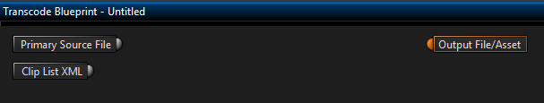

*Neue Codierung Workflow*

###Verwenden die Eingabe der Media-Datei

Um unsere Eingabewerte Media-Datei annehmen möchten, startet eine mit eine Medien Datei Eingabewerte Komponente hinzufügen. Um eine Komponente mit dem Workflow hinzuzufügen, ihn in das Suchfeld Repository suchen Sie, und ziehen Sie den gewünschten Eintrag in der Designer-Bereich. Dies gilt für die Eingabewerte Media-Datei, und verbinden Sie die primäre Quelldatei Komponente mit die Eingabewerte Filename-Pin, aus der Eingabewerte Media-Datei.

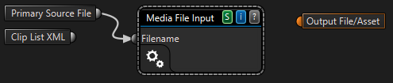

*Verbundenen Eingabe von Mediendateien*

Bevor wir viel mehr tun können, müssen wir zuerst zum Workflow-Designer anzugeben, welche Beispieldatei wir unsere Workflows mit Entwurf verwenden möchten. Hierzu klicken Sie auf der Designer-Bereich Hintergrund, und suchen Sie nach der primären Quelldatei-Eigenschaft auf den rechten Eigenschaftenbereich. Klicken Sie auf das Ordnersymbol, und wählen Sie die gewünschte Datei zum Testen des Workflows mit aus. Sobald dies der Fall, wird die Komponente Medien Dateieingabe prüfen die Datei und füllen Sie die Ausgabe Stifte entsprechend die Datei, die sie überprüft.

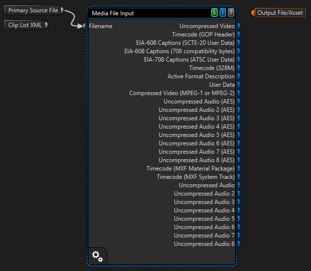

*Eingetragenen Eingabe von Mediendateien*

Während dies gibt an, mit welchen Eingabe wir arbeiten, möchten sie feststellen, nicht aber, in dem die codierte Ausgabe gesendet werden sollen. Ähnlich wie die primäre Quelldatei konfiguriert wurde, jetzt die Ausgabe Ordner Variable-Eigenschaft, darunter befindlichen konfigurieren.

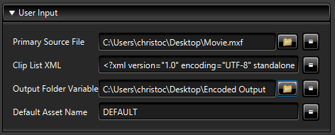

*Konfiguriert die Eigenschaften ein- und Ausgabe*

###Prüfen von Mediastreams

Es weist häufig gewünschte Informationen Streams möchten Zahlungen durch den Workflow aussehen. Um einen Stream an jeder Stelle im Workflow prüfen möchten, klicken Sie einfach auf eine Ausgabe oder Eingabe Pin auf Komponenten. Klicken Sie in diesem Fall am Ausgabepin nicht komprimierte Video aus unserem Medien Dateieingabe auf. Ein Dialogfeld wird geöffnet, die um zu untersuchenden ausgehende Video ermöglicht.

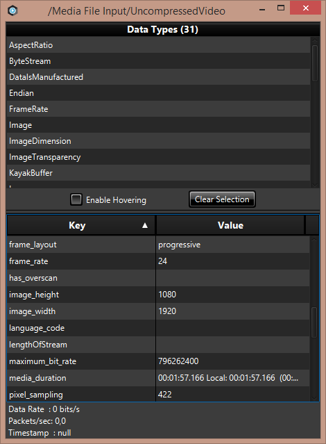

*Prüfen die Pin nicht komprimierte Video Ausgabe*

In diesem Fall teilt uns beispielsweise, dass wir mit einer Eingabe 1920 x 1080 mit 24 Frames pro Sekunde in 4 tun haben: 2:2 werden für ein Video von fast 2 Minuten.

###Hinzufügen von einem video Encoder für ein. Generierung von MP4-Dateien

Beachten Sie, dass, eines Videos nicht komprimiert und mehrere nicht komprimierte Audio Ausgabe Stifte stehen für die Verwendung bei der Eingabe unsere Media-Datei. Um das eingehende Video codieren, benötigen wir eine Codierung Komponente – in diesem Fall zum generieren. MP4-Dateien.

Um den Videodatenstrom zu h. 264 codiert werden soll, fügen Sie die Komponente AVC Video Encoder Oberfläche des Designers auf. Diese Komponente erfordert eine Dekomprimieren Videodatenstrom als Eingabe und stellt eine AVC komprimierte Videodatenstrom auf deren Ausgabe anheften.

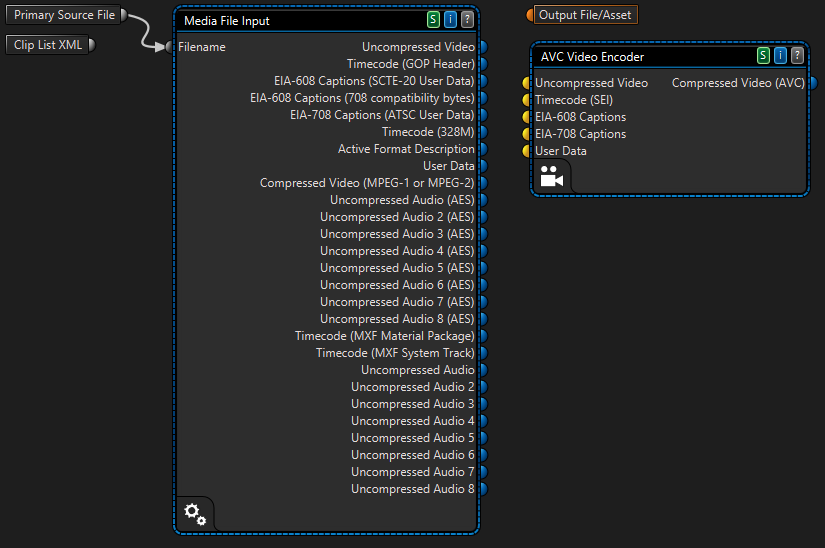

*Nicht verbundenen AVC Encoder*

Verbindungseigenschaften bestimmen, wie die Codierung genau geschieht. Lassen Sie uns einen Blick auf einige der wichtigen Einstellungen aus:

- Die Ausgabe Breite und Höhe der Ausgabe: bestimmt die Auflösung des codierten Videos. In diesem Fall wir wählen 640 x 360
- Frame-Rate: bei der Einstellung Pass-Through-es nur die Quelle Frame-Rate übernommen werden, ist es möglich, diese jedoch außer Kraft gesetzt. Beachten Sie, dass solche Framerate Konvertierung nicht Bewegung-entschädigt ist.
- Profil und die Ebene: Diese Bestimmen der AVC Profil und die Ebene. Um weitere Informationen zu den verschiedenen Ebenen und Profile bequem zu gelangen, klicken Sie auf das Fragezeichen-Symbol auf der Komponente AVC Video Encoder und die Hilfeseite werden weitere Details zu den einzelnen Ebenen anzeigen. In diesem Beispiel wir wählen Main Profile auf Ebene 3,2 (die Standardeinstellung).
- Bewerten Steuerung des Modus und Bitrate (KB/s): in diesem Szenario wir entscheiden Sie sich für eine Konstante Bitrate (CBR) am 1200/s ausgeben
- Video formatieren: Dies ist über die Sprachbenutzerschnittstelle (Video die Informationen), die in den Stream h. 264 (Seiteninformationen, die von einem Decoder zur Verbesserung der Anzeige verwendeten aber nicht unbedingt ordnungsgemäß entschlüsseln möglicherweise) geschrieben wird:
- NTSC (Standard für US oder Japan, mithilfe von 30 Frames/s)
- PAL (Standard für Europa, mit 25 f/s)
- GOP Größenänderungsmodus: Wir werden feste GOP Größe für unsere Zwecke mit einem Intervall Schlüssel 2 Sekunden mit GOPs geschlossen konfigurieren. Dadurch wird sichergestellt, dass die Kompatibilität mit den dynamischen Verpackung Azure Media Services bietet.

Um unsere Encoder AVC-Feeds, die nicht komprimiert Video Ausgabepin aus der Medien Datei Eingabewerte Komponente Herstellen einer Verbindung mit die Eingabewerte nicht komprimierte Video-Pin vom Encoder AVC.

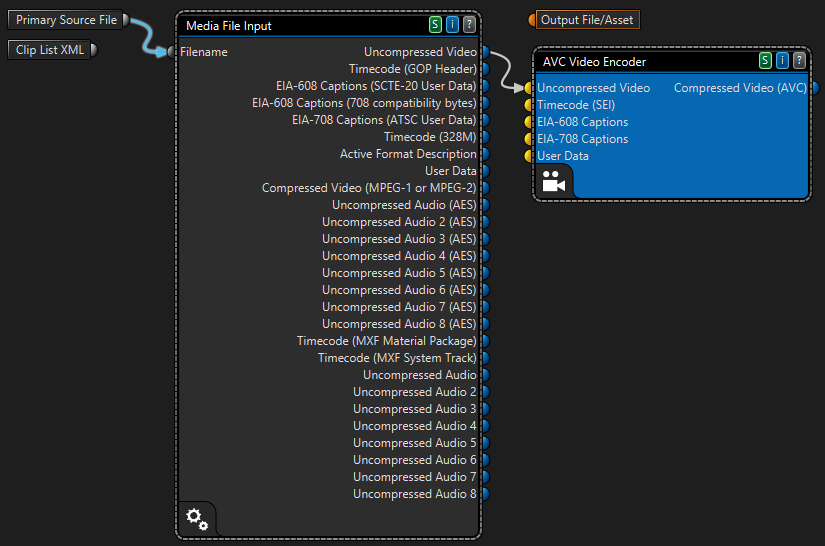

*Verbundenen AVC primär encoder*

###Den Audiodatenstrom Codierung

An diesem Punkt haben wir Video codierte aber weiterhin der ursprüngliche nicht komprimierte Audiodatenstrom komprimiert werden muss. Für dieses begleiten wir AAC Codieren von der Komponente AAC Encoder (Dolby). Fügen Sie es mit dem Workflow aus.

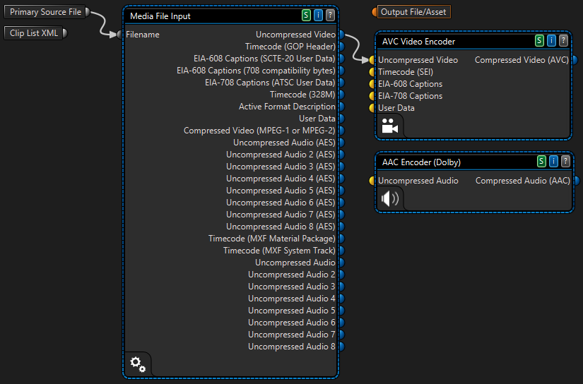

*Nicht verbundenen AAC encoder*

Jetzt es eine Inkompatibilität ist: während höchstwahrscheinlich die Medien Datei von zwei verschiedenen nicht komprimiert Audiodatenstrom verfügbar haben wird nur eine einzelne nicht komprimierte audio Eingabewerte Pin vom Encoder AAC vorliegt: eine für den linken Kanal für Audio- und eine für die rechts. (Wenn Sie mit Kontrollkästchen Sound zu tun haben, ist die 6 Kanäle.) So ist es nicht möglich, die Audiodaten direkt aus der Quelle Medien Dateieingabe in der AAC-audio-Encoder zu verbinden. Die Komponente AAC erwartet eine so genannte "verschachtelt" Audiodatenstrom: einen einzigen Stream, die sowohl auf der linken und rechten Kanäle mit einander überlappend enthält. Wenn wir aus unserem Quelldatei für Medien wissen sind welche audio Spuren an, an welcher Position in der Quelle, wir solche überlappende Audiodatenstrom mit der Lautsprecher ordnungsgemäß zugeordneten Positionen für Links und rechts generieren können.

Zunächst wird eine generiert einen überlappende Stream über die erforderlichen Quell-audio-Kanäle möchten. Die Komponente Interleaver konnte nicht von Audio Stream wird dies für uns behandeln. Fügen Sie es mit dem Workflow und verbinden Sie die audio Ausgaben aus der Eingabe der Media-Datei hinein.

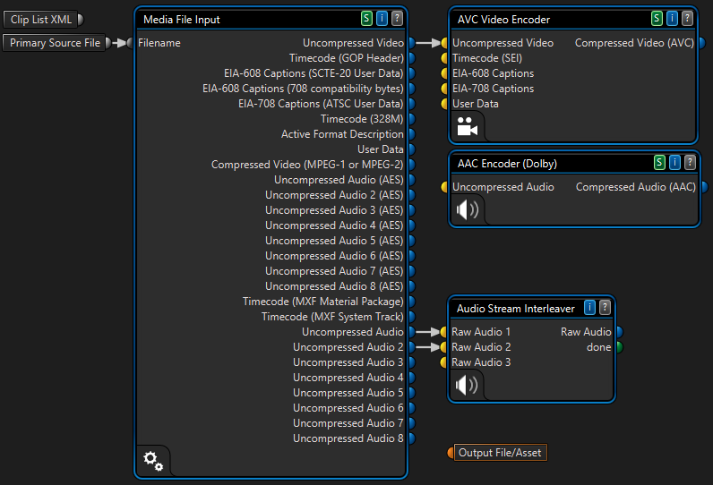

*Audiodatenstrom Interleaver konnte nicht verbunden*

Nun verfügen wir über überlappende Audiodatenstrom wurde nicht immer noch, wo Sie die Positionen nach links oder rechts Lautsprecher, um die zuweisen angegeben. Um dies angeben möchten, können wir die Lautsprecher Position delegierende Person nutzen.

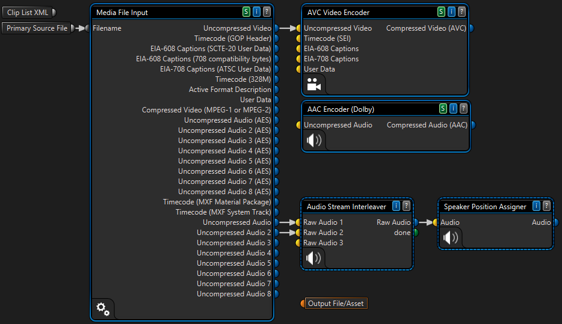

*Hinzufügen einer Lautsprecher Position delegierende Person*

Konfigurieren Sie die Lautsprecher Position delegierende Person zur Verwendung mit einer Eingabe Stereo-Stream Encoder voreingestellte Filter "Custom" und "2.0 (L, R)" genannt Channel voreingestellte durchlaufen. (Dies wird im linken Lautsprecher dem Kanal 1 und der Position des linken und rechten Lautsprecher Kanal 2 zuweisen.)

Verbinden Sie die Ausgabe der Lautsprecher Position delegierende Person mit der Eingabe der Encoder AAC. Klicken Sie dann Informieren der AAC Encoder für die Arbeit mit einem "2.0 (L, R)" Channel voreingestellte, damit es weiß Stereo-Audio als Eingabe behandelt.

###Audio und Video-Streams in einem MP4-Container Multiplexing

Die angegebene unsere AVC codierte Videodatenstrom und unsere AAC codierte Audiodatenstrom, können wir erfassen, beide in ein. MP4-Container. Die Vorgehensweise zum Kombinieren von verschiedene Streams in einem einzelnen heißt "multiplexing" (oder "Muxing"). In diesem Fall haben wir die Audio- und Videodatenströme in einem einzigen zusammenhängendes für Verschachteln. MP4-Paket. Die Komponente, die diese für koordiniert ein. MP4-Container wird der ISO MPEG-4 Multiplexer bezeichnet. Fügen Sie eine Oberfläche des Designers auf und schließen Sie sowohl die AVC Video Encoder und den AAC Encoder an seine Eingaben.

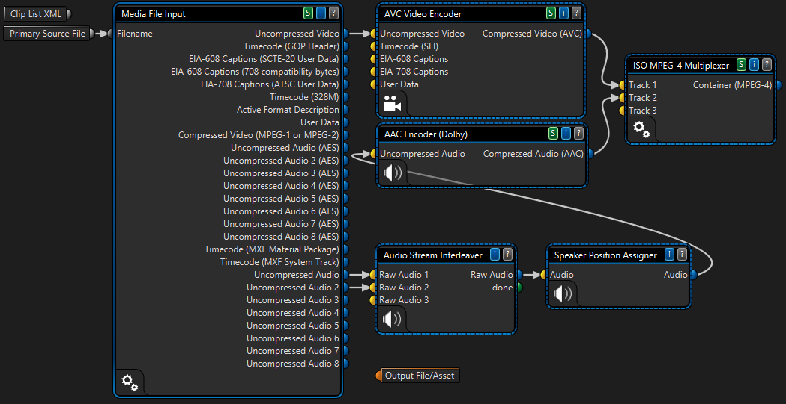

*Verbundenen MPEG4 Multiplexer*

###Schreiben der MP4-Datei

Wenn Sie eine Ausgabedatei zu schreiben, wird die DateiAusgabe-Komponente verwendet. Wir können diese in die Ausgabe der ISO MPEG-4 Multiplexer verbinden, sodass deren Ausgabe geschrieben wird auf einem Datenträger. Dazu Herstellen einer Verbindung die Eingabewerte schreiben-Pin der Ausgabe Datei mit der Ausgabe-Pin Container (MPEG-4).

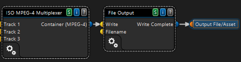

*Die DateiAusgabe verbunden*

Der Dateinamen, der verwendet werden, wird durch die Dateieigenschaft bestimmt. Während die Eigenschaft hartcodierte mit einem bestimmten Wert sein kann, wird wahrscheinlich einen stattdessen durch einen Ausdruck festlegen möchten.

Den Workflow automatisch die Ausgabe bestimmt haben Name-Eigenschaft aus einem Ausdruck Datei, klicken Sie auf die Schaltfläche neben dem Dateinamen (neben dem Ordnersymbol). Wählen Sie dann aus dem Dropdownmenü "Ausdruck". Der Ausdrucks-Editor wird angezeigt. Deaktivieren Sie zuerst den Inhalt des Editors.

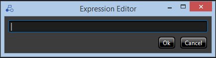

*Leeren des Ausdrucks-Editor*

Der Ausdrucks-Editor ermöglicht das alle literalen Wert und gemischten mit einer oder mehreren Variablen eingeben. Variablen beginnen mit einem Dollarzeichen. Wie Sie die $-Taste drücken, wird der Editor eine Dropdownliste mit einer Auswahl verfügbarer Variablen angezeigt. In diesem Fall werden wir eine Kombination aus Verzeichnis Ausgabevariable und die zugrunde liegenden Eingabewerte Datei Namen Variable verwenden:

    ${ROOT_outputWriteDirectory}\\${ROOT_sourceFileBaseName}.MP4

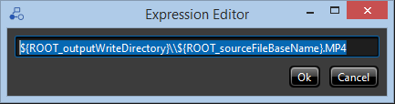

*Ausgefüllt heraus Ausdrucks-Editor*

>[AZURE.NOTE]Damit finden Sie unter finden Sie eine Ausgabedatei Ihres Codierung Auftrags in Azure, geben Sie einen Wert in den Ausdrucks-Editor. 

Wenn Sie den Ausdruck bestätigen, indem Sie auf ok, wird im Eigenschaftenfenster auf die zu diesem Zeitpunkt der Datei Eigenschaft löst Werts Vorschau anzeigen.

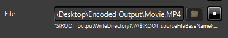

*Datei Ausdruck aufgelöst Ausgabeverzeichnis*

###Erstellen einer Media Services-Objekt aus der Ausgabedatei

Während wir eine MP4-Ausgabedatei geschrieben haben, müssen wir darauf hinzuweisen, dass diese Datei auf die Anlage Ausgabe Media-Dienste generieren werden durch das Ausführen dieser Workflow gehört. Zu diesem Zweck wird der Ausgabe Datei/Objekt-Knoten in den Zeichenbereich Workflow verwendet. Alle eingehende Dateien in diesem Knoten werden Teil der resultierende Azure Media Services Anlage zu machen.

Verbinden Sie die DateiAusgabe-Komponente für die Ausgabe Datei/Anlage Komponente den Workflow beendet.

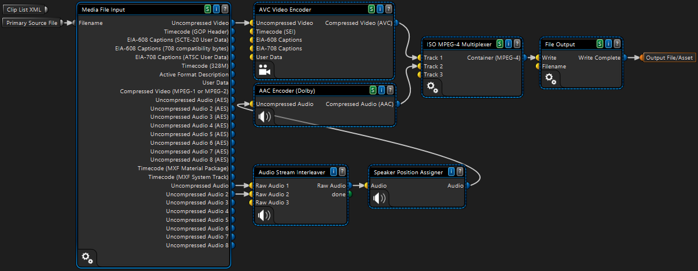

*Workflow abgeschlossen*

###Testen des fertigen Workflows lokal

Drücken Sie zum Testen des Workflows lokal in der Symbolleiste oben auf die Wiedergabeschaltfläche. Wenn der Workflow ausführen beendet, prüfen Sie die Ausgabe in dem Ausgabeordner konfigurierten generiert. Sie sehen die endgültige MP4-Ausgabe-Datei, die aus der Eingabewerte Quelldatei MXF codiert wurde.

##Dynamische Verpackung Codierung MXF in MP4 - Multibitrate aktiviert

Im folgenden erstellen eine Reihe von mehreren Bitrate MP4-Dateien mit AAC codierte audio aus einem einzigen wir. Eingabe MXF-Datei.

Wenn eine Multi-Bitrate Anlage Ausgabe gewünscht wird zur Verwendung in Kombination mit den dynamischen Verpackung Features angebotenen Azure Media Services, mehrere GOP ausgerichtet MP4-Dateien der einzelnen, die einer anderen Bitrate und Auflösung generiert werden müssen. Hierzu stellt die [Codierung MXF in einer einzelnen Bitrate MP4](media-services-media-encoder-premium-workflow-tutorials.md#MXF_to_MP4) exemplarische uns mit einen guten Ausgangspunkt.

*Workflow gestartet*

###Eine oder mehrere zusätzliche MP4-Ausgaben hinzufügen

Jeder MP4-Datei in unseren resultierende Azure Media Services Anlage wird einer anderen Bitrate und Auflösung unterstützen. Fügen Sie eine oder mehrere Ausgabe MP4-Dateien mit dem Workflow an.

Um sicherzustellen, dass wir alle unsere video Encoder mit denselben Einstellungen erstellt haben, ist es am bequemsten ist, der bereits vorhandenen AVC Video Encoder duplizieren und Konfigurieren einer anderen Kombination von Auflösung und Bitrate (wir hinzufügen eine der 960 x 540 mit 25 Frames pro Sekunde bei 2,5/s). Wenn Sie den vorhandenen Encoder duplizieren möchten, kopieren fügen Sie es auf der Oberfläche des Designers.

Verbinden Sie die Pin nicht komprimierte Video Ausgabe der Medien Dateieingabe in unserer neuen AVC-Komponente aus.

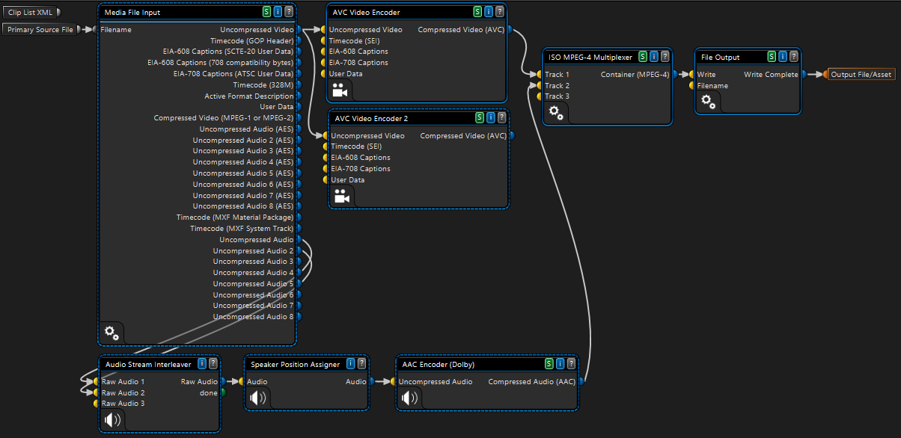

*Zweite AVC Encoder verbunden.*

Jetzt Anpassen der Konfigurations für unserer neuen AVC Encoder 960 x 540 bei 2,5/s ausgegeben. (Für dieses verwenden Sie die Eigenschaften "Ausgabe Breite", "Ausgabe Höhe" und "Bitrate (KB/s)")

Angegebenen wir die resultierende Anlage zusammen mit den dynamischen Verpackung Azure Media-Dienste verwenden möchten, muss der streaming Endpunkt werden aus diesen MP4-Dateien HLS/fragmentiert MP4/Gedankenstrich Fragmente, die genau so miteinander ausgerichtet sind, erhalten Clients, die zwischen verschiedenen eine Bitrate umsteigen einer einzelnen interpolierten fortlaufender Video und audio Eindruck generieren kann. Damit, die ausgeführt wird, müssen wir sicherstellen, dass in den Eigenschaften der beiden AVC Encoder GOP ("Gruppe von Bildern") Umfang für beide MP4-Dateien auf 2 Sekunden festgelegt ist, die ausgeführt werden können:

- Festlegen des GOP-Größe-Modus GOP feste Größe und
- die Taste Frame-Intervallen auf zwei Sekunden.
- Einstellen sind auf eigene ohne Abhängigkeiten das Steuerelement GOP IDR GOP geschlossen, um sicherzustellen, dass alle GOP ständigen

Um unserem Workflow zu verstehen vereinfachen, Umbenennen den ersten AVC Encoder "AVC-Video Encoder 640 x 360 1200/s" und den zweiten AVC Encoder "AVC-Video Encoder 960 x 540 2500/s".

Fügen Sie nun eine zweite ISO MPEG-4 Multiplexer und eine zweite Ausgabe der Datei ein. Herstellen einer Verbindung den neuen AVC Encoder mit den multiplexer, und stellen Sie sicher, dass deren Ausgabe in die Ausgabe der Datei geleitet wird. Auch dann verbinden Sie Eingabe der AAC audio Encoder Ausgabe an die neue des multiplexer. Die Ausgabe der Datei kann wiederum klicken Sie dann auf den Knoten Ausgabe Datei/Anlage es das Media Services Anlage hinzufügen, die erstellt werden verbunden werden.

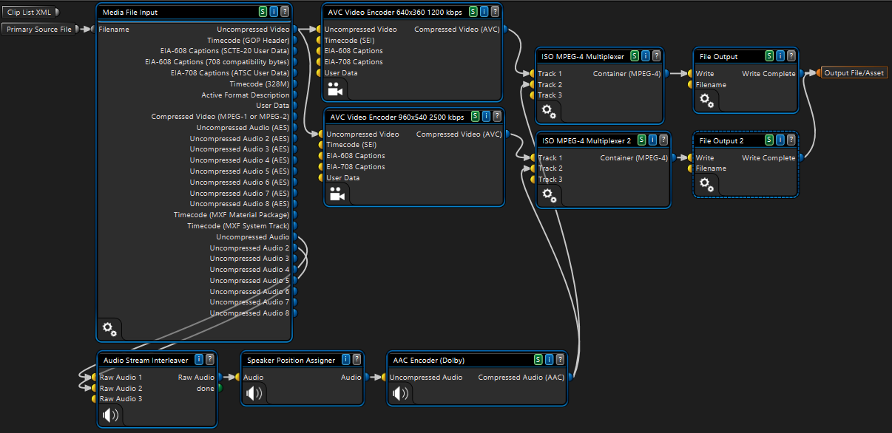

*Zweite Muxer wird und die DateiAusgabe verbunden.*

Kompatibilität mit Azure Media Services dynamische Verpacken GOP Anzahl oder die Dauer der multiplexer des Abschnitts Modus konfigurieren und die GOPs pro Abschnitt auf 1 festgelegt. (Dies sollte die Standardeinstellung sein.)

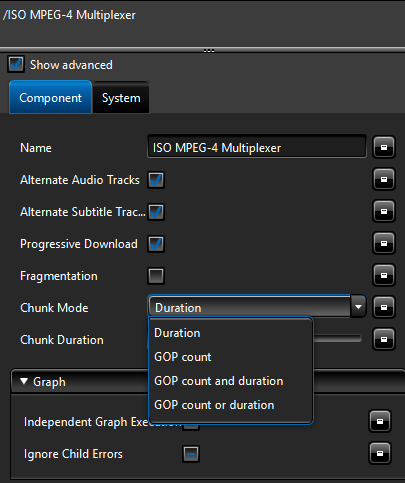

*Muxer wird Textbaustein Modi*

Hinweis: Sie sollten diesen Prozess für alle anderen Kombinationen Bitrate und Auflösung wiederholen Sie die Ausgabe der Anlage hinzugefügt haben soll.

###Konfigurieren die Dateinamen für die Ausgabe

Wir haben mehr als eine einzelne Datei auf die Anlage Ausgabe hinzugefügt. Dadurch wird eine stellen Sie sicher, dass die Dateinamen für die Ausgabedateien voneinander unterscheiden und vielleicht sogar Anwenden einer Benennungskonvention entspricht, damit klar aus dem Dateinamen wird mit arbeiten müssen.

Benennen von Dateien Ausgabe kann über Ausdrücke im Designer gesteuert werden. Öffnen Sie im Eigenschaftenbereich für eine DateiAusgabe Komponenten, und öffnen Sie den Ausdrucks-Editor für die Dateieigenschaft. Unsere erste Ausgabedatei wurde durch den folgenden Ausdruck konfiguriert (finden Sie im Lernprogramm für die Migration von [MXF zu einem einzelnen Bitrate MP4-Ausgabe](media-services-media-encoder-premium-workflow-tutorials.md#MXF_to_MP4)):

    ${ROOT_outputWriteDirectory}\${ROOT_sourceFileBaseName}.MP4

Dies bedeutet, dass unsere Filename durch zwei Variablen bestimmt wird: Ausgabeverzeichnis zu schreiben und den Namen der Quelldatei Basis. Die erste wird als eine Eigenschaft für die Workflow-Stammwebsite bereitgestellt und letztere durch die eingehende Datei bestimmt ist. Beachten Sie, dass das Ausgabeverzeichnis Testzwecken lokale verwenden; Diese Eigenschaft wird von der Workflow-Engine überschrieben werden, wenn der Workflow vom Medienprozessor cloudbasierten in Azure Media Services ausgeführt wird.
Ändern Sie beide unsere Ausgabedateien verleihen eine konsistente Ausgabe benennen Sie die erste Datei benennen Ausdruck ein:

    ${ROOT_outputWriteDirectory}\${ROOT_sourceFileBaseName}_640x360_1.MP4

und die zweite so:

    ${ROOT_outputWriteDirectory}\${ROOT_sourceFileBaseName}_960x540_2.MP4

Führen Sie einen mittlere Testlauf um sicherzustellen, dass beide MP4-Ausgabedateien ordnungsgemäß generiert werden.

###Hinzufügen einer separaten Audio-Spur

Wir später sehen, wenn wir eine Datei .ism fahren Sie mit unseren MP4-Ausgabedateien generieren, benötigen wir auch eine nur-Audio-MP4-Datei als die audio-Spur für unsere adaptives streaming. Um diese Datei zu erstellen, fügen Sie einer weiteren Muxer wird mit dem Workflow (Multiplexer ISO-MPEG-4 hinzu), und verbinden Sie der AAC-Encoder Ausgabepin mit der Eingabe Pin für Spur 1.

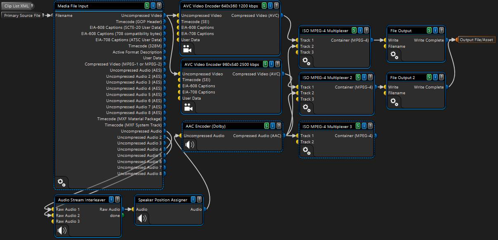

*Audio Muxer wird hinzugefügt*

Erstellen Sie eine dritte DateiAusgabe-Komponente für ausgehende Streams aus der Muxer wird ausgeben und konfigurieren Sie die Datei als Ausdruck benennen:
    
    ${ROOT_outputWriteDirectory}\${ROOT_sourceFileBaseName}_128kbps_audio.MP4

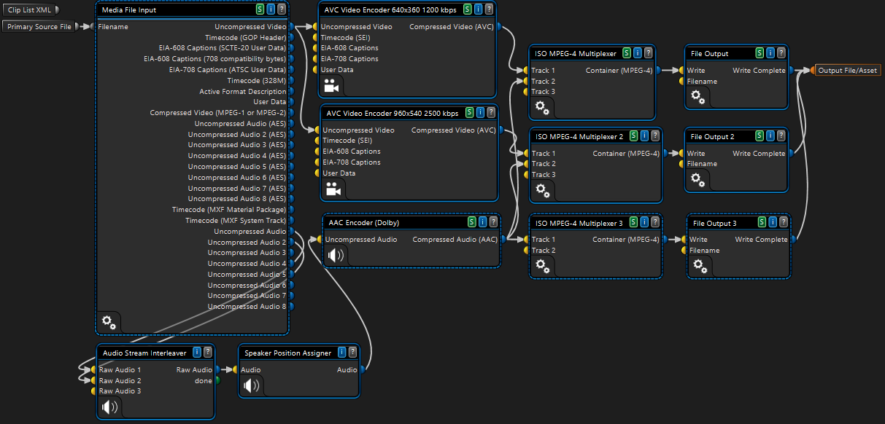

*Audio Muxer wird die Ausgabe der Datei erstellen*

###Hinzufügen der. ISM SMIL-Datei

Für die dynamische Verpackung entwickelt in Kombination mit MP4-Dateien (und der MP4 nur Audio) in unseren Anlage Media-Dienste, benötigen wir auch eine Manifestdatei (auch als "SMIL" Datei bezeichnet: synchronisiert Multimedia Integration Language). Diese Datei teilt Azure Media Services welche MP4-Dateien für das dynamische Packen und welche für das streaming audio berücksichtigen verfügbar sind. Eine typische Manifestdatei für eine Reihe von MP4 des mit einer einzelnen Audiodatenstrom sieht wie folgt aus:
    
    <?xml version="1.0" encoding="utf-8" standalone="yes"?>
    <smil xmlns="http://www.w3.org/2001/SMIL20/Language">
      <head>
        <meta name="formats" content="mp4" />
      </head>
      <body>
        <switch>
          <video src="H264_1900kbps_AAC_und_ch2_96kbps.mp4" />
          <video src="H264_1300kbps_AAC_und_ch2_96kbps.mp4" />
          <video src="H264_900kbps_AAC_und_ch2_96kbps.mp4" />
          <audio src="AAC_ch2_96kbps.mp4" title="AAC_und_ch2_96kbps" />
        </switch>
      </body>
    </smil>

Die Datei .ism enthält innerhalb einer Switch-Anweisung ein Verweis auf jede einzelne MP4 Videodateien und zusätzlich diese auch ein (oder mehrere) Audiodatei Verweise auf eine MP4, die nur die Audiodaten enthält.

Die Manifestdatei für unsere Satz von der MP4 generieren kann über eine Komponente namens die "AMS Manifest Autor" vorgenommen werden. Verwenden Sie diese, ziehen es auf der Oberfläche und verbinden die "Schreiben abgeschlossen" Ausgabe Stifte aus den drei DateiAusgabe Komponenten mit der Eingabe AMS Manifest Autor. Klicken Sie dann stellen Sie sicher, dass die Ausgabe des Verfassers AMS Manifest in der Ausgabe Datei/Anlage verbinden.

Konfigurieren Sie als mit unseren anderen Datei Ausgabe Komponenten, den .ism Ausgabe Dateinamen mit einem Ausdruck ein:

    ${ROOT_outputWriteDirectory}\\${ROOT_sourceFileBaseName}_manifest.ism

Unsere fertig Workflow sieht der unter:

*Fertige MXF Multibitrate MP4-Workflow*

##Codierung MXF in Multibitrate MP4 - erweiterte Entwurf

In der [vorherigen Workflow Exemplarische Vorgehensweise](media-services-media-encoder-premium-workflow-tutorials.md#MXF_to_MP4_with_dyn_packaging) haben wir gesehen, wie eine einzelne MXF einer Ressource in eine Anlage Ausgabe mit Multi-Bitrate MP4-Dateien, die einer reinen MP4-Audiodatei und eine Manifestdatei für die Verwendung in Verbindung mit Azure Media Services dynamische Verpackung umgewandelt werden kann.

Diese exemplarische Vorgehensweise zeigt, wie einige der Aspekte können erweitert und als komfortabler.

###Übersicht über die Workflow zu verbessern

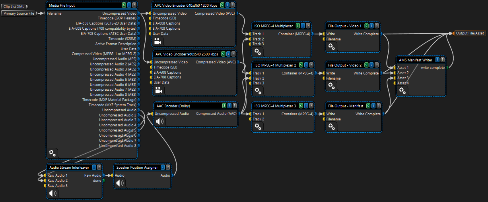

*Multibitrate MP4-Workflow zu verbessern*

###Datei Benennungskonventionen

In den vorherigen Workflow Sie einen einfachen Ausdruck als Grundlage für das Generieren von Dateinamen für die Ausgabe angegeben. Wir haben jedoch einige Duplikate: alle der Dateikomponenten einzelne Ausgabe angegeben solche Ausdruck.

Beispielsweise wird unsere Datei Ausgabe-Komponente für die ersten Videodatei mit diesem Ausdruck konfiguriert:

    ${ROOT_outputWriteDirectory}\${ROOT_sourceFileBaseName}_640x360_1.MP4

Klicken Sie für die zweite Ausgabe video, gibt es einen Ausdruck wie:

    ${ROOT_outputWriteDirectory}\\${ROOT_sourceFileBaseName}_960x540_2.MP4

Wäre es nicht übersichtlicher, weniger fehleranfällig und komfortabler, wenn wir einige der diese Wiederholung entfernen und Dinge stattdessen mehr konfigurierbare stellen könnten? Glücklicherweise können wir: erteilen uns des Designers Ausdruck-Funktionen in Kombination mit der Möglichkeit zum Erstellen von benutzerdefinierter Eigenschaften, die auf unseren Workflow-Stammwebsite Sicherheitsebene mit einer Komfort.

Angenommen, wir Filename-Konfiguration von der eine Bitrate der einzelnen MP4-Dateien führen wird. Diese Bitrate angewendet, die wir konfigurieren an einem zentralen Ort aus, in dem sie konfigurieren zugegriffen werden können und Laufwerk erzeugen des Dateinamens (auf der Stammebene unsere Diagramms), werden sollen. Hierzu zunächst wir die Eigenschaft Bitrate von AVC Encoder werden im Stammordner unserer Workflow veröffentlichen, damit sowohl der Stammwebsitesammlung ebenfalls ab dem der Encoder AVC Zugriff darauf freigegeben wird. (Auch wenn in zwei verschiedenen Volltonfarben angezeigt, Wert vorhanden ist nur eine zugrunde liegenden.)

###Eigenschaften der Veröffentlichung auf den Workflow-Stammwebsite

Öffnen Sie den ersten AVC Encoder, wechseln Sie zu der Eigenschaft Bitrate (KB/s), und wählen Sie aus der Dropdown-Liste veröffentlichen.

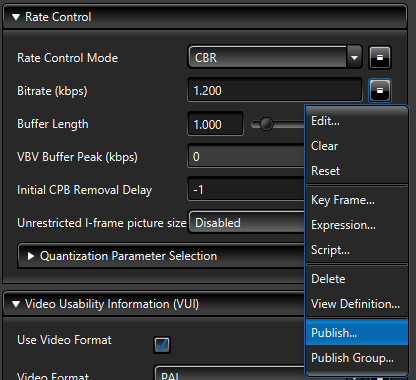

*Veröffentlichen die Eigenschaft bitrate*

Konfigurieren Sie im Dialogfeld veröffentlichen zu veröffentlichen, werden im Stammordner unserer Workflow Graph an, mit dem veröffentlichten Namen "video1bitrate" und "Video 1 Bitrate" lesbaren Anzeigenamen ein. Konfigurieren ein benutzerdefinierten Gruppennamen "Eine Bitrate Streaming" bezeichnet, und drücken Sie veröffentlichen.

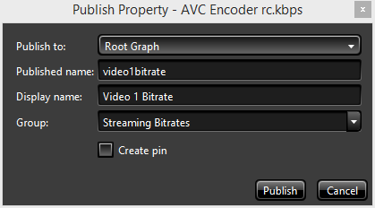

*Für die Veröffentlichung Dialogfeld für Bitrate-Eigenschaft*

Für die Eigenschaft Bitrate der zweiten AVC Encoder wiederholen Sie, und nennen Sie es "video2bitrate" mit dem Anzeigenamen "Video 2 Bitrate", in der gleichen benutzerdefinierten Gruppe "Eine Bitrate Streaming".

Wenn wir nun die Workflow-Stammwebsite Eigenschaften prüfen, sehen wir unsere benutzerdefinierte Gruppe mit den zwei veröffentlichten Eigenschaften angezeigt. Beide sind über die entsprechenden des Werts für ihre jeweiligen AVC Encoder Bitrate.

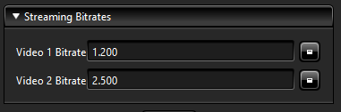

Immer, wenn wir Zugriff auf diese Eigenschaften von Code oder ein Ausdruck, können wir dies tun, wie folgt:

- von Inline-Code von einer Komponente rechts unterhalb des Stammverzeichnisses: Node.getPropertyAsString('.. / video1bitrate', null)
- innerhalb eines Ausdrucks: ${ROOT_video1bitrate}
 
Führen Sie die der Gruppe "Eine Bitrate Streaming" wir durch unsere audio nachverfolgen Bitrate dort ebenfalls veröffentlichen. Innerhalb der Eigenschaften der AAC Encoder suchen Sie nach der Einstellung Bitrate, und wählen Sie in der Dropdownliste neben dem Eintrag veröffentlichen aus. Veröffentlichen auf der Stammebene das Diagramm mit Namen "audio1bitrate" und den Anzeigenamen "Audio 1 Bitrate" in unseren benutzerdefinierten Gruppe "Eine Bitrate Streaming".

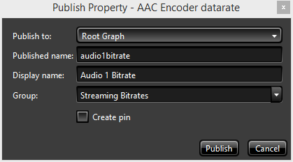

*Für die Veröffentlichung Dialogfeld für audio bitrate*

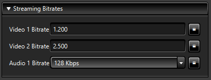

*Video und audio Ausstellungsstücke auf Root resultierender*

Beachten Sie, dass eine Änderung einer dieser diese drei auch erneut konfiguriert Werte und ändert sich die Werte auf den entsprechenden Komponenten mit verknüpft sind (und von veröffentlicht).

###Ausgabedatei, die Namen auf veröffentlichten Immobilienwerte verlassen, haben generiert werden.

Statt hartzucodieren können unsere generierten Dateinamen, wir nun ändern unsere Dateinamen Ausdruck auf jeder der DateiAusgabe Komponenten auf die Bitrate Eigenschaften zu verlassen, die wir gerade im Stammverzeichnis Graph veröffentlicht. Beginnend mit der ersten Dateiausgabe, suchen Sie nach der Dateieigenschaft und bearbeiten Sie den Ausdruck wie folgt:

    ${ROOT_outputWriteDirectory}\${ROOT_sourceFileBaseName}_${ROOT_video1bitrate}kbps.MP4

Die verschiedenen Parameter in diesem Ausdruck können zugegriffen und drücken Sie das Dollarzeichen auf der Tastatur gedrückt, während Sie sich im Fenster Ausdruck eingegeben werden. Eine der verfügbaren Parameter ist unsere video1bitrate-Eigenschaft, die wir zuvor veröffentlicht.

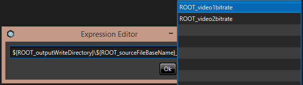

*Zugreifen auf Parameter innerhalb eines Ausdrucks*

Führen Sie für die DateiAusgabe für unsere zweiten Video an:

    ${ROOT_outputWriteDirectory}\${ROOT_sourceFileBaseName}_${ROOT_video2bitrate}kbps.MP4

und für die DateiAusgabe nur-Audio-:

    ${ROOT_outputWriteDirectory}\${ROOT_sourceFileBaseName}_${ROOT_audio1bitrate}bps_audio.MP4

Wenn wir nun die Bitrate für Dateien Video- oder Audioclips ändern, werden der entsprechende Encoder neu konfiguriert werden, und der Messe Bitrate-basierte Datei namens alle automatischen berücksichtigt.

##Hinzufügen von Miniaturansichten zu Multibitrate MP4-Ausgabe

Beginnend mit einem Workflow, der [eine Multibitrate MP4-Ausgabe aus einer MXF Eingabemethoden](media-services-media-encoder-premium-workflow-tutorials.md#MXF_to_MP4_with_dyn_packaging)generiert, werden wir nun gefunden werden in der Ausgabe Miniaturansichten hinzu.

###Übersicht über die Workflow Miniaturansichten auf Hinzufügen.

*Multibitrate MP4-Workflow zu*

###Hinzufügen von JPG-Codierung

Das Herzstück von unserem Miniaturansichten der zweiten Generation werden die Encoder JPG-Komponente JPG-Dateien ausgeben können.

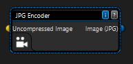

*JPG-Encoder*

Wir können keine unsere nicht komprimiert Videodatenstrom jedoch direkt aus der Eingabe der Media-Datei in den Encoder JPG verbinden. In diesem Fall erwartet sie einzelne Frames übergeben werden. Dies ist, können wir über die Video Rahmen Eingang Komponente ausführen.

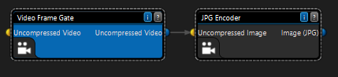

*Herstellen einer Verbindung eine Eingang Rahmen an den JPG-encoder*

Rahmen Eingang so vielen Sekunden oder Frames können einen Videoframe übergeben. Das Intervall und der Uhrzeit der offset mit dem in diesem Fall lässt sich die Eigenschaften.

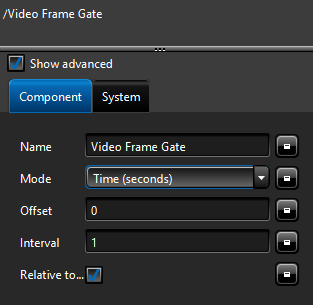

*Video Rahmen Eingang Eigenschaften*

Lassen Sie uns Erstellen einer Miniaturansicht pro Minute durch den Modus Zeit (Sekunden) und das Intervall auf 60 festlegen.

###Umgang mit Farbspektrum Konvertierung

Während, erscheint es logisch, dass beide nicht komprimierte Video Stifte Eingang Rahmen und die Medien Dateieingabe jetzt verbunden werden können, möchten wir eine Warnung angezeigt, wenn wir dies tun würden.

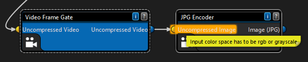

*Farbe Leerzeichen Eingabefehler*

Dies ist, da die Funktionsweise in der Farbe, welche Informationen in unseren ursprünglichen unformatierten nicht komprimiert Videodatenstrom, dargestellt wird in Kürze aus unserem MXF, was der JPG-Encoder erwartet abweicht. Genauer, eine so genannte "Farbspektrum" von "RGB" oder "Graustufe" soll im Datenfluss. Dies bedeutet, dass eingehende Videodatenstrom Video Rahmen Eingang eine Konvertierung zu deren Farbspektrum zuerst angewendet haben muss.

Auf den Workflow ziehen Sie der Farbe Leerzeichen Konverter - Intel, und verbinden Sie es mit unseren Eingang Rahmen.

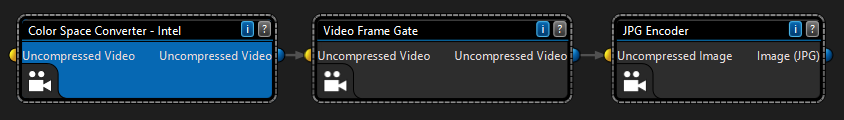

*Herstellen einer Verbindung eine Farbe Leerzeichen-Konverter*

Wählen Sie im Eigenschaftenfenster Instanz 24 Eintrags aus der Liste aus.

###Die Miniaturansichten schreiben

Abweicht unsere MP4-Video, die Encoder JPG-Komponente mehr als eine Datei ausgegeben wird. Um dies zu beheben, eine Komponente der Szene Suchdiensts JPG-Datei verwendet werden kann: Es übernimmt die eingehenden JPG-Miniaturansichten und Schreiben sie Prozentzahlen jedes Filename wird durch eine andere Zahl als Suffix. (Die Zahl in der Regel, die Anzahl der Sekunden/Einheiten im Stream der aus die Miniaturansicht gezogen wurde.)

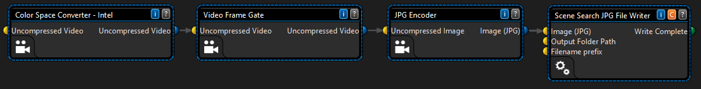

*Einführung in die Szene JPG-Datei Suchdiensts*

Konfigurieren Sie die Eigenschaft Ordnerpfad Ausgabe mit dem Ausdruck: ${ROOT_outputWriteDirectory} 

und die Eigenschaft Filename Präfix mit: 

    ${ROOT_sourceFileBaseName}_thumb_

Das Präfix legt fest, wie die Miniaturansichten Dateien benannt wird werden. Er werden mit einer Zahl zur Angabe des Ziehpunkts Position im Stream Suffix.

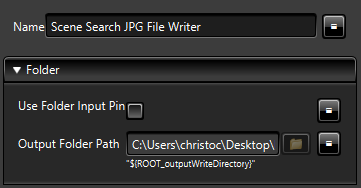

*Eigenschaften der Szene-Suchdiensts JPG-Datei*

Herstellen einer Verbindung die Ausgabe Datei/Anlage Knoten mit der Szene JPG-Datei Suchdiensts.

###Erkennen von Fehlern in einem workflow

Herstellen einer Verbindung die Ausgabe der unformatierten nicht komprimierte video mit der Eingabe des Konverters Leerzeichen Farbe. Führen Sie nun einen lokalen Testlauf für den Workflow aus. Es gibt eine hohe Wahrscheinlichkeit, die der Workflow plötzlich Ausführung beendet und darauf hinzuweisen, mit einer roten Gliederung auf die Komponente, bei dem einen Fehler aufgetreten:

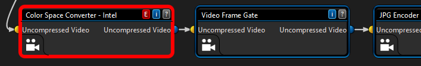

*Farbe Konverter Leerzeichen zurück*

Klicken Sie auf das kleine rote "E"-Symbol in der oberen rechten Ecke der Farbe Leerzeichen Konverter Komponente zu sehen, was der Grund der Codierung Versuch ist fehlgeschlagen ist.

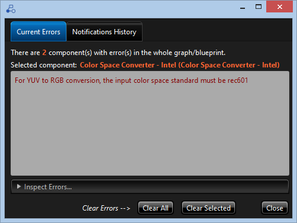

*Farbe Leerzeichen Konverter Fehlerdialogfeld*

Wie sich herausstellt, wie Sie sehen können, standard für die Farbe Leerzeichen Konverter eingehende Farbspektrum verfügt rec601 für unsere angeforderten YUV Konvertierung in RGB sein. Offensichtlich anzugeben nicht unsere Stream es rec601. (MAK 601 ist ein Standard für die Codierung verschachtelten analog Videosignale in digitale video Formular. Es gibt einen aktiven Bereich darüber liegendem 720 Intensität Beispiele und 360 Chrominanz Beispiele pro Zeile an. Die Farbe Codierung System ist bekannt als YCbCr 4:2:2.)

Um dieses Problem zu beheben, wird auf die Metadaten des unsere Streams anzugeben, die wir mit rec601 Inhalt zu tun haben. Dazu verwenden wir ein Video Datentyp Aktualisierungskomponente die wir zwischen unseren unformatierten Quell- und die Farbe Leerzeichen Konvertierungskomponente positioniert wird. Diese Datentyp Updater ermöglicht Schrifteigenschaften für die manuelle Aktualisierung bestimmter video Daten aus. Konfigurieren Sie, um eine Farbe Leerzeichen Standard von "MAK 601" anzugeben. Dadurch wird das Video Datentyp Updater zu kategorisieren Streams mit der Farbspektrum "MAK 601" aus, wenn es keine Farbspektrum noch nicht definiert wurde. (Es werden keine vorhandenen Metadaten, überschreiben, es sei denn, das Kontrollkästchen Überschreiben aktiviert wurde.)

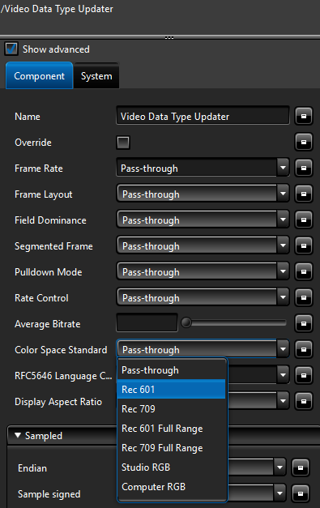

*Farbe Leerzeichen Standard auf den Typ Updater Daten aktualisieren*

###Workflow abgeschlossen

Nachdem Sie nun unsere unserem Workflow abgeschlossen ist, führen Sie einen weiteren Test ausführen, sehen sie weitergeleitet.

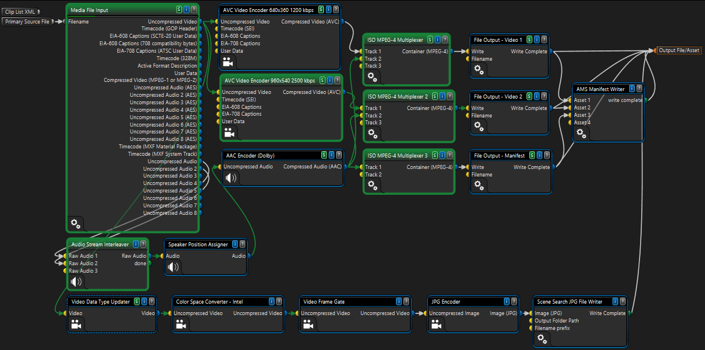

*Fertige Workflow für die Multi-mp4-Ausgabe mit Miniaturansichten*

##Zeitbasierte Verkürzen der Multibitrate MP4-Ausgabe

Beginnend mit einem Workflow, der [eine Multibitrate MP4-Ausgabe aus einer MXF Eingabemethoden](media-services-media-encoder-premium-workflow-tutorials.md#MXF_to_MP4_with_dyn_packaging)generiert, werden wir nun gefunden werden in basierend auf den Zeitstempel Quellvideo kürzen.

###Workflowübersicht fangen Sie zum Zuschneiden

*Workflow hinzufügen zu verkürzen gestartet*

###Verwenden der Stream Trimmer

Die Komponente Stream Trimmer ermöglicht Kürzen von Anfang und Ende einer Eingabe-Stream Basis auf Anzeigedauer Informationen (Sekunden und Minuten,...). Frame-basierte verkürzen unterstützt der Trimmer nicht.

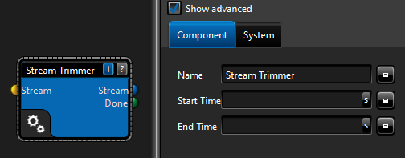

*Stream Trimmer*

Statt verknüpfen die AVC Encoder und die Lautsprecher Position delegierende Person direkt mit der Eingabe der Media-Datei, können wir zwischen den Stream Trimmer setzen. (Einen für das Videosignal und für das überlappende Audiosignal.)

*Setzen Sie Stream Trimmer dazwischen*

Lassen Sie uns Trimmer so konfigurieren, dass wir nur Video und Audio zwischen 15 Sekunden und 60 Sekunden im Video verarbeitet werden.

Öffnen Sie die Eigenschaften für das Video Stream Trimmer und konfigurieren Sie sowohl Anfangszeit (15 s) und endet (60 s) Eigenschaften. Stellen Sie sicher, dass sowohl unsere Trimmer Audio- und immer an die gleiche Start- und Endzeit Werte konfiguriert sind, werden wir die werden im Stammordner des Workflows veröffentlichen.

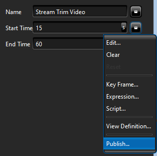

*Start Time-Eigenschaft aus Stream Trimmer veröffentlichen*

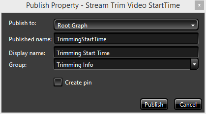

*Dialogfeld "Eigenschaften" für die Startzeit veröffentlichen*

*Dialogfeld "Eigenschaften" für Endzeit veröffentlichen*

Wenn wir nun auf der Stammebene unserem Workflow prüfen, werden beide Eigenschaften konfigurierbare und übersichtlich angezeigten von dort aus.

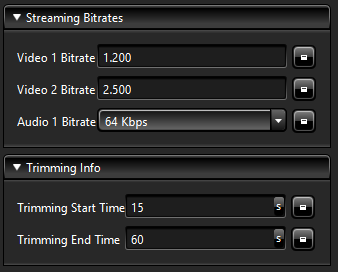

*Veröffentlichten Eigenschaften auf Stamm zur Verfügung*

Jetzt öffnen Sie die verkürzen Eigenschaften aus den Trimmer Audio- und konfigurieren Sie sowohl Start- und Endzeiten mit Ausdruck auf die veröffentlichten Eigenschaften auf der Stammebene unserem Workflow verweist.

Für das Audio kürzen Startzeit:

    ${ROOT_TrimmingStartTime}

und seine Endzeit:

    ${ROOT_TrimmingEndTime}

###Workflow abgeschlossen

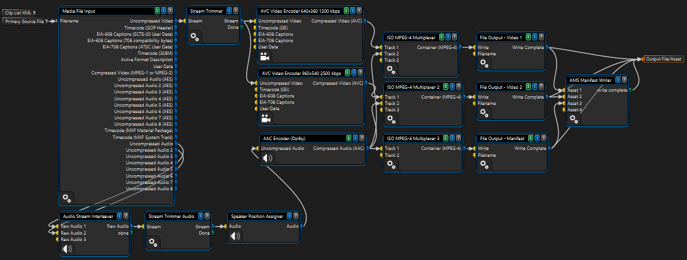

*Workflow abgeschlossen*

##Einführung in die Skript-Komponente

Skripte-Komponenten können beliebige Skripts während der Ausführung Phasen unsere Workflows ausführen. Es gibt vier verschiedene Skripts, die ausgeführt werden können, jeweils mit Besonderheiten und ihrer eigenen Stelle im Workflow-Lebenszyklus:

- **commandScript**
- **realizeScript**
- **processInputScript**
- **lifeCycleScript**

Die Dokumentation der Komponente Skript geht ausführlicher für die oben. [Im folgenden Abschnitt](media-services-media-encoder-premium-workflow-tutorials.md#frame_based_trim)wird die Skriptkomponente **RealizeScript** zum Erstellen einer Cliplist Xml im laufenden Betrieb aus, wenn der Workflow startet. Dieses Skript wird während der Einrichtung Komponente aufgerufen, die nur einmal in des gesamten Lebenszyklus passiert.

###Innerhalb eines Workflows Scripting: Hallo Welt

Ziehen Sie eine Skript-Komponente auf der Oberfläche des Designers, und benennen sie (beispielsweise "SetClipListXML").

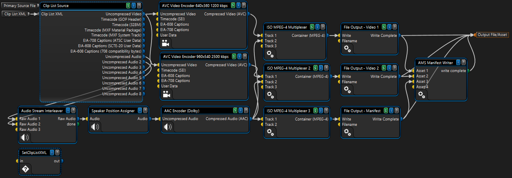

*Hinzufügen einer Skript-Komponente*

Wenn Sie die Eigenschaften der Komponente Skript zu prüfen, werden die vier Arten von verschiedenen Skripts angezeigt, die jeweils zu einem anderen Skript konfigurierbare.

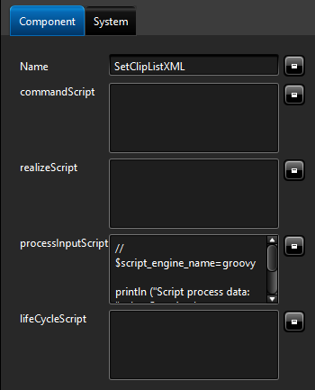

*Eigenschaften der Skripts*

Deaktivieren Sie die ProcessInputScript, und öffnen Sie den Editor für die RealizeScript. Wir sind jetzt nach oben und beginnen Sie Skripting festgelegt.

Skripts sind in Groovy, dynamisch kompilierte scripting-Sprache für die Java-Plattform geschrieben, die Kompatibilität mit Java beibehält. Die meisten Java-Code ist sogar gültigen kreative Code.

Schreiben wir nun ein einfaches Hallo Welt kreative Skript im Zusammenhang mit unserer RealizeScript aus. Geben Sie im Editor Folgendes ein:

    node.log("hello world");

Führen Sie nun einen lokalen Testlauf. Prüfen Sie nach dieser Instanz die Eigenschaft "Protokolle" (über die Registerkarte System für die Komponente Skript erstellt).

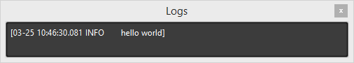

*Hallo Welt Logausgabe*

Das Knotenobjekt, das wir rufen Sie die Methode Log, bezieht sich auf unsere aktuellen "Knoten" oder die Komponente, die wir in scripting sind. Jede Komponente verfügt über als solche die Möglichkeit, die Protokollierung Ausgabedaten, über die Registerkarte System verfügbar. In diesem Fall ausgeben wir das Zeichenfolgenliteral "Hallo Welt". Wichtig zu verstehen, dass dies beweisen kann, werden als wertvolles Debuggen Tool, und gibt Ihnen einen Einblick auf was das Skript wie folgt ist hier.

Nicht über unsere Skriptingtools Umgebung, wir auch Zugriff auf Eigenschaften auf andere Komponenten. Versuchen Sie Folgendes:

    //inspect current node: 
    def nodepath = node.getNodePath(); 
    node.log("this node path: " + nodepath);
    
    //walking up to other nodes: 
    def parentnode = node.getParentNode(); 
    def parentnodepath = parentnode.getNodePath(); 
    node.log("parent node path: " + parentnodepath);
    
    //read properties from a node: 
    def sourceFileExt = parentnode.getPropertyAsString( "sourceFileExtension", null ); 
    def sourceFileName = parentnode.getPropertyAsString("sourceFileBaseName", null); 
    node.log("source file name with extension " + sourceFileExt + " is: " + sourceFileName);

Unser Log-Fenster wird uns Folgendes angezeigt:

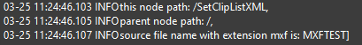

*Logausgabe für den Zugriff auf Knoten Wege*

##Frame-basierte Verkürzen der Multibitrate MP4-Ausgabe

Beginnend mit einem Workflow, der [eine Multibitrate MP4-Ausgabe aus einer MXF Eingabemethoden](media-services-media-encoder-premium-workflow-tutorials.md#MXF_to_MP4_with_dyn_packaging)generiert, werden wir nun gefunden werden in basierend auf den Rahmen zählt Quellvideo kürzen.

###Übersicht der Entwurf fangen Sie zum Zuschneiden

*Workflow mit dem Hinzufügen von verkürzen zu beginnen*

###Verwendung der ClipArt XML-Liste

In allen vorherigen Workflow Lernprogrammen verwendet wir die Medien Datei Eingabewerte Komponente als unsere Videoeingabequelle aus. Für dieses spezielle Szenario wird jedoch wir die ClipArt Liste Quellkomponente stattdessen verwenden. Beachten Sie, dass dies nicht die bevorzugte Methode Arbeitsstil sein soll. Verwenden nur die Quelle ClipArt aus, wenn ein real Grund dafür vorliegt (wie in der unterhalb der Fall, in dem wir machen der ClipArt Liste verkürzen Funktionen verwenden).

Um die von unserem Medien Datei Eingabesprache auf die ClipArt-Listenquelle wechseln möchten, ziehen Sie die Clip Liste Quellkomponente auf der Entwurfsoberfläche und Herstellen einer Verbindung den Clip Liste XML-Knoten des Workflowdesigners mit der XML-Liste von ClipArt-Pin. Dadurch sollte die Quelle Clip mit Ausgabe Stifte, Grundlage unserer video Eingabe ausgefüllt. Jetzt verbinden die Stifte nicht komprimierte Video und Audio nicht komprimiert aus der ClipArt Listenquelle auf die entsprechenden AVC Encoder und Audio Stream Interleaver konnte nicht. Entfernen Sie jetzt die Eingabe der Media-Datei ein.

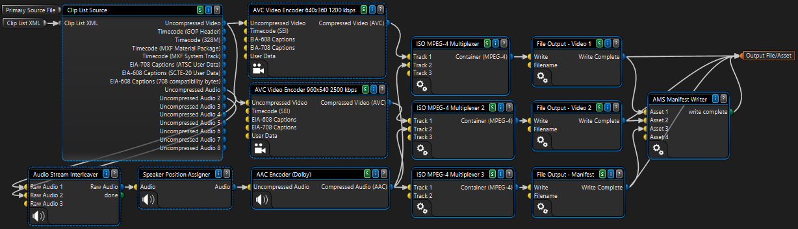

*Ersetzt die Eingabe der Media-Datei mit der Quelle der ClipArt-Liste*

Die Clip Liste Quellkomponente wird als Eingabe eines "Clip Liste XML". Wenn die Quelldatei mit lokal testen Sie ausgewählt haben, ist dieses Clip Liste Xml automatisch für Sie.

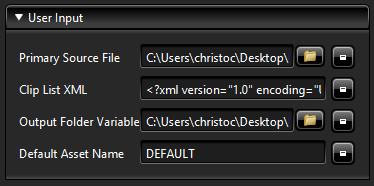

*Automatisch Clip Liste XML-Eigenschaft*

Suchen Sie ein wenig näher an die XML-Daten, ist dies, wie es aussieht:

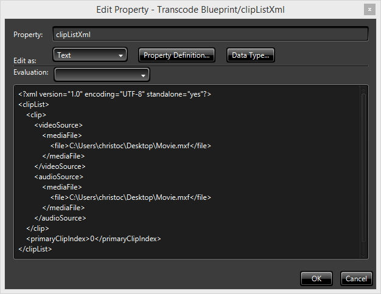

*Dialogfeld für ClipArt-Liste bearbeiten*

Dies spiegelt jedoch nicht die Funktionen der XML-Liste ClipArt. Eine Möglichkeit, die wir haben, wird ein Element "Zuschneiden" klicken Sie unter sowohl die Video- und Quelle wie folgt hinzufügen:

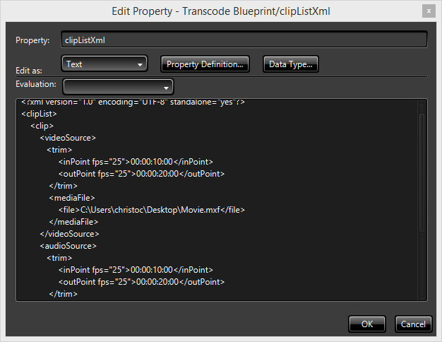

*Hinzufügen eines Glätten Elements in der Liste ClipArt*

Wenn Sie das Clip Liste Xml wie folgt über ändern und ein lokales Tests ausführen Ausführen, sehen Sie das Video ordnungsgemäß wurde zwischen 10 und 20 Sekunden im Video abgeschnitten.

Im Gegensatz zu was passiert, wenn Sie eine lokale Ausführen durch ausführen müssen dieses sehr derselben Cliplist Xml nicht den gleichen Effekt, wenn in einem Workflow angewendet, die in Azure Media Services ausgeführt wird. Beim Starten von Azure Premium Encoder generieren wird von Xml Cliplist jedes Mal erneut, die Eingabe Datei basierend auf die der Auftrag Codierung angegeben wurde. Dies bedeutet, dass alle Änderungen, die wir auf die XML-Daten durchführen möchten leider überschrieben werden.

Um zu begegnen Cliplist Xml bereinigt wird, wenn eine Codierung gestartet wird, kann wir im laufenden Betrieb nur nach dem Start des unserem Workflow erneut generieren. Solche benutzerdefinierten Aktionen können ausgeführt werden, bis was als "Skript-Komponente" aufgerufen wird. Weitere Informationen finden Sie unter [Einführung in die Komponente Skript erstellt](media-services-media-encoder-premium-workflow-tutorials.md#scripting).

Ziehen Sie eine Skript-Komponente auf der Oberfläche des Designers, und benennen Sie sie in "SetClipListXML".

*Hinzufügen einer Skript-Komponente*

Wenn Sie die Eigenschaften der Komponente Skript zu prüfen, werden die vier Arten von verschiedenen Skripts angezeigt, die jeweils zu einem anderen Skript konfigurierbare.

*Eigenschaften der Skripts*

###Ändern der Liste ClipArt aus einer Komponente Skript erstellt

Bevor wir das Cliplist Xml erneut schreiben können, das beim Start des Workflows generiert wird, müssen wir auf die Cliplist XML-Eigenschaft und Inhalte zugreifen können. Wie folgt können wir vorgehen:

    // get cliplist xml: 
    def clipListXML = node.getProperty("../clipListXml");
    node.log("clip list xml coming in: " + clipListXML);

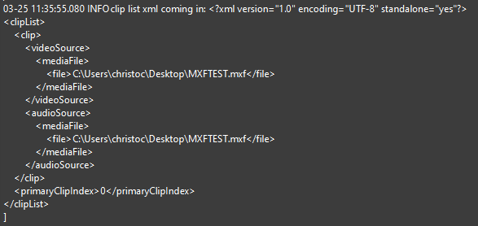

*Liste der eingehenden Clips angemeldet sein*

Zuerst benötigen wir eine Möglichkeit, von welcher Punkt feststellen bis zu diesem Zeitpunkt wir das Video kürzen. Um dies für dem Benutzer weniger technische des Workflows geeignete stellen, veröffentlichen Sie zwei Eigenschaften werden im Stammordner des Diagramms ein. Um dies zu tun, klicken Sie mit der rechten Maustaste auf der Oberfläche des Designers, und wählen Sie "Eigenschaft hinzufügen":

- Erste Eigenschaft: "ClippingTimeStart" vom Typ: "TIMECODE"
- Zweite Eigenschaft: "ClippingTimeEnd" vom Typ: "TIMECODE"

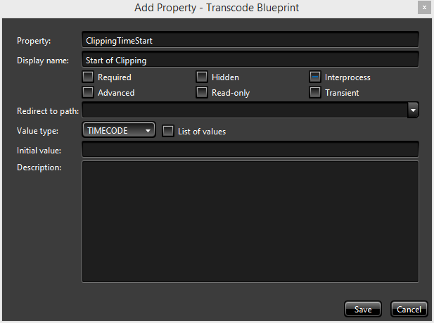

*Fügen Sie die Eigenschaftendialogfeld für Startzeit eines Bildschirmausschnitts*

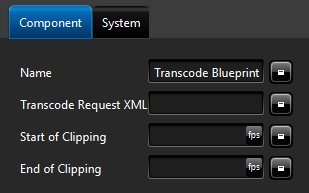

*Zuschneiden Zeit Ausstellungsstücke auf Workflow-Stammwebsite veröffentlicht*

Konfigurieren Sie beide Eigenschaften auf einen geeigneten Wert ein:

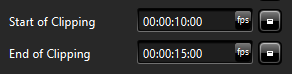

*Konfigurieren eines Bildschirmausschnitts starten und Beenden von Eigenschaften*

Nun können in unser Skript wir beide Eigenschaften wie folgt zugreifen:

    
    // get start and end of clipping:
    def clipstart = node.getProperty("../ClippingTimeStart").toString();
    def clipend = node.getProperty("../ClippingTimeEnd").toString();
    
    node.log("clipping start: " + clipstart);
    node.log("clipping end: " + clipend);

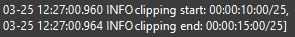

*Log-Fenster mit Anfang und Ende eines Bildschirmausschnitts*

Analysieren Sie uns die Timecode Zeichenfolgen in einer komfortabler Formular mit einem einfachen regulären Ausdruck verwenden:
    
    //parse the start timing: 
    def startregresult = (~/(\d\d:\d\d:\d\d:\d\d)\/(\d\d)/).matcher(clipstart); 
    startregresult.matches(); 
    def starttimecode = startregresult.group(1); 
    node.log("timecode start is: " + starttimecode); 
    def startframerate = startregresult.group(2); 
    node.log("framerate start is: " + startframerate);
    
    //parse the end timing: 
    def endregresult = (~/(\d\d:\d\d:\d\d:\d\d)\/(\d\d)/).matcher(clipend); 
    endregresult.matches(); 
    def endtimecode = endregresult.group(1); 
    node.log("timecode end is: " + endtimecode); 
    def endframerate = endregresult.group(2); 
    node.log("framerate end is: " + endframerate);

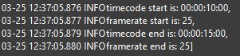

*Log-Fenster mit der Ausgabe des analysierten timecode*

Mit diesen Informationen zur hand können wir nun die Cliplist XML-Daten entsprechend die Start- und Endzeiten für den gewünschten Rahmen genau eines Bildschirmausschnitts des Films ändern.

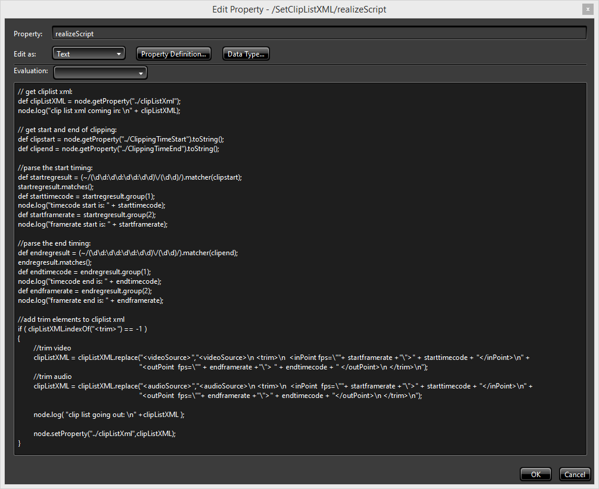

*Skriptcode Glätten Elemente hinzufügen*

Dies wurde durch den normalen Bearbeitung Zeichenfolgenoperationen fertig. Das resultierende geänderten Clip Liste Xml wird wieder in die Eigenschaft ClipListXML im Stammverzeichnis Workflow mithilfe der Methode "SetProperty" geschrieben. Das Fenster Log, nachdem ein anderes Testlauf möchten uns wie folgt aussehen:

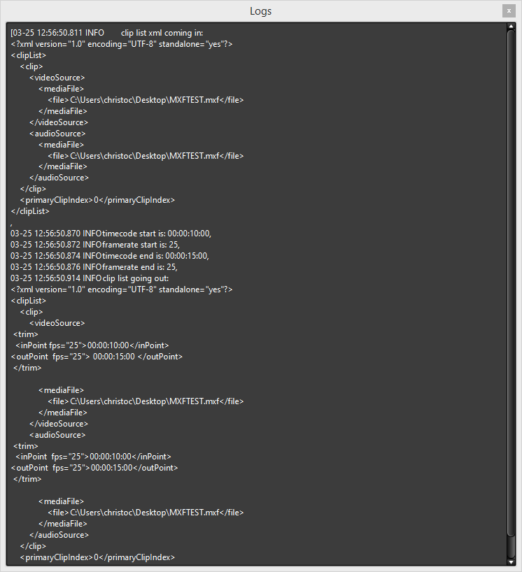

*Protokollierung in der Ergebnisliste ClipArt*

Führen Sie einen Testlauf, um anzuzeigen, wie das video und audio-Streams abgeschnitten wurde haben. Wie Sie mehrere Testlauf mit anderen Werten für die Punkte verkürzen vornehmen können, sehen Sie sich, dass die nicht jedoch berücksichtigt werden! Der Grund dafür ist, dass im-Designer im Gegensatz zu den Azure-Laufzeit nicht dem Xml Cliplist jeder ausführen außer Kraft setzt. Dies bedeutet, die nur die ersten Mal haben Sie den Beginn und das out-Points, eingerichtet das XML-Daten, alle anderen Zeiten unsere Schutzklausel transformieren verursacht (Wenn (clipListXML.indexOf ("<trim>") ==-1)) wird verhindert, dass den Workflow ein anderes Glätten Element hinzufügen, wenn es bereits eine präsentieren ist.

Hinzufügen wir am besten geeignete lokal testen unserem Workflow gestalten entsprechendem Code, Haus-beibehalten, der untersucht, wenn ein Element Glätten bereits vorhanden ist. Ist dies der Fall ist, können wir es entfernen, bevor Sie fortfahren, indem Sie die XML-Daten mit den neuen Werten ändern. Statt einfarbigen Zeichenfolgen verwenden, ist es wahrscheinlich Sicherheit Aktion durch real XML-Objektmodell analysieren.

Bevor wir diese Art von Code durch hinzufügen können, müssen wir eine Reihe von Anweisungen importieren zuerst am Anfang der unser Skript hinzufügen:
    
    import javax.xml.parsers.*; 
    import org.xml.sax.*; 
    import org.w3c.dom.*;
    import javax.xml.*;
    import javax.xml.xpath.*; 
    import javax.xml.transform.*; 
    import javax.xml.transform.stream.*; 
    import javax.xml.transform.dom.*;

Danach können wir den erforderlichen säubern Code hinzufügen:

    //for local testing: delete any pre-existing trim elements from the clip list xml by parsing the xml into a DOM:
    DocumentBuilderFactory factory=DocumentBuilderFactory.newInstance();
    DocumentBuilder builder=factory.newDocumentBuilder();
    InputSource is=new InputSource(new StringReader(clipListXML)); 
    Document dom=builder.parse(is);

    //find the trim element inside videoSource and audioSource and remove it if it exists already: 
    XPath xpath = XPathFactory.newInstance().newXPath();
    String findAllTrimElements = "//trim"; 
    NodeList trimelems = xpath.evaluate(findAllTrimElements,dom,XPathConstants.NODESET);

    //copy trim nodes into a "to-be-deleted" collection 
    Set<Element> elementsToDelete = new HashSet<Element>(); 
    for (int i = 0; i < trimelems.getLength(); i++) { 
        Element e = (Element)trimelems.item(i); 
        elementsToDelete.add(e); 
    }

    node.log("about to delete any existing trim nodes");
     //delete the trim nodes: 
    elementsToDelete.each{ 
        e -> e.getParentNode().removeChild(e);
    }; 
    node.log("deleted any existing trim nodes");
    
    //serialize the modified clip list xml dom into a string: 
    def transformer = TransformerFactory.newInstance().newTransformer();
    StreamResult result = new StreamResult(new StringWriter());
    DOMSource source = new DOMSource(dom);
    transformer.transform(source, result); 
    clipListXML = result.getWriter().toString();
    
Dieser Code geht direkt oberhalb der Punkt, an dem wir die Cliplist XML-Daten die Glätten Elemente hinzu.

Zu diesem Zeitpunkt können wir ausführen und Ändern von unserem Workflow während der Anzeigedauer ähnlich wie wir, während Sie die Änderungen jemals angewendet möchten.    

###Hinzufügen einer ClippingEnabled Komfort-Eigenschaft

Beliebig nicht immer möglicherweise um erfolgen zuschneiden, lassen Sie uns am Ende aus unserem Workflow hinzufügen eine geeignete boolesche Kennzeichnung, der angibt, ob wir aktivieren Zuschneiden / Zuschneiden möchten.

Veröffentlichen Sie genauso wie zuvor eine neue Eigenschaft werden im Stammordner unserer Workflow aufgerufen "ClippingEnabled" der Typ "BOOLESCH" ein.

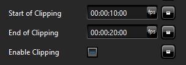

*Veröffentlicht eine Eigenschaft für das Aktivieren eines Bildschirmausschnitts*

Mit der unter einfache Schutzklausel, können wir überprüfen, ob verkürzen erforderlich ist und entscheiden, ob die ClipArt-Liste muss als solche oder nicht korrigiert werden muss.

    //check if clipping is required: 
    def clippingrequired = node.getProperty("../ClippingEnabled"); 
    node.log("clipping required: " + clippingrequired.toString()); 
    if(clippingrequired == null || clippingrequired == false) 
    {
        node.setProperty("../clipListXml",clipListXML); 
        node.log("no clipping required"); 
        return; 
    }

###Vollständige code

    import javax.xml.parsers.*; 
    import org.xml.sax.*; 
    import org.w3c.dom.*;
    import javax.xml.*;
    import javax.xml.xpath.*; 
    import javax.xml.transform.*; 
    import javax.xml.transform.stream.*; 
    import javax.xml.transform.dom.*;
    
    // get cliplist xml: 
    def clipListXML = node.getProperty("../clipListXml");
    node.log("clip list xml coming in: \n" + clipListXML);
    // get start and end of clipping: 
    def clipstart = node.getProperty("../ClippingTimeStart").toString();
    def clipend = node.getProperty("../ClippingTimeEnd").toString();
    
    //parse the start timing:
    def startregresult = (~/(\d\d:\d\d:\d\d:\d\d)\/(\d\d)/).matcher(clipstart); 
    startregresult.matches(); 
    def starttimecode = startregresult.group(1);
    node.log("timecode start is: " + starttimecode);
    def startframerate = startregresult.group(2);
    node.log("framerate start is: " + startframerate);
    
    //parse the end timing: 
    def endregresult = (~/(\d\d:\d\d:\d\d:\d\d)\/(\d\d)/).matcher(clipend);
    endregresult.matches(); 
    def endtimecode = endregresult.group(1); 
    node.log("timecode end is: " + endtimecode); 
    def endframerate = endregresult.group(2);

    node.log("framerate end is: " + endframerate);
    
    //for local testing: delete any pre-existing trim elements 
    //from the clip list xml by parsing the xml into a DOM:
    
    DocumentBuilderFactory factory=DocumentBuilderFactory.newInstance();
    DocumentBuilder builder=factory.newDocumentBuilder(); 
    InputSource is=new InputSource(new StringReader(clipListXML)); 
    Document dom=builder.parse(is);

    //find the trim element inside videoSource and audioSource and remove it if it exists already:
    XPath xpath = XPathFactory.newInstance().newXPath(); 
    String findAllTrimElements = "//trim"; 
    NodeList trimelems = xpath.evaluate(findAllTrimElements, dom, XPathConstants.NODESET);

    //copy trim nodes into a "to-be-deleted" collection 
    Set<Element> elementsToDelete = new HashSet<Element>(); 
    for (int i = 0; i < trimelems.getLength(); i++) { 
        Element e = (Element)trimelems.item(i); 
        elementsToDelete.add(e); 
    }
    
    node.log("about to delete any existing trim nodes");
    //delete the trim nodes:
    elementsToDelete.each{ e -> 
        e.getParentNode().removeChild(e); 
    };
    node.log("deleted any existing trim nodes");

    //serialize the modified clip list xml dom into a string:
    def transformer = TransformerFactory.newInstance().newTransformer();
    StreamResult result = new StreamResult(new StringWriter());
    DOMSource source = new DOMSource(dom);
    transformer.transform(source, result);
    clipListXML = result.getWriter().toString();

    //check if clipping is required:
    def clippingrequired = node.getProperty("../ClippingEnabled");
    node.log("clipping required: " + clippingrequired.toString()); 
    if(clippingrequired == null || clippingrequired == false) 
    {
        node.setProperty("../clipListXml",clipListXML);
        node.log("no clipping required");
        return; 
    }

    //add trim elements to cliplist xml 
    if ( clipListXML.indexOf("<trim>") == -1 ) 
    {
        //trim video 
        clipListXML = clipListXML.replace("<videoSource>","<videoSource>\n <trim>\n <inPoint fps=\""+ 
            startframerate +"\">" + starttimecode + 
            "</inPoint>\n" + "<outPoint fps=\"" + endframerate +"\"> " + endtimecode + 
            " </outPoint>\n </trim> \n"); 
        //trim audio 
        clipListXML = clipListXML.replace("<audioSource>","<audioSource>\n <trim>\n <inPoint fps=\""+ 
            startframerate +"\">" + starttimecode + 
            "</inPoint>\n" + "<outPoint fps=\""+ endframerate +"\">" + 
            endtimecode + "</outPoint>\n </trim>\n");
        node.log( "clip list going out: \n" +clipListXML ); 
        node.setProperty("../clipListXml",clipListXML); 
    }

##Siehe auch 

[Einführung in Premium Codierung in Azure Media Services](http://azure.microsoft.com/blog/2015/03/05/introducing-premium-encoding-in-azure-media-services)

[So Premium Codierung in Azure Media Services verwenden](http://azure.microsoft.com/blog/2015/03/06/how-to-use-premium-encoding-in-azure-media-services)

[Codierung On Demand-Inhalten mit Azure Media-Dienst](media-services-encode-asset.md#media_encoder_premium_workflow)

[Media Encoder Premium-Workflow-Formate und Codecs](media-services-premium-workflow-encoder-formats.md)

[Workflow-Beispieldateien](http://github.com/Azure/azure-media-services-samples/tree/master/Encoding%20Presets/VoD/MediaEncoderPremiumWorkfows)

[Azure Media Services Explorer-Tools](http://aka.ms/amse)

##Media-Dienste Learning Wege

[AZURE.INCLUDE [media-services-learning-paths-include](../../includes/media-services-learning-paths-include.md)]

##Angeben von feedback

[AZURE.INCLUDE [media-services-user-voice-include](../../includes/media-services-user-voice-include.md)]
