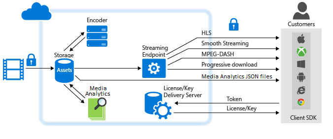

<properties 
    pageTitle="Übersicht über die Azure Media-Dienste und häufige Szenarien | Microsoft Azure" 
    description="Dieses Thema enthält eine Übersicht der Azure Media Services" 
    services="media-services" 
    documentationCenter="" 
    authors="Juliako" 
    manager="erikre" 
    editor=""/>

<tags 
    ms.service="media-services" 
    ms.workload="media" 
    ms.tgt_pltfrm="na" 
    ms.devlang="na" 
    ms.topic="hero-article" 
    ms.date="10/12/2016"
    ms.author="juliako;anilmur"/>

#Übersicht über die Azure Media-Dienste und häufige Szenarien

Microsoft Azure Media Services ist eine extensible cloudbasierte Plattform integriert, die Entwickler skalierbare Medien Management und-Bereitstellung Applications erstellen kann. Media Services basieren auf REST-APIs, mit denen Sie sicher hochladen, speichern, codieren und Verpacken Video- oder Audioclip Inhalte für bei Bedarf und live streaming Übermittlung mit verschiedenen Clients (z. B. TV, PC und mobile Geräte).

Sie können End-to-End-Workflows mithilfe vollständig Media-Dienste erstellen. Sie können auch auswählen Drittanbieter-Komponenten für einige Teile der Workflow verwendet werden soll. Beispielsweise codieren Sie mit einer Drittanbieter-Encoder. Klicken Sie dann auf Hochladen, schützen, Verpacken, übermitteln mit Media-Dienste.

Sie können auch der Inhalt live oder stellen Sie bei Bedarf Content Stream. In diesem Thema werden häufige Szenarien beim Vorführen der Inhalt [live](media-services-overview.md#live_scenarios) oder [bei Bedarf](media-services-overview.md#vod_scenarios)an. Das Thema außerdem links zu anderen relevanten Themen.

## SDKs und tools

Media Services-Lösungen zu erstellen, können Sie Folgendes verwenden:

- [Media-Dienste REST-API](https://msdn.microsoft.com/library/azure/hh973617.aspx)
- Eine der verfügbaren Client SDKs:
- [Azure Media Services SDK für .NET](https://github.com/Azure/azure-sdk-for-media-services)
- [Azure SDK für Java](https://github.com/Azure/azure-sdk-for-java),
- [Azure SDK von PHP](https://github.com/Azure/azure-sdk-for-php),
- [Azure Media Services für Node.js](https://github.com/michelle-becker/node-ams-sdk/blob/master/lib/request.js) (Dies ist eine nicht-Microsoft-Version von einer Node.js SDK. Wird von einer Community verwaltet und haben derzeit keiner 100 % Schutz der AMS-APIs).
- Vorhandene Tools:
- [Azure-portal](https://portal.azure.com/)
- [Azure-Media-Services-Explorer](https://github.com/Azure/Azure-Media-Services-Explorer) (Azure Media Services Explorer (AMSE) ist ein Winforms / C#-Anwendung für Windows)

##Media-Dienste Learning Wege

Sie können hier Pfade learning AMS anzeigen:

- [AMS Live Streaming Workflow](https://azure.microsoft.com/documentation/learning-paths/media-services-streaming-live/)
- [AMS on Demand Streaming Workflow](https://azure.microsoft.com/documentation/learning-paths/media-services-streaming-on-demand/)

##Erforderliche Komponenten

Um zu Azure Media-Dienste verwenden, sollten Sie die folgenden haben:

3. Ein Azure-Konto. Wenn Sie kein Konto haben, können Sie ein kostenloses Testversion Konto nur wenigen Minuten erstellen. Weitere Informationen finden Sie unter [Azure kostenlose Testversion](https://azure.microsoft.com).
2. Ein Azure Media Services-Konto. Verwenden der Azure-Portal, .NET- oder REST-API Azure Media Services-Kontos zu erstellen. Weitere Informationen finden Sie unter [Account erstellen](media-services-portal-create-account.md).
3. (Optional) Richten Sie Entwicklungsumgebung aus. Wählen Sie für Ihre Entwicklungsumgebung .NET oder REST-API aus. Weitere Informationen finden Sie unter [Einrichten der Umgebung](media-services-dotnet-how-to-use.md).

Darüber hinaus erfahren Sie, wie programmgesteuert [Verbinden](media-services-dotnet-connect-programmatically.md)verbinden.
4. (Empfohlen) Reservieren Sie eine oder mehrere Maßeinheiten. Es wird empfohlen, eine oder mehrere Maßeinheiten für Applikationen in Herstellung-Umgebung zugewiesen werden.   Weitere Informationen finden Sie unter [Verwalten von streaming Endpunkte](media-services-portal-manage-streaming-endpoints.md).

##Grundlegende Konzepte und (Übersicht)

Azure Media Services Konzepte vorgesehen sind finden Sie unter [Konzepte](media-services-concepts.md).

Bei einer unterstützenden Datenreihe, die Sie in die Hauptkomponenten von Azure Media Services einleiten, finden Sie unter [Azure Media Services schrittweise Lernprogramme](https://docs.com/fukushima-shigeyuki/3439/english-azure-media-services-step-by-step-series). Dieser Reihe verfügt über eine gute Übersicht der Konzepte, und es wird das Tool AMSE verwendet, um zu veranschaulichen, AMS Aufgaben. Beachten Sie, dass AMSE Tool Windows-Tool ist. Dieses Tool unterstützt die meisten der Aufgaben, die Sie programmgesteuert mit [AMS SDK für .NET](https://github.com/Azure/azure-sdk-for-media-services), [Azure SDK für Java](https://github.com/Azure/azure-sdk-for-java)oder [Azure von PHP SDK](https://github.com/Azure/azure-sdk-for-php)erreichen können.

##Wiedergabe von Medien bei Bedarf mit Azure Media Services: allgemeine Szenarien und Aufgaben

In diesem Abschnitt werden häufige Szenarien und enthält Links zu relevanten Themen. Das folgende Diagramm zeigt die wichtigsten Teile der Media Services-Plattform, die beteiligt sind bei der Bereitstellung von Inhalten bei Bedarf. 

###Schützen von Inhalten in Speicher und Vorführen streaming-Medien als Klartext (ohne Verschlüsselung)

1. Hochladen einer Datei hoch auflösendes Mezzanine in eine Anlage.
    
    Es wird empfohlen, um Speicher Verschlüsselungsoption auf Ihrer Anlage angewendet werden, um den Inhalt während des Uploads und klicken Sie bei Rest im Speicher zu schützen.
 
1. Codieren Sie in eine Reihe von adaptive Bitrate MP4-Dateien. 

    Es wird empfohlen, auf die Speicheroption-Verschlüsselung auf die Ausgabe Anlage angewendet werden, um Ihre Inhalte bei Rest schützen.
    
1. Konfigurieren der Anlage Übermittlung Richtlinie (vom dynamische Verpackung verwendet). 
    
    Falls Ihre Anlage Speicher verschlüsselt ist, konfigurieren **müssen** Sie Objekt Übermittlung Richtlinie. 

1. Veröffentlichen Sie die Anlage durch Erstellen eines auf-Anforderung Locators aus.

    Stellen Sie sicher, dass mindestens eine streaming reservierte Einheit für das streaming Endpunkt von der zum Streaming von Inhalten aus.

1. Stream veröffentlicht Inhalt.

###Schützen von Inhalten in Speicher, vorführen dynamisch verschlüsselte streaming-Medien  

Um dynamische Verschlüsselung verwenden können, müssen Sie zunächst mindestens eine streaming reservierte Einheit für das streaming Endpunkt abrufen, aus denen Sie verschlüsselte Inhalte übertragen möchten.

1. Hochladen einer Datei hoch auflösendes Mezzanine in eine Anlage. Gelten Sie Option für Speicher-Verschlüsselung für die Anlage.
1. Codieren Sie in eine Reihe von adaptive Bitrate MP4-Dateien. Gelten Sie Option für Speicher-Verschlüsselung für die Ausgabe-Anlage.
1. Erstellen Sie Inhalte Verschlüsselungsschlüssels für die Anlage, die Sie während der Wiedergabe dynamisch verschlüsselt werden möchten.
2. Konfigurieren von Key Autorisierungsrichtlinie an.
1. Konfigurieren Sie die Anlage Übermittlung Richtlinie (vom dynamische Packen und dynamische Verschlüsselung verwendet).
1. Veröffentlichen Sie die Anlage durch Erstellen eines auf-Anforderung Locators aus.
1. Stream veröffentlicht Inhalt. 

###Verwenden von Medien Analytics nützliche Einblicke von Videos abgeleitet werden 

Medien Analytics ist eine Sammlung von Sprachein-/Ausgabe und Vision Komponenten, die für Organisationen und Unternehmen nützliche Einblicke in ihre Videodateien abgeleitet erleichtern. Weitere Informationen finden Sie unter [Azure Media Services Analytics Übersicht](media-services-analytics-overview.md).

1. Hochladen einer Datei hoch auflösendes Mezzanine in eine Anlage.
2. Verwenden Sie eine der folgenden Medien Analytics Dienste zum Verarbeiten von Videos:
    
    - **Indexer** – [Prozess Videos mit Azure Media Indexer 2](media-services-process-content-with-indexer2.md)
    - **Hyperlapse** – [Hyperlapse Mediendateien mit Azure Media Hyperlapse](media-services-hyperlapse-content.md)
    - **Bewegung Erkennung** – [Bewegung Erkennung für Azure Medien Analytics](media-services-motion-detection.md).
    - **Smiley Erkennung und Smiley Emotionen** – [Fläche und Emotionen Erkennung für Azure Medien Analytics](media-services-face-and-emotion-detection.md).
    - **Video Zusammenfassung** – [Verwenden Azure Medien Video Miniaturansichten zum Erstellen einer Video-Zusammenfassung](media-services-video-summarization.md)
3. Medien Analytics Media-Prozessoren erzeugen, MP4-Dateien oder JSON-Dateien. Wenn ein Medienprozessor MP4-Datei angefallen, können Sie die Datei schrittweise herunterladen. Wenn ein Medienprozessor eine JSON-Datei erstellt, können Sie die Datei aus dem Azure Blob-Speicher herunterladen. 

###Vorführen einer schrittweisen herunterladen 

1. Hochladen einer Datei hoch auflösendes Mezzanine in eine Anlage.
1. Verschlüsseln einer einzelnen MP4-Datei.
1. Veröffentlichen Sie die Anlage durch Erstellen eines auf-Anforderung oder SAS Locators aus.

    Wenn auf-Anforderung Locator verwenden, stellen Sie sicher, haben Sie mindestens eines streaming reservierte Einheit für den streaming Endpunkt, von dem Sie schrittweise Inhalt herunterladen möchten.

    Wenn SAS Locator verwenden, wird der Inhalt aus dem Azure Blob-Speicher heruntergeladen. In diesem Fall müssen Sie nicht reservierte Einheiten streaming haben.
  
1. Schrittweise Inhalt herunterladen.

##Senden von Live Streaming Ereignissen mit Azure Media-Dienste

Bei der Arbeit mit Live Streaming sind die folgenden Komponenten häufig beteiligt:

- Kamera, mit der ein Ereignis zu übertragen.
- Eine live video Encoder, der von der Kamera Signale in Streams konvertiert, die an einen live-streaming-Dienst gesendet werden.

Optional können Sie mehrere live Zeit synchronisiert Encoder. Für bestimmte kritische live Ereignisse, dass bei Bedarf sehr hohen Verfügbarkeit und für Quality of Experience, es empfohlen wird, aktive redundante Encoder mit der Uhrzeit SynchronisierungUm erzielen nahtloses Failover ohne Datenverlust einzusetzen.
- Ein live streaming-Dienst, der Sie Folgendes ausführen kann:

- Aufnahme live-Inhalten mithilfe verschiedener live streaming Protokolle (beispielsweise RTMP oder interpolierten Streaming)
- (optional) codieren Sie der Stream in adaptive Bitrate stream
- für eine Vorschau der live-Streams
- Zeichnen Sie auf und speichern Sie den Inhalt der Motor angesaugten und höher (Demand) gestreamt werden
- Stellen Sie das Content über gängige streaming Protokolle (z. B. MPEG Gedankenstrich, Weiche, HLS, HDS), direkt an Ihre Kunden oder zu einer Inhalt Delivery Network (CDN) für die weitere Verteilung.

**Microsoft Azure Media-Dienste** (AMS) bietet die Möglichkeit, Aufnahme, codieren, Vorschau, speichern und Vorführen Ihrer live streaming von Inhalten.

Beim Übermitteln von Inhalten für Kunden ist das Ziel ein Videos hoher Qualität verschiedenen Geräten unter anderen Netzwerkprobleme vorführen. Verwenden Sie zum erledigen Qualität und Netzwerk-Bedingungen, live Encoder, um Ihre Stream zu Multi-Bitrate (adaptive Bitrate) Videodatenstrom codieren.  Verwenden Sie zum Übernehmen von streaming auf verschiedenen Geräten, Media-Dienste [dynamische Verpackung](media-services-dynamic-packaging-overview.md) dynamisch Ihre Stream zu anderen Protokolle erneut verpacken. Media-Dienste unterstützt die folgenden adaptive Bitrate streaming Technologien Übermittlung: HTTP Live Streaming (HLS), interpolierten Streaming, MPEG Gedankenstrich und HDS (für nur Adobe vorzeigbare/Access Lizenznehmern).

In Azure Media-Diensten behandeln **Kanäle**, **Programme**und **StreamingEndpoints** alle live streaming Funktionen einschließlich Erfassung, Formatierung, DVR, Sicherheit, Skalierbarkeit und Redundanz.

Ein **Channel** stellt eine Verkaufspipeline für die Verarbeitung von live streaming von Inhalten. Ein Kanal kann eine live erhalten Eingabemethoden Streams auf folgende Weise:

- Klicken Sie auf eine lokale live Encoder sendet Multi-Bitrate **RTMP** oder **Interpolierten Streaming** (fragmentierte MP4) an den Kanal, der für die **Pass-Through-** Übermittlung konfiguriert ist. Die **Pass-Through** -Übermittlung ist, wenn der Motor angesaugten Streams **Channel**s weitergeben, ohne die weitere Verarbeitung. Sie können die folgenden live Encoder, die Multi-Bitrate interpolierten Streaming ausgeben: Elementen, Envivio, Cisco.  Die folgenden live Encoder ausgeben RTMP: Adobe Flash Live, Telestream Wirecast und Tricaster Kodierungsprogramme.  Ein live Encoder kann auch einen einzelnen Bitrate Stream an einen Kanal senden, die für die live-Codierung nicht aktiviert ist, aber, die nicht empfohlen wird. Wenn Sie aufgefordert werden, bietet ein Media-Dienste Streams.

>[AZURE.NOTE] Mithilfe einer Pass-Through-Methode ist die am häufigsten preisgünstige Möglichkeit zum streaming live, wenn Sie mehrere Ereignisse über längere Zeit durchführen, und Sie haben bereits in der lokalen Encoder investiert. Anzeigen von Details [Preise](/pricing/details/media-services/) .

- Ein lokale live Encoder sendet einen einzelnes-Bitrate Stream an den Kanal, die zum Ausführen der live-Codierung mit den Diensten von Medien in einem der folgenden Formate aktiviert ist: RTP (MPEG-Terminaldienste), RTMP oder interpolierten Streaming (MP4 fragmentiert). Klicken Sie dann der Kanal führt live-Codierung des eingehenden einzelnen Bitrate Stream zu einem Videodatenstrom Multi-Bitrate (adaptive). Wenn Sie aufgefordert werden, bietet ein Media-Dienste Streams.

###Arbeiten mit Kanäle, die Multi-Bitrate live Stream von lokalen Encoder (Pass-Through) erhalten

Das folgende Diagramm zeigt die wichtigsten Teile der AMS-Plattform, die beteiligt sind, **Pass-Through** -Workflows aufzurufen.

![Live-workflow][live-overview2]

Weitere Informationen finden Sie unter [Arbeiten mit Kanäle dieser empfangen Multi-Bitrate Live Stream aus lokalen Encoder](media-services-live-streaming-with-onprem-encoders.md).

###Arbeiten mit Kanäle, die auszuführenden live Codierung mit Azure Media Services aktiviert sind

Das folgende Diagramm zeigt die wichtigsten Teile der AMS-Plattform, die beteiligt sind in Live Streaming Workflow, ein Kanal live Codierung mit den Diensten von Medien ausführen aktiviert ist.

![Live-workflow][live-overview1]

Weitere Informationen finden Sie unter [Arbeiten mit Kanäle, die zum Ausführen mit Azure Media Services Codierung Live aktiviert sind](media-services-manage-live-encoder-enabled-channels.md).

##Verarbeitung von Inhalten

Azure Media Services bietet die Tools zum Erstellen von leistungsfähigen, dynamische Player Clientanwendungen für die meisten Plattformen einschließlich erforderlichen: iOS-Geräte, Android, Windows, Windows Phone, Xbox und Set-Top Felder. Das folgende Thema enthält Links zu SDKs und Player Framework, mit denen Sie Ihre eigenen Clientanwendungen entwickeln, die Stream-Medien von Media-Dienste nutzen können.

[Zur Entwicklung von Applications Videoplayer](media-services-develop-video-players.md)

##Aktivieren von Azure CDN

Media-Dienste unterstützt die Integration mit Azure CDN. Informationen zum Aktivieren von Azure CDN Informationen [zum Verwalten von Streaming Endpunkten in einem Media Services-Konto](media-services-portal-manage-streaming-endpoints.md).

##Skalierung eines Media Services-Kontos

Sie können **Media-Dienste** skalieren, indem Sie die Anzahl der **Reservierte Einheiten Streaming** und **Codierung reservierte Einheiten** , die Ihr Konto mit bereitgestellt werden soll.

Sie können Ihr Konto Media-Dienste auch skalieren, Speicherkonten hinzu. Jedes Storage-Konto ist auf 500 TB beschränkt. Um Ihre Speicher jenseits der Standard-Einschränkungen zu erweitern, können Sie mehrere Speicherkonten mit einem einzigen Media-Dienste-Konto anzufügende auswählen.

[Dieses](media-services-portal-scale-streaming-endpoints.md) Thema enthält Links zu relevanten Themen.

##Support

[Unterstützung für Azure](https://azure.microsoft.com/support/options/) bietet Supportoptionen für Azure, einschließlich Media-Dienste.

##Angeben von feedback

[AZURE.INCLUDE [media-services-user-voice-include](../../includes/media-services-user-voice-include.md)]

##Vereinbarung zum Servicelevel (Vereinbarung zum SERVICELEVEL)

- Für die Medien Services Codierung garantiert wir 99,9 % Verfügbarkeit von REST-API Transaktionen.
- Für Streaming, werden wir erfolgreich Serviceanfragen mit Garantie 99,9 % Verfügbarkeit von vorhandenen Medieninhalten Wenn mindestens eine Streaming Einheit erworben wird.
- Für Live-Kanäle sichergestellt ist, dass ausgeführt Kanäle externe Konnektivität mindestens 99,9 % der Zeit hat.
- Für den Schutz von Inhalten sichergestellt ist, dass wir erfolgreich Key Anfragen mindestens 99,9 % der Zeit erfüllen wird.
- Für Indexer, wir werden erfolgreich Serviceanfragen Indexer Vorgang mit einer Codierung reserviert verarbeitet Einheit 99,9 % der Zeit.

Weitere Informationen finden Sie unter [Microsoft Azure Vereinbarung zum SERVICELEVEL](https://azure.microsoft.com/support/legal/sla/).

<!-- Images -->
[overview]: ./media/media-services-overview/media-services-overview.png
[vod-overview]: ./media/media-services-video-on-demand-workflow/media-services-video-on-demand.png
[live-overview1]: ./media/media-services-live-streaming-workflow/media-services-live-streaming-new.png
[live-overview2]: ./media/media-services-live-streaming-workflow/media-services-live-streaming-current.png
 
